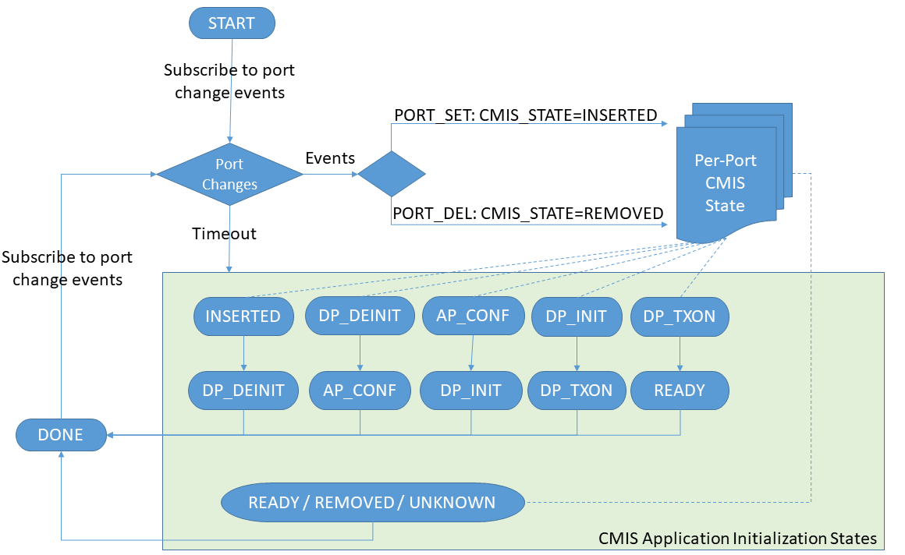

# Feature Name
QSFPDD CMIS support for SONiC

# High Level Design Document
#### Rev 0.1 (Draft)

# Table of Contents
  * [List of Tables](#list-of-tables)
  * [Revision](#revision)
  * [About This Manual](#about-this-manual)
  * [Scope](#scope)
  * [Abbreviation](#abbreviation)
  * [References](#references)
  * [Requirement Overview](#requirement-overview)
  * [Functionality](#functionality)
  * [Design](#design)
  * [Testing](#testing)

# List of Tables
  * [Table 1: Definitions](#table-1-definitions)
  * [Table 2: References](#table-2-references)

# Revision
| Rev |     Date    |       Author        | Change Description                |
|:---:|:-----------:|:-------------------:|-----------------------------------|
| 0.1 | 09/27/2021  | Dante (Kuo-Jung) Su | Initial version                   |

# About this Manual
This document provides general information about the QSFPDD CMIS support for SONiC.

# Scope
This document describes functional behavior of the QSFPDD CMIS support for SONiC.

# Abbreviation

# Table 1: Definitions
| **Term**       | **Definition**                                   |
| -------------- | ------------------------------------------------ |
| pmon           | Platform Monitoring Service                      |
| xcvr           | Transceiver                                      |
| xcvrd          | Transceiver Daemon                               |
| CMIS           | QSFPDD Common Management Interface Specification |
| QSFPDD         | Quad Small Form Factor Pluggable Double Density  |

# References

# Table 2 References

| **Document**                                            | **Location**  |
|---------------------------------------------------------|---------------|
| QSFPDD Common Management Interface Specification (CMIS) | [CMIS5p0.pdf](https://www.google.com/url?sa=t&rct=j&q=&esrc=s&source=web&cd=&cad=rja&uact=8&ved=2ahUKEwiL0pT5gqHzAhWWYisKHWI3CNoQFnoECCIQAQ&url=http%3A%2F%2Fwww.qsfp-dd.com%2Fwp-content%2Fuploads%2F2021%2F05%2FCMIS5p0.pdf&usg=AOvVaw3vUjsBDOeUWoYaMn3KDG_w) |

# Requirement Overview

This document describes functional behavior of the QSFPDD CMIS support in SONiC.

The QSFPDD Common Management Interface Specification (CMIS) version 4.0 was finalized
in May of 2019 and provides a variety of features and support for different transceiver
form factors. From a software perspective, a CMIS application initialization sequence
is now mandatory as per the current dynamic port breakout mode activated. And these is
also a new diagnostic support tha could be useful to SONiC users and developers.

The current SONiC platform API model is such that base classes in **sonic-platform-common**
define a common, platform-independent interface that can be implemented in platform-specific classes.



Unfortunately, the legacy SFP libraries (sonic-sfp) do not provide full featured support for the SFP,
and and vendors are having to fill in implementation gaps for themselves. This is resulting in a lot
of duplicate work being done for things that should be common across platforms.

The goal of this SONIC QSFPDD CMIS support is to

- Provide an unified common SFP parser for the QSFPDD transceivers
- Enhance the **pmon#xcvrd** for the QSFPDD application initialization sequence
- Enhance the **pmon#xcvrd** for the QSFPDD diagnostics loopback controls

## 1.1 Functional Requirements

1. Ability to parse the advertised applications from the transceivers
2. Ability to post the advertised applications to the STATE_DB
3. Ability to decode the current module state from the transceivers
4. Ability to post the current module state to the STATE_DB
5. Ability to decode the error code of the application initialization sequence from the transceivers
6. Ability to post the error code of the application initialization sequence
7. Ability to process the application initialization sequence in multi-thread/process model.
8. Ability to enable / disable the transceiver loopback controls

**Note:**  
The duration of the CMIS application initialization sequence greatly differs from transceivers
to transceivers, while some take 3 seconds for activating the 4x100G mode, some require 15 seconds.
Hence it's mandatory to support multi-threaded/processed models.

## 1.2 Configuration and Management Requirements

1. Show commands to display the QSFPDD EEPROM and DOM information, as described in **Show Commands** section below.

## 1.3 Warm Boot Requirements

Functionality should continue to work across warm boot.
- To support planned system warm boot.
- To support pmon docker restart.

# Functionality

## 2.1 Target Deployment Use Cases
The QSFPDD CMIS support is used to perform application initialization as per the operational
port breakout mode, otherwise the links will be down if the modules is with CMIS v4/v5 firmwares.

### 2.1.1 CMIS loopback Use Cases
The loopback controls at the transceiver layer can quickly be tested
by a remote user to triage either system-side or line-side issues and help isolate failing hardware.

## 2.2 Functional Description

- The **pmon#xcvrd** will detect the module type of the attched transceivers and post the
information to the **STATE_DB**
- If the transceiver is a QSFPDD CMIS module, the **pmon#xcvrd** will activate the desired
application mode as per the current port mode.
- If the transceiver is a QSFPDD CMIS module, the **show interfaces transceiver eeprom**
should display the advertised applications of the transceiver.
- If the transceiver is a QSFPDD CMIS module, the users will be able to enable or disable the
loopbacks at the transceiver layer to triage link issues.
- If the transceiver is a QSFPDD CMIS module, the users will be able to check the state of
the application initialization.

# Design

## 3.1 Overview


### 3.1.1 sonic-platform-daemons

#### 3.1.1.1 sonic-xcvrd (modified)

The transceiver daemon will be enhanced as below:

- Post the QSFP-DD infomration to STATE_DB
- Add a new CMIS task to handle the multiple CMIS initializations in parallel

### 3.1.2 sonic-platform-common

#### 3.1.2.1 sonic_platform_base/sonic_sfp/inf8628.py (modified)

This library will be enhanced as below

- Add support for decoding the advertised applications of the QSFPDD CMIS transceiver
- Add support for decoding the DOM information of the QSFPDD CMIS transceiver

#### 3.1.2.2 sonic_platform_base/sfp_standard.py (new)

This is a new common SFP base class that's supposed to be inherited by the SFP drivers
of the individual platforms, and it will later be refactored when **sfp-refactor** is
open for business.

### 3.1.3 sonic-utilities

#### 3.1.3.1 sfputil (modified)

This utility will be enhanced to support the following features

- Show the current application mode of the QSFPDD CMIS transceiver
- Show the current configuration errors of the QSFPDD CMIS transceiver
- Show the loopback capabilities of the QSFPDD CMIS transceiver
- Enable/Disable the loopback controls provided by the QSFPDD CMIS transceiver

## 3.2 DB Changes

### 3.2.1 CONFIG_DB

No modifications made.

### 3.2.2 APPL_DB

No modifications made.

### 3.2.3 STATE_DB

The **TRANSCEIVER_INFO** table will be extended as below if the transceiver is compliant with CMIS 4.0 onward:

```
  "TRANSCEIVER_INFO|Ethernet0": {
    "type": "hash",
    "value": {
      "application_advertisement": "{1: {'host_if': '400GAUI-8 C2M (Annex 120E)', 'media_if': '400GBASE-DR4 (Cl 124)'}, 2: {'host_if': '100GAUI-2 C2M (Annex 135G)', 'media_if': '100G-FR/100GBASE-FR1 (Cl 140)'}}",
      "cable_length": "0.0",
      "cable_type": "Length SMF(km)",
      "connector": "SN (Mini CS)",
      "connector_type": "SN (Mini CS)",
      "encoding": "N/A",
      "ext_identifier": "N/A",
      "ext_rateselect_compliance": "N/A",
      "hardware_rev": "01",
      "lane_count": "4",
      "manufacturer": "AVAGO",
      "media_type": "sm_media_interface",
      "memory_pages": "['Diagnostic Pages Implemented', 'Page 03h Implemented', 'Bank 0 Implemented']",
      "memory_type": "Paged",
      "model": "AFCT-93DRPHZ-AZ2",
      "module_state": "Ready State",
      "nominal_bit_rate": "N/A",
      "revision_compliance": "4.0",
      "serial": "FD2038FG0FY",
      "specification_compliance": "N/A",
      "type": "QSFP56-DD",
      "type_abbrv_name": "QSFP-DD",
    }
  }
```

## 3.3 CLI

### 3.3.1 Show Commands

The legacy show command, **show interfaces transceiver eeprom**, will be enhanced for QSFPDD support.

```
admin@sonic:~$ show interfaces transceiver eeprom Ethernet0
Ethernet0: SFP EEPROM detected
        Application Advertisement:
                1: 400GAUI-8 C2M (Annex 120E) | 400GBASE-DR4 (Cl 124)
                2: 100GAUI-2 C2M (Annex 135G) | 100G-FR/100GBASE-FR1 (Cl 140)
        Connector: SN (Mini CS)
        Identifier: QSFP56-DD
        Implemented Memory Pages:
                Bank 0 Implemented
                Diagnostic Pages Implemented
                Page 03h Implemented
        Length SMF(km): 0.0
        Module State: Ready State
        Revision Compliance: 4.0
        Vendor Date Code(YYYY-MM-DD Lot): 2020-10-07
        Vendor Name: AVAGO
        Vendor OUI: 00-17-6A
        Vendor PN: AFCT-93DRPHZ-AZ2
        Vendor Rev: 01
        Vendor SN: FD2038FG0FY

admin@sonic:~$ show interfaces transceiver eeprom Ethernet0 --dom
Ethernet0: SFP EEPROM detected
        Application Advertisement:
                1: 400GAUI-8 C2M (Annex 120E) | 400GBASE-DR4 (Cl 124)
                2: 100GAUI-2 C2M (Annex 135G) | 100G-FR/100GBASE-FR1 (Cl 140)
        Connector: SN (Mini CS)
        Identifier: QSFP56-DD
        Implemented Memory Pages:
                Bank 0 Implemented
                Diagnostic Pages Implemented
                Page 03h Implemented
        Length SMF(km): 0.0
        Module State: Ready State
        Revision Compliance: 4.0
        Vendor Date Code(YYYY-MM-DD Lot): 2020-10-07
        Vendor Name: AVAGO
        Vendor OUI: 00-17-6A
        Vendor PN: AFCT-93DRPHZ-AZ2
        Vendor Rev: 01
        Vendor SN: FD2038FG0FY
        ChannelMonitorValues:
                RX1Power: 2.9217dBm
                RX2Power: 1.9984dBm
                RX3Power: -40.0000dBm
                RX4Power: -40.0000dBm
                TX1Bias: 44.9420mA
                TX1Power: 2.8587dBm
                TX2Bias: 47.4440mA
                TX2Power: 3.0211dBm
                TX3Bias: 47.4440mA
                TX3Power: 2.9634dBm
                TX4Bias: 49.9460mA
                TX4Power: 2.7395dBm
        ChannelThresholdValues:
                RxPowerHighAlarm  : 7.5000dBm
                RxPowerHighWarning: 4.4999dBm
                RxPowerLowAlarm   : -10.4001dBm
                RxPowerLowWarning : -6.4016dBm
                TxBiasHighAlarm   : 75.0000mA
                TxBiasHighWarning : 70.0000mA
                TxBiasLowAlarm    : 10.0000mA
                TxBiasLowWarning  : 15.0000mA
                TxPowerHighAlarm  : 6.9999dBm
                TxPowerHighWarning: 3.9999dBm
                TxPowerLowAlarm   : -6.4016dBm
                TxPowerLowWarning : -2.4003dBm
        ModuleMonitorValues:
                Temperature: 27.4336C
                Vcc: 3.2883Volts
        ModuleThresholdValues:
                TempHighAlarm  : 75.0000C
                TempHighWarning: 70.0000C
                TempLowAlarm   : -5.0000C
                TempLowWarning : 0.0000C
                VccHighAlarm   : 3.6300Volts
                VccHighWarning : 3.4650Volts
                VccLowAlarm    : 2.9700Volts
                VccLowWarning  : 3.1350Volts
```

### 3.3.2 Debug Commands

The **sfputil** will be enhanced for CMIS debugging

# Unit Test

- Verify with QSFPDD static and DOM information with **show interface transceiver eeprom**
- Verify with QSFPDD application initialization by **show logging** when reseating the QSFPDD transceiver
- Verify with QSFPDD application initialization by **sfputil**
