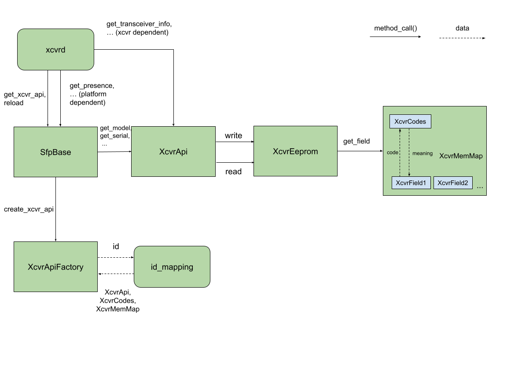
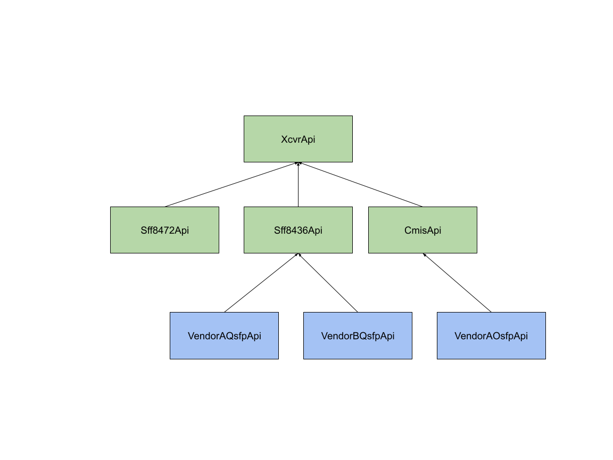
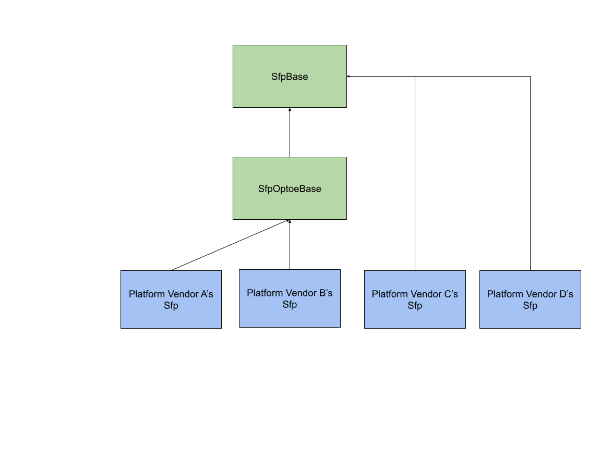
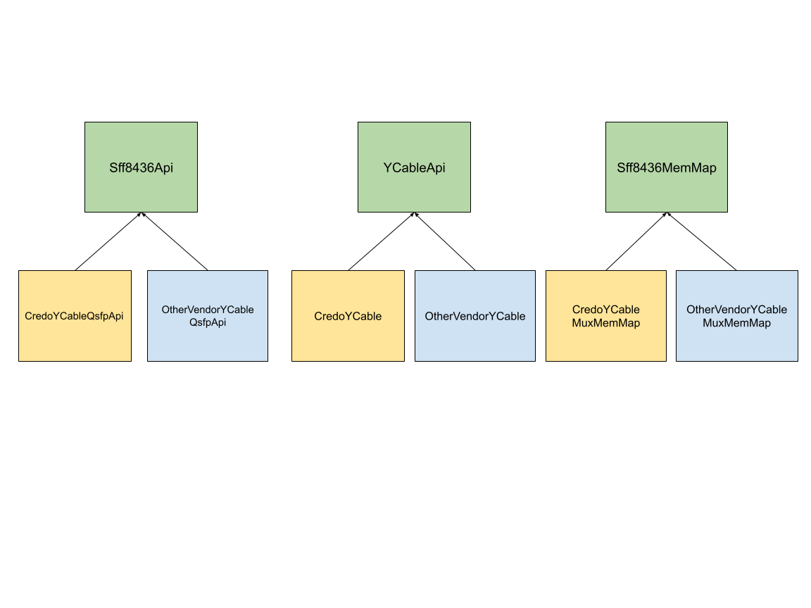

# Sonic_sfp Refactoring

# Table of Contents

- [Sonic_sfp Refactoring](#sonic_sfp-refactoring)
- [Table of Contents](#table-of-contents)
- [Version History](#version-history)
- [Abbreviations & Acronyms](#abbreviations--acronyms)
- [Background](#background)
- [Rationale](#rationale)
- [Requirements](#requirements)
  - [Transceiver Specification Support](#transceiver-specification-support)
    - [Specification Abstraction by Transceiver Vendor](#specification-abstraction-by-transceiver-vendor)
    - [Determining the Correct Transceiver Specification](#determining-the-correct-transceiver-specification)
    - [Vendor Specific Data](#vendor-specific-data)
  - [Common Sfp Platform API Logic](#common-sfp-platform-api-logic)
  - [Other Considerations](#other-considerations)
    - [Y Cable](#y-cable)
    - [Coherent Optics/400G ZR](#coherent-optics400g-zr)
- [Design Scope](#design-scope)
  - [In scope](#in-scope)
  - [Out of scope](#out-of-scope)
- [Design](#design)
  - [File Structure](#file-structure)
  - [XcvrField](#xcvrfield)
  - [XcvrMemMap](#xcvrmemmap)
    - [Vendor Specific Extensions](#vendor-specific-extensions)
  - [XcvrCodes](#xcvrcodes)
    - [Vendor Specific Extensions](#vendor-specific-extensions-1)
  - [XcvrEeprom](#xcvreeprom)
  - [XcvrApi](#xcvrapi)
  - [XcvrApiFactory](#xcvrapifactory)
    - [Identifier Mapping](#identifier-mapping)
      - [Regular Identifier](#regular-identifier)
      - [Vendor Specific Identifier](#vendor-specific-identifier)
  - [SfpBase Modifications](#sfpbase-modifications)
    - [SfpOptoeBase](#sfpoptoebase)
    - [Consequences to Sfp Platform API](#consequences-to-sfp-platform-api)
  - [Y Cable](#y-cable-1)
  - [Coherent Optics/400G ZR](#coherent-optics400g-zr-1)
- [Testing](#testing)
- [Cleanup](#cleanup)


# Version History

<table>
  <tr>
   <td>Version
   </td>
   <td>Date
   </td>
   <td>Description
   </td>
  </tr>
  <tr>
   <td>1.0
   </td>
   <td>February 21, 2021
   </td>
   <td>Initial version
   </td>
  </tr>
  <tr>
   <td>2.0
   </td>
   <td>April 21, 2021
   </td>
   <td>Addressed feedback, revised requirements, design and added deprecation plan
   </td>
  </tr>
  <tr>
   <td>3.0
   </td>
   <td>May 10, 2021
   </td>
   <td>Minor corrections
   </td>
  </tr>
  <tr>
   <td>4.0
   </td>
   <td>June 18, 2021
   </td>
   <td>Minor corrections to reflect current implementation
   </td>
  </tr>
</table>

# Abbreviations & Acronyms


<table>
  <tr>
   <td>Abbreviation / Acronym
   </td>
   <td>Description
   </td>
  </tr>
  <tr>
   <td>xcvr
   </td>
   <td>transceiver
   </td>
  </tr>
</table>


# Background

The Sfp platform API is a common, platform-independent interface for interacting with xcvr modules in SONiC.

The current state of the platform API is such that there is a common abstract SfpBase class in sonic-platform-common/sonic_platform_base package that all vendors inherit from and implement in a platform-specific Sfp class. This follows v2 of the platform API model. 

The initial model, i.e. v1 of the platform API had a SfpUtilBase class that platform vendors would implement a sfputil plugin for, along with several other helper classes that were part of a sonic_sfp package. Although v2 of the platform API is meant to supersede v1, the sonic_sfp package had enough useful common logic to warrant migrating over directly to v2 of the platform API and included under the sonic_platform_base package. 


```
# sonic-platform-common/sonic_platform_base

... # other packages
sonic_sfp/
    sfputilbase.py # defines SfpUtilBase class
    ... # other helper classes

sfp_base.py # defines SfpBase class
... # other base classes
# platform-vendor-A/sonic_platform

sfp.py # defines Sfp class, inheriting from SfpBase
... # other platform-specific derived classes

# platform-vendor-B/sonic_platform

sfp.py # defines Sfp class, inheriting from SfpBase
... # other platform-specific derived classes
```


[Current state of sonic_platform_base](https://github.com/Azure/sonic-platform-common/tree/fa024168a7b7b1f2d798a0af6e83b35aa2b9efb5/sonic_platform_base)

[Example sfputil plugin](https://github.com/Azure/sonic-buildimage/blob/48042b72567281a82cd9eac03593f4d0cc6b9bff/device/mellanox/x86_64-mlnx_msn2700-r0/plugins/sfputil.py#L64) \
[Example platform-specific Sfp implementation](https://github.com/Azure/sonic-buildimage/blob/48042b72567281a82cd9eac03593f4d0cc6b9bff/device/celestica/x86_64-cel_e1031-r0/sonic_platform/sfp.py#L69)

The consequence of this today is that platform vendors are relying on both v1 and v2 of the platform API to varying degrees for xcvr-related features. While v1 has a lot of useful common code, it does have some issues and its usage in the implementation of the v2 model is not clear; this is made evident by many platform vendors having taken on the burden of reimplementing the common code for their v2 Sfp implementation.

The following list describes specifically what the main high level issues are:


*   SfpBase serves as an abstract interface for methods that are both platform dependent and platform independent, which leads to unnecessary burden on platform vendors:
    *   Duplication of logic pertaining to accessing some EEPROM fields (e.g. DOM info) in platform-specific code when it’s available in platform-independent code (SfpUtilBase)
    *   Platform vendors implementing logic for accessing some EEPROM fields (e.g. rx_los) in their own Sfp implementations as it’s not currently available in sonic_sfp, when in fact the logic could be made platform-independent
*   Code associated with the various xcvr specifications (e.g. sff8436.py) and its usage in SfpUtilBase or any of the current platform Sfp implementations is not encapsulated well and results in a lot of repetition that detracts from readability, which would get even worse with support for additional specifications

Example:


```
# sfputilbase.SfpUtilBase.get_transceiver_dom_threshold_info_dict

...
if port_num in self.osfp_ports:
    ...
elif port_num in self.qsfp_ports:
    ...
    transceiver_dom_threshold_info_dict['temphighalarm'] = ...
    transceiver_dom_threshold_info_dict['temphighwarning'] = ...
    transceiver_dom_threshold_info_dict['templowalarm'] = ...
    transceiver_dom_threshold_info_dict['templowwarning'] = ... 
    ...
else:
    ... 
    # Same assignments as above
    transceiver_dom_threshold_info_dict['temphighalarm'] = ...
    transceiver_dom_threshold_info_dict['temphighwarning'] = ...
    transceiver_dom_threshold_info_dict['templowalarm'] = ...
    transceiver_dom_threshold_info_dict['templowwarning'] = ... 
    ...
```


# Rationale

The goal for sonic_sfp (and sonic-platform-common in general) is for it to serve as a home for platform-independent logic and definitions to reduce unnecessary burden on platform vendors. It should also be the only place where support for different xcvr specifications and vendor specific xcvr implementations is added.

With the push for 100% completeness/correctness in vendor platform API implementations, this is now a good opportunity to evaluate exactly what work needs to be done by platform vendors and what work is platform independent. This is also a good opportunity to clean up sonic_sfp and make it more useful for current and future platform vendors. 


# Requirements


## Transceiver Specification Support


### Specification Abstraction by Transceiver Vendor

There needs to be a proper abstraction for each xcvr specification that we support (SFF-8472, SFF-8436, etc.). This abstraction should encapsulate everything specific to a particular specification that may be of relevance, namely:


*   Available xcvr EEPROM fields
*   Location of those fields in the memory map
*   Representation of those fields in the memory map, and how they should be interpreted

With these abstractions, the most that should be exposed to any clients using these abstractions is an API for reading and writing specific fields in the EEPROM according to the associated specification.


### Determining the Correct Transceiver Specification

The correct specification abstraction needs to be selected at runtime to interpret a xcvr’s memory map correctly. This should be done by reading the first byte in the xcvr’s EEPROM, which contains an identifier value whose meaning is specified in Table 4-1 of SFF-8024. There should then be a set of mappings between identifier values and the specifications we support. An exception should be raised if:


*   There is no mapping for the identifier
*   The identifier is ‘00’ (unknown)
*   The identifier falls into the range of identifiers reserved for future standardization

Selection based on the identifier is the required approach because it addresses two cases that would lead to incorrect memory map interpretation with the current approach of selecting based on the xcvr’s port number:


1. Adapters like Mellanox’s QSA allow for one type of module to be plugged into a port designed for a different module type; in the case of QSA it allows a SFP module to be plugged into a QSFP port.
2. Xcvrs may adhere to different specifications depending on the vendor and thus have multiple possible identifiers. For example, QSFP+ modules could identify as ‘0D’ and adhere to SFF-8436 or ‘1E’ and adhere to CMIS.


### Vendor Specific Data

The xcvr specifications indicate that certain types of data (e.g. register bits, fields, or codes) that may be found in the xcvr EEPROM are not explicitly defined by the specification and instead may be set by the xcvr vendor. Although there currently isn’t any vendor specific logic in our codebase, the new design should make it straightforward to add support for such logic. Below are some hypothetical examples of vendor specific edge cases that should be addressed.

Example 1: Vendor A has two different SFP modules. They both have the identifier ‘03’ (SFP) and implement vendor specific fields. There is some commonality between the fields they implement but module 1 also implements field X, whereas module 2 implements field Y and not X.

Example 2: Vendor A has a xcvr with an identifier ‘80’, meaning that the memory map is vendor-specific and does not adhere to any public, non-proprietary standard. Vendor B has a xcvr that shares the same identifier ‘80’, but follows an entirely different specification from Vendor A.


## Common Sfp Platform API Logic

All methods in the Sfp platform API which strictly involve reading or writing xcvr EEPROM fields and are platform independent should be implemented in sonic-platform-common. Platform vendors would then only need to implement a subset of the currently required methods in their platform-specific Sfp classes.


## Other Considerations


### Y Cable

The sonic_y_cable Python package that exists outside of sonic_platform_base consists of a collection of functions for controlling a Credo Y cable. These functions are dependent on SfpBase.read_eeprom and SfpBase.write_eeprom for accessing the Y cable’s QSFP EEPROM.

The new design should be able to easily accommodate a future refactor to integrate the sonic_y_cable package into sonic_sfp. The main requirements to be addressed in the integration are the following:


*   Supporting multiple Y cable vendors, which should align with this refactor: [https://github.com/Azure/SONiC/pull/757](https://github.com/Azure/SONiC/pull/757)
*   Moving the existing functions into a Y cable class, ideally associated with a particular port or Sfp object so that the port number isn’t a required argument in all functions
*   Encapsulating specification-specific details in a similar manner to what was described above to help keep the high level Y cable API readable


### Coherent Optics/400G ZR

There is a need to support 400G ZR modules, a type of coherent optical module, in SONiC. Initial plans are described in [https://github.com/Azure/SONiC/pull/769](https://github.com/Azure/SONiC/pull/769). Such modules can be in QSFP-DD and OSFP form factors and adhere to CMIS/C-CMIS (an extension to CMIS for coherent optics). The main requirements to be addressed are the following:


*   Adding relevant CMIS/C-CMIS register definitions
*   Adding a high level API for controlling these registers


# Design Scope


## In scope


*   Support for xcvrs that adhere to SFF-8436, SFF-8472, and CMIS; namely, SFP, QSFP, and OSFP/QSFP-DD form factors
*   Infrastructure for adding support for other xcvr specifications, including vendor-specific specifications
*   Mechanism for interfacing with the correct specification (on initialization or change event) based on reading xcvr identifier in EEPROM, with the assumption of one xcvr per port
*   Implementation of common Sfp APIs in sonic-platform-common
*   Integration of sonic_y_cable with the new sonic_sfp package
*   Support for coherent optic (400G ZR) xcvrs


## Out of scope


*   Support for other xcvr form factors (e.g. SFP-DD); these will be added when the need arises
*   Full support for hot swapping of xcvrs (some platform dependent work needed)
*   Refactor of sfpshow to better support additional xcvr types
*   Refactor of xcvrd to better support additional xcvr types
*   Any vendor-specific implementation of provided infrastructure (to be done by the vendors)


# Design


## File Structure

The new design will be added as part of a new “sonic_xcvr” package in sonic_platform_base alongside the old sonic_sfp package. The different naming aims to reflect that not all xcvr types have “sfp” in their name (e.g. XFP, CDFP).

The following python file structure shows the intended file organization in the new design.

 


```
# sonic-platform-common/sonic_platform_base

sonic_xcvr/
  fields/             # Everything related to fields
    xcvr_field.py       # XcvrField definition and other useful subtypes
    consts.py           # Field constants, e.g. RX_LOS_FIELD
  codes/              # Everything related to reference codes
    xcvr_codes.py       # Abstraction of reference codes
    public/             # Reference codes available in public domain
      sff8024.py          # SFF-8024 codes
    vendorA/            # Codes for vendor A
      codes_model1.py     # Codes specific to vendor A's model1
    vendorB/            # Codes for vendor B
      codes_model1.py     # Codes specific to vendor B's model1
  mem_maps/           # Everything related to memory maps
    xcvr_mem_map.py     # Abstraction of a memory map
    public/             # Memory maps available in public domain
      sff8436.py          # SFF-8436 memory map
      sff8472.py          # SFF-8472 memory map
      cmis.py             # CMIS memory map
    vendorA/            # Memory maps for vendor A xcvrs
      model_qsfp.py       # Memory map for vendor A QSFP xcvr
      model_sfp.py        # Memory map for vendor A SFP xcvr
    credo/              # Memory maps for Credo xcvrs
      y_cable.py          # Memory map for Credo Y cable's QSFP
  api/                # Everything related to APIs: xcvr APIs, Y cable, APIs, etc.
    xcvr_api.py         # API for all xcvrs
    y_cable_api.py      # API for Y-Cable
    coh_optic_api.py    # API for coherent optics
    public/             # API for xcvrs based on specs in public domain
      sff8436.py          # API for SFF-8436
      sff8472.py          # API for SFF-8472
      cmis.py             # API for CMIS
    vendorA/            # APIs for vendor A only
      model_qsfp.py       # API for vendor A's QSFP xcvr
    credo/              # APIs for Credo
      y_cable_qsfp.py     # Credo Y-Cable QSFP API
      y_cable.py          # Credo Y-Cable API
  xcvr_api_factory.py # Creates XcvrApis 
  xcvr_eeprom.py      # Intermediary between XcvrAPIs and XcvrMemMaps
  sfp_optoe_base.py   # Derives from sfp_base.py; holds common Sfp API optoe-based 
                      # implementations
  id_mapping.py       # Config file to map xcvr IDs to XcvrMemMaps, XcvrCodes, and     
                      # XcvrApis
```


The high-level interaction between the different constructs is illustrated in the following block diagram:




The new design includes several new constructs to support the management of public and vendor-specific xcvr specifications and their usage by the platform API.


## XcvrField

XcvrFields represent something of interest in a memory map that can be encoded or decoded. XcvrFields can have varying sizes, ranging from a single bit to multiple bytes. To deal with this, the XcvrField class described below has three main subtypes:  


1. RegBitField: a field occupying a bit in the memory map
2. RegField: a field occupying one or more bytes in the memory map, but is logically meant to be interpreted as one entity, e.g. a 4-byte integer
3. RegGroupField: a field occupying one or more bytes in the memory map, logically representing 1 or more RegFields that exist contiguously in memory that may be interpreted as distinct entities, e.g. a 4-byte integer followed by a 16-byte string

The RegField type has several subtypes to handle the various field types commonly seen in xcvr specs: 
*   NumberRegField: interpret byte(s) as a number
*   StringRegField: interpret byte(s) as a string
*   CodeRegField: interpret byte as a code
*   HexRegField: interpret byte(s) as a series of hex pairs

The exact encoding or decoding behaviour will depend on the XcvrField, but it should always be the case that encode()/decode() are inverses of each other, i.e. val == decode(encode(val)), where val is some high level data appropriate for the XcvrField. The exception to this would be if a field is read-only or any other situation where adding support for writing would not make sense (such as for a RegGroupField), in which case encode() would not be implemented. 


```
# fields/xcvr_field.py

class XcvrField(object):
    def __init__(self, name, offset, ro):
        ...

    def get_fields(self):
        """
        Return a dict of all fields nested within this field
        """

    def get_size(self):
        """
        Size of field in bytes (min. 1)
        """

    def get_offset(self):
        """
        Byte offset of field in memory map
        """
    
    def read_before_write(self):
        """
        Helper to check if a field needs to be read before written to.
        True for RegBitField, false for others
        """

    def decode(self, raw_data):
        """
        raw_data: bytearray of length equal to size of field
        Return: decoded data (high level meaning)
        """
        
    def encode(self, val, raw_state=None):
        """
        val: data with high level meaning
        raw_state: bytearray denoting the current state of memory for this field
        Return: bytearray of length equal to size of field

        Not implemented if not appropriate for the field (e.g. read-only)
        """


class RegBitField(XcvrField):
"""
    Must be defined under a parent reg

Attributes:
    offset: offset of parent reg
    size: 1
    bitpos: position of bit (0-7)
    parent: reference to parent field that this field is defined under
"""
    ...

class RegField(XcvrField):
"""
Attributes:
    fields: 0 or more RegBitFields (max: 8 * size)
    size: provided in constructor
    offset: provided in constructor
"""
    ...

class RegGroupField(XcvrField):
"""
Attributes:
    fields: 1 or more Regfield-derived fields
    offset: offset of first member field
    size: sums of size of all member fields
"""
    ...

### other common XcvrField types ###

class NumberRegField(RegField):
"""
Attributes:
    scale: amount to divide a register value by to get the desired unit
        e.g. if register is in increments of 0.01 units then scale would be 100
    format: format string denoting the byte order and type of the number
        Specified as xy, where x is the byte order and y is the format char
        See https://docs.python.org/3/library/struct.html for examples
        E.g. big-endian 4-byte unsigned integer would be ">I"
"""
    ...

class StringRegField(RegField):
"""
Attributes:
    encoding: the encoding used for the string, e.g. ASCII
    format: format string denoting the byte order and size of the string
        Specified as xy, where x is the byte order and y is the format char
        See https://docs.python.org/3/library/struct.html for examples
        E.g. big-endian 16-byte string would be ">16s"
            
"""
    ...

class CodeRegField(RegField):
"""
Attributes:
    code_dict: Dictionary mapping codes to some meaning
"""
    ...

class HexRegField(RegField):
    ... 


```


## XcvrMemMap

XcvrMemMaps represent the memory maps in xcvr specifications. They contain any number of XcvrFields that are defined according to the relevant specification. Anything described in the memory map or memory organization of a xcvr specification should be put in the appropriate XcvrMemMap class.


```
# mem_maps/xcvr_mem_map.py

class XcvrMemMap(object):
    def __init__(self, codes):
        ...

    def get_field(self, field_name):
        # Return a XcvrField, exception if not found

# mem_maps/sff8436.py

class Sff8436MemMap(XcvrMemMap):
    def __init__(self, codes):
        super(Sff8436MemMap, self).__init__(codes)

        self.TX_FAULT = NumberRegField(TX_FAULT_FIELD, offset=4,
            RegBitField(“Tx1Fault”, bit=0),
            RegBitField(“Tx2Fault”, bit=1),
            RegBitField(“Tx3Fault”, bit=2),
            RegBitField(“Tx4Fault”, bit=3)
        )

        ...


# mem_maps/sff8472.py

class Sff8472MemMap(XcvrMemMap):
    def __init__(self, codes):
        super(Sff8472MemMap, self).__init__(codes)

        self.TX_FAULT = NumberRegField(TX_FAULT_FIELD, offset=110,
            RegBitField(“TxFaultState”, bit=2)
        )

        ...

```


### Vendor Specific Extensions

To provide field definitions for vendor-specific memory regions, vendors can extend the appropriate MemMap class and define vendor-specific fields just like regular fields.


```
# mem_maps/vendorA/model_qsfp.py

class VendorAQsfpMemMap(SFF8436MemMap):
    self.VENDOR_A_SPECIFIC_REG = NumberRegField(VENDOR_SPECIFIC_FIELD, 8)
    ...

# mem_maps/vendorA/model_sfp.py

class VendorASfpMemMap(SFF8472MemMap):
    self.VENDOR_A_SPECIFIC_REG = NumberRegField(VENDOR_SPECIFIC_FIELD, 120)
    ...


```


## XcvrCodes

The SFF-8024 specification lists several tables of codes that are referenced by many of the xcvr specifications. The Sff8024 class is used to hold all of these tables in a similar manner to what the current sff8024.py module does.


```
# codes/codes.py

class XcvrCodes(object):
    ... 

# codes/public/sff8024.py

class Sff8024(XcvrCodes):
    XCVR_IDENTIFIERS = {
        '00': 'Unknown or unspecified',
        '01': 'GBIC',
        ...
    }

    CONNECTORS = {
        '00': 'Unknown or unspecified',
        '01': 'SC',
        ...
    }

    ...
    
```

There are some codes that are specific to a xcvr specification. For these, a class that inherits from Sff8024 will be used to define the codes.

```
# codes/public/cmis.py

class CmisCodes(Sff8024):
    MODULE_STATUS = {
        1: “ModuleLowPwr”,
        2: “ModulePwrUp”,
        3: “ModuleReady”,
        4: “ModulePwrDn”,
        5: “Fault”
    }
    
    ...
    
```


### Vendor Specific Extensions

Several of the code tables in SFF-8024 include code ranges that are vendor-specific. To support vendor-specific codes, vendors can derive from the SFF8024 class:


```
# codes/vendorA/sff8024_model1.py

class VendorAModel1Codes(Sff8024):
    CONNECTORS = {
        ...
    }
    ...

# codes/vendorB/sff8024_model1.py

class VendorBModel1Codes(Sff8024):
    CONNECTORS = {
        ...
    }

    ...

```


## XcvrEeprom

XcvrEeprom acts as an intermediary between XcvrApi and XcvrMemMap. It takes in a reader and writer (expected to be the read_eeprom and write_eeprom functions in the Sfp platform API), as well as a XcvrMemMap. As shown below, XcvrMemMap is used to lookup a XcvrField, from which the necessary parameters for reading/writing can be obtained.


```
# xcvr_eeprom.py

class XcvrEeprom(object):
   def __init__(self, reader, writer, mem_map):
      ...

   def read(self, field_name):
      """
      Read a value from a field in EEPROM

      Args:
         field_name: a string denoting the XcvrField to read from

      Returns:
         The value of the field, if the read is successful and None otherwise
      """
      field = self.mem_map.get_field(field_name)
      raw_data = self.reader(field.get_offset(), field.get_size())
      return field.decode(raw_data) if raw_data is not None else None

   def write(self, field_name, value):
      """
      Write a value to a field in EEPROM

      Args:
         field_name: a string denoting the XcvrField to write to

         value:
            The value to write to the EEPROM, appropriate for the given field_name

      Returns:
         Boolean, True if the write is successful and False otherwise
      """
      ...

```


## XcvrApi

XcvrApi represents a common interface for all xcvr EEPROM operations. This separate, platform-independent hierarchy, existing alongside SfpBase and its implementations, allows for xcvr EEPROM related features to be added without affecting SfpBase. It forms an additional set of functionalities that can be accessed by xcvrd.



For each xcvr spec in the public domain there will be a XcvrApi that goes with it. Xcvr vendors can extend the appropriate public XcvrApi and provide custom functionality.


```
# api/xcvr_api.py

class XcvrApi(object):
    def __init__(self, xcvr_eeprom):
        ...

    def get_temperature(self):
        raise NotImplementedError

    def get_model(self):
        raise NotImplementedError

    def get_serial(self):
        raise NotImplementedError

    def get_transceiver_info(self):
        raise NotImplementedError

    def get_y_cable_api(self):
        raise NotImplementedError

    def get_coherent_optic_api(self):
        raise NotImplementedError

    ...

# api/public/sff8436.py

class Sff8436Api(XcvrApi):
    def __init__(self, xcvr_eeprom):
        super(Sff8436Api, self).__init__(xcvr_eeprom)

    def get_temperature(self):
        return self.xcvr_eeprom.read(TEMPERATURE_FIELD)

    def get_model(self):
        return self.xcvr_eeprom.read(MODEL_FIELD)

    def get_serial(self):
        ...

    def get_transceiver_info(self):
        ...


    ...

# api/vendorA/custom_qsfp.py

class VendorAQsfpApi(Sff8436Api):
    def __init__(self, xcvr_eeprom):
        super(Sff8436Api, self).__init__(xcvr_eeprom)

    def get_transceiver_info(self):
        # Override; call self._get_custom_field_X in implementation
        ...

    def _get_custom_field_X(self):
        return self.xcvr_eeprom.read(CUSTOM_FIELD_X)

    ...
```


## XcvrApiFactory

XcvrApiFactory is used by SfpBase to create the correct XcvrApi based on whatever xcvr module is currently plugged in. It provides create_xcvr_api(), which handles this task when called.


```
# xcvr_api_factory.py

import id_mapping

class XcvrApiFactory(object):
    def __init__(self, reader, writer):
        ...

    def _get_id(self):
        # Read first EEPROM byte

    # Other helper methods...

    def create_xcvr_api(self):
        # Run some logic to select the correct XcvrApi, XcvrCodes, and XcvrMemMap
        # ...
        # xcvr_eeprom = XcvrEeprom(self.reader, self.writer, mem_map)
        # return xcvr_api(xcvr_eeprom)
```


### Identifier Mapping

A xcvr identifier is mapped to the appropriate XcvrApi, XcvrCodes, and XcvrMemMap, via the structure defined in id_mapping.py, shown below.


```
# id_mapping.py

{
  "identifiers": {
    "03": {
      "public": {
        "mem_map": "mem_maps.sff8472.SFF8472MemMap", 
        "codes": "codes.sff8024.Sff8024",
        "api": "api.sff8472.Sff8472Api",
      },
      "vendorA": {
        "model1": {
          "mem_map": "mem_maps.vendorA.sff8472_model1.Model1MemMap", 
          "codes": "codes.vendorA.sff8024_model1.Model1Codes",
          "api": "api.vendorA.sff8472_model1.Model1Api",
        }, 
        "model2": {
          "mem_map": "mem_maps.vendorA.sff8472_model2.Model2MemMap", 
          "codes": "codes.vendorA.sff8024_model2.Model2Codes",
          "api": "api.vendorA.sff8472_model2.Model2Api",
        }
      }, 
      "vendorB": {
          ...
      }
    }, 
    "0D": {
      "public": {
        "mem_map": "...", 
        "codes": "..."
        "api": "..."
      },
      "vendorA": {
          "..."
      }
    }
    "80": {
      # No "public" key since "80" is vendor-specific
      "vendorY": "...", 
      "vendorX": "..."
    }, 
  }
}

```


The mapping is organized at the top level according to possible identifier values, which range from 0x00 to 0xFF. A particular mapping for a given identifier provides 1 or more dotted paths to Python classes that are subclasses of XcvrApi, XcvrCodes, and XcvrMemMap. Identifiers which are listed in SFF-8024 and included in this mapping must have a “public” key, which provides a mapping to class definitions corresponding to a public specification (e.g. SFF-8436). Vendors providing their own custom classes under a particular identifier do so under a key corresponding to the vendor’s name, which must correspond to what would be read from EEPROM. Mappings under the vendor name are further split according to model/part number, which again must correspond to what would be read from EEPROM. 

The high-level lookup logic after an identifier is read can be described as follows, based on whether the identifier is a “regular” identifier (listed in SFF-8024) or is a vendor-specific identifier. Note: “vendor ID” refers collectively to vendor name and model/part number.


#### Regular Identifier


1. Lookup “public” XcvrMemMap
2. Initialize XcvrMemMap
3. Retrieve vendor ID via XcvrMemMap
4. Lookup mapping for vendor-specific definitions based on vendor ID
5. If vendor-specific classes are found, use them instead  
6. Else, proceed with currently initialized classes


#### Vendor Specific Identifier


1. Look up possible XcvrMemMaps associated with the identifier
2. For each XcvrMemMap found
    1. Initialize XcvrMemMap
    2. Retrieve vendor ID via XcvrMemMap
    3. Compare retrieved vendor ID with expected vendor ID (according to the mapping definition)
    4. If match, we’re done; proceed with currently initialized XcvrMemMap
    5. Else, continue with next XcvrMemMap


## SfpBase Modifications

SfpBase will gain two new methods in the new design: reload() and get_xcvr_api(). Both will be called by xcvrd.


*   reload() will be called at boot time (when the chassis constructs the SfpBase-derived objects) and on transceiver change events by xcvrd. Purpose is to update the XcvrApi in SfpBase for subsequent xcvr EEPROM-related operations.
*   get_xcvr_api() is called by xcvrd to get a reference to the XcvrApi associated with the SfpBase object. The return value is based on the most recent call to reload(); that is, if a call to reload() occurs, get_xcvr_api() must be called again to get the correct XcvrApi. 

```
# sonic-platform-common/sonic_platform_base/sfp_base.py

class SfpBase(device_base.DeviceBase):
    def __init__(self):
        self.xcvr_api_factory = XcvrApiFactory(self.read_eeprom, self.write_eeprom)
        self.reload()

    def reload(self):
        # Called at init or when new Sfp inserted
        self.xcvr_api = self.xcvr_api_factory.create_xcvr_api()

    def get_xcvr_api(self):
        return self.xcvr_api

    ... 

```


### SfpOptoeBase

The long-term plan for this refactor is to have SfpBase primarily be an interface for functionality that is expected to vary across platforms and thus would need to be implemented by platform vendors. This means that methods like get_temperature, get_transceiver_info(), etc. from SfpBase that are xcvr EEPROM-related and whose implementations are not actually platform dependent will get moved to XcvrApi.

In the short-term, the methods will be kept in SfpBase. A new class, SfpOptoeBase, will inherit SfpBase and implement these methods simply by deferring to XcvrApi. Platform vendors that wish to make use of SfpOptoeBase will create an Sfp class that inherits from SfpOptoeBase rather than SfpBase; this is illustrated below by platform vendor A and B’s Sfp classes. Vendors that continue inheriting from SfpBase (vendors C and D) can continue to do so without being affected negatively. 



SfpOptoeBase will also implement read_eeprom and write_eeprom, since for platforms that rely on optoe for xcvr EEPROM access the only aspect that is platform dependent is the mapping between front panel ports and the EEPROM file path; for this a new method, get_port_to_eeprom_mapping, will need to be implemented.


```
# sfp_optoe_base.py

class SfpOptoeBase(SfpBase):
    def __init__(self):
        SfpBase.__init__(self)
    ...

    def get_rx_los(self):
        return self.xcvr_api.get_rx_los()

    def get_tx_fault(self):
        return self.xcvr_api.get_tx_fault()
    
    def tx_disable(self, tx_disable):
        return self.xcvr_api.tx_disable(tx_disable)

    ...

    def get_eeprom_path(self):
        raise NotImplementedError

    def read_eeprom(self, offset, numbytes):
        # Use get_eeprom_path
        ...

    def write_eeprom(self, offset, numbytes, write_buffer):
        # Use get_eeprom_path
        ...

```


### Consequences to Sfp Platform API

With the new design, platform vendors that inherit from SfpOptoeBase instead of SfpBase directly for their Sfp implementation would **not** need to implement the following methods, as they all involve EEPROM access:


*   DeviceBase.get_model
*   DeviceBase.get_serial
*   SfpBase.get_transceiver_info
*   SfpBase.get_transceiver_bulk_status
*   SfpBase.get_transceiver_threshold_info
*   SfpBase.get_rx_los*
*   SfpBase.get_tx_fault*
*   SfpBase.get_tx_bias
*   SfpBase.get_temperature
*   SfpBase.get_voltage
*   SfpBase.get_tx_power
*   SfpBase.get_rx_power
*   SfpBase.get_tx_disable*
*   SfpBase.get_tx_disable_channel
*   SfpBase.tx_disable*
*   SfpBase.get_power_override
*   SfpBase.set_power_override
*   SfpBase.read_eeprom**
*   SfpBase.write_eeprom**

Thus, the Sfp API that platform vendors would need to implement would include the following methods:

*   DeviceBase.get_name
*   DeviceBase.get_presence
*   DeviceBase.is_replaceable
*   DeviceBase.get_status
*   SfpBase.reset
*   SfpBase.get_reset_status
*   SfpBase.get_lpmode
*   SfpBase.set_lpmode
*   SfpOptoeBase.get_eeprom_path**

\* Some xcvr form factors have the corresponding IO pins that can be read from/written to as an alternative to accessing EEPROM for implementing these methods. However, controlling these pins is platform dependent and so platform vendors would need to override these methods with the appropriate logic.

** Platform vendors that don’t use optoe would need to implement read_eeprom and write_eeprom instead of get_eeprom_path.

## Y Cable

Similar to what is proposed in [https://github.com/Azure/SONiC/pull/757](https://github.com/Azure/SONiC/pull/757), there will be a common base class for Y cable functionality. It will accept a XcvrEeprom for read and write operations, but leave the API implementation up to Y cable vendors.


```
# api/y_cable_api.py

class YCableApi(object):

    def __init__(self, xcvr_eeprom):
        ...

    def toggle_mux_to_torA(self):
        raise NotImplementedError

    def toggle_mux_to_torB(self):
        raise NotImplementedError

    def check_mux_direction(self):
        raise NotImplementedError

    ...

```


The following diagram and steps describe what a vendor must do to add support for their particular Y cable. 



1. Extend the appropriate XcvrMemMap class, defining XcvrFields according to their Y cable spec.

```
# mem_maps/credo/y_cable.py

class CredoYCableMuxMemMap(SFF8436MemMap):
    ...
    self.SWITCH_MUX_DIRECTION = NumberRegField(name=SWITCH_MUX_DIRECTION_FIELD, offset=642)
    self.MUX_DIRECTION = NumberRegField(name=MUX_DIRECTION_FIELD, offset=644)
    ...

# mem_maps/othervendor/y_cable.py

class OtherVendorYCableMuxMemMap(SFF8436MemMap):
    ...
    self.SWITCH_MUX_DIRECTION = NumberRegField(name=SWITCH_MUX_DIRECTION_FIELD, offset=700)
    self.MUX_DIRECTION = NumberRegField(name=MUX_DIRECTION_FIELD, offset=702)
    ...

```


2. Extend the YCableApi class with an implementation of the Y cable API.

```
# api/credo/y_cable.py

class CredoYCable(YCableApi):
    def __init__(self, xcvr_eeprom):
        super(CredoYCable, self).__init__(xcvr_eeprom)

    def toggle_mux_to_torA(self):
        return self.xcvr_eeprom.write(SWITCH_MUX_DIRECTION_FIELD, 2)

    def toggle_mux_to_torB(self):
        return self.xcvr_eeprom.write(SWITCH_MUX_DIRECTION_FIELD, 3)

    def check_mux_direction(self):
        return self.xcvr_eeprom.read(MUX_DIRECTION_FIELD)

    def _get_credo_custom_field(self):
        return self.xcvrEeeprom.read(CREDO_CUSTOM_FIELD)

    ...

# api/othervendor/y_cable.py

class OtherVendorYCable(YCableApi):
    def __init__(self, xcvr_eeprom):
        super(OtherVendorYCable, self).__init__(xcvr_eeprom)

    def toggle_mux_to_torA(self):
        return self.xcvr_eeprom.write(SWITCH_MUX_DIRECTION_FIELD, 1)

    def toggle_mux_to_torB(self):
        return self.xcvr_eeprom.write(SWITCH_MUX_DIRECTION_FIELD, 2)

    def check_mux_direction(self):
        return self.xcvr_eeprom.read(MUX_DIRECTION_FIELD)

    def _get_other_vendor_custom_field(self):
        return self.xcvrEeeprom.read(OTHER_VENDOR_CUSTOM_FIELD)

    ...

```


3. Extend the appropriate XcvrApi class, overriding get_y_cable_api to return an instance of the YCableApi-derived class.

```
# api/credo/y_cable_qsfp.py

class CredoYCableQsfpApi(Sff8436Api):
    ...
    
    def get_y_cable_api(self):
        return CredoYCable(self.xcvr_eeprom)
    ...


# api/othervendor/y_cable_qsfp.py

class OtherVendorYCableQsfpApi(Sff8436Api):
    ...

    def get_y_cable_api(self):
        return OtherVendorYCable(self.xcvr_eeprom)
    ...

```


4. Update id_mapping.py with an entry for the Y cable. Note that the “api” entry here would be for the XcvrApi-based implementation, not the YCableApi implementation.

```
# id_mapping.py

{
  "identifiers": {
    ...
    "0D": {
      "public": {
        ...
      },
      "credo": {
        "model1": {
          "mem_map": "mem_maps.credo.y_cable.CredoYCableMuxMemMap", 
          "api": "api.credo.y_cable_qsfp.CredoYCableQsfpApi",
        }, 
      }, 
      "othervendor": {
        "model1": {
          "mem_map": "mem_maps.othervendor.y_cable.OtherVendorYCableMuxMemMap", 
          "api": "api.othervendor.y_cable_qsfp.OtherVendorYCableQsfpApi",
        },
      }
    }
  ... 
  }
}

```


## Coherent Optics/400G ZR

The appropriate register definitions can be defined as XcvrFields in the XcvrMemMap for CMIS, CmisMemMap. Any definitions from C-CMIS would also be included under CmisMemMap.


```
# mem_maps/public/cmis.py

PAGE_SIZE = 128

def get_addr(page, offset):
    return PAGE_SIZE * page + offset

class CmisMemMap(XcvrMemMap):
    ...

    self.PM_ADVERTISING = RegGroupField(PM_ADVERTISING_FIELD,
        NumberRegField(RX_BITS_FIELD, offset=get_addr(0x42, 128),
            RegBitField(RX_BITS_PM_IMPL_FIELD, bit=4)
            RegBitField(RX_BITS_SUB_INT_PM_IMPL_FIELD, bit=3),
            RegBitField(RX_CORR_BITS_PM_IMPL_FIELD, bit=2),
            RegBitField(RX_MIN_CORR_BITS_SUB_INT_PM_IMPL_FIELD, bit=1),
            RegBitField(RX_MAX_CORR_BITS_SUB_INT_PM_IMPL_FIELD, bit=0),
        ),
        NumberRegField(RX_FRAMES_FIELD, offset=get_addr(0x42, 129),
            ...
        ),
        ...

    ...

```


The high-level API for using these definitions will form a new class, CoherentOpticApi. It will depend on XcvrEeprom for performing EEPROM accesses, similar to YCableApi and XcvrApi.


```
# api/coh_optic_api.py

class CoherentOpticApi(object):
    def __init__(self, xcvr_eeprom):
        ...

    def get_media_lane_link_pm(self):
        ...

    ...
```


 \
In XcvrApi, we define a get_coherent_optic_api method. For non-CMIS XcvrAPIs this will return None, but for CMIS the method will return an instance of CoherentOpticApi if the underlying xcvr module is a coherent optic module (for now, if it is 400G ZR). \


```
# api/public/cmis.py

class CmisApi(XcvrApi):
    ...

    def _is_coherent_optic(self):
        ...

    def get_coherent_optic_api(self):
        api = None
        if self._is_coherent_optic():
            api = CoherentOpticApi(self.xcvr_eeprom)
        return apie

    ...
```


# Testing

Testing for the new design will include relevant unit tests for the new components (e.g. XcvrFields and XcvrMemMaps). These unit tests will go under the sonic-platform-common “tests” package. Detection of regressions after all cleanup is done as part of the refactor will primarily be achieved through existing Sfp platform API tests. Proper functioning of dependencies on Sfp code, like sfp-related CLIs (sfputil, sfpshow) and xcvrd, will also be verified.


# Cleanup

The following table lists existing files or tools that are of potential interest for the refactor after the new design is in place.


<table>
  <tr>
   <td>File
   </td>
   <td>Description
   </td>
   <td>Dependencies
   </td>
   <td>Plan
   </td>
  </tr>
  <tr>
   <td colspan="4" >sonic_sfp
   </td>
  </tr>
  <tr>
   <td>bcmshell.py
   </td>
   <td>Class used to connect to a BCM diag shell; currently only used by Inventec platforms
   </td>
   <td>None
   </td>
   <td>No change
   </td>
  </tr>
  <tr>
   <td>inf8628.py
   </td>
   <td>Parser class for CMIS
   </td>
   <td>sff8024.py,
<p>
sffbase.py
   </td>
   <td>Remove file when all platform vendors are no longer using it
   </td>
  </tr>
  <tr>
   <td>qsfp_dd.py
   </td>
   <td>Parser class for CMIS
   </td>
   <td>sff8024.py, sffbase.py
   </td>
   <td>Remove file when all platform vendors are no longer using it
   </td>
  </tr>
  <tr>
   <td>sff8024.py
   </td>
   <td>Module that defines codes from SFF-8024
   </td>
   <td>None
   </td>
   <td>Moved and refactored according to new design
   </td>
  </tr>
  <tr>
   <td>sff8436.py
   </td>
   <td>Parser class for SFF-8436
   </td>
   <td>sff8024.py, sffbase.py
   </td>
   <td>Moved and refactored according to new design
   </td>
  </tr>
  <tr>
   <td>sff8472.py
   </td>
   <td>Parser class for SFF-8472
   </td>
   <td>sff8024.py, sffbase.py
   </td>
   <td>Moved and refactored according to new design
   </td>
  </tr>
  <tr>
   <td>sffbase.py
   </td>
   <td>Base parser class for xcvr specs
   </td>
   <td>None
   </td>
   <td>Remove file when all platform vendors are no longer using it
   </td>
  </tr>
  <tr>
   <td>sfputilbase.py
   </td>
   <td>Base class for sfp plugins
   </td>
   <td>sff8436.py, sff8472.py, inf8628.py
   </td>
   <td>Remove file when all platform vendors are no longer using it (via sfputil plugin)
   </td>
  </tr>
  <tr>
   <td>sfputilhelper.py
   </td>
   <td>Helper functions relating to logical and physical port mappings
   </td>
   <td>None
   </td>
   <td>No change
   </td>
  </tr>
  <tr>
   <td>sonic_y_cable
   </td>
   <td colspan="3" >
   </td>
  </tr>
  <tr>
   <td>y_cable.py
   </td>
   <td>Functions for controlling Credo Y cable
   </td>
   <td>sonic_platform.platform
   </td>
   <td>Moved and refactored according to new design
   </td>
  </tr>
  <tr>
   <td colspan="4" >Xcvrd
   </td>
  </tr>
  <tr>
   <td>xcvrd.py
   </td>
   <td>Xcvr daemon functionality
   </td>
   <td>sfputilbase.py,
<p>
sfputilhelper.py,
<p>
y_cable_helper.py
   </td>
   <td>Add enhancement to make use of YCable per Sfp instance according to new design
<p>
Remove backwards compatibility with sfputil plugins
   </td>
  </tr>
  <tr>
   <td>y_cable_helper.py
   </td>
   <td>Helper utilities for configuring Y cable for xcvrd
   </td>
   <td>y_cable.py
   </td>
   <td>Update to use new Y cable API
   </td>
  </tr>
  <tr>
   <td colspan="4" >Sfp CLI
   </td>
  </tr>
  <tr>
   <td>sfputil
   </td>
   <td>CLI that retrieves xcvr-related data directly from xcvrs via SfpUtilBase-derived plugins
   </td>
   <td>sfputilbase.py in sonic_sfp, platform-specific sfputil plugins
   </td>
   <td>Remove
   </td>
  </tr>
  <tr>
   <td>sfpshow
   </td>
   <td>CLI that retrieves xcvr-related data from STATE_DB. Currently only supports reading DB info for SFP and QSFP xcvrs
   </td>
   <td>STATE_DB
   </td>
   <td>No changes
   </td>
  </tr>
  <tr>
   <td>show interface transceiver
   </td>
   <td>CLI that calls sfputil and sfpshow commands under the hood
   </td>
   <td>sfputil, sfpshow
   </td>
   <td>No changes
   </td>
  </tr>
  <tr>
   <td colspan="4" >sonic-mgmt
   </td>
  </tr>
  <tr>
   <td>test_sfp.py
   </td>
   <td>Tests for SFP CLI
   </td>
   <td>sfputil, show interface transceiver, 
   </td>
   <td>Remove tests for sfputil
   </td>
  </tr>
</table>


# Summary

The following table lists out all files that will be added/removed/modified as part of the refactor.

The removal of the specified files will occur when there are no longer any dependencies on those files, which would require a full migration to the new design. 


<table>
  <tr>
   <td>File
   </td>
   <td>Change
   </td>
  </tr>
  <tr>
   <td>sonic-platform-common/sonic_xcvr/fields/field.py
   </td>
   <td>Add
   </td>
  </tr>
  <tr>
   <td>sonic-platform-common/sonic_xcvr/fields/consts.py
   </td>
   <td>Add
   </td>
  </tr>
  <tr>
   <td>sonic-platform-common/sonic_xcvr/codes/xcvr_codes.py
   </td>
   <td>Add
   </td>
  </tr>
  <tr>
   <td>sonic-platform-common/sonic_xcvr/codes/public/sff8024.py
   </td>
   <td>Add
   </td>
  </tr>
  <tr>
   <td>sonic-platform-common/sonic_xcvr/mem_maps/xcvr_mem_map.py
   </td>
   <td>Add
   </td>
  </tr>
  <tr>
   <td>sonic-platform-common/sonic_xcvr/mem_maps/public/sff8436.py
   </td>
   <td>Add
   </td>
  </tr>
  <tr>
   <td>sonic-platform-common/sonic_xcvr/mem_maps/public/sff8472.py
   </td>
   <td>Add
   </td>
  </tr>
  <tr>
   <td>sonic-platform-common/sonic_xcvr/mem_maps/public/cmis.py
   </td>
   <td>Add
   </td>
  </tr>
  <tr>
   <td>sonic-platform-common/sonic_xcvr/mem_maps/credo/y_cable.py
   </td>
   <td>Add
   </td>
  </tr>
  <tr>
   <td>sonic-platform-common/sonic_xcvr/api/xcvr_api.py
   </td>
   <td>Add
   </td>
  </tr>
  <tr>
   <td>sonic-platform-common/sonic_xcvr/api/y_cable_api.py
   </td>
   <td>Add
   </td>
  </tr>
  <tr>
   <td>sonic-platform-common/sonic_xcvr/api/coh_optic_api.py
   </td>
   <td>Add
   </td>
  </tr>
  <tr>
   <td>sonic-platform-common/sonic_xcvr/api/public/sff8436.py
   </td>
   <td>Add
   </td>
  </tr>
  <tr>
   <td>sonic-platform-common/sonic_xcvr/api/public/sff8472.py
   </td>
   <td>Add
   </td>
  </tr>
  <tr>
   <td>sonic-platform-common/sonic_xcvr/api/public/cmis.py
   </td>
   <td>Add
   </td>
  </tr>
  <tr>
   <td>sonic-platform-common/sonic_xcvr/api/credo/y_cable_qsfp.py
   </td>
   <td>Add
   </td>
  </tr>
  <tr>
   <td>sonic-platform-common/sonic_xcvr/api/credo/y_cable.py
   </td>
   <td>Add
   </td>
  </tr>
  <tr>
   <td>sonic-platform-common/sonic_xcvr/xcvr_api_factory.py
   </td>
   <td>Add
   </td>
  </tr>
  <tr>
   <td>sonic-platform-common/sonic_xcvr/xcvr_eeprom.py
   </td>
   <td>Add
   </td>
  </tr>
  <tr>
   <td>sonic-platform-common/sonic_xcvr/sfp_optoe_base.py
   </td>
   <td>Add
   </td>
  </tr>
  <tr>
   <td>sonic-platform-common/sonic_xcvr/id_mapping.py
   </td>
   <td>Add
   </td>
  </tr>
  <tr>
   <td>sonic-platform-common/sonic_xcvr/test_xcvr_field.py
   </td>
   <td>Add
   </td>
  </tr>
  <tr>
   <td>sonic-platform-common/sonic_xcvr/test_cmis.py
   </td>
   <td>Add
   </td>
  </tr>
  <tr>
   <td>sonic-platform-common/sonic_xcvr/test_sff8436.py
   </td>
   <td>Add
   </td>
  </tr>
  <tr>
   <td>sonic-platform-common/sonic_xcvr/test_sff8636.py
   </td>
   <td>Add
   </td>
  </tr>
  <tr>
   <td>sonic-platform-common/sonic_xcvr/test_sff8472.py
   </td>
   <td>Add
   </td>
  </tr>
  <tr>
   <td>sonic-platform-common/sonic_sfp/inf8628.py
   </td>
   <td>Remove
   </td>
  </tr>
  <tr>
   <td>sonic-platform-common/sonic_sfp/qsfp_dd.py
   </td>
   <td>Remove
   </td>
  </tr>
  <tr>
   <td>sonic-platform-common/sonic_sfp/sff8436.py
   </td>
   <td>Remove
   </td>
  </tr>
  <tr>
   <td>sonic-platform-common/sonic_sfp/sff8472.py
   </td>
   <td>Remove
   </td>
  </tr>
  <tr>
   <td>sonic-platform-common/sonic_sfp/sffbase.py
   </td>
   <td>Remove 
   </td>
  </tr>
  <tr>
   <td>sonic-platform-common/sonic_sfp/sfputilbase.py
   </td>
   <td>Remove
   </td>
  </tr>
  <tr>
   <td>sonic-utilities/sfputil/main.py
   </td>
   <td>Remove
   </td>
  </tr>
  <tr>
   <td>sonic-platform-common/sonic_platform_base/sfp_base.py
   </td>
   <td>Modify
   </td>
  </tr>
  <tr>
   <td>sonic-platform-daemons/sonic-xcvrd/xcvrd/xcvrd.py
   </td>
   <td>Modify
   </td>
  </tr>
  <tr>
   <td>sonic-platform-daemons/sonic-xcvrd/xcvrd/xcvrd_utilities/y_cable_helper.py
   </td>
   <td>Modify
   </td>
  </tr>
  <tr>
   <td>sonic-mgmt/tests/platform_tests/test_sfp.py
   </td>
   <td>Modify
   </td>
  </tr>
</table>
