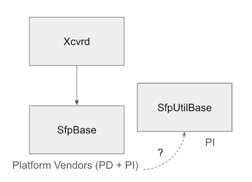
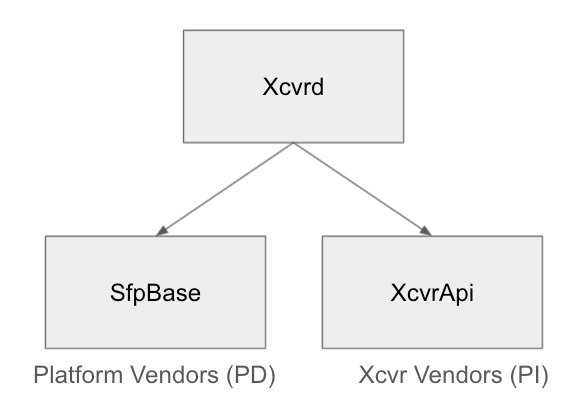

# Sonic_sfp Refactoring

# Table of Contents

- [Sonic_sfp Refactoring](#sonic_sfp-refactoring)
- [Table of Contents](#table-of-contents)
- [Version History](#version-history)
- [Abbreviations & Acronyms](#abbreviations--acronyms)
- [Overview](#overview)
- [Requirements](#requirements)
  - [Transceiver Specification Support](#transceiver-specification-support)
    - [Specification Abstraction by Transceiver Vendor](#specification-abstraction-by-transceiver-vendor)
    - [Determining the Correct Transceiver Specification](#determining-the-correct-transceiver-specification)
    - [Vendor Specific Data](#vendor-specific-data)
  - [Common Sfp Platform API Logic](#common-sfp-platform-api-logic)
- [Design Scope](#design-scope)
  - [In scope](#in-scope)
  - [Out of scope](#out-of-scope)
- [Design](#design)
  - [Top-level View](#top-level-view)
  - [XcvrApi](#xcvrapi)
  - [XcvrEeprom](#xcvreeprom)
  - [XcvrField](#xcvrfield)
  - [XcvrMemMap](#xcvrmemmap)
    - [Vendor Specific Extensions](#vendor-specific-extensions)
  - [XcvrCodes](#xcvrcodes)
  - [XcvrApiFactory](#xcvrapifactory)
    - [Identifier Mapping](#identifier-mapping)
      - [Regular Identifier](#regular-identifier)
      - [Vendor Specific Identifier](#vendor-specific-identifier)
  - [SfpBase Modifications](#sfpbase-modifications)
    - [SfpOptoeBase](#sfpoptoebase)
- [Testing](#testing)


# Version History

<table>
  <tr>
   <td>Version
   </td>
   <td>Date
   </td>
   <td>Description
   </td>
  </tr>
  <tr>
   <td>1.0
   </td>
   <td>February 21, 2021
   </td>
   <td>Initial version
   </td>
  </tr>
  <tr>
   <td>2.0
   </td>
   <td>April 21, 2021
   </td>
   <td>Addressed feedback, revised requirements, design and added deprecation plan
   </td>
  </tr>
  <tr>
   <td>3.0
   </td>
   <td>May 10, 2021
   </td>
   <td>Minor corrections
   </td>
  </tr>
  <tr>
   <td>4.0
   </td>
   <td>June 21, 2021
   </td>
   <td>Minor corrections to reflect current implementation
   </td>
  </tr>
  <tr>
   <td>5.0
   </td>
   <td>July 28, 2021
   </td>
   <td>Cleaned up several sections
   </td>
  </tr>
</table>

# Abbreviations & Acronyms


<table>
  <tr>
   <td>Abbreviation / Acronym
   </td>
   <td>Description
   </td>
  </tr>
  <tr>
   <td>xcvr
   </td>
   <td>transceiver
   </td>
  </tr>
  <tr>
   <td>PD
   </td>
   <td>platform-dependent
   </td>
  </tr>
  <tr>
   <td>PI
   </td>
   <td>platform-independent
   </td>
  </tr>
</table>


# Overview

This document summarizes an approach to refactor the Sfp-related functionality in sonic-platform-common.

The current platform API model is such that base classes in sonic-platform-common define a common, PI interface that can be implemented in PD classes.

For Sfp, there is a great deal of PI logic that exists in sonic_sfp pertaining to different xcvr specs. Ideally, platform vendors reponsible for implementing the PD classes would only need to add logic that is actually PD.

However, the reality today is that some parts of the Sfp platform API are PI whereas some parts are PD, and platform vendors are required to take care of both in their SfpBase-derived implementations. The problem is that sonic_sfp (much of it being legacy code from the older platform API model) has not been updated to handle the requirements of the newer Sfp platform API, and vendors are having to fill in implementation gaps for themselves. This is resulting in a lot of duplicate work being done for things that should be common across platforms.

The current model is illustrated in the following diagram:



The goal of this refactor is to establish proper infrastructure for PI Sfp logic so that platform vendors only need to do PD work and new PI features can be easily added and able to benefit the whole community.

# Requirements
## Transceiver Specification Support
### Specification Abstraction by Transceiver Vendor

There needs to be a proper abstraction for each xcvr specification that we support (SFF-8472, SFF-8436, etc.). This abstraction should encapsulate everything specific to a particular specification that may be of relevance, namely:

*   Available xcvr EEPROM fields
*   Location of those fields in the memory map
*   Representation of those fields in the memory map, and how they should be interpreted

With these abstractions, the most that should be exposed to any clients using these abstractions is an API for reading and writing specific fields in the EEPROM according to the associated specs.

### Determining the Correct Transceiver Specification

The correct specification abstraction needs to be selected at runtime to interpret a xcvr’s memory map correctly. This should be done by reading the first byte in the xcvr’s EEPROM, which contains an identifier value whose meaning is specified in Table 4-1 of SFF-8024. There should then be a set of mappings between identifier values and the specifications we support.

This approach is in contrast to what's currenly done with selecting parsers based on the xcvr's port number, which can sometimes lead to the wrong memory map interpretation.

### Vendor Specific Data

The xcvr specifications indicate that certain types of data (e.g. register bits, fields, or codes) that may be found in the xcvr EEPROM are not explicitly defined by the specification and instead may be set by the xcvr vendor. Although there currently isn’t any vendor specific logic in our codebase, the new design should make it straightforward to add support for such logic.

## Common Sfp Platform API Logic

All methods in the Sfp platform API which strictly involve reading or writing xcvr EEPROM fields and are platform independent should be implemented in sonic-platform-common. Platform vendors would then only need to implement a subset of the currently required methods in their platform-specific Sfp classes.

# Design Scope
## In scope

*   Basic support for xcvrs that adhere to SFF-8436, SFF-8472, and CMIS; namely, SFP, QSFP, and OSFP/QSFP-DD form factors, based on what is required by current Sfp platform API
*   Infrastructure for adding new xcvr-related platform APIs, either PI or PD
*   Infrastructure for adding support for other xcvr specifications, including vendor-specific specifications
*   Mechanism for interfacing with the correct specification (on initialization or change event) based on reading xcvr identifier in EEPROM, with the assumption of one xcvr per port

## Out of scope

*   Support for other xcvr form factors (e.g. SFP-DD)
*   Refactor of sfpshow to better support additional xcvr types
*   Refactor of xcvrd to better support additional xcvr types
*   Any vendor-specific implementation of provided infrastructure (to be done by the vendors)
*   Integration of sonic_y_cable with the new design
*   Support for coherent optic (400G ZR) xcvrs

# Design

## Top-level View

In the long term, the model implied by the new design looks like the following:



The high-level connection of these components with the new design is illustrated in the following block diagram:


The new design includes several new constructs to support the management of public and vendor-specific xcvr specifications and their usage by the platform API.

## XcvrApi

XcvrApi represents a common interface for all xcvr EEPROM operations. This separate, platform-independent hierarchy, existing alongside SfpBase and its implementations, allows for xcvr EEPROM related features to be added without affecting SfpBase. It forms an additional set of functionalities that can be accessed by xcvrd.


For each xcvr spec in the public domain there will be a XcvrApi that goes with it. Xcvr vendors can extend the appropriate public XcvrApi and provide custom functionality.

```
# api/xcvr_api.py

class XcvrApi(object):
    def __init__(self, xcvr_eeprom):
        ...

    def get_temperature(self):
        raise NotImplementedError

    def get_model(self):
        raise NotImplementedError

    def get_serial(self):
        raise NotImplementedError

    def get_transceiver_info(self):
        raise NotImplementedError
    ...

# api/public/sff8436.py

class Sff8436Api(XcvrApi):
    def __init__(self, xcvr_eeprom):
        super(Sff8436Api, self).__init__(xcvr_eeprom)

    def get_temperature(self):
        return self.xcvr_eeprom.read(TEMPERATURE_FIELD)

    def get_model(self):
        return self.xcvr_eeprom.read(MODEL_FIELD)

    def get_serial(self):
        ...

    def get_transceiver_info(self):
        ...


    ...

# api/vendorA/custom_qsfp.py

class VendorAQsfpApi(Sff8436Api):
    ...
```

## XcvrField

* Abstraction for a field or register in a memory map that can be encoded/decoded
* Can have various sizes, ranging from single bit to multiple bytes
    * RegBitField: a field occupying a bit in the memory map
    * RegField: a field occupying one or more bytes in the memory map, but is logically meant to be interpreted as one entity, e.g. a 4-byte integer
        * NumberRegField: interpret byte(s) as a number
        * CodeRegField: interpret byte(s) as a code
        * StringRegField: interpret byte(s) as a string
        * HexRegField: interpret byte(s) as a series of hex pairs
    * RegGroupField: a field occupying one or more bytes in the memory map, logically representing 1 or more RegFields or RegGroupFields that exist contiguously in memory that may be interpreted as distinct entities, e.g. a 4-byte integer followed by a 16-byte string

## XcvrMemMap

* Represent memory maps in xcvr specs
* Contain any number of XcvrFields
* Provides get_field() to lookup fields by name
* Depends on an instance of XcvrCodes to provide code lookups for certain fields

```
# mem_maps/xcvr_mem_map.py

class XcvrMemMap(object):
    def __init__(self, codes):
        ...

    def get_field(self, field_name):
        # Return a XcvrField, exception if not found

# mem_maps/sff8436.py

class Sff8436MemMap(XcvrMemMap):
    def __init__(self, codes):
        super(Sff8436MemMap, self).__init__(codes)

        self.TX_FAULT = RegField(TX_FAULT_FIELD, offset=4,
            RegBitField(“Tx1Fault”, bit=0),
            RegBitField(“Tx2Fault”, bit=1),
            RegBitField(“Tx3Fault”, bit=2),
            RegBitField(“Tx4Fault”, bit=3)
        )

        ...

```
### Vendor Specific Extensions

To provide field definitions for vendor-specific memory regions, vendors can extend the appropriate MemMap class and define vendor-specific fields just like regular fields.

```
# mem_maps/vendorA/model_qsfp.py

class VendorAQsfpMemMap(SFF8436MemMap):
    self.VENDOR_A_SPECIFIC_REG = RegField(VENDOR_SPECIFIC_FIELD, 8)
    ...

```


## XcvrCodes

The SFF-8024 specification lists several tables of codes that are referenced by many of the xcvr specifications. The Sff8024 class is used to hold all of these tables in a similar manner to what the current sff8024.py module does.


```
# codes/codes.py

class XcvrCodes(object):
    ...

# codes/public/sff8024.py

class Sff8024(XcvrCodes):
    XCVR_IDENTIFIERS = {
        '00': 'Unknown or unspecified',
        '01': 'GBIC',
        ...
    }
    ...

```

There are some codes that are specific to a xcvr specification. For these, a class that inherits from Sff8024 will be used to define the codes.

```
# codes/public/cmis.py

class CmisCodes(Sff8024):
    MODULE_STATUS = {
        1: “ModuleLowPwr”,
        2: “ModulePwrUp”,
        3: “ModuleReady”,
        4: “ModulePwrDn”,
        5: “Fault”
    }

    ...

```

## XcvrEeprom

* Middleman that exposes simple read() and write() interface to XcvrApi
* Responsible for performing actual EEPROM reads and writes; depends on XcvrMemMap to provide correct read/write parameters

```
class XcvrEeprom(object):
   def __init__(self, reader, writer, mem_map):
      ...

   def read(self, field_name):
      """
      Read a value from a field in EEPROM

      Args:
         field_name: a string denoting the XcvrField to read from

      Returns:
         The value of the field, if the read is successful and None otherwise
      """

   def write(self, field_name, value):
      """
      Write a value to a field in EEPROM

      Args:
         field_name: a string denoting the XcvrField to write to

         value:
            The value to write to the EEPROM, appropriate for the given field_name

      Returns:
         Boolean, True if the write is successful and False otherwise
      """
      ...

```
## XcvrApiFactory

* Responsible for reading xcvr identifier and instantiating correct set of classes for interpreting EEPROM

```
# xcvr_api_factory.py

import id_mapping

class XcvrApiFactory(object):
    def __init__(self, reader, writer):
        ...

    # Other helper methods...

    def create_xcvr_api(self):
        # Run some logic to select the correct XcvrApi, XcvrCodes, and XcvrMemMap
        # ...
        # xcvr_eeprom = XcvrEeprom(self.reader, self.writer, mem_map)
        # return xcvr_api(xcvr_eeprom)
```


### Identifier Mapping

* Mapping file used by XcvrApiFactory that relates identifiers to the appropriate XcvrApi, XcvrCodes, and XcvrMemMap classes

```
# id_mapping.py

{
  "identifiers": {
    "03": {
      "public": {
        "mem_map": "mem_maps.sff8472.SFF8472MemMap",
        "codes": "codes.sff8024.Sff8024",
        "api": "api.sff8472.Sff8472Api",
      },
      "vendorA": {
        "model1": {
          "mem_map": "mem_maps.vendorA.sff8472_model1.Model1MemMap",
          "codes": "codes.vendorA.sff8024_model1.Model1Codes",
          "api": "api.vendorA.sff8472_model1.Model1Api",
        },
        "model2": {
          "mem_map": "mem_maps.vendorA.sff8472_model2.Model2MemMap",
          "codes": "codes.vendorA.sff8024_model2.Model2Codes",
          "api": "api.vendorA.sff8472_model2.Model2Api",
        }
      },
      "vendorB": {
          ...
      }
    },
    "0D": {
      "public": {
        "mem_map": "...",
        "codes": "..."
        "api": "..."
      },
      "vendorA": {
          "..."
      }
    }
    "80": {
      # No "public" key since "80" is vendor-specific
      "vendorY": "...",
      "vendorX": "..."
    },
  }
}

```

* Mapping organized at top level according to identifers (0x00-0xFF)
* Each identifer maps to 1 or more set of dotted paths to Python classes that are subclasses of XcvrApi, XcvrCodes, and XcvrMemMap.
* Identifiers in SFF-8024 included in this mapping must have a "public" key, providing classes corresponding to a public spec (e.g. SFF-8436)
* Vendors providing custom classes under a particular identifier do so under key corresponding to vendor's name (must match name read from EEPROM)
    * Mappings under vendor name are further split according to model/part number

The high-level lookup logic after an identifier is read can be described as follows, based on whether the identifier is a “regular” identifier (listed in SFF-8024) or is a vendor-specific identifier. Note: “vendor ID” refers collectively to vendor name and model/part number.

#### Regular Identifier

1. Lookup “public” XcvrMemMap
2. Initialize XcvrMemMap
3. Retrieve vendor ID via XcvrMemMap
4. Lookup mapping for vendor-specific definitions based on vendor ID
5. If vendor-specific classes are found, use them instead
6. Else, proceed with currently initialized classes


#### Vendor Specific Identifier

1. Look up possible XcvrMemMaps associated with the identifier
2. For each XcvrMemMap found
    1. Initialize XcvrMemMap
    2. Retrieve vendor ID via XcvrMemMap
    3. Compare retrieved vendor ID with expected vendor ID (according to the mapping definition)
    4. If match, we’re done; proceed with currently initialized XcvrMemMap
    5. Else, continue with next XcvrMemMap


## SfpBase Modifications

SfpBase will gain two new methods in the new design: refresh_xcvr_api() and get_xcvr_api(). Both will be called by xcvrd.

```
# sonic-platform-common/sonic_platform_base/sfp_base.py

class SfpBase(device_base.DeviceBase):
    def __init__(self):
        self.xcvr_api_factory = XcvrApiFactory(self.read_eeprom, self.write_eeprom)
        self.xcvr_api = None
    ...

    def refresh_xcvr_api(self):
        """
        Updates the XcvrApi associated with this SFP
        """

    def get_xcvr_api(self):
        """
        Retrieves the XcvrApi associated with this SFP

        Returns:
            An object derived from XcvrApi that corresponds to the SFP
        """
    ...

```
### SfpOptoeBase

The long-term plan for this refactor is to have SfpBase primarily be an interface for functionality that is expected to vary across platforms and thus would need to be implemented by platform vendors. This means that methods like get_temperature, get_transceiver_info(), etc. from SfpBase that are xcvr EEPROM-related and whose implementations are not actually platform dependent will get moved to XcvrApi.

In the short-term, the methods will be kept in SfpBase. A new class, SfpOptoeBase, will inherit SfpBase and implement these methods simply by deferring to XcvrApi. Platform vendors that wish to make use of SfpOptoeBase will create an Sfp class that inherits from SfpOptoeBase rather than SfpBase; this is illustrated below by platform vendor A and B’s Sfp classes. Vendors that continue inheriting from SfpBase (vendors C and D) can continue to do so without being affected negatively.


SfpOptoeBase will also implement read_eeprom and write_eeprom, since for platforms that rely on optoe for xcvr EEPROM access the only aspect that is platform dependent is the mapping between front panel ports and the EEPROM file path; for this a new method, get_eeprom_path, will need to be implemented.


```
# sfp_optoe_base.py

class SfpOptoeBase(SfpBase):
    def __init__(self):
        SfpBase.__init__(self)
    ...

    def get_rx_los(self):
        return self.xcvr_api.get_rx_los()

    def get_tx_fault(self):
        return self.xcvr_api.get_tx_fault()

    def tx_disable(self, tx_disable):
        return self.xcvr_api.tx_disable(tx_disable)

    ...

    def get_eeprom_path(self):
        raise NotImplementedError

    def read_eeprom(self, offset, numbytes):
        # Use get_eeprom_path
        ...

    def write_eeprom(self, offset, numbytes, write_buffer):
        # Use get_eeprom_path
        ...

```

# Testing

Testing for the new design will include relevant unit tests for the new components (e.g. XcvrFields and XcvrMemMaps). These unit tests will go under the sonic-platform-common “tests” package. Detection of regressions after all cleanup is done as part of the refactor will primarily be achieved through existing Sfp platform API tests. Proper functioning of dependencies on Sfp code, like sfp-related CLIs (sfputil, sfpshow) and xcvrd, will also be verified.
