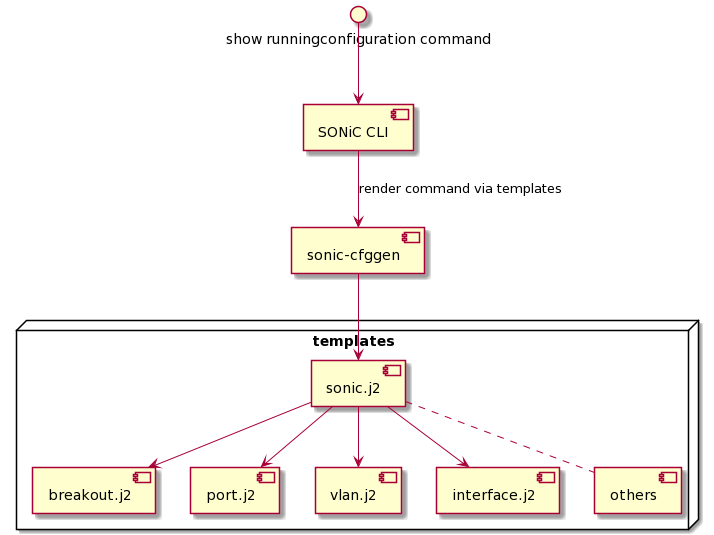

# Show running command high level design for SONiC

# Table of Contents
- [Show running command high level design for SONiC](#show-running-command-high-level-design-for-sonic)
- [Table of Contents](#table-of-contents)
- [Revision History](#revision-history)
- [Requirements Overview](#requirements-overview)
- [Architecture](#architecture) 
- [CLI](#cli)
- [Test](#test)
    - [Functional Test Cases](#functional-test-cases)

# Revision History
|  Rev  | Date       |   Author    | Change Description                |
| :---: | :--------- | :---------: | --------------------------------- |
|  0.1  | 08/13/2021 |  Jimi Chen  | Initial version                   |

# Requirements Overview
SONiC provide CLI command to configure needed feature for normal users, but users may hard to idenfity which command has been configured if they aren't familiar with CFG_DB's schema related to the feature.  
Use existing **sonic-cfggen** command can help to render back command from reading CFG_DB, this is legacy-like running commands.  
This running commands should have command dependency to prevent error when executing it directly.

# Architecture
Add extra command argument to exsiting **show runningconfiguration** to execute **sonic-cfggen** and render the needed SONiC command format.  
Use jinja template to translate CFG_DB format to SONiC command format, templates should be separated by features.  
Organize different templates into one template for command sequence to prevent configuration error due to dependency.

 

# CLI
show runningconfiguration command
```
config hostname Edgecore-leaf-1

config interface breakout Ethernet0 1x10G[1G]
config interface breakout Ethernet1 1x10G[1G]
config interface breakout Ethernet2 1x10G[1G]
config interface breakout Ethernet3 1x10G[1G]
config interface breakout Ethernet4 1x10G[1G]
config interface breakout Ethernet5 1x10G[1G]
config interface breakout Ethernet6 1x10G[1G]
config interface breakout Ethernet7 1x10G[1G]
config interface breakout Ethernet8 1x10G[1G]
config interface breakout Ethernet9 1x10G[1G]
config interface breakout Ethernet10 1x10G[1G]
config interface breakout Ethernet11 1x10G[1G]
config interface breakout Ethernet12 1x10G[1G]
config interface breakout Ethernet13 1x10G[1G]
config interface breakout Ethernet14 1x10G[1G]
config interface breakout Ethernet15 1x10G[1G]
config interface breakout Ethernet16 1x10G[1G]
config interface breakout Ethernet17 1x10G[1G]
config interface breakout Ethernet18 1x10G[1G]
config interface breakout Ethernet19 1x10G[1G]
config interface breakout Ethernet20 1x10G[1G]
config interface breakout Ethernet21 1x10G[1G]
config interface breakout Ethernet22 1x10G[1G]
config interface breakout Ethernet23 1x10G[1G]
config interface breakout Ethernet24 1x10G[1G]
config interface breakout Ethernet25 1x10G[1G]
config interface breakout Ethernet26 1x10G[1G]
config interface breakout Ethernet27 1x10G[1G]
config interface breakout Ethernet28 1x10G[1G]
config interface breakout Ethernet29 1x10G[1G]
config interface breakout Ethernet30 1x10G[1G]
config interface breakout Ethernet31 1x10G[1G]
config interface breakout Ethernet32 1x10G[1G]
config interface breakout Ethernet33 1x10G[1G]
config interface breakout Ethernet34 1x10G[1G]
config interface breakout Ethernet35 1x10G[1G]
config interface breakout Ethernet36 1x10G[1G]
config interface breakout Ethernet37 1x10G[1G]
config interface breakout Ethernet38 1x10G[1G]
config interface breakout Ethernet39 1x10G[1G]
config interface breakout Ethernet40 1x10G[1G]
config interface breakout Ethernet41 1x10G[1G]
config interface breakout Ethernet42 1x10G[1G]
config interface breakout Ethernet43 1x10G[1G]
config interface breakout Ethernet44 1x10G[1G]
config interface breakout Ethernet45 1x10G[1G]
config interface breakout Ethernet46 1x10G[1G]
config interface breakout Ethernet47 1x10G[1G]
config interface breakout Ethernet48 1x100G[40G]
config interface breakout Ethernet52 1x100G[40G]
config interface breakout Ethernet56 1x100G[40G]
config interface breakout Ethernet60 1x100G[40G]
config interface breakout Ethernet64 1x100G[40G]
config interface breakout Ethernet68 1x100G[40G]

config interface startup Ethernet0
config interface mtu Ethernet0 9100
config interface speed Ethernet0 10000
config interface startup Ethernet1
config interface mtu Ethernet1 9100
config interface speed Ethernet1 10000
config interface startup Ethernet2
config interface mtu Ethernet2 9100
config interface speed Ethernet2 10000
config interface startup Ethernet3
config interface mtu Ethernet3 9100
config interface speed Ethernet3 10000
config interface startup Ethernet4
config interface mtu Ethernet4 9100
config interface speed Ethernet4 10000
config interface startup Ethernet5
config interface mtu Ethernet5 9100
config interface speed Ethernet5 10000
config interface startup Ethernet6
config interface mtu Ethernet6 9100
config interface speed Ethernet6 10000
config interface startup Ethernet7
config interface mtu Ethernet7 9100
config interface speed Ethernet7 10000
config interface startup Ethernet8
config interface mtu Ethernet8 9100
config interface speed Ethernet8 10000
config interface startup Ethernet9
config interface mtu Ethernet9 9100
config interface speed Ethernet9 10000
config interface startup Ethernet10
config interface mtu Ethernet10 9100
config interface speed Ethernet10 10000
config interface startup Ethernet11
config interface mtu Ethernet11 9100
config interface speed Ethernet11 10000
config interface startup Ethernet12
config interface mtu Ethernet12 9100
config interface speed Ethernet12 10000
config interface startup Ethernet13
config interface mtu Ethernet13 9100
config interface speed Ethernet13 10000
config interface startup Ethernet14
config interface mtu Ethernet14 9100
config interface speed Ethernet14 10000
config interface startup Ethernet15
config interface mtu Ethernet15 9100
config interface speed Ethernet15 10000
config interface startup Ethernet16
config interface mtu Ethernet16 9100
config interface speed Ethernet16 10000
config interface startup Ethernet17
config interface mtu Ethernet17 9100
config interface speed Ethernet17 10000
config interface startup Ethernet18
config interface mtu Ethernet18 9100
config interface speed Ethernet18 10000
config interface startup Ethernet19
config interface mtu Ethernet19 9100
config interface speed Ethernet19 10000
config interface startup Ethernet20
config interface mtu Ethernet20 9100
config interface speed Ethernet20 10000
config interface startup Ethernet21
config interface mtu Ethernet21 9100
config interface speed Ethernet21 10000
config interface startup Ethernet22
config interface mtu Ethernet22 9100
config interface speed Ethernet22 10000
config interface startup Ethernet23
config interface mtu Ethernet23 9100
config interface speed Ethernet23 10000
config interface startup Ethernet24
config interface mtu Ethernet24 9100
config interface speed Ethernet24 10000
config interface startup Ethernet25
config interface mtu Ethernet25 9100
config interface speed Ethernet25 10000
config interface startup Ethernet26
config interface mtu Ethernet26 9100
config interface speed Ethernet26 10000
config interface startup Ethernet27
config interface mtu Ethernet27 9100
config interface speed Ethernet27 10000
config interface startup Ethernet28
config interface mtu Ethernet28 9100
config interface speed Ethernet28 10000
config interface startup Ethernet29
config interface mtu Ethernet29 9100
config interface speed Ethernet29 10000
config interface startup Ethernet30
config interface mtu Ethernet30 9100
config interface speed Ethernet30 10000
config interface startup Ethernet31
config interface mtu Ethernet31 9100
config interface speed Ethernet31 10000
config interface startup Ethernet32
config interface mtu Ethernet32 9100
config interface speed Ethernet32 10000
config interface startup Ethernet33
config interface mtu Ethernet33 9100
config interface speed Ethernet33 10000
config interface startup Ethernet34
config interface mtu Ethernet34 9100
config interface speed Ethernet34 10000
config interface startup Ethernet35
config interface mtu Ethernet35 9100
config interface speed Ethernet35 10000
config interface startup Ethernet36
config interface mtu Ethernet36 9100
config interface speed Ethernet36 10000
config interface startup Ethernet37
config interface mtu Ethernet37 9100
config interface speed Ethernet37 10000
config interface startup Ethernet38
config interface mtu Ethernet38 9100
config interface speed Ethernet38 10000
config interface startup Ethernet39
config interface mtu Ethernet39 9100
config interface speed Ethernet39 10000
config interface startup Ethernet40
config interface mtu Ethernet40 9100
config interface speed Ethernet40 10000
config interface startup Ethernet41
config interface mtu Ethernet41 9100
config interface speed Ethernet41 10000
config interface startup Ethernet42
config interface mtu Ethernet42 9100
config interface speed Ethernet42 10000
config interface startup Ethernet43
config interface mtu Ethernet43 9100
config interface speed Ethernet43 10000
config interface startup Ethernet44
config interface mtu Ethernet44 9100
config interface speed Ethernet44 10000
config interface startup Ethernet45
config interface mtu Ethernet45 9100
config interface speed Ethernet45 10000
config interface startup Ethernet46
config interface mtu Ethernet46 9100
config interface speed Ethernet46 10000
config interface startup Ethernet47
config interface mtu Ethernet47 9100
config interface speed Ethernet47 10000
config interface startup Ethernet48
config interface mtu Ethernet48 9100
config interface speed Ethernet48 100000
config interface fec Ethernet48 rs
config interface startup Ethernet52
config interface mtu Ethernet52 9100
config interface speed Ethernet52 100000
config interface fec Ethernet52 rs
config interface startup Ethernet56
config interface mtu Ethernet56 9100
config interface speed Ethernet56 100000
config interface startup Ethernet60
config interface mtu Ethernet60 1500
config interface speed Ethernet60 40000
config interface startup Ethernet64
config interface mtu Ethernet64 9100
config interface speed Ethernet64 100000
config interface startup Ethernet68
config interface mtu Ethernet68 9100
config interface speed Ethernet68 100000
config interface fec Ethernet68 rs

config portchannel add PortChannel01
config interface startup PortChannel01
config interface mtu PortChannel01 9100
config portchannel add PortChannel02
config interface startup PortChannel02
config interface mtu PortChannel02 9100
config portchannel add PortChannel03
config interface startup PortChannel03
config interface mtu PortChannel03 9100
config portchannel member add PortChannel01 Ethernet1
config portchannel member add PortChannel02 Ethernet68
config portchannel member add PortChannel03 Ethernet3

config vlan add 10
config vlan add 200
config vlan add 201
config vlan add 4001
config vlan member add 10 PortChannel02 
config vlan member add 200 PortChannel01 
config vlan member add 200 PortChannel02 
config vlan member add 201 PortChannel02 
config vlan member add 201 PortChannel03 

config vrf add Vrf1

config interface ip add Loopback0 10.100.2.1/32 
config interface ip add Loopback1 10.100.4.1/32 
config interface vrf bind Loopback0 
config interface vrf bind Loopback1 

config interface ip add Ethernet60 192.169.255.6/30 
config interface vrf bind Ethernet60 Vrf1

config interface ip add Vlan10 192.10.10.1/24 
config interface vrf bind Vlan10 
config interface vrf bind Vlan200 Vrf1
config interface vrf bind Vlan201 Vrf1
config interface vrf bind Vlan4001 Vrf1

config interface ip add eth0 192.168.8.125/16 192.168.8.1

config sag ipv4 enable
config sag mac_address add 00:11:22:33:44:0f

config interface sag ip add Vlan200 10.100.0.254/24
config interface sag ip add Vlan201 10.101.0.254/24

config mclag add 1 192.10.10.1 192.10.10.2

config mclag member add 1 PortChannel01
config mclag member add 1 PortChannel03

config vxlan add vtep 10.100.4.1

config vxlan evpn_nvo add evpnnvo1 vtep

config vxlan map add vtep map_10200_Vlan200
config vxlan map add vtep map_10201_Vlan201
config vxlan map add vtep map_104001_Vlan4001
```
# Test
## Functional Test Cases
1. Verify if execute running command from initail config can be the same as the device already configured