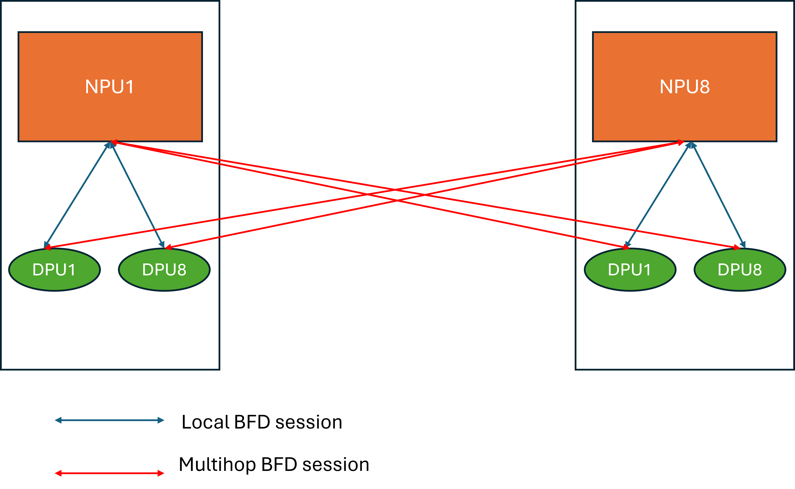
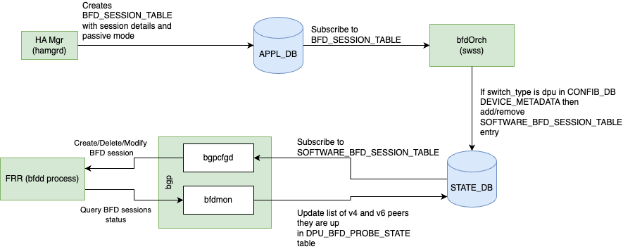
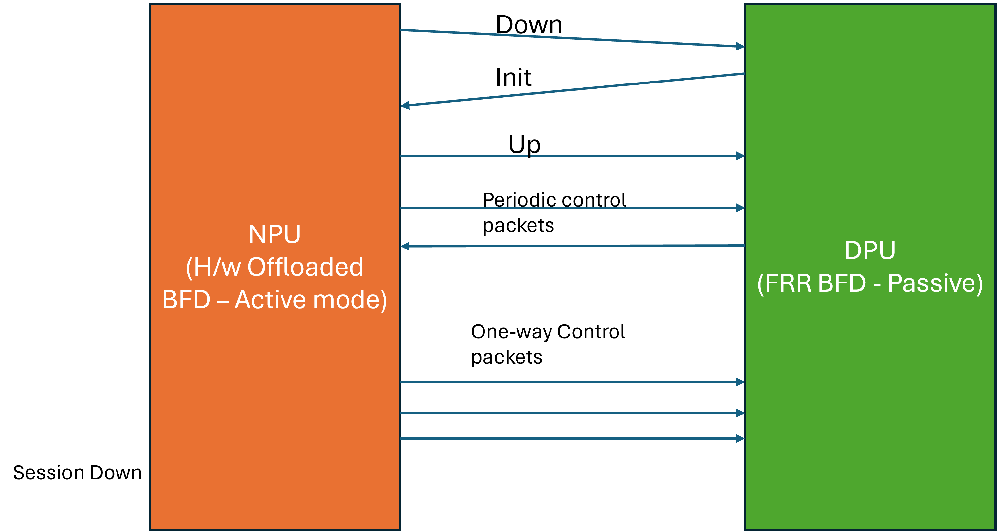
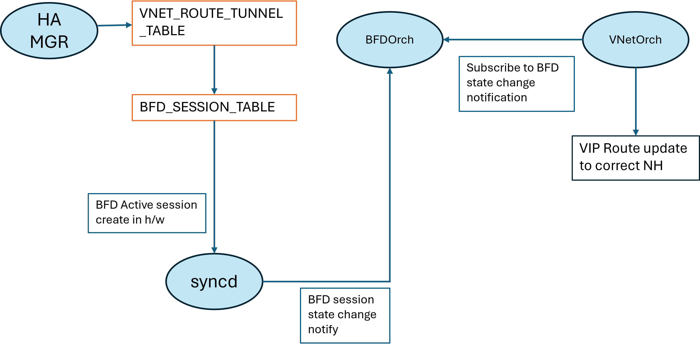

##  SmartSwitch - NPU-DPU liveness detection using BFD


- [About this Manual](#about-this-manual)
- [Definitions/Abbreviation](#definitionsabbreviation)
- [1. Requirements Overview](#1-requirements-overview)
  - [1.1 Functional Requirements](#11-functional-requirements)
  - [1.2 Scale Requirements](#12-scale-requirements)
  - [1.3 Default values](#13-default-values)
- [2. Modules Design](#2-modules-design)
  - [2.1 APP\_DB changes](#21-app_db-changes)
  - [2.2 SmartSwitch NPU-DPU BFD sessions](#22-smartswitch-npu-dpu-bfd-sessions)
  - [2.3 BFD Active-Passive mode](#23-bfd-active-passive-mode)
  - [2.4 DPU FRR Changes](#24-dpu-frr-changes)
  - [2.5 DPU Linux IPTables](#25-dpu-linux-iptables)
  - [2.6 NPU BFD session and VNET\_ROUTE\_TUNNEL](#26-npu-bfd-session-and-vnet_route_tunnel)
  - [2.7 DPU BFD session state Updates](#27-dpu-bfd-session-state-updates)
  - [2.8 NPU-DPU midplane state change and BFD session update](#28-npu-dpu-midplane-state-change-and-bfd-session-update)
  - [2.9 DPU BFD Host trap entries](#29-dpu-bfd-host-trap-entries)
  - [2.10 VNET Route and BFD session updates](#210-vnet-route-and-bfd-session-updates)

###### Revision

| Rev |     Date    |       Author          | Change Description                |
|:---:|:-----------:|:---------------------:|-----------------------------------|
| 0.1 |  03/01/2024 |     Kumaresh Perumal  | Initial version                  |
| 0.2 |  03/12/2024 | Kumaresh Perumal | Update review comments                |
| 0.3 | 03/13/2024 | Kumaresh Perumal | Update BFD table in STATE_DB           |
| 0.4| 03/20/2024 | Kumaresh Perumal | Update ACL usage |
| 1.0| 03/26/2024| Kumaresh Perumal| Update with BFD Trap, Rx/Tx timers in APP_DB|
|1.1| 05/28/2024 | Kumaresh Perumal | BFD session state updates to HA Scope state DB|

# About this Manual
This document provides general information about the NPU-DPU liveness detection using BFD probes between NPU and DPU.

# Definitions/Abbreviation

|                          |                                          |
|--------------------------|------------------------------------------|
| BFD                      | Bidirectional Forwarding Detection       |
| NPU                      | Network Processing Unit                  |
| DPU                      | Data Processing Unit                     |
| FRR                      | Open source routing stack                |

# 1. Requirements Overview

## 1.1 Functional Requirements

- BFD session(Active mode) in NPU using NPU's BFD H/W offload feature.

- BFD session(Passive mode) in DPU using FRR.

- BFD session between NPU and local DPU and remote DPU based on HA DPU
    pair.

## 1.2 Scale Requirements

- 64 BFD active sessions from NPU to each DPU in a T1 cluster.

- 8 BFD passive sessions from DPU to all NPUs in a T1 cluster.
  
Note: Scale requirements will  double when BFD sessions need to be created for both IPv4 and IPv6.

## 1.3 Default values

- BFD TX_INTERVAL -- 100 msec(might change)

- BFD_RX_INTERVAL - 100 msec(might change)

- BFD session detect time multiplier - 3

- BFD session type: Active on NPU and Passive on DPU

- BFD mode: Multihop mode for sessions between NPU and remote DPU

# 2. Modules Design
## 2.1 APP_DB changes
Existing VNET_ROUTE_TUNNEL_TABLE is updated to include BFD Rx and Tx timers. Overlay ECMP feature uses the default of one second and Smartswitch can have aggressive timers due to less number of BFD sessions.

Existing
```
VNET_ROUTE_TUNNEL_TABLE:{{vnet_name}}:{{prefix}}  
    "endpoint": {{ip_address1},{ip_address2},...} 
    "endpoint_monitor": {{ip_address1},{ip_address2},...} (OPTIONAL) 
    "mac_address":{{mac_address1},{mac_address2},...} (OPTIONAL)  
    "vni": {{vni1},{vni2},...} (OPTIONAL) 
    "weight": {{w1},{w2},...} (OPTIONAL) 
    “profile”: {{profile_name}} (OPTIONAL) 
```

Proposed changes
```
VNET_ROUTE_TUNNEL_TABLE:{{vnet_name}}:{{prefix}}  
    "endpoint": {{ip_address1},{ip_address2},...} 
    "endpoint_monitor": {{ip_address1},{ip_address2},...} (OPTIONAL) 
    "mac_address":{{mac_address1},{mac_address2},...} (OPTIONAL)  
    "vni": {{vni1},{vni2},...} (OPTIONAL) 
    "weight": {{w1},{w2},...} (OPTIONAL) 
    “profile”: {{profile_name}} (OPTIONAL) 
    "rx_monitor_timer": {time in milliseconds}
    "tx_monitor_timer": {time in milliseconds}
```

## 2.2 SmartSwitch NPU-DPU BFD sessions

In a Smartswitch deployment, BFD sessions are created between NPU and
DPUs. Each T1 cluster has 8 T1s and 8 DPUs in each T1. To detect the
liveness of each DPU in the cluster, NPU creates Active BFD sessions to
all 64 DPUs and each DPU creates passive BFD sessions to all NPUs in the
cluster. When BFD keepalives are not detected for certain interval, BFD
sessions are marked as down and corresponding action is performed.
Multihop BFD sessions are created between NPU and a remote DPU.



## 2.3 BFD Active-Passive mode

HA manager(hamgrd) in NPU creates DPU routing rules for DPU-level HA using VNET_ROUTE_TUNNEL_TABLE which will trigger bfdOrch to create BFD Active session with local and peer information. NPU supports BFD hardware offload, so hardware starts
generating BFD packets to the peer. HA manager also creates another
BFD passive session in DPU using BFD_SESSION table with local DPU PA and peer NPU PAs. BfdOrch checks for SAI object platform capability for h/w offload. In DPU, if h/w offload is not supported, FRR is configured to trigger BFD sessions. BfdOrch creates SOFTWARE_BFD_SESSION_TABLE entry in STATE_DB with 'passive' mode and BgpCfgd checks for the entries in the STATE_DB and configures BFD passive sessions in
FRR stack with local and peer information.

SOFTWARE_BFD_SESSION_TABLE entry in STATE_DB has all the key fields and values from BFD_SESSION_TABLE.

Trigger for HA manager to create BFD sessions will be detailed in HA HLD.



BFD passive sessions in DPU waits for BFD control packets from NPU's
active session. When FRR stack receives BFD packets from active sessions
in NPU, it starts responding. After the initial handshake, BFD sessions
are up. When active session doesn't receive control packets for the
configured BFD timeout period, session is set to DOWN and corresponding
action is taken.



## 2.4 DPU FRR Changes

By default BFD Daemon is not enabled in FRR. FRR supervisor config file
has to be updated to start BFDD during FRR initialization.

To configure BFD passive sessions, a profile with 'passive' mode is
created and used for all sessions created in FRR. BgpCfgd configures FRR
stack using vtysh.

```

bfd

profile passive

passive-mode

receive-interval 100

transmit-interval 100

detect multiplier 3

exit

!

peer \<Local/Remote NPU IP\> local-address \<DPU PA\>

profile passive

exit
```

## 2.5 DPU Linux IPTables

New rules need to be added in the kernel to allow BFD packets to be
processed by the kernel and FRR stack. All packets matching BFD UDP(3784
and 4784).

***sudo iptables \--insert INPUT 5 -p udp \--dport 4784 -j ACCEPT***

***sudo iptables \--insert INPUT 5 -p udp \--dport 3784 -j ACCEPT***

These rules can be added as part of caclmgrd script during initialization by checking the DEVICE_METADATA object and attribute "switch_type: DPU" in CONFIG_DB.

## 2.6 NPU BFD session and VNET_ROUTE_TUNNEL

Overlay ECMP HLD describes how BFD session UP/Down changes the route to
VIP of a SDN appliance. In Overlay ECMP feature, all the nexthops are
VxLAN tunnel nexthops and the route to VIP is updated with primary or
secondary ECMP group based on the BFD session up/down state change. In
Smartswitch deployment, when a DPU VIP has nexthop local to
NPU, nexthop will be a regular IP nexthop instead of a VxLAN NH.

When HA manager receives HA config update, it will create VNET Route tunnel table and that triggers BFD session creation in NPU. These BFD sessions are hardware offloaded to NPU.



## 2.7 DPU BFD session state Updates


| Table                 | Key   | Field              | Description |
| :-------------------: | :---: | :----------------: |:-----------:
| DASH_BFD_PROBE_STATE  |       |                    | Per-DPU state DB Table                |
|                       | DPU_ID| v4_bfd_up_sessions | List of V4 BFD session IPs in UP state|
|                       |       | v6_bfd_up_sessions | List of V6 BFD session IPs in UP state|

This per-DPU state_db table stores all the V4 and V6 BFD sessions that are in up state. New python timer routine created within BGPCfgd queries all BFD 'UP' sessions in FRR and updates the DASH_BFD_PROBE_STATE table with all the peer NPU IPs in 'v4_bfd_up_sessions' and 'v6_bfd_up_sessions' fields.

HA Manager maintains an external facing state table(DASH_HA_SCOPE_STATE) in NPU to publish all the required state information per VDPU that can be queried by the controller. To provide state of BFD sessions established between the local DPU and NPUs, HA manager queries DASH_BFD_PROBE_STATE table per-DPU and updates DASH_HA_SCOPE_STATE fields(local_vdpu_up_bfd_sessions_v4 and local_vdpu_up_bfd_sessions_v6)

For more details about the HA state table and the fields, please refer to [Smartswitch HA HLD](https://github.com/r12f/SONiC/blob/user/r12f/ha2/doc/smart-switch/high-availability/smart-switch-ha-detailed-design.md)

## 2.8 NPU-DPU midplane state change and BFD session update

When NPU-DPU midplane interface goes down due to some trigger or platform changes, PMON module updates the midplane NetDev interface state in DPU_STATE DB and trigger a notification for link state change. HA manager listens to these updates and bring down the BFD by applying ingress ACL rules or updating NPU->DPU links. This will bring down the local and remote BFD sessions between NPU and DPU. ACL can be attached to NPU-DPU interconnect interface to drop BFD packets from DPU.

Note: This is out of scope of this document, Smartswitch HA HLD will have more details as HA manager listens to all FSM changes from the controller and PMON changes. For more details, please refere to Unplanned Events section in SmartSwitch HA HLD.

## 2.9 DPU BFD Host trap entries
To avoid BFD packets getting delayed or congested with other data traffic, BFD host_trap entries are created to redirect BFD control packets to a separate queue. This can be done during system initialization like other COPP rules generated for BGP, LLDP etc.,

Hostif trap SAI attribute for BFD is SAI_HOSTIF_TRAP_TYPE_BFD and SAI_HOSTIF_TRAP_TYPE_BFDV6. This covers both single-hop and multi-hop BFD packets.

## 2.10 VNET Route and BFD session updates
Some of the scenarios when VIP is pointing to Local and Remote nexthops
and the BFD session state changes between NPU and DPU. In the below
scenarios, local NH is the IP nexthop to local DPU and Remote NH is the
VxLAN tunnel nexthop to remote NPU.

```

+-------------------------+--------------+---------------+---------------+
|** VNET Route**          | **Primary**  | **BFD session | **Result**    |
|                         |              | update**      |               |
+=========================+==============+===============+===============+
| VIP: {Local NH, Remote  | Local NH     | Local NH UP   | VIP: Local NH |
| NH}.                    |              |               |               |
|                         |              | Remote NH UP  |               |
+-------------------------+--------------+---------------+---------------+
| VIP: {Local NH, Remote  | Local NH     | Local NH Down | VIP: Remote   |
| NH}                     |              |               | NH            |
|                         |              | Remote NH UP  |               |
+-------------------------+--------------+---------------+---------------+
| VIP: {Local NH, Remote  | Remote NH    | Local NH UP   | VIP: Remote   |
| NH}                     |              |               | NH            |
|                         |              | Remote NH UP  |               |
+-------------------------+--------------+---------------+---------------+
| VIP: {Local NH, Remote  | Remote NH    | Local NH UP   | VIP: Local NH |
| NH}                     |              |               |               |
|                         |              | Remote NH     |               |
|                         |              | Down          |               |
+-------------------------+--------------+---------------+---------------+
| VIP: {local NH, Remote  | Local        | Local NH Down | VIP:Primary NH|
| NH}                     | /Remote NH   |               |               |
|                         |              | Remote NH     |               |
|                         |              | Down          |               |
+-------------------------+--------------+---------------+---------------+
| VIP: {Remote NH1,       | Remote NH1   | Remote NH1 UP | VIP: Remote   |
| Remote NH2}             |              |               | NH1           |
|                         |              | Remote NH2 UP |               |
+-------------------------+--------------+---------------+---------------+
| VIP: {Remote NH1,       | Remote NH1   | Remote NH1    | VIP: Remote   |
| Remote NH2}             |              | DOWN          | NH2           |
|                         |              |               |               |
|                         |              | Remote NH2 UP |               |
+-------------------------+--------------+---------------+---------------+
| VIP: {Remote NH1,       | Remote NH2   | Remote NH1 UP | VIP: Remote   |
| Remote NH2}             |              |               | NH2           |
|                         |              | Remote NH2 UP |               |
+-------------------------+--------------+---------------+---------------+
| VIP: {Remote NH1,       | Remote NH2   | Remote NH1 UP | VIP: Remote   |
| Remote NH2}             |              |               | NH1           |
|                         |              | Remote NH2    |               |
|                         |              | Down          |               |
+-------------------------+--------------+---------------+---------------+
| VIP: {Remote NH1,       | Remote       | Remote NH1    | VIP:Primary NH|
| Remote NH2}             | NH1/NH2      | Down          |               |
|                         |              |               |               |
|                         |              | Remote NH2    |               |
|                         |              | Down          |               |
+-------------------------+--------------+---------------+---------------+

```
