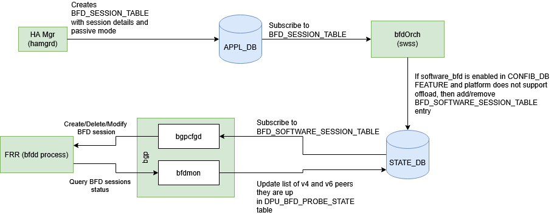

##  SmartSwitch - NPU-DPU liveness detection using BFD


- [About this Manual](#about-this-manual)
- [Definitions/Abbreviation](#definitionsabbreviation)
- [1. Requirements Overview](#1-requirements-overview)
  - [1.1 Functional Requirements](#11-functional-requirements)
  - [1.2 Scale Requirements](#12-scale-requirements)
  - [1.3 Default values](#13-default-values)
- [2. Modules Design](#2-modules-design)
  - [2.1 SmartSwitch NPU-DPU BFD sessions](#21-smartswitch-npu-dpu-bfd-sessions)
  - [2.2 APPL\_DB changes](#22-appl_db-changes)
  - [2.3 BFD Active-Passive mode](#23-bfd-active-passive-mode)
  - [2.4 DPU FRR Changes](#24-dpu-frr-changes)
  - [2.5 DPU Linux IPTables](#25-dpu-linux-iptables)
  - [2.6 NPU BFD session and VNET\_ROUTE\_TUNNEL](#26-npu-bfd-session-and-vnet_route_tunnel)

###### Revision

| Rev |     Date    |       Author          | Change Description                |
|:---:|:-----------:|:---------------------:|-----------------------------------|
| 0.1 |  03/01/2024  |     Kumaresh Perumal  | Initial version                  |

# About this Manual
This document provides general information about the NPU-DPU liveness detection using BFD probes between NPU and DPU.

# Definitions/Abbreviation

**Table 1: Abbreviations**

|                          |                                          |
|--------------------------|------------------------------------------|
| BFD                      | Bidirectional Forwarding Detection       |
| NPU                      | Network Processing Unit                  |
| DPU                      | Data Processing Unit                     |
| FRR                      | Open source routing stack                |

# 1. Requirements Overview

## 1.1 Functional Requirements

- BFD session(Active mode) in NPU using NPU's BFD H/W offload feature.

- BFD session(Passive mode) in DPU using FRR.

- BFD session between NPU and local DPU and remote DPU based on HA DPU
    pair.

## 1.2 Scale Requirements

- 64 BFD active sessions from NPU to each DPU in a T1 cluster.

- 8 BFD passive sessions from DPU to all NPUs in a T1 cluster.

## 1.3 Default values

- BFD TX_INTERVAL -- 100 msec(might change)

- BFD_RX_INTERVAL - 100 msec(might change)

- BFD session detect time multiplier - 3

- BFD session type: Active on NPU and Passive on DPU

- BFD mode: Multihop mode for sessions between NPU and remote DPU

# 2. Modules Design

## 2.1 SmartSwitch NPU-DPU BFD sessions

In a Smartswitch deployment, BFD sessions are created between NPU and
DPUs. Each T1 cluster has 8 T1s and 8 DPUs in each T1. To detect the
liveness of each DPU in the cluster, NPU creates Active BFD sessions to
all 64 DPUs and each DPU creates passive BFD sessions to all NPUs in the
cluster. When BFD keepalives are not detected for certain interval, BFD
sessions are marked as down and corresponding action is performed.
Multihop BFD sessions are created between NPU and a remote DPU.


## 2.2 APPL_DB changes

```
DASH_BFD_SESSION: {{vrf}}:{{ifname}}:{{ipaddr}}

    "tx_interval": {{interval}} (OPTIONAL)

    "rx_interval": {{interval}} (OPTIONAL)

    "multiplier": {{detection multiplier}} (OPTIONAL)

    "shutdown": {{false}}

    "multihop": {{false}}

    "local_addr": {{ipv4/v6}}

    "type": {{string}} (active/passive..)

; Defines APP DB schema to initiate BFD session.

'vrf' is mandatory key and if not intended, provide name as 'default'

'ifname' is mandatory key and if not intended by user (e.g: multihop session), provide the name as 'default'

'ipaddr' is mandatory key and user must provide the specific ipaddr value (IPv4 or IPv6). It will be NPU IPv4/IPv6 address.

'multihop' is set to True for BFD sessions with remote NPU.

'type' is set to 'async_passive' for all DPU BFD sessions.

```

## 2.3 BFD Active-Passive mode

HA manager in NPU creates BFD Active session with local and peer
information. NPU supports BFD hardware offload, so hardware starts
generating BFD packets to the peer. HA module in DPU creates
DASH_BFD_SESSION_TABLE with local and peer information. BgpCfgd checks
for the entries in the APPL_DB and configures BFD passive sessions in
FRR stack with local and peer information.



BFD passive sessions in DPU waits for BFD control packets from NPU's
active session. When FRR stack receives BFD packets from active sessions
in NPU, it starts responding. After the initial handshake, BFD sessions
are up. When active session doesn't receive control packets for
configured BFD timeout period, session is set to DOWN and corresponding
action is taken.


## 2.4 DPU FRR Changes

By default BFD Daemon is not enabled in FRR. FRR supervisor config file
has to be updated to start BFDD during FRR initialization.

To configure BFD passive sessions, a profile with 'passive' mode is
created and used for all sessions created in FRR. BgpCfgd configures FRR
stack using vtysh.

```

bfd

profile passive

passive-mode

receive-interval 100

transmit-interval 100

detect multiplier 3

exit

!

peer \<Local/Remote NPU IP\> local-address \<DPU PA\>

profile passive

exit
```

## 2.5 DPU Linux IPTables

New rules need to be added in the kernel to allow BFD packets to be
processed by the kernel and FRR stack. All packets matching BFD UDP(3784
and 4784)

***sudo iptables \--insert INPUT 5 -p udp \--dport 4784 -j ACCEPT***

***sudo iptables \--insert INPUT 5 -p udp \--dport 3784 -j ACCEPT***

## 2.6 NPU BFD session and VNET_ROUTE_TUNNEL

Overlay ECMP HLD describes how BFD session UP/Down changes the route to
VIP of a SDN appliance. In Overlay ECMP feature, all the nexthops are
VxLAN tunnel nexthops and the route to VIP is updated with primary or
secondary ECMP group based on the BFD session up/down state change. In
Smartswitch deployment, when a DPU VIP and one of the DPU is local to
NPU, nexthop will be a regular IP nexthop instead of a VxLAN NH.


Some of the scenarios when VIP is pointing to Local and Remote nexthops
and the BFD session state changes between NPU and DPU. In the below
scenarios, local NH is the IP nexthop to local DPU and Remote NH is the
VxLAN tunnel nexthop.

```

+-------------------------+------------+---------------+---------------+
| **VNET Route**          | *          | **BFD session | **Result**    |
|                         | *Primary** | update**      |               |
+=========================+============+===============+===============+
| VIP: {Local NH, Remote  | Local NH   | Local NH UP   | VIP: Local NH |
| NH}.                    |            |               |               |
|                         |            | Remote NH UP  |               |
+-------------------------+------------+---------------+---------------+
| VIP: {Local NH, Remote  | Local NH   | Local NH Down | VIP: Remote   |
| NH}                     |            |               | NH            |
|                         |            | Remote NH UP  |               |
+-------------------------+------------+---------------+---------------+
| VIP: {Local NH, Remote  | Remote NH  | Local NH UP   | VIP: Remote   |
| NH}                     |            |               | NH            |
|                         |            | Remote NH UP  |               |
+-------------------------+------------+---------------+---------------+
| VIP: {Local NH, Remote  | Remote NH  | Local NH UP   | VIP: Local NH |
| NH}                     |            |               |               |
|                         |            | Remote NH     |               |
|                         |            | Down          |               |
+-------------------------+------------+---------------+---------------+
| VIP: {local NH, Remote  | Local      | Local NH Down | Delete route  |
| NH}                     | /Remote NH |               | to VIP        |
|                         |            | Remote NH     |               |
|                         |            | Down          |               |
+-------------------------+------------+---------------+---------------+
| VIP: {Remote NH1,       | Remote NH1 | Remote NH1 UP | VIP: Remote   |
| Remote NH2}             |            |               | NH1           |
|                         |            | Remote NH2 UP |               |
+-------------------------+------------+---------------+---------------+
| VIP: {Remote NH1,       | Remote NH1 | Remote NH1    | VIP: Remote   |
| Remote NH2}             |            | DOWN          | NH2           |
|                         |            |               |               |
|                         |            | Remote NH2 UP |               |
+-------------------------+------------+---------------+---------------+
| VIP: {Remote NH1,       | Remote NH2 | Remote NH1 UP | VIP: Remote   |
| Remote NH2}             |            |               | NH2           |
|                         |            | Remote NH2 UP |               |
+-------------------------+------------+---------------+---------------+
| VIP: {Remote NH1,       | Remote NH2 | Remote NH1 UP | VIP: Remote   |
| Remote NH2}             |            |               | NH1           |
|                         |            | Remote NH2    |               |
|                         |            | Down          |               |
+-------------------------+------------+---------------+---------------+
| VIP: {Remote NH1,       | Remote     | Remote NH1    | Delete route  |
| Remote NH2}             | NH1/NH2    | Down          | to VIP        |
|                         |            |               |               |
|                         |            | Remote NH2    |               |
|                         |            | Down          |               |
+-------------------------+------------+---------------+---------------+

```
