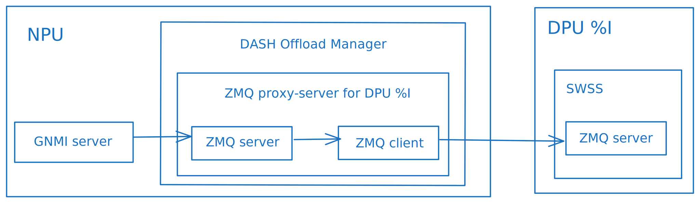
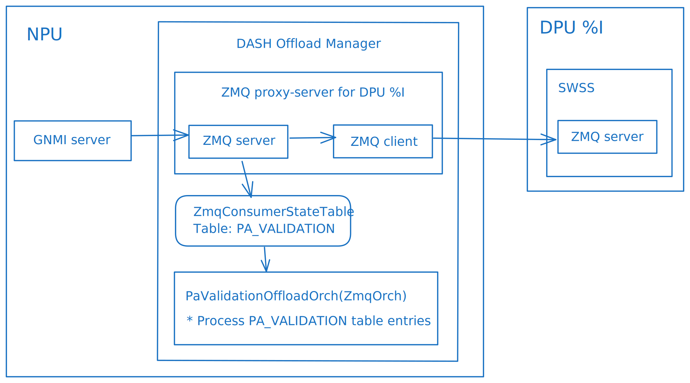
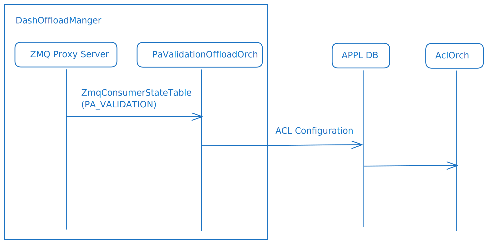

## SmartSwitch PA Validation NPU Offload

- [About this Manual](#about-this-manual)
- [Definitions/Abbrevations](#definitionsabbrevations)
- [1. Requirements Overview](#1-requirements-overview)
  - [1.1 Functional Requirements](#11-functional-requirements)
  - [1.2 Scale Requirements](#12-scale-requirements)
- [2 Modules Design](#2-modules-design)
  - [2.1 Dash Offload Manager](#21-dash-offload-manager)
    - [2.1.1 SONiC GNMI server changes](#211-sonic-gnmi-server-changes)
  - [2.2 PA Validation Offload](#22-pa-validation-offload)
    - [2.2.1 PA Validation Offload ACL configuration](#221-pa-validation-offload-acl-configuration)
  - [2.3 DPU Shut/Restart](#23-dpu-shutrestart)
- [3. Test Plan](#3-test-plan)

###### Revision

| Rev |     Date    |       Author          | Change Description                |
|:---:|:-----------:|:---------------------:|-----------------------------------|
| 0.1 |  06/10/2024 |     Kumaresh Perumal  | Initial version                  |
| 0.2 |  08/21/2024 |          Yakiv Huryk  | Added DashOffloadManager         |


# About this Manual
This document provides general information about offloading PA validation feature to NPU in Smartswitch.

# Definitions/Abbrevations

|                          |                                          |
|--------------------------|------------------------------------------|
| ACL                      | Access Control List                      |
| NPU                      | Network Processing Unit                  |
| DPU                      | Data Processing Unit                     |
 

# 1. Requirements Overview

## 1.1 Functional Requirements
- Provide a generic infrastructure for offloading DASH functionality to the NPU (DashOffloadManager).
- DashOffloadManager should listen to the DASH configuration and either intercept it for offloading, or forward it to the DPU.
- Provide PA validation support in NPU when this feature is not supported in DPU pipeline model.
- Use existing ACL tables and ACL rules design in NPU.

## 1.2 Scale Requirements

# 2 Modules Design

## 2.1 Dash Offload Manager
The new orchagent application DashOffloadManager will be responsible for DASH offloading logic. It will collect all the needed information for offloading and perform all the relevant configurations.
To get the DASH configuration that should be offloaded, the DashOffloadManager will act as a transparent ZMQ proxy between the GNMI server and the DPU swss, forwarding all the configuration and intercepting the tables that should be offloaded.
To simplify the management of the DPU offload and achieve optimal performance, every DPU is handled by a separate instance of a ZMQ Proxy (pair of ZMQ Server and Client)



Once the offload is required, the DashOffloadManager will start designated orch (e.g. PAValidationOffloadOrch) that will subscribe to the configuration and do the offload logic.



The Dash Offload Manager is disabled by default and only enabled for specific platforms that require its functionality.

### 2.1.1 SONiC GNMI server changes
A new parameter `zmq_dpu_proxy_address_base` is added to the telemetry.go to enable the GNMI Server -> DASH Offload Manager ZMQ connection. If specified, the GNMI server will use `zmq_dpu_proxy_address_base + dpu_index:zmq_port` as a destination for DPU ZMQ connection. For example, on the system with 2 DPUs and base address 127.0.0.10, the DASH Offload Manager's ZMQ server runs on 127.0.0.10:8100 for DPU0 and on 127.0.0.11:8100 for DPU1.

## 2.2 PA Validation Offload

A new orchagent (PaValidationOffloadOrch) is responsible for offloading the PA_VALIDATION table entries. Once started by DashOffloadManager, it subscribes to the PA_VALIDATION table and maps the PA validation entries into the ACL configuration.

### 2.2.1 PA Validation Offload ACL configuration

The offloading is achieved by using a User-Defined EGRESS ACL table bound to the NPU<->DPU port. The table is created/managed per DPU.

```
{
    "ACL_TABLE_TYPE": {
        "DASH_PA_VALIDATION": {
            "MATCHES": [
                "TUNNEL_VNI",
                "SRC_IP",
                "SRC_IPV6"
            ],
            "ACTIONS": [
                "PACKET_ACTION"
            ],
            "BIND_POINTS": [
                "PORT"
            ]
        }
    }
}
```

Please refer to https://github.com/sonic-net/SONiC/blob/master/doc/acl/ACL-Table-Type-HLD.md for more details regarding User-Defined ACL tables.

The ACL table configuration:

```
{
  "ACL_TABLE": {
    "DASH_PA_VALIDATION_DPU0": {
      "STAGE": "EGRESS",
      "TYPE": "DASH_PA_VALIDATION",
      "PORTS": ["Ethernet0"]
      }
    }
}
```

Each PA Validation entry is translated into the following set of rules:

1) For every address in pa_validation.addresses:
```
{
  "ACL_RULE": {
    "DASH_PA_VALIDATION_DPU0|RULE_VNI_{pa_validation.vni}_{idx}": {
      "PRIORITY": "10",
      "PACKET_ACTION": "ACCEPT",
      "SRC_IP": "{address}/32",
      "TUNNEL_VNI": {pa_validation.vni}
    }
  }
}
```

2) Single drop rule with the lower priority:
```
{
  "ACL_RULE": {
    "DASH_PA_VALIDATION_DPU0|RULE_VNI_{pa_validation.vni}_DROP": {
      "PRIORITY": "1",
      "PACKET_ACTION": "DROP",
      "TUNNEL_VNI": {pa_validation.vni}
    }
  }
}
```



## 2.3 DPU Shut/Restart
When DPU goes down/restarts, the ACL configuration should be cleaned. It's done by the Dash Offload Manager which listens to the ChassisStateDB DPU_STATE Table. When it detects that the DPU is down (dpu_control_plane_state is down), the PaValidationOffloadOrch is deinitialized, leading to ACL configuration cleanup and ZMQ proxy subscription removal.

# 3. Test Plan

| Test ID             | Testcase              | Expectation |
|:-----------------:|:----------------------------------|:--------------------|
|1                  | PA_VALIDATION entries pushed to DPU| Check Egress ACL_TABLE attached to the DPU port and contains the rules.|
|2                  | Add more PA_VALIDATION entries     | The ACL rules are added to the Egress ACL table. |
|3                  | Delete PA_VALIDATION entries       | Deletion of ACL rules from NPU. |
|4                  | DPU shutdown                       | ACL configuration is cleaned. |
