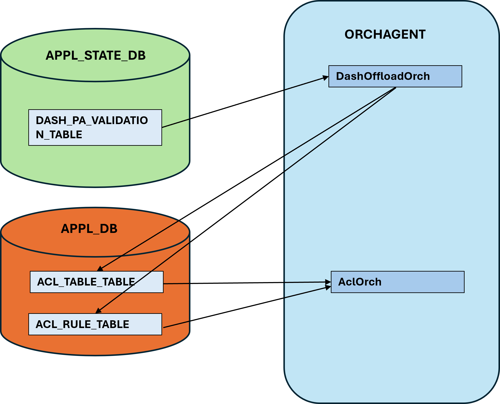
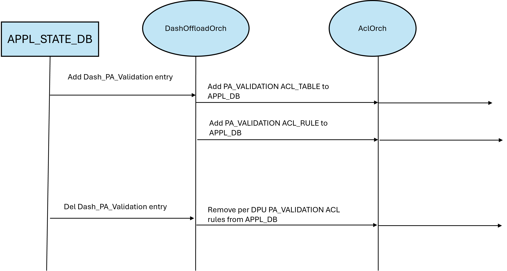

## SmartSwitch PA Validation NPU Offload

- [About this Manual](#about-this-manual)
- [Definitions/Abbrevations](#definitionsabbrevations)
- [1. Requirements Overview](#1-requirements-overview)
  - [1.1 Functional Requirements](#11-functional-requirements)
  - [1.2 Scale Requirements](#12-scale-requirements)
- [2 Modules Design](#2-modules-design)
  - [2.1 STATE\_DB changes(per-DPU)](#21-state_db-changesper-dpu)
  - [2.2 APPL\_STATE\_DB](#22-appl_state_db)
  - [2.3 Orchagent Changes](#23-orchagent-changes)
  - [2.4 DPU Shut/Restart](#24-dpu-shutrestart)
- [3. Test Plan](#3-test-plan)

###### Revision

| Rev |     Date    |       Author          | Change Description                |
|:---:|:-----------:|:---------------------:|-----------------------------------|
| 0.1 |  06/10/2024 |     Kumaresh Perumal  | Initial version                  |


# About this Manual
This document provides general information about offloading PA validation feature to NPU in Smartswitch.

# Definitions/Abbrevations

|                          |                                          |
|--------------------------|------------------------------------------|
| ACL                      | Access Control List                      |
| NPU                      | Network Processing Unit                  |
| DPU                      | Data Processing Unit                     |
 

# 1. Requirements Overview

## 1.1 Functional Requirements
- Query DPU SAI for PA Validation feature availability.
- Provide PA validation support in NPU when this feature is not supported in DPU pipeline model.
- Use existing ACL tables and ACL rules design in NPU.
- New orchagent(DashOffloadOrch) is added to support this feature and future offloads to NPU.

## 1.2 Scale Requirements

# 2 Modules Design

## 2.1 STATE_DB changes(per-DPU)
New table in STATE_DB(DASH_OFFLOAD_STATE_TABLE) is added to inform NPU about DPU SAI capability and whether NPU offload is required for certain feature. During SAI initialization, DashOrchagent queries SAI API(SAI_API_DASH_PA_VALIDATION) and sets the state_db table with the NPU offload state.

| Table             | Key              | Field                   | Description
|:-----------------:|:----------------:|:-----------------------:|:--------------:|
|DASH_OFFLOAD_STATE_TABLE |
|                   | DPU_ID           |                         |                |
|                   |                  | pa_validation           |  "true" - NPU offload required|
|                   |                  |                         | "false" - NPU offload not required|


## 2.2 APPL_STATE_DB
Based on the DPU's capability and when NPU offload is required, DashOrchagent writes all DASH_PA_VALIDATION table entries to APPL_STATE_DB. These APPL_STATE_DB entries are accessed by NPU SWSS to offload the feature to NPU. For more information of NPU and DPU database architecture, please refer to https://github.com/sonic-net/SONiC/blob/master/doc/smart-switch/smart-switch-database-architecture/smart-switch-database-design.md


## 2.3 Orchagent Changes

New orchagent(DashOffloadOrch) is created to offload PA_VALIDATE rules to NPU. DashOffloadOrch listens to DASH_PA_VALIDATION_TABLE entry updates in APPL_STATE_DB. Orchagent creates a new ACL table "PA_VALIDATION" and bind to all DPU connected ports in the EGRESS direction. For every Source IP address in the DASH_PA_VALIDATION rule entry, orchagent creates ACL rules:

```
for (SRC_IP : SRC_IP_LIST from the table)
    - {VNI, SRC_IP} and PERMIT action with priority 100
- {VNI} and DENY action with priority 10
```

Orchagent process Add/update/delete operations on the tables and update the ACL rules accordingly.





## 2.4 DPU Shut/Restart
When DPU goes down, DashOrchagent doesn't remove PA_VALIDATION entries from APPL_STATE_DB. These entries will remain in the NPU. Since there will be no traffic to the DPU, these PA validation rules will not be exercised.

When DPU restarts, DPU DB service will cleanup all the old entries from APPL_STATE_DB. This will trigger removal of all the previous PA_VALIDATION ACL rules and new rules are added to NPU ASIC.

For more details about NPU and DPU database, please refer to https://github.com/sonic-net/SONiC/blob/master/doc/smart-switch/smart-switch-database-architecture/smart-switch-database-design.md

# 3. Test Plan

| Test ID             | Testcase              | Expectation |
|:-----------------:|:----------------------------------:|:--------------------:|
|1                  | PA_VALIDATION rules pushed to DPU  | Check Egress ACL_TABLE attached to all DPU connected ports.|
|2                   | Add more PA_VALIDATION rules        |Only one Egress ACL table and all the rules. |                         |                |
|3                   | Delete PA_VALIDATION entries | Deletion of ACL rules from NPU. |
|4.                   | DPU shut                    | No removal of ACL rules from NPU.|
|5.                   | DPU unshut                  | Old ACL entries are removed and new entries are added.
