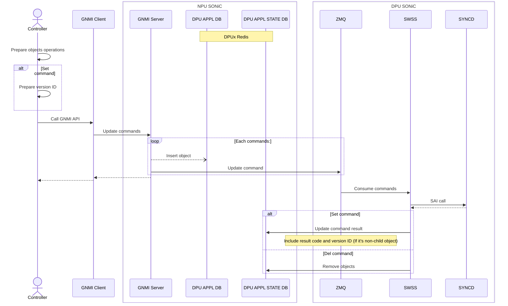
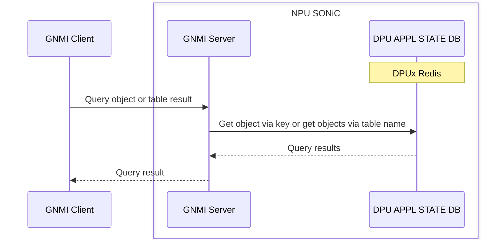
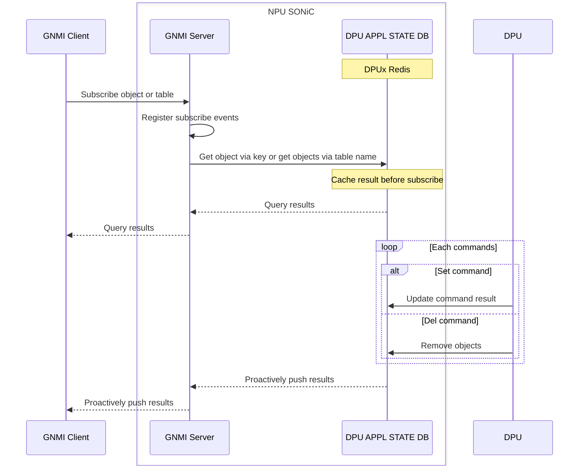

# Smart Switch GNMI feedback design <!-- omit in toc -->

## Table of content <!-- omit in toc -->

- [Revision](#revision)
- [Overview](#overview)
- [Requirement](#requirement)
- [Sequence flow](#sequence-flow)
  - [Set/Remove](#setremove)
  - [Message](#message)
  - [Get](#get)
  - [Subscribe](#subscribe)
- [Table](#table)
  - [DPU APPL STATE DB](#dpu-appl-state-db)
    - [Example 1 DASH\_ROUTE\_TABLE](#example-1-dash_route_table)
    - [Example 2 DASH\_ROUTING\_APPLIANCE\_TABLE](#example-2-dash_routing_appliance_table)

## Revision

|  Rev  | Date  | Author | Change Description |
| :---: | :---: | :----: | ------------------ |
|  0.1  |       | Ze Gan | Initial version.   |

## Overview

The controller communicates with SmartSwitch via the GNMI interface. To enhance configuration efficiency, we provide batch GNMI operations to the GNMI client, allowing it to submit multiple operations in a single request. This document covers two communication channels: the external channel between the GNMI client and server, and the internal channel between the GNMI server and DPU SAI.

## Requirement

- Support for multiple operations in a single request
- Non-child objects must always include the version ID field, and the version ID should be maintained by the controller(VNET or SDN side) side.
- The GNMI server supports set, remove, get, and subscribe operations
- The GNMI client can proactively subscribe to or get objects/tables via object key or table name

| Child object      |
| ----------------- |
| DASH_ACL_RULE     |
| DASH_ROUTE        |
| DASH_ROUTE_RULE   |
| DASH_VNET_MAPPING |

## Sequence flow

### Set/Remove



### Message

### Get



### Subscribe



## Table

### DPU APPL STATE DB

Any entry in DPU APPL STATE DB will be mapped to an entry in DPU APPL DB. Their key are totally same. But the value of entry in DPU APPL STATE DB may include its version ID and its result if it's an parent objects or only includes its result to child objects. Typically, a result of 0 indicates the object was successfully applied to the DPU, otherwise it indicates some kind of error occurred.

#### Example 1 DASH_ROUTE_TABLE

```text
DASH_ROUTE_TABLE:{{group_id}}:{{prefix}}
    "result": {{result}}

key         = DASH_ROUTE_TABLE:group_id:prefix
; field     = value
result      = uint32 0 for success, > 0 for error code
```

#### Example 2 DASH_ROUTING_APPLIANCE_TABLE

```
DASH_ROUTE_GROUP_TABLE:{{group_id}}
    "result": {{result}}
    "version_id": {{string}}

key         = DASH_ROUTE_GROUP_TABLE:group_id
; field     = value
result      = uint32 0 for success, > 0 for error code
version_id  = string, Indicate the unique version of metadata of route group. E.G. "1", "1.1".
```
