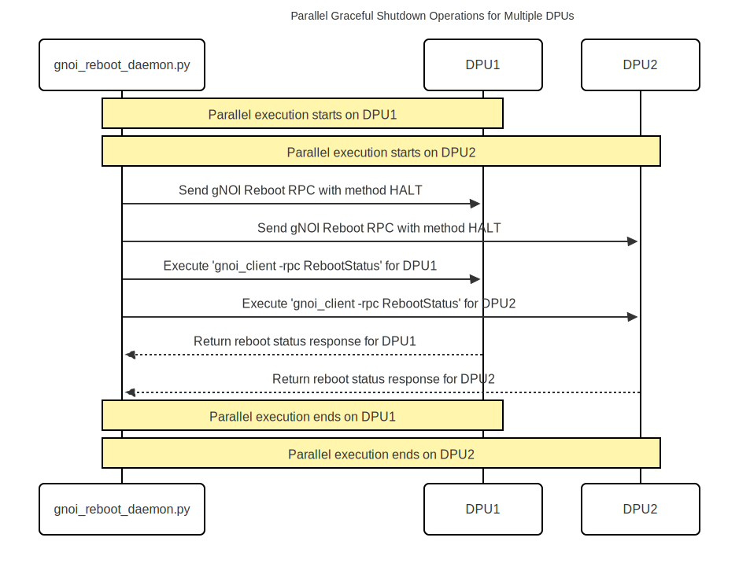

# SmartSwitch DPU Graceful Shutdown

| Rev | Date | Author | Change Description |
| --- | ---- | ------ | ------------------ |
| 0.1 | 12/05/2025 | Ramesh Raghupathy | Initial version|


## Definitions / Abbreviations

| Term | Meaning |
| --- | ---- |
| PMON | Platform Monitor |
| DPU | Data Processing Unit |
| gRPC | Generic Remote Procedure Calls |
| gNOI | gRPC Network Operations Interface |
| gNMI  | gRPC Network Management Interface |

## Introduction
SmartSwitch supports graceful reboot of the DPUs. Given this, it is quiet natural that we provide support for graceful shutdown of the DPUs. Though it may sound like that the graceful shutdown is the first half of graceful reboot, it is not so because the way it is invoked, the code path for the shutdown are different making the implementation little complex. Besides this, the limitation of the absence of docker, the container separation, and the platform agnostic implementation adds to the challenge of invoking the gnoi call from this code path. Graceful shutdown on each DPU happens in parallel.

## DPU Graceful Shutdown Sequence

The following sequence diagram illustrates the detailed steps involved in the graceful shutdown of a DPU:

<p align="center"></p>

## Sequence of Operations

1. CLI Command Execution:
   * The user issues the command "config chassis module shutdown DPUx".

2. Chassis Daemon Invocation:

   * chassisd receives the command and calls set_admin_state(down) on module.py to initiate the shutdown process for DPUx.

3. Module Shutdown Request:

   * module.py delegates the graceful shutdown request to module_base.py, to complete the graceful pre-shutdown process in a platform agnostic way.

4. IPC via Named Pipe:

   * module_base.py writes a JSON-formatted reboot request to the named pipe located at /host/gnoi_reboot.pipe.

5. Daemon Receives Request:

   * The gnoi_reboot_daemon.py monitors /var/run/gnoi_reboot.pipe and detects the new reboot request.

6. gNOI Reboot RPC Execution:

   * The daemon sends a gNOI Reboot RPC with the method HALT to the sysmgr in DPUx.
   * The sysmgr, in turn, issues a DBUS request "reboot -p" to initiate the reboot process on DPUx.

7. Reboot Status Verification:

   * Since the initial RPC returns an immediate acknowledgment without confirming the reboot status, the daemon executes gnoi_client -rpc RebootStatus to query the current reboot status of DPUx.

8. Status Response Handling:

   * DPUx responds with its current reboot status.

   * The daemon logs the result using sonic_py_common.logger.

   * The daemon writes the reboot result to /var/run/gnoi_reboot_response.pipe.

9. Result Retrieval:

   * module_base.py reads the reboot result from /host/gnoi_reboot_response.pipe.

   * The result is returned to module.py.

10. Final Shutdown Procedure:

   * Based on the reboot result, module.py proceeds to shut down DPUx via the platform API.

## Objective

This design enables the `chassisd` process running in the PMON container to invoke a **gNOI-based reboot** when it triggers the "set_admin_state(down)" API of a DPU module, without relying on `docker`, `bash`, or `hostexec` within the container.

## Constraints

- The PMON container is highly restricted: no `docker`, `hostexec`, or `bash`.
- gNOI reboot requires executing a command using `docker exec` on the host.
- Communication must be initiated from PMON and executed by the host.

---

## Design Overview

The solution uses a **named pipe (FIFO)** created on the host and bind-mounted into the PMON container. PMON writes structured reboot requests (as JSON) into the pipe. A lightweight daemon running on the host listens for messages on this pipe, and executes the appropriate `docker exec` command using `gnoi_client`.

### Reboot Request Message Format
This JSON-formatted message is written to the named pipe (e.g., /host/gnoi_reboot.pipe) to initiate a reboot request for a specific DPU.
```
{
  "dpu_id": "DPU0",
  "method": "HALT",
  "ip": "192.168.100.10",
  "port": "9339",
  "timestamp": "2025-05-19T18:57:06Z",
  "reason": "Scheduled maintenance"
}
```
**Fields:**
   * **dpu_id:** Identifier of the target DPU (e.g., "DPU0").

   * **method:** Reboot method, such as HALT, COLD, or WARM.

   * **ip:** IP address of the target DPU.

   * **port:** Port number for the gNOI service on the DPU.

   * **timestamp:** ISO 8601 formatted timestamp indicating when the request was made.

   * **reason:** Optional field providing the reason for the reboot.


### Reboot Response Message Format
After processing the reboot request, the response is written to another named pipe (e.g., /host/gnoi_reboot_response.pipe) to convey the outcome>
```
{
  "dpu_id": "DPU0",
  "status": "SUCCESS",
  "timestamp": "2025-05-19T19:00:00Z",
  "message": "Reboot completed successfully."
}
```
**Fields:**
   * **dpu_id:** Identifier of the target DPU.

   * **status:** Result status of the reboot operation, such as SUCCESS or FAILURE.
   
   * **timestamp:** ISO 8601 formatted timestamp indicating when the request was made.

   * **message:** Detailed message or error description related to the reboot operation.

## Parallel Execution

The following sequence diagram illustrates the parallel execution of graceful shutdown of multiple DPUs:

<p align="center"></p>

---

## IPC Method Comparison: Redis STATE_DB vs. Named Pipe

| Aspect                          | Redis `STATE_DB` IPC                                                                                            | Named Pipe IPC                                                                               |
| ------------------------------- | --------------------------------------------------------------------------------------------------------------- | -------------------------------------------------------------------------------------------- |
| **Mechanism**                   | Utilizes Redis Pub/Sub model with subscription handlers for event-driven communication.                         | Employs file-based FIFO (First-In-First-Out) special files for direct process communication. |
| **Event Handling**              | Subscription handlers wait for events; suitable for frequent events.                                            | Processes block until the other end is ready; efficient for infrequent events.               |
| **Overhead**                    | Introduces additional load on Redis, especially with multiple tables; impact in large-scale systems is unknown. | Minimal overhead; relies on the operating system's file system mechanisms.                   |
| **Message Persistence**         | Messages are transient; if no subscriber is listening, messages are lost.                                       | Data remains in the pipe until read; ensures delivery if the reader is available.            |
| **Suitability for Rare Events** | May be overkill for rare events like DPU shutdowns; the persistent subscription may not be justified.           | Well-suited for rare events; resources are utilized only during the event occurrence.        |

## Summary

**Redis STATE_DB IPC:** Offers an event-driven model suitable for frequent and scalable inter-process communications. However, it introduces additional overhead and complexity, which might not be justified for rare events like DPU shutdowns.

**Named Pipe IPC:** Provides a straightforward and efficient mechanism for IPC, especially apt for infrequent events. Its simplicity and low overhead make it a practical choice for scenarios where events are rare.

---

