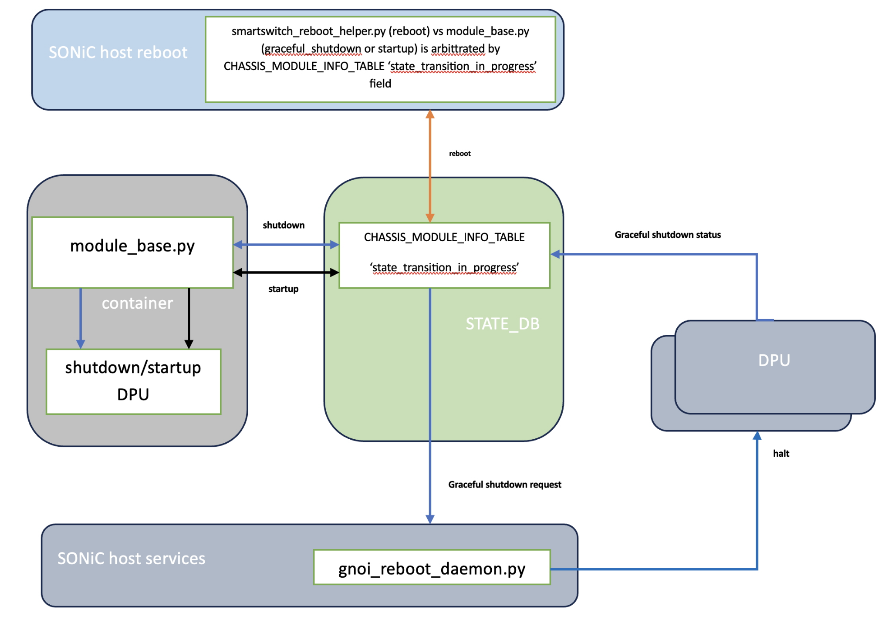

# SmartSwitch DPU Graceful Shutdown

| Rev | Date | Author | Change Description |
| --- | ---- | ------ | ------------------ |
| 0.1 | 12/05/2025 | Ramesh Raghupathy | Initial version|


## Definitions / Abbreviations

| Term | Meaning |
| --- | ---- |
| PMON | Platform Monitor |
| DPU | Data Processing Unit |
| gRPC | Generic Remote Procedure Calls |
| gNOI | gRPC Network Operations Interface |
| gNMI  | gRPC Network Management Interface |

## Introduction
SmartSwitch supports graceful reboot of the DPUs. Given this, it is quiet natural that we provide support for graceful shutdown of the DPUs. Though it may sound like that the graceful shutdown is the first half of graceful reboot, it is not so because the way it is invoked, the code path for the shutdown are different making the implementation little complex. Besides this, the limitation of the absence of docker, the container separation, and the platform agnostic implementation adds to the challenge of invoking the gNOI call from this code path. Graceful shutdown on each DPU happens in parallel.

## DPU Graceful Shutdown Sequence

The following sequence diagram illustrates the detailed steps involved in the graceful shutdown of a DPU:

<p align="center"></p>

## Sequence of Operations

1. **Daemon Initialization:**

   * Upon startup, `gnoi_reboot_daemon.py` subscribes to the `CHASSIS_MODULE_INFO_TABLE` to monitor incoming shutdown/reboot requests. The state transition will be no-op for startup requests.

2. **CLI Command Execution:**

   * The user executes the command `config chassis module shutdown DPUx` via the CLI or a config load.

3. **Chassis Daemon Processing:**

   * `chassisd` receives the shutdown command and invokes set_admin_state(down) on `module_base.py`.

   * Within `module_base.py`, the system checks if the device subtype is `"SmartSwitch"` and not a DPU.

   * If both conditions are met, it proceeds with the graceful shutdown process, else calls `module.py` `set_admin_state(down)`

4. **Graceful Shutdown Handler Invocation:**

   * `module_base.py` calls the `graceful_shutdown_handler()` method to initiate the graceful shutdown sequence.

5. **Reboot Request Creation:**

   * Within the `graceful_shutdown_handler()`, `state_transition_in_progress` `True`is written to the `CHASSIS_MODULE_INFO_TABLE` in Redis STATE_DB for DPUx along with `transition_type`.

6. **Daemon Notification and Processing:**

   * `gnoi_reboot_daemon.py` detects the `state_transition_in_progress` turning `True` in `CHASSIS_MODULE_INFO_TABLE` and sends a gNOI Reboot RPC with the method `HALT` to the sysmgr in DPUx, which in turn issues a DBUS request to execute `reboot -p` on DPUx.

7. **Reboot Request**:

   * The daemon forwards the reboot request.

8. **Reboot Status Monitoring:**

   * The daemon sends  `gnoi_client -rpc RebootStatus` to monitor the reboot status of DPUx.
   
9. **DPUx Returns Status:**

   * DPUx returns the reboot status response to the daemon.

10. **Reboot Result Update in DB:**

      * The daemon writes the reboot result to the `CHASSIS_MODULE_INFO_TABLE` in Redis STATE_DB by turning `state_transition_in_progress` `False`.

      * In case of a reboot result failure the result gets updated after the timeout.

11. **Read the Result:**

      * `module_base.py` in a loop reads the `state_transition_in_progress` turning `False` in `CHASSIS_MODULE_INFO_TABLE` every 5 secs.

12. **Log the Result:**

      * `module_base.py` logs the reboot result accordingly.

13. **Final State Transition:**

      * `module_base.py` invokes `set_admin_state(down)` on `module.py`.

      * `module.py` calls the platform API to power down the module when the DPUx completes kernel shutdown.

## Objective

This design enables the `chassisd` process running in the PMON container to invoke a **gNOI-based reboot** when it triggers the "set_admin_state(down)" API of a DPU module, without relying on `docker`, `bash`, or `hostexec` within the container.

## Constraints

- The PMON container is highly restricted: no `docker`, `hostexec`, or `bash`.
- gNOI reboot requires executing a command using `docker exec` on the host.
- Communication must be initiated from PMON and executed by the host.

---

## Design Overview

In the Redis STATE_DB IPC approach, SONiC leverages Redis's publish-subscribe mechanism to facilitate inter-process communication between components. This event-driven design ensures decoupled and reliable communication between components.

### CHASSIS_MODULE_INFO_TABLE Schema (STATE_DB)

KEY: `CHASSIS_MODULE_INFO_TABLE|<MODULE_NAME>`.

| Field                          | Description                                                                                  |
| ------------------------------ | -------------------------------------------------------------------------------------------- |
| `state_transition_in_progress` | `"True"` indicates that a transition is ongoing; `"False"` or absence implies no transition. |
| `transition_start_time`        | Timestamp in human-readable UTC format representing the start of the transition.             |
| `transition_type`              | Specifies the nature of the transition: `"shutdown"`, `"reboot"`, or `"startup"`.            |

**Example:**
```
CHASSIS_MODULE_INFO_TABLE|DPU0
{
  "state_transition_in_progress": "True",
  "transition_start_time": "Mon Jun 17 08:32:10 UTC 2025",
  "transition_type": "shutdown"
}
```

| Transition Type       | Who Sets the Field                                              | How It's Cleared                                    |
| --------------------- | --------------------------------------------------------------- | --------------------------------------------------- |
| **Startup**           | `chassisd` on a CLI or config load, before starting a DPU       | Once module reaches online state                    |
| **Graceful Shutdown** | `chassisd` on a CLI or config load, before triggering gNOI HALT | `gnoi-reboot-daemon` upon receiving status          |
| **gNOI Reboot**       | `smartswitch_reboot_helper`                                     | `gnoi-reboot-daemon` once reboot status is received |

## Parallel Execution

The following sequence diagram illustrates the parallel execution of graceful shutdown of multiple DPUs:

<p align="center"></p>

## Interoperability between DPU Graceful Shutdown & gNOI Reboot

<p align="center"></p>

The diagram above illustrates two scenarios where both module_base.py and smartswitch_reboot_helper might attempt to initiate a shutdown and reboot simultaneously. When there is a race condition the one that writes the `CHASSIS_MODULE_INFO_TABLE`  `state_transition_in_progress` field wins. In case if the `state_transition_in_progress` is `True` as a result of DPU startup in progress both reboot and shutdown will fail. It is up to the requesting module to re-issue the transaction if needed.

**Scenario 1:** smartswitch_reboot_helper **triggers first**

* smartswitch_reboot_helper writes an entry to `CHASSIS_MODULE_INFO_TABLE`  with `state_transition_in_progress` `True`.

* gnoi_reboot_daemon.py, already subscribed to this table, is notified of the new entry.

* The daemon sends a gNOI Reboot RPC with the method HALT to the sysmgr in DPUx, initiating the reboot process.

* The daemon writes the reboot result to the `CHASSIS_MODULE_INFO_TABLE` by toggling `state_transition_in_progress`  to `False`.

* If module_base.py attempts to write to `CHASSIS_MODULE_INFO_TABLE`  with `state_transition_in_progress` `True` during this process, the operation will fail. The user has to retry the shutdown operation again.

**Scenario 2:** module_base.py **triggers first**

* module_base.py writes an entry to 
* smartswitch_reboot_helper writes an entry to `CHASSIS_MODULE_INFO_TABLE`  with `state_transition_in_progress` `True`.

* gnoi_reboot_daemon.py is notified of the new entry and proceeds to send a gNOI Reboot RPC with the method HALT to the sysmgr in DPUx.

* The daemon writes the reboot result to the `CHASSIS_MODULE_INFO_TABLE` by toggling `state_transition_in_progress`  to `False`.

* If smartswitch_reboot_helper attempts to write to `CHASSIS_MODULE_INFO_TABLE`  with `state_transition_in_progress` `True` during this process, the operation will fail.

* The graceful shutdown completes as planned. So, there is no need for the reboot in this situation.

**Scenario 3:** chassisd DPU startup **triggers first**

* If module_base.py tries to shutdown, it will be rejected and this operation has to be retried if needed.

* If smartswitch_reboot_helper tries to reboot, it will be rejected and there is no need to reboot again as the DPU has been restarted just now.

**Scenario 4:** DPU reboot **triggers first followed by switch reboot**

* In this situation the reboot logic should retry shutting down the DPUx that returned a failure only if the DPUx is not admin_down.

This design ensures that only one reboot process is initiated, regardless of which component triggers it first, thereby preventing race conditions and ensuring system stability.

---

## References

- [PMON HLD](https://github.com/sonic-net/SONiC/blob/master/doc/smart-switch/pmon/smartswitch-pmon.md)
- [Smart Switch Reboot HLD](https://github.com/sonic-net/SONiC/blob/master/doc/smart-switch/reboot/reboot-hld.md)

---
