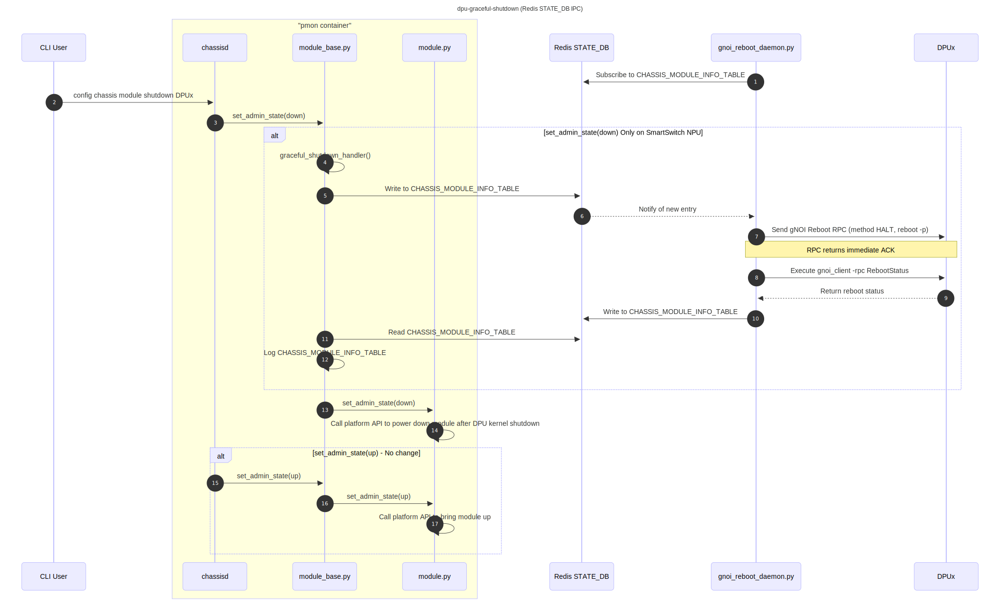

# SmartSwitch DPU Graceful Shutdown

| Rev | Date | Author | Change Description |
| --- | ---- | ------ | ------------------ |
| 0.1 | 12/05/2025 | Ramesh Raghupathy | Initial version|


## Definitions / Abbreviations

| Term | Meaning |
| --- | ---- |
| PMON | Platform Monitor |
| DPU | Data Processing Unit |
| gRPC | Generic Remote Procedure Calls |
| gNOI | gRPC Network Operations Interface |
| gNMI  | gRPC Network Management Interface |

## Introduction
SmartSwitch supports graceful reboot of the DPUs. Given this, it is quiet natural that we provide support for graceful shutdown of the DPUs. Though it may sound like that the graceful shutdown is the first half of graceful reboot, it is not so because the way it is invoked, the code path for the shutdown are different making the implementation little complex. Besides this, the limitation of the absence of docker, the container separation, and the platform agnostic implementation adds to the challenge of invoking the gnoi call from this code path. Graceful shutdown on each DPU happens in parallel.

## DPU Graceful Shutdown Sequence

The following sequence diagram illustrates the detailed steps involved in the graceful shutdown of a DPU:

<p align="center"></p>

## Sequence of Operations

1. **Daemon Initialization:**

   * Upon startup, `gnoi_reboot_daemon.py` subscribes to the `GNOI_REBOOT_REQUEST` table in Redis STATE_DB to monitor incoming reboot requests.

2. **CLI Command Execution:**

   * The user executes the command `config chassis module shutdown DPUx` via the CLI.

3. **Chassis Daemon Processing:**

   * `chassisd` receives the shutdown command and invokes set_admin_state(down) on `module_base.py`.

   * Within `module_base.py`, the system checks if the device subtype is `"SmartSwitch"` and not a DPU.

   * If both conditions are met, it proceeds with the graceful shutdown process, else calls `module.py` `set_admin_state(down)`

4. **Graceful Shutdown Handler Invocation:**

   * `module_base.py` calls the `graceful_shutdown_handler()` method to initiate the graceful shutdown sequence.

5. **Reboot Request Entry Creation:**

   * Within the `graceful_shutdown_handler()`, an entry is written to the `GNOI_REBOOT_REQUEST` table in Redis STATE_DB for DPUx.

6. **Daemon Notification and Processing:**

   * `gnoi_reboot_daemon.py` detects the new entry in `GNOI_REBOOT_REQUEST` and sends a gNOI Reboot RPC with the method `HALT` to the sysmgr in DPUx, which in turn issues a DBUS request to execute `reboot -p` on DPUx.

7. **Reboot Request**:

   * The daemon forwards the reboot request.

8. **Reboot Status Monitoring:**

   * The daemon sends  `gnoi_client -rpc RebootStatus` to monitor the reboot status of DPUx.
   
9. **DPUx Returns Status:**

   * DPUx returns the reboot status response to the daemon.

10. **Reboot Result Update in DB:**

      * The daemon writes the reboot result to the `GNOI_REBOOT_RESULT` table in Redis STATE_DB.

      * In case of a reboot result failure the result gets updated after the timeout.

11. **Read the Result:**

      * `module_base.py` in a loop reads the new entry in `GNOI_REBOOT_RESULT` every 5 secs.

12. **Log the Result:**

      * `module_base.py` logs the reboot result accordingly.

13. **Final State Transition:**

      * `module_base.py` invokes `set_admin_state(down)` on `module.py`.

      * `module.py` calls the platform API to power down the module.

## Objective

This design enables the `chassisd` process running in the PMON container to invoke a **gNOI-based reboot** when it triggers the "set_admin_state(down)" API of a DPU module, without relying on `docker`, `bash`, or `hostexec` within the container.

## Constraints

- The PMON container is highly restricted: no `docker`, `hostexec`, or `bash`.
- gNOI reboot requires executing a command using `docker exec` on the host.
- Communication must be initiated from PMON and executed by the host.

---

## Design Overview

In the Redis STATE_DB IPC approach, SONiC leverages Redis's publish-subscribe mechanism to facilitate inter-process communication between components. This event-driven design ensures decoupled and reliable communication between components.

### GNOI_REBOOT_REQUEST Table
   **Database:** STATE_DB

   **Purpose:** Signals a reboot request for a specific DPU.

   **Key Format:** GNOI_REBOOT_REQUEST|<DPU_ID>

   **Fields:**

   | Field       | Type   | Description                                   |
   | ----------- | ------ | --------------------------------------------- |
   | `start`     | string | "true" or "false"                             |
   | `method`    | string | Reboot method code (e.g., "3" for HALT)       |
   | `timestamp` | string | ISO 8601 formatted timestamp of the request.  |
   | `message`   | string | Optional reason for the reboot.               |

The `start` field is:
   * **Set to** "true": When a reboot is requested for a DPU, the start field is set to "true". This change is detected by the gnoi-reboot-daemon, which then initiates the reboot process.
   * **Set to** "false": After the gnoi-reboot-daemon processes the request (regardless of success or failure), it resets the start field to "false" to indicate that the request has been handled.

**Example:**
```
  {
    "start": "true",
    "method": "HALT",
    "timestamp": "2025-05-19T18:57:06Z",
    "message": "Scheduled maintenance"
  }
```

### GNOI_REBOOT_RESULT Table schema
   **Database:** STATE_DB
   
   **Purpose:** Stores the result of the reboot operation for a specific DPU.

   **Key Format:** GNOI_REBOOT_RESULT|<DPU_ID>

   **Fields:**

   | Field       | Type   | Description                                       |
   | ----------- | ------ | ------------------------------------------------- |
   | `start`     | string | "true" or "false"                                 |
   | `status`    | string | Result status "success", "failure", or "timeout"  |
   | `timestamp` | string | ISO 8601 formatted timestamp of the result entry. |
   | `message`   | string | Detailed message or error description.            |

The `start` field is:
   * **Set to** "true": Upon completion of the reboot process, the gnoi-reboot-daemon writes the result to this table and sets the start field to "true". This change notifies any subscribers (e.g., module_base.py) that the reboot result is available.
   * **Set to** "false": After the subscriber processes the result, it resets the start field to "false" to acknowledge receipt and processing of the result.

**Example:**
```
  {
    "start": "true",
    "status": "SUCCESS",
    "timestamp": "2025-05-19T19:00:00Z",
    "message": "Reboot completed successfully."
  }
```

## Parallel Execution

The following sequence diagram illustrates the parallel execution of graceful shutdown of multiple DPUs:

<p align="center"></p>

---