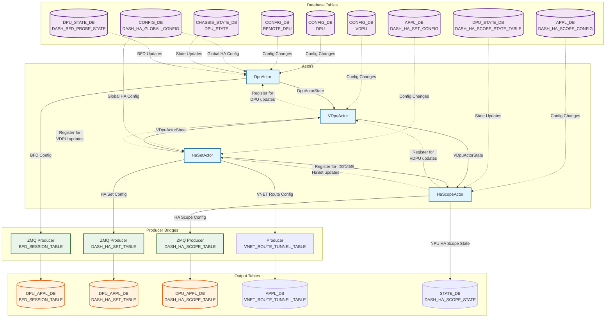

# HAMGRD Actors Design Document

## 1. Overview

The `hamgrd` (High Availability Manager Daemon) is a critical component of the SONiC DASH (Disaggregated API for SONiC) High Availability system. It implements an actor-based architecture to manage the lifecycle and state synchronization of DPUs (Data Processing Units), VDPUs (Virtual DPUs), and HA (High Availability) configurations.

The system is built using the `swbus-actor` framework and provides real-time monitoring, state management, and coordination between different components in a smart switch environment.

In the smartswitch, there will be multiple hamgrd with one per DPU in the system. When hagmrd starts, the slot-id of the DPU it exclusively owns is provided.

### 1.1 Database placement
**CONFIG_DB/DPU**:
In a cluster with 8 smartswitches and 8 DPUs per switch, there are 64 DPUs altogther. From database configuration perspective, in any switch, there are 8 DPU in config_db,which for the local DPUs in the switch, and 48 REMOTE_DPU. There are 64 dpu actors in each hamgrd.

**CONFIG_DB/VDPU**:
There are 64 VDPUs, one per DPU in each switch. There are 64 vdpu actors in each hamgrd.

**APPL_DB/DASH_HA_SET_CONFIG**:
2 VDPUs form one HA pair so there are 32 HA-SETs in the cluster and in each switch. Even for the HA-SET that both VDPUs are in remote switch, it needs to be created in each switch because we need to create VXLAN VNET routes to redirect traffic to the right DPUs.
There are 32 ha-set actors in each hamgrd.

**APPL_DB/DASH_HA_SCOPE_CONFIG**:
In DPU-scoped HA, there is one HA-SCOPE per local DPU in each switch. hamgrd creates one ha-scope actor per HA-SCOPE but only the one for local DPU is active.

## 2. Actor Architecture

### 2.1 Core Actors

The `hamgrd` system consists of four main actors:

1. **DpuActor** - Manages individual DPU instances
2. **VDpuActor** - Manages Virtual DPU configurations
3. **HaSetActor** - Manages HA Set configurations
4. **HaScopeActor** - Manages HA Scope configurations

### 2.2 Actor Creation Mechanism

All actors implement the `DbBasedActor` trait, which provides a consistent creation pattern:

```rust
pub trait DbBasedActor: Actor {
    fn name() -> &'static str;
    fn table_name() -> &'static str;
    fn new(key: String) -> AnyhowResult<Self>;
    async fn start_actor_creator<T>(edge_runtime: Arc<SwbusEdgeRuntime>) -> AnyhowResult<Vec<ConsumerBridge>>;
}
```

Actors are created dynamically when database changes occur through the **ActorCreator** pattern:
- Each actor type registers an `ActorCreator` that listens for database table changes
- When a new entry is added to the corresponding database table, the creator spawns a new actor instance
- When an entry is deleted (`KeyOperation::Del`), the corresponding actor is terminated

### 2.2 Actor Termination Mechanism

Symmetrically to the creation mechanism, which creates an actor when the corresponding DB object is created, the termination deletes the actor when the corresponding DB object is deleted. Before termination, actor needs to do necessary clean-ups.
## 3. Detailed Actor Descriptions

### 3.1 DpuActor

**Purpose**: Manages the lifecycle and state of individual DPUs (both local and remote).

**Database Tables**:
 - DpuActors are created for each `DPU` entry and `REMOTE_DPU` entry in `CONFIG_DB`.
 - In a cluster with 8 smartswitches and 8 DPUs per switch, there are 64 DPUs altogther. From database configuration perspective, in any switch, there are 8 DPU in config_db, which for the local DPUs in the switch, and 48 REMOTE_DPU.

**Creation Trigger**:
- New entries in `DPU` or `REMOTE_DPU` tables
- Actor ID corresponds to the DPU identifier

**Termination Trigger**:
- The `DPU` or `REMOTE_DPU` entry is deleted.
- Removes BFD sessions from DPU_APPL_DB/BFD_SESSION_TABLE

**Key Responsibilities**:
- Distinguish between managed (local) and unmanaged (remote) DPUs. Only one DpuActor in each hamgrd manages the DPU that the hamgrd is bound to. That DpuActor is managed.
- Monitor DPU health status (midplane, control plane, data plane) and send update to the corresponding VDpuActor
- Track BFD (Bidirectional Forwarding Detection) session states and send update to the corresponding VDpuActor
- Manage NPU (Network Processing Unit) IP addressing
- If the actor is for the locally managed DPU, it also subscribes to REMOTE_DPU consumer-bridge, from which, it collects remote switches' npu_ip that are in the same cluster.
- If the actor is for the locally managed DPU, create BFD sessions in DPU_APPL_DB/BFD_SESSION_TABLE to all switches in the cluster using the switches' npu_ip collected in the above step. The BFD sessions are only parameters to DPU swss. The latter will create software BFD sessions using the parameters when DPU HA is activated successfully or enters standalone state.
- Send `DpuActorState` to actors (`VDpuActor`) registering for state update when it receives update from `DPU_STATE` or `DASH_BFD_PROBE_STATE`.

**Message Processing**:

| Message Type | Description | Processing Logic |
|--------------|-------------|------------------|
| `DPU` table update | DPU configuration changes | Updates internal DPU state, registers bridges for managed DPUs |
| `REMOTE_DPU` table update | Remote DPU configuration | Updates remote DPU information |
| `DPU_STATE` update | PMON state changes | Calculates DPU health based on midplane/control/data plane states |
| `DASH_BFD_PROBE_STATE` | BFD session status | Updates BFD connectivity status |
| `DASH_HA_GLOBAL_CONFIG` | Global HA configuration | Updates HA-related settings |

**Actor Interactions**:
- **Consumer Bridge**: Receives update from `DASH_HA_GLOBAL_CONFIG`
- **Consumer Bridge**: Receives update from `REMOTE_DPU` if the actor is managing a local DPU
- **Consumer Bridge**: Receives update from `DPU_STATE` if the actor is managing a local DPU
- **Consumer Bridge**: Receives update from `DASH_BFD_PROBE_STATE` if the actor is managing a local DPU
- **Producer Bridge**: Updates `BFD_SESSION_TABLE` if the actor is managing a local DPU
- **Outbound**: Sends `DpuActorState` messages to registered VDpuActor
- **Registration**: Accepts registration requests from VDpuActors for state updates


### 3.2 VDpuActor

**Purpose**: Manages Virtual DPU configurations that logically group multiple physical DPUs.

**Database Tables**:
- **Primary**: `VDPU` table in `CONFIG_DB`

**Creation Trigger**:
- New entries in `VDPU` table
- Actor ID corresponds to the VDPU identifier

**Termination Trigger**:
- The `VDPU` entry is deleted.
- Clean-up tasks: none

**Key Responsibilities**:
- Aggregate state from multiple DPUs
- Register with DpuActors for state updates
- Provide unified VDPU state to HaSetActors

**Message Processing**:

| Message Type | Description | Processing Logic |
|--------------|-------------|------------------|
| `VDPU` table update | VDPU configuration changes | Updates DPU association, registers with DpuActors |
| `DpuActorState` update | DPU state changes | Recalculates VDPU state and notifies subscribers |
| Actor registration | Registration from HaSetActors | Manages subscription list for state updates |

**State Calculation**:
- Currently supports single DPU per VDPU
- VDPU state directly reflects the associated DPU state
- Future: Will support aggregation logic for multiple DPUs

**Actor Interactions**:
- **Inbound**: Receives `DpuActorState` from DpuActors
- **Outbound**: Sends `VDpuActorState` messages to registered HaSetActors
- **Registration**: Registers with DpuActors, accepts registrations from HaSetActors

### 3.3 HaSetActor

**Purpose**: Manages HA Set configurations that define high availability pairs of VDPUs.

**Database Tables**:
- **Primary**: `DASH_HA_SET_CONFIG` table in `CONFIG_DB`

**Creation Trigger**:
- New entries in `DASH_HA_SET_CONFIG` table
- Actor ID corresponds to the HA Set identifier

**Termination Trigger**:
- The `DASH_HA_SET_CONFIG` entry is deleted.
- Clean-up tasks: delete corresponding entry from DASH_HA_SET_TABLE

**Key Responsibilities**:
- Wait until it receives VDPU states from all `VDpuActor` in the HA pair
- Coordinate HA relationships between VDPU pairs
- Generate `DASH_HA_SET_TABLE` entries for DPU consumption if one of the DPUs in the set is locally managed.
- Monitor VDPU states and determine primary/backup roles
- Receiving global HA configuration, which are used to create `DASH_HA_SET_TABLE` entries and VNET route entries.
- Create VxLAN VNET routes to the switches of DPUs in the HA-SET but set monitoring IP to DPUs' PA address. This means VxLAN tunnels are to the switches but BFD sessions are between the local switch and remote DPUs.
- Based on pinned_vdpu_bfd_probe_states in `DASH_HA_SET_CONFIG`, set pinned_state in VNET route tunnel table entry. It handles update to `DASH_HA_SET_CONFIG` with change to pinned_vdpu_bfd_probe_states.

**Message Processing**:

| Message Type | Description | Processing Logic |
|--------------|-------------|------------------|
| `DASH_HA_SET_CONFIG` update | HA Set configuration | Updates HA set parameters, triggers table generation |
| `VDpuActorState` update | VDPU state changes | Recalculates HA set state and updates DPU tables |
| `DASH_HA_GLOBAL_CONFIG` | Global HA settings | Updates HA-related parameters |

**HA Set Table Generation**:
```rust
fn prepare_dash_ha_set_table_data(&self, vdpus: &[VDpuStateExt]) -> Result<Option<DashHaSetTable>> {
    // Only process if local HAMGRD manages at least one DPU
    // Generate table with:
    // - VIP configuration (v4/v6)
    // - Local and peer IP addresses
    // - Control and data plane channel settings
    // - Probe intervals and thresholds
}
```

**Actor Interactions**:
- **Consumer Bridge**: Receives update from `DASH_HA_GLOBAL_CONFIG`
- **Inbound**: Receives `VDpuActorState` from VDpuActors
- **Outbound**: Sends `HaSetActorState` to registered HaScopeActors
- **Producer Bridge**: Updates `DASH_HA_SET_TABLE` in `DPU_APPL_DB`
- **Database**: Update `VNET_ROUTE_TUNNEL_TABLE` in `APPL_DB`

### 3.4 HaScopeActor

**Purpose**: Manages HA Scope configurations that define the granularity and operational details of high availability.

**Database Tables**:
- **Primary**: `DASH_HA_SCOPE_CONFIG` table in `CONFIG_DB`

**Creation Trigger**:
- New entries in `DASH_HA_SCOPE_CONFIG` table
- Actor ID format: `{vdpu_id}{separator}{ha_scope_id}`

**Termination Trigger**:
- The `DASH_HA_SCOPE_CONFIG` entry is deleted.
- Clean-up tasks: delete the corresponding entry from `DASH_HA_SCOPE_TABLE`

**Key Responsibilities**:
- Implement HA state machine logic. Relay role transition request from SDN controller to DPU via `DASH_HA_SCOPE_TABLE`.

| DASH_HA_SCOPE_CONFIG Attribute| DASH_HA_SCOPE_TABLE Attribute | Description |
|-------------------------------|-------------------------------|-------------|
| `disabled` | `disabled` | Set to false to start HA |
| `desired_ha_state` | `ha_role` | dead, unspecified, active, standby, standalone |
| `approved_pending_operation_ids` | `flow_reconcile_requested`<br/>`activate_role_requested`| match against `pending_operation_ids` in NPU `DASH_HA_SCOPE_STATE` to find operation type |

- Monitor `DASH_HA_SCOPE_STATE_TABLE` in `DPU_STATE_DB` and generates pending operations and set in NPU `DASH_HA_SCOPE_STATE` via `pending_operation_ids` and `pending_operation_types`
  - `pending_operation_ids` and `pending_operation_types` are comma separated lists with same length. operation_id and type are matched under the same index.
  - When `activate_role_pending` turns true in `DPU_STATE_DB`/`DASH_HA_SCOPE_STATE_TABLE`, generates a GUID and adds it to pending_operation_ids along with `activate_role` to pending_operation_types
  - When `brainsplit_recover_pending` turns true in `DPU_STATE_DB`/`DASH_HA_SCOPE_STATE_TABLE`, generates a GUID and adds it to pending_operation_ids along with `brainsplit_recover` to pending_operation_types
  - When `flow_reconcile_pending` turns true in `DPU_STATE_DB`/`DASH_HA_SCOPE_STATE_TABLE`, generates a GUID and adds it to pending_operation_ids along with `flow_reconcile` to pending_operation_types
  - When receive `approved_pending_operation_ids` in `DASH_HA_SCOPE_CONFIG`, remove the corresponding pending operations from NPU `DASH_HA_SCOPE_STATE`
  - Pass the corresponding approved operations to DPU via `DPU_APPL_DB`/`DASH_HA_SCOPE_TABLE`
- Aggregate state upate from multiple sources and report to SDN controller via NPU `DASH_HA_SCOPE_STATE`
  - `VDpuActorState`: including DPU_STATE and BFD_PROBE_STATE
  - `HaSetActorState`: ha-set configuration
  - `DASH_HA_SCOPE_STATE_TABLE` (DPU): HA state and requests reported by DPU

**Message Processing**:

| Message Type | Description | Processing Logic |
|--------------|-------------|------------------|
| `DASH_HA_SCOPE_CONFIG` update | HA Scope configuration | Updates scope parameters, initializes state machine |
| `HaSetActorState` update | HA Set state changes | Updates HA set association |
| `VDpuActorState` update | VDPU state changes | Monitors associated VDPU health |
| `DASH_HA_SCOPE_STATE_TABLE` (DPU) | DPU scope state | Tracks DPU-side HA state machine |
| `DASH_HA_SCOPE_STATE` (NPU) | NPU scope state | Reporting HA state to external entities, e.g. SDN controller |

**Actor Interactions**:
- **Consumer Bridge**: Receives `DASH_HA_SCOPE_STATE_TABLE` in `DPU_STATE_DB`
- **Producer Bridge**: Updates `DASH_HA_SCOPE_TABLE` in `DPU_APPL_DB`
- **Producer Bridge**: Updates `DASH_HA_SCOPE_STATE` in `STATE_DB` in NPU
- **Inbound**: Receives `HaSetActorState` and `VDpuActorState`

## 4. Message Types and Flow

### 4.1 Core Message Types

```rust
// Actor state messages
pub struct DpuActorState { /* DPU health and configuration */ }
pub struct VDpuActorState { up: bool, dpu: DpuActorState }
pub struct HaSetActorState { up: bool, ha_set: DashHaSetTable }

// Registration messages
pub struct ActorRegistration { active: bool }
pub enum RegistrationType { DPUState, VDPUState, HaSetState }
```

### 4.2 Registration and Subscription Pattern

Actors use a publisher-subscriber pattern for state updates:

1. **Registration**: Dependent actors register with providers using `ActorRegistration` messages
2. **State Updates**: Provider actors send state updates to all registered subscribers
3. **Unregistration**: When actors shut down, they send deregistration messages

Example registration flow:
```
VDpuActor --[ActorRegistration]-> DpuActor
HaSetActor --[ActorRegistration]-> VDpuActor
HaScopeActor --[ActorRegistration]-> HaSetActor + VDpuActor
```

## 5. Actor Interaction Diagram



## 6. Data Flow and State Propagation

### 6.1 Upward State Flow (Hardware → Configuration)

1. **Physical State Changes** → DPU_STATE, DASH_BFD_PROBE_STATE tables
2. **DpuActor** processes hardware state → Calculates DPU health
3. **VDpuActor** aggregates DPU states → Provides unified VDPU view
4. **HaSetActor** combines VDPU pairs → Generates HA set configurations
5. **HaScopeActor** implements policy → Manages HA state machine

### 6.2 Downward Configuration Flow (Policy → Hardware)

1. **Configuration Changes** → DASH_HA_SCOPE_CONFIG, DASH_HA_SET_CONFIG tables
2. **HaScopeActor/HaSetActor** process config → Generate operational parameters
3. **ZMQ Producer Bridges** → Push to DPU application databases
4. **DPU Applications** consume configs → Implement HA behavior

### 6.3 Registration and Lifecycle Management

```
Actor Lifecycle:
1. Database table entry created → ActorCreator spawns new actor
2. Actor registers with dependencies → Subscribes to required state updates
3. Actor processes messages → Updates internal state and notifies subscribers
4. Database entry deleted → Actor unregisters and terminates
```

## 7. Key Design Patterns

### 7.1 Observer Pattern
- Actors register for updates from other actors
- State changes trigger notifications to all registered observers
- Enables loose coupling between actor layers

### 7.2 Bridge Pattern
- ConsumerBridge: Database → Actor message flow
- ProducerBridge: Actor → Database message flow
- ZMQ bridges are used to communicate with DPU processes

### 7.3 Factory Pattern
- ActorCreator dynamically spawns actors based on database changes
- Consistent creation pattern across all actor types
- Actor is terminated when the corresponding database entry is deleted. All the database entries it has produced are deleted as well.

## 8. Error Handling and Resilience

### 8.1 Actor Fault Tolerance
- Individual actor failures don't affect other actors
- Actor creators automatically respawn failed actors
- State is recovered from database on restart

### 8.2 Communication Resilience
- Message delivery guaranteed through swbus infrastructure
- Registration allows recovery of missed state updates
- ZMQ bridges provide reliable database synchronization

### 8.3 State Consistency
- Actors maintain authoritative state based on database
- State recalculation on every relevant message
- Idempotent operations ensure consistency

## 9. Performance Considerations

### 9.1 Scalability
- Actor model allows horizontal scaling
- Independent actors reduce contention
- Message passing avoids shared state issues

### 9.2 Efficiency
- Event-driven processing minimizes CPU usage
- Selective registration reduces unnecessary message traffic
- Database bridges batch operations for efficiency

## 10. Future Enhancements

### 10.1 Multi-DPU VDPU Support
- Currently VDpuActor supports single DPU
- Future: Aggregation logic for multiple DPUs per VDPU
- Load balancing and failover within VDPU

### 10.2 Enhanced State Machine
- Switch-driven HA
- External orchestration integration

### 10.3 Monitoring and Observability
- Enhanced metrics and telemetry
- Distributed tracing support
- Performance monitoring and alerting

---

This design document provides a comprehensive overview of the HAMGRD actor system, detailing the responsibilities, interactions, and implementation patterns that enable robust high availability management in SONiC DASH environments.
