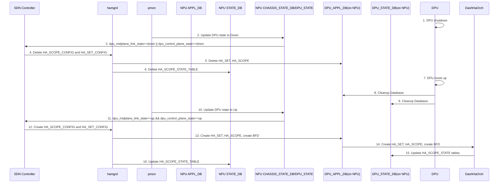

# DPU Restart – Solution for database out of sync 
## Problem Statement
When DPU restarts (either as a planned or an unexpected event), DPU_[APPL|STATE] _DB that are hosted on NPU will not be restarted along with as DPU. This causes some states to be out of sync and leads to unexpected behaviors in HA scenarios. 
We observed a couple of issues with this problem:
1.	BFD passive sessions (on DPUs) are created once only by hamgrd (when “DPU” table in NPU’s CONFIG_DB is consumed). When DPU is restarted, these BFD sessions are removed and will never be added again. 
2.	DPU_STATE_DB still holds stale entries/values for HA objects. 
3.	Even if we clean up DPU_[APPL|STATE] _DB, NPU’s APPL_DB and STATE_DB will still have stale “HA_SCOPE_CONFIG_TABLE” and “HA_SET_CONFIG_TABLE”.

## Solutions
We will need solutions from not only sonic image but also SDN controller.
1.	Cleanup DPU_*_DB instances when DPU boots up.
2.	SDN controller needs to monitor DPU state by `CHASSIS_STATE_DB|DPU_STATE`, either `dpu_control_plane_state` or `dpu_midplane_link_state` being down will be treated as DPU down. SDN controller will then  
    1. Delete stale HA_SET_CONFIG and HA_SCOPE_CONFIG  
    1. Re-program HA_SET_CONFIG and HA_SCOPE_CONFIG  
3.	Hamgrd needs to change the passive BFD session creation logic, today the sessions are created statically. We need this change to avoid hamgrd restart. Hamgrd need to create BFD session if `dpu_control_plane_state` changes from down to up. 

Note that DashHaOrch should cache the BFD session parameters, remove and create the sessions accordingly in planned shutdown. 

## Workflow

