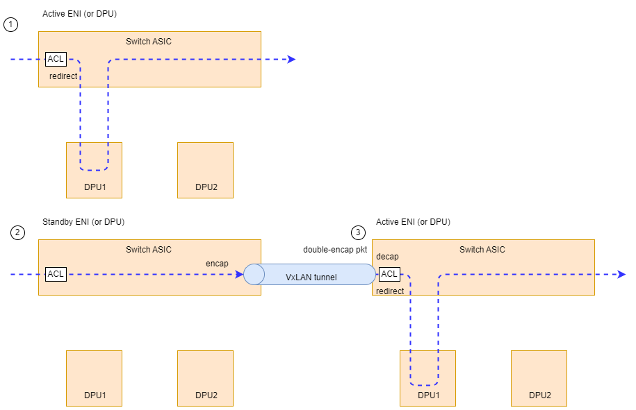
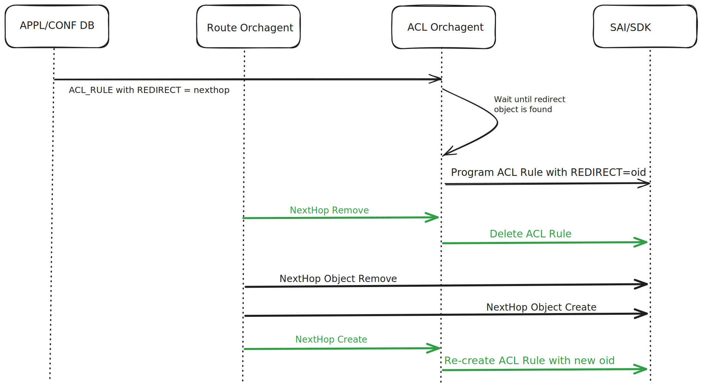
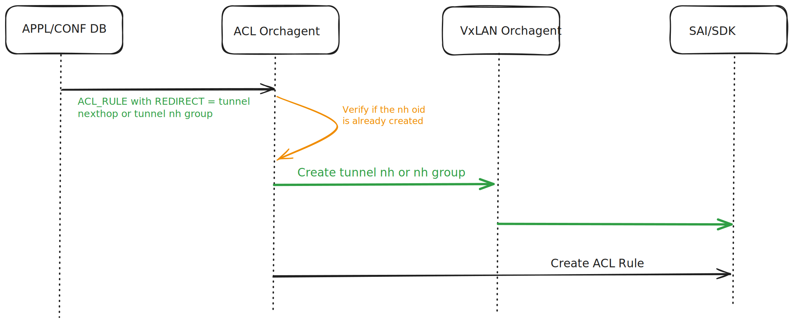

# SmartSwitch ENI Based Forwarding

## Table of Content ##

- [SmartSwitch ENI Based Forwarding](#smartswitch-eni-based-forwarding)
  - [Table of Content](#table-of-content)
  - [Revision](#revision)
  - [Scope](#scope)
  - [Definitions/Abbreviations](#definitionsabbreviations)
  - [Overview](#overview)
  - [Requirements](#requirements)
  - [Architecture Design](#architecture-design)
    - [Programming ACL Rules](#programming-acl-rules)
    - [ACL Orchagent Design Changes](#acl-orchagent-design-changes)
        - [Existing Design](#existing-design)
        - [Updated Design](#Updated-design)
    - [ACL Configuration](#acl-configuration)
        - [Tunnel Next Hop](#tunnel-next-hop)
  - [Warmboot and Fastboot Design Impact](#warmboot-and-fastboot-design-impact)
  - [Restrictions/Limitations](#restrictionslimitations)
  - [Testing Requirements/Design](#testing-requirementsdesign)
    - [System Test cases](#system-test-cases)
  - [Open/Action items - if any](#openaction-items---if-any)

## Revision ##

| Rev | Date | Author | Change Description |
| --- | ---- | ------ | ------------------ |
| 0.1 | 10/05/2024 | Vivek Reddy Karri | Initial version |

## Scope ##

This document provides a high-level design for Smart Switch ENI based Packet Forwarding using ACL rules

## Definitions/Abbreviations ##

| Term | Meaning                                                 |
| ---- | ------------------------------------------------------- |
| NPU  | Network Processing Unit                                 |
| DPU  | Data Processing Unit                                    |
| VIP  | Virtual IP                                    |
| PA  | Physical Address                                   |
| NH  | Next Hop                                   |
| NHG  | Next Hop Group                                |

## Overview ##

There are two possible NPU-DPU Traffic forwarding models.

1) VIP based model
    * Controller allocates VIP per DPU, which is advertised and visible from anywhere in the cloud infrastructure.
    * The host has the DPU VIP as the gateway address for its traffic.
    * Simple, decouples a DPU from switch.
    * Costly, since you need VIP per DPU.

2) ENI Based Forwarding
    * The host has the switch VIP as the gateway address for its traffic.
    * Cheaper, since only VIP per switch is needed (or even per a row of switches). ENI placement can be directed even across smart switches.

ENI Based Forwarding is the preferred approach because of cost constraints.

## Requirements ##

ENI based forwarding requires the switch to understand the relationship between the packet and ENI, and ENI and DPU.

* Each DPU is represented as a PA (public address). Unlike VIP, PA does't have to be visible from the entire cloud infrastructure
* Each ENI belongs to a certain DPU (local or remote)
* Each packet can be identified as belonging to that switch using VIP and VNI
* Forwarding can be to local DPU PA or remote DPU PA over L3 VxLAN
* Scale: [# of DPUs] * [# of ENIs per DPU] * 2 (inbound and outbound)

## Architecture Design ##

### Programming ACL Rules ###

* Packet Forwarding from NPU to local and remote DPU's are clearly explained in the High Availability HLD https://github.com/sonic-net/SONiC/blob/master/doc/smart-switch/high-availability/smart-switch-ha-hld.md#42-data-path-ha
* In a nutshell, the ACL rule for a ENI depends on the role of its DPU in the corresponding HA pair i.e. local or standby
* Thus, ACL rules must be dynamically updated on the NPU. This should be handled by HaMgrd as it will have all the necessary information to make the decision. 
* The format on how the rules must be writted will be explained further in the document



### ACL Orchagent Design Changes ### 

#### Existing Design ####

Current Design on ACL Orchagent is equipped to infer and program "REDIRECT" action for an ACL Rule. Here is the schema expected for the field

    key: ACL_RULE_TABLE:table_name:rule_name

    redirect_action = 1*255CHAR                ; redirect parameter
                                               ; This parameter defines a destination for redirected packets
                                               ; it could be:
                                               : name of physical port.          Example: "Ethernet10"
                                               : name of LAG port                Example: "PortChannel5"
                                               : next-hop ip address (in global) Example: "10.0.0.1"
                                               : next-hop ip address and vrf     Example: "10.0.0.2@Vrf2"
                                               : next-hop ip address and ifname  Example: "10.0.0.3@Ethernet1"
                                               : next-hop group set of next-hop  Example: "10.0.0.1,10.0.0.3@Ethernet1"

**Current ACL Orchagent Redirect Flow**
<p align="center"></p>

#### Updated Design ####

The existing design has a few shortcomings

1) It is not equipped to handle redirect action to a Tunnel NH or NG Group
2) It follows fire and forget and doesn't keep track of the updates made to that next-hop object. This has to be fixed for the DPU to have uninterrupted traffic flow after an event which triggers an update of next-hop object
3) State of the ACL rule should be clearly reflected in the STATE_DB

**Proposed design when Nexthop is programmed**

<p align="center"></p>

**Proposed design when Tunnel NH or NHG is programmed**

<p align="center"></p>

### ACL Configuration ### 

**ACL Table Type and ACL table Configuration**

    {
        "ACL_TABLE_TYPE": {
            "ENI": {
                "MATCHES": [
                    "VNI",
                    "DST_IP",
                    "INNER_SRC_MAC",
                    "INNER_DST_MAC",
                ],
                "ACTIONS": [
                    "REDIRECT_ACTION",
                ],
                "BIND_POINTS": [
                    "PORT"
                ]
            }
        },
        "ACL_TABLE": {
            "ENI": {
                "STAGE": "INGRESS",
                "TYPE": "ENI",
                "PORTS": [
                    "<Ingress front panel ports>"
                ]
            }
        }
    }

**Example: ACL Rule for Inbound Traffic and Local DPU**

    {
        "ACL_RULE": {
              "ENI|RULE_INBOUND_ENI0": {
                  "PRIORITY": "999",
                  "VNI": "4000",
                  "DST_IP": "1.1.1.1/32",
                  "INNER_DST_MAC": "aa:bb:cc:dd:ee:ff"
                  "REDIRECT": "2.2.2.2" # PA Address for local DPU
              }
          }
    }

**Example: ACL Rule for Outbound Traffic and Local DPU**

    {
        "ACL_RULE": {
              "ENI|RULE_OUTBOUND_ENI0": {
                  "PRIORITY": "999",
                  "VNI": "4000",
                  "DST_IP": "3.3.3.3/32",
                  "INNER_SRC_MAC": "aa:bb:cc:11:22:33"
                  "REDIRECT": "2.2.2.2" # PA Address for local DPU
              }
          }
    }

### Tunnel Next Hop ### 

An example flow which creates a Tunnel Next Hop would be programming a VNET route with Tunnel Hop. Ref for Schema: https://github.com/sonic-net/SONiC/blob/master/doc/vxlan/Vxlan_hld.md#22-app-db

    VNET_ROUTE_TUNNEL_TABLE:{{vnet_name}}:{{prefix}} 
        "endpoint": {{ip_address}} 
        "mac_address":{{mac_address}} (OPTIONAL) 
        "vni": {{vni}}(OPTIONAL) 

To create a Tunnel NH or NHG, a combination of these parameters are required
- Tunnel Name
- Endpoint IP
- MAC (OPTIONAL)
- VNI (OPTIONAL)

ACL_RULE_TABLE should be equipped to accept these new paremeters. Thus, a new table to represent the tunnel NH or NHG is added. 
Key for this table should be an input to redirect_action field in the ACL_RULE_TABLE

```
key                      = "TUNNEL_NH_TABLE:nh_object_name" 

tunnel_name              = STRING                               ; Name of the Tunnel which has the NH or NHG associated
endpoint_ip              = List of IP's separated by comma      ; Endpoint IP's. When there are multiple IP's it is assumed to be a next hop group
mac_address              = List of MAC's separated by comma     ; Inner Destination MAC's (Optional)
vni                      = List of VNI's separated by comma     ; Next Hop Entry VNI's (Optional)
description              = STRING                               ; Additional Information explaining the NH  (Optional)
```


```
key: ACL_RULE_TABLE:table_name:rule_name

redirect_action = 1*255CHAR         : <All the old attributes>   
                                    : next hop for tunnel             Example: npu2npu_tunnel0, this should be a key in the TUNNEL_NH_TABLE
```

Exmaple: ACL Rule for outbound traffic and remote DPU

     {
        "TUNNEL_NH_TABLE": {
            "ha_tunnel_nh0":{
                "DESCRIPTION": "NH to Active NPU with ENI 1000"
                "TUNNEL_NAME": "npu_tunnel",
                "ENDPOINT_IP": "3.3.3.3",
                "VNI": "100"
            },
            "npu2npu_tunnel_nhg0":{
                "DESCRIPTION": "NHG to HA Pair with ENI 2000"
                "TUNNEL_NAME": "npu_tunnel",
                "ENDPOINT_IP": "1.1.1.1,2.2.2.2",
                "VNI": "200,200"
            }
        }
        "ACL_RULE": {
              "ENI|INBOUND_REMOTE_ENI1000": {
                  "PRIORITY": "999",
                  "VNI": "4000",
                  "DST_IP": "1.1.1.1/32",
                  "INNER_DST_MAC": "aa:bb:cc:dd:ee:ff"
                  "REDIRECT": "ha_tunnel_nh0"
              },
              "ENI|INBOUND_REMOTE_ENI2000": {
                  "PRIORITY": "999",
                  "VNI": "4000",
                  "DST_IP": "1.1.1.1/32",
                  "INNER_DST_MAC": "aa:bb:cc:dd:ee:ff"
                  "REDIRECT": "npu2npu_tunnel_nhg0"
              }
        }
    }

## Warmboot and Fastboot Design Impact ##

No Changes here. 

## Restrictions/Limitations ##

- HaMgrd will be writing the ACL rules to APPL_DB and so Configuration/CLI/Yang model to support TUNNEL_NEXT_HOP_TABLE is not in the scope of this feature

## Testing Requirements/Design ##

- Migrate existing Private Link tests to use ENI Forwarding Approach. Until HaMgrd is available, test should progran ACL rules in APPL_DB
- Add individual test cases which verify next hop forwarding 
- Add individual test cases to verify tunnel next hop forwarding regardless of HA availability 

## Open/Action items - if any ##