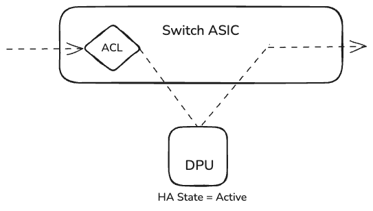
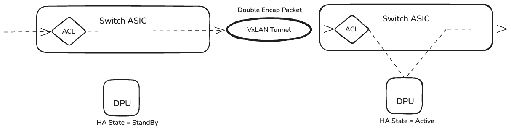
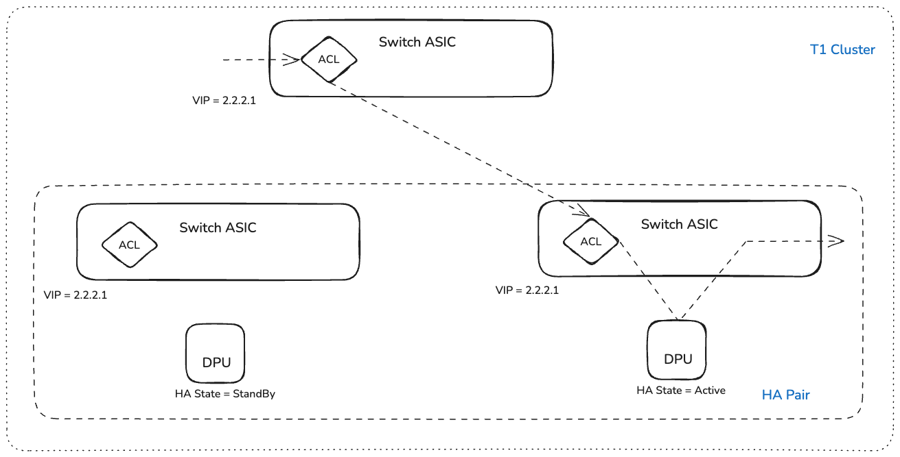
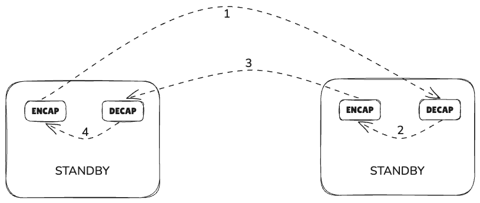
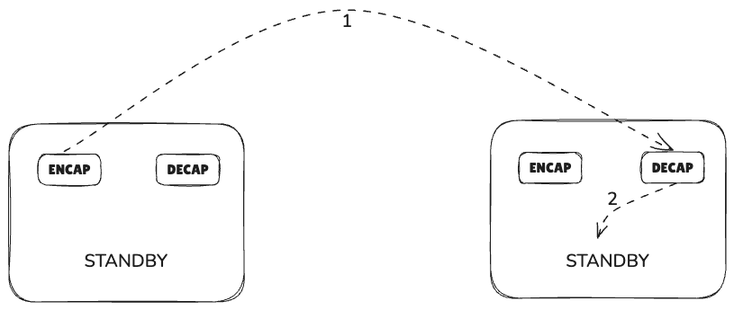
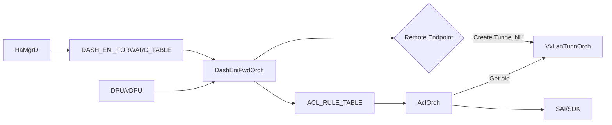
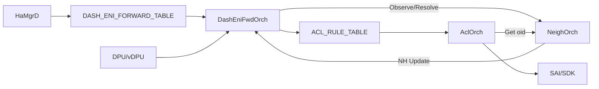

# SmartSwitch ENI Based Forwarding

## Table of Content ##

- [SmartSwitch ENI Based Forwarding](#smartswitch-eni-based-forwarding)
  - [Table of Content](#table-of-content)
  - [Revision](#revision)
  - [Scope](#scope)
  - [Definitions/Abbreviations](#definitionsabbreviations)
  - [Overview](#overview)
    - [Packet Flow](#packet-flow)
  - [Requirements](#requirements)
    - [Phase 1](#phase-1)
    - [Phase 2](#phase-2)
  - [Architecture Design](#architecture-design)
    - [ACL Table Configuration](#acl-table-configuration)
    - [ACL Rules](#acl-rules)
    - [Handling path loops after Tunnel decap](#handling-path-loops-after-tunnel-decap)
    - [Nexthop resolution](#nexthop-resolution)
    - [Dash ENI Forward Orch](#dash-eni-forward-orch)
      - [Schema Change in ACL_RULE](#schema-change-in-acl-rule)
  - [Warmboot and Fastboot Design Impact](#warmboot-and-fastboot-design-impact)
  - [Restrictions/Limitations](#restrictionslimitations)
  - [Testing Requirements/Design](#testing-requirementsdesign)
    - [System Test cases](#system-test-cases)
  - [Open/Action items - if any](#openaction-items---if-any)

## Revision ##

| Rev | Date | Author | Change Description |
| --- | ---- | ------ | ------------------ |
| 0.1 | 10/05/2024 | Vivek Reddy Karri | Initial version |

## Scope ##

This document provides a high-level design for Smart Switch ENI based Packet Forwarding using ACL rules

## Definitions/Abbreviations ##

| Term | Meaning                                                 |
| ---- | ------------------------------------------------------- |
| NPU  | Network Processing Unit                                 |
| DPU  | Data Processing Unit                                    |
| VIP  | Virtual IP                                    |
| PA  | Physical Address                                   |
| NH  | Next Hop                                   |
| HA  | High Availability                                |
| ENI  | Elastic Network Interface                      |

## Overview ##

There are two possible NPU-DPU Traffic forwarding models.

1) VIP based model
    * Controller allocates VIP per DPU, which is advertised and visible from anywhere in the cloud infrastructure.
    * The host has the DPU VIP as the gateway address for its traffic.
    * Simple, decouples a DPU from switch.
    * Costly, since you need VIP per DPU.

2) ENI Based Forwarding
    * The host has the switch VIP as the gateway address for its traffic.
    * Cheaper, since only VIP per switch is needed (or even per a row of switches). 
    * ENI placement can be directed even across smart switches.

Due to cost constraints, ENI Based Forwarding is the preferred approach. 

Packet Forwarding from NPU to local and remote DPU's are clearly explained in the HA HLD https://github.com/sonic-net/SONiC/blob/master/doc/smart-switch/high-availability/smart-switch-ha-hld.md#42-data-path-ha

### Packet Flow ###

**Case 1: Packet lands directly on NPU which has the currrent Active ENI**



**Case 2: Packet lands NPU which has the currrent Standby ENI**



**Case 3: Packet lands on NPU which doesn't host the corresponding ENI**



## Requirements ##

ENI based forwarding requires the switch to understand the relationship between the packet and ENI, and ENI and DPU.

* Each DPU is represented as a PA (public address). Unlike VIP, PA does't have to be visible from the entire cloud infrastructure
* Every ENI should be a part of T1 cluster
* Each packet can be identified as belonging to that switch using VIP and VNI
* Forwarding can be to local DPU or remote DPU over L3 VxLAN
* Scale:
    - [# of ENIs hosted] * 2 (inbound and outbound) * 2 (with/without Tunnel Termination) + [# of ENIs not hosted] * 2 (Inbound and outbound)
* Scale Example:
    - T1 per cluster: 8
    - DPU per T1: 4
    - ENI per DPU: 64
    - HA Scaling factor: 2
    - Total ENI's in this Cluster:  (8 * 4 * 64) / 2 = 1024
    - ENI's hosted on a T1: 256
    - Number of ACL Rules:  256 * (2 * 2) + (1024 - 256) * 2 = 2560

### Phase 1 ###

- Only HaMgrd will make decision on where to route the packet and write to DASH_ENI_FORWARD_TABLE table
- Orchagent will only process the primary endpoint and translate the requirement into ACL Rules
- Orchagent should also program ACL Rules with Tunnel termination entries
- No BFD sessions are created to local DPU or the remote DPU.

DASH_ENI_FORWARD_TABLE schema is available here https://github.com/r12f/SONiC/blob/user/r12f/ha2/doc/smart-switch/high-availability/smart-switch-ha-detailed-design.md#2321-dash_eni_forward_table

### Phase 2 ###

- BFD sessions are created to local DPU or the remote DPU for faster reactivity to card level failures
- Orchagent will switch between primary and secondary endpoint based on BFD status
- Handle the local NEIGH down possibility. 

## Architecture Design ##

### ACL Table Configuration ### 
```
{
    "ACL_TABLE_TYPE": {
        "ENI_REDIRECT": {
            "MATCHES": [
                "TUNNEL_VNI",
                "DST_IP",
                "DST_IPV6",
                "INNER_SRC_MAC",
                "INNER_DST_MAC",
                "TUNNEL_TERM"
            ],
            "ACTIONS": [
                "REDIRECT_ACTION",
            ],
            "BIND_POINTS": [
                "PORT"
            ]
        }
    },
    "ACL_TABLE": {
        "ENI": {
            "STAGE": "INGRESS",
            "TYPE": "ENI_REDIRECT",
            "PORTS": [
                "<Ingress front panel ports>"
            ]
        }
    }
}
```
### ACL Rules ### 

Assume the following ENI attributes
```
MAC: aa:bb:cc:dd:ee:ff
TUNNEL_VNI: 4000
VIP: 1.1.1.1/32
VNET: Vnet1000
```

**ACL Rule for outbound traffic**

MacDirection for outbound rules depends on the outbound_eni_mac_lookup field in the DASH_ENI_FORWARD_TABLE

```
{  
    "ACL_RULE": {
        "ENI:Vnet1000_AABBCCDDEEFF_OUT": {
            "PRIORITY": "9997",
            "TUNNEL_VNI": "4000",
            "DST_IP": "1.1.1.1/32",
            "INNER_SRC_MAC/INNER_DST_MAC": "aa:bb:cc:dd:ee:ff"
            "REDIRECT": "<local/tunnel nexthop>"
        }
    }
}
```

**ACL Rule for inbound traffic**

Inbound Traffic can have any ENI expect the outbound VNI, no need to match on TUNNEL_VNI

```
{  
    "ACL_RULE": {
        "ENI:Vnet1000_AABBCCDDEEFF_IN": {
            "PRIORITY": "9996",
            "DST_IP": "1.1.1.1/32",
            "INNER_DST_MAC": "aa:bb:cc:dd:ee:ff"
            "REDIRECT": "<local/tunnel nexthop>"
        }
    }
}
```

### Handling path loops after Tunnel decap ### 

During HA failover, the HA pair will end up in a transitional state that makes it ambiguous to the switch if it is active or backup.

When the HA failover happens, the used-to-be active becomes standby, but the used-to-be standby is still unchanged.

This state, although brief in time, may lead to congestion, and packet drops on a switch.



To solve this, ACL rules with high priority are added and the redirect should always be to local nexthop



**ACL Rule for outbound traffic with Tunnel Termination**

```
{  
    "ACL_RULE": {
        "ENI:Vnet1000_AABBCCDDEEFF_OUT_TERM": {
            "PRIORITY": "9999",
            "TUNNEL_VNI": "4000",
            "DST_IP": "1.1.1.1/32",
            "INNER_SRC_MAC/INNER_DST_MAC": "aa:bb:cc:dd:ee:ff",
            "TUNN_TERM": "true",
            "REDIRECT": "<local nexthop oid>"
        }
    }
}
```

**ACL Rule for inbound traffic with Tunnel Termination**

```
{
    "ACL_RULE": {
        "ENI:Vnet1000_AABBCCDDEEFF_IN_TERM": {
            "PRIORITY": "9998",
            "DST_IP": "1.1.1.1/32",
            "INNER_DST_MAC": "aa:bb:cc:dd:ee:ff",
            "TUNN_TERM": "true",
            "REDIRECT": "<local nexthop oid>"
        }
    }
}
```

### Nexthop resolution ###

Nexthop can be to a local DPU or a remote DPU. Orchagent must figure out if the endpoint is either local or remote and handle it accordingly.

It is also DashEniFwdOrch's responsibility to resolve the neighbor. This can be achieved by writing the entry to APP_NEIGH_RESOLVE_TABLE_NAME table.

### Dash ENI Forward Orch ### 

A new orchagent DashEniFwdOrch is added which runs on NPU to translate the requirements into ACL Rules. 

DashEniFwdOrch should infer the type of endpoint (local or remote) by parsing the DPU table.

#### Remote NextHop Flow #### 



#### Local NextHop Flow #### 



#### Schema Change in ACL_RULE ####

Current Schema for REDIRECT field in ACL_RULE_TABLE

```
    key: ACL_RULE_TABLE:table_name:rule_name

    redirect_action = 1*255CHAR                ; redirect parameter
                                               ; This parameter defines a destination for redirected packets
                                               ; it could be:
                                               : name of physical port.          Example: "Ethernet10"
                                               : name of LAG port                Example: "PortChannel5"
                                               : next-hop ip address (in global) Example: "10.0.0.1"
                                               : next-hop ip address and vrf     Example: "10.0.0.2@Vrf2"
                                               : next-hop ip address and ifname  Example: "10.0.0.3@Ethernet1"
                                               : next-hop group set of next-hop  Example: "10.0.0.1,10.0.0.3@Ethernet1"
```

This is enhanced to accept a representation for tunnel next-hop.

```
    key: ACL_RULE_TABLE:table_name:rule_name

    redirect_action = 1*255CHAR                ; tunnel next-hop                 Example: "2.2.2.1@tunnel_name"
```

## Warmboot and Fastboot Design Impact ##

No impact here

## Restrictions/Limitations ##

## Testing Requirements/Design ##

- Migrate existing Private Link tests to use ENI Forwarding Approach. Until HaMgrd is available, test should write to the DASH_ENI_FORWARD_TABLE
- Add individual test cases which verify forwarding to remote endpoint and also Tunnel Termination. This should not require HA availability
- HA test cases should work by just writing the expected configuration to DASH_ENI_FORWARD_TABLE

## Open/Action items - if any ##


