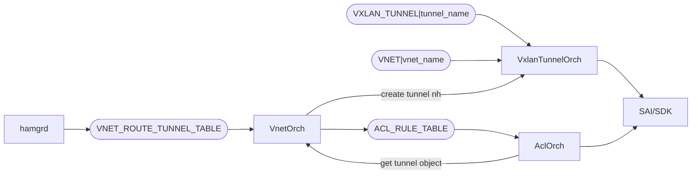

# SSW HA - Local DPU Forwarding (DPU HA)

## Overview

Packet Forwarding from NPU to local and remote DPU's are clearly explained in the [HA HLD - data path ha](https://github.com/sonic-net/SONiC/blob/master/doc/smart-switch/high-availability/smart-switch-ha-hld.md#42-data-path-ha).

TODO: add packet flow diagram for the scenarios. 

## Handling directly connected next hops (local DPU)

Covered in [Overlay ECMP ehancements - support for directly conneced nexthops](https://github.com/sonic-net/SONiC/blob/master/doc/vxlan/Overlay%20ECMP%20ehancements.md#33-bfd-tx-rx-interval-parameter-and-support-for-directly-connected-nexthops).

A new field will be added the `VNET_ROUTE_TUNNEL_TABLE`:

```
VNET_ROUTE_TUNNEL_TABLE:{{vnet_name}}:{{prefix}}
    “check_directly_connected”: /{/{true|false/}/} (OPTIONAL) 
```

```
; Defines schema for VNet Route tunnel table attributes
key                         = VNET_ROUTE_TUNNEL_TABLE:vnet_name:prefix ; Vnet route tunnel table with prefix
; field                     = value
check_directly_connected    = BOOLEAN  
```

The check_directly_connected can be set to true or false. 

VnetOrch shall check all the next hops in the ARP table to verify if directly connected. For such next hops, a regular ECMP route shall be employed instead of a tunnel route. This regular ECMP route would be updated based on the BFD liveness as is done for a regular vxlan ECMP route.

## Handling transient state during failovers 
During an HA failover, the HA pair briefly enters a transitional state: the previously active becomes standby, while the standby remains the same. This transient state can cause packet drops on the switch**. 
To handle this scenario, **high-priority** ACL rules matching tunnel termination flag are used to ensure redirects always go to the local nexthop.

TODO: How the drop happens?

### VnetOrch programs the ACL rule



To distinguish HA from other use cases (so we can avoid creating tunnel terminated ACL for all scenarios), a new field in `VNET_ROUTE_TUNNEL_TABLE` is added: 

```
VNET_ROUTE_TUNNEL_TABLE:{{vnet_name}}:{{prefix}}
    "scope"  = {{ha}} (OPTIONAL)
```

```
; Defines schema for VNet Route tunnel table attributes
key                                   = VNET_ROUTE_TUNNEL_TABLE:vnet_name:prefix ; Vnet route tunnel table with prefix
; field                               = value
scope                                 = STRING
```

If scope is specified to be "ha "ACL rule to match TUNNEL_TERM flag to be added. 

ACL Rule for inbound traffic with Tunnel Termination
```
{
    "ACL_RULE": {
        "<vnet_name>_<inner_dst_mac>_IN_TERM": {
            "PRIORITY": "9998",
            "DST_IP": "1.1.1.1/32",
            "INNER_DST_MAC": "aa:bb:cc:dd:ee:ff",
            "TUNN_TERM": "true",
            "REDIRECT": "<local nexthop oid>"
        }
    }
}
```

ACL Rule for outbound traffic with Tunnel Termination
```
{  
    "ACL_RULE": {
        "<vnet_name>_<inner_dst_mac>_OUT_TERM": {
            "PRIORITY": "9999",
            "TUNNEL_VNI": "4000",
            "DST_IP": "1.1.1.1/32",
            "INNER_SRC_MAC/INNER_DST_MAC": "aa:bb:cc:dd:ee:ff",
            "TUNN_TERM": "true",
            "REDIRECT": "<local nexthop oid>"
        }
    }
}
```
