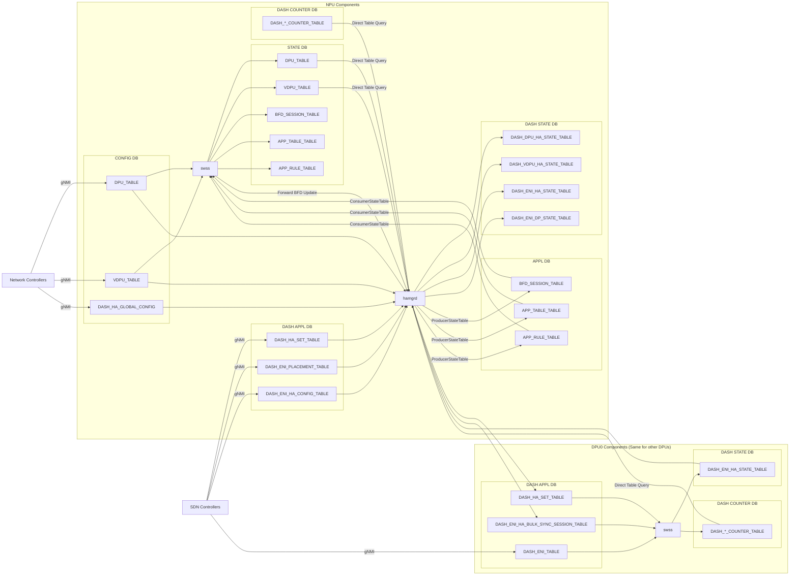

# SmartSwitch High Availability Detailed Design

| Rev | Date | Author | Change Description |
| --- | ---- | ------ | ------------------ |
| 0.1 | 10/14/2023 | Riff Jiang | Initial version |

1. [1. Database Schema](#1-database-schema)
   1. [1.1. High level data flow](#11-high-level-data-flow)
   2. [1.2. NPU DB schema](#12-npu-db-schema)
      1. [1.2.1. CONFIG DB](#121-config-db)
         1. [1.2.1.1. DPU / vDPU definitions](#1211-dpu--vdpu-definitions)
         2. [1.2.1.2. HA global configurations](#1212-ha-global-configurations)
      2. [1.2.2. APPL DB](#122-appl-db)
         1. [1.2.2.1. HA set configurations](#1221-ha-set-configurations)
         2. [1.2.2.2. ENI placement configurations](#1222-eni-placement-configurations)
         3. [1.2.2.3. ENI configurations](#1223-eni-configurations)
      3. [1.2.3. State DB](#123-state-db)
         1. [1.2.3.1. DPU / vDPU state](#1231-dpu--vdpu-state)
      4. [1.2.4. DASH State DB](#124-dash-state-db)
         1. [1.2.4.1. DPU / vDPU HA states](#1241-dpu--vdpu-ha-states)
         2. [1.2.4.2. ENI state](#1242-eni-state)
   3. [1.3. DPU DB schema](#13-dpu-db-schema)
      1. [1.3.1. APPL DB](#131-appl-db)
         1. [1.3.1.1. HA set configurations](#1311-ha-set-configurations)
         2. [1.3.1.2. DASH ENI object table](#1312-dash-eni-object-table)
      2. [1.3.2. State DB](#132-state-db)
         1. [1.3.2.1. ENI HA state](#1321-eni-ha-state)
2. [2. Telemetry](#2-telemetry)
   1. [2.1. HA state](#21-ha-state)
   2. [2.2. HA operation counters](#22-ha-operation-counters)
      1. [2.2.1. hamgrd HA operation counters](#221-hamgrd-ha-operation-counters)
      2. [2.2.2. HA SAI API counters](#222-ha-sai-api-counters)
   3. [2.3. HA control plane communication channel related](#23-ha-control-plane-communication-channel-related)
      1. [2.3.1. HA control plane control channel counters](#231-ha-control-plane-control-channel-counters)
      2. [2.3.2. HA control plane data channel counters](#232-ha-control-plane-data-channel-counters)
         1. [2.3.2.1. Per bulk sync flow receive server counters](#2321-per-bulk-sync-flow-receive-server-counters)
         2. [2.3.2.2. Per ENI counters](#2322-per-eni-counters)
   4. [2.4. NPU-to-DPU tunnel related (NPU side)](#24-npu-to-dpu-tunnel-related-npu-side)
      1. [2.4.1. NPU-to-DPU probe status](#241-npu-to-dpu-probe-status)
      2. [2.4.2. NPU-to-DPU data plane state](#242-npu-to-dpu-data-plane-state)
      3. [2.4.3. NPU-to-DPU tunnel counters](#243-npu-to-dpu-tunnel-counters)
   5. [2.5. NPU-to-DPU tunnel related (DPU side)](#25-npu-to-dpu-tunnel-related-dpu-side)
   6. [2.6. DPU-to-DPU data plane channel related](#26-dpu-to-dpu-data-plane-channel-related)
   7. [2.7. DPU ENI pipeline related](#27-dpu-eni-pipeline-related)
3. [3. SAI APIs](#3-sai-apis)
4. [4. CLI commands](#4-cli-commands)

## 1. Database Schema

NOTE: Only the configuration that is related to HA is listed here and please check [SONiC-DASH HLD](https://github.com/sonic-net/SONiC/blob/master/doc/dash/dash-sonic-hld.md) to see other fields.

### 1.1. High level data flow

### 1.2. NPU DB schema

#### 1.2.1. CONFIG DB

##### 1.2.1.1. DPU / vDPU definitions

* These tables are imported from the SmartSwitch HLD to make the doc more convenient for reading, and we should always use that doc as the source of truth.
* These tables should be prepopulated before any HA configuration tables below are programmed.

| Table | Key | Field | Description |
| --- | --- | --- | --- |
| DPU_TABLE | | | Physical DPU configuration. |
| | \<DPU_ID\> | | Physical DPU ID |
| | | type | Type of DPU. It can be "local", "cluster" or "external". |
| | | state | Admin state of the DPU device. |
| | | slot_id | Slot ID of the DPU. |
| | | pa_ipv4 | IPv4 address. |
| | | pa_ipv6 | IPv6 address. |
| | | npu_ipv4 | IPv4 address of its owning NPU loopback. |
| | | npu_ipv6 | IPv6 address of its owning NPU loopback. |
| | | probe_ip | Custom probe point if we prefer to use a different one from the DPU IP address. |
| VDPU_TABLE | | | Virtual DPU configuration. |
| | \<VDPU_ID\> | | Virtual DPU ID |
| | | profile | The profile of the vDPU. |
| | | tier | The tier of the vDPU. |
| | | main_dpu_ids | The IDs of the main physical DPU. |

##### 1.2.1.2. HA global configurations

* The global configuration is shared by all HA sets, and ENIs and should be programmed on all switches.
* The global configuration should be programmed before any HA set configurations below are programmed.

| Table | Key | Field | Description |
| --- | --- | --- | --- |
| DASH_HA_GLOBAL_CONFIG | N/A | | HA global configurations. |
| | | dp_channel_dst_port | The destination port used when tunneling packetse via DPU-to-DPU data plane channel. |
| | | dp_channel_src_port_min | The min source port used when tunneling packetse via DPU-to-DPU data plane channel. |
| | | dp_channel_src_port_max | The max source port used when tunneling packetse via DPU-to-DPU data plane channel. |
| | | dp_channel_probe_interval_ms | The interval of sending each DPU-to-DPU data path probe. |
| | | dpu_bfd_probe_multiplier | The number of DPU BFD probe failure before probe down. |
| | | dpu_bfd_probe_interval_in_ms | The interval of DPU BFD probe in milliseconds. |

#### 1.2.2. APPL DB

##### 1.2.2.1. HA set configurations

* The HA set table defines which DPUs should be forming the same HA set and how.
* The HA set table should be programmed on all switches, so we could program the ENI location information and setup the traffic forwarding rules.
* If the HA set contains local vDPU, it will be copied to DPU side DB by `hamgrd` as well.

| Table | Key | Field | Description |
| --- | --- | --- | --- |
| DASH_HA_SET_TABLE | | | HA set table, which describes the DPUs that forms the HA set. |
| | \<HA_SET_ID\> | | HA set ID |
| | | version | Config version. |
| | | vdpu_ids | The ID of the vDPUs. |
| | | mode | Mode of HA set. It can be "activestandby". |
| | | pinned_vdpu_bfd_probe_states | Pinned probe states of vDPUs, connected by ",". Each state can be "" (none), "up" or "down". |
| | | preferred_standalone_vdpu_index | Preferred vDPU index to be standalone when entering into standalone setup. |

##### 1.2.2.2. ENI placement configurations

* The ENI placement table defines which HA set this ENI belongs to, and how to forward the traffic.
* The ENI placement table should be programmed on all switches.
* Once this table is programmed, `hamgrd` will generate the BFD

| Table | Key | Field | Description |
| --- | --- | --- | --- |
| DASH_ENI_PLACEMENT_TABLE | | | ENI placement. |
| | \<ENI_ID\> | | ENI ID. Used for identifying a single ENI. |
| | | version | Config version. |
| | | eni_mac | ENI mac address. Used to create the NPU side ACL rules to match the incoming packets and forward to the right DPUs. |
| | | ha_set_id | The HA set ID that this ENI is allocated to. |
| | | pinned_next_hop_index | The index of the pinned next hop DPU for this ENI forwarding rule. "" = Not set. |

##### 1.2.2.3. ENI configurations

* The ENI HA configuration table contains the ENI-level HA config.
* The ENI HA configuraiton table only contains the ENIs that is hosted on the local switch.

| Table | Key | Field | Description |
| --- | --- | --- | --- |
| DASH_ENI_HA_CONFIG_TABLE | | | ENI HA configuration. |
| | \<VDPU_ID\> | | vDPU ID. Used to identifying a single vDPU. |
| | \<ENI_ID\> | | ENI ID. Used for identifying a single ENI. |
| | | version | Config version. |
| | | desired_ha_state | The desired state for this ENI. It can only be "" (none), dead, active or standalone. |
| | | approved_pending_operation_request_id | Approved pending approval operation ID, e.g. switchover operation. |

#### 1.2.3. State DB

##### 1.2.3.1. DPU / vDPU state

DPU/vDPU state table stores the health states of each DPU/vDPU. These data are collected by `pmon`.

| Table | Key | Field | Description |
| --- | --- | --- | --- |
| DPU_TABLE | | | Physical DPU state. |
| | \<DPU_ID\> | | Physical DPU ID |
| | | health_state | Health state of the DPU device. It can be "healthy", "unhealthy". Only valid when the DPU is local. |
| | | ... | see [SONiC-DASH HLD](https://github.com/sonic-net/SONiC/blob/master/doc/dash/dash-sonic-hld.md) for more details. |
| VDPU_TABLE | | | Virtual DPU state. |
| | \<VDPU_ID\> | | Virtual DPU ID |
| | | health_state | Health state of the vDPU. It can be "healthy", "unhealthy". Only valid when the vDPU is local. |
| | | ... | see [SONiC-DASH HLD](https://github.com/sonic-net/SONiC/blob/master/doc/dash/dash-sonic-hld.md) for more details. |

#### 1.2.4. DASH State DB

##### 1.2.4.1. DPU / vDPU HA states

| Table | Key | Field | Description |
| --- | --- | --- | --- |
| DASH_HA_DPU_STATE_TABLE | | | HA related Physical DPU state. |
| | \<DPU_ID\> | | Physical DPU ID |
| | | card_level_probe_state | Card level probe state. It can be "unknown", "up", "down". |
| DASH_HA_VDPU_STATE_TABLE | | | HA related Virtual DPU state. |
| | \<VDPU_ID\> | | Virtual DPU ID |
| | | card_level_probe_state | Card level probe state. It can be "unknown", "up", "down". |

##### 1.2.4.2. ENI state

On NPU side, the ENI state table shows:

* The HA state of each local ENI.
* The traffic forwarding state of all known ENIs.

| Table | Key | Field | Description |
| --- | --- | --- | --- |
| DASH_ENI_HA_STATE_TABLE | | | Data plane state of each ENI that is hosted on local switch. |
| | \<VDPU_ID\> | | VDPU ID. Used to identifying a single VDPU. |
| | \<ENI_ID\> | | ENI ID. Used to identifying a single ENI. |
| | | creation_time_is_ms | ENI creation time in milliseconds. |
| | | last_heartbeat_time_in_ms | ENI last heartbeat time in milliseconds. Heartbeat time happens once per minute and will not change the last state updated time. |
| | | last_state_updated_time_in_ms | ENI state last updated time in milliseconds. |
| | | data_path_vip | Data path VIP of the ENI. |
| | | local_ha_state | The state of the HA state machine. This is the state in NPU hamgrd. |
| | | local_ha_state_last_update_time_in_ms | The time when local target HA state is set. |
| | | local_ha_state_last_update_reason | The reason of the last HA state change. |
| | | local_target_asic_ha_state | The target HA state in ASIC. This is the state that hamgrd generates and asking DPU to move to. |
| | | local_acked_asic_ha_state | The HA state that ASIC acked. |
| | | local_target_term | The current target term of the HA state machine. |
| | | local_acked_term | The current term that acked by ASIC. |
| | | local_bulk_sync_recv_server_endpoints | The IP endpoints that used to receive flow records during bulk sync, connected by ",". |
| | | peer_ip | The IP of peer DPU. |
| | | peer_ha_state | The state of the HA state machine in peer DPU. |
| | | peer_term | The current term in peer DPU. |
| | | peer_bulk_sync_recv_server_endpoints | The IP endpoints that used to receive flow records during bulk sync, connected by ",". |
| | | ha_operation_type | HA operation type, e.g., "switchover". |
| | | ha_operation_id | HA operation ID (GUID). |
| | | ha_operation_state | HA operation state. It can be "created", "pendingapproval", "approved", "inprogress" |
| | | ha_operation_start_time_in_ms | The time when operation is created. |
| | | ha_operation_state_last_update_time_in_ms | The time when operation state is updated last time. |
| | | bulk_sync_start_time_in_ms | Bulk sync start time in milliseconds. |
| DASH_ENI_DP_STATE_TABLE | | | Data plane state of all known ENI. |
| | \<ENI_ID\> | | ENI ID. Used to identifying a single ENI. |
| | | ha_set_mode | HA set mode. See [HA set configurations](#1221-ha-set-configurations) for more details. |
| | | next_hops | All possible next hops for this ENI. |
| | | next_hops_types | Type of each next hops, connected by ",". |
| | | next_hops_card_level_probe_states | Card level probe state for each next hop, connected by ",". It can be "unknown", "up", "down". |
| | | next_hops_active_states | Is next hop set as active the ENI HA state machine. It can be "unknown", "true", "false". |
| | | next_hops_final_state | Final state for each next hops, connected by ",". It can be "up", "down". |

### 1.3. DPU DB schema

#### 1.3.1. APPL DB

##### 1.3.1.1. HA set configurations

If any HA set configuration is related to local DPU, it will be parsed and being programmed to the DPU side DB, which will be translated to SAI API calls and sent to ASIC by DPU side swss.

| Table | Key | Field | Description |
| --- | --- | --- | --- |
| DASH_HA_SET_TABLE | | | HA set table, which describes the DPUs that forms the HA set. |
| | \<HA_SET_ID\> | | HA set ID |
| | | version | Config version. |
| | | mode | Mode of HA set. It can be "activestandby". |
| | | peer_dpu_ipv4 | The IPv4 address of peer DPU. |
| | | peer_dpu_ipv6 | The IPv6 address of peer DPU. |
| | | dp_channel_dst_port | The destination port used when tunneling packetse via DPU-to-DPU data plane channel. |
| | | dp_channel_src_port_min | The min source port used when tunneling packetse via DPU-to-DPU data plane channel. |
| | | dp_channel_src_port_max | The max source port used when tunneling packetse via DPU-to-DPU data plane channel. |
| | | dp_channel_probe_interval_ms | The interval of sending each DPU-to-DPU data path probe. |

##### 1.3.1.2. DASH ENI object table

* The DASH objects will only be programmed on the DPU that is hosting the ENIs.

| Table | Key | Field | Description |
| --- | --- | --- | --- |
| DASH_ENI_TABLE | | | HA configuration for each ENI. |
| | \<ENI_ID\> | | ENI ID. Used to identifying a single ENI. |
| | | ha_set_id | HA set id. |
| | | ha_role | HA role. It can be "dead", "active", "standby", "standalone", "switching_to_active" |
| | | ... | see [SONiC-DASH HLD](https://github.com/sonic-net/SONiC/blob/master/doc/dash/dash-sonic-hld.md) for more details. |
| DASH_ENI_HA_BULK_SYNC_SESSION_TABLE | | | HA bulk sync session table. |
| | \<ENI_ID\> | | ENI ID. Used to identifying a single ENI. |
| | | session_id | Bulk sync session id. |
| | | peer_bulk_sync_recv_server_endpoints | The IP endpoints that used to receive flow records during bulk sync, connected by ",". |

#### 1.3.2. State DB

##### 1.3.2.1. ENI HA state

* The ENI HA state table contains the ENI-level HA state.
* The ENI HA state table only contains the ENIs that is hosted on the local DPU.

| Table | Key | Field | Description |
| --- | --- | --- | --- |
| DASH_ENI_HA_STATE_TABLE | | | HA state of each ENI that is hosted on local DPU. |
| | \<ENI_ID\> | | ENI ID. Used to identifying a single ENI. |
| | | ha_role | The current HA role confirmed by ASIC. It can be "dead", "active", "standby", "standalone", "switching_to_active" |
| | | term | The current term confirmed by ASIC. |
| | | ha_role_last_update_time | The time when HA role is last updated in milliseconds. |
| | | bulk_sync_recv_server_endpoints | The IP endpoints that used to receive flow records during bulk sync, connected by ",". |
| | | ongoing_bulk_sync_session_id | Ongoing bulk sync session id. |
| | | ongoing_bulk_sync_session_start_time_in_ms | Ongoing bulk sync session start time in milliseconds. |

## 2. Telemetry

To properly monitor the HA related features, we will need to add telemetry for monitoring it.

The telemetry will cover both state and counters, which can be mapped into `DASH_STATE_DB` or `DASH_COUNTER_DB`.

* For ENI level states and counters in NPU DB, we will have `VDPU_ID` in the key as well as the `ENI_ID` to make each counter unique, because ENI migration from one DPU to another on the same switch.
* For ENI level states and counters in DPU DB, we don’t need to have `VDPU_ID` in the key, because they are tied to a specific DPU, and we should know which DPU it is during logging.

We will focus on only the HA counters below, which will not include basic counters, such as ENI creation/removal or generic DPU health/critical event counters, even though some of them works closely with HA workflows.

### 2.1. HA state

First of all, we need to store the HA states for us to check.

Please refer to the [ENI state](#1242-eni-state) table in NPU DB for detailed DB schema design.

### 2.2. HA operation counters

Besides the HA states, we also need to log all the operations that is related to HA.

HA operations are mostly lies in 2 places: `hamgrd` for operations coming from northbound interfaces and syncd for SAI APIs we call or SAI notification we handle related to HA.

#### 2.2.1. hamgrd HA operation counters

All the HA operation counters will be:

* Saved in NPU side `COUNTER_DB`, since the `hamgrd` is running on NPU side.
* Partitioned with ENI level key: `DASH_HA_OP_STATS|<VDPU_ID>|<ENI_ID>`.

| Name | Description |
| --- | --- |
| **state_enter*(req/success/failure)_count | Number of state transitions we have done (Request/Succeeded Request/Failed request). |
| total_(successful/failed)_*_state_enter_time_in_us | The total time we used to transit to specific state in microseconds. Successful and failed transitions need to be tracked separately, as they will have different patterns. |
| switchover_(req/success/failure)_count | Similar as above, but for switchover operations. |
| total_(successful/failed)_switchover_time_in_us | Similar as above, but for switchover operations. |
| shutdown_standby_(req/success/failure)_count | Similar as above, but for shutdown standby operations. |
| total_(successful/failed)_shutdown_standby_time_in_us | Similar as above, but for shutdown standby operations. |
| shutdown_self_(req/success/failure)_count | Similar as above, but for force shutdown operations. |
| total_(successful/failed)_shutdown_self_time_in_us | Similar as above, but for force shutdown operations. |

#### 2.2.2. HA SAI API counters

All the HA SAI API counters will be:

* Saved in DPU side `DASH_COUNTER_DB`, as SAI APIs are called in DPU side syncd.
* Partitioned with ENI level key: `DASH_SAI_CALL_STATS|<ENI_ID>`.

| Name | Description |
| --- | --- |
| *_(req/success/failure)_count | Number of SAI APIs we call or notifications we handle, with success and failure counters too. |
| total_*_(successful/failed)_time_in_us | Total time we used to do the SAI operations in microseconds. Successful and failed operations should be tracked separately, as they will have different patterns. |

### 2.3. HA control plane communication channel related

#### 2.3.1. HA control plane control channel counters

HA control plane control channel is running on NPU side, mainly used for passing the HA control commands.

The counters of this channel will be:

* Collected by `hamgrd` on NPU side.
* Saved in NPU side `DASH_COUNTER_DB`.
* Stored with key: `DASH_HA_CP_CONTROL_CHANNEL_STATS|<REMOTE_NPU_IP>`.
  * This counter doesn’t need to be partitioned on a single switch, because it is shared for all ENIs.

| Name | Description |
| --- | --- |
| is_alive | Is the channel alive for use. 0 = dead, 1 = alive. |
| channel_connect_count | Number of connect calls for establishing the data channel. |
| channel_connect_succeeded_count | Number of connect calls that succeeded. |
| channel_connect_failed_count | Number of connect calls that failed because of any reason other than timeout / unreachable. |
| channel_connect_timeout_count | Number of connect calls that failed due to timeout / unreachable. |

#### 2.3.2. HA control plane data channel counters

HA control plane data channel is composed with 2 parts: SAI flow API calls and `swbusd` for flow forwarding. The first one is already covered by all the SAI API counters above, so we will only focus on the `swbusd` part here. And the counters will be:

* Collected on `swbusd` on NPU side.
* Saved in NPU side `DASH_COUNTER_DB`.

##### 2.3.2.1. Per bulk sync flow receive server counters

Since the data channel is formed by multiple flow receive servers, the data plane counters needs to be logged per each server: `DASH_HA_CP_DATA_CHANNEL_CONN_STATS|<PEER_FLOW_RECV_SVR_IP_ENDPOINT>`.

| Name | Description |
| --- | --- |
| is_alive | Is the channel alive for use. 0 = dead, 1 = alive. |
| channel_connect_count | Number of connect calls for establishing the data channel. |
| channel_connect_succeeded_count | Number of connect calls that succeeded. |
| channel_connect_failed_count | Number of connect calls that failed because of any reason other than timeout / unreachable. |
| channel_connect_timeout_count | Number of connect calls that failed due to timeout / unreachable. |
| bulk_sync_message_sent/received | Number of messages we send or receive for bulk sync via data channel. |
| bulk_sync_message_size_sent/received | The total size of messages we send or receive for bulk sync via data channel. |
| bulk_sync_flow_received_from_local | Number of flows received from local DPU |
| bulk_sync_flow_forwarded_to_peer | Number of flows forwarded to paired DPU |

##### 2.3.2.2. Per ENI counters

Besides per flow receive server, the counters should also be tracked on ENI level, so we can have a more aggregated view for each ENI. The key can be: `DASH_HA_CP_DATA_CHANNEL_ENI_STATS|<ENI_ID>`.

| Name | Description |
| --- | --- |
| bulk_sync_message_sent/received | Number of messages we send or receive for bulk sync via data channel. |
| bulk_sync_message_size_sent/received | The total size of messages we send or receive for bulk sync via data channel. |
| bulk_sync_flow_received_from_local | Number of flows received from local DPU |
| bulk_sync_flow_forwarded_to_peer | Number of flows forwarded to paired DPU |

> NOTE: We didn't add the ENI key in the per flow receive server counters, because multiple ENIs can share the same flow receive server. It is up to each vendor's implementation.

### 2.4. NPU-to-DPU tunnel related (NPU side)

The second part of the HA is the NPU-to-DPU tunnel. This includes the probe status and traffic information on the tunnel.

#### 2.4.1. NPU-to-DPU probe status

Latest probe status is critical for checking how each card and ENI performs, and where the packets should be forwarded to.

Please refer to the [DPU/vDPU HA state](#1241-dpu--vdpu-ha-states) tables in NPU DB for detailed DB schema design.

#### 2.4.2. NPU-to-DPU data plane state

Depending on the probe status and HA state, we will update the next hop for each ENI to forward the traffic. This also needs to be tracked.

Please refer to the [DASH_ENI_DP_STATE_TABLE](#1242-eni-state) table in NPU DB for detailed DB schema design.

#### 2.4.3. NPU-to-DPU tunnel counters

On NPU side, we should also have ENI level tunnel traffic counters:

* Collected on the NPU side via SAI.
* Saved in the NPU side `COUNTER_DB`.
* Partitioned into ENI level with key: `DASH_HA_NPU_TO_ENI_TUNNEL_STATS|<ENI_ID>`.

| Name | Description |
| --- | --- |
| packets_in/out | Number of packets received / sent. |
| bytes_in/out | Total bytes received / sent. |
| packets_discards_in/out | Number of incoming/outgoing packets get discarded. |
| packets_error_in/out | Number of incoming/outgoing packets have errors like CRC error. |
| packets_oversize_in/out | Number of incoming/outgoing packets exceeds the MTU. |

> NOTE: In implementation, these counters might have a more SAI-friendly name.

### 2.5. NPU-to-DPU tunnel related (DPU side)

On DPU side, every NPU-to-DPU tunnel traffic needs to be tracked on ENI level as well:

* Collected on the DPU side via SAI.
* Saved in DPU side `COUNTER_DB`.
* Partitioned into ENI level with key: `DASH_HA_NPU_TO_ENI_TUNNEL_STATS|<ENI_ID>`.

| Name | Description |
| --- | --- |
| packets_in/out | Number of packets received / sent. |
| bytes_in/out | Total bytes received / sent. |
| packets_discards_in/out | Number of incoming/outgoing packets get discarded. |
| packets_error_in/out | Number of incoming/outgoing packets have errors like CRC error. |
| packets_oversize_in/out | Number of incoming/outgoing packets exceeds the MTU. |

> NOTE: In implementation, these counters might have a more SAI-friendly name.

### 2.6. DPU-to-DPU data plane channel related

The next part is the DPU-to-DPU data plane channel, which is used for inline flow replications.

* Collected on the DPU side via SAI.
* Saved in DPU side `COUNTER_DB`.
* Partitioned into ENI level with key: `DASH_HA_DPU_DATA_PLANE_STATS|<ENI_ID>`.

| Name | Description |
| --- | --- |
| inline_sync_packet_in/out | Number of inline sync packet received / sent. |
| inline_sync_ack_packet_in/out | Number of inline sync ack packet received / sent. |
| meta_sync_packet_in/out | Number of metadata sync packet (generated by DPU) received / sent. This is for flow sync packets of flow aging, etc. |
| meta_sync_ack_packet_in/out | Number of metadata sync ack packet received / sent. This is for flow sync packets of flow aging, etc. |
| probe_packet_in/out | Number of probe packet received from or sent to the paired ENI on the other DPU. This data is for DPU-to-DPU data plane liveness probe. |
| probe_packet_ack_in/out | Number of probe ack packet received from or sent to the paired ENI on the other DPU. This data is for DPU-to-DPU data plane liveness probe. |

> NOTE: In implementation, these counters might have a more SAI-friendly name.

### 2.7. DPU ENI pipeline related

The last part is how the DPU ENI pipeline works in terms of HA, which includes flow operations:

* Collected on the DPU side via SAI.
* Saved in DPU side `COUNTER_DB`.
* Partitioned into ENI level with key: `DASH_HA_DPU_PIPELINE_STATS|<ENI_ID>`.

| Name | Description |
| --- | --- |
| flow_(creation/update/deletion)_count | Number of inline flow creation/update/delete request that failed for any reason. E.g. not enough memory, update non-existing flow, delete non-existing flow.  |
| inline_flow_(creation/update/deletion)_req_sent | Number of inline flow creation/update/deletion request that sent from active node. Flow resimulation will be covered in flow update requests. |
| inline_flow_(creation/update/deletion)_req_received | Number of inline flow creation update/deletion request that received on standby node. |
| inline_flow_(creation/update/deletion)_req_succeeded | Number of inline flow creation update/deletion request that succeeded (ack received). |
| flow_creation_conflict_count | Number of inline replicated flow that is conflicting with existing flows (flow already exists and action is different). |
| flow_aging_req_sent | Number of flows that aged out in active and being replicated to standby. |
| flow_aging_req_received | Number of flow aging requests received from active side. Request can be batched, but in this counter 1 request = 1 flow. |
| flow_aging_req_succeeded | Number of flow aging requests that succeeded (ack received). |

Please note that we will also have counters for how many flows are created/updated/deleted (succeeded or failed), aged out or resimulated, but this is not in the scope of HA, hence omitted here.

> NOTE: In implementation, these counters might have a more SAI-friendly name.

## 3. SAI APIs

Please refer to HA session API and flow API HLD in DASH repo for SAI API designs.

## 4. CLI commands

The following commands shall be added in CLI for checking the HA config and states:

* `show dash ha config`: Shows HA global configuration.
* `show dash eni ha config`: Show the ENI level HA configuration.
* `show dash eni ha status`: Show the ENI level HA status.
* `show dash eni ha dp-status`: Show the ENI level data path status.
