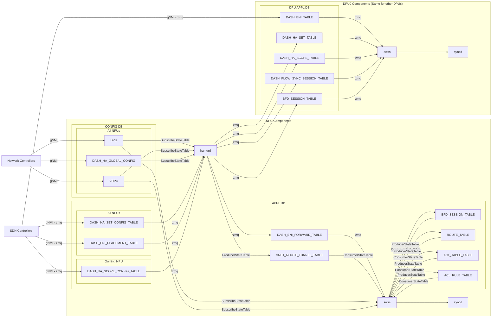
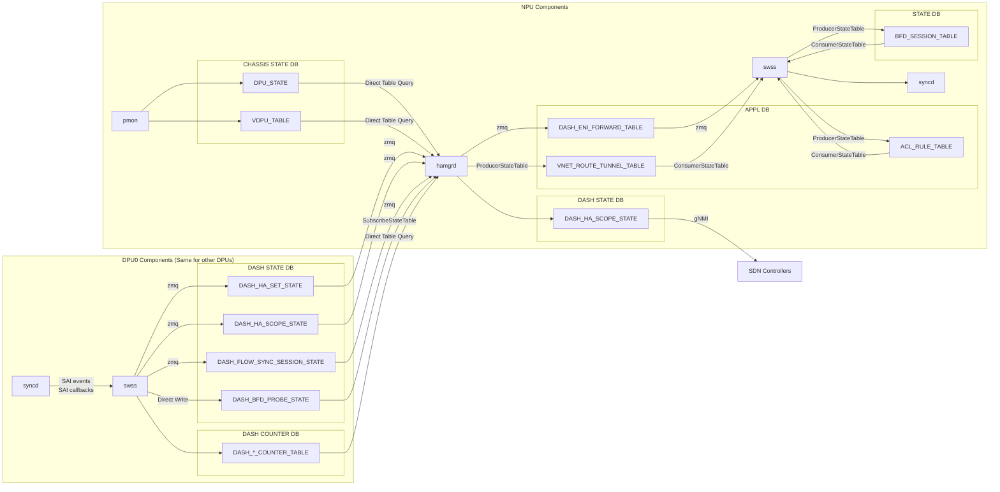

# SmartSwitch High Availability Detailed Design

| Rev | Date | Author | Change Description |
| --- | ---- | ------ | ------------------ |
| 0.1 | 10/14/2023 | Riff Jiang | Initial version |
| 0.2 | 02/12/2024 | Riff Jiang | Added more HA mode support; Updated DB schema and workflow to match recent database and PMON design. |
| 0.3 | 03/28/2024 | Riff Jiang | Updated telemetry. |
| 0.4 | 05/06/2024 | Riff Jiang | Added drop counters for pipeline monitoring. |
| 0.5 | 06/03/2024 | Riff Jiang | Added DASH BFD probe state update workflow and DB schema. |

1. [1. High level data flow](#1-high-level-data-flow)
   1. [1.1. Upstream config programming path](#11-upstream-config-programming-path)
   2. [1.2. State generation and handling path](#12-state-generation-and-handling-path)
2. [2. Database Schema](#2-database-schema)
   1. [2.1. External facing configuration tables](#21-external-facing-configuration-tables)
      1. [2.1.1. CONFIG\_DB (per-NPU)](#211-config_db-per-npu)
         1. [2.1.1.1. DPU / vDPU definitions](#2111-dpu--vdpu-definitions)
         2. [2.1.1.2. HA global configurations](#2112-ha-global-configurations)
      2. [2.1.2. APPL\_DB (per-NPU)](#212-appl_db-per-npu)
         1. [2.1.2.1. HA set configurations](#2121-ha-set-configurations)
         2. [2.1.2.2. HA scope configurations](#2122-ha-scope-configurations)
         3. [2.1.2.3. ENI placement table (scope = `eni` only)](#2123-eni-placement-table-scope--eni-only)
      3. [2.1.3. DPU\_APPL\_DB (per-DPU)](#213-dpu_appl_db-per-dpu)
         1. [2.1.3.1. DASH object tables](#2131-dash-object-tables)
   2. [2.2. External facing state tables](#22-external-facing-state-tables)
      1. [2.2.1. STATE\_DB (per-NPU)](#221-state_db-per-npu)
         1. [2.2.1.1. HA scope state](#2211-ha-scope-state)
            1. [2.2.1.1.1. Table key](#22111-table-key)
            2. [2.2.1.1.2. Basic information](#22112-basic-information)
            3. [2.2.1.1.3. HA related states](#22113-ha-related-states)
            4. [2.2.1.1.4. Aggregated health signals for this HA scope](#22114-aggregated-health-signals-for-this-ha-scope)
            5. [2.2.1.1.5. Ongoing HA operation state](#22115-ongoing-ha-operation-state)
   3. [2.3. Tables used by HA internally](#23-tables-used-by-ha-internally)
      1. [2.3.1. DPU\_APPL\_DB (per-DPU)](#231-dpu_appl_db-per-dpu)
         1. [2.3.1.1. HA set configurations](#2311-ha-set-configurations)
         2. [2.3.1.2. HA scope configurations](#2312-ha-scope-configurations)
         3. [2.3.1.3. Flow sync sessions](#2313-flow-sync-sessions)
      2. [2.3.2. APPL\_DB (per-NPU)](#232-appl_db-per-npu)
         1. [2.3.2.1. DASH\_ENI\_FORWARD\_TABLE](#2321-dash_eni_forward_table)
      3. [2.3.3. CHASSIS\_STATE\_DB (per-NPU)](#233-chassis_state_db-per-npu)
         1. [2.3.3.1. DPU / vDPU state](#2331-dpu--vdpu-state)
      4. [2.3.4. DPU\_STATE\_DB (per-DPU)](#234-dpu_state_db-per-dpu)
         1. [2.3.4.1. HA set state](#2341-ha-set-state)
         2. [2.3.4.2. HA scope state](#2342-ha-scope-state)
         3. [2.3.4.3. Flow sync session states](#2343-flow-sync-session-states)
         4. [2.3.4.4. DASH BFD probe state](#2344-dash-bfd-probe-state)
3. [3. Telemetry](#3-telemetry)
   1. [3.1. HA state and related health signals](#31-ha-state-and-related-health-signals)
   2. [3.2. Traffic forwarding related](#32-traffic-forwarding-related)
      1. [3.2.1. NPU-to-DPU probe status (Per-HA Scope)](#321-npu-to-dpu-probe-status-per-ha-scope)
      2. [3.2.2. NPU-to-DPU tunnel counters (Per-HA Scope)](#322-npu-to-dpu-tunnel-counters-per-ha-scope)
   3. [3.3. DPU traffic handling related](#33-dpu-traffic-handling-related)
      1. [3.3.1. DPU level counters (Per-DPU)](#331-dpu-level-counters-per-dpu)
      2. [3.3.2. ENI-level traffic counters (Per-ENI)](#332-eni-level-traffic-counters-per-eni)
      3. [3.3.3. ENI-level pipeline drop counters (Per-ENI)](#333-eni-level-pipeline-drop-counters-per-eni)
      4. [3.3.4. ENI-level flow operation counters (Per-ENI)](#334-eni-level-flow-operation-counters-per-eni)
   4. [3.4. Flow sync counters](#34-flow-sync-counters)
      1. [3.4.1. Data plane channel probing (Per-HA Set)](#341-data-plane-channel-probing-per-ha-set)
      2. [3.4.2. Inline flow sync (Per-ENI)](#342-inline-flow-sync-per-eni)
      3. [3.4.3. Bulk sync related counters (Per-HA Set)](#343-bulk-sync-related-counters-per-ha-set)
4. [4. SAI APIs](#4-sai-apis)
5. [5. CLI commands](#5-cli-commands)

## 1. High level data flow

On high level, the SmartSwitch HA supporting multiple modes:

* **DPU-level passthru**: The HA is running on DPU level by DPU itself. In this mode, SmartSwitch HA control plane doesn't drive the HA state machine, but passthru the HA operations to DPU and handles the HA role change notification from DPU accordingly for state reporting and help setting up the right traffic forwarding rules when needed.
* **DPU-level active-standby**: The HA is handled on DPU level. Unlike passthru mode, SmartSwitch HA control plane will drive the HA state machine, and drives all ENIs on the same DPU to the same HA state. The traffic forwarding rule is handled on DPU level.
* **ENI-level active-standby**: The traffic forwarding rule and the HA state machine is handled on ENI level.

The mode can be set on HA set, and all modes are sharing similar high level work flow shown as below.

> Please note that:
>
> 1. The DPU DB in the following graphs are actually placed on the NPU side, due to CPU and memory constraints on DPU. Hence, the communication between `hamgrd` and DPU DB is local and doesn't need to go through PCIe bus.
> 2. Each DPU has its own hamgrd instance, so they can be updated independently from each other as part of DPU updates.

### 1.1. Upstream config programming path

The graph below shows how HA related config are programmed into the NPU and DPU DBs from our upstream services, then being handled by `hamgrd` and `swss`.

### 1.2. State generation and handling path

Whenever device or data path state is changed, we will need to handle them and update the HA related setup accordingly.

The workflow below shows the high level data flow for handling the state changes. There are 2 main paths:

1. BFD probe state change path: When the BFD probe state is changed, `swss` will update the route or ACL rules accordingly to point the traffic to the reachable DPU.
2. DPU state change path: When `pmon` is reporting device issues or we detected data path problem from counters, `hamgrd` will update the HA state machine and the traffic forwarding rules accordingly.

## 2. Database Schema

> NOTE:
>
> * Only the configuration that is related to HA is listed here and please check [SONiC-DASH HLD](https://github.com/sonic-net/SONiC/blob/master/doc/dash/dash-sonic-hld.md) to see other fields.
> * Although the per-DPU database is for each DPU, but they are not running on DPU side, but on NPU side. The communication between `hamgrd` and DPU DB is local and doesn't need to go through PCIe bus.

### 2.1. External facing configuration tables

The following tables will be programmed either by SDN controller or by the network controller to enable HA functionality in SmartSwitch.

#### 2.1.1. CONFIG_DB (per-NPU)

##### 2.1.1.1. DPU / vDPU definitions

* These tables are imported from the SmartSwitch HLD to make the doc more convenient for reading, and we should always use that doc as the source of truth.
* These tables should be prepopulated before any HA configuration tables below are programmed.

| Table | Key | Field | Description |
| --- | --- | --- | --- |
| DPU | | | Physical DPU configuration. |
| | \<DPU_ID\> | | Physical DPU ID |
| | | type | Type of DPU. It can be "local", "cluster" or "external". |
| | | state | Admin state of the DPU device. |
| | | slot_id | Slot ID of the DPU. |
| | | pa_ipv4 | IPv4 address. |
| | | pa_ipv6 | IPv6 address. |
| | | npu_ipv4 | IPv4 address of its owning NPU loopback. |
| | | npu_ipv6 | IPv6 address of its owning NPU loopback. |
| | | probe_ip | Custom probe point if we prefer to use a different one from the DPU IP address. |
| VDPU | | | Virtual DPU configuration. |
| | \<VDPU_ID\> | | Virtual DPU ID |
| | | profile | The profile of the vDPU. |
| | | tier | The tier of the vDPU. |
| | | main_dpu_ids | The IDs of the main physical DPU. |

##### 2.1.1.2. HA global configurations

* The global configuration is shared by all HA sets, and ENIs and should be programmed on all switches.
* The global configuration should be programmed before any HA set configurations below are programmed.

| Table | Key | Field | Description |
| --- | --- | --- | --- |
| DASH_HA_GLOBAL_CONFIG | N/A | | HA global configurations. |
| | | cp_data_channel_port | The port of control plane data channel, used for bulk sync. |
| | | dp_channel_dst_port | The destination port used when tunneling packets via DPU-to-DPU data plane channel. |
| | | dp_channel_src_port_min | The min source port used when tunneling packets via DPU-to-DPU data plane channel. |
| | | dp_channel_src_port_max | The max source port used when tunneling packets via DPU-to-DPU data plane channel. |
| | | dp_channel_probe_interval_ms | The interval of sending each DPU-to-DPU data path probe. |
| | | dp_channel_probe_fail_threshold | The number of probe failure needed to consider data plane channel is dead. |
| | | dpu_bfd_probe_interval_in_ms | The interval of DPU BFD probe in milliseconds. |
| | | dpu_bfd_probe_multiplier | The number of DPU BFD probe failure before probe down. |

#### 2.1.2. APPL_DB (per-NPU)

##### 2.1.2.1. HA set configurations

* The HA set table defines the vDPUs are used in this HA set and its mode, such as HA owner and scope.
* The HA set table should be programmed on all switches, so we can use it to create the traffic forwarding rules on the NPU side.
* If any vDPU in the HA set is local, `hamgrd` will send the HA set information to DPU, so DPU can start pairing with its peer DPU and set up the data plane channel.

| Table | Key | Field | Description |
| --- | --- | --- | --- |
| DASH_HA_SET_CONFIG_TABLE | | | HA set config table, which describes the DPUs that forms the HA set. |
| | \<HA_SET_ID\> | | HA set ID |
| | | version | Config version. |
| | | vip_v4 | IPv4 Data path VIP. |
| | | vip_v6 | IPv6 Data path VIP. |
| | | owner | Owner/Driver of HA state machine. It can be `dpu`, `switch`. |
| | | scope | HA scope. It can be `dpu`, `eni`. |
| | | vdpu_ids | The ID of the vDPUs. |
| | | pinned_vdpu_bfd_probe_states | Pinned probe states of vDPUs, connected by ",". Each state can be "" (none), `up` or `down`. |
| | | preferred_vdpu_id | When preferred vDPU ID is set, the traffic will be forwarded to this vDPU when both BFD probes are up. |
| | | preferred_standalone_vdpu_index | (scope = `eni` only)  Preferred vDPU index to be standalone when entering into standalone setup. |

##### 2.1.2.2. HA scope configurations

* The HA scope configuration table is programmed by SDN controller and contains the HA config for each HA scope (DPU or ENI) that only lands on this specific switch.
* When HA scope is set to `dpu` in HA set, SmartSwitch HA will use the HA set id as the HA scope id, otherwise, HA scope id will be the ENI id.

| Table | Key | Field | Description |
| --- | --- | --- | --- |
| DASH_HA_SCOPE_CONFIG_TABLE | | | HA scope configuration. |
| | \<VDPU_ID\> | | VDPU ID. |
| | \<HA_SCOPE_ID\> | | HA scope ID. It can be the HA set id (scope = `dpu`) or ENI id (scope = `eni`) |
| | | version | Config version. |
| | | disabled | If true, disable this vDPU. It can only be `false` or `true`. |
| | | desired_ha_state | The desired state for this vDPU. It can only be "" (none), `dead`, `active` or `standalone`. |
| | | approved_pending_operation_ids | Approved pending HA operation id list, connected by "," |

##### 2.1.2.3. ENI placement table (scope = `eni` only)

* The ENI placement table is used when HA scope is set to `eni`.
* The ENI placement table defines which HA set this ENI belongs to, and how to forward the traffic.
* The ENI placement table should be programmed on all switches.
* Once this table is programmed, `hamgrd` will generate the routing configurations to `swss` for enable ENI level forwarding.

| Table | Key | Field | Description |
| --- | --- | --- | --- |
| DASH_ENI_PLACEMENT_TABLE | | | ENI placement. |
| | \<ENI_ID\> | | ENI ID. Used for identifying a single ENI. |
| | | version | Config version. |
| | | eni_mac | ENI mac address. Used to create the NPU side ACL rules to match the incoming packets and forward to the right DPUs. |
| | | ha_set_id | The HA set ID that this ENI is allocated to. |
| | | pinned_next_hop_index | The index of the pinned next hop DPU for this ENI traffic forwarding rule. "" = Not set. |

#### 2.1.3. DPU_APPL_DB (per-DPU)

##### 2.1.3.1. DASH object tables

* The DASH objects will only be programmed on the DPU that is hosting the ENIs.

| Table | Key | Field | Description |
| --- | --- | --- | --- |
| DASH_ENI_TABLE | | | HA configuration for each ENI. |
| | \<ENI_ID\> | | ENI ID. Used to identifying a single ENI. |
| | | admin_state | Admin state of each DASH ENI. To support control from HA, `STATE_HA_ENABLED` is added. |
| | | ha_scope_id | HA scope id. It can be the HA set id (scope = `dpu`) or ENI id (scope = `eni`) |
| | | ... | see [SONiC-DASH HLD](https://github.com/sonic-net/SONiC/blob/master/doc/dash/dash-sonic-hld.md) for more details. |

### 2.2. External facing state tables

#### 2.2.1. STATE_DB (per-NPU)

##### 2.2.1.1. HA scope state

To show the current state of HA, the states will be aggregated by `hamgrd` and store in the HA scope table as below.

> Because this state table is relatively large, the fields are splited into a few sections below.

###### 2.2.1.1.1. Table key

| Table | Key | Field | Description |
| --- | --- | --- | --- |
| DASH_HA_SCOPE_STATE | | | The state of each HA scope (vDPU or ENI) that is hosted on local switch. |
| | \<VDPU_ID\> | | VDPU ID. Used to identifying a single VDPU. |
| | \<HA_SCOPE_ID\> | | HA scope ID. It can be the HA set id (scope = `dpu`) or ENI id (scope = `eni`) |

###### 2.2.1.1.2. Basic information

| Table | Key | Field | Description |
| --- | --- | --- | --- |
| | | creation_time_in_ms | HA scope creation time in milliseconds. |
| | | last_heartbeat_time_in_ms | Last heartbeat time in milliseconds. This is used for leak detection. Heartbeat time happens once per minute and will not change the last state updated time. |
| | | vip_v4 | Data path VIP of the DPU or ENI. |
| | | vip_v6 | Data path VIP of the DPU or ENI. |
| | | local_ip | The IP of local DPU. |
| | | peer_ip | The IP of peer DPU. |

###### 2.2.1.1.3. HA related states

| Table | Key | Field | Description |
| --- | --- | --- | --- |
| | | local_ha_state | The state of the HA state machine. This is the state in NPU hamgrd. |
| | | local_ha_state_last_updated_time_in_ms | The time when local target HA state is set. |
| | | local_ha_state_last_updated_reason | The reason of the last HA state change. |
| | | local_target_asic_ha_state | The target HA state in ASIC. This is the state that hamgrd generates and asking DPU to move to. |
| | | local_acked_asic_ha_state | The HA state that ASIC acked. |
| | | local_target_term | The current target term of the HA state machine. |
| | | local_acked_term | The current term that acked by ASIC. |
| | | peer_ha_state | The state of the HA state machine in peer DPU. |
| | | peer_term | The current term in peer DPU. |

###### 2.2.1.1.4. Aggregated health signals for this HA scope

| Table | Key | Field | Description |
| --- | --- | --- | --- |
| | | local_vdpu_midplane_state | The state of local vDPU midplane. The value can be "unknown", "up", "down". |
| | | local_vdpu_midplane_state_last_updated_time_in_ms | Local vDPU midplane state last updated time in milliseconds. |
| | | local_vdpu_control_plane_state | The state of local vDPU control plane, which includes DPU OS and certain required firmware. The value can be "unknown", "up", "down". |
| | | local_vdpu_control_plane_state_last_updated_time_in_ms | Local vDPU control plane state last updated time in milliseconds. |
| | | local_vdpu_data_plane_state | The state of local vDPU data plane, which includes DPU hardware / ASIC and certain required firmware. The value can be "unknown", "up", "down". |
| | | local_vdpu_data_plane_state_last_updated_time_in_ms | Local vDPU data plane state last updated time in milliseconds. |
| | | local_vdpu_up_bfd_sessions_v4 | The list of IPv4 peer IPs (NPU IP) of the BFD sessions in up state. |
| | | local_vdpu_up_bfd_sessions_v4_update_time_in_ms | Local vDPU BFD sessions v4 last updated time in milliseconds. |
| | | local_vdpu_up_bfd_sessions_v6 | The list of IPv6 peer IPs (NPU IP) of the BFD sessions in up state. |
| | | local_vdpu_up_bfd_sessions_v6_update_time_in_ms | Local vDPU BFD sessions v6 last updated time in milliseconds. |

###### 2.2.1.1.5. Ongoing HA operation state

| Table | Key | Field | Description |
| --- | --- | --- | --- |
| | | pending_operation_ids | GUIDs of pending operation IDs, connected by "," |
| | | pending_operation_types | Type of pending operations, e.g. "switchover", "activate_role", "flow_reconcile", "brainsplit_recover". Connected by "," |
| | | pending_operation_list_last_updated_time | Last updated time of the pending operation list. |
| | | switchover_id | Switchover ID (GUID). |
| | | switchover_state | Switchover state. It can be "pendingapproval", "approved", "inprogress", "completed", "failed" |
| | | switchover_start_time_in_ms | The time when operation is created. |
| | | switchover_end_time_in_ms | The time when operation is ended. |
| | | switchover_approved_time_in_ms | The time when operation is approved. |
| | | flow_sync_session_id | Flow sync session ID. |
| | | flow_sync_session_state | Flow sync session state. It can be  "inprogress", "completed", "failed" |
| | | flow_sync_session_start_time_in_ms | Flow sync start time in milliseconds. |
| | | flow_sync_session_target_server | The IP endpoint of the server that flow records are sent to. |

### 2.3. Tables used by HA internally

#### 2.3.1. DPU_APPL_DB (per-DPU)

##### 2.3.1.1. HA set configurations

When a HA set configuration on NPU side contains a local DPU, `hamgrd` will create the HA set configuration and send it to DPU for programming the ASIC by DPU side swss.

| Table | Key | Field | Description |
| --- | --- | --- | --- |
| DASH_HA_SET_TABLE | | | HA set table, which describes the DPUs that forms the HA set. |
| | \<HA_SET_ID\> | | HA set ID |
| | | version | Config version. |
| | | vip_v4 | IPv4 Data path VIP. |
| | | vip_v6 | IPv6 Data path VIP. |
| | | owner | Owner of HA state machine. It can be `controller`, `switch`. |
| | | scope | Scope of HA set. It can be `dpu`, `eni`. |
| | | local_npu_ip | The IP address of local NPU. It can be IPv4 or IPv6. Used for setting up the BFD session. |
| | | local_ip | The IP address of local DPU. It can be IPv4 or IPv6. |
| | | peer_ip | The IP address of peer DPU. It can be IPv4 or IPv6. |
| | | cp_data_channel_port | The port of control plane data channel, used for bulk sync. |
| | | dp_channel_dst_port | The destination port used when tunneling packetse via DPU-to-DPU data plane channel. |
| | | dp_channel_src_port_min | The min source port used when tunneling packetse via DPU-to-DPU data plane channel. |
| | | dp_channel_src_port_max | The max source port used when tunneling packetse via DPU-to-DPU data plane channel. |
| | | dp_channel_probe_interval_ms | The interval of sending each DPU-to-DPU data path probe. |
| | | dp_channel_probe_fail_threshold | The number of probe failure needed to consider data plane channel is dead. |

##### 2.3.1.2. HA scope configurations

| Table | Key | Field | Description |
| --- | --- | --- | --- |
| DASH_HA_SCOPE_TABLE | | | HA scope configuration. |
| | \<HA_SCOPE_ID\> | | HA scope ID. It can be the HA set id (scope = `dpu`) or ENI id (scope = `eni`) |
| | | version | Config version. |
| | | disabled | If true, disable this vDPU. It can only be `false` or `true`. |
| | | ha_role | The HA role for this scope. It can only be `dead`, `active`, `standby`, `standalone`, `switching_to_active`. |
| | | flow_reconcile_requested | If true, flow reconcile will be initiated. (Message Only. Not saved in DB.) |
| | | activate_role_requested | If true, HA role will be activated. (Message Only. Not saved in DB.) |

##### 2.3.1.3. Flow sync sessions

| Table | Key | Field | Description |
| --- | --- | --- | --- |
| DASH_FLOW_SYNC_SESSION_TABLE | | |  |
| | \<SESSION_ID\> | | Flow sync session id. |
| | | ha_set_id | HA set id. |
| | | target_server_ip | The IP of the server that used to receive flow records. |
| | | target_server_port | The port of the server that used to receive flow records. |

#### 2.3.2. APPL_DB (per-NPU)

##### 2.3.2.1. DASH_ENI_FORWARD_TABLE

| Table | Key | Field | Description | Value Format |
| --- | --- | --- | --- | --- |
| DASH_ENI_FORWARD_TABLE | | | | |
| | \<VNET_NAME\> | | VNET name. Used to correlate the VNET table to find VNET info, such as advertised VIP. | {{vnet_name}} |
| | \<ENI_ID\> | | ENI ID. Same as the MAC address of the ENI. | {{eni_id}} |
| | | vdpu_ids | The list vDPU IDs hosting this ENI. | {{vdpu_id1},{vdpu_id2},...} |
| | | primary_vdpu | The primary vDPU id. | {{dpu_id}} |
| | | outbound_vni | (Optional) Outbound VNI used by this ENI, if different from the one in VNET. Each ENI can have its own VNI, such ExpressRoute Gateway Bypass case. | {{vni}} |
| | | outbound_eni_mac_lookup | (Optional) Specify which MAC address to use to lookup the ENI for the outbound traffic. | "" (default), "dst", "src" |

#### 2.3.3. CHASSIS_STATE_DB (per-NPU)

##### 2.3.3.1. DPU / vDPU state

DPU state table stores the health states of each DPU. These data are collected by `pmon`.

| Table | Key | Field | Description |
| --- | --- | --- | --- |
| DPU_STATE | | | Physical DPU state. |
| | \<DPU_ID\> | | Physical DPU ID |
| | | ... | see [SmartSwitch PMON HLD](https://github.com/sonic-net/SONiC/pull/1584) for more details. |
| VDPU_STATE | | | vDPU state. |
| | \<VDPU_ID\> | | vDPU ID |
| | | ... | Placeholder for future vDPU usage. It should follow the same PMON design for DPU. |

#### 2.3.4. DPU_STATE_DB (per-DPU)

##### 2.3.4.1. HA set state

* The HA set state table contains the state of each HA set.

| Table | Key | Field | Description |
| --- | --- | --- | --- |
| DASH_HA_SET_STATE | | | State of each HA set. |
| | \<HA_SET_ID\> | | HA set ID |
| | | last_updated_time | The last update time of this state in milliseconds. |
| | | dp_channel_is_alive | Data plane channel is alive or not. |

##### 2.3.4.2. HA scope state

* The HA scope state table contains the HA state of each HA scope.
  * When ENI-level HA is used, it shows the HA state of each ENI that is hosted on the local DPU.
  * When DPU-level HA is used, it shows the HA state of the local DPU.

| Table | Key | Field | Description |
| --- | --- | --- | --- |
| DASH_HA_SCOPE_STATE | | | State of each HA scope. |
| | \<HA_SCOPE_ID\> | | HA scope ID. It can be the HA set ID or ENI ID, depending on the which HA mode is used. |
| | | last_updated_time | The last update time of this state in milliseconds. |
| | | ha_role | The current HA role confirmed by ASIC. Please refer to the HA states defined in HA HLD. |
| | | ha_role_start_time | The time when HA role is moved into current one in milliseconds. |
| | | ha_term | The current term confirmed by ASIC. |
| | | activate_role_pending | DPU is pending on role activation. |
| | | flow_reconcile_pending | Flow reconcile is requested and pending approval. |
| | | brainsplit_recover_pending | Brainsplit is detected, and DPU is pending on recovery. |

##### 2.3.4.3. Flow sync session states

| Table | Key | Field | Description |
| --- | --- | --- | --- |
| DASH_FLOW_SYNC_SESSION_STATE | | |  |
| | \<SESSION_ID\> | | Flow sync session id. |
| | | state | Flow sync session state. It can be "created", "inprogress", "completed", "failed". |
| | | creation_time_in_ms | Flow sync session creation time in milliseconds. |
| | | last_state_start_time_in_ms | Flow sync session last state start time in milliseconds. |

##### 2.3.4.4. DASH BFD probe state

The schema of `DASH_BFD_PROBE_STATE` table is defined in the [SmartSwitch BFD HLD](https://github.com/sonic-net/SONiC/pull/1635). Please refer to it for detailed definition.

## 3. Telemetry

To properly monitor the HA related features, we provides the following telemetry for monitoring it.

The telemetry will cover both state and counters, which can be mapped into `DPU_STATE_DB` or `DPU_COUNTERS_DB`.

We will focus on only the HA counters below, which will not include basic counters, such as ENI creation/removal or generic DPU health/critical event counters, even though some of them works closely with HA workflows.

### 3.1. HA state and related health signals

To help simplify checking the HA states, `hamgrd` will aggregate the HA states and related health signals and store them in the HA scope state table.

Please refer to the [HA scope state](#2211-ha-scope-state) table in NPU DB for detailed DB schema design.

### 3.2. Traffic forwarding related

The following states and counters will help us monitor the NPU-to-DPU tunnel for traffic forwarding.

#### 3.2.1. NPU-to-DPU probe status (Per-HA Scope)

This is managed by `swss` via overlay ECMP with BFD. Please refer to its HLD [here](https://github.com/r12f/SONiC/blob/user/r12f/ha/doc/vxlan/Overlay%20ECMP%20with%20BFD.md).

#### 3.2.2. NPU-to-DPU tunnel counters (Per-HA Scope)

On NPU side, we should have following counters to monitor how the NPU-to-DPU tunnel is working:

| Name | Description |
| --- | --- |
| packets_forwarded | Number of packets hitting the traffic forwarding rule. |
| bytes_forwarded | Number of bytes hitting the traffic forwarding rule. |

> TODO: Can we have counters for discards, error and oversize?

### 3.3. DPU traffic handling related

On DPU side, we should have following counters to monitor how the DPU is handling the traffic.

#### 3.3.1. DPU level counters (Per-DPU)

Although majority of the counters will be tracked on ENI level, but before the packet is landed on an ENI, it might fail in other places, such as incorrect packet format and so on. These counters will be tracked separately and will be stored per port basis in the port counters.

Here are some examples of port counters we have:

| Name | Description |
| --- | --- |
| SAI_PORT_STAT_IF_IN/OUT_UCAST_PKTS | Number of packets received / sent. |
| SAI_PORT_STAT_IF_IN/OUT_OCTETS | Total bytes received / sent. |
| SAI_PORT_STAT_IF_IN/OUT_DISCARDS| Number of incoming/outgoing packets get discarded. |
| SAI_PORT_STAT_IF_IN/OUT_ERRORS| Number of incoming/outgoing packets have errors like CRC error. |
| SAI_PORT_STAT_ETHER_RX/TX_OVERSIZE_PKTS | Number of incoming/outgoing packets exceeds the MTU. |

For the full list of port counters, please refer to the `sai_port_stat_t` structure in [SAI header file](https://github.com/opencomputeproject/SAI/blob/master/inc/saiport.h).

Besides the standard SAI stats provided by each port, we also have the following counters extended in DASH:

| Name | Description |
| --- | --- |
| SAI_PORT_STAT_ENI_MISS_DROP_PKTS | Number of packets that are dropped due to ENI not found. |
| SAI_PORT_STAT_VIP_MISS_DROP_PKTS | Number of packets that are dropped due to VIP not found. |

#### 3.3.2. ENI-level traffic counters (Per-ENI)

Once the packet lands on an ENI, we should have the following counters to monitor how much traffic is handled by each ENI:

| Name | Description |
| -------------- | ----------- |
| SAI_ENI_STAT_(/OUTBOUND_/INBOUND_)RX_BYTES | Total bytes received on ENI (overall/outbound/inbound) pipeline. |
| SAI_ENI_STAT_(/OUTBOUND_/INBOUND_)RX_PACKETS | Total number of packets received on ENI (overall/outbound/inbound) pipeline. |
| SAI_ENI_STAT_(/OUTBOUND_/INBOUND_)TX_BYTES | Total bytes sent by ENI (overall/outbound/inbound) pipeline. |
| SAI_ENI_STAT_(/OUTBOUND_/INBOUND_)TX_PACKETS | Total number of packets sent by ENI (overall/outbound/inbound) pipeline. |

#### 3.3.3. ENI-level pipeline drop counters (Per-ENI)

When the packet is landed on the ENI going throught each match stages, it might be dropped due to no entries can be matched, such as routing or CA-PA mapping. In order to show these drops, we should have the following counters:

| Name | Description |
| -------------- | ----------- |
| SAI_ENI_STAT_OUTBOUND_ROUTING_ENTRY_MISS_DROP_PKTS | Number of packets that are dropped due to outbound routing entry not found. |
| SAI_ENI_STAT_OUTBOUND_CA_PA_ENTRY_MISS_DROP_PKTS | Number of packets that are dropped due to outbound routing entry not found. |
| SAI_ENI_STAT_TUNNEL_MISS_DROP_PKTS | Number of packets that are dropped due to outbound routing entry not found. |
| SAI_ENI_STAT_INBOUND_ROUTING_MISS_DROP_PKTS | Number of packets that are dropped due to outbound routing entry not found. |

#### 3.3.4. ENI-level flow operation counters (Per-ENI)

| Name | Description |
| -------------- | ----------- |
| SAI_ENI_STAT_FLOW_CREATED | Total flow created on ENI. |
| SAI_ENI_STAT_FLOW_CREATE_FAILED | Total flow failed to create on ENI. |
| SAI_ENI_STAT_FLOW_UPDATED | Total flow updated on ENI. |
| SAI_ENI_STAT_FLOW_UPDATE_FAILED | Total flow failed to update on ENI. |
| SAI_ENI_STAT_FLOW_DELETED | Total flow deleted on ENI. |
| SAI_ENI_STAT_FLOW_DELETE_FAILED | Total flow failed to delete on ENI. |
| SAI_ENI_STAT_FLOW_AGED | Total flow aged out on ENI. A flow is aged out doesn't mean the flow entry is deleted. It could be marked as pending deletion and get deleted later. |

### 3.4. Flow sync counters

Flow HA has 2 ways to sync the flows from active to standby side: inline sync and bulk sync. And below are the counters that added for monitoring them.

#### 3.4.1. Data plane channel probing (Per-HA Set)

| Name | Description |
| -------------- | ----------- |
| SAI_HA_SET_STAT_DP_PROBE_(REQ/ACK)_RX_BYTES | The bytes of data plane probes that this HA set received. |
| SAI_HA_SET_STAT_DP_PROBE_(REQ/ACK)_RX_PACKETS | The number of packets of data plane probes that this HA set received. |
| SAI_HA_SET_STAT_DP_PROBE_(REQ/ACK)_TX_BYTES | The bytes of data plane probes that this HA set sent. |
| SAI_HA_SET_STAT_DP_PROBE_(REQ/ACK)_TX_PACKETS | The number of packets of data plane probes that this HA set sent. |
| SAI_HA_SET_STAT_DP_PROBE_FAILED | The number of probes that failed. The failure rate = the number of failed probes / the number of tx packets. |

#### 3.4.2. Inline flow sync (Per-ENI)

| Name | Description |
| -------------- | ----------- |
| SAI_ENI_STAT_(INLINE/TIMED)_FLOW_SYNC_PACKET_RX_BYTES | The bytes of inline/timed flow sync packet received by the ENI. |
| SAI_ENI_STAT_(INLINE/TIMED)_FLOW_SYNC_PACKET_RX_PACKETS | The number of inline/timed flow sync packets received by the ENI. |
| SAI_ENI_STAT_(INLINE/TIMED)_FLOW_SYNC_PACKET_TX_BYTES | The bytes of inline/timed flow sync packet that this ENI sent. |
| SAI_ENI_STAT_(INLINE/TIMED)_FLOW_SYNC_PACKET_TX_PACKETS | The number of inline/timed flow sync packets that this ENI sent. |

Besides the packet level counters, we should also have flow operation level counters:

* The number of flow operations can be different from the number of flow sync packets. Depending on implementation, a single flow sync packet can carry multiple flow operations.
* The flow operation could fail or be ignored by ENI.
  * Failed means it is unexpected to receive packet, and we failed to process it.
  * Ignored means packet is expected be received, but we should ignore the flow operation inside and move on without dropping the packet. E.g., more packet arrives before flow sync is ack'ed.

| Name | Description |
| -------------- | ----------- |
| SAI_ENI_STAT_(INLINE/TIMED)\_FLOW\_(CREATE/UPDATE/DELETE)_REQ_SENT | The number of inline/timed flow create/update/delete request that the ENI sent. |
| SAI_ENI_STAT_(INLINE/TIMED)\_FLOW\_(CREATE/UPDATE/DELETE)_REQ_RECV | The number of inline/timed flow create/update/delete request that the ENI received. |
| SAI_ENI_STAT_(INLINE/TIMED)\_FLOW\_(CREATE/UPDATE/DELETE)_REQ_FAILED | The number of inline/timed flow create/update/delete request that the ENI received but failed to process. |
| SAI_ENI_STAT_(INLINE/TIMED)\_FLOW\_(CREATE/UPDATE/DELETE)_REQ_IGNORED | The number of inline/timed flow create/update/delete request that the ENI received but its flow operation is processed as ignored. |
| SAI_ENI_STAT_(INLINE/TIMED)\_FLOW\_(CREATE/UPDATE/DELETE)_ACK_RECV | The number of inline/timed flow create/update/delete ack that the ENI is received. |
| SAI_ENI_STAT_(INLINE/TIMED)\_FLOW\_(CREATE/UPDATE/DELETE)_ACK_FAILED | The number of inline/timed flow create/update/delete ack that the ENI is received but failed to process. |
| SAI_ENI_STAT_(INLINE/TIMED)\_FLOW\_(CREATE/UPDATE/DELETE)_ACK_IGNORED | The number of inline/timed flow create/update/delete ack that the ENI is received but its flow operation is processed as ignored. |

#### 3.4.3. Bulk sync related counters (Per-HA Set)

The control plane data channel will be used for bulk sync. It is implemented using a gRPC server on each DPU.

To monitor how it works, we should have the following counters on HA set level:

| Name | Description |
| --- | --- |
| SAI_HA_SET_STAT_CP_DATA_CHANNEL_CONNECT_ATTEMPTED | Number of connect calls for establishing the data channel. |
| SAI_HA_SET_STAT_CP_DATA_CHANNEL_CONNECT_RECEIVED | Number of connect calls received to estabilish the data channel. |
| SAI_HA_SET_STAT_CP_DATA_CHANNEL_CONNECT_SUCCEEDED | Number of connect calls that succeeded. |
| SAI_HA_SET_STAT_CP_DATA_CHANNEL_CONNECT_FAILED | Number of connect calls that failed because of any reason other than timeout / unreachable. |
| SAI_HA_SET_STAT_CP_DATA_CHANNEL_CONNECT_REJECTED | Number of connect calls that rejected due to certs and etc. |
| SAI_HA_SET_STAT_CP_DATA_CHANNEL_TIMEOUT_COUNT | Number of connect calls that failed due to timeout / unreachable. |

Besides the channel status, we should also have the following counters for the bulk sync messages:

| Name | Description |
| --- | --- |
| SAI_HA_SET_STAT_BULK_SYNC_MESSAGE_RECEIVED | Number of messages we received for bulk sync via data channel. |
| SAI_HA_SET_STAT_BULK_SYNC_MESSAGE_SENT | Number of messages we sent for bulk sync via data channel. |
| SAI_HA_SET_STAT_BULK_SYNC_MESSAGE_SEND_FAILED | Number of messages we failed to sent for bulk sync via data channel. |
| SAI_HA_SET_STAT_BULK_SYNC_FLOW_RECEIVED | Number of flows received from bulk sync message. A single bulk sync message can contain many flow records. |
| SAI_HA_SET_STAT_BULK_SYNC_FLOW_SENT | Number of flows sent via bulk sync message. A single bulk sync message can contain many flow records. |

## 4. SAI APIs

Please refer to HA session API and flow API HLD in DASH repo for SAI API designs.

## 5. CLI commands

The following commands shall be added in CLI for checking the HA config and states:

* `show dash ha global-config`: Shows HA global configuration.
* `show dash ha set status`: Show the HA set status.
* `show dash ha set counters`: Show the HA set counters.
* `show dash ha scope status [ha-scope-id]`: Show the HA scope status.
* `show dash ha scope counters [ha-scope-id]`: Show the HA scope counters.
* `show dash ha flow-sync-session counters [flow-sync-session-id]`: Show the HA flow sync session counters.
