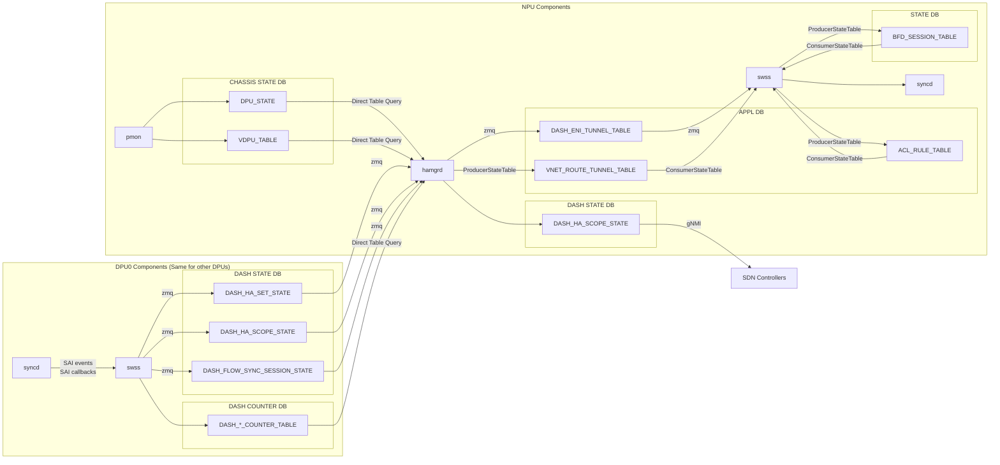

# SmartSwitch High Availability Detailed Design

| Rev | Date | Author | Change Description |
| --- | ---- | ------ | ------------------ |
| 0.1 | 10/14/2023 | Riff Jiang | Initial version |
| 0.2 | 02/12/2024 | Riff Jiang | Adding more HA mode support; Update DB schema and workflow to match recent database and PMON design. |

1. [1. High level data flow](#1-high-level-data-flow)
   1. [1.1. Upstream config programming path](#11-upstream-config-programming-path)
   2. [1.2. State generation and handling path](#12-state-generation-and-handling-path)
2. [2. Database Schema](#2-database-schema)
   1. [2.1. External facing configuration tables](#21-external-facing-configuration-tables)
      1. [2.1.1. CONFIG\_DB (per-NPU)](#211-config_db-per-npu)
         1. [2.1.1.1. DPU / vDPU definitions](#2111-dpu--vdpu-definitions)
         2. [2.1.1.2. HA global configurations](#2112-ha-global-configurations)
      2. [2.1.2. APPL\_DB (per-NPU)](#212-appl_db-per-npu)
         1. [2.1.2.1. HA set configurations](#2121-ha-set-configurations)
         2. [2.1.2.2. ENI placement table (scope = `eni` only)](#2122-eni-placement-table-scope--eni-only)
         3. [2.1.2.3. HA scope configurations (owner = `switch` only)](#2123-ha-scope-configurations-owner--switch-only)
      3. [2.1.3. DPU\_APPL\_DB (per-DPU)](#213-dpu_appl_db-per-dpu)
         1. [2.1.3.1. DASH object tables](#2131-dash-object-tables)
   2. [2.2. External facing state tables](#22-external-facing-state-tables)
      1. [2.2.1. STATE\_DB (per-NPU)](#221-state_db-per-npu)
         1. [2.2.1.1. HA scope state](#2211-ha-scope-state)
            1. [2.2.1.1.1. Table key](#22111-table-key)
            2. [2.2.1.1.1. Basic information](#22111-basic-information)
            3. [2.2.1.1.2. HA related states](#22112-ha-related-states)
            4. [2.2.1.1.3. Aggregated health signals for this HA scope](#22113-aggregated-health-signals-for-this-ha-scope)
            5. [2.2.1.1.4. Ongoing HA operation state](#22114-ongoing-ha-operation-state)
   3. [2.3. Tables used by HA internally](#23-tables-used-by-ha-internally)
      1. [2.3.1. DPU\_APPL\_DB (per-DPU)](#231-dpu_appl_db-per-dpu)
         1. [2.3.1.1. HA set configurations](#2311-ha-set-configurations)
         2. [2.3.1.2. Flow sync sessions](#2312-flow-sync-sessions)
      2. [2.3.2. CHASSIS\_STATE\_DB (per-NPU)](#232-chassis_state_db-per-npu)
         1. [2.3.2.1. DPU / vDPU state](#2321-dpu--vdpu-state)
      3. [2.3.3. DPU\_STATE\_DB (per-DPU)](#233-dpu_state_db-per-dpu)
         1. [2.3.3.1. HA set state](#2331-ha-set-state)
         2. [2.3.3.2. HA scope state](#2332-ha-scope-state)
         3. [2.3.3.3. Flow sync session states](#2333-flow-sync-session-states)
3. [3. Telemetry](#3-telemetry)
   1. [3.1. HA state](#31-ha-state)
   2. [3.2. HA operation counters](#32-ha-operation-counters)
      1. [3.2.1. hamgrd HA operation counters](#321-hamgrd-ha-operation-counters)
      2. [3.2.2. HA SAI API counters](#322-ha-sai-api-counters)
   3. [3.3. HA control plane communication channel related](#33-ha-control-plane-communication-channel-related)
      1. [3.3.1. HA control plane control channel counters](#331-ha-control-plane-control-channel-counters)
      2. [3.3.2. HA control plane data channel counters](#332-ha-control-plane-data-channel-counters)
         1. [3.3.2.1. Per bulk sync flow receive server counters](#3321-per-bulk-sync-flow-receive-server-counters)
         2. [3.3.2.2. Per ENI counters](#3322-per-eni-counters)
   4. [3.4. NPU-to-DPU tunnel related (NPU side)](#34-npu-to-dpu-tunnel-related-npu-side)
      1. [3.4.1. NPU-to-DPU probe status](#341-npu-to-dpu-probe-status)
      2. [3.4.2. NPU-to-DPU tunnel counters](#342-npu-to-dpu-tunnel-counters)
   5. [3.5. NPU-to-DPU tunnel related (DPU side)](#35-npu-to-dpu-tunnel-related-dpu-side)
   6. [3.6. DPU-to-DPU data plane channel related](#36-dpu-to-dpu-data-plane-channel-related)
   7. [3.7. DPU ENI pipeline related](#37-dpu-eni-pipeline-related)
4. [4. SAI APIs](#4-sai-apis)
5. [5. CLI commands](#5-cli-commands)

## 1. High level data flow

On high level, the SmartSwitch HA supporting multiple modes:

* **DPU-level passthru**: The HA is running on DPU level by DPU itself. In this mode, SmartSwitch HA control plane doesn't drive the HA state machine, but passthru the HA operations to DPU and handles the HA role change notification from DPU accordingly for state reporting and help setting up the right traffic forwarding rules when needed.
* **DPU-level active-standby**: The HA is handled on DPU level. Unlike passthru mode, SmartSwitch HA control plane will drive the HA state machine, and drives all ENIs on the same DPU to the same HA state. The traffic forwarding rule is handled on DPU level.
* **ENI-level active-standby**: The traffic forwarding rule and the HA state machine is handled on ENI level.

The mode can be set on HA set, and all modes are sharing similar high level work flow shown as below.

> Please note that:
>
> 1. The DPU DB in the following graphs are actually placed on the NPU side, due to CPU and memory constraints on DPU. Hence, the communication between `hamgrd` and DPU DB is local and doesn't need to go through PCIe bus.
> 2. Each DPU has its own hamgrd instance, so they can be updated independently from each other as part of DPU updates.

### 1.1. Upstream config programming path

The graph below shows how HA related config are programmed into the NPU and DPU DBs from our upstream services, then being handled by `hamgrd` and `swss`.

### 1.2. State generation and handling path

Whenever device or data path state is changed, we will need to handle them and update the HA related setup accordingly.

The workflow below shows the high level data flow for handling the state changes. There are 2 main paths:

1. BFD probe state change path: When the BFD probe state is changed, `swss` will update the route or ACL rules accordingly to point the traffic to the reachable DPU.
2. DPU state change path: When `pmon` is reporting device issues or we detected data path problem from counters, `hamgrd` will update the HA state machine and the traffic forwarding rules accordingly.

## 2. Database Schema

> NOTE:
>
> * Only the configuration that is related to HA is listed here and please check [SONiC-DASH HLD](https://github.com/sonic-net/SONiC/blob/master/doc/dash/dash-sonic-hld.md) to see other fields.
> * Although the per-DPU database is for each DPU, but they are not running on DPU side, but on NPU side. The communication between `hamgrd` and DPU DB is local and doesn't need to go through PCIe bus.

### 2.1. External facing configuration tables

The following tables will be programmed either by SDN controller or by the network controller to enable HA functionality in SmartSwitch.

#### 2.1.1. CONFIG_DB (per-NPU)

##### 2.1.1.1. DPU / vDPU definitions

* These tables are imported from the SmartSwitch HLD to make the doc more convenient for reading, and we should always use that doc as the source of truth.
* These tables should be prepopulated before any HA configuration tables below are programmed.

| Table | Key | Field | Description |
| --- | --- | --- | --- |
| DPU | | | Physical DPU configuration. |
| | \<DPU_ID\> | | Physical DPU ID |
| | | type | Type of DPU. It can be "local", "cluster" or "external". |
| | | state | Admin state of the DPU device. |
| | | slot_id | Slot ID of the DPU. |
| | | pa_ipv4 | IPv4 address. |
| | | pa_ipv6 | IPv6 address. |
| | | npu_ipv4 | IPv4 address of its owning NPU loopback. |
| | | npu_ipv6 | IPv6 address of its owning NPU loopback. |
| | | probe_ip | Custom probe point if we prefer to use a different one from the DPU IP address. |
| VDPU | | | Virtual DPU configuration. |
| | \<VDPU_ID\> | | Virtual DPU ID |
| | | profile | The profile of the vDPU. |
| | | tier | The tier of the vDPU. |
| | | main_dpu_ids | The IDs of the main physical DPU. |

##### 2.1.1.2. HA global configurations

* The global configuration is shared by all HA sets, and ENIs and should be programmed on all switches.
* The global configuration should be programmed before any HA set configurations below are programmed.

| Table | Key | Field | Description |
| --- | --- | --- | --- |
| DASH_HA_GLOBAL_CONFIG | N/A | | HA global configurations. |
| | | cp_data_channel_port | The port of control plane data channel, used for bulk sync. |
| | | dp_channel_dst_port | The destination port used when tunneling packets via DPU-to-DPU data plane channel. |
| | | dp_channel_src_port_min | The min source port used when tunneling packets via DPU-to-DPU data plane channel. |
| | | dp_channel_src_port_max | The max source port used when tunneling packets via DPU-to-DPU data plane channel. |
| | | dp_channel_probe_interval_ms | The interval of sending each DPU-to-DPU data path probe. |
| | | dp_channel_probe_fail_threshold | The number of probe failure needed to consider data plane channel is dead. |
| | | dpu_bfd_probe_interval_in_ms | The interval of DPU BFD probe in milliseconds. |
| | | dpu_bfd_probe_multiplier | The number of DPU BFD probe failure before probe down. |

#### 2.1.2. APPL_DB (per-NPU)

##### 2.1.2.1. HA set configurations

* The HA set table defines the vDPUs are used in this HA set and its mode, such as HA owner and scope.
* The HA set table should be programmed on all switches, so we can use it to create the traffic forwarding rules on the NPU side.
* If any vDPU in the HA set is local, `hamgrd` will send the HA set information to DPU, so DPU can start pairing with its peer DPU and set up the data plane channel.

| Table | Key | Field | Description |
| --- | --- | --- | --- |
| DASH_HA_SET_CONFIG_TABLE | | | HA set config table, which describes the DPUs that forms the HA set. |
| | \<HA_SET_ID\> | | HA set ID |
| | | version | Config version. |
| | | vip_v4 | IPv4 Data path VIP. |
| | | vip_v6 | IPv6 Data path VIP. |
| | | owner | Owner/Driver of HA state machine. It can be `dpu`, `switch`. |
| | | scope | HA scope. It can be `dpu`, `eni`. |
| | | vdpu_ids | The ID of the vDPUs. |
| | | pinned_vdpu_bfd_probe_states | Pinned probe states of vDPUs, connected by ",". Each state can be "" (none), `up` or `down`. |
| | | preferred_vdpu_id | When preferred vDPU ID is set, the traffic will be forwarded to this vDPU when both BFD probes are up. |
| | | preferred_standalone_vdpu_index | (scope = `eni` only)  Preferred vDPU index to be standalone when entering into standalone setup. |

##### 2.1.2.2. ENI placement table (scope = `eni` only)

* The ENI placement table is used when HA scope is set to `eni`.
* The ENI placement table defines which HA set this ENI belongs to, and how to forward the traffic.
* The ENI placement table should be programmed on all switches.
* Once this table is programmed, `hamgrd` will generate the routing configurations to `swss` for enable ENI level forwarding.

| Table | Key | Field | Description |
| --- | --- | --- | --- |
| DASH_ENI_PLACEMENT_TABLE | | | ENI placement. |
| | \<ENI_ID\> | | ENI ID. Used for identifying a single ENI. |
| | | version | Config version. |
| | | eni_mac | ENI mac address. Used to create the NPU side ACL rules to match the incoming packets and forward to the right DPUs. |
| | | ha_set_id | The HA set ID that this ENI is allocated to. |
| | | pinned_next_hop_index | The index of the pinned next hop DPU for this ENI traffic forwarding rule. "" = Not set. |

##### 2.1.2.3. HA scope configurations (owner = `switch` only)

* The HA scope configuration table is programmed by SDN controller and contains the HA config for each HA scope (DPU or ENI) that only lands on this specific switch.
* When HA scope is set to `dpu` in HA set, SmartSwitch HA will use the HA set id as the HA scope id, otherwise, HA scope id will be the ENI id.

| Table | Key | Field | Description |
| --- | --- | --- | --- |
| DASH_HA_SCOPE_CONFIG_TABLE | | | HA scope configuration. |
| | \<VDPU_ID\> | | VDPU ID. |
| | \<HA_SCOPE_ID\> | | HA scope ID. It can be the HA set id (scope = `dpu`) or ENI id (scope = `eni`) |
| | | version | Config version. |
| | | desired_ha_state | The desired state for this vDPU. It can only be "" (none), `dead`, `active` or `standalone`. |
| | | approved_pending_operation_request_id | Approved pending approval operation ID, e.g. switchover operation. |

#### 2.1.3. DPU_APPL_DB (per-DPU)

##### 2.1.3.1. DASH object tables

* The DASH objects will only be programmed on the DPU that is hosting the ENIs.

| Table | Key | Field | Description |
| --- | --- | --- | --- |
| DASH_ENI_TABLE | | | HA configuration for each ENI. |
| | \<ENI_ID\> | | ENI ID. Used to identifying a single ENI. |
| | | admin_state | Admin state of each DASH ENI. To support control from HA, `STATE_HA_ENABLED` is added. |
| | | ha_scope_id | HA scope id. It can be the HA set id (scope = `dpu`) or ENI id (scope = `eni`) |
| | | ... | see [SONiC-DASH HLD](https://github.com/sonic-net/SONiC/blob/master/doc/dash/dash-sonic-hld.md) for more details. |

### 2.2. External facing state tables

#### 2.2.1. STATE_DB (per-NPU)

##### 2.2.1.1. HA scope state

To show the current state of HA, the states will be aggregated by `hamgrd` and store in the HA scope table as below.

> Because this state table is relatively large, the fields are splited into a few sections below.

###### 2.2.1.1.1. Table key

| Table | Key | Field | Description |
| --- | --- | --- | --- |
| DASH_HA_SCOPE_STATE | | | The state of each HA scope (vDPU or ENI) that is hosted on local switch. |
| | \<VDPU_ID\> | | VDPU ID. Used to identifying a single VDPU. |
| | \<HA_SCOPE_ID\> | | HA scope ID. It can be the HA set id (scope = `dpu`) or ENI id (scope = `eni`) |

###### 2.2.1.1.1. Basic information

| Table | Key | Field | Description |
| --- | --- | --- | --- |
| | | creation_time_in_ms | HA scope creation time in milliseconds. |
| | | last_updated_time_in_ms | Last updated time in milliseconds. |
| | | last_heartbeat_time_in_ms | Last heartbeat time in milliseconds. This is used for leak detection. Heartbeat time happens once per minute and will not change the last state updated time. |
| | | vip_v4 | Data path VIP of the DPU or ENI. |
| | | vip_v6 | Data path VIP of the DPU or ENI. |
| | | local_ip | The IP of local DPU. |
| | | peer_ip | The IP of peer DPU. |

###### 2.2.1.1.2. HA related states

| Table | Key | Field | Description |
| --- | --- | --- | --- |
| | | local_ha_state | The state of the HA state machine. This is the state in NPU hamgrd. |
| | | local_ha_state_last_update_time_in_ms | The time when local target HA state is set. |
| | | local_ha_state_last_update_reason | The reason of the last HA state change. |
| | | local_target_asic_ha_state | The target HA state in ASIC. This is the state that hamgrd generates and asking DPU to move to. |
| | | local_acked_asic_ha_state | The HA state that ASIC acked. |
| | | local_target_term | The current target term of the HA state machine. |
| | | local_acked_term | The current term that acked by ASIC. |
| | | peer_ha_state | The state of the HA state machine in peer DPU. |
| | | peer_term | The current term in peer DPU. |

###### 2.2.1.1.3. Aggregated health signals for this HA scope

| Table | Key | Field | Description |
| --- | --- | --- | --- |
| | | local_vdpu_midplane_state | The state of local vDPU midplane. The value can be "unknown", "up", "down". |
| | | local_vdpu_control_plane_state | The state of local vDPU control plane, which includes DPU OS and certain required firmware. The value can be "unknown", "up", "down". |
| | | local_vdpu_data_plane_state | The state of local vDPU data plane, which includes DPU hardware / ASIC and certain required firmware. The value can be "unknown", "up", "down". |

###### 2.2.1.1.4. Ongoing HA operation state

| Table | Key | Field | Description |
| --- | --- | --- | --- |
| | | ha_operation_type | HA operation type, e.g., "switchover". |
| | | ha_operation_id | HA operation ID (GUID). |
| | | ha_operation_state | HA operation state. It can be "created", "pendingapproval", "approved", "inprogress", "completed" |
| | | ha_operation_start_time_in_ms | The time when operation is created. |
| | | ha_operation_state_last_updated_time_in_ms | The time when operation state is updated last time. |
| | | flow_sync_session_id | Flow sync session ID. |
| | | flow_sync_session_state | Flow sync session state. It can be "created", "inprogress", "completed" |
| | | flow_sync_session_start_time_in_ms | Flow sync start time in milliseconds. |
| | | flow_sync_session_target_server | The IP endpoint of the server that flow records are sent to. |

### 2.3. Tables used by HA internally

#### 2.3.1. DPU_APPL_DB (per-DPU)

##### 2.3.1.1. HA set configurations

When a HA set configuration on NPU side contains a local DPU, `hamgrd` will create the HA set configuration and send it to DPU for programming the ASIC by DPU side swss.

| Table | Key | Field | Description |
| --- | --- | --- | --- |
| DASH_HA_SET_TABLE | | | HA set table, which describes the DPUs that forms the HA set. |
| | \<HA_SET_ID\> | | HA set ID |
| | | version | Config version. |
| | | vip_v4 | IPv4 Data path VIP. |
| | | vip_v6 | IPv6 Data path VIP. |
| | | owner | Owner of HA state machine. It can be `controller`, `switch`. |
| | | scope | Scope of HA set. It can be `dpu`, `eni`. |
| | | local_npu_ip | The IP address of local NPU. It can be IPv4 or IPv6. Used for setting up the BFD session. |
| | | local_ip | The IP address of local DPU. It can be IPv4 or IPv6. |
| | | peer_ip | The IP address of peer DPU. It can be IPv4 or IPv6. |
| | | cp_data_channel_port | The port of control plane data channel, used for bulk sync. |
| | | dp_channel_dst_port | The destination port used when tunneling packetse via DPU-to-DPU data plane channel. |
| | | dp_channel_src_port_min | The min source port used when tunneling packetse via DPU-to-DPU data plane channel. |
| | | dp_channel_src_port_max | The max source port used when tunneling packetse via DPU-to-DPU data plane channel. |
| | | dp_channel_probe_interval_ms | The interval of sending each DPU-to-DPU data path probe. |
| | | dp_channel_probe_fail_threshold | The number of probe failure needed to consider data plane channel is dead. |

##### 2.3.1.2. Flow sync sessions

| Table | Key | Field | Description |
| --- | --- | --- | --- |
| DASH_FLOW_SYNC_SESSION_TABLE | | |  |
| | \<SESSION_ID\> | | Flow sync session id. |
| | | ha_set_id | HA set id. |
| | | target_server_ip | The IP of the server that used to receive flow records. |
| | | target_server_port | The port of the server that used to receive flow records. |

#### 2.3.2. CHASSIS_STATE_DB (per-NPU)

##### 2.3.2.1. DPU / vDPU state

DPU state table stores the health states of each DPU. These data are collected by `pmon`.

| Table | Key | Field | Description |
| --- | --- | --- | --- |
| DPU_STATE | | | Physical DPU state. |
| | \<DPU_ID\> | | Physical DPU ID |
| | | ... | see [SmartSwitch PMON HLD](https://github.com/sonic-net/SONiC/pull/1584) for more details. |
| VDPU_STATE | | | vDPU state. |
| | \<VDPU_ID\> | | vDPU ID |
| | | ... | Placeholder for future vDPU usage. It should follow the same PMON design for DPU. |

#### 2.3.3. DPU_STATE_DB (per-DPU)

##### 2.3.3.1. HA set state

* The HA set state table contains the state of each HA set.

| Table | Key | Field | Description |
| --- | --- | --- | --- |
| DASH_HA_SET_STATE | | | State of each HA set. |
| | \<HA_SET_ID\> | | HA set ID |
| | | last_update_time | The last update time of this state in milliseconds. |
| | | dp_channel_is_alive | Data plane channel is alive or not. |

##### 2.3.3.2. HA scope state

* The HA scope state table contains the HA state of each HA scope.
  * When ENI-level HA is used, it shows the HA state of each ENI that is hosted on the local DPU.
  * When DPU-level HA is used, it shows the HA state of the local DPU.

| Table | Key | Field | Description |
| --- | --- | --- | --- |
| DASH_HA_SCOPE_STATE | | | State of each HA scope. |
| | \<HA_SCOPE_ID\> | | HA scope ID. It can be the HA set ID or ENI ID, depending on the which HA mode is used. |
| | | last_update_time | The last update time of this state in milliseconds. |
| | | ha_role | The current HA role confirmed by ASIC. Please refer to the HA states defined in HA HLD. |
| | | ha_role_start_time | The time when HA role is moved into current one in milliseconds. |
| | | ha_term | The current term confirmed by ASIC. |
| | | raw_ha_state | The raw HA state from the ASIC. |
| | | raw_ha_error | The raw error code about HA from the ASIC. |

##### 2.3.3.3. Flow sync session states

| Table | Key | Field | Description |
| --- | --- | --- | --- |
| DASH_FLOW_SYNC_SESSION_STATE | | |  |
| | \<SESSION_ID\> | | Flow sync session id. |
| | | state | Flow sync session state. It can be "created", "inprogress", "completed", "failed". |
| | | creation_time_in_ms | Flow sync session creation time in milliseconds. |
| | | last_state_start_time_in_ms | Flow sync session last state start time in milliseconds. |

## 3. Telemetry

To properly monitor the HA related features, we provides the following telemetry for monitoring it.

The telemetry will cover both state and counters, which can be mapped into `DPU_STATE_DB` or `DPU_COUNTER_DB`.

* For ENI level states and counters in NPU DB, we will have `VDPU_ID` in the key as well as the `ENI_ID` to make each counter unique, because ENI migration from one DPU to another on the same switch.
* For ENI level states and counters in DPU DB, we don’t need to have `VDPU_ID` in the key, because they are tied to a specific DPU, and we should know which DPU it is during logging.

We will focus on only the HA counters below, which will not include basic counters, such as ENI creation/removal or generic DPU health/critical event counters, even though some of them works closely with HA workflows.

### 3.1. HA state

First of all, we need to store the HA states for us to check.

Please refer to the [ENI state](#2141-eni-state) table in NPU DB for detailed DB schema design.

### 3.2. HA operation counters

Besides the HA states, we also need to log all the operations that is related to HA.

HA operations are mostly lies in 2 places: `hamgrd` for operations coming from northbound interfaces and syncd for SAI APIs we call or SAI notification we handle related to HA.

#### 3.2.1. hamgrd HA operation counters

All the HA operation counters will be:

* Saved in NPU side `COUNTER_DB`, since the `hamgrd` is running on NPU side.
* Partitioned with ENI level key: `DASH_HA_OP_STATS|<VDPU_ID>|<ENI_ID>`.

| Name | Description |
| --- | --- |
| **state_enter*(req/success/failure)_count | Number of state transitions we have done (Request/Succeeded Request/Failed request). |
| total_(successful/failed)_*_state_enter_time_in_us | The total time we used to transit to specific state in microseconds. Successful and failed transitions need to be tracked separately, as they will have different patterns. |
| switchover_(req/success/failure)_count | Similar as above, but for switchover operations. |
| total_(successful/failed)_switchover_time_in_us | Similar as above, but for switchover operations. |
| shutdown_standby_(req/success/failure)_count | Similar as above, but for shutdown standby operations. |
| total_(successful/failed)_shutdown_standby_time_in_us | Similar as above, but for shutdown standby operations. |
| shutdown_self_(req/success/failure)_count | Similar as above, but for force shutdown operations. |
| total_(successful/failed)_shutdown_self_time_in_us | Similar as above, but for force shutdown operations. |

#### 3.2.2. HA SAI API counters

All the HA SAI API counters will be:

* Saved in DPU side `DASH_COUNTER_DB`, as SAI APIs are called in DPU side syncd.
* Partitioned with ENI level key: `DASH_SAI_CALL_STATS|<ENI_ID>`.

| Name | Description |
| --- | --- |
| *_(req/success/failure)_count | Number of SAI APIs we call or notifications we handle, with success and failure counters too. |
| total_*_(successful/failed)_time_in_us | Total time we used to do the SAI operations in microseconds. Successful and failed operations should be tracked separately, as they will have different patterns. |

### 3.3. HA control plane communication channel related

#### 3.3.1. HA control plane control channel counters

HA control plane control channel is running on NPU side, mainly used for passing the HA control commands.

The counters of this channel will be:

* Collected by `hamgrd` on NPU side.
* Saved in NPU side `DASH_COUNTER_DB`.
* Stored with key: `DASH_HA_CP_CONTROL_CHANNEL_STATS|<REMOTE_NPU_IP>`.
  * This counter doesn’t need to be partitioned on a single switch, because it is shared for all ENIs.

| Name | Description |
| --- | --- |
| is_alive | Is the channel alive for use. 0 = dead, 1 = alive. |
| channel_connect_count | Number of connect calls for establishing the data channel. |
| channel_connect_succeeded_count | Number of connect calls that succeeded. |
| channel_connect_failed_count | Number of connect calls that failed because of any reason other than timeout / unreachable. |
| channel_connect_timeout_count | Number of connect calls that failed due to timeout / unreachable. |

#### 3.3.2. HA control plane data channel counters

HA control plane data channel is composed with 2 parts: SAI flow API calls and `swbusd` for flow forwarding. The first one is already covered by all the SAI API counters above, so we will only focus on the `swbusd` part here. And the counters will be:

* Collected on `swbusd` on NPU side.
* Saved in NPU side `DASH_COUNTER_DB`.

##### 3.3.2.1. Per bulk sync flow receive server counters

Since the data channel is formed by multiple flow receive servers, the data plane counters needs to be logged per each server: `DASH_HA_CP_DATA_CHANNEL_CONN_STATS|<PEER_FLOW_RECV_SVR_IP_ENDPOINT>`.

| Name | Description |
| --- | --- |
| is_alive | Is the channel alive for use. 0 = dead, 1 = alive. |
| channel_connect_count | Number of connect calls for establishing the data channel. |
| channel_connect_succeeded_count | Number of connect calls that succeeded. |
| channel_connect_failed_count | Number of connect calls that failed because of any reason other than timeout / unreachable. |
| channel_connect_timeout_count | Number of connect calls that failed due to timeout / unreachable. |
| bulk_sync_message_sent/received | Number of messages we send or receive for bulk sync via data channel. |
| bulk_sync_message_size_sent/received | The total size of messages we send or receive for bulk sync via data channel. |
| bulk_sync_flow_received_from_local | Number of flows received from local DPU |
| bulk_sync_flow_forwarded_to_peer | Number of flows forwarded to paired DPU |

##### 3.3.2.2. Per ENI counters

Besides per flow receive server, the counters should also be tracked on ENI level, so we can have a more aggregated view for each ENI. The key can be: `DASH_HA_CP_DATA_CHANNEL_ENI_STATS|<ENI_ID>`.

| Name | Description |
| --- | --- |
| bulk_sync_message_sent/received | Number of messages we send or receive for bulk sync via data channel. |
| bulk_sync_message_size_sent/received | The total size of messages we send or receive for bulk sync via data channel. |
| bulk_sync_flow_received_from_local | Number of flows received from local DPU |
| bulk_sync_flow_forwarded_to_peer | Number of flows forwarded to paired DPU |

> NOTE: We didn't add the ENI key in the per flow receive server counters, because multiple ENIs can share the same flow receive server. It is up to each vendor's implementation.

### 3.4. NPU-to-DPU tunnel related (NPU side)

The second part of the HA is the NPU-to-DPU tunnel. This includes the probe status and traffic information on the tunnel.

#### 3.4.1. NPU-to-DPU probe status

This is managed by `swss` via overlay ECMP with BFD. Please refer to its HLD [here](https://github.com/r12f/SONiC/blob/user/r12f/ha/doc/vxlan/Overlay%20ECMP%20with%20BFD.md).

#### 3.4.2. NPU-to-DPU tunnel counters

On NPU side, we should also have ENI level tunnel traffic counters:

* Collected on the NPU side via SAI.
* Saved in the NPU side `COUNTER_DB`.
* Partitioned into ENI level with key: `DASH_HA_NPU_TO_ENI_TUNNEL_STATS|<ENI_ID>`.

| Name | Description |
| --- | --- |
| packets_in/out | Number of packets received / sent. |
| bytes_in/out | Total bytes received / sent. |
| packets_discards_in/out | Number of incoming/outgoing packets get discarded. |
| packets_error_in/out | Number of incoming/outgoing packets have errors like CRC error. |
| packets_oversize_in/out | Number of incoming/outgoing packets exceeds the MTU. |

> NOTE: In implementation, these counters might have a more SAI-friendly name.

### 3.5. NPU-to-DPU tunnel related (DPU side)

On DPU side, every NPU-to-DPU tunnel traffic needs to be tracked on ENI level as well:

* Collected on the DPU side via SAI.
* Saved in DPU side `COUNTER_DB`.
* Partitioned into ENI level with key: `DASH_HA_NPU_TO_ENI_TUNNEL_STATS|<ENI_ID>`.

| Name | Description |
| --- | --- |
| packets_in/out | Number of packets received / sent. |
| bytes_in/out | Total bytes received / sent. |
| packets_discards_in/out | Number of incoming/outgoing packets get discarded. |
| packets_error_in/out | Number of incoming/outgoing packets have errors like CRC error. |
| packets_oversize_in/out | Number of incoming/outgoing packets exceeds the MTU. |

> NOTE: In implementation, these counters might have a more SAI-friendly name.

### 3.6. DPU-to-DPU data plane channel related

The next part is the DPU-to-DPU data plane channel, which is used for inline flow replications.

* Collected on the DPU side via SAI.
* Saved in DPU side `COUNTER_DB`.
* Partitioned into ENI level with key: `DASH_HA_DPU_DATA_PLANE_STATS|<ENI_ID>`.

| Name | Description |
| --- | --- |
| inline_sync_packet_in/out | Number of inline sync packet received / sent. |
| inline_sync_ack_packet_in/out | Number of inline sync ack packet received / sent. |
| meta_sync_packet_in/out | Number of metadata sync packet (generated by DPU) received / sent. This is for flow sync packets of flow aging, etc. |
| meta_sync_ack_packet_in/out | Number of metadata sync ack packet received / sent. This is for flow sync packets of flow aging, etc. |
| probe_packet_in/out | Number of probe packet received from or sent to the paired ENI on the other DPU. This data is for DPU-to-DPU data plane liveness probe. |
| probe_packet_ack_in/out | Number of probe ack packet received from or sent to the paired ENI on the other DPU. This data is for DPU-to-DPU data plane liveness probe. |

> NOTE: In implementation, these counters might have a more SAI-friendly name.

### 3.7. DPU ENI pipeline related

The last part is how the DPU ENI pipeline works in terms of HA, which includes flow operations:

* Collected on the DPU side via SAI.
* Saved in DPU side `COUNTER_DB`.
* Partitioned into ENI level with key: `DASH_HA_DPU_PIPELINE_STATS|<ENI_ID>`.

| Name | Description |
| --- | --- |
| flow_(creation/update/deletion)_count | Number of inline flow creation/update/delete request that failed for any reason. E.g. not enough memory, update non-existing flow, delete non-existing flow.  |
| inline_flow_(creation/update/deletion)_req_sent | Number of inline flow creation/update/deletion request that sent from active node. Flow resimulation will be covered in flow update requests. |
| inline_flow_(creation/update/deletion)_req_received | Number of inline flow creation update/deletion request that received on standby node. |
| inline_flow_(creation/update/deletion)_req_succeeded | Number of inline flow creation update/deletion request that succeeded (ack received). |
| flow_creation_conflict_count | Number of inline replicated flow that is conflicting with existing flows (flow already exists and action is different). |
| flow_aging_req_sent | Number of flows that aged out in active and being replicated to standby. |
| flow_aging_req_received | Number of flow aging requests received from active side. Request can be batched, but in this counter 1 request = 1 flow. |
| flow_aging_req_succeeded | Number of flow aging requests that succeeded (ack received). |

Please note that we will also have counters for how many flows are created/updated/deleted (succeeded or failed), aged out or resimulated, but this is not in the scope of HA, hence omitted here.

> NOTE: In implementation, these counters might have a more SAI-friendly name.

## 4. SAI APIs

Please refer to HA session API and flow API HLD in DASH repo for SAI API designs.

## 5. CLI commands

The following commands shall be added in CLI for checking the HA config and states:

* `show dash ha config`: Shows HA global configuration.
* `show dash eni ha config`: Show the ENI level HA configuration.
* `show dash eni ha status`: Show the ENI level HA status.
* `show dash eni ha dp-status`: Show the ENI level data path status.
