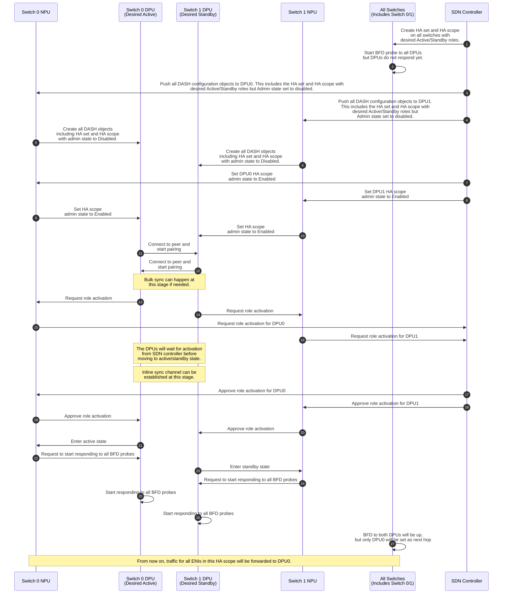
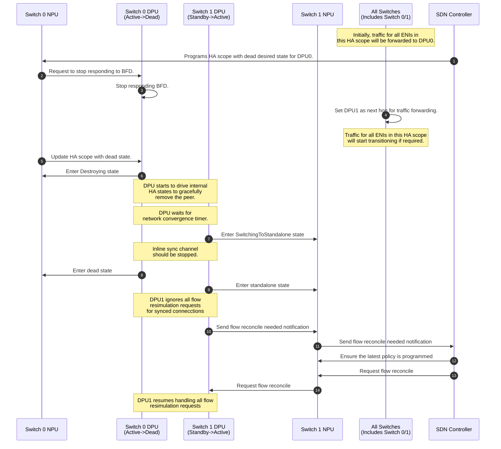
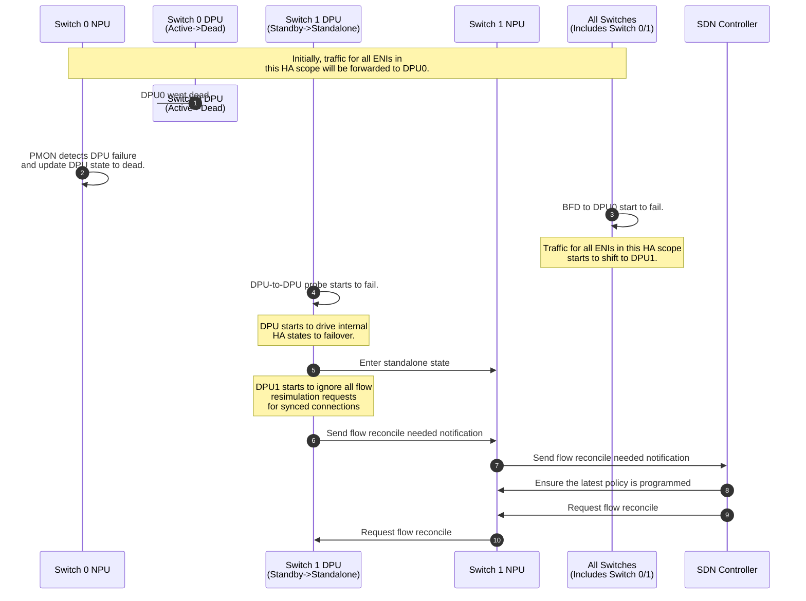

# SmartSwitch High Availability High Level Design - DPU-Scope-DPU-Driven setup

| Rev | Date | Author | Change Description |
| --- | ---- | ------ | ------------------ |
| 0.1 | 02/26/2024 | Riff Jiang | Initial version |
| 0.2 | 05/08/2024 | Mukesh Moopath Velayudhan | Add HA states, activate role and split-brain handling for DPU-driven HA. |
| 0.3 | 06/10/2024 | Riff Jiang | Improve HA state, activate role and fix the BFD responder workflow for DPU-driven HA. |

1. [1. Terminology](#1-terminology)
2. [2. Background](#2-background)
3. [3. DPU-Scope-DPU-Driven setup Overview](#3-dpu-scope-dpu-driven-setup-overview)
4. [4. Network Physical Topology](#4-network-physical-topology)
   1. [4.1. DPU-level HA scope](#41-dpu-level-ha-scope)
   2. [4.2. DPU-level NPU to DPU traffic forwarding](#42-dpu-level-npu-to-dpu-traffic-forwarding)
5. [5. ENI programming with HA setup](#5-eni-programming-with-ha-setup)
6. [6. DPU liveness detection](#6-dpu-liveness-detection)
   1. [6.1. Card level NPU-to-DPU liveness probe](#61-card-level-npu-to-dpu-liveness-probe)
   2. [6.2. DPU-to-DPU liveness probe](#62-dpu-to-dpu-liveness-probe)
7. [7. HA state machine management](#7-ha-state-machine-management)
   1. [7.1. HA states](#71-ha-states)
   2. [7.2. HA role activation](#72-ha-role-activation)
8. [8. Planned operations](#8-planned-operations)
   1. [8.1. HA set creation](#81-ha-set-creation)
   2. [8.2. Planned shutdown](#82-planned-shutdown)
      1. [8.2.1. Shutdown standby DPU](#821-shutdown-standby-dpu)
      2. [8.2.2. Shutdown active DPU](#822-shutdown-active-dpu)
   3. [8.3. Planned switchover](#83-planned-switchover)
   4. [8.4. ENI migration / HA re-pair](#84-eni-migration--ha-re-pair)
9. [9. Unplanned operations](#9-unplanned-operations)
   1. [9.1. Unplanned failover](#91-unplanned-failover)
10. [10. Split-brain and re-pair](#10-split-brain-and-re-pair)
11. [11. Flow tracking and replication](#11-flow-tracking-and-replication)
12. [12. Detailed design](#12-detailed-design)
13. [13. Test Plan](#13-test-plan)

## 1. Terminology

| Term | Explanation |
| ---- | ----------- |
| HA | High Availability. |
| NPU | Network Processing Unit. |
| DPU | Data Processing Unit. |
| ENI | Elastic Network Interface. |
| SDN | Software Defined Network. |
| VIP | Virtual IP address. |

## 2. Background

This document adds and describes the high level design of `DPU-Scope-DPU-Driven` setup in SmartSwitch High Availability (HA), as an extension to our main SmartSwitch HA design document [here](../smart-switch-ha.md), which describes only how the ENI-level HA works (or how `NPU-Driven-ENI-Scope` setup works).

Many things in this setup will shares the same or very similar approach as the ENI-level HA, hence, this document will focus on the differences and new things that are specific to this setup.

## 3. DPU-Scope-DPU-Driven setup Overview

In SmartSwitch HA design, there are a few key characteristics that defines the high level behavior of HA:

- **HA pairing**: How the ENIs are placed amoung all DPUs to form the HA set?
- **HA owner**: Who drives the HA state machine on behalf of SDN controller?
- **HA scope**: At which level, the HA state machine is managed? This determines how the traffic is forwarded from NPU to DPU.
- **HA mode**: How the DPUs coordinate with each other to achieve HA?

From these characteristics, here is the main differences between `DPU-Scope-DPU-Driven` setup and the `NPU-Driven-ENI-Scope` setup in the main HLD:

| Characteristic | `DPU-Scope-DPU-Driven` setup | ENI-level HA setup |
| -------------- | ------------------------ | ------------ |
| HA pairing | Card-level pairing. | Card-level pairing. |
| HA scope | DPU-level HA scope. | ENI-level HA scope. |
| HA owner | DPU drives the HA state machine. | `hamgrd` in NPU drives HA state machine. |
| HA mode | Active-standby | Active-standby |

## 4. Network Physical Topology

The network physical topology for `DPU-Scope-DPU-Driven` setup will be the same as the ENI-level HA setup, e.g. where the NPU/DPU is placed and wired. The main difference is that the HA scope is on the level of all ENIs or a group of ENIs rather than a single ENI. The current deployment will use only 1 HA scope per DPU, so all ENIs on the DPU are mapped to the same HA scope.

This results in the following differences in the network physical topology and the figure below captures the essence of the differences:

### 4.1. DPU-level HA scope

With DPU-level HA scope, the HA state is controlled at the DPU level. This means, in active-standby mode, all ENIs on a DPU will be set to active or standby together.

### 4.2. DPU-level NPU to DPU traffic forwarding

Due to the essense of the DPU-level HA scope, the traffic forwarding from NPU to DPU will be done on DPU level:

- Each DPU pair will use a dedicated VIP per HA scope for traffic forwarding from NPU to DPU.
- All VIPs for all DPUs in the SmartSwitch will be pre-programmed into the NPU and advertised to the network as a single VIP range (or subnet).
- NPU will setup a route to match the packet on the destination VIP, instead of ACLs to match both the VIP and inner MAC.

The data path and packet format will follow the same as the ENI-level HA setup [as described in the main HA design doc](./smart-switch-ha-hld.md#421-eni-level-npu-to-dpu-traffic-forwarding).

## 5. ENI programming with HA setup

The services and high level architecture that are used in the `DPU-Scope-DPU-Driven` setup will be the same as the ENI-level HA setup, such as, `hamgrd` and etc.

The high level workflow also follows the main HA design doc, more specifically:

- Before programming the ENIs, SDN controller creates the DPU pair by programming the HA set into all the NPUs that receives the traffic. `hamgrd` will get notified and call `swss` to setup all the traffic forwarding rules on NPU as well as send the DPU pair information to the DPU.
- After HA set is programmed, SDN controller can create the ENIs and program all the SDN policies for each ENI independently.

For more details on the contract and design, please refer to the detailed design section.

## 6. DPU liveness detection

In `DPU-Scope-DPU-Driven` setup, `hamgrd` will not drive the HA state machine and DPU will drive the HA at DPU level, hence we don't have the ENI-level traffic control, but the [Card level NPU-to-DPU liveness probe based on BFD](./smart-switch-ha-hld.md#61-card-level-npu-to-dpu-liveness-probe) and [DPU-to-DPU liveness probe](./smart-switch-ha-hld.md#63-dpu-to-dpu-liveness-probe) will still be used.

### 6.1. Card level NPU-to-DPU liveness probe

Same as ENI-level HA setup, in `DPU-Scope-DPU-Driven` setup, the BFD probe will:

- Setup on all NPUs for both IPv4 and IPv6 and probe both DPUs.
- Both DPUs will respond the BFD probes, no matter it is active or standby.
- Still only be used for controlling the traffic forwarding behavior from NPU to DPU, and won't be used as the health signal for triggering any failover inside DPU.

Unlike the ENI-level HA setup, BFD probe can work alone to make the traffic forwarding decision without ENI level info. To achieve this, the SDN controller will program the HA set to NPU with the preferred DPU as active/standby setting.

Here is the how the probe works in details (with the DPU0 as preferred DPU):

| DPU0 | DPU1 | Preferred DPU | Next hop | Comment |
| --- | --- | --- | --- | --- |
| Down | Down | DPU0 | DPU0 | Both down is essentially the same as both up, hence effect is the same as Up+Up. |
| Down | Up | DPU0 | DPU1 | NPU will forward all traffic to DPU1, because DPU0 is not reachable. |
| Up | Down | DPU0 | DPU0 | NPU will forward all traffic to DPU0, since DPU0 is preferred and reachable. |
| Up | Up | DPU0 | DPU0 | If both DPU is up, then we respect the preferred DPU. |

For more details on NPU-to-DPU probes,

- The data path and packet format of the BFD probe will be the same as the one defined in the main HA design doc. Please refer to the [Card level NPU-to-DPU liveness probe design](./smart-switch-ha-hld.md#61-card-level-npu-to-dpu-liveness-probe).
- For the detailed design of BFD probe in SmartSwitch, please refer to [SmartSwitch BFD detailed design doc](https://github.com/sonic-net/SONiC/pull/1635).

### 6.2. DPU-to-DPU liveness probe

In `DPU-Scope-DPU-Driven` setup, the DPU-to-DPU liveness probe will still be used as health signal for triggering DPU failover.

However, unlike the ENI-level HA setup, upon DPU-to-DPU probe failure, DPU will drive the HA state machine and failover by itself, without the help of `hamgrd`.

The data path and packet format of the DPU-to-DPU probe will be the same as the one defined in the main HA design doc. Please refer to the [DPU-to-DPU data plane channel design](./smart-switch-ha-hld.md#4352-dpu-to-dpu-data-plane-channel).

## 7. HA state machine management

In `DPU-Scope-DPU-Driven` setup, the HA state machine will be managed by DPU itself, and `hamgrd` will not drive the HA state machine, but only be used for generating the configurations for NPU and DPU, as well as collecting the telemetry and report in the context of HA whenever is needed.

### 7.1. HA states

Since DPU will be driving the HA state machine transition, any HA state change will needs to be reported, otherwise the SDN controller will not be able to know the current HA state of the DPU.

Since different DPU could drive the state machine differently, to normalize the states, we provides the following states for describing the behaviors. However, the transitions are not defined in this design doc, this allows minor differences between implementations.

 | State |    Description                       |
 | ----- | ------------------------------------ |
 | Dead | Initial state. Not participating in HA |
 | Connecting | Trying to connect to its HA pair |
 | Connected | Connection successful and starting active / standby selection. |
 | InitializingToActive | Bulk sync in progress. After bulk sync, this DPU will become active after activation. |
 | InitializingToStandby | Bulk sync in progress. After bulk sync, this DPU will become standby after activation. |
 | PendingActiveActivation | Bulk sync successful, waiting for role activation from SDN controller to go to Active. Dormant state since BFD disabled hence no traffic. |
 | PendingStandbyActivation | Bulk sync successful, waiting for role activation from SDN controller to go to Standby. Dormant state since BFD disabled hence no traffic. |
 | PendingStandaloneActivation | Could not connect to pair, waiting for role activation from SDN controller to go to Standalone. Dormant state since BFD disabled hence no traffic. |
 | Standalone | Standalone role is activated. Responding BFD and forwarding traffic |
 | Active | Active role is activated. Responding BFD, forwarding traffic and syncing flow to its pair |
 | Standby | Standby role is activated. Responding BFD and receive flow sync from its pair |
 | Destroying | Going down for a planned shutdown |
 | SwitchingToStandalone | Gracefully transitioning from paired state to standalone |

 > NOTE: Some DPUs might support traffic forwarding in the standby state for existing flow as well. However the flow decision can still only be made on the active side, which matches the concepts in the HA design. Hence, this is an implementation detail and not a requirement of the HA design at this moment.

### 7.2. HA role activation

After the bulk sync is done and before the DPU moves to `Active` or `Standby` state and take traffic, The DPU is required to go through the HA role activation process.

The purpose of the HA role activation is for ensuring the ENIs (and policies) on the card are up-to-date. Although bulk sync makes the flow table in sync on the 2 DPUs, but it doesn't guarantee the ENIs are up-to-date. If any ENI or policy is missing, existing flows can be dropped (due to ENI missing) or new flows can be established with wrong policy (due to policy missing). And role activation is the process to help bridge this gap.

In `DPU-driven` mode, DPU shall first move into `PendingActive/Standby/StandbyActivation` state, then send a SAI notification on the HA scope as a role activation request. The request will go through `hamgrd` and eventually be delivered to SDN controller. The SDN controller will ensures the policies become identical on both cards, then approve the requests. Once the DPU receives the approval, it can then move to `Active`, `Standby` or `Standalone` state.

## 8. Planned operations

There are a few things we need to notice for the planned operations:

- Same as the main HA HLD:
  - Planned operations are always initiated by SDN controller.
  - All HA state changes and counters will be reported from ASIC eventually to SDN controller via gNMI interfaces, hence omitted in the following workflow.
- All operations will be happening on DPU-level, for example, switchover or removing from HA set.
- Since DPU will be driving the HA state machine, `hamgrd` will only be used for passing through the configurations and report the states and telemetry.

Here are how the workflows look like for the typical planned operations:

### 8.1. HA set creation

The HA bring-up workflow is described below:

> Please note again that different implementation could have slight differences on the state machine transition, so the workflow below only defines the hard requirements for entering and exiting each state during the workflow.

1. The DPU starts out with its initial HA role as `Dead`.
2. SDN controller pushes all DASH configurations to DPU including the HA set and the HA scope:
   1. The SDN controller sets HA scope `Role` to `Active` or `Standby`, `AdminState` to `Disabled`.
3. Once all configurations have been pushed, SDN controller starts the HA state machine on the DPU by updating the HA scope `AdminState` to `Enabled`.
4. DPU moves to `Connecting` state and attempts to connect to its pair specified in the HA set.
4. If the DPU fails to connect to it peer:
   1. It needs to first move to `PendingStandaloneActivation` state and send role activation request to SDN controller.
5. If the DPU connects to it peer successfully,
   1. It needs to move to `Connected` state and decide if it needs to be become `Active` or `Standby` and start bulk sync if needed.
   2. Once bulk sync is done, the DPU can move to `PendingActive/StandbyActivation` state and send role activation request to SDN controller.
6. Once activation is approved, DPU will receive the approval and move to `Active`/`Standby`/`Standalone` state after activation.
7. Once the state is moved to `Active`/`Standdy`/`Standalone` state, `hamgrd` will create the BFD responder on DPU side and start responding to BFD probes.
8. When each switch sees the BFD response, it will start forwarding traffic to the DPU whose `Role` is set to `Active`.

### 8.2. Planned shutdown

With `DPU-driven` mode, the shutdown request will be directly forwarded to DPU. `hamgrd` will ***NOT*** work with each other to make sure the shutdown is done in a safe way.

Let's say, DPUs 0 and 1 are in steady state (Active/Standby) in the HA set and we are trying to shutdown DPU 0. The workflow of planned shutdown will be as follows:

1. SDN controller programs the DPU 0 HA scope desired HA state to `dead`.
2. `hamgrd` and DPU side `swss` will:
   1.  Shutdown the BFD responder on DPU side, which moves all traffic to DPU 1.
   2.  Update the DPU 0 HA role to `Dead`.
3. DPU 0 moves itself to `Destroying` state.
   1. At this stage, traffic can initially land on both DPUs and until it fully shifts to DPU 1.
   2. DPU 0 needs to gracefully shutdown and help DPU 1 move to `Standalone` state while continuing to sync flows.
   3. DPU 0 will start a configurable timer to wait for the network to converge and traffic to fully switchover to DPU 1.
   4. Once this timer expires, no traffic should land on DPU 0. DPU 0 stops forwarding traffic and starts shutting down.
4. At the same time that DPU 0 is shutting down, DPU 1 will:
   1. Move to `SwitchingToStandalone` to drain all the in-flight messages between the DPUs and then finally `Standalone` state when DPU 0 is fully shutdown.
   2. If DPU 1 was in `Standby` state, it needs to pause flow resimulation for all connections synced from old Active and send flow reconcile request to SDN controller.
   3. Only after flow reconcile is received from SDN controller, the flow resimulation will be resumed for these connections. This is to ensure the flow resimulation won't accidentally picking up old SDN policy.

The above DPU state transitions remain same irrespective of which DPU is shutdown. The only difference is if standby DPU 1 was being shutdown instead of DPU 0, then the switch NPUs would continue to forward to DPU 0 without any need to shift traffic.

### 8.3. Planned switchover

In DPU-driven setup, switchover is done via shutdown one side of the DPU, and DPUs pair need to be able to handle the switchover internally.

### 8.4. ENI migration / HA re-pair

To support things like upgrade, we need to update the HA set to pair with another DPU. In this case, the following steps needs to be performed step by step:

1. Trigger [Planned shutdown](#82-planned-shutdown) on the DPU that needs to be removed from the HA set.
2. Update HA set information on all switches and the corresponding DPUs.
   - This will cause the tables and objects related to old HA set to be removed and new HA set to be created.
   - The new DPU joining the HA pair will be in Dead state at this point.
3. Program all ENIs on the new DPU.
4. Once all configurations are done, SDN controller updates the HA admin state to Enabled to start the [HA set creation](#81-ha-set-creation) workflow.

## 9. Unplanned operations

### 9.1. Unplanned failover

## 10. Split-brain and re-pair

In DPU-driven HA mode, depends on how DPU detects the health state of its pair, it could run into split-brain problem, when the DPU-DPU communication channel breaks while both DPUs are still up. In this case, both DPU could move into `Standalone` state and both starts to make flow decisions.

When this happens, the DPU could not recover by its own and shall refuse to re-pair automatically. It is the responsibility of the SDN controller to break the split-brain by restarting HA on one of the DPUs (setting HA scope disabled to `true` and then `false`). Unlike the desired HA state, which will drive the state machine gracefully, the disabled state will force the DPU to shutdown. This operation is required, because the DPU HA state machine could stuck and could not never be recovered gracefully.

## 11. Flow tracking and replication

`DPU-Scope-DPU-Driven` setup will not change the flow lifetime is managed and how the inline flow replication works, since they are currently managed by DPU under the SAI APIs already. However, it will change how bulk sync works, as DPU will directly do the bulk sync without going through HA control plane sync channel.

## 12. Detailed design

Please refer to the [detailed design doc](./smart-switch-ha-detailed-design.md) for DB schema, telemetry, SAI API and CLI design.

## 13. Test Plan

Please refer to HA test docs for detailed test bed setup and test case design.
