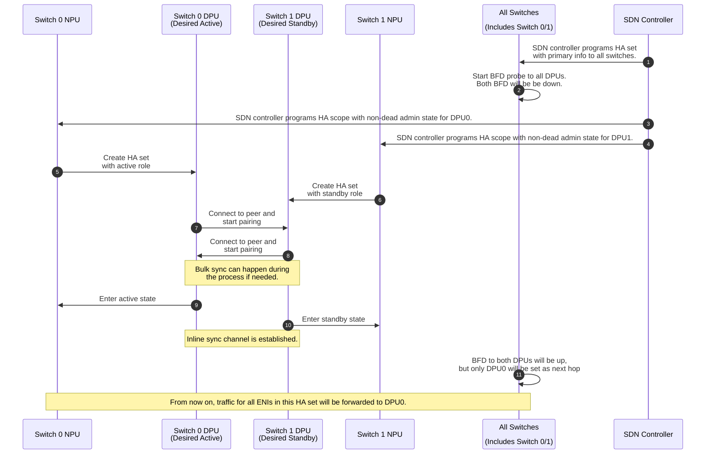
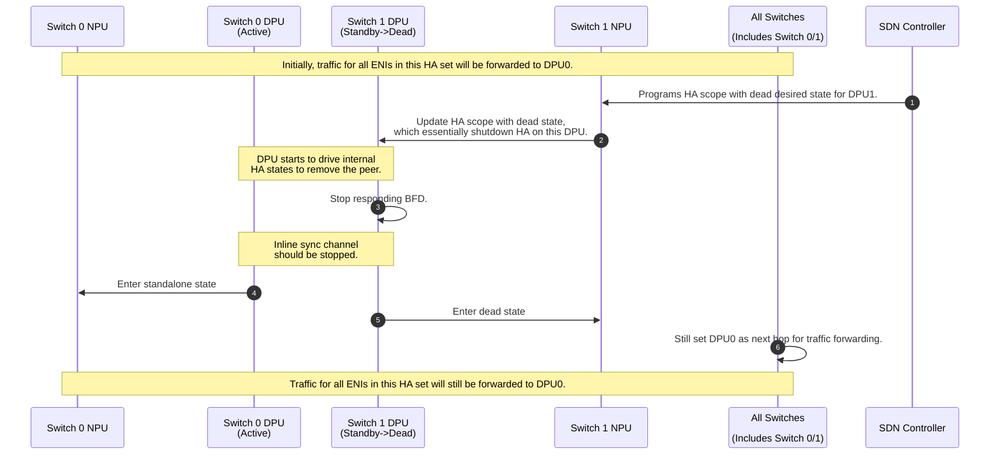
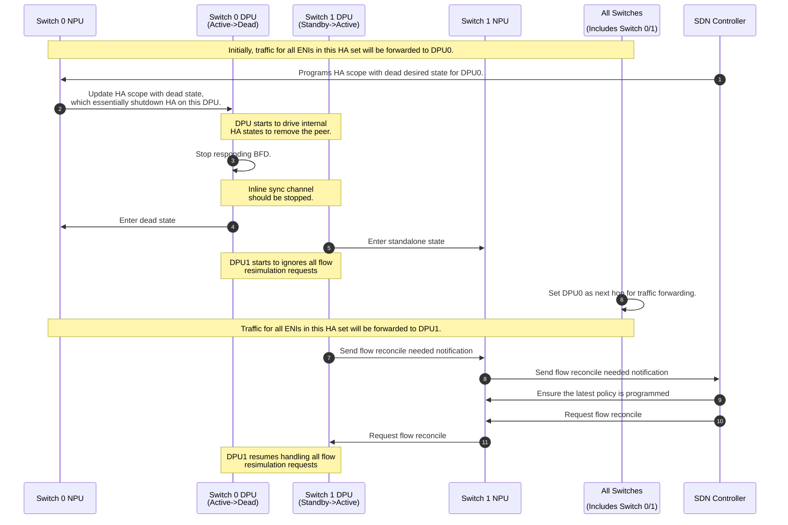
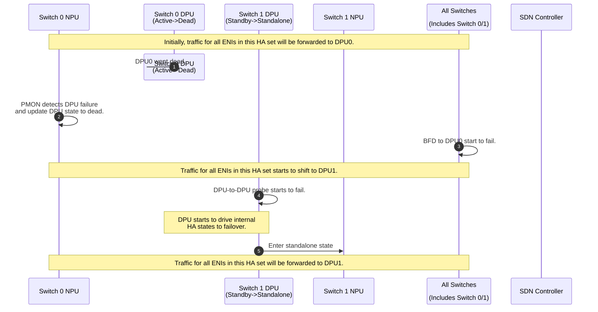

# SmartSwitch High Availability High Level Design - DPU-Scope-DPU-Driven setup

| Rev | Date | Author | Change Description |
| --- | ---- | ------ | ------------------ |
| 0.1 | 02/26/2024 | Riff Jiang | Initial version |

1. [1. Terminology](#1-terminology)
2. [2. Background](#2-background)
3. [3. DPU-Scope-DPU-Driven setup Overview](#3-dpu-scope-dpu-driven-setup-overview)
4. [4. Network Physical Topology](#4-network-physical-topology)
   1. [4.1. DPU-level HA scope](#41-dpu-level-ha-scope)
   2. [4.2. DPU-level NPU to DPU traffic forwarding](#42-dpu-level-npu-to-dpu-traffic-forwarding)
5. [5. ENI programming with HA setup](#5-eni-programming-with-ha-setup)
6. [6. DPU liveness detection](#6-dpu-liveness-detection)
   1. [6.1. Card level NPU-to-DPU liveness probe](#61-card-level-npu-to-dpu-liveness-probe)
   2. [6.2. DPU-to-DPU liveness probe](#62-dpu-to-dpu-liveness-probe)
7. [7. HA state machine management](#7-ha-state-machine-management)
   1. [7.1. HA state](#71-ha-state)
8. [8. Planned operations](#8-planned-operations)
   1. [8.1. HA set creation](#81-ha-set-creation)
   2. [8.2. Planned shutdown](#82-planned-shutdown)
      1. [8.2.1. Shutdown standby DPU](#821-shutdown-standby-dpu)
      2. [8.2.2. Shutdown active DPU](#822-shutdown-active-dpu)
   3. [8.3. Planned switchover](#83-planned-switchover)
   4. [8.4. ENI migration / HA re-pair](#84-eni-migration--ha-re-pair)
9. [9. Unplanned operations](#9-unplanned-operations)
   1. [9.1. Unplanned failover](#91-unplanned-failover)
10. [10. Flow tracking and replication](#10-flow-tracking-and-replication)
11. [11. Detailed design](#11-detailed-design)
12. [12. Test Plan](#12-test-plan)

## 1. Terminology

| Term | Explanation |
| ---- | ----------- |
| HA | High Availability. |
| NPU | Network Processing Unit. |
| DPU | Data Processing Unit. |
| ENI | Elastic Network Interface. |
| SDN | Software Defined Network. |
| VIP | Virtual IP address. |

## 2. Background

This document adds and describes the high level design of `DPU-Scope-DPU-Driven` setup in SmartSwitch High Availability (HA), as an extension to our main SmartSwitch HA design document [here](../smart-switch-ha.md), which describes only how the ENI-level HA works (or how `NPU-Driven-ENI-Scope` setup works).

Many things in this setup will shares the same or very similar approach as the ENI-level HA, hence, this document will focus on the differences and new things that are specific to this setup.

## 3. DPU-Scope-DPU-Driven setup Overview

In SmartSwitch HA design, there are a few key characteristics that defines the high level behavior of HA:

- **HA pairing**: How the ENIs are placed amoung all DPUs to form the HA set?
- **HA owner**: Who drives the HA state machine on behalf of SDN controller?
- **HA scope**: At which level, the HA state machine is managed? This determines how the traffic is forwarded from NPU to DPU.
- **HA mode**: How the DPUs coordinate with each other to achieve HA?

From these characteristics, here is the main differences between `DPU-Scope-DPU-Driven` setup and the `NPU-Driven-ENI-Scope` setup in the main HLD:

| Characteristic | `DPU-Scope-DPU-Driven` setup | ENI-level HA setup |
| -------------- | ------------------------ | ------------ |
| HA pairing | Card-level pairing. | Card-level pairing. |
| HA scope | DPU-level HA scope. | ENI-level HA scope. |
| HA owner | DPU drives the HA state machine. | `hamgrd` in NPU drives HA state machine. |
| HA mode | Active-standby | Active-standby |

## 4. Network Physical Topology

The network physical topology for `DPU-Scope-DPU-Driven` setup will be the same as the ENI-level HA setup, e.g. where the NPU/DPU is placed and wired. The main difference being the HA scope on DPU-level.

This results in the following differences in the network physical topology and the figure below captures the essence of the differences:

### 4.1. DPU-level HA scope

With the HA scoped moved from ENI-level to DPU-level, all ENIs on the active DPU will be treated as active and handles traffic, as the figure shows below:

### 4.2. DPU-level NPU to DPU traffic forwarding

With the DPU-level HA scope, the traffic forwarding from NPU to DPU will be done on DPU level:

- Each DPU pair will use a dedicated VIP for traffic forwarding from NPU to DPU.
- All VIPs for all DPUs in the SmartSwitch will be pre-programmed into the NPU and advertised to the network as a single VIP range (or subnet).
- NPU will setup a route to match the packet on the destination VIP, instead of ACLs to match both the VIP and inner MAC.

The data path and packet format will follow the same as the ENI-level HA setup [as described in the main HA design doc](./smart-switch-ha-hld.md#421-eni-level-npu-to-dpu-traffic-forwarding).

## 5. ENI programming with HA setup

The services and high level architecture that are used in the `DPU-Scope-DPU-Driven` setup will be the same as the ENI-level HA setup, such as, `hamgrd` and etc.

The high level workflow also follows the main HA design doc, more specifically:

- Before programming the ENIs, SDN controller creates the DPU pair by programming the HA set into all the NPUs that receives the traffic. `hamgrd` will get notified and call `swss` to setup all the traffic forwarding rules on NPU as well as send the DPU pair information to the DPU.
- After HA set is programmed, SDN controller can create the ENIs and program all the SDN policies for each ENI independently.

For more details on the contract and design, please refer to the detailed design section.

## 6. DPU liveness detection

In `DPU-Scope-DPU-Driven` setup, `hamgrd` will not drive the HA state machine and DPU will drive the HA at DPU level, hence we don't have the ENI-level traffic control, but the [Card level NPU-to-DPU liveness probe based on BFD](./smart-switch-ha-hld.md#61-card-level-npu-to-dpu-liveness-probe) and [DPU-to-DPU liveness probe](./smart-switch-ha-hld.md#63-dpu-to-dpu-liveness-probe) will still be used.

### 6.1. Card level NPU-to-DPU liveness probe

In `DPU-Scope-DPU-Driven` setup, same as ENI-level HA setup, the BFD probe will:

- Setup on all NPUs for both IPv4 and IPv6 and probe both DPUs.
- Both DPUs will respond the BFD probes, no matter it is active or standby.
- Still only be used for controlling the traffic forwarding behavior from NPU to DPU, and won't be used as the health signal for triggering any failover inside DPU.

Unlike the ENI-level HA setup, BFD probe can work alone to make the traffic forwarding decision without ENI level info. To achieve this, the SDN controller will program the HA set to NPU with the preferred DPU as active/standby setting.

Here is the how the probe works in details (with the DPU0 as preferred DPU):

| DPU0 | DPU1 | Preferred DPU | Next hop | Comment |
| --- | --- | --- | --- | --- |
| Down | Down | DPU0 | DPU0 | Both down is essentially the same as both up, hence effect is the same as Up+Up. |
| Down | Up | DPU0 | DPU1 | NPU will forward all traffic to DPU1, because DPU0 is not reachable. |
| Up | Down | DPU0 | DPU0 | NPU will forward all traffic to DPU0, since DPU0 is preferred and reachable. |
| Up | Up | DPU0 | DPU0 | If both DPU is up, then we respect the preferred DPU. |

For more details on NPU-to-DPU probes,

- The data path and packet format of the BFD probe will be the same as the one defined in the main HA design doc. Please refer to the [Card level NPU-to-DPU liveness probe design](./smart-switch-ha-hld.md#61-card-level-npu-to-dpu-liveness-probe).
- For the detailed design of BFD probe in SmartSwitch, please refer to [SmartSwitch BFD detailed design doc](https://github.com/sonic-net/SONiC/pull/1635).

### 6.2. DPU-to-DPU liveness probe

In `DPU-Scope-DPU-Driven` setup, the DPU-to-DPU liveness probe will still be used as health signal for triggering DPU failover.

However, unlike the ENI-level HA setup, upon DPU-to-DPU probe failure, DPU will drive the HA state machine and failover by itself, without the help of `hamgrd`.

The data path and packet format of the DPU-to-DPU probe will be the same as the one defined in the main HA design doc. Please refer to the [DPU-to-DPU data plane channel design](./smart-switch-ha-hld.md#4352-dpu-to-dpu-data-plane-channel).

## 7. HA state machine management

In `DPU-Scope-DPU-Driven` setup, the HA state machine will be managed by DPU itself, and `hamgrd` will not drive the HA state machine, but only be used for generating the configurations for NPU and DPU, as well as collecting the telemetry and report in the context of HA whenever is needed.

### 7.1. HA state

Since DPU will be driving the HA state machine transition, any HA state change will needs to be reported, otherwise the SDN controller will not be able to know the current HA state of the DPU.

With this setup, all HA states we defined for the ENI-level HA setup can be used to map the undering states, not only `Dead`, `Active`, `Standby` and `Standalone`.

For details on the states and the expected behavior, please refer to the [HA states defined in main HA design doc](./smart-switch-ha-hld.md#71-ha-state-definition-and-behavior).

## 8. Planned operations

There are a few things we need to notice for the planned operations:

- Same as the main HA HLD:
  - Planned operations are always initiated by SDN controller.
  - All HA state changes and counters will be reported from ASIC eventually to SDN controller via gNMI interfaces, hence omitted in the following workflow.
- All operations will be happening on DPU-level, for example, switchover or removing from HA set.
- Since DPU will be driving the HA state machine, `hamgrd` will only be used for passing through the configurations and report the states and telemetry.

Here are how the workflows look like for the typical planned operations:

### 8.1. HA set creation

### 8.2. Planned shutdown

With DPU-driven setup, the shutdown request will be directly forwarded to DPU. `hamgrd` will ***not*** work with each other to make sure the shutdown is done in a safe way.

#### 8.2.1. Shutdown standby DPU

#### 8.2.2. Shutdown active DPU

Shutdown active DPU is very similar to shutdown standby DPU. But after the standby DPU becomes the new active, it will trigger a flow reconcile process which ensures the existing flows on the new active DPU will not go back and use the staled SDN policies.

### 8.3. Planned switchover

In DPU-driven setup, switchover is done via shutdown one side of the DPU, and DPUs pair need to be able to handle the switchover internally.

### 8.4. ENI migration / HA re-pair

## 9. Unplanned operations

### 9.1. Unplanned failover

## 10. Flow tracking and replication

`DPU-Scope-DPU-Driven` setup will not change the flow lifetime is managed and how the inline flow replication works, since they are currently managed by DPU under the SAI APIs already. However, it will change how bulk sync works, as DPU will directly do the bulk sync without going through HA control plane sync channel.

## 11. Detailed design

Please refer to the [detailed design doc](./smart-switch-ha-detailed-design.md) for DB schema, telemetry, SAI API and CLI design.

## 12. Test Plan

Please refer to HA test docs for detailed test bed setup and test case design.
