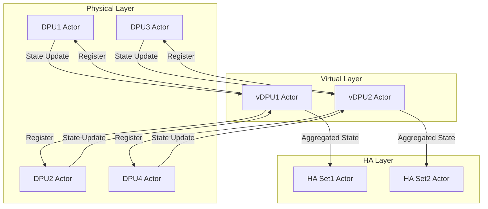
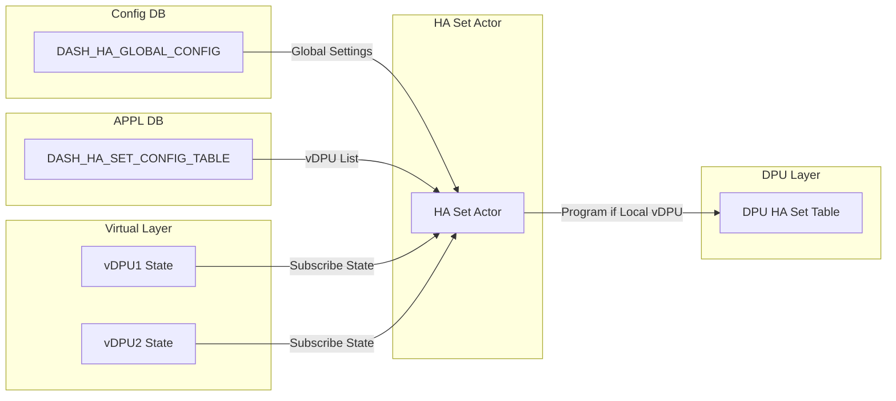
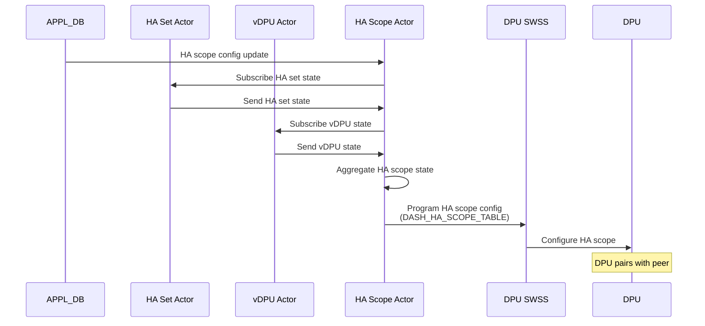

# SmartSwitch High Availability Manager Daemon (HAMgrD) Design

| Rev | Date | Author | Change Description |
| --- | ---- | ------ | ------------------ |
| 0.1 | 2/22/2025 | Riff Jiang | Initial version |

- [1. Overview](#1-overview)
- [2. Key Actors](#2-key-actors)
- [3. HAMgrD actor initialization](#3-hamgrd-actor-initialization)
  - [3.1. Initial actor creation](#31-initial-actor-creation)
  - [3.2. Actor creation/deletion on config update](#32-actor-creationdeletion-on-config-update)
- [4. DPU and vDPU state handling](#4-dpu-and-vdpu-state-handling)
- [5. HA set workflows](#5-ha-set-workflows)
- [6. HA scope workflows](#6-ha-scope-workflows)
  - [6.1. DPU-Driven mode](#61-dpu-driven-mode)
    - [6.1.1. HA scope initialization](#611-ha-scope-initialization)
    - [6.1.2. HA scope update](#612-ha-scope-update)
    - [6.1.3. HA scope deletion](#613-ha-scope-deletion)
  - [6.2. Switch-Driven mode](#62-switch-driven-mode)

## 1. Overview

The High Availability Manager Daemon (HAMgrD) is a core component that manages HA state machines and coordinates failover operations in SmartSwitch. Running in the HA container on the NPU side, its key responsibilities include:

1. **HA State Machine Management**: Drives state transitions and coordinates with peer instances.
2. **Traffic Control**: Programs BFD responders and manages traffic forwarding between NPU/DPUs.
3. **Configuration Management**: Processes SDN controller configs and pushes to NPU/DPUs.
4. **Monitoring and Reporting**: Monitors DPU health and reports HA states/events.
5. **Failure Handling**: Detects and handles failures, coordinates failover operations.

The daemon supports both DPU-driven mode (where it acts mainly as a config/monitoring agent) and NPU-driven mode (where it actively drives HA state machines). And this doc explains the detailed design of the daemon.

For more details, please refer to the [SmartSwitch High Availability HLD](./smart-switch-ha-hld.md) and [SmartSwitch High Availability Detailed Design](./smart-switch-ha-detailed-design.md).

## 2. Key Actors

To simplify the HAMgrD design, we leverage the concept of actor model and build a set of actors to handle different HA related operations. 

Each actors maps to a key concept in the HA design. And they will be communicating with each other via swbus local message bus and save the state in the state DB tables:

| Actor | Description | Actor Resource Path | Config DB Table | State DB Table |
|-------|-------------|---------------------|-----------------|-----------------|
| Global Config | Monitor global HA configurations. | `ha-global/config` | `DASH_HA_GLOBAL_CONFIG_TABLE` | `DASH_HA_GLOBAL_CONFIG_STATE` |
| DPU | Monitor DPU configurations and acting on DPU state changes. | `dpu/<dpu-id>` | `DPU:<dpu-id>` | `DASH_HA_DPU_STATE:<dpu-id>` |
| VDPU | Monitor VDPU configurations and aggregate DPU state changes. | `vdpu/<vdpu-id>` | `VDPU:<vdpu-id>` | `DASH_HA_VDPU_STATE:<vdpu-id>` |
| HA Set | A set of NPUs/DPUs that are managed by the HAMgrD. | `ha-set/<ha-set-id>` | `DASH_HA_SET_CONFIG_TABLE:<ha-set-id>` | `DASH_HA_SET_STATE:<ha-set-id>` |
| HA Scope | The scope to drive the HA state machine, which can contain a single or multiple ENIs. | `ha-scope/<ha-scope-id>` | `DASH_HA_SCOPE_CONFIG_TABLE:<ha-scope-id>` | `DASH_HA_SCOPE_STATE:<ha-scope-id>` |

The relationship of all the actors and tables related to hamgrd are shown as below:

## 3. HAMgrD actor initialization

### 3.1. Initial actor creation

When `hamgrd` starts and before any incoming messages are processed, it will create the set of initial actors based on the tablees in config DB and appl DB, such as global config, dpu, vdpu, ha set, ha scope, etc.

The detailed actor to config db table mapping is shown as the table listed in "Key Actors" section.

### 3.2. Actor creation/deletion on config update

The tables in APPL DB are coming from the SDN controller, which can be created/deleted on the fly. When these tables are updated, the HAMgrD needs to create/delete the corresponding actors.

For example, when a new HA set is created, the HAMgrD will create a new `HA Set` actor for the new HA set.

## 4. DPU and vDPU state handling

In SmartSwitch, the DPUs are models as vDPUs for 
For future-proofing to allow multiple DPUs to form a virtual DPU, we have introduced the concept of vDPU. This means the state management needs to happen at the vDPU level instead of the DPU level.

Hence in HAMgrD, we have the per-DPU actor to handle the state of DPUs and the per-vDPU actor to handle the state of vDPUs:

- When the vDPU actor it will register itself to all the DPUs that related to itself.
- The DPU actor will listen to all the state changes of the physical DPUs, and forward its state to all vDPUs that registered to it.
- When vDPU receives the state update from the DPU actor, it will aggregate the state and update its own state, and sends to all the HA set actors that subscribes its state.

This design allows us to easily support any future vDPU scenarios, since it makes extending the health model of each type of vDPU very easy andindependent of the other components in the system.

## 5. HA set workflows

Since HA set is mostly only used for defining the list of vDPUs that being paired together, its state is mostly static and its workflow is straightforward.

- A HA set actor will subscribe the state of all the vDPUs that are part of the HA set, which is defined in the `DASH_HA_SET_CONFIG_TABLE` table.
- It aggregates all information from the global config and vDPUs to update its own state.
- After information is ready:
  - If the scope is `dpu`, it will setup the DPU level forwarding rule for the HA set.
  - For any vDPU that is local to the current swtich, it programs the DPU side HA set table, so the HA set info can be used by the ENI.

## 6. HA scope workflows

The core logic of HAMgrD lives in the HA scope actor, which is responsible for driving the HA state machine and coordinating with the peer instances.

Since the SmartSwitch HA is designed to support both DPU-driven and switch-driven modes, the HA scope actor will have different workflows depending on the mode.

### 6.1. DPU-Driven mode

In DPU-driven mode, HAMgrD primarily acts as a configuration and monitoring agent during HA scope initialization.

#### 6.1.1. HA scope initialization

Upon receiving HA scope config from SDN controller, HAMgrD:

- Creates HA scope actor and subscribes to HA set state.
- Programs initial scope state (`Role=Active/Standby`, `AdminState=Disabled`).
- Forwards HA scope configuration to DPU side.

#### 6.1.2. HA scope update

After HA scope creation, SDN controller will enables the HA scope, which triggers the following workflows:

- HAMgrD forwards enabled state to DPU
- Monitors DPU state transitions
- Handles role activation requests from DPU
- DPU actor manages BFD responder when DPU reaches final state

More details can be found in [DPU-scope DPU-driven mode doc](./smart-switch-ha-dpu-scope-dpu-driven-setup.md).

#### 6.1.3. HA scope deletion

When the HA scope config is deleted from the APPL DB, the HA scope actor will mark itself as pending deletion, then delete the HA scope in the DPU side. When everything is done, the HA scope actor will be deleted along with its state in the state DB.

### 6.2. Switch-Driven mode

(TBD)
