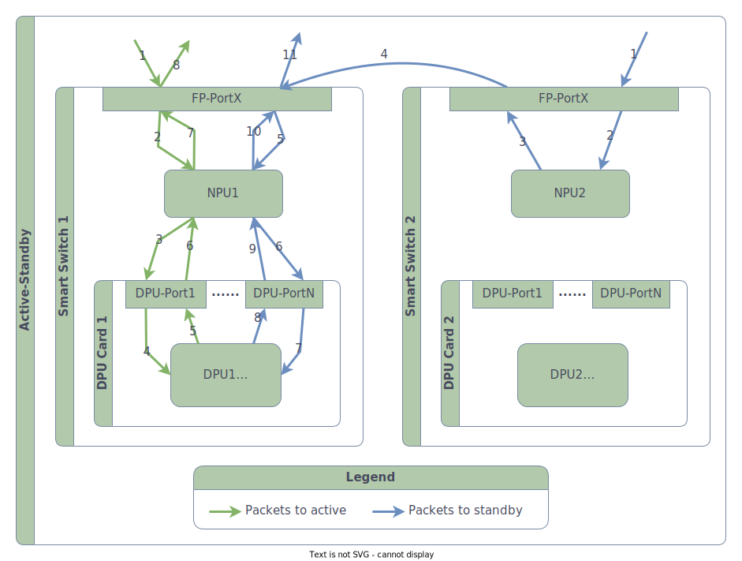
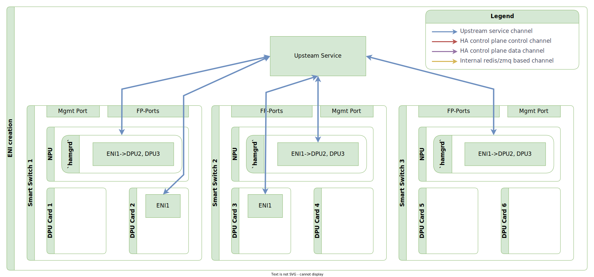
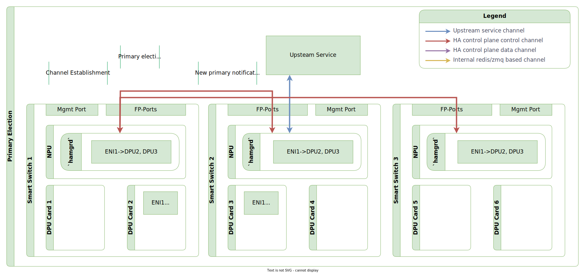

# SmartSwitch High Availability High Level Design

| Rev | Date | Author | Change Description |
| --- | ---- | ------ | ------------------ |
| 0.1 | 08/09/2023 | Riff Jiang | Initial version |
| 0.2 | 08/10/2023 | Riff Jiang | Simpify ENI-level traffic control, primary election algorithm |
| 0.3 | 08/14/2023 | Riff Jiang | Adding DPU level standalone support |
| 0.4 | 08/17/2023 | Riff Jiang | Redesign HA control plane data channel |

1. [1. Background](#1-background)
2. [2. Terminology](#2-terminology)
3. [3. Requirements, Assumptions and SLA](#3-requirements-assumptions-and-sla)
   1. [3.1. Goals](#31-goals)
   2. [3.2. Non-goals](#32-non-goals)
   3. [3.3. Assumptions](#33-assumptions)
4. [4. Network Physical Topology](#4-network-physical-topology)
   1. [4.1. Flow HA](#41-flow-ha)
      1. [4.1.1. Network topology for Flow HA](#411-network-topology-for-flow-ha)
      2. [4.1.2. HA set setup](#412-ha-set-setup)
   2. [4.2. Data path setup](#42-data-path-setup)
      1. [4.2.1. Upstream-to-Switch communication channel](#421-upstream-to-switch-communication-channel)
      2. [4.2.2. NPU-to-DPU traffic forward tunnel](#422-npu-to-dpu-traffic-forward-tunnel)
         1. [4.2.2.1. Tunneling packet to local DPU](#4221-tunneling-packet-to-local-dpu)
         2. [4.2.2.2. Tunneling packet to remote DPU](#4222-tunneling-packet-to-remote-dpu)
         3. [4.2.2.3. Tunneling packet between DPUs](#4223-tunneling-packet-between-dpus)
         4. [4.2.2.4. Put all tunnels together](#4224-put-all-tunnels-together)
      3. [4.2.3. DPU-to-DPU data plane channel](#423-dpu-to-dpu-data-plane-channel)
         1. [4.2.3.1. Data plane channel data path](#4231-data-plane-channel-data-path)
         2. [4.2.3.2. Multi-path data plane channel](#4232-multi-path-data-plane-channel)
         3. [4.2.3.3. (Optional) Multi-path data plane availability tracking](#4233-optional-multi-path-data-plane-availability-tracking)
      4. [4.2.4. VM to DPU data plane](#424-vm-to-dpu-data-plane)
5. [5. ENI programming with HA setup](#5-eni-programming-with-ha-setup)
   1. [5.1. Working with upstream service](#51-working-with-upstream-service)
   2. [5.2. HA control plane overview](#52-ha-control-plane-overview)
      1. [5.2.1. HA control plane components](#521-ha-control-plane-components)
         1. [5.2.1.1. ha containter](#5211-ha-containter)
         2. [5.2.1.2. swbusd](#5212-swbusd)
         3. [5.2.1.3. hamgrd](#5213-hamgrd)
      2. [5.2.2. HA Control Plane Channels](#522-ha-control-plane-channels)
         1. [5.2.2.1. HA control plane control channel](#5221-ha-control-plane-control-channel)
         2. [5.2.2.2. HA control plane data channel](#5222-ha-control-plane-data-channel)
         3. [5.2.2.3. HA control plane channel data path HA](#5223-ha-control-plane-channel-data-path-ha)
   3. [5.3. ENI creation](#53-eni-creation)
   4. [5.4. ENI programming](#54-eni-programming)
   5. [5.5. ENI removal](#55-eni-removal)
6. [6. Resource placement and management](#6-resource-placement-and-management)
   1. [6.1. Card-level ENI pair placement](#61-card-level-eni-pair-placement)
   2. [6.2. ENI-level HA scope](#62-eni-level-ha-scope)
   3. [6.3. ENI update domain (UD) / fault domain (FD) handling](#63-eni-update-domain-ud--fault-domain-fd-handling)
7. [7. DPU liveness detection](#7-dpu-liveness-detection)
   1. [7.1. Card level NPU-to-DPU liveness probe](#71-card-level-npu-to-dpu-liveness-probe)
      1. [7.1.1. BFD support on DPU](#711-bfd-support-on-dpu)
         1. [7.1.1.1. Lite-BFD server](#7111-lite-bfd-server)
         2. [7.1.1.2. BFD initialization on DPU boot](#7112-bfd-initialization-on-dpu-boot)
         3. [7.1.1.3. (Optional) Hardware BFD on DPU](#7113-optional-hardware-bfd-on-dpu)
      2. [7.1.2. BFD probing local DPU](#712-bfd-probing-local-dpu)
      3. [7.1.3. BFD probing remote DPU](#713-bfd-probing-remote-dpu)
   2. [7.2. ENI level NPU-to-DPU traffic control](#72-eni-level-npu-to-dpu-traffic-control)
      1. [7.2.1. Traffic control state update channel](#721-traffic-control-state-update-channel)
      2. [7.2.2. Traffic control mechanism](#722-traffic-control-mechanism)
   3. [7.3. DPU-to-DPU liveness probe](#73-dpu-to-dpu-liveness-probe)
      1. [7.3.1. Card-level and ENI-level data plane failure](#731-card-level-and-eni-level-data-plane-failure)
      2. [7.3.2. ENI-level pipeline failure](#732-eni-level-pipeline-failure)
   4. [7.4. Probe state pinning](#74-probe-state-pinning)
      1. [7.4.1. Pinning BFD probe](#741-pinning-bfd-probe)
      2. [7.4.2. Pinning ENI-level traffic control state](#742-pinning-eni-level-traffic-control-state)
   5. [7.5. All probe states altogether](#75-all-probe-states-altogether)
8. [8. HA state machine](#8-ha-state-machine)
   1. [8.1. HA state definition and behavior](#81-ha-state-definition-and-behavior)
   2. [8.2. State transition](#82-state-transition)
   3. [8.3. Primary election](#83-primary-election)
   4. [8.4. HA state persistence and rehydration](#84-ha-state-persistence-and-rehydration)
9. [9. Planned events](#9-planned-events)
   1. [9.1. Launch](#91-launch)
      1. [9.1.1. Clean launch on both sides](#911-clean-launch-on-both-sides)
      2. [9.1.2. Launch with standalone peer](#912-launch-with-standalone-peer)
      3. [9.1.3. Launch with no peer](#913-launch-with-no-peer)
   2. [9.2. Planned switchover](#92-planned-switchover)
      1. [9.2.1. Workflow](#921-workflow)
      2. [9.2.2. Packet racing during switchover](#922-packet-racing-during-switchover)
      3. [9.2.3. Failure handling during switchover](#923-failure-handling-during-switchover)
   3. [9.3. Planned shutdown](#93-planned-shutdown)
      1. [9.3.1. Planned shutdown standby node](#931-planned-shutdown-standby-node)
      2. [9.3.2. Planned shutdown active node](#932-planned-shutdown-active-node)
   4. [9.4. ENI-level DPU isolation / Standalone pinning](#94-eni-level-dpu-isolation--standalone-pinning)
   5. [9.5. ENI migration](#95-eni-migration)
      1. [9.5.1. Card-level ENI migration](#951-card-level-eni-migration)
      2. [9.5.2. Migrating active ENI](#952-migrating-active-eni)
      3. [9.5.3. Migrating standalone ENI](#953-migrating-standalone-eni)
      4. [9.5.4. Migrating ENI when upstream service cannot reach one side of switches](#954-migrating-eni-when-upstream-service-cannot-reach-one-side-of-switches)
      5. [9.5.5. Moving towards ENI-level ENI migration](#955-moving-towards-eni-level-eni-migration)
10. [10. Unplanned events](#10-unplanned-events)
    1. [10.1. Unplanned network failure](#101-unplanned-network-failure)
       1. [10.1.1. Upstream service channel failure](#1011-upstream-service-channel-failure)
          1. [10.1.1.1. One side switch is not reachable](#10111-one-side-switch-is-not-reachable)
          2. [10.1.1.2. Both side switches are not reachable](#10112-both-side-switches-are-not-reachable)
       2. [10.1.2. HA control plane control channel failure](#1012-ha-control-plane-control-channel-failure)
       3. [10.1.3. HA control plane data channel failure](#1013-ha-control-plane-data-channel-failure)
       4. [10.1.4. Data plane channel failure](#1014-data-plane-channel-failure)
          1. [10.1.4.1. Card level NPU-to-DPU probe failure](#10141-card-level-npu-to-dpu-probe-failure)
          2. [10.1.4.2. Data plane gray failure](#10142-data-plane-gray-failure)
    2. [10.2. Unplanned DPU failure](#102-unplanned-dpu-failure)
       1. [10.2.1. Syncd crash](#1021-syncd-crash)
       2. [10.2.2. DPU hardware failure](#1022-dpu-hardware-failure)
    3. [10.3. Unplanned NPU failure](#103-unplanned-npu-failure)
       1. [10.3.1. hamgrd crash](#1031-hamgrd-crash)
       2. [10.3.2. Switch power down or kernel crash](#1032-switch-power-down-or-kernel-crash)
       3. [10.3.3. Back panel port failure](#1033-back-panel-port-failure)
    4. [10.4. Unplanned PCIe failure](#104-unplanned-pcie-failure)
11. [11. Unplanned operations](#11-unplanned-operations)
    1. [11.1. Working as standalone setup](#111-working-as-standalone-setup)
       1. [11.1.1. Design considerations](#1111-design-considerations)
          1. [11.1.1.1. Standalone setup vs bulk sync](#11111-standalone-setup-vs-bulk-sync)
          2. [11.1.1.2. Card-level vs ENI-level standalone setup](#11112-card-level-vs-eni-level-standalone-setup)
       2. [11.1.2. Workflow triggers](#1112-workflow-triggers)
       3. [11.1.3. Determine desired standalone setup](#1113-determine-desired-standalone-setup)
          1. [11.1.3.1. Determine card-level standalone setup](#11131-determine-card-level-standalone-setup)
          2. [11.1.3.2. Determine ENI-level standalone setup](#11132-determine-eni-level-standalone-setup)
       4. [11.1.4. Entering standalone setup](#1114-entering-standalone-setup)
          1. [11.1.4.1. When peer is up](#11141-when-peer-is-up)
          2. [11.1.4.2. When peer is down](#11142-when-peer-is-down)
       5. [11.1.5. DPU restart in standalone setup](#1115-dpu-restart-in-standalone-setup)
       6. [11.1.6. Recovery from standalone setup](#1116-recovery-from-standalone-setup)
       7. [11.1.7. Force exit standalone (WIP)](#1117-force-exit-standalone-wip)
    2. [11.2. Force shutdown (WIP)](#112-force-shutdown-wip)
12. [12. Flow tracking and replication (Steady State)](#12-flow-tracking-and-replication-steady-state)
    1. [12.1. Flow lifetime management](#121-flow-lifetime-management)
    2. [12.2. Flow replication data path overview](#122-flow-replication-data-path-overview)
       1. [12.2.1. Data plane sync channel data path](#1221-data-plane-sync-channel-data-path)
       2. [12.2.2. Control plane sync channel data path](#1222-control-plane-sync-channel-data-path)
    3. [12.3. Flow creation and initial sync](#123-flow-creation-and-initial-sync)
       1. [12.3.1. Case 1: Flow creation for first packet and initial sync](#1231-case-1-flow-creation-for-first-packet-and-initial-sync)
       2. [12.3.2. Case 2: Flow recreation for non-first packet](#1232-case-2-flow-recreation-for-non-first-packet)
          1. [12.3.2.1. Challenge](#12321-challenge)
          2. [12.3.2.2. Solutions](#12322-solutions)
             1. [12.3.2.2.1. Missing connection-less flow](#123221-missing-connection-less-flow)
             2. [12.3.2.2.2. Missing connection flows](#123222-missing-connection-flows)
    4. [12.4. Flow destroy](#124-flow-destroy)
       1. [12.4.1. Flow destroy on explicit connection close](#1241-flow-destroy-on-explicit-connection-close)
          1. [12.4.1.1. Graceful connection termination with FIN packets](#12411-graceful-connection-termination-with-fin-packets)
          2. [12.4.1.2. Abrupt connection termination with RST packets](#12412-abrupt-connection-termination-with-rst-packets)
       2. [12.4.2. Flow destroy on flow aged out](#1242-flow-destroy-on-flow-aged-out)
       3. [12.4.3. Flow destroy on request](#1243-flow-destroy-on-request)
       4. [12.4.4. RST on flow destroy](#1244-rst-on-flow-destroy)
          1. [12.4.4.1. Send RST when denying packets](#12441-send-rst-when-denying-packets)
          2. [12.4.4.2. Bulk TCP seq syncing during flow aging](#12442-bulk-tcp-seq-syncing-during-flow-aging)
          3. [12.4.4.3. Flow destroy on standby node](#12443-flow-destroy-on-standby-node)
       5. [12.4.5. Packet racing on flow destroy](#1245-packet-racing-on-flow-destroy)
    5. [12.5. Bulk sync](#125-bulk-sync)
       1. [12.5.1. Perfect sync](#1251-perfect-sync)
       2. [12.5.2. Range sync (ENI-level only)](#1252-range-sync-eni-level-only)
          1. [12.5.2.1. Init phase](#12521-init-phase)
          2. [12.5.2.2. Flow tracking in steady state](#12522-flow-tracking-in-steady-state)
          3. [12.5.2.3. Tracking phase](#12523-tracking-phase)
          4. [12.5.2.4. Syncing phase](#12524-syncing-phase)
    6. [12.6. Flow re-simulation support](#126-flow-re-simulation-support)
13. [13. Debuggability](#13-debuggability)
    1. [13.1. System validation (WIP)](#131-system-validation-wip)
       1. [13.1.1. Control plane validation](#1311-control-plane-validation)
          1. [13.1.1.1. ENI leak detection](#13111-eni-leak-detection)
       2. [13.1.2. Data plane validation](#1312-data-plane-validation)
          1. [13.1.2.1. Packet drop logging](#13121-packet-drop-logging)
          2. [13.1.2.2. Flow leak/mismatch detection](#13122-flow-leakmismatch-detection)
    2. [13.2. Telemetry](#132-telemetry)
       1. [13.2.1. HA state](#1321-ha-state)
       2. [13.2.2. HA operations](#1322-ha-operations)
          1. [13.2.2.1. HA operations](#13221-ha-operations)
          2. [13.2.2.2. HA SAI APIs](#13222-ha-sai-apis)
       3. [13.2.3. HA control plane communication channel related](#1323-ha-control-plane-communication-channel-related)
          1. [13.2.3.1. HA control plane control channel counters](#13231-ha-control-plane-control-channel-counters)
          2. [13.2.3.2. HA control plane data channel counters](#13232-ha-control-plane-data-channel-counters)
             1. [13.2.3.2.1. Per DPU counters](#132321-per-dpu-counters)
             2. [13.2.3.2.2. Per ENI counters](#132322-per-eni-counters)
       4. [13.2.4. NPU-to-DPU tunnel related (NPU side)](#1324-npu-to-dpu-tunnel-related-npu-side)
          1. [13.2.4.1. NPU-to-DPU probe status](#13241-npu-to-dpu-probe-status)
          2. [13.2.4.2. NPU-to-DPU traffic control state](#13242-npu-to-dpu-traffic-control-state)
          3. [13.2.4.3. NPU-to-DPU tunnel counters](#13243-npu-to-dpu-tunnel-counters)
       5. [13.2.5. NPU-to-DPU tunnel related (DPU side)](#1325-npu-to-dpu-tunnel-related-dpu-side)
       6. [13.2.6. DPU-to-DPU data plane channel related](#1326-dpu-to-dpu-data-plane-channel-related)
       7. [13.2.7. DPU ENI pipeline related](#1327-dpu-eni-pipeline-related)
14. [14. Test plan (WIP)](#14-test-plan-wip)
15. [15. Detailed Design (WIP)](#15-detailed-design-wip)
    1. [15.1. NPU DB schema](#151-npu-db-schema)
       1. [15.1.1. CONFIG DB](#1511-config-db)
       2. [15.1.2. STATE DB](#1512-state-db)
       3. [15.1.3. COUNTER DB](#1513-counter-db)
    2. [15.2. DPU DB schema](#152-dpu-db-schema)
       1. [15.2.1. STATE DB](#1521-state-db)
       2. [15.2.2. COUNTER DB](#1522-counter-db)
    3. [15.3. Northbound Interface](#153-northbound-interface)
    4. [15.4. SAI APIs](#154-sai-apis)
       1. [15.4.1. HA session APIs](#1541-ha-session-apis)
       2. [15.4.2. Flow APIs](#1542-flow-apis)
    5. [15.5. CLI](#155-cli)

## 1. Background

As the continuation of [Sirius](https://www.usenix.org/conference/nsdi23/presentation/bansal) project, SmartSwitch provides an even more cost-effective and space-saving way for Azure to build SDN solutions, with even lower network latency. However, like all the other network solutions, one of the biggest challenges we need to solve is how to provide a reliable network service.

This doc covers the aspect of High Availability and Scalability for SmartSwitch in the aspects of Requirements / SLA, the network physical topology, ENI allocation/placement, HA state management and transition under each planned or unplanned events, flow replication and more.

## 2. Terminology

| Term | Explanation |
| ---- | ----------- |
| ENI / vNIC / vPort | Elastic Network Interface. It means a VM’s NIC.<br/><https://github.com/sonic-net/DASH/wiki/Glossary#eni> |
| T0/1/2 | Tier 0/1/2 switch. |
| Session | Session represents a network connection between 2 sides of the network, for example, TCP or UDP. |
| Flow | Each session has 2 flows in network – Forwarding flow and reverse flow for process the network packet in both directions. |
| HA | High Availability |
| HA Set | The set of DPUs that involved in providing the high availability for certain HA scope – switch or DPU or ENI. |
| HA Scope | The minimum scope that failover can happen on, for example – entire switch, entire DPU or each ENI. Every HA scope tracks its own active instance, and others being standby.  |
| HA Active | The active instance in the HA set. It is the only instance in the HA set that can decide what the packet transformation we should apply any every new flow. |
| HA Standby | The standby instance in the HA set. It acts like a flow store and never makes any decisions. If any new connections happen to land on the standby instance, it will be either tunneled to the active. |
| DP | Data path. |
| DP VIP | Data path Virtual IP. This is the VIP that SmartSwitch advertises via BGP for attracting traffic.<br/><br/>After enabling SmartSwitch, when VM sends out traffic, it will be encap’ed with the destination IP set to the DP VIP. This makes all the VM traffic coming to our SmartSwitch for packet processing and transformation. |
| Upstream Service | The services that programs ENIs to smart switches, e.g., SDN controller. |
| UD / Update domain | It defines the groups of virtual machines and underlying physical hardware that can be rebooted at the same time. |
| FD / Fault domain | It defines the group of virtual machines that share a common power source and network switch. |
| SPOF | Single point of failure. |
| FP port | Front panel port. The ports on the front panel of the switch. |
| BP port | Back panel port. The ports that connects the NPU and DPU. |

For more terminology, please refer to <https://github.com/sonic-net/DASH/wiki/Glossary>.

## 3. Requirements, Assumptions and SLA

### 3.1. Goals

The goal of the SmartSwitch HA design is trying to achieve the following goals:

1. 0 downtime on planned switchover.
2. <2 sec downtime on failover to standalone setup for each ENI.
3. Ability to resume connections in the event of both planned and unplanned failover.
4. After both planned and unplanned failover and recovery, the flow on all DPUs will be aligned.
5. Only focus on the case, in which only 2 DPUs are in the HA set, although conceptually, we can have more than 2, but it is not in our current scope. 
6. No complicated logic or ECMP hashing requirement in other switches to ensure packets land on right switch and DPU.
7. If switch receives a valid packet, it must not drop it due to flow replication delays.
8. Ensure both inbound and outbound packets transit the same DPU for a given flow.

### 3.2. Non-goals

1. Handling data path failures perfectly is not one of the main goals of HA.
    * Data plane failures can happen and affect our communications between NPU and DPUs, such as link flaps, traffic blackhole, but these issues will impact all traffic, not just smart switch scenarios. They are monitored in other ways and also should be addressed in a more generic way.
    * Of course, when data path failure causes enough heartbeat or probes to be dropped, we will react on the change. But the goal is not providing a mechanism to detect and handle all gray failures due to ECMP setup. In short, if our probe says down, it is a down instead of 16% down.
2. HA is not designed for providing perfect solutions to merge conflicting flows, but only ensures the flows will end up in a consistent state in all DPUs.
    * This can happen in cases, such as switchover or when DPUs lose connection to each other and start to act as standalone. If policies in these DPUs don’t match, flow conflict can happen when later the connection recovers.
    * To resolve the flow conflict, HA will do best effort, but it won’t be able to solve the problem alone. In cases like planned switchovers, our upstream service must coordinate and make sure policies are aligned.
3. More than 2 DPUs participate in a single HA set.

### 3.3. Assumptions

When designing HA for SmartSwitch, we have a few assumptions:

1. Stable decision on packet transformation: The same packet will always implement the same packet transformation as long as the DASH policies stay the same. Changes, such as random port selection, are not allowed in the current pipeline.
2. No delayed flow replication support: In [steady state](#41-flow-ha), when a flow is created, updated or deleted by a network packet, the change ***MUST*** be replicated to its pair by attaching the metadata into the original packet and forwarding the packet. This is called inline flow replication ([more described here](#12-flow-tracking-and-replication-steady-state)). We should never delay the flow replication, and before we receive the ack from the standby side, we should not consider the change is applied.
3. No warm boot support: Warm boot is used to keep the data path continuing to work while upgrade happens. It is mostly used for upgrading switches that being considered as SPOF, as a gentler solution than a hard data plane down. However, it requires complicated coordination between many services on NPU and DPU. Gladly, since HA requires more than 1 switch to participate, we don’t need to worry about SPOF problem, hence we don’t need to consider warm boot support in our design.

## 4. Network Physical Topology

For placement of SmartSwitch, at a high-level, it will be modeled as our Tier-1 switches we have today in Azure, hence no extra physical datacenter floor/tile space is required. And in this document, we will be only focusing on the setup that is related to high availability.

### 4.1. Flow HA

The goal of the Flow HA is to provide high availability for the flows - when one DPU or Switch is down, we won’t lose the flows permanently.

#### 4.1.1. Network topology for Flow HA

Today, the customers' traffic is partitioned into ENIs. And for each ENI:

- We will have multiple DPUs forming a HA set for storing the traffic flows. Today, each HA set will only have 2 DPUs acting as a pair.
- All DPUs in a HA set will be placed within a single Tier 1 set, but each DPU in the HA set will be placed on different T1s to avoid switch level failure killing the whole HA set.
- Within a HA set, only 1 DPU will be serving as active and making decisions, while the other DPU will be serving as standby, only accepting flows that being replicated from the active one. 
- When the active DPU runs into issues, we will failover the active, make the standby the new active, and switch over the traffic to avoid further impact.

<p align="center"></p>

#### 4.1.2. HA set setup

To provide HA functionality, we are going to use Active-Standby setup. In this setup, 1 DPU will act as active and making decisions, while the non-active node will act as a pure backup flow storage.

- When packets land on active DPU and creates a new flow, the new flow will be replicated to the standby DPU inline.
- When packets land on standby side, they will be tunneled to the active DPU by NPU (or DPU as fallback). 

<p align="center"></p>

### 4.2. Data path setup

Besides providing HA for flows, we also need to provide solutions to ensure data path works with HA considered:

1. Ensures having enough redundant links for the traffic to reach its target HA set.
2. Ensures having enough redundant links for the 2 DPUs in the HA set to talk to each other.

And this can be addressed by the ECMP setup in our network, as the "[Network topology for Flow HA](#network-topology-for-flow-ha)" section shows above.


#### 4.2.1. Upstream-to-Switch communication channel

In HA setup, our upstream service will talk to our northbound interface for:

- Programming SDN DASH policies.
- Initiate the planned operation, or unplanned operation which can be destructive.
- Get HA states and receive the HA state reports.
- Setting up the traffic forwarding tunnels.

#### 4.2.2. NPU-to-DPU traffic forward tunnel

This channel is used for tunneling the packet from all T1s that has the traffic forwarding rules to the active side in the HA pair, no matter if it is locally or remotely.

There is a limitation on the traffic forwarding rules, it can only forward the traffic to either local DPU or remote DPU, but never both as an ECMP group. This is caused by the limitation of routes. Therefore, the tunnel will always only have 1 next hop at maximum.

It works as below in high level:

1. The tunneled packets ***MUST*** have an VxLan encap as the outer packet, with a specified NPU tunnel VNI number as identifier.
2. The outer packet ***MUST*** calculate the source port from the 5 tuples of the inner packet and fold it into a port range specified by SONiC.
3. The outer packet ***MUST*** have the same DSCP fields as the inner packet.

The detailed data path is shown below.

##### 4.2.2.1. Tunneling packet to local DPU

<p align="center"></p>

##### 4.2.2.2. Tunneling packet to remote DPU

<p align="center"></p>
 
##### 4.2.2.3. Tunneling packet between DPUs

This tunnel needs to be also implemented by DPU, because in planned or unplanned events, traffic might land on the in non-active side DPU and needs to be tunneled. This is using the same NPU-to-DPU traffic tunnel.
 
<p align="center"></p>

##### 4.2.2.4. Put all tunnels together

Now let’s put all tunnels together. This can happen when the packets land on other switches that help traffic forwarding in the middle of HA state transition.
 
<p align="center"></p>

#### 4.2.3. DPU-to-DPU data plane channel

This channel is implemented below SAI, used by inline flow replication or any other network-triggered inline data sync. Since traffic buffer on switch / DPU is limited, we cannot hold the packet when doing the flow replication, hence data sync between DPUs such as flow replication needs to be done inline.

##### 4.2.3.1. Data plane channel data path

Data plane channel is essentially a UDP-based tunnel between DPUs, used in inline flow replications. Conceptually, it works as below in high-level:

1. The outer packet ***MUST*** use the “DP channel port” specified via SONiC.
2. The outer packet ***MUST*** calculate the source port from the 5 tuples of the inner packet and fold it into a port range specified by SONiC.
3. The outer packet ***MUST*** have the same DSCP fields as the inner packet.
4. Different vendors ***CAN*** have their own definition of metadata format as payload.

Here is an example from "[Flow replication data path overview – Data plane sync data path](#1221-data-plane-sync-channel-data-path)":

<p align="center"></p>

##### 4.2.3.2. Multi-path data plane channel

Since data plane channel is inline, it is very important to make sure whenever gray network failure happens (traffic being blackholed partially), we should avoid causing the traffic for the entire ENI to be dropped.

To provide HA for DPU-to-DPU communication, we can also leverage our ECMP network setup. When sending the tunneled packet, we must calculate the source port from the 5 tuples of the inner packet and fold it into a port range specified by SONiC. This helps us to spread the packets across all possible paths and avoid the blackhole problem.

##### 4.2.3.3. (Optional) Multi-path data plane availability tracking

Multi-path communication is great, but it also introduces gray failures. For example, flow replication fails 10% of the time instead of 100% of time. 

To help us further avoid link problems, DPUs could track the failures of each possible path and avoid using it when it is possible. This can be done by using actively probing (see "[DPU-to-DPU liveness probe](#73-dpu-to-dpu-liveness-probe)") or tracking the reachability of each data path by checking the response of data plane channel requests, e.g. flow replication.

And here is an example of possible implementation based-on source port rotation that can be considered:

1. Since data plane channel packet has VxLan encap as outermost header, and network routes the packet by outermost header too, the data path entropy is determined only by the source port of the outermost packet (protocol, destination IP/port, source IP are all determined already).
2. To leverage ECMP setup, a range of source ports will be specified for us to use in the VxLan encap. Each flow can pick up a source port from this range, by hashing the 5-tuple of the inner packet.
3. The flow replication packet will be sent out with the selected source port in outermost packet, as well as in the metadata. And on the other side, the ack packet can use the same source port too. This binds the packets for this flow to a single data path.
4. If one of the links went down, all the packets with certain source ports will start to fail. Hence, if we could track the failure for each port in the pool, we can avoid using it.
5. DPU-to-DPU probe should also use the same ports in the range, in order to detect the data path problem. This also helps us to determine whether a specific data path is recovered, and we can resume using this port again.

#### 4.2.4. VM to DPU data plane

Again, it is very important to avoid completely killing the VM’s connectivity if one link is blackholing traffic. Hence, when VM sends traffic to DPU, we should also make it leverage ECMP setup.

When VM sends packet out, the packet will be encap’ed by VxLan (see below). Hence, similar to DPU-to-DPU data plane channel, we can also set the VxLan source port by calculating the hash of the inner packet. Then, different flow will go through different data path to reach the SmartSwitch.

<p align="center"></p>

## 5. ENI programming with HA setup

After HA is enabled, instead of programming a single DPU for a single ENI, now we have to program 2 DPUs for a single ENI, so we need to define the behavior of SmartSwitch and its upstream service with HA setup.

### 5.1. Working with upstream service

In SmartSwitch, upstream service and switches will work together on providing the HA features.

The responsibility of these 2 things is defined as below (HA-related only):
1. Upstream service is responsible for:
    1. Deciding ENI placement and pairing.
    2. Deciding preferred active ENI placement.
    3. Triggering HA operations under planned events, such as planned switchover, planned shutdown for upgrades, evening traffic and etc.
    4. Triggering HA operations for manual live site mitigations.
2. SmartSwitch is responsible for:
    1. Driving the HA state machine transitions.
    2. Report every ENI HA state change and reasons, so upstream service knows what is happening and can make decisions for planned events.
    3. Handle HA related requests from upstream service.
    4. Monitor and handle unplanned events, and trigger defined mitigations, such as driving to standalone setup.

> It is very important to enable SmartSwitch to drive the HA state machine transition on its own. Under unplanned events such as network failures, we could lose connectivity to upstream service. If we could not drive the state machines or make decisions, we would lose the ability to handle the failures.

### 5.2. HA control plane overview

Here is the overview of HA control plane, and we will walk through the components and communication channels in the following sections.

<p align="center"></p>

#### 5.2.1. HA control plane components

##### 5.2.1.1. ha containter

To support HA, we will need to add new programs that communicates between multiple smart switches, manages the HA state machine transition or syncing other data, such as flow info. These programs will be running in a new container called `ha`.

This container will be running on NPU side, so when DPU is down, we can still drive the HA state machine transition properly and notify our upstream service about any state change.

##### 5.2.1.2. swbusd

`swbusd` is used for establish the connections between each switches:

- `swbusd` will be running in the `ha` container.
- `swbusd` will be responsible for establishing the HA control plane control channel and data channel between each switches.
- `swbusd` will be responsible for running a gRPC server to receive and route the requests coming `hamgrd` to the right switch.
- `swbusd` will be responsible for running a gRPC server to receive flow info from DPU ASIC or ARM cores directly, and route the flow info to the right switch.

##### 5.2.1.3. hamgrd

`hamgrd` is used to manage the HA state machine and state transition:

- `hamgrd` will be running in the `ha` container.
- `hamgrd` will communicate with:
    - Redis for:
        - Learning HA related setups, such as peer info, which switches will be involved in forwarding traffic.
        - Receive the config updates from upstream service, so we can initiate HA operations for planned events or live site mitigations, such as switchover.
        - Notify swss control things like, BFD probes, ENI traffic forwarding, etc.
    - gNMI agent for sending state changed notifications, such as HA state changed notifications.
    - Syncd on DPUs for calling SAI APIs to help HA state transition.

#### 5.2.2. HA Control Plane Channels

There are 2 channels in HA control plane:

- **Control Plane Control Channel** (Red channel above): This channel is used for transferring HA control messages, e.g. messages related to HA state machine transition. This channel can be implemented by gRPC.
- **Control Plane Data Channel** (Purple channel above): This channel is used for doing heavy data transfer between DPUs, such as bulk sync. This channel can also be done by gRPC.

##### 5.2.2.1. HA control plane control channel

The control plane control channel is used for each DPU to talk to each other for things like state machine management. Implementation-wise, we will need a new service for HA communication and management.

Having our own control channel is important. If we consider the switches as data plane and our upstream services as control plane, then data plane should be able to operate on its own, when control plane is disconnected. For example, when upstream service is down due to network problem or other reasons, we should still be able to react and adjust our services. Coupling smart switch with our upstream service in HA state machine transition can cause us fail to react to [unplanned events](#10-unplanned-events).

The DPU state machine management will run on NPU. Since each NPU manages multiple DPUs, all NPUs need to connect to all other NPUs, which forms a full mesh.

The data path of this channel will look like below:

<p align="center"></p>

Since DPU events are still coming from the DPU side SAI/syncd, we will need to pass these events to the NPU side via our internal service communication channel, which goes through the PCIe bus (see [HA control plane overview](#52-ha-control-plane-overview) for more details).

##### 5.2.2.2. HA control plane data channel

The data channel is used for transferring large chunks of data between DPUs, e.g. [flow bulk sync](#125-bulk-sync). Since control messages and data sync are going through different channels, this helps us avoid head-of-queue blocking for control messages, which ensures the HA control plane and state machine transition is always responsive.

Because we expect large chunks of data being transferred, this channel is designed to:

- Avoid using PCIe bus.
- Minimize the overhead on DPU, due to limited compute resource on DPU.

The data channel is designed to have 2 parts: from DPU ASIC / ARM core to `swbusd` and from `swbusd` to other `swbusd`. This channel is established with the steps below:

- During DPU initialization, SONiC will get how many channels are needed for bulk sync via SAI API.
- Once the number is returned, it will be forwarded to local `swbusd` along with its pairing information to establish the data channels between `swbusd`.
- When bulk sync starts,
  - SONiC will call get flow SAI API with all channel information passed as SAI attributes, such as gRPC server addresses.
  - DPU will send the flow info directly to `swbusd` and being forwarded to its paired DPU. 
  - The flow info format will be defined publicly as part of the SAI APIs, so we can also directly call the SAI APIs to get the flow info as well.

##### 5.2.2.3. HA control plane channel data path HA

Although it might be counter-intuitive, we could consider that we can always get a working connection within a bounded time for all HA control plane channels. This is achieved by leveraging our ECMP setup on T1s.

The approach is simply brute force: as long as we have tried enough number of connections with different source port, we can get the channel recovered.

This approach works because with our current setup, it is extremely unlikely that 2 switches cannot communicate with each other. 

- If the possibility of 1 link failing is P, and we have N possible links between each T1, then the possibility of 2 switches failing talk to each other will be $(2p – p^2)^{N}$. 
- Let's say, the down time of each link within the year is 1% and we have 10 links, then the possibility will be $(0.01 - 0.0001)^{10} = 0.0199^{10} = 9.73 * 10^{-18}$. This equals to $3*10^{-10}$ second downtime per year.

Additionally, to reduce the time of finding a good path and meet our SLA requirement, we could also try to use multiple different source port to establish the new connection in parallel, and choose whichever one that works first.

To summarize, as long as the peer switch NPU is running, with this approach, we can basically consider we always can get a working connection to our peer, which can be used to simplify our design.

### 5.3. ENI creation

First, we need to create the ENI in all DPUs:

1. Upstream service will first decide where to put the new ENI and form the HA set, based on the load and other information.
2. Upstream service calls northbound interface and programs the following things on each SmartSwitch independently:
    1. Create the ENI on selected DPUs with its peer information, so we can form a HA set.
        1. This will make the 2 ENIs start to connect to each other as preparation. 
        1. Upstream service can create the ENI with a preferred active setting, so when ENIs are launched for the first time, the active one will be created on that side. This allows us to distribute the ENIs evenly on the paired DPUs. See "Primary election".
    2. Program traffic forwarding rules to all the switches that will receive the traffic.
        1. This will make all the `hamgrd` connect to the `hamgrd` that own the ENI and register the probe listener.
        1. Whenever a probe listener is registered, the latest probe state will be pushed to make it in sync.
        1. If the probe listener is lost, it should be either the traffic forwarding rules are removed or `hamgrd` is crashed. For the former case, there won’t be any problem. For the latter case, please see "[`hamgrd` crash](#1031-ha-agent-crash)" section on how to handle it.
    
    <p align="center"></p>
3. Once programming is finished, ENIs will start forming the HA pair automatically:
    1. The ENI level control plane channels will be created.
    2. The 2 DPUs will start to communicate with each other via the control plane control channel, elect the primary and form a HA set automatically.
4. Once the new primary is elected, SmartSwitch will notify the upstream service that the primary is selected.
    1. The primary may or may not be the preferred one, because in cases like "[ENI migration](#95-eni-migration)", the peer ENI might be already running in standalone state. In this case, the new ENI has to be launched as standby. However, we can issue "[Planned Switchover](#92-planned-switchover)" later, if we want to shift the primary.
    
    <p align="center"></p>
5. In the meantime, the primary election process will also update the probe state of all ENIs, making sure the traffic is forwarded to the right DPU.
    
    <p align="center"></p>


### 5.4. ENI programming

Programming ENI follows the same rule as ENI creation – Upstream service programs each ENI independently via our northbound interface.

<p align="center"></p>

### 5.5. ENI removal

ENI removal works in similar way as ENI programming. In HA setup, every ENI exists in multiple DPUs. Since our upstream knows where all the ENIs are allocated on the switches, it can send the request down to all related switches to remove the ENI via our northbound interface.

1. Upstream service first program all switches to remove the traffic forwarding rules to stop the traffic.
2. Upstream service then programs the 2 DPUs to remove the ENIs.

If we decide to remove only a single ENI instead of pair, it is very important to avoid data path impact as much as possible. In this case, we can use "[Planned Shutdown](#93-planned-shutdown)" to pin the traffic to the other side before removing the ENI.

## 6. Resource placement and management

As each ENI will have 2 instances forming a pair, when for properly handling the different failures and defining the impact radius, we need to make the resource allocation strategy clear.

From a high level, the ENI placement is completely decided by our upstream service. SmartSwitch is not involved in the decision-making process at all.

### 6.1. Card-level ENI pair placement

The first question is how we organize or group each ENI. This is critical for defining the impact radius. Currently, we are going with card level pairing. 

- Whenever we want to move the ENI, all ENIs on the card will always be moved together. (See "[ENI migration](#95-eni-migration)" for more details.)
- When one card fails, all ENIs on that card will failover to the paired card.
- Different DPUs on the same switch can be paired with any other DPU on any other switches.

This allows us to spread the load to all switches. And taking down a switch will not cause traffic to be shifted to another single switch, as it can be spread on multiple DPUs in the T1 set.

To clarify on ENI pair placement a bit more, here are a few rules that always apply no matter how we place the pairs:

- ENI pair placement doesn’t affect the physical network topology for each ENI:
    - Each ENI will still be served by a pair of DPUs, which shares the same DP VIP for getting the traffic for this ENI.
    - One of the DPUs will be active one handling the traffic for the ENI, and the flow will be replicated to the other one as standby.
    - No matter how we group and allocate the ENIs, they don’t necessarily share the same DP VIP. As long as the traffic forwarding rule is currently setup, the data plane will work.
- It doesn’t affect the HA failover scope, which is on ENI level. Please see "[ENI-level HA scope](#62-eni-level-ha-scope)" section below.

<p align="center"></p>

### 6.2. ENI-level HA scope

Within the HA set today, we have 1 active and 1 standby. The active makes decisions on how we forward the packet for each flow, while standby acts as backup flow store that only receives flow replication traffic.

When the active is having issues or whenever traffic load is extremely unbalanced or other reasons, we can fail over the active to avoid any impact in data path. This operation can be triggered automatically or manually – e.g., upgrade, DPU failure or moving the traffic load for a single ENI, so we need to have the scope defined to make the impact radius clear.

HA scope defines: at which level, we will support primary election and failover. And currently, we will be doing ENI level HA. 

With this option, failover always happens on the ENI level:

- Each ENI tracks its own active instance.
- When failover happens, we only move the active for that single ENI to the standby. 

This setup will be very flexiable and allow us to support VM update domain and fault domain when needed.

<p align="center"></p>

### 6.3. ENI update domain (UD) / fault domain (FD) handling

Many customer tenants have restrictions on how many nodes can be impacted when upgrade or impact happens. Today in Azure, this is controlled by update domain and fault domain (see "[Availability set overview](https://learn.microsoft.com/en-us/azure/virtual-machines/availability-set-overview)" doc). 

- Update domain defines the groups of virtual machines and underlying physical hardware that can be rebooted at the same time.
- Fault domain defines the group of virtual machines that share a common power source and network switch.

Since SmartSwitch is a shared network service, one single DPU could host multiple ENIs from the same UD or FD. Hence, we need to define this behavior to define our impact radius. And this will require our upstream service to fetch the UD and FD info and take them into consideration when placing the ENIs.

## 7. DPU liveness detection

In order to implement HA, the first setup is to tell if a DPU is up or down. This is determined by 2 different ways below.

The target of liveness detection is to determine the DPU state, and we are not trying to detect and handle the gray network failures here. In short, if our probe says down, it is a down, instead of 16% down (see "[Requirements, Assumption and SLA](#3-requirements-assumptions-and-sla)").

To determine the DPU state, we are using 3 approaches:

1. **Card level NPU-to-DPU liveness probe**: Detect if a DPU is reachable from a switch or not. The minimum scope of this probe is card level, so it can only control the traffic for the entire card. If this probe is up, NPU will be ***allowed*** to forward traffic to this card, otherwise, NPU will stop forwarding traffic to all ENIs on that card.
2. **ENI level NPU-to-DPU probe report**: This report is using the control channel to report its liveness status to all the switches that advertises the DP VIP and involved in traffic forwarding. 
3. **DPU-to-DPU liveness probe**: Detects gray network failure between DPUs. It can be on card-level or ENI-level. Whenever this probe fails or failure rate above certain level, we will start to consider the peer is dead and drive into standalone mode.

### 7.1. Card level NPU-to-DPU liveness probe

Today, we will use BFD sessions to probe the local and remote DPU in SmartSwitch.
BFD is already supported by SONiC and can be offloaded to switch ASIC. After we setup the BFD sessions, switch ASIC will generate BFD packet to local or remote DPUs to test if the DPUs are live or not.

To control this probe behavior, we have 3 configurations:
- The interval between each probes.
- How many probes succeed continuously, we probe it up?
- How many probes fail continuously, we probe it down?

And here are the details on how the card level probe controls the traffic:

| DPU0 | DPU1 | Is forwarding to DPU0 allowed? | Is forwarding to DPU1 allowed? | Comments |
| --- | --- | --- | --- | --- |
| Down | Down | Yes | Yes | Both down is essentially the same as both up, hence effect is the same as Up+Up. |
| Down | Up | No | Yes | NPU will forward all traffic to DPU1, even when the ENI’s active runs on DPU0. |
| Up | Down | Yes | No | NPU will forward all traffic to DPU0, even when the ENI’s active runs on DPU1. |
| Up | Up | Yes | Yes | Respect the ENI-level traffic control (active-standby). |

#### 7.1.1. BFD support on DPU

Currently, BFD is running as part of FRR in BGP container. However, in DPU, we will not run the FRR/BGP stack, hence we don’t have anything on DPU side to support BFD today.

To make BFD work, the practical and memory/space saving way is to implement a light-weighted BFD server on DPU.

This approach allows us to reflect the true DPU liveness. DPU is running doesn’t mean the programs we run on DPU are ready to take traffic, e.g. in standby state. And having a custom implemented BFD server can help us better control the traffic.

##### 7.1.1.1. Lite-BFD server

The lite-BFD server will be a standalone program running on DPU. It will be responsible for:

##### 7.1.1.2. BFD initialization on DPU boot

During DPU boot and initialization, certain parts of the DPU packet processing pipeline might not be fully running, while our programs are already launched. If we start BFD session at this moment, packets might be coming and getting dropped. 

To reflect the true liveness, we will postpone the BFD session setup after SAI create switch is done. And SAI create switch should make sure every component in the system is fully running.

Additionally, if any parts are broken, they will be reported via SAI. Once we receive the notification, we will shut down all ENIs on that card and BFD sessions as well.

##### 7.1.1.3. (Optional) Hardware BFD on DPU

It would be also recommended to make DPU support BFD hardware offload. This will make the BFD more stable in cases of service crash and etc.

#### 7.1.2. BFD probing local DPU

Probing local DPU is straightforward, we can directly set up the BFD session in NPU. The data path will be looking like below:

<p align="center"></p>

#### 7.1.3. BFD probing remote DPU

We wiil use multi-hop BFD to probe the remote DPU with certain changes in NPU.

In order to make it work, we need the DPU IP to be advertised in the network, so that we can directly send BFD packet to it. With this, the data path will be looking like below:

<p align="center"></p>

### 7.2. ENI level NPU-to-DPU traffic control

Since we need to support failing over each ENI independently, we need to have a mechanism for managing the probe state at ENI level. However, the BFD session is running at card level, and we cannot control the traffic at ENI level.

#### 7.2.1. Traffic control state update channel

Because of the network setup for achieving data path HA, all T1s will need to know which DPU we should forward the traffic to. Hence, even we somehow make BFD working on ENI-level, we will end up creating more BFD sessions than we can offload to hardware.

To solve this problem, we need to use a new way for controlling the per ENI traffic forwarding behavior: Instead of sending probes, all ENIs broadcast its state to all T1s for traffic control.

To ensure HA state machine can operate on its own, even when upstream service is disconnected, we created the [HA control plane control channel](#5221-ha-control-plane-control-channel), which enables the DPU sending states to its peer DPU. Hence, we can use this channel directly to control the state.

The traffic control state update workflow works briefly as below:

1. Our upstream service decides which T1s are involved for receiving traffic and forming the HA set.
2. Our upstream service updates all involved T1s with the DP VIP, its related ENIs and NPU/DPU info in the HA set. This makes the T1s creating all the initial NPU traffic forwarding routes, as well as setting up the control plane control channel and registering for state update notification properly.
3. Once probe update notification is registered, the latest probe decision will be pushed over as initial reconcile.
4. Whenever we need to change the probe during the HA transition, we use this channel to talk with other side and sync the probe across.

#### 7.2.2. Traffic control mechanism

Since currently only the active side handles the traffic in steady state, the ENI-level traffic control simply works as a route setting up the next hop for the ENI.

The traffic control state update mechanism is really simple. It works as the last up wins - whenever an ENI reports itself as the latest next hop, we start to use it from then, and shift the traffic to it.

### 7.3. DPU-to-DPU liveness probe

The purpose of DPU-to-DPU liveness probe is to find gray failures in the system. Currently, gray failures can happen in 2 ways:

- **Data path failure**: Some links are dropping traffic and how can we avoid these links.
- **ENI pipeline failure**: Pipeline for certain ENI is failing, but not all.

#### 7.3.1. Card-level and ENI-level data plane failure

To detect data plane failure, there are 2 things we should do:
1. Have counters on how many flow replication packets are dropped overall and for each ENI.
2. Send probe packet, so we can detect data path gray failure actively.
    1. The probe packet should have source port rotated.
    1. The failure count should be tracked on both card-level and ENI-level, so we can use it to detect data path being fully broken.

When failures are detected by these 2 things, we will start drive the ENI into standalone mode.

Furthermore, we could also consider tracking the data path availability for each link/source port independently and avoid the bad path actively. Please see "[Multi-path data plane availability tracking](#42322-optional-multi-path-data-plane-availability-tracking)" for more information. But this is totally optional, as we stated in our "[Requirements, Assumptions and SLA]()", handling data path gray failure is nice to have, but it is not one of our main goal. 

#### 7.3.2. ENI-level pipeline failure

The hard problem is how to really detect gray failure with generic probe mechanism.

- If it is for detecting hardware failure, it can and should be monitored by hardware monitors.
- If it is for detecting if hardware is booted and really to use, delaying BFD responses to create switch and hardware BFD can both handle it well (see "[BFD support on DPU](#711-bfd-support-on-dpu)" section).
- If it is for detecting certain scenario failing, we don’t have enough knowledge to build the required packets to make sure it exercises the expected policies and assert the expected final transformation. Hence, having a scenario-based probing service will be a better solution.

Hence, to summarize, we are skipping designing ENI-level pipeline probe here.

### 7.4. Probe state pinning

For each ENI, besides probing and handling the probe state update, we can also choose to pin the probe state to whatever state we like and use it as our final state. This is mostly designed for failure handling, where we want to force the packet to go to a certain place.

Since we have 2 probes to control the traffic – card level and ENI-level, we need to support pinning both probe states in case of needed by HA state transition or manual live-site mitigation.

The underlying mechanism for both types of probes are working in similar way:

- Pinning a probe state will not stop the underlying probe mechanism from running. The original probe state will still be updated, whenever it is changed.
- Whenever a pinned probe exists, we will always honor the pinned probe state. However, due to certain limitations, the detailed effect of pinned probe state will be slightly different. Please see the sub-sections below.

#### 7.4.1. Pinning BFD probe

When a BFD probe state is pinned, it will control the traffic for the entire switch or card, depends on HA scope.

- If pinned to up, it will allow the traffic of its owning ENI being forwarded.
- If pinned to down, it will stop all traffic of its owning being forwarded.

The detailed effects of probe pinning are listed below.

| Original probe state | Pinned probe state | Final probe state |
| --- | --- | --- |
| Down | None | Down |
| Up | None | Up |
| Down | Up | Up |
| Up | Up | Up |
| Down | Down | Down |
| Up | Down | Down |

A few things to note:

- BFD probe is a big hummer. It only controls on a higher level. ENI-level probe will still be honored when forwarding traffic. Hence, the traffic will only be forward, when both BFD probe and ENI-level probe are up.
- It is ok for both cards to be pinned as up, because it will allow the traffic to be forwarded to either side but won’t force the traffic to be forwarded to both sides.

#### 7.4.2. Pinning ENI-level traffic control state

Since ENI-level traffic control works differently from card level BFD probes, the ENI-level probe pinning also works differently - Instead of allowing the pinning both sides to certain state independently, we limit the pin to only 3 cases: None, DPU1 or DPU2. Whenever pin exists, we honor the pin instead of original state.

The detailed effects are listed as below:

| Next hop | Pinned next hop | Final next hop |
| --- | --- | --- |
| None | None | None |
| DPU1 | None | DPU1 |
| DPU2 | None | DPU2 |
| None | DPU1 | DPU1 |
| DPU1 | DPU1 | DPU1 |
| DPU2 | DPU1 | DPU1 |
| None | DPU2 | DPU2 |
| DPU2 | DPU2 | DPU2 |
| DPU1 | DPU2 | DPU2 |

### 7.5. All probe states altogether

Now, level put all probe states together and see how the next hop gets decided:

1. If the incoming packet is already having the NPU tunnel encap, skip the process and forward as it is.
2. Check the card level probe states for both DPUs. If pinned state exists, use pinned state and continue checking below.
3. If we have only one side card level probe state is up, forward the packet to this side. Otherwise continue.
4. Do ENI lookup from the packet and get the ENI-level probe state.
5. If ENI-level probe state is pinned, forward the packet to the pinned DPU.
6. If we have only one side ENI-level probed up, forward the packet to this side.
7. If both are up, forward the packet to the last updated one.
8. Otherwise (both are down), drop the packet.

In real implementation, we could consider pre-calculating certain decisions, such as ENI-level next hop.

## 8. HA state machine

Since switch and DPU can be restarted and ENIs can be created/moved/destroyed, for each HA scope, i.e. ENI, we will need to manage its states during its lifecycle. 

Again – the goals of the HA design are:

- Providing a failover plan with only 2 instances in a HA set, forming a HA pair. If there are more than 2 instances, we will need a more complicated state machine or underlying mechanism to work.
- At the end of each planned or unplanned event w/ recovery, the flows in all HA participants are matched. 
- Stale flow can be created due to policy being not up to date. It is the responsibility of the upstream services to make sure the policy in all DPUs are up to date and aligned to avoid stale / conflicting flows from being created.

> In this section, we will have a lot of graphs showing how "Term" is changed during the state transitions. For what is term and how it affects flow replication, please refer to  "[Primary election](#83-primary-election)" and "[Range sync](#1252-range-sync)" sections for more explanation.

### 8.1. HA state definition and behavior

Here are all the states that each HA participants will go through to help us achieve HA. Their definition and behavior are listed as below.

| State | Definition | Receive traffic from NPU? | Make decision? | Old flow handling? | Respond flow sync? | Init flow sync? | Init Bulk sync? | Comment |
| --- | --- | --- | --- | --- | --- | --- | --- | --- |
| Dead | HA participant is just getting created, and not connected yet. | No | Drop | Drop | No | No | No |  |
| Connecting | Connecting to its peer. | No | Drop | Drop | No | No | No |  |
| Connected | Connected to its peer, but starting primary election to join the HA set. | No | Drop | Drop | No | No | No |  |
| InitializingToActive | Connected to pair for the first time, voted to be active. | No | Drop | Drop | No | No | No | We have to drop the packet at this moment, because we need to ensure the peer is ready to respond the flow replication traffic, otherwise the traffic will be dropped. |
| InitializingToStandby | Connected to pair for the first time, voted to be standby. | No | Tunneled to pair | Tunneled to pair | Yes | No | No | It needs to wait until existing flows to be replicated before going to the next state. |
| Destroying | Preparing to be destroyed. Waiting for existing traffic to drain out. | No | Tunneled to pair | Tunneled to pair | No | No | No | Wait for traffic to drain and doesn’t take any new traffic load. |
| Active | Connected to pair and act as decision maker. | Yes | Yes | Yes | No | Yes | Yes |  |
| Standby | Connected to pair and act as backup flow store. | No | Tunneled to pair | Tunneled to pair | Yes | No | No | |
| Standalone | Heartbeat to pair is lost. Acting like a standalone setup. | Yes | Yes | Yes | Yes | No | No | Acting like the peer doesn’t exist, hence skip all data syncs. <br/><br/>However, the peer can be still connected, because in certain failure cases, we have to drive the DPU to standalone mode for mitigation. |
| SwitchingToActive | Connected and preparing to switch over to active. | No | Yes | Yes | Yes | Yes | No | SwitchingToActive state is a transient state to help old active moving to standby, hence it accepts flow sync from old active, as well as making decision and sync flow back, when old active moved to standby.<br/><br/>Bulk sync is not used in SwitchOver at all. |
| SwitchingToStandby | Connected, leaving active state and preparing to become standby. | Yes | Tunneled to pair | Tunneled to pair | Yes | No | No | SwitchingToStandby is a transient state to help new active moving from SwitchingToActive state to active state. It is identical to standby except responding NPU probe to tunneling traffic. This is needed to make sure we always only have 1 decider at any moment during the transition.<br/><br/>Bulk sync is not used in SwitchOver at all. |

Here are the definitions of the columns above:

- **Receive traffic from NPU**: ENI level NPU-to-DPU traffic control state. If yes, we will set this DPU as the next hop for the ENI, so NPU will forwarding traffic to it.
- **Make decision**: Will this DPU create new flows for new connections (not found in flow table, including both syn/non-syn cases, see "[Flow creation and initial sync](#123-flow-creation-and-initial-sync)" section)
- **Old flow handling**: When packets of existing flow arrive to this DPU, what will the DPU do?
- **Respond flow sync**: Will this DPU accept flow replication request from its paired DPU?
- **Init flow sync**: Will this DPU send replicate flow request to its paired DPU when new flow is created?
- **Init bulk sync**: Will this DPU start bulk sync in this state?

### 8.2. State transition

The state transition graph is shown as below:

<p align="center"></p>

### 8.3. Primary election

When 2 DPUs reconnect to each other, they will need to decide which one should be the active side. 

The key idea is to find the DPU that lives the longest and knows the most on the historical flow changes. To do it, we introduce a concept called "Term":

1. In the beginning or steady state, both DPUs will have the same set of flows, as all flows will be inline sync’ed. Hence, the 2 DPUs will have the same term.
2. If a DPUs can make flow decision, but it cannot inline sync to its peer anymore, their flow data will start to diverge, and at this moment, we move to the next term.
3. Whenever the inline sync channel can be established again, the flow data will stop diverging, so we can move to next term and resume the inline sync.
4. Hence, whenever the term is larger, it means this node knows more about the flow history, and it should be preferred.

With this idea, the implementation becomes really simple – we only need to compare the term. However, we might have some cases where we prefer the active on one side for better traffic distribution or might end up with situations with both sides having the same term. Hence, to make the algorithm more practical, we add a few more things in the primary election algorithm. 

The key variables are shown as below:

- **Term** (Int, Default = 0): The term of the ENI. It changes in 2 cases:
  - Increases whenever the ENI establishes or loses inline sync channel with its peer, while it can make flow decision.
  - Match to active side, when we are back to stable state – Active-Standby pair.
- **CurrentState** (Enum): The current HA state of the ENI. This is to avoid comparing with ENIs before Connected state.
- **DesiredState** (Enum): When both sides are in the same term, set the active to the preferred side. The initial value comes from the ENI configuration.
- **RetryCount** (Int, Default = 0): How many times we have retried. This is to avoid retrying forever.

Hence, when receiving a `RequestVote` message, our primary election algorithm works as below:

1. If ENI is not found:
   1. If `RetryCount` is smaller than a specified threshold, respond `RetryLater`.
   2. Otherwise, respond `BecomeStandalone`.
2. If `DesiredState` is `Standalone` (pinned), respond `RetryLater`.
3. If ENI is running in `Active` state, continue to be active and respond `BecomeStandby`.
4. If both `CurrentState` and `DesiredState` are `Dead`, or `CurrentState` is `Destroying`, respond `BecomeStandalone`.
5. If `CurrentState` is `Dead` or `Connecting`:
   1. If `RetryCount` is smaller than a specified threshold, respond `RetryLater`.
   2. Otherwise, respond `BecomeStandalone`.
6. If our `Term` is higher, respond `BecomeStandby` to other side. If our `Term` is smaller, then respond `BecomeActive`. Otherwise, continue.
7. If `DesiredState` is set to `Active`, while not on the other side, respond `BecomeStandby`. If set on the other side, but not locally respond `BecomeActive`. Otherwise continue (could be both set or not set).
8. Return `RetryLater`. If RetryCount is larger than certain threshold, fire alerts, because our upstream is not updating the ENI config properly.

### 8.4. HA state persistence and rehydration

Since `hamgrd` could crash in the middle of the HA state transition and lose all its in-memory state, we need to persist the HA state, whenever it is changed and provide a way to rehydrate it back.

This is done by 2 key things:
1. All states that is related to HA state machine transition will be saved to Redis, whenever it is changed. This includes: per-ENI current HA state and cached peer state, etc.
2. All actions that we do during state transition are idempotent. For examples,
    - **Move the current state to a specific state**: If we repeat this action, it won’t have any effect.
    - **Update all probe state to Up or Down**: If we repeat this action, we will get the same result.
    - **RequestVote**: If we win or lose the vote previously, we shall win or lose the vote now, as long as the peer is not crashed.
    - **Start bulk sync**: If we start it again, we should either get a in-progress response or start a new one, if previous one is done.
    - **Bulk sync done**: This action is usually equivalent to "Update state to Standby". If we are already in standby, then no-op.
    - **SwitchOver/ShutdownStandby**: If we are already in next state, then the operation will be a no-op.
    - ...

This makes the state being rehydratable. Once we move the state into certain state, we can update redis to make sure it is persistent, then invoke whatever actions we want and move on. If we crashed, then we can read the states back from redis and retry all actions safely.

During rehydration, we also need to check the current config of ENI, to ensure it is not removed.

## 9. Planned events

### 9.1. Launch

After a new HA participant is being created, e.g. ENI, we need to make it join the existing HA set, getting existing flows from its peer and start taking traffic. 

#### 9.1.1. Clean launch on both sides

For clean launch, it starts with our upstream service creating the ENIs on the DPUs. Please see the "[ENI creation](#53-eni-creation)" section for more information.

Once ENIs are created, they will start the clean launch process:

<p align="center"></p>

1. Both DPUs will start with `Dead` state. 
2. During launch, they will move to `Connecting` state and start to connect to its peer. 
3. Once connected, they will start to send `RequestVote` to its peer with its own information, such as Term, to start Primary election process. This will decide which of them will become Active or Standby.
4. Say, DPU0 will become active. Then, DPU0 will start to move to `InitializingToActive` state, while its peer moves to `InitializingToStandby` state.
5. Once DPU0 receives `HAStateChanged` event and knows DPU1 is ready, DPU0 will:
    1. Move to `Active` state. This will cause ENI traffic forwarding rule to be updated, and make the traffic start to flow.
    2. Send back `BulkSyncDone` event, since there is nothing to sync.
6. Once received `BulkSyncDone` event, DPU1 will move to `Standby` state. DPU1 will also receive `HAStateChanged` event from DPU0, which updates the Term from 0 to 1.

To summarize the workflow, here is the sequence diagram:


#### 9.1.2. Launch with standalone peer

While ENI is created, its peer might be already created and running. This can happen in multiple cases, such as recovering from planned/unplanned failure or ENI being moved from 1 switch to another.

Once created, the new ENI will go through similar steps as above and join the HA set/pair. Say, DPU1 is one trying to start:

<p align="center"></p>

1. DPU1 will start as `Dead` state as initial state, then move to `Connecting` state and start to connect to its HA pair.
2. After successfully connected to its peer, the new node will move to `Connected` state and send out `RequestVote` message to its peer to start primary election (see "[Primary Election](#83-primary-election)" for detailed algorithm).
3. The primary election response will move the new node to `InitializingToStandby` state.
    - Using `RequestVote` method is trying to make the launch process simple, because the pair could also be doing a clean start, so we are not determined to become standby, but also might become the active.
    - If the DPU0 is pinned to standalone state, we can reject the `RequestVote` message with retry later.
4. DPU1 sends `HAStateChanged` event to DPU0, so DPU0 knows DPU1 is ready. Then it moves to `Active` state, which will,
    1. Start replicating flows inline.
    2. Start bulk sync to replicate all old flows.
    3. Move to next term, because the flow replication channel is re-established.
5. When entering `Active` state, DPU0 will also send out `HAStateChanged` event to sync the term across, but DPU1 should save this update and postpone it until it moves to standby state. This is to ensure all previous flow is copied over. After bulk sync is done, DPU0 will send `BulkSyncDone` event to DPU1 to move DPU1 to `Standby`.

To summarize the workflow, here is the sequence diagram:


#### 9.1.3. Launch with no peer

However, when the DPU is launching or ENI being created, its peer might not exist due to not being created yet or crashed not recovered yet (If peer ENI is running, we will be able to connect to it).

In this case, we will go through the same checks as we handle the unplanned events and drive the new ENI to standalone state.

The detailed steps are shown below:

<p align="center"></p>

1. After DPU1 moved to Connecting state, it will keep retry to establish the control channel. If network is having trouble, we might have some intermediate failure, but it will soon be addressed due to our ECMP network setup.
2. Since DPU0 is dead, it will return BecomeStandalone with reason PeerDead or PeerNotFound to DPU1.
3. DPU1 will directly move its state to Standalone and move its term to next term.

To summarize the workflow, here is the sequence diagram:


Afterwards, when DPU0 comes back, it will launch again, following the sequence of "[Launch with standalone peer](#912-launch-with-standalone-peer)" as above.

### 9.2. Planned switchover

Planned switchovers are usually done for reasons like maintenance. 

With the planned switchover, we are trying to achieve the following goals:

1. Close to zero loss and to coordinate between the active and standby to achieve this goal (see "[Requirements, Assumption and SLA](#3-requirements-assumptions-and-sla)" section).
2. Avoid extra flow merge during and after switchover, which includes:
    1. Only 1 instance takes traffic and makes flow decisions at any moment during the entire switchover.
    1. Avoid using bulk sync for any flow replication. During the transition, all flow should be replicated inline.

#### 9.2.1. Workflow

Planned switchover starts from a standby node, because in order to avoid flow loss, we need to make sure we have 1 valid standby node that works. And here are the main steps:

1.	Upstream service set standby (DPU1) desired state to `Active` and current Active (DPU0) to `None` to initiate switchover.

    <p align="center"></p>

    To ensure we know which config is the latest one, due to 2 ENIs are programmed independently, the HA config should have a version number, which is increased whenever the config is changed. And the upstream service should set the desired state to `Active` with the latest version number.

2.	Switch 1 detects desired state not matching and updates its state to trigger gNMI notification to upstream service for requesting switching over. Upstream service sets the approved switchover id after ensuring the policy matches and pausing future policy updates.

    <p align="center"></p>

    This extra step here is also used when we [recover from standalone setup](#1055-recovery-from-standalone-setup).

3.	DPU1 moves to `SwitchingToActive` state and send `SwitchOver` to DPU0 (active). 

    <p align="center"></p>

    We cannot move DPU1 directly to `Active` state and need `SwitchingToActive` state to help us doing the transition, because DPU0 doesn’t accept flow replication, because it is still running in `Active` state.

    To ensure we always have 1 decision maker at all times, the `SwitchingToActive` state will:

    1. Support making decisions and handling traffic.
    1. Set ENI probe to down, but wait for the other side giving up active state and tunnel the traffic across. 
    1. Accepts flow replication request, because the other side is still running at active state and replicate flow.

    If DPU0 is not in `Active` state or also have desired state set to `Active`, it will reject the `SwitchOver` request, which moves DPU1 back to `Standby`. And later on, DPU1 will retry the switchover again.

4.	Once switch 1 receives approval, DPU0 moves itself to `SwitchingToStandby` state and notifies DPU1 that it is ready with `HAStateChanged`.

    <p align="center"></p>

    We cannot directly transit to `Standby` state directly, because it will set ENI probe to down on both sides and drop all traffic.

    In `SwitchingToStandby` state, DPU will:
    1. Continue to respond to NPU probe, so traffic still being sent to it.
    1. Stop making decision and tunnel all traffic to the pair, no matter it is new flow or existing flow.

    Hence, although the traffic can land on both DPUs, there is only 1 decision maker – DPU1.

5. After DPU1 receives `HAStateChanged` event from DPU0, it drives itself to Active state and notifies DPU0 back with `HAStateChanged`.

    <p align="center"></p>

    This will probe DPU1 up on both NPUs. And due to the last-win rule, all traffic will be forwarded to DPU1. 

6. At last, the old active DPU0 drives itself to `Standby` state. This probes the DPU0 down on both NPUs. All traffic will be kept on DPU1, as NextHop is not changed.

    <p align="center"></p>

To make the workflow more clear, here we summarize the workflow again in sequence diagram as below:


#### 9.2.2. Packet racing during switchover

Although we have ensure that there will be only 1 flow decider at all time, from state machine point of view. In practice, there still could be some packet racing during the switchover, because flow replication packet delay caused by flow insertion latency and network latency.


This case will mostly happen on UDP traffic or other connection-less traffic, because TCP traffic will go through handshake which usually won't run this into problem.

To avoid this issue causing problems, during switchover we will do 2 things below:

1. In the case above, the flow replication packet will be dropped, because the flow is already created on DPU1. This prevents the flow being created on DPU0 and solves this problem.
2. In switchover step 2 above, we will request approval from our upstream service, which will ensure both DPU runs same set of policy and stop future policy programming until switchover is finished. This helps us ensure the flows that created on both sides are identical, if it happens due to bugs and etc. (see [stable decision assumption](#33-assumptions))

This helps us to avoid conflicting / stale flows being created during the switchover.

#### 9.2.3. Failure handling during switchover

During switchover, both NPU and DPU liveness detection are still running in the background. If any node died in the middle, instead of rolling states back, we would start unplanned event workflow right away by driving the HA pair into Standalone setup. 

See discussions for [unplanned events](#10-unplanned-events) below.

### 9.3. Planned shutdown

Planned shutdown is usually used for maintenance purposes, like upgrade. Same as planned switchover, we aim to have close to zero traffic loss (see "[Requirements, Assumption and SLA](#3-requirements-assumptions-and-sla)" section).

#### 9.3.1. Planned shutdown standby node

Because each ENI is programmed independently with our northbound interface, the request will start from the standby side. However, when planned shutdown standby node, we need to make sure the current active works, so we need to ask the active node to initiate the shutdown process.

1. Upstream service update standby (DPU1) desired state to `Dead`.

    <p align="center"></p>

2. Standby (DPU1) sends `RequestShutdown` message to current active (DPU0) to initiate the shutdown process.

    <p align="center"></p>

    If DPU0 is not in `Active` state, it will reject the `RequestShutdown` and DPU1 will retry later.

3. If DPU0 is in `Active` state, it will move to `Standalone` state, stop flow replication to avoid later data path impact due to flow replication packet drop, and send `ShutdownStandby` message to DPU1.

    <p align="center"></p>

4. DPU1 can now move to `Destroying` state. In `Destroying` state, the DPU will wait for existing flow replication traffic to drain.

    Since DPU1 state is changed, it will still send back `HAStateChanged` message, but the message will not trigger any action.

    <p align="center"></p>

    If standby side is stuck and timed out responding `ShutdownStandby` message, we could be running as "Standalone-Standby" pair, which has no data path impact as well. And the standby side can be forced shutdown afterwards as unplanned.

5. Once all flow replication traffic are drained, move to dead state, so it will not restart launching unless being explicitly moved back to Connecting state to restart launch process.

    <p align="center"></p>

To make the workflow more clear, here we summarize the workflow again in sequence diagram as below:


#### 9.3.2. Planned shutdown active node

To shutdown active node, the most important thing is to make sure the new active node will be running properly. Hence, this can be split into 2 steps:

1. Switchover the current active to the desired active node. (See "[Planned switchover](#92-planned-switchover)" for detailed workflow)
2. Shutdown the old active node, which is running as standby now. (See "[Planned shutdown standby node](#931-planned-shutdown-standby-node)" for detailed workflow).

### 9.4. ENI-level DPU isolation / Standalone pinning

If we suspect an ENI pipeline is not working right and it is caused by unknown DPU hardware/software problem, we could try to isolate this DPU for this ENI. This can be achieved by 2 steps:

1. Use [Planned Switchover](#92-planned-switchover) to move the active to the other DPU.
2. Set active node desired state to `Standalone` to drive this ENI into standalone setup.

    <p align="center"></p>
 
3. To recover, upstream service set the standalone node desired state back to `Active` to remove the pinning.

    <p align="center"></p>

### 9.5. ENI migration

There are a few cases which need us to move the ENI from one DPU to another. For example,

- When doing upgrades, sometimes unfortunately, we might upgrade both DPUs for the same ENI at the same time.
- Moving ENI due to capacity reasons.
- When upstream service lost connection to one side of the switches and like to establish a new pair somewhere else.

#### 9.5.1. Card-level ENI migration

ENI migration is limited to ENI pair placement – with card-level ENI pair placement, we can only migrate all ENIs on the card together. 

ENI migration can be done in 3 steps:

1. Remove all the ENIs on the DPU that we don’t want anymore (See "[ENI removal](#55-eni-removal)"), which will update the traffic forwarding rules and move its peer to Standalone state.
2. Update the standalone ENIs with the latest peer info, so it will start connecting to the new peer, which doesn’t exist yet.
3. Create all the removed ENIs on the new DPU with the peer info pointing to the standalone ENIs. This will make them form a new pair again (see "[ENI creation](#53-eni-creation)") and get new traffic forwarding rule setup too.

#### 9.5.2. Migrating active ENI

Migrating active ENI directly will cause data path impact and should be avoided as much as possible. Please try to use "[Planned Switchover](#92-planned-switchover)" workflow to move the active away before removing it.

#### 9.5.3. Migrating standalone ENI

If an ENI is running in standalone state, it means something unplanned is already happening, removing the ENI will definitely cause flow loss and data path impact. Hence, by default, this operation should be rejected.

If we really like to do it, e.g. manual operation for live site mitigation, we shall start the workflow with explicit force flag (in upstream service), so we can avoid unexpected requests.

#### 9.5.4. Migrating ENI when upstream service cannot reach one side of switches

This action should be rejected. Because each ENI is programmed independently, if we cannot reach one side of switches, we won't be able to remove the ENI on that side and leads to ENI leak.

#### 9.5.5. Moving towards ENI-level ENI migration

In certain cases, we will have to migrate some ENIs on a DPU to another, for example - if the traffic goes to a single HA set becomes way too high, we have to move some ENIs to another HA set to balance the traffic. However, this is not supported with today's design.

Essentially, this requires us to use ENI level pair placement, which will require the ENI-level bulk sync being supported.

## 10. Unplanned events

In unplanned events, network interruption will be unavoidable, and we are aiming to react and recover within 2 seconds (see "[Requirements, Assumption and SLA](#3-requirements-assumptions-and-sla)" section).

All unplanned events **MUST** be monitored and fire alerts when it last for long time. The auto mitigations we are applying here is to minimize the impact of unplanned events per our best effort, but it might be perfect. Also, this will not solve the underlying problem, so in these events, we need manual confirmation and interventions anyway.

### 10.1. Unplanned network failure

Unplanned network failure can happen at any moment. This type of events is usually caused by link flap or wrong configuration causing traffic being blackholed for certain amount of time.

From our data path setup, unplanned network failure can happen in several different ways:

1. Upstream service channel failure.
2. HA control plane control channel failure.
3. HA control plane data channel failure.
4. Data plane channel failure.

Hence, we need solutions to handle all these types of failures.

> When network failure happens, it can be a gray failure, which means certain path might be blackholing traffic, but not all. The main goal of HA is not detecting and handling the gray failures as gray failures, which should be monitored and handled in a generic way. So when failure happens and bad enough to kill our probe, we will consider it a complete failure.

#### 10.1.1. Upstream service channel failure

When this happens, our upstream service might not be able to talk to either side or both side of the switch.

In our HA design, although our upstream service controls what is the desired state for HA, but the HA state machine transitions are all driven by the HA control plane within our switches. Hence, when upstream service is lost, we can still react to any type of unplanned failures own our own. This minimizes the impact of upstream service failure.

This is very important, otherwise whenever failure happens and kills upstream service, all switches will be stuck in the last state and cannot recover from it. The only thing we could do will be firing alerts and wait for manual mitigation.

More discussions on each case are placed below.

##### 10.1.1.1. One side switch is not reachable

If only one side switch is not reachable, we won’t be able to send the latest policy to it. This will eventually build up enough difference between the latest policy and the ones that run on the switch and cause live site to happen.

Whenever our upstream service detected this issue, we can [pin the reachable side to standalone](#94-eni-level-dpu-isolation--standalone-pinning) as mitigation. And since the policy doesn't match on both sides, we assume the reachable side should have a newer policy, hence flow resimulation should be triggered to make sure the flow actions are up to date.

##### 10.1.1.2. Both side switches are not reachable 

Since switch HA management is decoupled with upstream service, switches will automatically move to standalone state, if they cannot talk to each other. Hence, data path will continue to work, although policies cannot be updated anymore.

The good news is that the policy on both sides will not be updated in this case, hence if we are lucky and both sides run the same set of policies, we will at least stay consistent to react to any other type of failures.

If this lasts for long time, fire alert, so we can see how to get the connectivity back.

#### 10.1.2. HA control plane control channel failure

If the control channel is down, the HA pair will not be able to share the states or properly drive the state machine on the peer.

Whenever this happens, it can be caused by 2 reasons: network failure or peer NPU/DPU going down. Here we only cover the network failure case as steps listed below:

- Keep the state as it is without change, because all intermediate states in planned events can be considered as working state due to 0 loss requirements. 
- Recover the control channel as what we described in "[HA control plane channel data path HA](#5223-ha-control-plane-channel-data-path-ha)" section above.
- Once recovered, we move on the state machine transitions.

For the case of DPU going down, it is covered by "[Unplanned DPU failure](#102-unplanned-dpu-failure)" section, and entire switch failure will be covered by "[Unplanned NPU failure](#103-unplanned-npu-failure)" section.

#### 10.1.3. HA control plane data channel failure

If data channel is down, the 2 DPUs will not be able to run bulk sync.

Since bulk sync is fairly rare, we can delay the reaction:

1. Keep retry connecting to other side without driving the HA states, until control channel also went down or somehow we went to standalone state.
2. When we want to drive the HA state out of standalone state, we can check if data channel is alive or not. If not, we consider we are not ready for exiting standalone, and postpone any HA transition until it recovers.

This also needs to be monitored. If it cannot recover by rotating the ports, something weird must be happening, and we should fire alerts for it.

#### 10.1.4. Data plane channel failure

##### 10.1.4.1. Card level NPU-to-DPU probe failure

The card level NPU-to-DPU probe only controls which DPU PA the NPU will use to forward the traffic. And we will not use it to trigger the HA state machine update.

This probe is mostly used for determining if the NPU (no matter if it owns the DPU) can reach the wanted DPU directly or not. And if the DPU cannot reached, it will send traffic to the other one, which will tunnel the traffic to the right one again.

The detailed mechanism is described in "[Card level NPU-to-DPU liveness probe](#71-card-level-npu-to-dpu-liveness-probe)" and "[All probe state altogether](#75-all-probe-states-altogether)" sections. The detailed data path is described in "[NPU-to-DPU traffic forward tunnel](#422-npu-to-dpu-traffic-forward-tunnel)" section.

##### 10.1.4.2. Data plane gray failure

When data plan channel failure occurs, it is very important to avoid making a gray failure becoming 100% down. See "[Data Plane Channel data path HA](#4232-data-plane-channel)" for more information.

Furthermore, we can monitor 2 things:

1. How many packets are lost in the data plane, e.g. flow replication request ack miss rate (1 - ack packet count / (request packet count + ack packet count))?
2. How large is the DPU-to-DPU data plane probe failure rate? 

If these 2 rates are larger than certain threshold, we can start to [drive the DPU to standalone setup](#111-working-as-standalone-setup), avoiding unnecessary packet drop.

### 10.2. Unplanned DPU failure

Unplanned DPU failure, such as shutdown, crash or even power failure, can happen on one of the DPU or Switch at any time. In this case, all states could be lost, and things might start from clean.

Same as other unplanned events, network interruption will be unavoidable, and we are aiming to react and recover within 2 seconds (see "[Requirements, Assumption and SLA](#3-requirements-assumptions-and-sla)" section).

#### 10.2.1. Syncd crash

When syncd on DPU crashes, from HA perspective, the impact would be:

- `hamgrd` will fail to connect to syncd. If it lasts long, it will look like a DPU hardware failure or PCIe bus failure. 
- `hamgrd` cannot invoke SAI APIs for initiating bulk sync or receive SAI notifications for bulk sync being done.

However, when this happens, we will ***NOT*** drive the HA pair into standalone setup, but keep the HA pair running as is, and wait for syncd to recover.

When syncd recovers, all SAI objects will be redriven by syncd, which recovers all SAI objects we programmed, such as bulk sync session, HA state machine state and etc. During the syncd crash, no new policies can be programmed, but this should not cause any flow to be dropped.

To differentiate from the cases of DPU having hardware failure or PCIe bus went down, we will check the signals from pmon, such as DPU state, PCIe status or other hardware monitor status.

#### 10.2.2. DPU hardware failure

When a DPU dies, it could kill both active and standby ENIs. In both cases, the network interruption will still be unavoidable:

- When standby ENIs die, although it doesn’t directly serve the traffic, some flow replication packets will still be lost and there is no way to get them back (we don’t store packets in active side). 
- When active ENIs die, some packets will be dropped for sure until the traffic being shifted to the other side.

To detect this issue, we will use 2 ways:

1. For local DPU, NPU will receive DPU status change as critical events from pmon.
2. For peer DPU, we will receive SAI notification about peer lost, and we can also use SAI API to check DPU-to-DPU probe state or data path availability to confirm.

Once detected, we will start to [drive the HA pair into standalone setup](#111-working-as-standalone-setup). The recovery path in this case will be the same as launch. Please see "[Launch](#91-launch)" section for more details.

### 10.3. Unplanned NPU failure

Besides failures on DPU, NPU could also run into certain problems.

#### 10.3.1. hamgrd crash

Whenever `hamgrd` crashes, 2 things will happen:

1. HA state machine transition will stop.
2. Both card-level probe state and ENI level traffic control state update will stop, which will stop us from shifting traffic from one DPU to another during HA state transition.

Problem 1 will be handled by the mechanism we described in "[HA state persistence and rehydration](#84-ha-state-persistence-and-rehydration)" section. And we will focus on problem 2 here.

To solve problem 2, we have 2 mechanisms:

1. **DPU packet tunneling**: Once an ENI is connected to its peer and knows peer is also ready, all HA states is defined to either handle the traffic directly or tunnelling the traffic to its peer via NPU-to-DPU traffic forward tunnel. If the packet happens to be sent to the wrong side, it will be forwarded to the right side by DPU.
2. **DP VIP range BGP withdraw**: We will also withdraw all DP VIPs routes, so the traffic will so shifts to other switches and get forwarded to the right side directly.

With these 2 mechanisms, as long as we have 1 switch working, the traffic will be forwarded correctly. 

For detailed data path, please see "[NPU-to-DPU traffic forward tunnel – Put all tunnels together](#4234-put-all-tunnels-together)" section.

#### 10.3.2. Switch power down or kernel crash

When switch completely goes down, all DPUs on this switch go down with it. This will show up and handled in the same way as "[DPU hardware failure](#1022-dpu-hardware-failure)". The good side will receive peer lost SAI notification, which drives the HA set into standalone setup.

#### 10.3.3. Back panel port failure

This could be caused by hardware problem or certain configuration problem kills the port. Today, this will be one of a few SPOFs in the current setup, since we only have 1 port connected to each DPU.

Whenever this failure happens:

- Both HA data channel and data plane channel will stop working, as they all go through the back panel ports. This will cause peer lost SAI notification happen.
- HA control channel will be still working, and `hamgrd` can still talk to syncd.
- Port/serdes will be monitored by pmon on DPU side. Depending on how the monitor is implemented, we will see this failure soon and use it as signal to react on it.

To mitigate this issue, we can:

1. Trigger alerts, so we can be aware of this issue and RMA the switch.
2. Switchover all active ENIs to the other side, then [pin them to Standalone state](#94-eni-level-dpu-isolation--standalone-pinning).

### 10.4. Unplanned PCIe failure

When PCIe fails, we will not be able to talk to the local DPUs from NPU. This will be detected by pmon.

PCIe should be really hard to fail. And whenever it fails, it could be something serious happening on hardware. So, to mitigate this, we will treat this as DPU hard down and force the DPU to be powered off, then handle it as [DPU hardware failure](#1022-dpu-hardware-failure).

## 11. Unplanned operations

### 11.1. Working as standalone setup

The standalone setup is used whenever we only have one side of DPU running or we detect large data path impact. Once we move a DPU into standalone state, it will stop flow replication, which reduces the chance the packet lands on bad links and getting dropped.

#### 11.1.1. Design considerations

The standalone setup is designed with the following considerations and principles:

1. A ENI ***MUST*** only be served by a single DPU, just like Active-Standby setup. 
   - If both DPUs run as Standalone-Standalone pair, the incoming and outgoing traffic might land on 2 different DPUs. Since both DPU can make flow decisions, we will create unexpected flows and causing packet to be dropped.
2. Standalone setup is a best-effort mitigation. When network is dropping packet, no matter what we do, we will never be able to avoid the impact perfectly. We can only try to reduce the network hops to reduce the chance of packet drop.
3. Automated actions ***MUST*** be safe, otherwise it will cause more damage than good. If something we cannot handle automatically, we will fire alerts and wait for manual mitigation.
4. If we are running in standalone setup for a long time, we shall raise alerts, because it means something is going wrong and we cannot recover.
5. Driving into standalone setup will require 2 DPUs to work together. This communication is still done via HA control channel, because [as long as the peer DPU is running fine, we can always get a working control channel within a bounded time](#5223-ha-control-plane-channel-data-path-ha). 

Because of these, the standalone setup is designed to be Standalone-Standby pair.

##### 11.1.1.1. Standalone setup vs bulk sync

Once the HA pair starts to run as standalone setup, the inline sync will stop working, and their saved flows will start to diverge. 

1. New flows can be created on one side, but not the other.
2. Existing flows can be terminated on one side, but not the other.
3. Existing flows can be aged out on one side, but not the other, depending on how we manage the lifetime of the lows.
4. Due to policy updates, the same flow might get different packet transformations now, e.g., flow resimulation or flow recreation after policy update.

And during recovery, we need to merge these 2 sets of flows back to one using "[bulk sync](#125-bulk-sync)".

##### 11.1.1.2. Card-level vs ENI-level standalone setup

There are 2 ways to implement standalone setup: Card-level and ENI-level.

- Card-level standalone setup: All ENIs on the paired cards will be failover to one side and go into the `Standalone` state, so only one card can have ENIs running in `Standalone` state.
- ENI-level standalone setup: Each ENI can failover by itself and go into the `Standalone` state, so both cards can have ENIs running in `Standalone` state.

Obviously, card-level standalone setup is easier to implement, but any ENI-level operations that involves standalone state, such as planned shutdown, will cause all ENIs failover to one side of the card, even if only one ENI is having problem. On the other hand, ENI-level standalone setup will be much more flexible, safe, but also harder to implement.

However, which one is supported depends on the bulk sync ability. If ENI level bulk sync is supported, we can drive the HA pair into standalone setup at ENI level. Otherwise, we can only do it at card level.

More details on bulk sync implementation can be found later in "[Bulk sync](#125-bulk-sync)" section.

#### 11.1.2. Workflow triggers

The standalone setup can be triggered by following types of signals. Each signal will work as a different type of pinning. Upon request (or any valid signal we consider), we start to drive the HA pair into standalone setup. And we will not come out of standalone setup, unless all signals being reset.

| Problem | Trigger | Resolve signal |
| --- | --- | --- |
| Peer shutdown | Planned shutdown request | HAStateChanged with Connected state |
| Peer DPU lost | Peer lost SAI notification | Peer connected SAI notification |
| Peer DPU dead | HAStateChanged with dead peer | HAStateChanged with non-dead peer |
| High data plane packet drop rate | ENI-level data plane counters | ENI-level data plane counters |
| Manual Pinned | ENI-level DPU isolation | Isolation removed |
| Card pinned to standalone | Card pinned to standalone | Pinning removed |


#### 11.1.3. Determine desired standalone setup

The key of driving the HA pair into standalone setup is to determine which side should be the standalone. The steps are different for card-level and ENI-level standalone setup.

##### 11.1.3.1. Determine card-level standalone setup

Since many signals we are detecting are on ENI level, we need to merge them into card level first. If any trigger is hit, we will start the process as below:

First, we need to check the DPU health signals:

1. If the card is already pinned to standalone, we drive ourselves to standalone (no-op).
2. If the signals have "Peer DPU lost" or "Peer DPU dead", we drive ourselves to standalone.
   - This covers the cases where the paired card or entire switch is dead, as well as manual operations.

At this moment, both DPU should be running fine, so we start to check the ENI status and data path status. To ensure we have the latest state, we will send the `DPURequestEnterStandalone` message with aggregated signals and ENI states to the peer DPU. And upon receiving the message, we will run the following checks:

1. If the signals from local DPU have "Card pinned to standalone", we return `Deny` to the peer DPU.
2. Check "Manual Pinned" for manual opertaions:
   1. If the signals from local DPU have "Manual Pinned", which the peer DPU doesn't have, we return `Deny` to the peer DPU.
   2. If the signals from peer DPU have "Manual Pinned", which the local DPU doesn't have, we return `Allow` to the peer DPU.
   3. If both sides have "Manual Pinned", we return `Deny` and raise alert after retrying certain amount of times.
3. Check "Peer shutdown" for planned shutdown:
   1. If the signals from local DPU have "Peer shutdown", we return `Deny` to the peer DPU.
   2. If the signals from peer DPU have "Peer shutdown", we return `Allow` to the peer DPU.
   3. If both sides have "Peer shutdown", we return `Deny` and raise alert after retrying certain amount of times.
4. If PreferredStandalone is set to local DPU, we return `Deny` to the peer DPU, otherwise, we return `Allow`.
   - This covers the last case - high data plane packet drop rate.
   - The reason we use predefined side here is that - there is no perfect solution in this case, and both side can send request at the same time. If we use information such as packet drop rate, we might get inconsistent data and making conflict decisions. So, instead of being too smart, we prefer to be stable.

Once the we determined which DPU should be the standalone, we notify all ENIs in the DPU with "Card pinned to standalone" signal, so they can start to drive themselves to standalone.

##### 11.1.3.2. Determine ENI-level standalone setup

If ENI-level standalone is supported, each ENI decide on its own with the following steps:

1. If the ENI is already pinned to standalone, we drive ourselves to standalone (no-op).
2. If the signals have "Manual Pinned", we drive ourselves to standalone.
3. If the signals have "Peer DPU lost" or "Peer DPU dead", we drive ourselves to standalone.
   - This should cover the DPU or switch level failure.
4. Use primary election (maybe w/ local cached data) and use primary as the preferred standalone.
   - This covers cases where both DPU and services are running fine, but network is having gray failure and killing flow replication packets.

When doing these tests, we won’t change the HA state. Remaining stable and avoiding making bad moves are very important when we don’t have enough confidence. The worse case than not doing anything is breaking the current steady state and causing more damage.

#### 11.1.4. Entering standalone setup

Once we have decided who to be the standalone, we will drive the HA pair into Standalone-Standby pair. And no matter we are using card level or ENI level standalone setup, each ENI will drive itself to standalone state independently.

##### 11.1.4.1. When peer is up

This is usually caused by data plane gray failure. The detailed steps are listed as below:

1. Firstly, packet loss will be detected by our counters in active (DPU0). 

    <p align="center"></p>

2. After checking the conditions in step 1 above, active will start to move to Standalone. Also, since the inline sync channel is shutting down, we will move to next Term.

    <p align="center"></p>

   Since the other side can be in state other than `Dead`, `Destroying` and `Standby`, e.g. `Active`, the HAStateChanged will be sent to peer (DPU1), which will force the peer into `Standby` state.

    <p align="center"></p>

##### 11.1.4.2. When peer is down

When peer DPU is dead, the other DPU will start to drive itself to standalone, no matter which state it is in.

1. On the dead DPU side, we will detect the DPU went down by DPU critical event from pmon.

    <p align="center"></p>
 
2. On the peer DPU side, we will receive 2 notifications: 

    1. HAStateChanged indicating ENIs on DPU0 are going to Dead state.
    2. SAI notification saying the peer DPU are 100% unreachable, indicating peer lost.

    On these 2 signals, we can run the checks in step 1, which will eventually move ourselves to Standalone state and update the next hop for this ENI to DPU1. And per our term definition, this will move DPU1 to next term.

    <p align="center"></p>
 
3.	Later, when DPU0 launches, it will join back the HA set as what we have already discussed in "[Launch with standalone peer](#912-launch-with-standalone-peer)" section, which will cause all existing flows to be replicated from DPU1 to DPU0 and move into a new Active-Standby pair.

#### 11.1.5. DPU restart in standalone setup

When a DPU is running in standalone state, its flow replication will be stopped. Hence, if this DPU is dead somehow, we will not be able to recover the new flows.

However, we are not expecting standalone state to last long (if so, alerts will fire), hence, we are not going to do anything special to handle this case.

#### 11.1.6. Recovery from standalone setup

After all problems that we detected are solved, we will start moving the standalone setup back to active-standby pair automatically, and sync the flows to standby side with bulk sync. 

The detailed steps are similar to "[Launch with standalone peer](#912-launch-with-standalone-peer)" as below:

1. When we see all problems we detected are resolved on standalone node (DPU0), we start to drive ourselves out of standalone to active.

    <p align="center"></p>
 

2. Standalone (DPU0) will first trying to make sure Standby side is truly ready by sending a `ExitStandalone` message to standby (DPU1). This will move DPU1 to `InitializingToStandby` state. 

    <p align="center"></p>

3. Now, we are back to the same track as "[Launch with standalone peer](#912-launch-with-standalone-peer)". DPU1 will send `HAStateChanged` back to DPU0, which drives DPU0 to active and initiates bulk sync.

    <p align="center"></p>

4. When bulk sync is done, we are back to our steady state: Active-Standby pair.

    <p align="center"></p>

During the whole process, probe states are never changed, hence transition should be seamless.

#### 11.1.7. Force exit standalone (WIP)


### 11.2. Force shutdown (WIP)

## 12. Flow tracking and replication (Steady State)

For deterministically applying the actions to the network packets of each connection as well as offloading the actions to hardware, we will create a session for every connection (3 tuple or 5 tuple depending on scenarios). Although sessions can be implemented in different ways, conceptually, each session will always have a few characteristics:

- When a session is created, we will create a pair of flows – forwarding flow and reverse flow. 
- Each flow will have 2 parts: match condition for matching the network packets, and flow actions to specify what transformations we need to apply to every packets of this connection.
- The forwarding flow matches the initial direction packet, e.g. syn, while the reverse flow matches the return packets, e.g. syn-ack.
- Each session will also maintain other metadata, such as epoch, for supporting idle timeout or flow re-simulation.

Once a session is created, it can be offloaded to hardware for packet processing, which essentially runs the match and actions in its flows.

However, when a node is down, all flows on it will be lost, which is unacceptable for real life environment. To ease the problem, flows need to be replicated across the HA set for each ENI. This section covers the high-level approach and requirement for flow tracking and replication, which is not bound to any vendor’s detailed implementation.

### 12.1. Flow lifetime management

With flow being replicated, we need to make sure the lifetime of the flows are properly managed. Essentially, in our HA set setup, the lifetime of all flows is always controlled by the active node:

- When a new connection is created or existing connection is closed or re-simulated, the flow change ***MUST*** be replicated inline to the standby side.
- When a connection is aged out or terminated by other non-packet triggered reasons, the active side ***MUST*** send notification to standby side to close the flows.
- The standby side ***MUST*** never ages flow by itself, because it doesn't handle any traffic, so only active side knows the real flow ttl.
- When a node is rejoining the HA set, the active side ***MUST*** use [bulk sync](#125-bulk-sync) to send all existing flows to standby side.
- [TCP sequence number should be sync'ed in bulk during flow age out process](#12442-bulk-tcp-seq-syncing-during-flow-aging) for idle flows, so we can have RST on flow age out working properly.

### 12.2. Flow replication data path overview

Currently, flows can be replicated in 2 different ways: data plane sync and control plane sync, such as bulk sync. 

#### 12.2.1. Data plane sync channel data path

Whenever a flow is created, destroyed due to a network packet being arrived, inline flow replication will be triggered. 

This is done by using the [data plane channel](#4232-data-plane-channel) defined above. And since different vendors may have different implementation of flows, the metadata used for replicating the flows will be kept as vendor-defined format.
 
<p align="center"></p>

Since the metadata format is vendor defined, it is particularly important to make the format backward compatible. Otherwise, there is no way to upgrade the device anymore, since we need to upgrade both sides at the same time, which will cause all flows to be lost.

Data plane sync can also be DPU triggered instead of packet triggered, for example, flow aging / idle timeout.

#### 12.2.2. Control plane sync channel data path

Besides data plane sync, flow sync can also happen during bulk operations, such as bulk sync.

This is done by using the [HA control plane data channel](#5222-ha-control-plane-data-channel), which starts from syncd on one side of the DPU to the syncd on its peer DPU.

Unlike data plane sync data path, which is usually triggered by network packet and handled directly within data plane (under SAI). Control plane sync will require the data being sent to SONiC via SAI as an notification event, and SONiC will send it to the other side and program it back to ASIC by calling a SAI API.

### 12.3. Flow creation and initial sync

Flows can be created in multiple cases when we don’t have any existing flow:

1. When the first packet for a connection (or specific 3 or 5 tuple) arrives:
    1. When a TCP syn packet arrives.
    2. When the first packet of any other connection-less protocols, such as UDP.
2. When a non-first packet for a connection arrives, but there is no flow created for it:
    1. When a TCP non-syn packet arrives.
    2. In the middle of any other protocol traffic.

Case 1 is straightforward to understand – Whenever we receive a new connection, we need to create a flow for it. However, case 2 might not be and we will discuss later in section "[Flow recreation for non-first packet](#1232-case-2-flow-recreation-for-non-first-packet)".

#### 12.3.1. Case 1: Flow creation for first packet and initial sync

Whenever a new flow is created, for HA purposes, we need to sync the flow across all the DPUs in the HA set for this ENI. This is called initial sync.

Initial sync will always be done inline with the very first packet, using the [data plane sync channel](#1121-data-plane-sync-channel-data-path).

#### 12.3.2. Case 2: Flow recreation for non-first packet

This can happen in cases below:

1.	Planned or Unplanned events cause certain flows not being fully replicated over the network, specifically for connection-less protocols, like UDP. For example:
    - During switchover, the first UDP packet goes to DPU 1 while the second packet right behind it goes to DPU 2.
    - In standalone setup, the standalone side crashed, and we have to shift to standby side. However, the new flows are not replicated over. 
2.	Flow being dropped:
    - Usually, this is caused by flow aged out due to misconfigured TTL or missing keep-alive.
    - Flow conflicts when doing flow merge after recovered from standalone setup and somehow caused flow to be dropped.

This requires us to have the ability to recreate the flow whenever it is needed. 

##### 12.3.2.1. Challenge

The problem is the asymmetrical policy on the 2 traffic directions.

A typical case is network ACL. Customer can create a VM with ACL set to "only allow outbound connections while blocking all inbound connections", which will work as per-connection ACL. Say, we created a connection from A to B,

- For the initial packet, the packet will flow from A to B, so we will hit the outgoing side ACL and allow the packet going out and creates the flow. When the return packet comes back from B, the packet will hit the flow instead of going through ACLs again, hence it will be allowed. 
- But, if we lost the flow in the middle of the traffic, the return packet will be dropped, because it will match the incoming side ACLs and hit the drop policy.

Furthermore, dropping packet is not the worst, if we somehow get wrong packet transformation and send it out, it will be even worse.

##### 12.3.2.2. Solutions

###### 12.3.2.2.1. Missing connection-less flow

For UDP or other connection-less protocol packets, we cannot tell if it is first packet anyway, so the policy should be setup in the way that always works. If policy is changed, e.g., ACL, it will apply to all flows anyway, hence recreating the flows is acceptable.

###### 12.3.2.2.2. Missing connection flows

In this case, we should help notify the packet source to terminate the connection. Hence, for TCP, we should drop the packet and respond a RST packet when the packet is denied.

For TCP packets, this missing-replicated issue should not happen during connection creation, as syn packet will not be forwarded out before flow replication completes.

For certain connection-ish cases like CONENAT, there is not much we could do here, because there is no way to close the "connection". Also we cannot allow the flow being created, because it will totally defeat the purpose of CONENAT.

### 12.4. Flow destroy

When a connection is closed, the corresponding session needs to be destroyed. This includes 3 cases: explicit connection close, flow age out and upon request. 

#### 12.4.1. Flow destroy on explicit connection close

Explicit connection close happens when we receive the FIN/RST packet in TCP connection. Upon those packets, we need to destroy the flow and replicate them to other instances in the HA set. But the way to handle these 2 types of packet is slightly different.

##### 12.4.1.1. Graceful connection termination with FIN packets

The FIN packets need to be handled as follows:

1. When FIN arrives, we need to mark the flow for this direction as closing, but the flow shall continue to work.
2. When FIN-ACK arrives from the other side, we need to mark the flow for the original direction as closed. And same as 1, the flow shall still remain to work, because we need it to deliver FIN-ACK packet to the other side later.
3. When both flows are marked as closed, we can destroy the flow.

Since the termination handshake changes the TCP state machine, all 4 packets need to trigger the inline flow replication logic to make sure the connection state in standby nodes is up-to-date. Please see [data plane sync channel](#1121-data-plane-sync-channel-data-path) for more details.

##### 12.4.1.2. Abrupt connection termination with RST packets

In TCP, RST packet will force the connection to be closed in both directions and there is no ACK packet for RST packet too. Hence, when RST arrives, we can destroy the flow in both ways after forwarding the packet.

Since there is only 1 packet in this case, the flow state needs to be sync’ed to other nodes in-band with the RST packet, using the same [data plane sync channel](#1121-data-plane-sync-channel-data-path) as above.


#### 12.4.2. Flow destroy on flow aged out

Every session, even connection-less one like UDP, it will have a property called "idle timeout" or "ttl". Whenever a session is not matched by any packet (idle) for certain period of time, we can consider the connection is closed and destroy the flow. 

With HA setup, a flow will exist in both active and standby nodes, so we need to ensure their lifetime stays the same, otherwise flow leak will happen.

Please see "[Flow lifetime management](#121-flow-lifetime-management)" section for more details.

#### 12.4.3. Flow destroy on request

Upon request, flows that matches certain criteria can be destroyed for purposes. This is required for supporting multiple cases:

1. Connection draining ([AWS](https://aws.amazon.com/cn/blogs/aws/elb-connection-draining-remove-instances-from-service-with-care/), [GCP](https://cloud.google.com/load-balancing/docs/enabling-connection-draining)). When removing an instance or probing down an endpoint, a grace period, called draining period, will be given to this instance to allow all existing flows to be closed gracefully. At the end of the draining period, all remaining connections will be forcedly terminated.
2. VM crash and causing all flows to be lost.
3. [VM service healing](https://azure.microsoft.com/en-us/blog/service-healing-auto-recovery-of-virtual-machines/).

Whenever a flow is destroyed because of this, we also need to send the notification to its peer and destroy the flows in standby, just like flow aging.

This feature is supported by providing a flow APIs in SAI for explicitly killing selected flows or flows that created by certain rule. The design of this API is outside of the HA scope, so it won’t be covered here.

#### 12.4.4. RST on flow destroy

In certain cases, we are required to send RST packet to both sides whenever the flow is destroyed by any reasons other than explicit connection close, such as flow aged out or on request. With this feature, the client will know bad things is happening early and can retry if they want. 

This is particularly useful for long-running database queries, as the TCP keep-alive is usually set to very large timeout, e.g. 30s to 15mins. Without this feature, the client will blindly wait for long time, until sending the next packet and waiting for a timeout.

However, this feature causes certain challenges in HA design:

1.	To send the RST packet, we need to have the right sequence number for every TCP connection. However, we are not going to sync every TCP sequence number update, so we might not have a up-to-date one in standby side. And after switchover, we might not be able to craft the RST packet. 

##### 12.4.4.1. Send RST when denying packets

The first thing we can do is to actively send RST packet back, whenever a packet gets dropped by ACL or any other reason.

This can cover the case where we don’t care about terminating the connection on time that much, because: 

1. Per [RFC 793 – Reset Generation](https://www.ietf.org/rfc/rfc793.txt), RST packet must be sent whenever a segment arrives which apparently is not intended for the current connection. This means after a connection is dead, any packet should trigger RST being sent back.
2. In our case, 2 cases might happen and results in the same behavior:
    1. New packet comes and gets dropped, because flow is not there anymore. We can directly send RST back.
    1. New packet comes and somehow recreates a flow with good or bad packet transformation. The packet will be sent to the destination, which will trigger a RST packet back, because the connection is dead there too.

Some typical scenarios are:

1. Asymmetrical ACL, where outbound connections are allowed while all inbound connections are denied. Once the flow is aged out, the incoming packet will be dropped by ACL, and at that moment, we can send the RST packet back directly.
2. Syn-ack attack. Since flow cannot be found, RST packet will be responded directly without forwarding to the VM.

##### 12.4.4.2. Bulk TCP seq syncing during flow aging

Furthermore, we could also consider syncing the TCP sequence number, so we can actively crafting the RST packet after failover.

To make it more practical, we can implement the TCP seq syncing as below:

1. When doing flow aging, we can collect the TCP sequence number of each flow and batch sync them over. The data can be sent over via the data plane channel.
2. We only need to sync the flows that haven’t received traffic for certain periods of time.
    1. The reason is because we don’t need to update the flows with active traffic, since their sequence number will be updated soon after switchover anyway.
    2. If we choose flow keep-alive as our flow lifetime management method, this can be inline and bulk and the seq number can be sync’ed as part of the keep-alive metadata.

##### 12.4.4.3. Flow destroy on standby node

If we are not running in the states which can make flow decisions, such as standby, we should never generate RST packets when flow is destroyed, otherwise the RST packets will be sent twice.

#### 12.4.5. Packet racing on flow destroy

When destroying a flow, we could run into a small race condition problem due to HA being involved. It happens when a flow gets hit while it is terminating. 

One example is when a packet arrives while its flow is right in the middle of aged out, the flow replication packets is sent out, but haven’t come back yet. In this case, flow still exists in active side and will still be hit.

To simplify this problem, whenever a flow is being destroyed on active side, we can consider this flow is already gone. The main goal of HA is to ensure flows on 2 sides matches and this is a very rare case.

Hence, when destroying a flow, we can consider removing the flow from regular flow table and put it into a temporary flow storage, only waiting for flow replication ACK packet coming back. During this time, if any new packet showing up, we can treat it as the first packet for a new flow. 

### 12.5. Bulk sync

Bulk sync is used for replicating the flows from one DPU to its peer to make sure the flows match on both DPUs. 

Bulk sync is not a cheap operation. When bulk sync is triggered, it will check all the relevant flows, gather all the info that needs to be sync’ed across, then forward to it peer. This process usually can take 1 minute or so to complete, so we should avoid it as much as possible.

With current design, if we are running in steady state or doing planned switchover, inline sync is enough to keep all DPUs in sync. However, there are still, and not only limit to, some cases when bulk sync is needed, such as whenever a DPU joined back to a HA set, e.g. fresh restart, upgrade, recover from failure/crash, recover from standalone setup.

For data path, bulk sync uses our [HA control plane data channel](#5222-ha-control-plane-data-channel) to deliver the flow info to the other side.

#### 12.5.1. Perfect sync

By default, we can use perfect sync as our flow sync algorithm.

The algorithm is straight-forward and already used in current DASH design. In short, whenever the peer is connected and paired, we shift to the next color and bulk sync all flows that is not the current color.

More details can be found here: <https://github.com/sonic-net/DASH/blob/fa6df8ea0898ad71f5d62ce97f68ac0964b0288d/documentation/high-avail/high-availability-and-scale.md#flow-replication-using-perfect-sync>.

#### 12.5.2. Range sync (ENI-level only)

However, perfect sync can be slow, as it needs to enumerate, serialize, and send all existing flows across to the other side. This is not ideal for handling short-time outages, such as the ones caused by link flap. Hence, we are also proposing a new way to do flow sync as well here. This new sync approach can be opt-in, as perfect sync is a sub case of it.

The high-level idea is to find only flows that is not sync’ed to sync, so we can reduce the sync time for cases like coming back from short period outage.

The algorithm assumes that no flow can be created or changed on active side, if inline flow sync channel is broken. Today, this is ensured by delaying the flow operations until active side receives flow replication ack packet from standby.

And the key idea is to find the start and end time whenever the DPUs are not in sync, then only sync the flow changes within this range:

- ImpactStart = Whenever inline flow sync channel breaks:
    - This means - the DPU is in a state that can initiate inline flow sync but its peer enters a state which doesn’t respond to flow sync.
    - There will be a small time period from the actual impact start time to whenever we found the impact start. However, the flow will stay the same on both side, because no flow can be created/deleted/updated, unless the old active receives the flow replication ack.
- ImpactEnd = Whenever inline flow sync channel reestablished:
    - This means - the DPU is in a state that can initiate inline flow sync while its peer also enters the state that responds to flow sync.

Once impact ends, we need to sync all flow changes during the impact time, which includes:

- New flows created after impact starts.
- Flows that created before impact starts but deleted during the impact period, including explicit close, but not flow aged out.
- Flows that created before impact start but updated during the impact period, such as flow resimulation.

Based on this, we can design the algorithm as below:

##### 12.5.2.1. Init phase

Every DPU maintains a set of variables. When a HA scope, such as ENI, is created, init all of them to 0.
1. `LocalFlowVer`: The flow version of current node. It is updated in 2 cases:
    1. Whenever we detected impact starts or ends as defined above, it increases by 1.
    1. Whenever we go back to steady state (forms active-standby pair), the standby side updates it to match the active side.
2. `ToSyncFlowVerMin` / `ToSyncFlowVerMax`: The min and max flow version that flows needs to be sync’ed.

##### 12.5.2.2. Flow tracking in steady state

Whenever any flow is created or updated (flow re-simulation), update the flow version to latest `LocalFlowVer`.

##### 12.5.2.3. Tracking phase

1. When impact starts, increase `LocalFlowVer` by 1. Then, call SAI API to pass in the new HA state, `LocalFlowVer` and start tracking all flows that is deleted and has lower flow version than `LocalFlowVer`. If `ToSyncFlowVerMin` is 0, set it to `LocalFlowVer`.
2. When impact ends, set `ToSyncFlowVerMax` to current `LocalFlowVer` and then increase `LocalFlowVer` by 1. Then, call SAI API to pass in the new HA state, `LocalFlowVer` and stop tracking the existing flow deletions. 

##### 12.5.2.4. Syncing phase

1. Call bulk sync SAI API with the flow version range: [`ToSyncFlowVerMin`, `ToSyncFlowVerMax`].
    1. During bulk sync, if any flows is deleted not matter it is new or not, we cannot really delete the flows, but only mark the flow as deleted. This is because existing flows can be deleted during the bulk sync. This will cause flow being inserted back after flow is deleted.
2. Handle flow change event from ASIC and send it over to peer.
3. Once received flow change event on the peer side, update the flow table accordingly.
    1. For all existing flows (not only new), if flow doesn’t exist on peer side or has lower flow version, insert or update it. This covers new flows and flow re-simulation case.
    2. For flow deletions, only delete the flow if the flow exists and flow version matches. 
4. Handle bulk sync done event from ASIC, which will be sent after all flow change events are notified.
5. Call bulk sync completed SAI API, so ASIC can delete all tracked flow deletion records. Also reset `ToSyncFlowVerMin` and `ToSyncFlowVerMax` to 0, because there is nothing to sync anymore.

### 12.6. Flow re-simulation support

When certain policies are updated, we will have to update the existing flows to ensure the latest policy takes effect. This is called "flow re-simulation". 

Flow re-simulation is needed and not limited in following cases:

- ACL updated. Existing connections are now getting denied.
- CA-PA mapping update for cases like VM getting moved from one machine to another.

To support flow re-simulation, we can use a few different ways:

- Adding a new attribute on certain DASH object, say `resimulate_on_update`. Then, whenever the object is updated, we will resimulate all corresponding flows.
- Provide an API to resimulate all or any specific flows.

Although the approach of adding flag makes re-simulation simple, it is quite expensive to update all flows, especially whenever the policy changes. To save the cost, the re-simulation should be postponed to whenever the next packet matches the forwarding flow comes in (direction is important here), and use the packet to trigger the policy re-evaluation.

In HA setup, whenever a flow gets re-simulated, we will need to sync the latest flow states over to the standby side.

## 13. Debuggability

### 13.1. System validation (WIP)

#### 13.1.1. Control plane validation

##### 13.1.1.1. ENI leak detection

#### 13.1.2. Data plane validation

##### 13.1.2.1. Packet drop logging

##### 13.1.2.2. Flow leak/mismatch detection

### 13.2. Telemetry

To properly monitor the HA related features, we will need to add telemetry for monitoring it. 

The telemetry will cover both state and counters, which can be mapped into `STATE_DB` or `COUNTER_DB`. 

- For ENI level states and counters in NPU DB, we will have `VDPU_ID` in the key as well as the `ENI_ID` to make each counter unique, because ENI migration from one DPU to another on the same switch.
- For ENI level states and counters in DPU DB, we don’t need to have `VDPU_ID` in the key, because they are tied to a specific DPU, and we should know which DPU it is during logging.

We will focus on only the HA counters below, which will not include basic counters, such as ENI creation/removal or generic DPU health/critical event counters, even though some of them works closely with HA workflows.

#### 13.2.1. HA state

First of all, we need to store the HA states for us to check:

- Saved in NPU side `STATE_DB`, since `hamgrd` is running on NPU side.
- Partitioned into ENI level key: `ENI_HA_STATES|<VDPU_ID>|<ENI_ID>`.

| Name | Description |
| --- | --- |
| local/peer_state | HA state of local / peer ENI. |
| last_local_state_update_time_in_ms | Last update time of local state. |
| local/peer_term | Current term of local / peer ENI. |
| local/peer_term_start_time_in_ms | Start time of current term of local / peer ENI. |
| local/peer_eni_create_time_in_ms | Creation time of local / peer ENI. |
| peer_ip | IP of peer ENI. |
| eni_data_path_vip | DP VIP of current ENI. |
| bulk_sync_start_time_in_ms | Start time of current bulk sync operation. If no bulk sync is ongoing, set to 0. |
| shutdown_by_upstream | Is requested to be shutdown by our upstream service. If true, we will stop auto peering the ENI, in cases like DPU reboot. |

#### 13.2.2. HA operations

Besides the HA states, we also need to log all the operations that is related to HA.

HA operations are mostly lies in 2 places: `hamgrd` for operations coming from northbound interfaces and syncd for SAI APIs we call or SAI notification we handle related to HA.

##### 13.2.2.1. HA operations

All the HA operation counters will be:

- Saved in NPU side `COUNTER_DB`, since the `hamgrd` is running on NPU side.
- Partitioned with ENI level key: `HA_OP_STATS|<VDPU_ID>|<ENI_ID>`.

| Name | Description |
| --- | --- |
| *_state_enter_(req/success/failure)_count | Number of state transitions we have done (Request/Succeeded Request/Failed request). |
| total_(successful/failed)_*_state_enter_time_in_us | The total time we used to transit to specific state in microseconds. Successful and failed transitions need to be tracked separately, as they will have different patterns. |
| switchover_(req/success/failure)_count | Similar as above, but for switchover operations. |
| total_(successful/failed)_switchover_time_in_us | Similar as above, but for switchover operations. |
| shutdown_standby_(req/success/failure)_count | Similar as above, but for shutdown standby operations. |
| total_(successful/failed)_shutdown_standby_time_in_us | Similar as above, but for shutdown standby operations. |
| shutdown_self_(req/success/failure)_count | Similar as above, but for force shutdown operations. |
| total_(successful/failed)_shutdown_self_time_in_us | Similar as above, but for force shutdown operations. |

##### 13.2.2.2. HA SAI APIs

All the HA SAI API counters will be:

- Saved in DPU side `COUNTER_DB`, as SAI APIs are called in DPU side syncd.
- Partitioned with ENI level key: `HA_OP_STATS|<ENI_ID>`.

| Name | Description |
| --- | --- |
| *_(req/success/failure)_count | Number of SAI APIs we call or notifications we handle, with success and failure counters too. |
| total_*_(successful/failed)_time_in_us | Total time we used to do the SAI operations in microseconds. Successful and failed operations should be tracked separately, as they will have different patterns. |

#### 13.2.3. HA control plane communication channel related

##### 13.2.3.1. HA control plane control channel counters

HA control plane control channel is running on NPU side, mainly used for passing the HA control commands.

The counters of this channel will be:

- Collected by `hamgrd` on NPU side.
- Saved in NPU side `COUNTER_DB`.
- Stored with key: `HA_CP_CTRL_CHANNEL_STATS`.
  - This counter doesn’t need to be partitioned on a single switch, because it is shared for all ENIs.

| Name | Description |
| --- | --- |
| channel_alive_count | Number of channels that are alive for use. Should be either 0 or 1. |
| channel_connect_count | Number of connect calls for establishing the data channel. |
| channel_connect_succeeded_count | Number of connect calls that succeeded. |
| channel_connect_failed_count | Number of connect calls that failed because of any reason other than timeout / unreachable. |
| channel_connect_timeout_count | Number of connect calls that failed due to timeout / unreachable. |

##### 13.2.3.2. HA control plane data channel counters

HA control plane data channel is running on DPU side, mainly used for bulk sync to transfer the flow events to the other side. 

The counters for this channel will be:

- Collected on syncd on DPU side.
- Saved in DPU side `COUNTER_DB`.

###### 13.2.3.2.1. Per DPU counters

Since the channel is per DPU, hence these counters will be partitioned with card level key: `HP_CP_DATA_CHANNEL_STATS`.

| Name | Description |
| --- | --- |
| channel_alive_count | Number of channels that are alive for use. Should be either 0 or 1. |
| channel_connect_count | Number of connect calls for establishing the data channel. |
| channel_connect_succeeded_count | Number of connect calls that succeeded. |
| channel_connect_failed_count | Number of connect calls that failed because of any reason other than timeout / unreachable. |
| channel_connect_timeout_count | Number of connect calls that failed due to timeout / unreachable. |

###### 13.2.3.2.2. Per ENI counters

The messages that sent via the data channel should be tracked on ENI level, hence they should be partitioned with ENI level key: `HP_CP_DATA_CHANNEL_ENI_STATS|<ENI_ID>`.

| Name | Description |
| --- | --- |
| bulk_sync_message_sent/received | Number of messages we send or receive for bulk sync via data channel. |
| bulk_sync_message_size_sent/received | The total size of messages we send or receive for bulk sync via data channel. |
| bulk_sync_flow_received_from_dpu | Number of flows received from SAI |
| bulk_sync_flow_forwarded_to_peer | Number of flows forwarded to paired DPU |
| bulk_sync_flow_received_from_peer | Number of flows received from paired DPU |
| bulk_sync_flow_forwarded_to_dpu | Number of flows forwarded to DPU |

#### 13.2.4. NPU-to-DPU tunnel related (NPU side)

The second part of the HA is the NPU-to-DPU tunnel. This includes the probe status and traffic information on the tunnel.

##### 13.2.4.1. NPU-to-DPU probe status

Latest probe status is critical for checking how each card and ENI performs, and where the packets should be forwarded to.

In our design we have 2 different types of NPU-to-DPU probes: Card level and ENI level. They should:

- Saved in NPU side `STATE_DB`.
- Partitioned with key:
  - Card level: `HA_NPU_TO_DPU_PROBE_STATUS|<VDPU_ID>`
  - ENI level: `HA_NPU_TO_ENI_PROBE_STATUS|<VDPU_ID>|<ENI_ID>`

| Name | Description |
| --- | --- |
| probe_status | Final probe status after counting the probe status pinning. It can be UP or DOWN. |
| last_probe_update_timestamp | Last probe update time. It can be wall-clock timestamp, so we can easily check for debugging purpose. |
| pinned_probe_status | The pinned probe status.<br/>(This field is for card level probe status only.) |
| probe_packet_in/out | Number of probe packets that we received from and sent out from each DPU.<br/>(This field is for card level probe status only.) |

##### 13.2.4.2. NPU-to-DPU traffic control state

Depending on the probe status and HA state, we will update the next hop for each ENI to forward the traffic. This also needs to be tracked.

All counters should be:

- Saved in NPU side `STATE_DB`.
- Partitioned with ENI level key: `HA_NPU_TO_ENI_TUNNEL_STATUS|<ENI_ID>`.

| Name | Description |
| --- | --- |
| next_hop_dpu_ip | The IP of destination DPU. |
| pinned_next_hop_dpu_ip | The pinned next hop DPU IP. |

##### 13.2.4.3. NPU-to-DPU tunnel counters

On NPU side, we should also have ENI level tunnel traffic counters:

- Collected on the NPU side via SAI.
- Saved in the NPU side `COUNTER_DB`.
- Partitioned into ENI level with key: `HA_NPU_TO_ENI_TUNNEL_STATS|<ENI_ID>`.

| Name | Description |
| --- | --- |
| packets_in/out | Number of packets received / sent. |
| bytes_in/out | Total bytes received / sent. |
| packets_discards_in/out | Number of incoming/outgoing packets get discarded. |
| packets_error_in/out | Number of incoming/outgoing packets have errors like CRC error. |
| packets_oversize_in/out | Number of incoming/outgoing packets exceeds the MTU. |

> (TBD: These counters should have a more SAI-friendly name)

#### 13.2.5. NPU-to-DPU tunnel related (DPU side)

On DPU side, every NPU-to-DPU tunnel traffic needs to be tracked on ENI level as well:

- Collected on the DPU side via SAI.
- Saved in DPU side `COUNTER_DB`.
- Partitioned into ENI level with key: `HA_NPU_TO_ENI_TUNNEL_STATS|<ENI_ID>`.

| Name | Description |
| --- | --- |
| packets_in/out | Number of packets received / sent. |
| bytes_in/out | Total bytes received / sent. |
| packets_discards_in/out | Number of incoming/outgoing packets get discarded. |
| packets_error_in/out | Number of incoming/outgoing packets have errors like CRC error. |
| packets_oversize_in/out | Number of incoming/outgoing packets exceeds the MTU. |

> (TBD: These counters should have a more SAI-friendly name)

#### 13.2.6. DPU-to-DPU data plane channel related

The next part is the DPU-to-DPU data plane channel, which is used for inline flow replications.

- Collected on the DPU side via SAI.
- Saved in DPU side `COUNTER_DB`.
- Partitioned into ENI level with key: `HA_DPU_DATA_PLANE_STATS|<ENI_ID>`.

| Name | Description |
| --- | --- |
| inline_sync_packet_in/out | Number of inline sync packet received / sent. |
| inline_sync_ack_packet_in/out | Number of inline sync ack packet received / sent. |
| meta_sync_packet_in/out | Number of metadata sync packet (generated by DPU) received / sent. This is for flow sync packets of flow aging, etc. |
| meta_sync_ack_packet_in/out | Number of metadata sync ack packet received / sent. This is for flow sync packets of flow aging, etc. |
| probe_packet_in/out | Number of probe packet received from or sent to the paired ENI on the other DPU. This data is for DPU-to-DPU data plane liveness probe. |
| probe_packet_ack_in/out | Number of probe ack packet received from or sent to the paired ENI on the other DPU. This data is for DPU-to-DPU data plane liveness probe. |

(TBD: These counters should have a more SAI-friendly name)

#### 13.2.7. DPU ENI pipeline related

The last part is how the DPU ENI pipeline works in terms of HA, which includes flow operations:

- Collected on the DPU side via SAI.
- Saved in DPU side `COUNTER_DB`.
- Partitioned into ENI level with key: `HA_DPU_PIPELINE_STATS|<ENI_ID>`.

| Name | Description |
| --- | --- |
| flow_(creation/update/deletion)_count | Number of inline flow creation/update/delete request that failed for any reason. E.g. not enough memory, update non-existing flow, delete non-existing flow.  |
| inline_flow_(creation/update/deletion)_req_sent | Number of inline flow creation/update/deletion request that sent from active node. Flow resimulation will be covered in flow update requests. |
| inline_flow_(creation/update/deletion)_req_received | Number of inline flow creation update/deletion request that received on standby node. |
| inline_flow_(creation/update/deletion)_req_succeeded | Number of inline flow creation update/deletion request that succeeded (ack received). |
| flow_creation_conflict_count | Number of inline replicated flow that is conflicting with existing flows (flow already exists and action is different). |
| flow_aging_req_sent | Number of flows that aged out in active and being replicated to standby. |
| flow_aging_req_received | Number of flow aging requests received from active side. Request can be batched, but in this counter 1 request = 1 flow. |
| flow_aging_req_succeeded | Number of flow aging requests that succeeded (ack received). |

Please note that we will also have counters for how many flows are created/updated/deleted (succeeded or failed), aged out or resimulated, but this is not in the scope of HA, hence omitted here.

## 14. Test plan (WIP)

## 15. Detailed Design (WIP)

### 15.1. NPU DB schema

#### 15.1.1. CONFIG DB

| Table | Key | Field | Description |
| --- | --- | --- | --- |
| DPU | | | Physical DPU configuration |
| | \<DPU_ID\> | | Physical DPU ID |
| | | ipv4 | IPv4 address. |
| | | ipv6 | IPv6 address. |
| | | npu_ipv4 | IPv4 address of its owning NPU loopback. |
| | | npu_ipv6 | IPv6 address of its owning NPU loopback. |
| | | slot_id | Slot ID of the DPU. |
| VDPU | | | Virtual DPU configuration |
| | \<VDPU_ID\> | | Virtual DPU ID |
| | | main_dpu_id | The ID of the main physical DPU. |
| HA_CONFIG | | | HA global configurations |
| | | npu_tunnel_dst_port | The destination port used when tunneling packets via NPU-to-DPU tunnel. |
| | | npu_tunnel_src_port_min | The min source port used when tunneling packets via NPU-to-DPU tunnel. |
| | | npu_tunnel_src_port_max | The max source port used when tunneling packets via NPU-to-DPU tunnel. |
| | | npu_tunnel_vni | The VNI used when tunneling packets via NPU-to-DPU tunnel. |
| | | dp_channel_dst_port | The destination port used when tunneling packetse via DPU-to-DPU data plane channel. |
| | | dp_channel_src_port_min | The min source port used when tunneling packetse via DPU-to-DPU data plane channel. |
| | | dp_channel_src_port_max | The max source port used when tunneling packetse via DPU-to-DPU data plane channel. |
| | | dp_channel_probe_interval_ms | The interval of sending each DPU-to-DPU data path probe. |
| HA_SET_CONFIG | | | HA set configurations. It describes the DPUs pairs. |
| | \<HA_SET_ID\> | | HA set ID |
| | | version | Config version. |
| | | local_vdpu_id | The ID of the local DPU. |
| | | peer_vdpu_id | The ID of the peered DPU. |
| | | preferred_standalone_vdpu_id | Preferred to be standalone when entering into standalone setup. |
| ENI_HA_CONFIG | | | HA configuration for each ENI. |
| | \<ENI_ID\> | | ENI ID. Used to identifying a single ENI. |
| | | version | Config version. |
| | | ha_set_id | The ID of HA set that this ENI is allocated to. |
| | | desired_state | The desired state for this ENI. It can only be "" (None), Dead, Active or Standalone. |
| NPU_TO_DPU_PROBE_RULES | N/A | | NPU-to-DPU probe rules. Used for setting up the BFD probe sessions.<br><br>Note: This configuration should be programmed for all switches that receive traffic. |
| | | vdpu_ids | List of DPU IDs we need to probe. |
| | | pinned_probe_state | List of pinned probe state of each DPU. It can be "" (None), Up or Down. |
| | | probe_up_threshold | The number of times probed up to probe up. |
| | | probe_down_threshold | The number of times probed down to probe down. |
| | | probe_interval_in_ms | The interval of BFD probe in milliseconds. |
| ENI_FORWARD_RULES | | | ENI level forwarding rules.<br><br>Note: This configuration should be programmed for all switches that receive traffic. |
| | \<ENI_ID\> | | ENI. Used for identifying a single ENI. |
| | | eni_mac | ENI mac address. Used for matching incoming packets. |
| | | ha_set_id | The HA set ID that this ENI is allocated to. |
| | | pinned_next_hop_index | The index of the pinned next hop DPU for this ENI forwarding rule. "" = Not set. |
| | | data_plane_vip_v4 | The IPv4 address of the data plane VIP. This will be used for validation against BGP config. |
| | | data_plane_vip_v6 | The IPv6 address of the data plane VIP. This will be used for validation against BGP config. |

#### 15.1.2. STATE DB

#### 15.1.3. COUNTER DB

### 15.2. DPU DB schema

#### 15.2.1. STATE DB

#### 15.2.2. COUNTER DB

### 15.3. Northbound Interface

### 15.4. SAI APIs

#### 15.4.1. HA session APIs

The HA session APIs can be defined as below:

- It is part of SAI DASH extensions and consists with 2 major parts: HA set and HA session.
  - HA set is a group of DPUs that are paired together.
  - HA session ties a specific HA set to enable HA for a specific ENI.
- When enabling HA, we need to first allocate the HA set, then create the HA session for the ENI with the HA set ID.
- Although in CONFIG_DB, the HA set is created by a group of vDPUs, however, the SAI API doesn't need to pass it in, since the IP address is the one that DPU really needs to know.

```c
/**
 * @brief Attribute ID for HA set
 */
typedef enum _sai_dash_ha_set_attr_t
{
    /**
     * @brief Start of attributes
     */
    SAI_DASH_HA_SET_ATTR_START,

    /**
     * @brief Peer DPU IPv4 address
     *
     * @type sai_ip4_t
     * @flags MANDATORY_ON_CREATE | CREATE_ONLY
     * @default disabled
     */
    SAI_DASH_HA_SET_ATTR_PEER_DPU_IPV4 = SAI_DASH_HA_SET_ATTR_START,

    /**
     * @brief Peer DPU IPv6 address
     *
     * @type sai_ip6_t
     * @flags MANDATORY_ON_CREATE | CREATE_ONLY
     * @default disabled
     */
    SAI_DASH_HA_SET_ATTR_PEER_DPU_IPV6,

    /**
     * @brief NPU IPv4 address of corresponding peer DPU
     *
     * @type sai_ip4_t
     * @flags MANDATORY_ON_CREATE | CREATE_ONLY
     * @default disabled
     */
    SAI_DASH_HA_SET_ATTR_PEER_NPU_IPV4,

    /**
     * @brief NPU IPv6 address of corresponding peer DPU
     *
     * @type sai_ip6_t
     * @flags MANDATORY_ON_CREATE | CREATE_ONLY
     * @default disabled
     */
    SAI_DASH_HA_SET_ATTR_PEER_NPU_IPV6,

    /**
     * @brief NPU tunnel dst port
     *
     * @type sai_uint16_t
     * @flags MANDATORY_ON_CREATE | CREATE_ONLY
     * @default disabled
     */
    SAI_DASH_HA_SET_ATTR_NPU_TUNNEL_DST_PORT,

    /**
     * @brief NPU tunnel minimum src port
     *
     * @type sai_uint16_t
     * @flags MANDATORY_ON_CREATE | CREATE_ONLY
     * @default disabled
     */
    SAI_DASH_HA_SET_ATTR_NPU_TUNNEL_SRC_PORT_MIN,

    /**
     * @brief NPU tunnel maximum src port
     *
     * @type sai_uint16_t
     * @flags MANDATORY_ON_CREATE | CREATE_ONLY
     * @default disabled
     */
    SAI_DASH_HA_SET_ATTR_NPU_TUNNEL_SRC_PORT_MAX,

    /**
     * @brief DPU data plane channel dst port
     *
     * @type sai_uint16_t
     * @flags MANDATORY_ON_CREATE | CREATE_ONLY
     * @default disabled
     */
    SAI_DASH_HA_SET_ATTR_DP_CHANNEL_DST_PORT,

    /**
     * @brief DPU data plane channel minimum src port
     *
     * @type sai_uint16_t
     * @flags MANDATORY_ON_CREATE | CREATE_ONLY
     * @default disabled
     */
    SAI_DASH_HA_SET_ATTR_DP_CHANNEL_SRC_PORT_MIN,

    /**
     * @brief DPU data plane channel maximum src port
     *
     * @type sai_uint16_t
     * @flags MANDATORY_ON_CREATE | CREATE_ONLY
     * @default disabled
     */
    SAI_DASH_HA_SET_ATTR_DP_CHANNEL_SRC_PORT_MAX,

    /**
     * @brief DPU data plane channel probe interval in milliseconds
     *
     * @type sai_uint32_t
     * @flags MANDATORY_ON_CREATE | CREATE_ONLY
     * @default disabled
     */
    SAI_DASH_HA_SET_ATTR_DP_CHANNEL_PROBE_INTERVAL_IN_MS,

    /**
     * @brief End of attributes
     */
    SAI_DASH_HA_SET_ATTR_END,

    /** Custom range base value */
    SAI_DASH_HA_SET_ATTR_CUSTOM_RANGE_START = 0x10000000,

    /** End of custom range base */
    SAI_DASH_HA_SET_ATTR_CUSTOM_RANGE_END,

} sai_dash_ha_set_attr_t;

/**
 * @brief Attribute data for HA role
 */
typedef enum _sai_dash_ha_role_t
{
    /**
     * @brief Dead role. This is the initial role of the ENI.
     */
    SAI_DASH_HA_ROLE_DEAD,

    /**
     * @brief Active role. This role makes flow decisions and process the
     * traffic.
     */
    SAI_DASH_HA_ROLE_ACTIVE,

    /**
     * @brief Standby role. This role acts as flow store and accepts flow
     * replication requests.
     */
    SAI_DASH_HA_ROLE_STANDBY,

    /**
     * @brief Standalone role. This role acts like active, but don't replicate
     * flows.
    */
    SAI_DASH_HA_ROLE_STANDALONE,

    /**
     * @brief Role switching to active. This role acts like active, but accepts
     * flow replication requests.
     */
    SAI_DASH_HA_ROLE_SWITCHING_TO_ACTIVE,

} sai_dash_ha_role_t;

/**
 * @brief Attribute ID for HA session
 */
typedef enum _sai_dash_ha_session_attr_t
{
    /**
     * @brief Start of attributes
     */
    SAI_DASH_HA_SESSION_ATTR_START,

    /**
     * @brief ENI object id
     *
     * @type sai_object_id_t
     * @flags MANDATORY_ON_CREATE | CREATE_ONLY
     * @allownull false
     * @default disabled
     */
    SAI_DASH_HA_SESSION_ATTR_ENI_ID = SAI_DASH_HA_SESSION_ATTR_START,

    /**
     * @brief HA set object id
     *
     * @type sai_object_id_t
     * @flags MANDATORY_ON_CREATE | CREATE_ONLY
     * @allownull false
     * @default disabled
     */
    SAI_DASH_HA_SESSION_ATTR_HA_SET_ID,

    /**
     * @brief Desired HA role
     *
     * @type sai_ip6_t
     * @flags CREATE_AND_SET
     * @default SAI_DASH_HA_ROLE_DEAD
     */
    SAI_DASH_HA_SESSION_ATTR_HA_ROLE,

    /**
     * @brief End of attributes
     */
    SAI_DASH_HA_SESSION_ATTR_END,

    /** Custom range base value */
    SAI_DASH_HA_SESSION_ATTR_CUSTOM_RANGE_START = 0x10000000,

    /** End of custom range base */
    SAI_DASH_HA_SESSION_ATTR_CUSTOM_RANGE_END,

} sai_dash_ha_session_attr_t;

/**
 * @brief HA Session counter IDs in sai_get_ha_session_stats* call
 */
typedef enum _sai_ha_session_stat_t
{
    /** Start of NPU-to-DPU tunnel counters */
    SAI_HA_SESSION_N2D_TUNNEL_ENI_STAT_START = 0x10000,

    /** NPU-to-DPU tunnel ENI ingress packet count */
    SAI_HA_SESSION_N2D_TUNNEL_ENI_STAT_PACKETS_IN = SAI_HA_SESSION_N2D_TUNNEL_ENI_STAT_START,

    /** NPU-to-DPU tunnel ENI egress packet count */
    SAI_HA_SESSION_N2D_TUNNEL_ENI_STAT_PACKETS_OUT,

    /** NPU-to-DPU tunnel ENI ingress byte count */
    SAI_HA_SESSION_N2D_TUNNEL_ENI_STAT_BYTES_IN,

    /** NPU-to-DPU tunnel ENI egress byte count */
    SAI_HA_SESSION_N2D_TUNNEL_ENI_STAT_BYTES_OUT,

    /** NPU-to-DPU tunnel ENI ingress packet discards count */
    SAI_HA_SESSION_N2D_TUNNEL_ENI_STAT_DISCARDS_IN,

    /** NPU-to-DPU tunnel ENI egress packet discards count */
    SAI_HA_SESSION_N2D_TUNNEL_ENI_STAT_DISCARDS_OUT,

    /** NPU-to-DPU tunnel ENI ingress packet error count */
    SAI_HA_SESSION_N2D_TUNNEL_ENI_STAT_ERROR_IN,

    /** NPU-to-DPU tunnel ENI egress packet error count */
    SAI_HA_SESSION_N2D_TUNNEL_ENI_STAT_ERROR_OUT,

    /** NPU-to-DPU tunnel ENI ingress packet oversize count */
    SAI_HA_SESSION_N2D_TUNNEL_ENI_STAT_OVERSIZE_IN,

    /** NPU-to-DPU tunnel ENI egress packet oversize count */
    SAI_HA_SESSION_N2D_TUNNEL_ENI_STAT_OVERSIZE_OUT,

    /** End of NPU-to-DPU tunnel counters */
    SAI_HA_SESSION_N2D_TUNNEL_ENI_STAT_END,


    /** Start of DPU-to-DPU tunnel counters */
    SAI_HA_SESSION_D2D_TUNNEL_ENI_STAT_START = 0x20000,

    /** DPU-to-DPU tunnel ENI inline sync packet received count */
    SAI_HA_SESSION_D2D_TUNNEL_ENI_STAT_INLINE_SYNC_PACKETS_IN,

    /** DPU-to-DPU tunnel ENI inline sync packet sent count */
    SAI_HA_SESSION_D2D_TUNNEL_ENI_STAT_INLINE_SYNC_PACKETS_OUT,

    /** DPU-to-DPU tunnel ENI meta sync packet received count */
    SAI_HA_SESSION_D2D_TUNNEL_ENI_STAT_META_SYNC_PACKETS_IN,

    /** DPU-to-DPU tunnel ENI meta sync packet sent count */
    SAI_HA_SESSION_D2D_TUNNEL_ENI_STAT_META_SYNC_PACKETS_OUT,

    /** DPU-to-DPU tunnel ENI probe packet received count */
    SAI_HA_SESSION_D2D_TUNNEL_ENI_STAT_PROBE_PACKETS_IN,

    /** DPU-to-DPU tunnel ENI probe packet sent count */
    SAI_HA_SESSION_D2D_TUNNEL_ENI_STAT_PROBE_PACKETS_OUT,

    /** End of DPU-to-DPU tunnel counters */
    SAI_HA_SESSION_D2D_TUNNEL_ENI_STAT_END,


    /** Start of ENI pipeline counters */
    SAI_HA_SESSION_ENI_PIPELINE_STAT_START = 0x30000,

    /** Start of ENI pipeline inline flow creation counters. E.g. TCP/UDP new connection. */
    SAI_HA_SESSION_ENI_PIPELINE_INLINE_FLOW_CREATION_STAT_START = 0x30100,

    /** Number of inline flow creation request that sent from active node. */
    SAI_HA_SESSION_ENI_PIPELINE_INLINE_FLOW_CREATION_STAT_REQ_SENT = SAI_HA_SESSION_ENI_PIPELINE_INLINE_FLOW_CREATION_STAT_START,

    /** Number of inline flow creation request that received on standby node. */
    SAI_HA_SESSION_ENI_PIPELINE_INLINE_FLOW_CREATION_STAT_REQ_RECV,

    /** Number of inline flow creation ack request that sent from standby node.*/
    SAI_HA_SESSION_ENI_PIPELINE_INLINE_FLOW_CREATION_STAT_REQ_ACK_SENT,

    /** Number of inline flow creation ack request that recevied on active node.*/
    SAI_HA_SESSION_ENI_PIPELINE_INLINE_FLOW_CREATION_STAT_REQ_ACK_RECV,

    /** Number of flow created by inline replication on standby node. */
    SAI_HA_SESSION_ENI_PIPELINE_INLINE_FLOW_CREATION_STAT_STANDBY_FLOW_CREATED,

    /** Number of flow created by inline flow replication on active node. */
    SAI_HA_SESSION_ENI_PIPELINE_INLINE_FLOW_CREATION_STAT_ACTIVE_FLOW_CREATED,

    /** Average time used for inline flow replication E2E in nanoseconds . */
    SAI_HA_SESSION_ENI_PIPELINE_INLINE_FLOW_CREATION_STAT_AVERAGE_LATENCY_IN_NS,

    /** Minimum time used for inline flow replication E2E in nanoseconds. */
    SAI_HA_SESSION_ENI_PIPELINE_INLINE_FLOW_CREATION_STAT_MIN_LATENCY_IN_NS,

    /** Maximum time used for inline flow replication E2E in nanoseconds. */
    SAI_HA_SESSION_ENI_PIPELINE_INLINE_FLOW_CREATION_STAT_MAX_LATENCY_IN_NS,

    /** Number of inline flow creation request that failed for any reason. */
    SAI_HA_SESSION_ENI_PIPELINE_INLINE_FLOW_CREATION_STAT_FAILED,

    /** Number of inline flow creation request that failed due to out of memory. */
    SAI_HA_SESSION_ENI_PIPELINE_INLINE_FLOW_CREATION_STAT_FAILED_OOM,

    /** Number of inline flow creation request that failed due to flow conflicts. */
    SAI_HA_SESSION_ENI_PIPELINE_INLINE_FLOW_CREATION_STAT_FAILED_FLOW_CONFLICTS,

    /** Number of inline flow creation request that succeeded by replacing existing flow. */
    SAI_HA_SESSION_ENI_PIPELINE_INLINE_FLOW_CREATION_STAT_FLOW_OVERRIDED,

    /** End of ENI pipeline inline flow creation counters */
    SAI_HA_SESSION_ENI_PIPELINE_INLINE_FLOW_CREATION_STAT_END,

    /** Start of ENI pipeline inline flow update counters. E.g. flow resimulation */
    SAI_HA_SESSION_ENI_PIPELINE_INLINE_FLOW_UPDATE_STAT_START = 0x30200,

    /** Number of inline flow update request that sent from active node. */
    SAI_HA_SESSION_ENI_PIPELINE_INLINE_FLOW_UPDATE_STAT_REQ_SENT = SAI_HA_SESSION_ENI_PIPELINE_INLINE_FLOW_UPDATE_STAT_START,

    /** Number of inline flow update request that received on standby node. */
    SAI_HA_SESSION_ENI_PIPELINE_INLINE_FLOW_UPDATE_STAT_REQ_RECV,

    /** Number of inline flow update ack request that sent from standby node.*/
    SAI_HA_SESSION_ENI_PIPELINE_INLINE_FLOW_UPDATE_STAT_REQ_ACK_SENT,

    /** Number of inline flow update ack request that recevied on active node.*/
    SAI_HA_SESSION_ENI_PIPELINE_INLINE_FLOW_UPDATE_STAT_REQ_ACK_RECV,

    /** Number of flow updated by inline replication on standby node. */
    SAI_HA_SESSION_ENI_PIPELINE_INLINE_FLOW_UPDATE_STAT_STANDBY_FLOW_UPDATED,

    /** Number of flow updated by inline flow replication on active node. */
    SAI_HA_SESSION_ENI_PIPELINE_INLINE_FLOW_UPDATE_STAT_ACTIVE_FLOW_UPDATED,

    /** Average time used for inline flow replication E2E in nanoseconds . */
    SAI_HA_SESSION_ENI_PIPELINE_INLINE_FLOW_UPDATE_STAT_AVERAGE_LATENCY_IN_NS,

    /** Minimum time used for inline flow replication E2E in nanoseconds. */
    SAI_HA_SESSION_ENI_PIPELINE_INLINE_FLOW_UPDATE_STAT_MIN_LATENCY_IN_NS,

    /** Maximum time used for inline flow replication E2E in nanoseconds. */
    SAI_HA_SESSION_ENI_PIPELINE_INLINE_FLOW_UPDATE_STAT_MAX_LATENCY_IN_NS,

    /** Number of inline flow update request that failed for any reason. */
    SAI_HA_SESSION_ENI_PIPELINE_INLINE_FLOW_UPDATE_STAT_FAILED,

    /** Number of inline flow update request that failed due to out of memory. */
    SAI_HA_SESSION_ENI_PIPELINE_INLINE_FLOW_UPDATE_STAT_FAILED_OOM,

    /** Number of inline flow update request that failed due to flow not found. */
    SAI_HA_SESSION_ENI_PIPELINE_INLINE_FLOW_UPDATE_STAT_FAILED_FLOW_NOT_FOUND,

    /** Number of inline flow update request that failed due to flow conflicts. */
    SAI_HA_SESSION_ENI_PIPELINE_INLINE_FLOW_UPDATE_STAT_FAILED_FLOW_CONFLICTS,

    /** Number of inline flow update request that succeeded by replacing existing flow. */
    SAI_HA_SESSION_ENI_PIPELINE_INLINE_FLOW_UPDATE_STAT_FLOW_OVERRIDED,

    /** End of ENI pipeline inline flow update counters */
    SAI_HA_SESSION_ENI_PIPELINE_INLINE_FLOW_UPDATE_STAT_END,

    /** Start of ENI pipeline inline flow deletion counters. E.g. TCP connection close. */
    SAI_HA_SESSION_ENI_PIPELINE_INLINE_FLOW_DELETION_STAT_START = 0x30300,

    /** Number of inline flow deletion request that sent from active node. */
    SAI_HA_SESSION_ENI_PIPELINE_INLINE_FLOW_DELETION_STAT_REQ_SENT = SAI_HA_SESSION_ENI_PIPELINE_INLINE_FLOW_DELETION_STAT_START,

    /** Number of inline flow deletion request that received on standby node. */
    SAI_HA_SESSION_ENI_PIPELINE_INLINE_FLOW_DELETION_STAT_REQ_RECV,

    /** Number of inline flow deletion ack request that sent from standby node.*/
    SAI_HA_SESSION_ENI_PIPELINE_INLINE_FLOW_DELETION_STAT_REQ_ACK_SENT,

    /** Number of inline flow deletion ack request that recevied on active node.*/
    SAI_HA_SESSION_ENI_PIPELINE_INLINE_FLOW_DELETION_STAT_REQ_ACK_RECV,

    /** Number of flow deleted by inline replication on standby node. */
    SAI_HA_SESSION_ENI_PIPELINE_INLINE_FLOW_DELETION_STAT_STANDBY_FLOW_DELETED,

    /** Number of flow deleted by inline flow replication on active node. */
    SAI_HA_SESSION_ENI_PIPELINE_INLINE_FLOW_DELETION_STAT_ACTIVE_FLOW_DELETED,

    /** Average time used for inline flow replication E2E in nanoseconds . */
    SAI_HA_SESSION_ENI_PIPELINE_INLINE_FLOW_DELETION_STAT_AVERAGE_LATENCY_IN_NS,

    /** Minimum time used for inline flow replication E2E in nanoseconds. */
    SAI_HA_SESSION_ENI_PIPELINE_INLINE_FLOW_DELETION_STAT_MIN_LATENCY_IN_NS,

    /** Maximum time used for inline flow replication E2E in nanoseconds. */
    SAI_HA_SESSION_ENI_PIPELINE_INLINE_FLOW_DELETION_STAT_MAX_LATENCY_IN_NS,

    /** Number of inline flow deletion request that failed for any reason. */
    SAI_HA_SESSION_ENI_PIPELINE_INLINE_FLOW_DELETION_STAT_FAILED,

    /** Number of inline flow deletion request that failed due to out of memory. */
    SAI_HA_SESSION_ENI_PIPELINE_INLINE_FLOW_DELETION_STAT_FAILED_OOM,

    /** Number of inline flow deletion request that failed due to flow not found. */
    SAI_HA_SESSION_ENI_PIPELINE_INLINE_FLOW_DELETION_STAT_FAILED_FLOW_NOT_FOUND,

    /** End of ENI pipeline inline flow deletion counters */
    SAI_HA_SESSION_ENI_PIPELINE_INLINE_FLOW_DELETION_STAT_END,

    /** Start of ENI pipeline flow aging counters. E.g. Idle timeout. */
    SAI_HA_SESSION_ENI_PIPELINE_FLOW_AGING_STAT_START = 0x30400,

    /** Number of flow aging request that sent from active node. */
    SAI_HA_SESSION_ENI_PIPELINE_FLOW_AGING_STAT_REQ_SENT = SAI_HA_SESSION_ENI_PIPELINE_FLOW_AGING_STAT_START,

    /** Number of flow aging request that received on standby node. */
    SAI_HA_SESSION_ENI_PIPELINE_FLOW_AGING_STAT_REQ_RECV,

    /** Number of flow aging ack request that sent from standby node.*/
    SAI_HA_SESSION_ENI_PIPELINE_FLOW_AGING_STAT_REQ_ACK_SENT,

    /** Number of flow aging ack request that recevied on active node.*/
    SAI_HA_SESSION_ENI_PIPELINE_FLOW_AGING_STAT_REQ_ACK_RECV,

    /** Number of flow deleted by flow aging on standby node. */
    SAI_HA_SESSION_ENI_PIPELINE_FLOW_AGING_STAT_STANDBY_FLOW_DELETED,

    /** Number of flow deleted by flow aging on active node. */
    SAI_HA_SESSION_ENI_PIPELINE_FLOW_AGING_STAT_ACTIVE_FLOW_DELETED,

    /** Average time used for flow aging request E2E in nanoseconds . */
    SAI_HA_SESSION_ENI_PIPELINE_FLOW_AGING_STAT_AVERAGE_LATENCY_IN_NS,

    /** Minimum time used for flow aging request E2E in nanoseconds. */
    SAI_HA_SESSION_ENI_PIPELINE_FLOW_AGING_STAT_MIN_LATENCY_IN_NS,

    /** Maximum time used for flow aging E2E in nanoseconds. */
    SAI_HA_SESSION_ENI_PIPELINE_FLOW_AGING_STAT_MAX_LATENCY_IN_NS,

    /** Number of flow aging request that failed for any reason. */
    SAI_HA_SESSION_ENI_PIPELINE_FLOW_AGING_STAT_FAILED,

    /** Number of flow aging request that failed due to out of memory. */
    SAI_HA_SESSION_ENI_PIPELINE_FLOW_AGING_STAT_FAILED_OOM,

    /** Number of flow aging request that failed due to flow not found. */
    SAI_HA_SESSION_ENI_PIPELINE_FLOW_AGING_STAT_FAILED_FLOW_NOT_FOUND,

    /** End of ENI pipeline flow aging counters */
    SAI_HA_SESSION_ENI_PIPELINE_FLOW_AGING_STAT_END,

    /** End of ENI pipeline counters */
    SAI_HA_SESSION_ENI_PIPELINE_STAT_END,

    /** Custom range base value */
    SAI_DASH_HA_SESSION_STAT_CUSTOM_RANGE_START = 0x10000000,

    /** End of custom range base */
    SAI_DASH_HA_SESSION_STAT_CUSTOM_RANGE_END,
} sai_ha_session_stat_t;


/**
 * @brief Create dash_ha_set
 *
 * @param[out] dash_ha_set_id HA set id
 * @param[in] switch_id Switch id
 * @param[in] attr_count Number of attributes
 * @param[in] attr_list Array of attributes
 *
 * @return #SAI_STATUS_SUCCESS on success Failure status code on error
 */
typedef sai_status_t (*sai_create_dash_ha_set_fn)(
        _Out_ sai_object_id_t *dash_ha_set_id,
        _In_ sai_object_id_t switch_id,
        _In_ uint32_t attr_count,
        _In_ const sai_attribute_t *attr_list);

/**
 * @brief Remove dash_ha_set
 *
 * @param[in] dash_ha_set_id HA set id
 *
 * @return #SAI_STATUS_SUCCESS on success Failure status code on error
 */
typedef sai_status_t (*sai_remove_dash_ha_set_fn)(
        _In_ sai_object_id_t dash_ha_set_id);

/**
 * @brief Set attribute for dash_ha_set
 *
 * @param[in] dash_ha_set_id HA set id
 * @param[in] attr Attribute
 *
 * @return #SAI_STATUS_SUCCESS on success Failure status code on error
 */
typedef sai_status_t (*sai_set_dash_ha_set_attribute_fn)(
        _In_ sai_object_id_t dash_ha_set_id,
        _In_ const sai_attribute_t *attr);

/**
 * @brief Get attribute for dash_ha_set
 *
 * @param[in] dash_ha_set_id HA set id
 * @param[in] attr_count Number of attributes
 * @param[inout] attr_list Array of attributes
 *
 * @return #SAI_STATUS_SUCCESS on success Failure status code on error
 */
typedef sai_status_t (*sai_get_dash_ha_set_attribute_fn)(
        _In_ sai_object_id_t dash_ha_set_id,
        _In_ uint32_t attr_count,
        _Inout_ sai_attribute_t *attr_list);

/**
 * @brief Create dash_ha_session
 *
 * @param[out] dash_ha_session_id HA session id
 * @param[in] switch_id Switch id
 * @param[in] attr_count Number of attributes
 * @param[in] attr_list Array of attributes
 *
 * @return #SAI_STATUS_SUCCESS on success Failure status code on error
 */
typedef sai_status_t (*sai_create_dash_ha_session_fn)(
        _Out_ sai_object_id_t *dash_ha_session_id,
        _In_ sai_object_id_t switch_id,
        _In_ uint32_t attr_count,
        _In_ const sai_attribute_t *attr_list);

/**
 * @brief Remove dash_ha_session
 *
 * @param[in] dash_ha_session_id HA session id
 *
 * @return #SAI_STATUS_SUCCESS on success Failure status code on error
 */
typedef sai_status_t (*sai_remove_dash_ha_session_fn)(
        _In_ sai_object_id_t dash_ha_session_id);

/**
 * @brief Set attribute for dash_ha_session
 *
 * @param[in] dash_ha_session_id HA session id
 * @param[in] attr Attribute
 *
 * @return #SAI_STATUS_SUCCESS on success Failure status code on error
 */
typedef sai_status_t (*sai_set_dash_ha_session_attribute_fn)(
        _In_ sai_object_id_t dash_ha_session_id,
        _In_ const sai_attribute_t *attr);

/**
 * @brief Get attribute for dash_ha_session
 *
 * @param[in] dash_ha_session_id HA session id
 * @param[in] attr_count Number of attributess
 * @param[inout] attr_list Array of attributes
 *
 * @return #SAI_STATUS_SUCCESS on success Failure status code on error
 */
typedef sai_status_t (*sai_get_dash_ha_session_attribute_fn)(
        _In_ sai_object_id_t dash_ha_session_id,
        _In_ uint32_t attr_count,
        _Inout_ sai_attribute_t *attr_list);

/**
 * @brief Get HA session statistics counters. Deprecated for backward compatibility.
 *
 * @param[in] dash_ha_session_id HA session id
 * @param[in] number_of_counters Number of counters in the array
 * @param[in] counter_ids Specifies the array of counter ids
 * @param[out] counters Array of resulting counter values.
 *
 * @return #SAI_STATUS_SUCCESS on success, failure status code on error
 */
typedef sai_status_t (*sai_get_ha_session_stats_fn)(
        _In_ sai_object_id_t dash_ha_session_id,
        _In_ uint32_t number_of_counters,
        _In_ const sai_stat_id_t *counter_ids,
        _Out_ uint64_t *counters);

/**
 * @brief Get HA session statistics counters extended.
 *
 * @param[in] dash_ha_session_id HA session id
 * @param[in] number_of_counters Number of counters in the array
 * @param[in] counter_ids Specifies the array of counter ids
 * @param[in] mode Statistics mode
 * @param[out] counters Array of resulting counter values.
 *
 * @return #SAI_STATUS_SUCCESS on success, failure status code on error
 */
typedef sai_status_t (*sai_get_ha_session_stats_ext_fn)(
        _In_ sai_object_id_t dash_ha_session_id,
        _In_ uint32_t number_of_counters,
        _In_ const sai_stat_id_t *counter_ids,
        _In_ sai_stats_mode_t mode,
        _Out_ uint64_t *counters);

/**
 * @brief Clear HA session statistics counters.
 *
 * @param[in] dash_ha_session_id HA session id
 * @param[in] number_of_counters Number of counters in the array
 * @param[in] counter_ids Specifies the array of counter ids
 *
 * @return #SAI_STATUS_SUCCESS on success, failure status code on error
 */
typedef sai_status_t (*sai_clear_ha_session_stats_fn)(
        _In_ sai_object_id_t dash_ha_session_id,
        _In_ uint32_t number_of_counters,
        _In_ const sai_stat_id_t *counter_ids);

typedef struct _sai_dash_ha_api_t
{
    sai_create_dash_ha_set_fn              create_dash_ha_set;
    sai_remove_dash_ha_set_fn              remove_dash_ha_set;
    sai_set_dash_ha_set_attribute_fn       set_dash_ha_set_attribute;
    sai_get_dash_ha_set_attribute_fn       get_dash_ha_set_attribute;

    sai_create_dash_ha_session_fn           create_dash_ha_session;
    sai_remove_dash_ha_session_fn           remove_dash_ha_session;
    sai_set_dash_ha_session_attribute_fn    set_dash_ha_session_attribute;
    sai_get_dash_ha_session_attribute_fn    get_dash_ha_session_attribute;

    sai_get_ha_session_stats_fn             get_ha_session_stats;
    sai_get_ha_session_stats_ext_fn         get_ha_session_stats_ext;
    sai_clear_ha_session_stats_fn           clear_ha_session_stats;
} sai_dash_ha_api_t;
```

#### 15.4.2. Flow APIs

### 15.5. CLI
