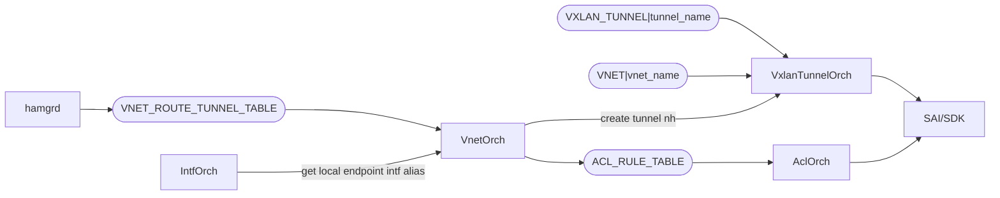

# VNET Local Endpoint Forwarding

## Overview

Packet Forwarding from NPU to local and remote DPU's are clearly explained in the [HA HLD - data path ha](https://github.com/sonic-net/SONiC/blob/master/doc/smart-switch/high-availability/smart-switch-ha-hld.md#42-data-path-ha).

TODO: add packet flow diagram for the scenarios. 

## Handling directly connected next hops (local DPU)

Covered in [Overlay ECMP ehancements - support for directly conneced nexthops](https://github.com/sonic-net/SONiC/blob/master/doc/vxlan/Overlay%20ECMP%20ehancements.md#33-bfd-tx-rx-interval-parameter-and-support-for-directly-connected-nexthops).

A new field will be added the `VNET_ROUTE_TUNNEL_TABLE`:

```
VNET_ROUTE_TUNNEL_TABLE:{{vnet_name}}:{{prefix}}
    “check_directly_connected”: /{/{true|false/}/} (OPTIONAL) 
```

```
; Defines schema for VNet Route tunnel table attributes
key                         = VNET_ROUTE_TUNNEL_TABLE:vnet_name:prefix ; Vnet route tunnel table with prefix
; field                     = value
check_directly_connected    = BOOLEAN  
```

The check_directly_connected can be set to true or false. 

VnetOrch shall check all the next hops in the ARP table to verify if directly connected. For such next hops, a regular ECMP route shall be employed instead of a tunnel route. This regular ECMP route would be updated based on the BFD liveness as is done for a regular vxlan ECMP route.

## Handling transient state during failovers 
During an HA failover, the HA pair briefly enters a transient state: the previously active becomes standby, while the standby remains the same. This transient state can cause packet drops on the switch. 
To handle this scenario, **high-priority** ACL rules matching tunnel termination flag are used to ensure redirects always go to the local nexthop.

### VnetOrch programs the ACL rule



We will leverage `check_directly_connected`, to distinguish the local endpoints from the endpoint list, (so we can avoid creating tunnel terminated ACL for all scenarios),

If `check_directly_connected` flag is enabled, and an endpoint can be confirmed as a neighbor, ACL rule to match TUNNEL_TERM flag to be added accordingly.

```
{
    "ACL_TABLE_TYPE": {
        "VNET_LOCAL_ENDPOINT_REDIRECT": {
            "MATCHES": [
                "DST_IP",
                "DST_IPV6",
                "TUNNEL_TERM"
            ],
            "ACTIONS": [
                "REDIRECT_ACTION",
            ],
            "BIND_POINTS": [
                "PORT",
                "PORTCHANNEL"
            ]
        }
    },
    "ACL_TABLE": {
        "VNET_LOCAL_ENDPOINT": {
            "STAGE": "INGRESS",
            "TYPE": "VNET_LOCAL_ENDPOINT_REDIRECT",
            "PORTS": [
                "<Ingress front panel ports>"
            ]
        }
    },
    "ACL_RULE": {
        "VNET_LOCAL_ENDPOINT:<vnet_name>_<prefix>_IN_TUNN_TERM": {
            "PRIORITY": "9998",
            "DST_IP": "1.1.1.1/32",
            "TUNN_TERM": "true",
            "REDIRECT": "<local nexthop interface>"
        }
    }
}
```
