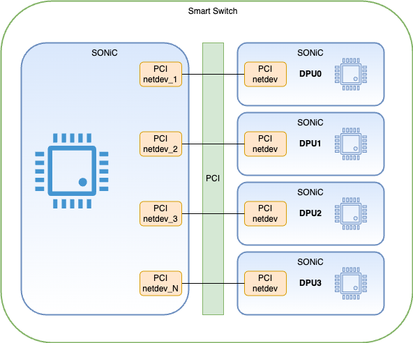
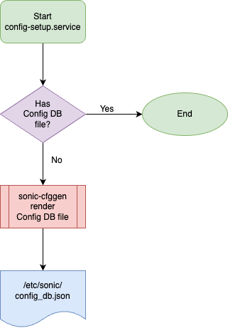
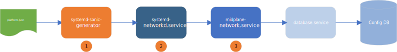
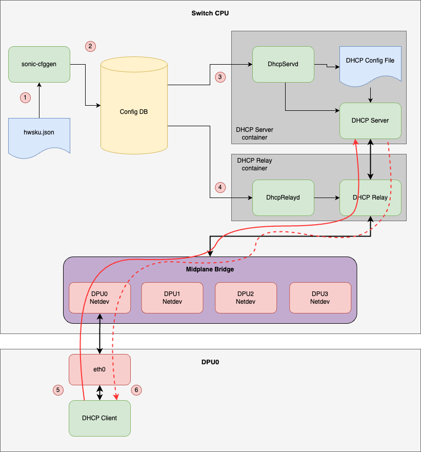

# Smart Switch IP address assignment #

## Table of Content ##

- [Smart Switch IP address assignment](#smart-switch-ip-address-assignment)
  - [Table of Content](#table-of-content)
  - [Revision](#revision)
  - [Scope](#scope)
  - [Definitions/Abbreviations](#definitionsabbreviations)
  - [Overview](#overview)
  - [Requirements](#requirements)
    - [IP address assignment requirements](#ip-address-assignment-requirements)
  - [Architecture Design](#architecture-design)
    - [Device data and PLATFORM](#device-data-and-platform)
      - [NPU platform.json](#npu-platformjson)
      - [DPU platform.json](#dpu-platformjson)
    - [DPU and PCIe interfaces naming convention](#dpu-and-pcie-interfaces-naming-convention)
    - [Configuration generation for IP address assignment](#configuration-generation-for-ip-address-assignment)
      - [DPU IP address allocation](#dpu-ip-address-allocation)
      - [Smart Switch configuration](#smart-switch-configuration)
    - [Midplane network configuration flow](#midplane-network-configuration-flow)
      - [NPU](#npu)
      - [DPU](#dpu)
    - [IP assignment flow](#ip-assignment-flow)
    - [High-Level Design](#high-level-design)
    - [SAI API](#sai-api)
    - [Configuration and management](#configuration-and-management)
      - [CLI/YANG model Enhancements](#cliyang-model-enhancements)
      - [YANG model for the switch side configuration](#yang-model-for-the-switch-side-configuration)
        - [DEVICE\_METADATA table](#device_metadata-table)
        - [MID\_PLANE\_BRIDGE and DPUS tables](#mid_plane_bridge-and-dpus-tables)
  - [Warmboot and Fastboot Design Impact](#warmboot-and-fastboot-design-impact)
  - [Memory Consumption](#memory-consumption)
  - [Restrictions/Limitations](#restrictionslimitations)
  - [Testing Requirements/Design](#testing-requirementsdesign)
    - [Unit Test cases](#unit-test-cases)
    - [System Test cases](#system-test-cases)
  - [Open/Action items - if any](#openaction-items---if-any)

## Revision ##

|  Rev  | Date  |       Author       | Change Description                     |
| :---: | :---: | :----------------: | -------------------------------------- |
|  0.1  |       | Oleksandr Ivantsiv | Initial version. IP address assignment |
|  0.2  |       |       Ze Gan       | Update the services flow               |

## Scope ##

This document provides a high-level design for Smart Switch IP address assignment flow.

## Definitions/Abbreviations ##

| Term | Meaning                                                 |
| ---- | ------------------------------------------------------- |
| NPU  | Network Processing Unit                                 |
| DPU  | Data Processing Unit                                    |
| PCIe | PCI Express (Peripheral Component Interconnect Express) |

## Overview ##

A DASH smart switch is a merging of a datacenter switch and one or more DPUs into an integrated device. The "front-panel" network interfaces of the DPU(s) are wired directly into the switching fabric instead of being presented externally, saving cabling, electronics, space and power. There can also be some consolidation of software stacks, for example see SONiC Multi-ASIC for how this is accomplished in standard SONiC multi-ASIC devices.


 The interconnection between control planes in the NPU and DPUs is organized via PCIe interfaces. For each DPU there is a pair of PCIe interfaces. One endpoint is on the NPU side and the other endpoint is on the DPU side. For each PCIe endpoint, there is a netdev representation in the Linux Kernel.



## Requirements ##

### IP address assignment requirements ###

- Uniform procedure for assigning IP addresses on DPUs and Switch side interfaces​
- Deterministic behavior​
- Stateless operation of DPU​
- All logic is kept on switch side​
- Compatibility with network boot scenarios, like OOB PXE on DPU

## Architecture Design ##

To implement a uniform procedure of IP address assignment for DPUs in the smart switch the DHCP server on the switch side shall be used. The DHCP server allows keeping the IP address assignment logic on the switch side and makes DPU IP address assignment implementation stateless from the DPU point of view. The IP address assignment shall be port-based which guarantees the deterministic behavior, the same DPU shall always receive the same IP address on request. The feature requires different implementation for the switch and DPUs platforms. However, the implementation fits into the existing SONiC architecture. The feature shall reuse the existing DHCP server container introduced in the [PR](https://github.com/sonic-net/SONiC/pull/1282). DHCP-based address assignment provides compatibility with the network boot scenarios (like PXE) when the static IP address assignment can not be utilized.

To organize the DPU PCIe interfaces on the switch side and provide the single source of the configuration for all the DPU PCIe interfaces the bridge interface ("midplane bridge") shall be used. To organize communication between the NPU and DPUs the link-local subnet shall be used. The IPv4 link-local subnetwork is chosen because it is a relatively unused network that is mostly used for the communication with directly connected hosts. This allows to assume that it shall not interfere with the other advertised networks.

To implement the switch side functionality the following changes shall be done:

- SONiC device data should be extended to include and support the following:
  - New `t1-smartswitch` topology. The topology shall be used as a default topology for the Smart Switch platform.
  - HW SKU schema shall be extended to include the following optional information:
    - DPU modules available on the platform.
    - DPU to netdev mapping.
- Config DB schema should be extended to include the following information:
  - Support of the new `SmartSwitch` subtype in DEVICE_METADATA config DB table. The new subtype shall allow to identify when the SONiC is running on the Smart Switch.
  - Support of the new `MID_PLANE_BRIDGE` table with the following information
    - Midplane bridge configuration with the list of the DPU PCIe interfaces that should be added to the bridge for the Smart Switch case.
- sonic-cfggen utility shall be extended to generate the following sample configuration based on the `t1-smartswitch` topology:
  - Midplane bridge and DHCP server configuration based on the DPU information provided in the PLATFORM file.
- systemd-networkd.service shall configure the midplane network of NPU and DPUs
  - NPU side: create a midplane bridge with the corresponding configuration in the Linux Kernel.
  - DPU side: start a DHCP client on the PCIe interface
- midplane-network-(npu/dpu).service is a oneshot service that waits for the midplane network to be initialized.
- DHCP server container should be included into the switch image. DHCP server feature should be enabled by default

The midplane bridge configuration shall includes two stages: 1. Create the Linux Kernel bridge and assign a fixed IP address to it in the midplane-network-(npu/dpu).service 2. Add the PCIe interfaces to the midplane bridge. The DHCP server configuration shall be generated by sonic-cfggen utility. No user involvement is required.

### Device data and PLATFORM ##

The Smart Switch platform by default shall use the `t1-smartswitch`. The topology shall be used together with the DPU information for the sample configuration generation.

The PLATFORM configuration shall be extended to provide the information about the DPU available in the system.

**Smart Switch**

#### NPU platform.json

```json
{
    "DPUS": {
        "dpu0": {
            "midplane_interface":  "dpu0",
        },
        "dpu1": {
            "midplane_interface":  "dpu1",
        }
    },
    "midplane_network": {
        "bridge_name": "bridge-midplane",
        "bridge_address": "169.254.200.254/24"
    }
}
```

#### DPU platform.json

```json
{
    "DPU":{},
    "midplane_network": {
        "bridge_address": "169.254.200.254/24"
    }
}
```

### DPU and PCIe interfaces naming convention ###

To follow the SONiC interfaces naming convention names of the DPUs in the DB and the PCIe interfaces that are connected to the DPUs shall start from the "dpu" prefix. The indexes shall start from "0" and shall represent the id of the DPU. For example dpu0, dpu1, etc. It is up to vendors' implementation to ensure that interfaces are assigned with the correct name during the system initialization.

### Configuration generation for IP address assignment ###

The configuration generation flow can be triggered in the following cases:

- During the first boot of the system, when there is no Config DB configuration file available yet.
- During configuration recovery, when the Config DB configuration file is removed and config-setup.service restart is triggered by the user.



#### DPU IP address allocation ####

The IP address allocation for the DPUs shall be the following:

- Midplane bridge network plus DPU ID plus 1. For example for the bridge with the 169.254.200.254/24 IP address DPU0 IP address shall be 169.254.200.1.

#### Smart Switch configuration ####

Based on the preset `t1-smartswitch` default topology the configuration generated by the sonic-cfggen utility will be the following:

```json
{
    "DEVICE_METADATA": {
        "localhost": {
            "switch_type": "switch",
            "type": "LeafRouter",
            "subtype": "SmartSwitch",
        }
    },
    "MID_PLANE_BRIDGE" {
        "GLOBAL": {
            "bridge" : "bridge-midplane"
        }
    },
    "DHCP_SERVER_IPV4": {
        "bridge-midplane": {
            "gateway": "169.254.200.254",
            "lease_time": "infinite",
            "mode": "PORT",
            "netmask": "255.255.255.0",
            "state": "enabled"
        }
    },
    "DHCP_SERVER_IPV4_PORT": {
        "bridge-midplane|dpu0": {
            "ips": [
                "169.254.200.1"
            ]
        },
        "bridge-midplane|dpu1": {
            "ips": [
                "169.254.200.2"
            ]
        }
    }
}
```

The DEVICE_METADATA table includes the following:

- "switch_type" field that indicates this device is switch.
- "type" field that indicates that this is Smart Switch.

The MID_PLANE_BRIDGE table includes the following:

- The name that shall be used to create bridge in the Kernel.
- The address if the bridge with the network.
- List of the netdevs that shall be added to the bridge as a members.

The DHCP_SERVER_IPV4 table includes the following:

- The name of the interface to listen for the request. Same as the bridge name.
- Gateway IP and network same as the bridge.

The DHCP_SERVER_IPV4_PORT table includes the following:

- For each DPU available in the system the IP address that should be assigned to the DPU.

### Midplane network configuration flow ###



#### NPU ####

1. systemd-sonic-generator renders configuration file of systemd-networkd and midplane-network-npu.service according to the platform.json.

``` text
# bridge-midplane.netdev
[NetDev]
Name=bridge-midplane
Kind=bridge
```

``` text
# bridge-midplane.network
[Match]
Name=bridge-midplane

[Network]
Address=169.254.200.254/24
```

``` text
# midplane-network-npu.network
[Match]
Name=dpu*

[Network]
Bridge=bridge-midplane
```

2. systemd-networkd helps to create the bridge-midplane interface and assign the specific IP address according to above configuration. Meanwhile, systemd-networkd will monitor the DPU PCIe interface. Once the PCIe interface is created, it will automatically add it into the bridge-midplane.
3. midplane-network-npu.service will be used to wait for the midplane bridge configured.

``` text
# midplane-network-npu.service

[Unit]
Description=Midplane network service
Requires=systemd-networkd.service
After=systemd-networkd.service
Before=database.service

[Service]
Type=oneshot
User=root
ExecStart=/usr/lib/systemd/systemd-networkd-wait-online -i bridge-midplane

[Install]
WantedBy=multi-user.target
```

#### DPU ####

In the DPU side, the steps are almost similar to NPU. But the generated configuration is different but simpler.

``` text
# midplane-network-dpu.network
[Match]
Name=eth0-midplane

[Network]
DHCP=yes
```

``` text
# midplane-network-dpu.service

[Unit]
Description=Midplane network service
Requires=systemd-networkd.service
After=systemd-networkd.service
Before=database.service

[Service]
Type=oneshot
User=root
ExecStart=/usr/lib/systemd/systemd-networkd-wait-online -i eth0-midplane --timeout=600

[Install]
WantedBy=multi-user.target
```

Step 2: systemd-networkd helps to start the dhcp client for eth0-midplane
Setp 3: midplane-network-dpu.service will be used to wait for IP assigned for eth0-midplane from DHCP server. We expect the eth0-midplane can be configured within 10 mins.

### IP assignment flow ###



- (1) sonic-cfggen based on platform.json renders midplane network and DHCP server configuration.
- (2) sonic-cfggen pushes configuration into the Config DB.
- (3-4) DHCP server and DHCP relay containers upon start consume configuration from the config DB and start listening for a requests from DHCP clients.
- (5) DHCP client on the DPU sends a request over the eth0-midplane interfaces. The request comes to the DHCP relay through the midplane bridge. DHCP relay inserts option 82 into the request with the information about the interface from which the request came. DHCP relay forwards the packet to the DHCP server.
- (6) The DHCP server sends a reply with the IP configuration to the DHCP client on the DPU.

### High-Level Design ###

### SAI API ###

N/A

### Configuration and management ###

No new CLI commands are required.

#### CLI/YANG model Enhancements ###

The YANG model shown in this section is provided as a reference. The complete model shall be provided in a separate PR.

#### YANG model for the switch side configuration ####

##### DEVICE_METADATA table #####

```yang
    container sonic-device_metadata {

        container DEVICE_METADATA {
            leaf type {
                    subtype string {
                        length 1..255;
                        pattern "<All existing subtypes>|SmartSwitch";
                    }
                }
        }
    }
```

##### MID_PLANE_BRIDGE and DPUS tables #####

```yang
    container sonic-smart-switch {

        container MID_PLANE_BRIDGE {

            description "MID_PLANE_BRIDGE part of config_db.json";

            container GLOBAL {
                leaf bridge {
                    type string {
                        pattern "bridge_midplane";
                    }
                    description "Name of the midplane bridge";

                }

                leaf ip_prefix {
                    type inet:ipv4-prefix;
                    description "IP prefix of the midplane bridge";
                }
            }
            /* end of container GLOBAL */
        }
        /* end of container MID_PLANE_BRIDGE */

        container DPUS {
            description "DPUS part of config_db.json";

            list DPUS_LIST {
                key "dpu_name";

                leaf dpu_name {
                    description "Name of the DPU";
                    type string {
                        pattern "dpu[0-9]+";
                    }
                }

                leaf midplane_interface {
                    description "Name of the interface that represents DPU";

                    type string {
                        pattern "dpu[0-9]+";
                    }
                }
            }
            /* end of container DPUS_LIST */
        }
        /* end of container DPUS */
    }
    /* end of container sonic-smart-switch */
```

## Warmboot and Fastboot Design Impact ##

The feature has no requirements for a warm and fast boot.

## Memory Consumption ##

The feature has minimal impact on the memory consumption. Overall it requires less than 1KB of disk and RAM space to store the new configuration.

## Restrictions/Limitations ##

## Testing Requirements/Design ##

### Unit Test cases ###

1. Add new YANG model tests for the new MID_PLANE_BRIDGE and DPUS table.
2. Extend existing YANG model tests to cover MGMT_INTERFACE table changes.
3. Add new tests to cover the handling of MID_PLANE_BRIDGE and DPUS tables in sonic-cfggen utility.
4. Add new tests to cover DHCP server configuration generation for the Smart Switch in sonic-cfggen utility.
5. Test to verify the midplane network configuration generation in NPU and DPU side.

### System Test cases ###

No separate test for the is required. The feature will be tested implicitly by the other DASH tests.

## Open/Action items - if any ###

- Do we need to extend the minigraph configuration to support the Smart Switch configuration?
