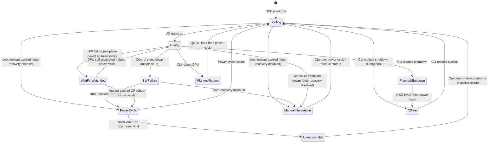

# Smart Switch: PMON: Enhance DPU Robustness #

## Table of Contents ##

- [Revision](#revision)
- [Scope](#scope)
- [Definitions/Abbreviations](#definitionsabbreviations)
- [Overview](#overview)
- [Terminology](#terminology)
- [Critical Processes for DPU Management](#critical-processes-for-dpu-management)
- [Timers and Thresholds](#timers-and-thresholds)
- [DPU Status DB Info](#dpu-status-db-info)
  - [Existing DB entries](#existing-db-entries)
  - [New DB entries](#new-db-entries)
- [DPU Recovery State Machine](#dpu-recovery-state-machine)
- [DPU Software Failures](#dpu-software-failures)
  - [Process Crash/Restart on DPU](#process-crashrestart-on-dpu)
  - [pmon Crash on NPU](#pmon-crash-on-npu)
  - [databasedpu Crash on NPU](#databasedpu-crash-on-npu)
- [DPU Hardware Failures](#dpu-hardware-failures)
  - [DPU Hardware Failure (Complete DPU Down)](#dpu-hardware-failure-complete-dpu-down)
  - [DPU Power Failure / Unexpected Shutdown](#dpu-power-failure--unexpected-shutdown)
  - [PCIe Failure](#pcie-failure)
- [NPU / Switch Level Failures](#npu--switch-level-failures)
  - [NPU Kernel Crash / Memory Exhaustion](#npu-kernel-crash--memory-exhaustion)
- [DPU Kernel Panic / Memory Exhaustion (HW Watchdog)](#dpu-kernel-panic--memory-exhaustion-hw-watchdog)
- [Planned Operations](#planned-operations)
  - [DPU Graceful Shutdown](#dpu-graceful-shutdown)
  - [DPU Cold Reboot](#dpu-cold-reboot)
  - [Full SmartSwitch Reboot](#full-smartswitch-reboot)
- [Scenario DB State Summary](#scenario-db-state-summary)
- [CLI](#cli)
- [Testing](#testing)
- [Repository Change Summary](#repository-change-summary)
- [References](#references)

---

## Revision ##

|  Rev  |        Author       | Change Description                     |
| :---: |  :----------------: | -------------------------------------- |
|  0.1  |  Vasundhara Volam   | Initial Version                        |

---

## Scope ##

This document covers the High Level Design for DPU failure scenarios on a SmartSwitch from the PMON (Platform Monitor) perspective — specifically focused on detection, DB state management, and recovery actions performed by `chassisd` and other PMON sub-daemons.

The scope includes:

- DPU software failures (process crashes and restarts on DPU; pmon and databasedpu crashes on NPU)
- DPU hardware failures (complete DPU down, power failure / unexpected shutdown, PCIe failure)
- NPU/switch-level failures (kernel crash, memory exhaustion)
- DB state tracking for DPU failure detection and recovery (new and existing DB entries)
- DB state tracking for planned operations
- PMON critical process definitions and criticality levels
- Timers and thresholds used by PMON for failure detection and recovery

---

## Definitions/Abbreviations ##

| Term | Meaning                                                 |
| ---- | ------------------------------------------------------- |
| API  | Application Programming Interface                       |
| ASIC | Application-Specific Integrated Circuit                 |
| CLI  | Command-Line Interface                                  |
| DB   | Redis Database                                          |
| DPU  | Data Processing Unit                                    |
| gNOI | gRPC Network Operations Interface                       |
| gRPC | Google Remote Procedure Call                             |
| NPU  | Network Processing Unit                                 |
| PCIe | PCI Express (Peripheral Component Interconnect Express) |
| PMON | Platform Monitor                                        |
| RPC  | Remote Procedure Call                                   |
| SAI  | Switch Abstraction Interface                            |

---

## Overview ##

SmartSwitch consists of one NPU (switch ASIC) and multiple DPUs. All front panel ports are connected to the NPU. DPUs are connected to the NPU via PCIe and back-panel ports.

The PMON (Platform Monitor) daemon on the NPU is responsible for monitoring DPU health and managing DPU lifecycle operations. Its primary sub-daemon, `chassisd`, continuously polls DPU states (midplane, control plane, data plane), detects failures, performs recovery actions (power-cycle, PCIe rescan), and updates database entries to reflect DPU readiness.

This document enumerates all failure scenarios that can occur on a DPU or its supporting infrastructure from the PMON perspective, describes detection mechanisms driven by `chassisd`, recovery paths, and the corresponding database state changes. It also covers planned operations (graceful shutdown, cold reboot, full SmartSwitch reboot) and the DB state changes introduced to support them.

---

## Terminology ##

| Term | Explanation |
| ---- | ----------- |
| chassisd | Chassis daemon running inside `pmon` on the NPU; monitors DPU health states, manages DPU power-cycle and reset operations |
| pmon | Platform Monitor daemon on NPU; hosts `chassisd` and other hardware monitoring sub-daemons |
| syncd | Sync daemon; manages SAI API calls to DPU ASIC |
| control plane state | DPU SONiC is booted up, all containers are up, interfaces are up, and DPU is ready to accept configuration. Derived from SYSTEM_READY in STATE_DB. Values: `"up"`, `"down"`. |
| midplane link state | The PCIe link between the NPU and DPU is operational. Monitored and updated by NPU pmon `chassisd` via the `is_midplane_reachable` platform API. Values: `"up"`, `"down"`. |
| dataplane state | Configuration is downloaded, pipeline stages are up, and DPU hardware (port/ASIC) is ready to take traffic. Values: `"up"`, `"down"`. |

---

## Critical Processes for DPU Management ##

The following processes are critical for SmartSwitch DPU lifecycle management. A failure in any of these impacts the ability to monitor, recover, or manage DPUs.

**PMON-managed processes (on NPU):**

| Process |  Role | Failure Impact |
| ------- |  ---- | -------------- |
| `chassisd` | Monitors DPU health (midplane, control plane, data plane); manages power-cycle, reset, and DB state updates | All DPU failure detection and recovery stops; no DB updates |
| `pcied` | Monitors PCIe link state between NPU and DPUs; updates `PCIE_DETACH_INFO` in STATE_DB | PCIe failures go undetected; `PCIE_DETACH_INFO` not updated |

**Other critical NPU processes:**

| Process | Container | Role | Failure Impact |
| ------- | --------- | ---- | -------------- |
| `gnoi_reboot_daemon.py` | `gnmi` | Sends gNOI Reboot RPCs to DPUs for graceful shutdown / reboot | Graceful shutdown and planned reboot operations fail; DPU cannot be halted cleanly before power-cycle |
| `sysmgr` | Host | Routes DPU planned shutdown and reboot requests to host services for execution | Planned DPU reset operations cannot be carried out |


---

## Timers and Thresholds ##

All timers and thresholds used by PMON for DPU failure detection and recovery are listed below. Values shown are defaults; some are configurable via `platform.json`.

| Timer / Threshold | Default Value | Configurable | Used By | Description |
| ----------------- | :-----------: | :----------: | ------- | ----------- |
| `chassisd` health poll interval | 10 seconds | No | `chassisd` | Interval at which `chassisd` polls `dpu_control_plane_state`, `dpu_data_plane_state`, and `dpu_midplane_link_state`. As soon as `dpu_control_plane_state` is observed as `down` (with midplane still up), `chassisd` initiates a DPU power-cycle (no self-heal grace period). When `dpu_midplane_link_state` goes down, `chassisd` enters **WaitForWatchdog** and waits `dpu_boot_timeout` for the DPU to self-recover via HW watchdog before power-cycling. |
| `pcied` PCIe poll interval | 60 seconds | No | `pcied` | Interval at which `pcied` checks PCIe link status for all DPUs. A PCIe failure may go undetected for up to 60 seconds. |
| `dpu_halt_services_timeout` | 60 seconds | Yes (`platform.json`) | `gnoi_reboot_daemon.py` | Maximum time to wait for DPU services to halt gracefully during reboot/shutdown |
| `dpu_boot_timeout` | 600 seconds | Yes (`platform.json`) | `chassisd` | Maximum time to wait for a DPU to reach `Ready` state (all planes up) after a power-cycle or after entering **WaitForWatchdog** (midplane down). In **Booting** state: if the DPU does not become ready within this timeout, `chassisd` treats it as a boot failure and initiates another power-cycle (incrementing `reset_count`). In **WaitForWatchdog** state: if the DPU does not self-recover within this timeout, `chassisd` issues its own power-cycle. If the DPU comes back within this timeout AND reports a recognized reboot cause (`Kernel Panic`, `Memory Exhaustion`, or `Watchdog`), `chassisd` accepts the self-recovery without issuing its own power-cycle. |
| `dpu_reset_limit` | 2 | Yes (`platform.json`) | `chassisd` | Maximum number of consecutive unplanned power-cycle attempts before marking DPU as unrecoverable |

> **Note:** `chassisd` polls `dpu_data_plane_state` alongside `dpu_control_plane_state` and `dpu_midplane_link_state`, but `dpu_data_plane_state` alone does not trigger recovery actions. A data-plane-down with control-plane-up scenario indicates that the DPU SONiC stack is running but the data plane pipeline has not converged — this is expected during initial programming or after a configuration change. Recovery is triggered only when `dpu_control_plane_state` or `dpu_midplane_link_state` transitions to `down`. The `dpu_data_plane_state` is used by `chassisd` solely to determine full DPU readiness for setting `ready_status` to `true`. During the **Booting** state, if `dpu_control_plane_state` transitions to `up` but `dpu_data_plane_state` remains `down` when `dpu_boot_timeout` expires, `chassisd` logs a WARNING-level syslog (`DPU<N>: data plane not up after <timeout>s`) but does **not** trigger a power-cycle. The `ready_status` remains `false` until the operator investigates or the data plane recovers. This warning only applies during boot — if a DPU is already in **Ready** state and `dpu_data_plane_state` drops to `down` while control plane stays `up`, `chassisd` sets `ready_status` to `false` but does not trigger a power-cycle or timeout. The DPU stays operational (no recovery action) until the data plane recovers or control plane also goes down.

> **Auto-recovery trigger vs. planned operations:** `chassisd` auto-recovery is triggered **only** for unplanned failures. During planned operations (graceful shutdown via `config chassis module shutdown` or DPU reboot via `reboot -d`), the `state_transition_in_progress` field in `CHASSIS_MODULE_TABLE|DPU<dpu_index>` is set to `True` **before** the DPU control plane goes down. When `chassisd` observes `dpu_control_plane_state: down`, it checks `state_transition_in_progress`: if `True`, `chassisd` skips auto-recovery because the shutdown/reboot is intentional. Auto-recovery is only initiated when `dpu_control_plane_state` or `dpu_midplane_link_state` transitions to `down` **and** no planned transition is in progress (`state_transition_in_progress == False`). There is no additional timeout configured for this check — the distinction is purely flag-based.

---

## DPU Status DB Info ##

### Existing DB entries ###

The following DB entries track the DPU lifecycle state and are referenced during failure detection and recovery.

**DPU State in CHASSIS_STATE_DB:**

```
DPU_STATE|DPU<dpu_index>:
{
  "dpu_control_plane_state": "up" | "down",
  "dpu_control_plane_time":  "<UTC timestamp>",
  "dpu_data_plane_state":    "up" | "down",
  "dpu_data_plane_time":     "<UTC timestamp>",
  "dpu_midplane_link_state": "up" | "down",
  "dpu_midplane_link_time":  "<UTC timestamp>"
}
```

**PCIe Detach Info in STATE_DB:**

```
PCIE_DETACH_INFO|DPU<dpu_index>:
{
  "dpu_id":    "<index>",
  "dpu_state": "detaching" | "detached" | "reattached",
  "bus_info":  "[DDDD:]BB:SS.F"
}
```

**Graceful Shutdown / Reboot Tracking in STATE_DB:**

```
CHASSIS_MODULE_TABLE|DPU<dpu_index>:
{
  "oper_status":                  "Online" | "Offline",
  "state_transition_in_progress": "True" | "False",
  "transition_start_time":        "<UTC timestamp>",
  "transition_type":              "shutdown" | "reboot" | "none"
}
```

> **Note:** The `state_transition_in_progress`, `transition_start_time`, and `transition_type` fields are managed by the graceful-shutdown implementation in [sonic-gnmi](https://github.com/sonic-net/sonic-gnmi) and [sonic-utilities](https://github.com/sonic-net/sonic-utilities). These fields are not managed by sonic-platform-daemons.

### New DB entries ###

The following DB entries will now be newly created to track DPU failure states.

**DPU additional Info in CHASSIS_STATE_DB on NPU**

```
DPU_STATE|DPU<dpu_index>:
{
  "ready_status":                      "true" | "false",
  "recovery_status":                   "recoverable" | "unrecoverable",
  "reset_count":                       "<integer>",
  "last_down_time":                    "<UTC timestamp>",
  "last_ready_time":                   "<UTC timestamp>"
}
```

| Field | Description | Set by | Cleared by |
| ----- | ----------- | ------ | ---------- |
| `ready_status` | Set to `"true"` when the DPU is fully up and ready (midplane, control plane, data plane all up). Set to `"false"` when the DPU goes down or undergoes a reset. | `chassisd` | `chassisd` (set to `"false"` on failure/reset) |
| `recovery_status` | Set to `"recoverable"` on initialization. Set to `"unrecoverable"` when `reset_count` reaches `dpu_reset_limit`. Reset back to `"recoverable"` (and `reset_count` to 0) on: (1) `chassisd` restart (pmon crash / NPU reboot), or (2) operator-initiated `config chassis module startup DPU<x>` on an unrecoverable DPU. | `chassisd` | `chassisd` (reset to `"recoverable"` on chassisd restart or operator module startup) |
| `reset_count` | Number of unplanned DPU resets. Reset to 0 on `chassisd` reset on NPU (e.g., NPU reboot, `pmon` restart). | `chassisd` | `chassisd` |
| `last_down_time` | UTC timestamp of the last time the DPU went down | `chassisd` | — |
| `last_ready_time` | UTC timestamp of the last time the DPU became ready | `chassisd` | — |

**DPU Auto-Recovery Feature in CONFIG_DB on NPU**

```
FEATURE|dpu-auto-recovery:
{
  "state":        "enabled" | "disabled" | "always_disabled",
  "auto_restart": "enabled" | "disabled",
  "high_mem_alert": "disabled"
}
```

| Field | Default | Description |
| ----- | ------- | ----------- |
| `state` | `enabled` | Enable or disable the DPU auto-recovery feature. When `disabled` or `always_disabled`, `chassisd` will not automatically power-cycle DPUs on failure. |
| `auto_restart` | `enabled` | Standard SONiC FEATURE table field — enables `systemd` to restart the feature's associated service if it crashes. |
| `high_mem_alert` | `disabled` | Standard SONiC FEATURE table field — high memory usage alert threshold. |

> **Note:** `dpu-auto-recovery` is **not** a separate service or container. It is a feature flag entry in CONFIG_DB's `FEATURE` table, read by `chassisd` (running inside the `pmon` container) to determine whether automatic DPU power-cycle recovery is enabled. The `auto_restart` and `high_mem_alert` fields are standard SONiC FEATURE table fields required by the feature infrastructure; they do not govern `chassisd` itself. When `state` is `disabled`, `chassisd` still monitors and updates DPU states in CHASSIS_STATE_DB, but will not initiate automatic power-cycle recovery. Manual intervention is required to recover failed DPUs.

---

## DPU Recovery State Machine ##

The following diagram shows the state transitions managed by `chassisd` for a single DPU. Each box represents a `chassisd`-observed DPU state; edges show the triggers and actions.



| State | `ready_status` | `recovery_status` | Key DB Indicators |
| ----- | :------------: | :----------------: | ----------------- |
| **Booting** | `false` | `recoverable` | `dpu_control_plane_state: down`; `chassisd` starts `dpu_boot_timeout` timer — if DPU does not reach Ready before timeout, triggers PowerCycle (or ManualIntervention if auto-recovery disabled) |
| **Ready** | `true` | `recoverable` | All three states `up` |
| **SWFailure** | `false` | `recoverable` | `dpu_control_plane_state: down`, `dpu_midplane_link_state: up`; transient state before `chassisd` selects `PowerCycle` or `ManualIntervention` based on the auto-recovery feature flag. If **both** control plane and midplane are down, this is treated as a HW failure — skips SWFailure and goes to **WaitForWatchdog** (if auto-recovery enabled). |
| **PowerCycle** | `false` | `recoverable` | `chassisd` issuing power-cycle; `reset_count` incremented |
| **WaitForWatchdog** | `false` | `recoverable` | Midplane down detected; `chassisd` waiting up to `dpu_boot_timeout` (600s) for DPU HW watchdog to power-cycle and bring DPU back. On DPU return, validates `dpu_reboot_cause` — accepts `Kernel Panic`, `Memory Exhaustion`, or `Watchdog`. |
| **ManualIntervention** | `false` | `recoverable` | DPU down; `FEATURE&#124;dpu-auto-recovery` `state` is `disabled` / `always_disabled`; no power-cycle issued; awaits operator action |
| **Offline** | `false` | `recoverable` | `oper_status: Offline` |
| **Unrecoverable** | `false` | `unrecoverable` | `reset_count` ≥ `dpu_reset_limit`; operator can recover via `config chassis module startup DPU<x>` which resets `recovery_status` to `recoverable` and `reset_count` to 0 |

---

## DPU Software Failures ##

### Process crash/restart on DPU ###

**Description:**
Any process crashes on the DPU and `dpu_control_plane_state` transitions to `down`. `chassisd` does not wait for the container supervisor to self-heal — it issues a DPU power-cycle as soon as it observes `dpu_control_plane_state: down` on its next poll.

**Detection (by PMON):**
- `chassisd` on the NPU polls `dpu_control_plane_state` every 10 seconds and observes it as `down`.

**PMON Action:**
- `chassisd` sets `ready_status` to `false` and updates `last_down_time` for the corresponding DPU.
- On the **same poll cycle** that detects `dpu_control_plane_state: down`, `chassisd` issues a power-cycle of the DPU and increments `reset_count`. There is no additional timeout or grace period — the only detection latency is the 10-second poll interval itself.
- After the DPU comes back, `chassisd` verifies all DPU states (midplane, control plane, data plane), sets `ready_status` back to `true`, and updates `last_ready_time`.
- If `reset_count` reaches `dpu_reset_limit`, `chassisd` sets `recovery_status` to `"unrecoverable"` and stops further automatic power-cycle attempts.
- **When auto-recovery is disabled:** `chassisd` skips the power-cycle. The DPU remains in **ManualIntervention** with `ready_status: false`; operator must reset the DPU manually.

**DB State Transition:**

| DB Field | Before | During Failure | After Recovery |
| -------- | :----: | :------------: | :------------: |
| `dpu_control_plane_state` | `up` | `down` | `up` |
| `ready_status` | `true` | `false` | `true` |
| `last_down_time` | — | `<UTC timestamp>` | — |
| `last_ready_time` | — | — | `<UTC timestamp>` |
| `reset_count` | N | N | N+1 |
| `recovery_status` | `recoverable` | `recoverable` | `recoverable` (or `unrecoverable` if N+1 ≥ `dpu_reset_limit`) |

---

### pmon crash on NPU ###

**Description:**
The `pmon` (Platform Monitor) daemon on the NPU crashes. This is a **critical** PMON failure — `chassisd` and all other PMON sub-daemons stop, halting all DPU health monitoring.

**Detection (by PMON):**
- Not self-detectable. `systemd` detects the `pmon` container is down and restarts it.
- DPU health state updates to `CHASSIS_STATE_DB` stop during the outage.

**PMON Action:**
- On `chassisd` bringup sequence after restart, `chassisd` resets `reset_count` to 0 for **all** DPUs, sets `ready_status` to `false`, and updates `last_down_time` for **all** DPUs.
- `chassisd` re-polls all DPU states and updates `CHASSIS_STATE_DB` with current values.
- For each DPU found healthy, `chassisd` sets `ready_status` back to `true` and updates `last_ready_time`.

**DB State Transition:**

| DB Field | Before | During Failure | After Recovery |
| -------- | :----: | :------------: | :------------: |
| `ready_status` (all DPUs) | `true` | stale | `false` → `true` (per DPU) |
| `last_down_time` (all DPUs) | — | — | `<UTC timestamp>` |
| `last_ready_time` (all DPUs) | — | — | `<UTC timestamp>` (per DPU) |
| `reset_count` (all DPUs) | N | stale | 0 |

> **Note:** `reset_count` is reset to 0 on `chassisd` restart. This means a DPU that was close to `dpu_reset_limit` gets a fresh retry budget after a pmon crash. This is by design — the pmon restart itself represents operator-level intervention, and persistent hardware issues will be caught again within `dpu_reset_limit` attempts.

> **Note:** If only `chassisd` crashes within the `pmon` container (while `pmon` itself stays running), `supervisord` inside `pmon` restarts `chassisd` automatically. The recovery behavior is identical to the full `pmon` crash case described above — `chassisd` re-initializes all DPU states on startup.

---

### databasedpu crash on NPU ###

**Description:**
The `databasedpu<dpu-index>` (per-DPU Redis database instance) on the NPU crashes. Each DPU has a dedicated Redis instance on the NPU (port 6381 + DPU ID, bound to midplane bridge IP 169.254.200.254). These per-DPU Redis instances host the DPU's APPL_DB, CONFIG_DB, STATE_DB, etc. — they are **not** the same as CHASSIS_STATE_DB. The DPU's `orchagent` and `syncd` read/write from these instances, while `chassisd` monitors DPU health via CHASSIS_STATE_DB (a separate Redis instance on the NPU).

**Detection (by PMON):**
- `chassisd` does **not** directly detect the `databasedpuN` service crash. The detection is indirect:
  1. When `databasedpuN` crashes, the DPU's `orchagent` and other services lose DB connectivity.
  2. Critical services on the DPU fail, causing `SYSTEM_READY` on the DPU to go `false`.
  3. The DPU updates its `dpu_control_plane_state` to `down` in CHASSIS_STATE_DB (which is a separate Redis instance and remains accessible).
  4. `chassisd` observes `dpu_control_plane_state: down` on its next poll cycle.
- If the `databasedpuN` crash is caused by a midplane failure, then CHASSIS_STATE_DB also becomes inaccessible from the DPU side, and `chassisd` detects the failure via `dpu_midplane_link_state: down` instead.

**PMON Action:**
- `chassisd` sets `ready_status` to `false` and updates `last_down_time`.
- If `dpu_control_plane_state` or `dpu_midplane_link_state` is observed as `down`, `chassisd` initiates a DPU power-cycle (same as any other unplanned failure).
- After `systemd` restarts the Redis instance and the DPU recovers (or after power-cycle recovery), `chassisd` polls DPU state, sets `ready_status` back to `true`, and updates `last_ready_time` once all states are verified.

**DB State Transition:**

| DB Field | Before | During Failure | After Recovery |
| -------- | :----: | :------------: | :------------: |
| `dpu_control_plane_state` | `up` | `down` | `up` |
| `ready_status` | `true` | `false` | `true` |
| `last_down_time` | — | `<UTC timestamp>` | — |
| `last_ready_time` | — | — | `<UTC timestamp>` |
| `reset_count` | N | N | N+1 |
| `recovery_status` | `recoverable` | `recoverable` | `recoverable` (or `unrecoverable` if N+1 ≥ `dpu_reset_limit`) |

---

## DPU Hardware Failures ##

### DPU Hardware Failure (Complete DPU Down) ###

**Description:**
A DPU completely fails due to hardware fault, thermal event, or unrecoverable error. The DPU is no longer responsive on the midplane or back-panel ports.

**Detection (by PMON):**
- NPU: Oper state of the DPU `CHASSIS_MODULE_TABLE|DPU<dpu_index>|oper_status` is set to `offline`.

**PMON Action:**
- `chassisd` sets `ready_status` to `false` and updates `last_down_time` for the corresponding DPU.
- `chassisd` immediately power-cycles the DPU (the DPU is already confirmed non-functional via `oper_status: Offline`) and increments `reset_count`.
- After power-cycle, DPU goes through full boot sequence: midplane attach → PCIe rescan → SONiC boot → container startup.
- `chassisd` verifies all DPU states (midplane, control plane, data plane), sets `ready_status` back to `true`, and updates `last_ready_time`.
- If `reset_count` reaches `dpu_reset_limit`, `chassisd` sets `recovery_status` to `"unrecoverable"` and stops further automatic power-cycle attempts.
- **When auto-recovery is disabled:** `chassisd` skips the immediate power-cycle. The DPU remains in **ManualIntervention** with `oper_status: Offline` and `ready_status: false`; operator must trigger recovery.

**DB State Transition:**

| DB Field | Before | During Failure | After Recovery |
| -------- | :----: | :------------: | :------------: |
| `oper_status` | `Online` | `Offline` | `Online` |
| `ready_status` | `true` | `false` | `true` |
| `last_down_time` | — | `<UTC timestamp>` | — |
| `last_ready_time` | — | — | `<UTC timestamp>` |
| `reset_count` | N | N | N+1 |
| `recovery_status` | `recoverable` | `recoverable` | `recoverable` (or `unrecoverable` if N+1 ≥ `dpu_reset_limit`) |

---

### DPU Power Failure / Unexpected Shutdown ###

**Description:**
The DPU loses power unexpectedly or shuts down without graceful notification (e.g., voltage regulator failure, firmware crash).

**Detection (by PMON):**
- NPU `pmon` detects midplane ping failure → `dpu_midplane_link_state` set to `down`.
- `dpu_control_plane_state` transitions to `down`.

**PMON Action:**
- `chassisd` sets `ready_status` to `false` and updates `last_down_time`.
- Since `dpu_midplane_link_state` is down, `chassisd` enters the **WaitForWatchdog** state and starts the `dpu_boot_timeout` timer (600 seconds) to allow the DPU to self-recover via HW watchdog.
- If the DPU self-recovers within the timeout and reports a valid reboot cause (`Kernel Panic`, `Memory Exhaustion`, or `Watchdog`), `chassisd` accepts the recovery without issuing its own power-cycle.
- If the timeout expires or the reboot cause is invalid, `chassisd` power-cycles the DPU and increments `reset_count`.
- After recovery, `chassisd` verifies all DPU states, sets `ready_status` back to `true`, and updates `last_ready_time`.
- If `reset_count` reaches `dpu_reset_limit`, `chassisd` sets `recovery_status` to `"unrecoverable"` and stops further automatic power-cycle attempts.
- **When auto-recovery is disabled:** `chassisd` skips the WaitForWatchdog and power-cycle. The DPU remains in **ManualIntervention** with `ready_status: false`; operator must trigger recovery.

**DB State Transition:**

| DB Field | Before | During Failure | After Recovery |
| -------- | :----: | :------------: | :------------: |
| `dpu_midplane_link_state` | `up` | `down` | `up` |
| `dpu_control_plane_state` | `up` | `down` | `up` |
| `ready_status` | `true` | `false` | `true` |
| `last_down_time` | — | `<UTC timestamp>` | — |
| `last_ready_time` | — | — | `<UTC timestamp>` |
| `reset_count` | N | N | N+1 |
| `recovery_status` | `recoverable` | `recoverable` | `recoverable` (or `unrecoverable` if N+1 ≥ `dpu_reset_limit`) |

---

### PCIe Failure ###

**Description:**
The PCIe bus between the NPU and a local DPU fails, making the DPU unreachable from the NPU. The DPU may still be running internally but is disconnected from the NPU.

**Detection (by PMON):**
- `pcied` detects PCIe link down and updates `PCIE_DETACH_INFO|DPU<dpu_index>` in STATE_DB with `dpu_state: detached`.
- Independently, `chassisd` detects midplane loss via `is_midplane_reachable()` polling and updates `dpu_midplane_link_state` → `down` in CHASSIS_STATE_DB.

**PMON Action:**
- `chassisd` sets `ready_status` to `false` and updates `last_down_time`.
- Since midplane is down (PCIe detached implies midplane unreachable), `chassisd` enters the **WaitForWatchdog** state and starts the `dpu_boot_timeout` timer (600 seconds) to allow the DPU to self-recover via HW watchdog.
- If the DPU self-recovers within the timeout and reports a valid reboot cause (`Kernel Panic`, `Memory Exhaustion`, or `Watchdog`), `chassisd` accepts the recovery without issuing its own power-cycle.
- If the timeout expires or the reboot cause is invalid, `chassisd` power-cycles the DPU (`power_down()` → `pci_detach()` → `power_up()` → `pci_reattach()`) and increments `reset_count`.
- After power-cycle and PCIe rescan, `chassisd` verifies all DPU states (midplane, control plane, data plane), sets `ready_status` back to `true`, and updates `last_ready_time`.
- If `reset_count` reaches `dpu_reset_limit`, `chassisd` sets `recovery_status` to `"unrecoverable"` and stops further automatic power-cycle attempts.
- **When auto-recovery is disabled:** `chassisd` skips the WaitForWatchdog and power-cycle. The DPU remains in **ManualIntervention** with `ready_status: false`; operator must trigger recovery.

**DB State Transition:**

| DB Field | Before | During Failure | After Recovery |
| -------- | :----: | :------------: | :------------: |
| `dpu_midplane_link_state` | `up` | `down` | `up` |
| `PCIE_DETACH_INFO` `dpu_state` | `reattached` | `detached` | `reattached` |
| `ready_status` | `true` | `false` | `true` |
| `last_down_time` | — | `<UTC timestamp>` | — |
| `last_ready_time` | — | — | `<UTC timestamp>` |
| `reset_count` | N | N | N+1 |
| `recovery_status` | `recoverable` | `recoverable` | `recoverable` (or `unrecoverable` if N+1 ≥ `dpu_reset_limit`) |

---

## NPU / Switch Level Failures ##

### NPU Kernel Crash / Memory Exhaustion ###

**Description:**
The entire switch (NPU + all DPUs) goes down due to kernel panic or memory exhaustion. All DPUs on the switch are impacted simultaneously.

**Detection (by PMON):**
- On NPU recovery, `chassisd` reads the reboot cause from `/host/reboot-cause/reboot-cause.txt`. If the reboot cause indicates a kernel crash or memory exhaustion (e.g., `Kernel Panic`), `chassisd` treats all DPU states as potentially stale and triggers re-initialization.

**PMON Action:**
- On recovery, `chassisd` initializes all DPU states as `down`, sets `ready_status` to `false`, and updates `last_down_time` for all DPUs.
- `chassisd` re-establishes midplane connectivity and polls each DPU's state.
- For every admin-up DPU, irrespective of its observed state (healthy, degraded, or unresponsive), `chassisd` issues a platform vendor power-cycle (`power_down()` → `pci_detach()` → `power_up()` → `pci_reattach()`) to guarantee a known-good starting state after the NPU crash, and increments `reset_count`.
- Admin-down DPUs (`oper_status: Offline`) are left powered off; `chassisd` does not reset them.
- After each DPU comes back, `chassisd` verifies all DPU states (midplane, control plane, data plane) and, on success, sets `ready_status` back to `true` and updates `last_ready_time`.
- **When auto-recovery is disabled:** `chassisd` skips the unconditional power-cycle for admin-up DPUs. Each DPU is left in its post-crash state with `ready_status: false` and remains in **ManualIntervention** awaiting operator action.

**DB State Transition:**

| DB Field | Before Crash | On NPU Recovery | After DPU Recovery |
| -------- | :----------: | :-------------: | :----------------: |
| `ready_status` (all DPUs) | `true` | `false` | `true` (per DPU) |
| `last_down_time` (all DPUs) | — | `<UTC timestamp>` | — |
| `last_ready_time` (all DPUs) | — | — | `<UTC timestamp>` (per DPU) |
| `reset_count` (per admin-up DPU) | N | N | N+1 |

> **Note:** `reset_count` is reset to 0 on `chassisd` startup (per the field definition), so the "Before Crash" value above is the count as observed by the freshly restarted `chassisd` after the NPU comes back — effectively starting from 0.

---

## DPU Kernel Panic / Memory Exhaustion (HW Watchdog) ##

**Description:**
A DPU experiences a kernel panic or memory exhaustion, causing the Linux kernel to crash. If a hardware watchdog is enabled on the DPU, the watchdog timer fires and power-cycles the DPU automatically without NPU intervention. The DPU goes through a full cold boot and comes back to a healthy state on its own.

Without HW watchdog awareness, `chassisd` would detect `dpu_midplane_link_state: down` and immediately issue its own power-cycle of the DPU — which is redundant and disruptive (it interrupts the DPU's in-progress self-recovery via watchdog).

**Platform Configuration:**

The `dpu_boot_timeout` in `platform.json` controls the WaitForWatchdog grace period (same timer used for boot-after-power-cycle):

```json
{
  "dpu_boot_timeout": 600
}
```

The 600-second default must be long enough for a full DPU HW watchdog trigger + power-cycle + cold boot sequence. The HW watchdog itself may have a timeout of 30–120s before it fires, plus the DPU boot time.

**Detection (by PMON):**
- `chassisd` detects `dpu_midplane_link_state: down` on its next poll cycle — same as any other HW failure.

**PMON Action (when midplane goes down):**
1. `chassisd` sets `ready_status` to `false` and updates `last_down_time`.
2. `chassisd` enters the **WaitForWatchdog** state and starts the `dpu_boot_timeout` timer (default 600 seconds).
3. `chassisd` continues polling the DPU state every 10 seconds during this period.
4. **If the DPU comes back** (midplane up → control plane up) within the timeout:
   - `chassisd` reads the DPU's previous reboot cause from `CHASSIS_STATE_DB: DPU_STATE|DPU<dpu_index>: dpu_reboot_cause` (written by DPU's `determine-reboot-cause` service on boot).
   - **If reboot cause is `Kernel Panic`, `Memory Exhaustion`, or `Watchdog`:** `chassisd` accepts the self-recovery — transitions to **Ready**, sets `ready_status` to `true`, updates `last_ready_time`. `reset_count` is **not** incremented (the HW watchdog handled recovery autonomously).
   - **If reboot cause is anything else** (e.g., `Unknown`, `Software`, `Power Loss`): `chassisd` does **not** trust the self-recovery. It proceeds with a full power-cycle (`PowerCycle` state), incrementing `reset_count`, to guarantee a clean DPU state.
5. **If the timeout expires** (DPU not back after 600 seconds):
   - `chassisd` transitions to **PowerCycle** (if auto-recovery enabled) or **ManualIntervention** (if disabled).
   - Standard recovery flow applies: power-cycle, increment `reset_count`, wait for boot via `dpu_boot_timeout`.
6. If `reset_count` reaches `dpu_reset_limit`, `chassisd` sets `recovery_status` to `"unrecoverable"`.

**DPU Reboot Cause Reporting:**

The DPU reports its reboot cause to `CHASSIS_STATE_DB` on the NPU after every boot:

```
DPU_STATE|DPU<dpu_index>:
{
  "dpu_reboot_cause": "Kernel Panic" | "Memory Exhaustion" | "Watchdog" | "Power Loss" | "Software" | "Unknown"
}
```

The DPU's `determine-reboot-cause` service reads from `/host/reboot-cause/reboot-cause.txt` on boot and publishes the cause to CHASSIS_STATE_DB via the midplane. `chassisd` reads this field after the DPU's `dpu_control_plane_state` transitions back to `up`.

**DB State Transition (DPU self-recovers — reboot cause is valid: Kernel Panic / Memory Exhaustion / Watchdog):**

| DB Field | Before | During WaitForWatchdog | After Self-Recovery |
| -------- | :----: | :-------------------: | :-----------------: |
| `dpu_midplane_link_state` | `up` | `down` | `up` |
| `dpu_control_plane_state` | `up` | `down` | `up` |
| `ready_status` | `true` | `false` | `true` |
| `last_down_time` | — | `<UTC timestamp>` | — |
| `last_ready_time` | — | — | `<UTC timestamp>` |
| `reset_count` | N | N | N (unchanged) |
| `recovery_status` | `recoverable` | `recoverable` | `recoverable` |
| `dpu_reboot_cause` | (previous) | (stale) | `Kernel Panic` / `Memory Exhaustion` / `Watchdog` |

**DB State Transition (DPU self-recovers — reboot cause invalid → power-cycle anyway):**

| DB Field | Before | During WaitForWatchdog | After Power-Cycle |
| -------- | :----: | :-------------------: | :---------------: |
| `dpu_midplane_link_state` | `up` | `down` → `up` (self-recovered) → `down` (power-cycle) | `up` |
| `ready_status` | `true` | `false` | `true` |
| `reset_count` | N | N | N+1 |
| `recovery_status` | `recoverable` | `recoverable` | `recoverable` (or `unrecoverable` if N+1 ≥ `dpu_reset_limit`) |

**DB State Transition (DPU does NOT self-recover — timeout expires):**

| DB Field | Before | During WaitForWatchdog | After Power-Cycle |
| -------- | :----: | :-------------------: | :---------------: |
| `dpu_midplane_link_state` | `up` | `down` | `up` |
| `ready_status` | `true` | `false` | `true` |
| `reset_count` | N | N | N+1 |
| `recovery_status` | `recoverable` | `recoverable` | `recoverable` (or `unrecoverable` if N+1 ≥ `dpu_reset_limit`) |

> **Note:** The `dpu_boot_timeout` (600s) is used for both **Booting** (wait for DPU to come up after power-cycle) and **WaitForWatchdog** (wait for DPU to self-recover via HW watchdog). The 600-second value accounts for the HW watchdog trigger delay (30–120s) + DPU power-cycle + cold boot sequence.

> **Note:** During **WaitForWatchdog**, if a planned operation (`config chassis module shutdown`) is requested, `chassisd` cancels the watchdog wait timer, powers down the DPU, and transitions to **Offline**.

> **Note:** This feature only applies to **HW failures** (midplane down). For SW failures (control plane down, midplane still up), `chassisd` still power-cycles immediately because the HW watchdog would not fire in a software-only failure scenario (the DPU hardware is still running).

---

## Planned Operations ##

### DPU Graceful Shutdown ###

**Description:**
Orderly shutdown of a DPU via CLI command: `config chassis module shutdown DPU<x>`.

**PMON Sequence:**
1. `chassisd` calls `set_admin_state(down)` → `module_base.py` triggers `graceful_shutdown_handler()`.
2. `CHASSIS_MODULE_TABLE` in STATE_DB updated:
   - `state_transition_in_progress`: `True`
   - `transition_start_time`: `<UTC timestamp>`
   - `transition_type`: `shutdown`
3. `chassisd` updates CHASSIS_STATE_DB:
   - `DPU_STATE|DPU<dpu_index>`: `ready_status`: `false`, `last_down_time`: `<UTC timestamp>`
4. `gnoi_reboot_daemon.py` detects the transition and sends gNOI Reboot RPC (Method: `HALT`) to DPU.
5. DPU gracefully shuts down all services via `reboot -p`.
6. NPU polls `gnoi_client -rpc RebootStatus` until `active=false` (services terminated).
7. `state_transition_in_progress` set to `False`.
8. `module_base.py` calls platform API `power_down()` to power off DPU.
9. PCIe detach: platform vendor API `pci_detach()`.
10. Sensor ignore configs added, sensord restarted.

**DB State Transition:**

| DB Field | Before | After Shutdown |
| -------- | :----: | :------------: |
| `ready_status` | `true` | `false` |
| `last_down_time` | — | `<UTC timestamp>` |
| `oper_status` | `Online` | `Offline` |
| `state_transition_in_progress` | `False` | `True` → `False` |

**Race Condition Handling:**
- If module shutdown is requested during a DPU reboot: operation fails; retry after reboot completes.
- If module shutdown is requested while DPU is in **Booting** state (e.g., during initial boot or after a power-cycle): `chassisd` cancels the `dpu_boot_timeout` timer, skips further recovery, powers down the DPU, and transitions directly to **Offline**.
- If switch reboot is requested during module shutdown: graceful shutdown completes; switch reboot proceeds.
- Concurrent startup/shutdown on the same module: fails; user retries later.
- If `config chassis module shutdown` is issued while `chassisd` is in the middle of an auto-recovery power-cycle for the same DPU: `chassisd` detects the admin-down request, aborts the auto-recovery loop, and proceeds with the graceful shutdown sequence.
- If `pcied` detects a PCIe failure and updates `PCIE_DETACH_INFO` at the same time `chassisd` initiates a power-cycle due to midplane loss: `chassisd` holds a per-DPU lock during the power-cycle sequence. `pcied` updates `PCIE_DETACH_INFO` independently (no lock contention). `chassisd` reads `PCIE_DETACH_INFO` during its power-cycle flow and performs PCIe rescan if `dpu_state` is `detached`. No conflicting actions occur because `pcied` is read-only from `chassisd`'s perspective — it only updates state, while `chassisd` acts on it.

---

### DPU Cold Reboot ###

**Description:**
Reboot a DPU with full power-cycle via CLI: `reboot -d <DPU_ID>`.

**PMON Sequence:**
1. NPU sends gNOI Reboot RPC (Method: `HALT`) to DPU.
2. NPU polls gNOI `RebootStatus` until `active=false` and `Status=STATUS_SUCCESS`.
3. Timeout: `dpu_halt_services_timeout` (Read from `platform.json`, default 60 seconds).
4. PCIe detach: platform vendor API `pci_detach()`.
5. Platform vendor reboot API invoked (DPU cold boot / power-cycle).
6. PCIe reattach: platform vendor API `pci_reattach()`.
7. DPU boots, services start, reports `dpu_control_plane_state=up`.
8. `chassisd` verifies all DPU states and sets `ready_status` to `true`.

> **Note:** `dpu_boot_timeout` applies to the Booting phase after a planned reboot as well. If the DPU fails to reach `Ready` within the timeout (e.g., broken image installed during upgrade), `chassisd` treats it as a boot failure and initiates another power-cycle, incrementing `reset_count`. The planned reboot's `state_transition_in_progress` flag is already cleared by step 5, so it does not suppress the boot-timeout recovery.

**DB State Transition:**

| DB Field | Before | During Reboot | After Recovery |
| -------- | :----: | :-----------: | :------------: |
| `ready_status` | `true` | `false` | `true` |
| `last_down_time` | — | `<UTC timestamp>` | — |
| `last_ready_time` | — | — | `<UTC timestamp>` |
| `PCIE_DETACH_INFO` `dpu_state` | `reattached` | `detaching` → `detached` | `reattached` |

**Error handling:**
- If gNOI service is unreachable: detach PCIe and proceed after timeout.
- If PCIe reattach fails: error handling + restoration mechanism triggered.
- If DPU stuck: hardware watchdog triggers reset (vendor-specific).

---

### Full SmartSwitch Reboot ###

**Description:**
Planned reboot of the entire SmartSwitch (NPU + all DPUs) via CLI: `reboot`. All DPUs are gracefully shut down in parallel before the NPU reboots.

**PMON Sequence:**
1. NPU sends gNOI Reboot RPC (Method: `HALT`) to **all** DPUs in parallel (multiple threads).
2. NPU polls gNOI `RebootStatus` for each DPU until `active=false` and `Status=STATUS_SUCCESS`.
3. Timeout per DPU: `dpu_halt_services_timeout` (default from `platform.json`, typically 60 seconds).
4. For each DPU: PCIe detach via platform vendor API `pci_detach()`.
5. NPU proceeds with its own reboot sequence.
6. On NPU boot, PCIe enumeration discovers all DPUs.
7. `chassisd` power-cycles each DPU and performs PCIe reattach.
8. Each DPU boots: midplane attach → SONiC boot → container startup → reports `dpu_control_plane_state=up`.

> **Note — Multiple DPU recovery:** When multiple (or all) DPUs need recovery simultaneously, `chassisd` issues power-cycles sequentially (one DPU at a time) to avoid power-rail overload and PCIe bus contention. The `dpu_boot_timeout` is tracked per-DPU independently. If a platform supports parallel DPU power-cycle (declared in `platform.json` via `parallel_dpu_recovery: true`), `chassisd` may issue power-cycles in parallel batches.

**DB State Transition:**

| DB Field | Before | During Reboot | After Recovery |
| -------- | :----: | :-----------: | :------------: |
| `ready_status` (all DPUs) | `true` | `false` | `true` (per DPU) |
| `last_down_time` (all DPUs) | — | `<UTC timestamp>` | — |
| `last_ready_time` (all DPUs) | — | — | `<UTC timestamp>` (per DPU) |
| `PCIE_DETACH_INFO` `dpu_state` (per DPU) | `reattached` | `detaching` → `detached` | `reattached` |

**Error handling:**
- If a DPU does not respond to gNOI Reboot RPC within the timeout: NPU proceeds with PCIe detach and continues the reboot. The unresponsive DPU is cold-booted on NPU recovery.
- If a DPU fails to come back after the full switch reboot: `chassisd` retries power-cycle up to `dpu_reset_limit` (tracked via `reset_count`). If still unresponsive, `chassisd` sets `recovery_status` to `"unrecoverable"`.
- If the NPU reboot is initiated while a DPU graceful shutdown is in progress: the graceful shutdown completes first, then the NPU reboot proceeds.

---

## Scenario DB State Summary ##

| DPU Scenario | `dpu_control_plane_state` | `dpu_midplane_link_state` | `ready_status` | PMON Action |
| ------------ | :-----------------------: | :-----------------------: | :-----------: | ----------- |
| DPU booting – initial state | down | down → up | false | `chassisd` polls; midplane comes up first, then waits for control plane and data plane within `dpu_boot_timeout` |
| DPU healthy and running – first boot | up | up | true | Set `ready_status=true` after verifying all states |
| DPU crash / unplanned reboot | down | down | false | Power-cycle DPU; increment `reset_count` |
| DPU up after crash | up | up | true | Set `ready_status=true` after verifying all states |
| DPU stuck (lost connectivity) | down | down | false | Power-cycle DPU; increment `reset_count` |
| DPU up after losing connectivity / reboot | up | up | true | Set `ready_status=true` after verifying all states |
| DPU control plane restart – critical services | down → up | up | false → true | Power-cycle DPU; increment `reset_count`; set `ready_status=true` on recovery |
| NPU/DPU OS upgrade | down → up | up | false → true | Re-poll DPU states on NPU recovery |
| DPU dead – power cycle | down | down | false | Power-cycle DPU; increment `reset_count` |
| DPU dead – unrecoverable | down | down | false | `reset_count` reached `dpu_reset_limit`; `recovery_status` set to `"unrecoverable"`; raise alert |
| Full SmartSwitch reboot (planned) | down → up | down → up | false → true | gNOI halt; power-cycle; re-verify |
| DPU kernel panic / mem exhaustion (HW watchdog) | down → up | down → up | false → true | Wait `dpu_boot_timeout` (600s); if DPU self-recovers AND reboot cause is `Kernel Panic`/`Memory Exhaustion`/`Watchdog`, accept recovery (`reset_count` unchanged); otherwise power-cycle |

---

## CLI ##

The existing `show chassis modules status` command is extended to include a `Ready-Status` column:

```
admin@sonic:~$ show chassis modules status
  Name             Description    Physical-Slot    Oper-Status    Admin-Status        Serial    Ready-Status
------  ----------------------  ---------------  -------------  --------------  ------------  --------------
  DPU0  <DPU Sku>              N/A         Online              up  <DPU serial #>            true
  DPU1  <DPU Sku>              N/A         Online              up  <DPU serial #>            true
  ...
```

A new `show chassis modules recovery` command exposes detailed recovery state:

```
admin@sonic:~$ show chassis modules recovery
  Name    Ready-Status    Recovery-Status    Reset-Count    Last-Down-Time              Last-Ready-Time
------  --------------  -----------------  -------------  --------------------------  --------------------------
  DPU0            true    recoverable                  2    2026-05-28 10:15:30 UTC      2026-05-28 10:18:45 UTC
  DPU1            true    recoverable                  0    —                           2026-05-28 09:00:12 UTC
  DPU2           false    unrecoverable                2    2026-05-28 11:02:00 UTC      —
  ..
```

| Column | Source DB Field | Description |
| ------ | --------------- | ----------- |
| `Ready-Status` | `CHASSIS_STATE_DB: DPU_STATE\|DPU<N>: ready_status` | Whether the DPU is fully up and serving traffic |
| `Recovery-Status` | `CHASSIS_STATE_DB: DPU_STATE\|DPU<N>: recovery_status` | `recoverable` or `unrecoverable` |
| `Reset-Count` | `CHASSIS_STATE_DB: DPU_STATE\|DPU<N>: reset_count` | Number of unplanned power-cycles since last `chassisd` restart |
| `Last-Down-Time` | `CHASSIS_STATE_DB: DPU_STATE\|DPU<N>: last_down_time` | UTC timestamp of last DPU failure |
| `Last-Ready-Time` | `CHASSIS_STATE_DB: DPU_STATE\|DPU<N>: last_ready_time` | UTC timestamp of last successful DPU recovery |

---

## Testing ##

All DPU failure mode tests run with **auto-recovery enabled** by default (the production configuration). Specific tests explicitly disable and re-enable auto-recovery to validate the `ManualIntervention` path. The existing SmartSwitch test suites (e.g., `test_reload_dpu`) continue to run unmodified — auto-recovery does not interfere with planned reboot/shutdown tests because `chassisd` checks `state_transition_in_progress` before triggering recovery.

Test implementation: [`tests/smartswitch/platform_tests/test_dpu_failure_modes.py`](https://github.com/sonic-net/sonic-mgmt/blob/master/tests/smartswitch/platform_tests/test_dpu_failure_modes.py)

| Test Class | Scenario | Validates |
| ---------- | -------- | --------- |
| `TestDatabaseDpuCrash` | Kill per-DPU Redis instance (`databasedpuN`) on NPU | `chassisd` detects loss (`ready_status=false`), `systemd` restarts service, `chassisd` recovers (`ready_status=true`) |
| `TestPcieFailure` | Remove DPU PCIe device via sysfs | `pcied` detects detach (`PCIE_DETACH_INFO dpu_state=detached`), `chassisd` marks DPU not-ready, power-cycles, performs PCIe rescan, recovers |
| `TestControlPlaneOnlyDown` | Stop critical container (`swss`) on DPU | `dpu_control_plane_state=down` while midplane stays up; `chassisd` detects and power-cycles DPU |
| `TestAutoRecoveryDisabled` | Disable `FEATURE\|dpu-auto-recovery`, trigger failure | Confirms `chassisd` does NOT power-cycle (ManualIntervention); re-enable and verify recovery |
| `TestUnrecoverableState` | Repeatedly trigger failures until `reset_count` ≥ `dpu_reset_limit` | `recovery_status=unrecoverable`; `chassisd` stops retrying |
| `TestStateMachineTransitions` | Planned shutdown → offline → startup → ready | `last_down_time` and `last_ready_time` updated correctly; `recovery_status` stays `recoverable` |
| `TestShutdownDuringAutoRecovery` | Issue module shutdown while `chassisd` is mid-recovery | `chassisd` aborts auto-recovery, DPU transitions to Offline cleanly |
| `TestDpuFailureAfterConfigReload` | Config reload on NPU, then trigger DPU failure | `chassisd` recovery works post-reload; `reset_count` increments |

**Test infrastructure:**
- Shared `ensure_all_dpus_ready` fixture (in `tests/smartswitch/conftest.py`) ensures all testable DPUs are admin-up, online, and DB-ready before each test, and recovers any offline DPUs in teardown.
- Tests use `assert_dpu_db_state_ready()` helper to verify full DPU readiness (`ready_status=true`, `recovery_status=recoverable`, all planes up).
- Topology: `smartswitch` — requires NPU DUT with DPU SSH access via `dpuhosts`.

---

## Repository Change Summary ##

| Repository | Component | Changes |
| ---------- | --------- | ------- |
| [sonic-platform-daemons](https://github.com/sonic-net/sonic-platform-daemons) | `chassisd` | DPU failure detection, automated power-cycle recovery, new CHASSIS_STATE_DB fields (`ready_status`, `recovery_status`, `reset_count`, `last_down_time`, `last_ready_time`) |
| [sonic-buildimage](https://github.com/sonic-net/sonic-buildimage) | PMON container | Configuration updates for new `chassisd` failure recovery features |
| [sonic-mgmt](https://github.com/sonic-net/sonic-mgmt) | --- | DPU failure mode tests (`test_dpu_failure_modes.py`) |

---

## References ##

- [Smart Switch PMON](../pmon/smartswitch-pmon.md)
- [Smart Switch Graceful Shutdown](../graceful-shutdown/graceful-shutdown.md)
- [Smart Switch Reboot HLD](../reboot/reboot-hld.md)
- [Smart Switch Database Architecture](../smart-switch-database-architecture/smart-switch-database-design.md)
- [Smart Switch IP Address Assignment](../ip-address-assigment/smart-switch-ip-address-assignment.md)
- [Smart Switch DPU Upgrade HLD](../upgrade/dpu-upgrade-hld.md)
