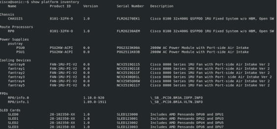
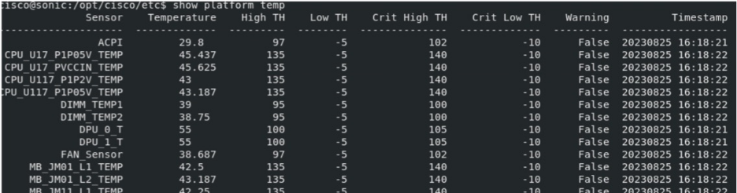
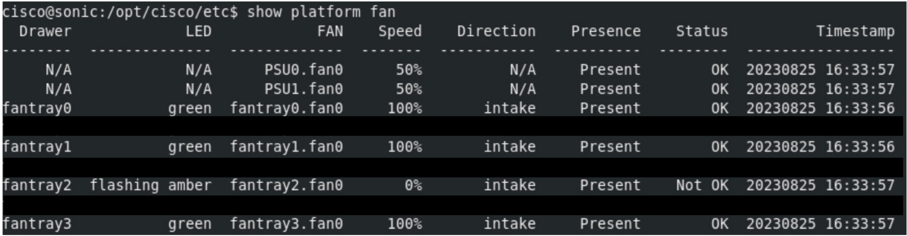
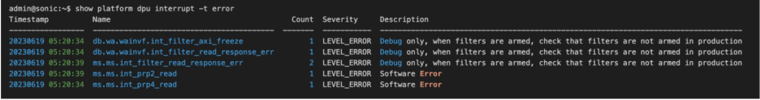

# SmartSwitch PMON High Level Design

| Rev | Date | Author | Change Description |
| --- | ---- | ------ | ------------------ |
| 0.1 | 12/02/2023 | Ramesh Raghupathy | Initial version|
| 0.2 | 01/08/2024 | Ramesh Raghupathy | Updated API, CPI sections and addressed review comments |

## Definitions / Abbreviations

| Term | Meaning |
| --- | ---- |
| PMON | Platform Monitor |
| DLM | Device Lifecycle Manager |
| NPU | Network Processing Unit |
| DPU | Data Processing Unit |
| PDK | Platform Development Kit |
| SAI | Switch Abstraction Interface |
| GPIO | General Purpose Input Output |
| PSU | Power Supply Unit |
| I2C | Inter-integrated Circuit communication protocol |
| SysFS | Virtual File System provided by the Linux Kernel |
| CP | Control Plane |
| DP | Data Plane |
| SLED | Single Large Extender Device, DPU Card |

## 1. Introduction
SmartSwitch offloads the Packet Processors (NPUs) and the host CPUs, freeing up resources for application performance, thereby performing layer four to layer seven functions in a cost effective and space saving way. 

The specialized DPUs when built into a regular switch, can provide such a capability, which is being referred as SmartSwitch.
Platform monitor PMON in SONiC is a container responsible for chassis management functions to ensure proper operation of the devices and peripherals in the chassis there by ensuring the proper operation of the product. 

The typical lifecycle of a product involves the following stages.

<p align="center"></p>

The following sub-tasks are performed under each stage
* Onboarding
    * Boot, Shutdown, Power Cycle
    * Rest, PCIe-Reset
* Monitoring
    * Device State (dpu_state)
    * Sensors, PSUs, Colling Devices, Thermal management
    * Show CLIs
* Detection and Debugging
    * DPU Health
    * Alarms, Syslog
    * Console
* RMA
    * Inventory

The purpose of this document is to provide a framework to share the state, health, alarms of the DPUs, manage the DPUs by providing support to monitor, gracefully shutdown, restart them and the associated peripherals such as thermal sensors, cooling devices, LEDs, etc.

The picture below highlights the PMON vertical and its association with other logics within the SONiC architecture.

<p align="center"></p>

## 2.	Requirements and Assumptions
### 2.1.    Onboarding
* The SmartSwitch host PMON should be able to Power Cycle, Shutdown, Reset, and rest the PCIe link per DPU or the entire system
* The DPU must provide additional information such as reboot cause, timestamp, etc as explained in the scheme once it boots its OS to DPU_STATE table.
* When the DPU reboots itself, should log the reboot cause and update the previous-reboot-cause-dpu field in the ChassisStateDB when it boots up again
* When the SmartSwitch host reboots the DPU, the host should update the previous-reboot-cause-host field in the ChassisStateDB
* The reboot-cause history should provide a holistic view of the reboot cause of the SmartSwitch host CPU, the reboot-cause of all the DPUs as seen by the Switch and the DPU itself.
* The DPUs should be uniquely identified and the DPU upon boot may get this ID from the host and identify itself.
* Implement the required API enhancements and new APIs for DPU management (see details in design section)
* SmartSwitch should use the existing SONiC midplane-interface model in modular chassis design for communication between the DPU and the NPU
* SmartSwitch should extend the SONiC modular chassis design and treat the dpu-cards just like line-cards in existing design
* Reboot
    * Only cold reboot of DPUs is required, warm boot support is not required.
### 2.2. Monitoring and Thermal Management
* Dpu State
    * The DPUs should provide their state to the host as the boot progression happens
    * SmartSwitch should store the dpu state data in the DPU_STATE table in the host ChassisStateDB (explained in DB schema)
    * DPUs should be able to store the data using a redis call
    * The DPU must provide additional information on the state once it boots its OS to DPU_STATE table.
    * The SmartSwitch host PMON should be able to monitor the liveliness of the DPUs and when they go down should be able to take appropriate actions such as updating the state of the DPU in the DB and should try to gracefully recover the DPU when requested by the PMON

* Thermal management
    * Sensor values and fan speeds, status should be read periodically and stored in SmartSwitch StateDB
    * Platform modules should use the thermal sensor values against the thresholds in the thermal policy and adjust fan speeds depending on the temperature
    * Trigger thermal shut down on critical policy violation

* Show CLIs
    * Extend existing CLIs such as 'show platform fan/temperature' to support the new HW
    * Extend the modular chassis CLI 'show chassis modules status" to display the DPU status

### 2.3. Detect and Debug
* Health
    * SmartSwitch DPUs should store their health data in their local StateDB 
    * DPUs should support a CLI to display the health data “show dpu health”
    * The host should be able to access this data using a redis call or an api
* Alarm and Syslog
    * Raise alarms when the temperature thresholds exceed, fans run slow or not present or faulty
    * Drive LEDs accordingly
    * Provide LED status indicators for DPU boards
    * Trigger syslog
* Console
    * Provide console access to the DPUs through the Host CPU from the front panel management port
    * The modular chassis console utility will be extended to access DPUs in place of LCs
### 2.3. RMA
* The dpu-cards should be displayed as part of inventory
* Extend the CLI “show platform inventory” to display the dpu-cards and their state
* The system should be powered down for replacement of dpu-card

## 3.	SmartSwitch PMON Design
SmartSwitch PMON block diagram
<p align="center"></p>

### 3.1. Platform monitoring and management
* SmartSwitch design Extends the existing chassis_base and module_base as described below.
* Extend MODULE_TYPE in ModuleBase class with MODULE_TYPE_DPU and MODULE_TYPE_SWITCH to support SmartSwitch

| API | current_usage | switch_cpu | dpu | SONiC_enhancements | PD plugin change| HW mgmt change | comments |
| --- | --- | --- | --- | --- | --- | --- | --- |
| class ModuleBase | # Possible module types MODULE_TYPE_SUPERVISOR MODULE_TYPE_LINE MODULE_TYPE_FABRIC | yes | yes | #new module type MODULE_TYPE_DPU MODULE_TYPE_SWITCH  |  |  |  |  |

#### 3.1.1 ChassisBase class API enhancements
| API | current_usage | switch_cpu | dpu | SONiC_enhancements | PD plugin change| comments |
| --- | --- | --- | --- | --- | --- | --- |
| get_supervisor_slot(self) | Retrieves the physical-slot of the supervisor-module in the modular chassis. On the supervisor or line-card modules, it will return the physical-slot of the supervisor-module. | na | na | no  | return 0  | chassisd does not like MODULE_INVALID_SLOT smart switch as chassis, where slot is used as follows 0 - switch, 1 - DPU1, 2 - DPU2, .. 8 - DPU8 |
| get_my_slot(self) | Retrieves the physical-slot of this module in the modular chassis. | na | na | no | return 0/1-8 | 0 - switch, 1 - DPU1, 2 - DPU2, ... 8 - DPU8 |
| is_modular_chassis(self) | Retrieves whether the sonic instance is part of modular chassis | yes | na | no | return False | smartswitch chassis is fixed, we are extending the modular chassis class to support DPU modules |
| get_num_modules(self) | Retrieves the number of modules available on this chassis | yes | yes | no | yes | include DPUs |
| get_all_modules(self) | Retrieves all modules available on this chassis | yes | yes | no | yes | include DPUs |
| get_module(self, index) | Retrieves module represented by (0-based) index <index> | yes | yes | no | yes | include DPU |
| get_module_index(self, module_name) | Retrieves module index from the module name | yes | yes | new module name: DPU, SWTCH | yes |  |

#### 3.1.2 ChassisBase class new APIs
| API | current_usage | switch_cpu | dpu | SONiC_enhancements | PD plugin change| comments |
| --- | --- | --- | --- | --- | --- | --- |
| is_smartswitch(self) | Retrieves whether the sonic instance is part of smartswitch | yes | yes | yes | return True | New API for smartswitch |
| get_module_dpu_port(self, index) | Retrieves the DPU port (internal ASIC port for DPU) represented by DPU index - 1,8 | yes | na | yes | yes | See section 3.1.3 below |

#### 3.1.3 NPU to DPU port mapping
platform.json of NPU/switch will show the NPU port to DPU port mapping. This will be used by services early in the system boot for midplane IP assignment. In this example there are 8 DPUs and ach having a 200G interface.
```
"DPUs" : [
    {
      "DPU0": {
                "Ethernet224": "Ehternet0"
       }
    },
    {
       "DPU1": {
                "Ethernet228": "Ethernet0"
        },
    },
    .
    .
    {
       "DPU7": {
                "Ethernet252": "Ethernet0"
        },
    },

]
```
On the DPU's platform.json, we can have 
```
DPU: {

  // Anything specific to DPU, else remain empty

}
```
#### 3.1.4 ModuleBase class API enhancements
| API | current_usage | switch_cpu | dpu | SONiC_enhancements | PD plugin change| HW mgmt change | comments |
| --- | --- | --- | --- | --- | --- | --- | --- |
| get_base_mac(self) | Retrieves the base MAC address for the module | yes | yes | no | yes | yes |  |
| get_system_eeprom_info(self) | Retrieves the full content of system EEPROM information for the module | yes | yes | no | yes | yes |  |
| get_name(self) | Retrieves the name of the module prefixed by SUPERVISOR, LINE-CARD, FABRIC-CARD | yes | yes | new module: SWITCH,DPU | yes | yes |  |
| get_description(self) | Retrieves the platform vendor's product description of the module | yes | yes | no | yes | yes |  |
| get_slot(self) | Retrieves the platform vendor's slot number of the module | na | na | no | return 0/1-8 | yes | 0 - switch, 1 - DPU1, 2 - DPU2, ... 8 - DPU8|
| get_type(self) | Retrieves the type of the module | yes | yes | no | yes | yes | return type: MODULE_TYPE_DPU MODULE_TYPE_SWITCH |
| get_oper_status(self) | Retrieves the operational status of the module | yes | yes | no | yes | yes | This information is not sufficient for debugging complex DPU failures. So, couple of new CLIs will be introduced. |
| reboot(self, reboot_type) | Request to reboot the module | yes | yes | no | yes | yes |  |
| set_admin_state(self, up) | Request to keep the card/DPU in administratively up/down state. | yes | yes | no | yes | no |  |
| get_maximum_consumed_power(self) | Retrieves the maximum power drawn by this module | yes | yes | no | yes | yes |  |
| get_midplane_ip(self) | Retrieves the midplane IP-address of the module in a modular chassis. When called from the Supervisor, the module could represent the line-card and return the midplane IP-address of the line-card. When called from the line-card, the module will represent the Supervisor and return its midplane IP-address. | yes | yes | new module Switch, DPU | yes | no | IP address for PCIe interface for DPU |
| is_midplane_reachable(self) | Retrieves the reachability status of the module from the Supervisor or of the Supervisor from the module via the midplane of the modular chassis | yes | yes | no | yes | no |  |
| get_all_asics(self) | Retrieves the list of all ASICs on the module that are visible in PCI domain. When called from the Supervisor of modular system, the module could be fabric card, and the function returns all fabric ASICs on this module that appear in PCI domain of the Supervisor. | na | na | no | na | na | For smartswitch this is NA |

#### 3.1.5 ModuleBase class new APIs

##### 3.1.5.1 Need for consistant storage and access of DPU reboot causae, state and health
1.  get_reboot_cause for the modules is missing in the existing code. The smartswitch needs to know the reboot cuase for DPUs.

    Table shows the frame work for DPU reboot-cause reporting

    | DPU Reboot Cause | HW/SW | End_User_Message_in_DPU_STATE |
    | --- | --- | --- |
    | REBOOT_CAUSE_POWER_LOSS | HW | Power failure |
    | REBOOT_CAUSE_HOST_DPU_RESET | SW | Host lost DPU - Try resetting DPU |
    | REBOOT_CAUSE_HOST_DPU_POWERCYCLE | SW | Host lost DPU - Power cycled DPU |
    | REBOOT_CAUSE_SW_THERMAL |	SW | Switch software Powered Down DPU due to DPU temperature failure |
    | PCIE_RESET_CAUSE_SWITCH_INITIATED |	SW | Switch Software resets DPU PCIe link due to PCIe failure |

2. Though the get_oper_status(self) can get the operational status of the DPU Moudules, the current implementation only has limited capabilites.
    * Can only state MODULE_STATUS_FAULT and can't show exactly where in the state progrression the DPU failed. This is critical in fault isolation, DPU switch over decision, resilliency and recovery
    * Though this is platform implementation specific, in a multi vendor use case, there has to be a consistant way of storing and acessing the information.
    * Store the state progression (Powered, PCIe-Link-Status, Host-DPU Eth-Link-Status, Firmware-Boot_status, OS-Boot-Status, CcontrolPlane-State, DataPlane-Status) on the host ChassisStateDB.
    * get_state_info(self) will retrun an object with the ChassisStateDB data
    * Potential consumer: Switch CLIs, Utils (install/repair images), HA, LB, Life Cycle Manager 
    * Use cases: Debuggability, error recovery (reset, power cycle) and fault management, consolidated view of Switch and DPU state

* ChassisStateDB Schema for DPU_STATE
    ```
    Table: “DPU_STATE”

    SCHEMA
    key:  dpu_state:1
    
    HMSET dpu_state:1
            "id": "1",    		#Key itself can be used?
            "powered": "ON",
            "pcie_link_state": "UP",
            "pcie_link_time": "timestamp",
            "pcie_link_reason": "up_down_related string",
            "host_eth_link_state": "UP",
            "host_eth_link_time": " timestamp ",
            "host_eth_link_reason": "up_down_related string",
            "firmware_state": "UP",
            "firmware_time": " timestamp ",
            "firmware_reason": ”gold boot a, ONIE version x",
            "os_state": "UP",
            "os_state_time": "timestamp",
            "os_reason": ”version x",
            "previos_reboot_reason_from_dpu": “Software reboot ”,
            "previos_reboot_time_from_dpu ": “timestamp”,
            “previous_reboot_reason_from_host”: ”Powered Down DPU - Temperature failure”,
            "previos_reboot_time_from_host ": “timestamp”,
            "control_plane_state": ”DOWN",
            "control_plane_time": ”timestamp",
            "control_plane_reason": ”containers restarting",
            "data_plane_state": ”DOWN",
            "data_plane_time": ”timestamp",
            "data_plane_reason": ”Pipeline failure",
    ```

3. Each DPU has to maintain a table for storing the health in its local DB (get_health_info(self))
* The DPU is a complex hardware, for debuggability, a consistant way of storing and accessing the health record of the DPUs is critical in a multi vendor senario even though it is platform specific implementation.
* Each DPU stores the health information in its local stateDB
* DPU local stateDB Schema for DPU_HEALTH
    ```
    Table: “DPU_HEALTH”

    SCHEMA
    key:  dpu_health
    
    HMSET dpu_health 
        "value": { 
            "count": "1",  # number of occurance of event 
            "description": "Single bit error Correction", # Event
            "name": "ms.ms.int_prp2_read", 
            "severity": "LEVEL_INFO", # DEBUG, INFO, WARRNIG, ERROR
            "timestamp": "20230618 14:56:15" 
        } 
    ```
* ModuleBase class new APIs

    | API | current_usage | switch_cpu | dpu | SONiC_enhancements | PD plugin change| HW mgmt change | comments |
    | --- | --- | --- | --- | --- | --- | --- | --- |
    | get_reboot_cause(self) | Retrieves the cause of the previous reboot | yes | yes | yes | yes | yes | Missing in module_base.py |
    | get_state_info(self) | Retrieves the dpu state object having the detailed dpu state progression | yes | no | yes | yes | yes |  |
    | get_health_info(self) | Retrieves the dpu health object | no | yes | yes | yes | yes |  |

### 3.2. Thermal management
* Platform  initializes all sensors
* Thermalctld fetch CPU temperature, DPU temperature, fan speed, monitor and update the DB
* Thermal manager reads all thermal sensor data, run thermal policy and take policy action Ex. Set fan speed, set alarm, set syslog, set LEDs 
* Platform collects fan related data such as presence, failure and then applies fan algorithm to set the new fan speed
* The north bound CLI/Utils/App use DB data to ”show environment”, ”show platform temp” show platform fan”

Thermal management sequence diagram
<p align="center"></p>

### 3.2.1 Platform device data collection 
* thermalcontrold, led and PSUd post device data to DB periodically
* during the boot up of the daemons, it will collect the constant data like serial number, manufacture name, etc.
* For the variable ones (temperature, voltage, fan speed ....) need to be collected periodically. 

### 3.3.   Midplane Interface
A typical modular chassis includes a midplane-interface to interconnect the Supervisor & line-cards. The same design has been extended in case of a SmartSwitch. The mnic ethernet interface over PCIe which is the midplane-interface, interconnect the Switch Host and the DPUs.

* When DPU card or the Supervisor boots and as part of its initialization, midplane interface gets initialized.
* Two solutions were proposed for this purpose.  
    * Solution 1. uses a dhcp server - client model between the switch host and the dpus to allocate IP address. [link](https://github.com/sonic-net/SONiC/blob/master/doc/smart-switch/ip-address-assigment/smart-switch-ip-address-assignment.md)
    * Solution 2. static ip allocation based on DPU ID. [link](https://github.com/rameshraghupathy/SONiC/blob/origin/ss_pmon_hld/doc/smart-switch/pmon/static-ip-assignment.md)
* For midplane-interface IP address allocation we will follow the procedure in solution.1 [link](https://github.com/sonic-net/SONiC/blob/master/doc/smart-switch/ip-address-assigment/smart-switch-ip-address-assignment.md)

### 3.3.1.    MAC address distribution

* Mac allocation for the Switch Host
    * port X 16 =  512  
        * Example: 28 external ports + 4 internal host-dpu ports
    * default = 8
        * Example: management port, dockers, loopback, midplane-bridge, plus some spare
    * midplane DPU interface host end point X DPUs  = 8
        * Example: 1 per dpu interface

* Mac allocation per DPU
    * default = 8
        * Example: management port, dockers, loopback, 1 for midplane-interface dpu end point, plus some spare
    * application extension = 8
        * Note: 8 mac addresses for future application expansion
 
* Total mac for SmartSwich = (512 + 8 + 8) + ((8 + 8) * 8) =   656 mac addresses

* The MAC address for each host endpoint and the corresponding DPU endpoint will be read from the hardware and updated into the MID_PLANE_IP_MAC table in the ChassisStateDB as shown below. The IP addess will also be stored here for convenience.

### 3.3.2.  ChassisStateDB Schema for MID_PLANE_IP_MAC
```
Table: “MID_PLANE_IP_MAC”

Key: "midplane_interface|dpu0"
            "id”: “1”,
            "host_ip": “169.254.1.2”,
            “host_mac”: “BA:CE:AD:D0:C0:01”, # mac is an example
            "dpu_ip": “169.254.1.1”,
            “dpu_mac”: “BA:CE:AD:D0:D0:01”  # will be updated by the DPU
```

## 3.4. Debuggability & RMA
CLI Extensions and Additions

show platform inventory - shows the dpu-cards
<p align="left"></p>

show platform temperature - shows the DPU temperature
<p align="left"></p>

show platform fan - shows the fan speed and status
<p align="left"></p>


show chassis modules status - will show the dpu status of all DPUs and the Switch supervisor card
```
root@sonic:~# show chassis modules status
Name        Description     Physical-Slot   Oper-Status       Admin-Status      Serial
----        -----------     -------------   -----------       ------------      ------
DPU0        DPU-12-XX       1               Online             up               SN20240105
DPU1        DPU-32-XX       2               Online             up               SN20240106
DPU7        DPU-32-XX       8               Online             up               SN20240108
CHASSIS     8102-28FH-DPU-O 0               Online             up               FLM274802ER
``` 
show platform dpu health (On DPU) - shows the health info of DPU 
<p align="left"></p>

show interface status - will show the NPU-DPU interface status also
```
root@sonic:~# show interfaces status
  Interface                                    Lanes    Speed    MTU    FEC    Alias    Vlan    Oper    Admin    Type    Asym PFC
-----------  ---------------------------------------  -------  -----  -----  -------  ------  ------  -------  ------  ----------
  Ethernet0  2816,2817,2818,2819,2820,2821,2822,2823     400G   9100    N/A     etp0  routed    down       up     N/A         N/A
  Ethernet8  2824,2825,2826,2827,2828,2829,2830,2831     400G   9100    N/A     etp1  routed    down       up     N/A         N/A
 Ethernet16  2056,2057,2058,2059,2060,2061,2062,2063     400G   9100    N/A     etp2  routed    down       up     N/A         N/A
 Ethernet24  2048,2049,2050,2051,2052,2053,2054,2055     400G   9100    N/A     etp3  routed    down       up     N/A         N/A
 Ethernet32  1792,1793,1794,1795,1796,1797,1798,1799     400G   9100    N/A     etp4  routed    down       up     N/A         N/A
 Ethernet40  1800,1801,1802,1803,1804,1805,1806,1807     400G   9100    N/A     etp5  routed    down       up     N/A         N/A
 Ethernet48  1536,1537,1538,1539,1540,1541,1542,1543     400G   9100    N/A     etp6  routed    down       up     N/A         N/A
 Ethernet56  1544,1545,1546,1547,1548,1549,1550,1551     400G   9100    N/A     etp7  routed    down       up     N/A         N/A
 Ethernet64  2304,2305,2306,2307,2308,2309,2310,2311     400G   9100    N/A     etp8  routed    down       up     N/A         N/A
 Ethernet72  2312,2313,2314,2315,2316,2317,2318,2319     400G   9100    N/A     etp9  routed    down       up     N/A         N/A
 Ethernet80  2568,2569,2570,2571,2572,2573,2574,2575     400G   9100    N/A    etp10  routed    down       up     N/A         N/A
 Ethernet88  2576,2577,2578,2579,2580,2581,2582,2583     400G   9100    N/A    etp11  routed    down       up     N/A         N/A
 Ethernet96  2832,2833,2834,2835,2836,2837,2838,2839     400G   9100    N/A    etp12  routed    down       up     N/A         N/A
Ethernet104  2560,2561,2562,2563,2564,2565,2566,2567     400G   9100    N/A    etp13  routed    down       up     N/A         N/A
Ethernet112  2320,2321,2322,2323,2324,2325,2326,2327     400G   9100    N/A    etp14  routed    down       up     N/A         N/A
Ethernet120  1552,1553,1554,1555,1556,1557,1558,1559     400G   9100    N/A    etp15  routed    down       up     N/A         N/A
Ethernet128          528,529,530,531,532,533,534,535     400G   9100    N/A    etp16  routed    down       up     N/A         N/A
Ethernet136  1296,1297,1298,1299,1300,1301,1302,1303     400G   9100    N/A    etp17  routed    down       up     N/A         N/A
Ethernet144          512,513,514,515,516,517,518,519     400G   9100    N/A    etp18  routed    down       up     N/A         N/A
Ethernet152          520,521,522,523,524,525,526,527     400G   9100    N/A    etp19  routed    down       up     N/A         N/A
Ethernet160          272,273,274,275,276,277,278,279     400G   9100    N/A    etp20  routed    down       up     N/A         N/A
Ethernet168          264,265,266,267,268,269,270,271     400G   9100    N/A    etp21  routed    down       up     N/A         N/A
Ethernet176                  16,17,18,19,20,21,22,23     400G   9100    N/A    etp22  routed    down       up     N/A         N/A
Ethernet184          256,257,258,259,260,261,262,263     400G   9100    N/A    etp23  routed    down       up     N/A         N/A
Ethernet192  1280,1281,1282,1283,1284,1285,1286,1287     400G   9100    N/A    etp24  routed    down       up     N/A         N/A
Ethernet200  1288,1289,1290,1291,1292,1293,1294,1295     400G   9100    N/A    etp25  routed    down       up     N/A         N/A
Ethernet208  1024,1025,1026,1027,1028,1029,1030,1031     400G   9100    N/A    etp26  routed    down       up     N/A         N/A
Ethernet216  1032,1033,1034,1035,1036,1037,1038,1039     400G   9100    N/A    etp27  routed    down       up     N/A         N/A

### SmartSwitch DPU0-7 ###
Ethernet224                          780,781,782,783     100G   9100    N/A   etp28a  routed    down       up     N/A         N/A
Ethernet228                          776,777,778,779     100G   9100    N/A   etp28b  routed    down       up     N/A         N/A
Ethernet232                          768,769,770,771     100G   9100    N/A   etp29a  routed    down       up     N/A         N/A
Ethernet236                          772,773,774,775     100G   9100    N/A   etp29b  routed    down       up     N/A         N/A
Ethernet240                                  4,5,6,7     100G   9100    N/A   etp30a  routed    down       up     N/A         N/A
Ethernet244                                  0,1,2,3     100G   9100    N/A   etp30b  routed    down       up     N/A         N/A
Ethernet248                                8,9,10,11     100G   9100    N/A   etp31a  routed    down       up     N/A         N/A
Ethernet252                              12,13,14,15     100G   9100    N/A   etp31b  routed    down       up     N/A         N/A

```
## 4.   Test Plan
Provide the Link here
