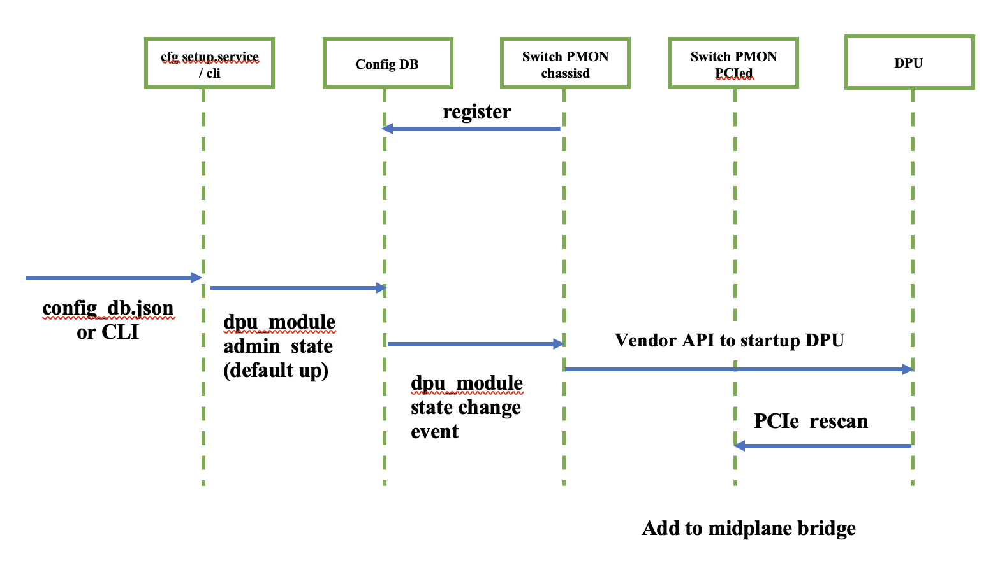
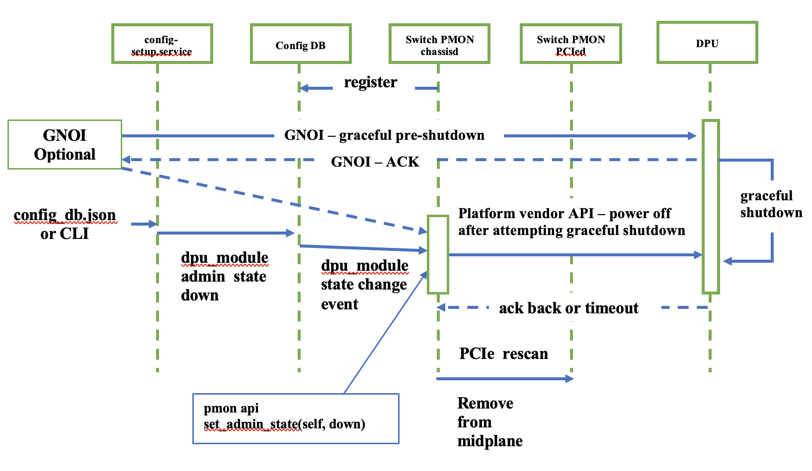

# SmartSwitch PMON High Level Design

| Rev | Date | Author | Change Description |
| --- | ---- | ------ | ------------------ |
| 0.1 | 12/02/2023 | Ramesh Raghupathy | Initial version|
| 0.2 | 01/08/2024 | Ramesh Raghupathy | Updated API, CPI sections and addressed review comments |
| 0.3 | 02/26/2024 | Ramesh Raghupathy | Addressed review comments |

## Definitions / Abbreviations

| Term | Meaning |
| --- | ---- |
| PMON | Platform Monitor |
| DLM | Device Lifecycle Manager |
| NPU | Network Processing Unit |
| DPU | Data Processing Unit |
| PDK | Platform Development Kit |
| SAI | Switch Abstraction Interface |
| GPIO | General Purpose Input Output |
| PSU | Power Supply Unit |
| I2C | Inter-integrated Circuit communication protocol |
| SysFS | Virtual File System provided by the Linux Kernel |
| CP | Control Plane |
| DP | Data Plane |

## 1. Introduction
SmartSwitch offloads the Packet Processors (NPUs) and the host CPUs, freeing up resources for application performance, thereby performing layer four to layer seven functions in a cost effective and space saving way. 

The specialized DPUs when built into a regular switch, can provide such a capability, which is being referred as SmartSwitch.
Platform monitor PMON in SONiC is a container responsible for chassis management functions to ensure proper operation of the devices and peripherals in the chassis there by ensuring the proper operation of the product. 

The typical lifecycle of a product involves the following stages.

<p align="center"></p>

The following sub-tasks are performed under each stage
* Onboarding
    * Boot, Shutdown, Power Cycle
    * Rest, PCIe-Reset
* Monitoring
    * Device State (dpu_state)
    * Sensors, PSUs, Cooling Devices, Thermal management
    * Show CLIs
* Detection and Debugging
    * DPU Health
    * Alarms, Syslog
    * Console
* RMA
    * Inventory

The purpose of this document is to provide a framework to share the state, health, alarms of the DPUs, manage the DPUs by providing support to monitor, gracefully shutdown, restart them and the associated peripherals such as thermal sensors, cooling devices, LEDs, etc.

The picture below highlights the PMON vertical and its association with other logics within the SONiC architecture.

<p align="center"></p>

## 2.	Requirements and Assumptions

### 2.1.    Onboarding
* The SmartSwitch host PMON should be able to Startup, Shutdown, Restart, and Soft Reboot the entire system or the individual DPUs. The DPU_MODULE will behave like the LINE_CARD_MODULE of a modular chassis with respect to these functions.

#### SmartSwitch PowerUp sequence:
* When the smartswitch device is booted, the host will boot first and leave the DPUs either up or down depending on the configuration. The DPUs will be up by default.
* This section describes the cold startup, shutdown, restart and soft reboot. 

### Cold Startup
#### Definition
* The device is initially powered down.  Turn on the power and the device boots into its default state. The Switch and all the DPUs will be up or down depending on the configuration
* Switch: Turning on the power will boot the switch and be ready for traffic
* DPU: Turning on the power to the DPU will boot and be ready for traffic
#### Trigger
* Switch: Power on switch.
* DPU: Configuration or CLI using platform API
#### Use case
* Switch: Day0 setup, Maintenance, RMA
* DPU: Day0, Day1-N Provisioning, Maintenance, RMA
#### DPU cold startup Sequence
* The chassis is powered up and the host is booting up.
* The switch PMON is registered with the configDB state change handler.
* DPU "admin_status: up" is set in the configDB.
* The switch PMON gets the admin up notification from the configDB
* The switch PMON invokes the platform API to power on the DPU
* DPU boots up and attaches itself to the midplane.
* Once SONiC is up, the state progression is updated for every state transition on the DPU_STATE table in the chassisStateDB

### DPU startup sequence diagram
<p align="center"></p>

#### Configuring startup and shutdown
* The DPUs can be powered down by configuring the admin_status as shown.
* The corresponding switch configDB table is also shown

#### config_db.json
CHASSIS_MODULE table holds the list and configuration of DPU modules in a smartswitch chassis. It allows user to administratively bring down a DPU
```
{
    "CHASSIS_MODULE": {
        "DPU0": {
            "admin_status": "down"
        },
        "DPU1": {
            "admin_status": "down"
        }
    }
}
```
#### switch configDB
```
Key: "CHASSIS_MODULE|DPU0"
    "CHASSIS_MODULE|DPU0": {
        "value": {
            "admin_status":"down"
        }
    }
```

### Shutdown
#### Definition
* The device will be in powered up state.  Gracefully shutdown and tun off the power
* Switch: Gracefully shutdown all DPU SONiC turn off DPU power. Gracefully shutdown Switch SONiC and tun off the power to the switch
* DPU: Gracefully shutdown SONiC and turn off power
#### Trigger
* Switch: Configuration or CLI using platform API
* DPU: Configuration or CLI using platform API
#### Use case
* Switch: Maintenance, Critical alarm, RMA
* DPU: Maintenance, Critical alarm, Service migration, RMA
#### DPU shutdown sequence
* There could be two possible sources for DPU shutdown. 1. A configuration change to DPU "admin_status: down" 2. The GNOI logic can trigger it when it fails to communicate with the DPU.
* The host sends a GNOI signal to gracefully shutdown the DPU.  Upon timeout the host may trigger the switch PMON to shutdown the DPU. NPU-DPU (GNOI) soft reboot workflow will be captured in another document.
* In the first option the "admin_status: down" configDB status change event will send a message to the switch PMON.
* The switch PMON will invoke the platform API to shutdown the DPU
* The DPU upon receiving the shutdown message will do a graceful shutdown and send an ack back.
* The switch upon receiving the ack or timeout will remove the DPU from the bridge and PCIe tree.
### DPU shutdown sequence diagram
<p align="center"></p>

### Restart
#### Definition
* The device will be in powered up state.  Gracefully shutdown and tun off the power. Then turn on the power and the system will boot up
* Switch: Not Applicable (This can be done in two steps Shutdown + Cold Startup)
* DPU: Gracefully shutdown SONiC and turn off power to DPU and then power on DPU
#### Trigger
* Switch: Not Applicable
* DPU: Configuration or CLI using platform API (off followed by on)
#### Use case
* Switch: Maintenance
* DPU: Maintenance, Service migration

### Soft Reboot
#### Definition
* Gracefully restart SONiC without turning off the power. This is covered in “SmartSwitch-Reboot-Design.md” and mentioned here for the sake of completeness.
* Switch: Gracefully restart SONiC on switch and the DPUs that are up
* DPU: Gracefully restart SONiC on DPU
#### Trigger
* Switch: “reboot” command issued on switch console.
* DPU: “reboot” command issued on DPU console or Switch Software issues GNOI
#### Use case
* Switch: Fault recovery, Maintenance, debug
* DPU: Fault recover, Maintenance, debug, Service provisioning
##### NPU-DPU (GNOI) soft reboot workflow will be captured in another document.

#### Onboarding requirements
* The DPU must provide additional control-plane and data-plane state information, timestamp, etc to DPU_STATE table as explained in the DPU_STATE schema once booted up.
* When the DPU reboots itself, should log the reboot cause and update the previous-reboot-cause field in the stateDB
* The reboot-cause history on the switch should provide a holistic view of the reboot cause of the SmartSwitch host CPU, and the reboot-cause of all the DPUs
* The DPUs should be uniquely identified and the DPU upon boot may get this ID from the host and identify itself.
* Implement the required API enhancements and new APIs for DPU management (see details in design section)
* SmartSwitch should use the existing SONiC midplane-interface model in modular chassis design for communication between the DPU and the NPU/Switch
* SmartSwitch should extend the SONiC modular chassis design and treat the dpu-cards just like line-cards in existing design
* Reboot
    * Only cold reboot of DPUs is required, warm boot support is not required.

### 2.2. Monitoring and Thermal Management
* Dpu State
    * The DPUs should provide their state to the host by updating the dpu state data in the DPU_STATE table in the host ChassisStateDB (explained in DB schema). This holds the minimal, viable set of low latency dpu state data and can be consumed by HA, LB, FaultManagement logics.
    * DPUs should be able to store the data using a redis call directly on to the switch chassisStateDB
    * The DPU must provide the state information once it boots its OS to DPU_STATE table.

* Thermal management
    * Besides additional DPU specific sensors, cooling device changes the logic remains the same.
    * Sensor values, fan speeds and fan status should be read periodically and stored in SmartSwitch StateDB
    * Platform modules should use the thermal sensor values against the thresholds in the thermal policy and adjust fan speeds depending on the temperature
    * Trigger thermal shut down on critical policy violation

* Show CLIs
    * Extend existing CLIs such as 'show platform fan/temperature' to support the new HW
    * Extend the modular chassis CLI 'show chassis modules status" to display the detailed DPU states. (See CLIs section)

### 2.3. Detect and Debug
* Health
    * SmartSwitch DPUs should store their health data locally
    * DPUs should support a CLI to display the health data “show system-health ...” (See CLIs section)
    * The host pmon should be able to access this data via gRPC or a similar mechanism, but it is implementation specific.
    * Vendor specific data such as interrupt events can also be placed in user defined fields under this DB
    * This table already exists in modular chassis design and the DPUs will use this just like a line card.
* Alarm and Syslog
    * Raise alarms when the temperature thresholds exceed, fans run slow or not present or faulty
    * Drive LEDs accordingly
    * Provide LED status indicators for DPU boards
    * Trigger syslog
* Console
    * Provide console access to the DPUs through the Host CPU from the front panel management port
    * The modular chassis console utility will be extended to access DPUs in place of LCs
### 2.3. RMA
* The DPUs should be displayed as part of inventory
* Extend the platform specific CLIs such as “show platform inventory” to display the DPUs
* The system should be powered down for replacement of dpu-card

## 3.	SmartSwitch PMON Design
SmartSwitch PMON block diagram
<p align="center"></p>

### 3.1. Platform monitoring and management
* SmartSwitch design Extends the existing chassis_base and module_base as described below.
* Extend MODULE_TYPE in ModuleBase class with MODULE_TYPE_DPU and MODULE_TYPE_SWITCH to support SmartSwitch
#### 3.1.1 ChassisBase class API enhancements
is_modular_chassis(self):
```
    Retrieves whether the sonic instance is part of modular chassis. Smartswitch
    chassis is fixed, the modular chassis class is extended to support DPUs

    Returns:
      False
```

get_num_modules(self):
```
    Retrieves the number of modules available on this chassis including DPUs.
    This is an existing API.

    Returns:
        An integer, the number of modules available on this chassis
```

get_all_modules(self):
```
    Retrieves all modules available on this chassis including DPUs

    Returns:
        A list of objects derived from ModuleBase representing all modules
        available on this chassis
```

get_module(self, index):
```
    Retrieves module represented by index <index> switch:0, DPU1:1 and so on

    Args:
        index: An integer, the index of the module to retrieve

    Returns:
        An object derived from ModuleBase representing the specified module
```

get_module_index(self, module_name):
```
    Retrieves module index from the module name

    Args:
        module_name: A string, Ex. SWITCH, DPU1, DPU2 ... DPUX

    Returns:
        An integer, the index of the ModuleBase object in the module_list
```
#### 3.1.2 ChassisBase class new APIs
The DPU ID is used only for indexing purpose.

get_dpu_id(self, name):
```
    Retrieves the DPU ID for the given dpu-module name. Returns None for non-smartswitch chassis.

    Returns:
        An integer, indicating the DPU ID Ex: name:DPU0 return value 1, name:DPU1 return value 2, name:DPUX return value X+1
```

is_smartswitch(self):
```
    Retrieves whether the sonic instance is part of smartswitch

    Returns:
      True
```

get_module_dpu_port(self, index):
```
    Retrieves the DPU port - internal ASIC port for DPU represented by
    DPU index. Platforms that require to overwrite the platform.json file
    will use this API

    This is valid only on the Switch and not on DPUs

    Args:
        index: An integer, the index of the module to retrieve

    Returns:
        DPU Port: A string Ex: For index:0 "dpu0", index:1 "dpu1"
        See the NPU to DPU port mapping
```
#### 3.1.3 NPU to DPU data port mapping
platform.json of NPU/switch will show the NPU to DPU data port mapping. This will be used by services early in the system boot. 
```
"DPUs" : [
    {
      "dpu0": {
                "Ethernet-BP0":  "Ethernet0"
       }
    },
    {
       "dpu1": {
                "Ethernet-BP1":  "Ethernet0"
        },
    },
    .
    .
    {
       "dpuX": {
                "Ethernet-BPX":  "Ethernet0"
        },
    },

]
```
On the DPU's platform.json, we can have 
```
DPU: {

  // Anything specific to DPU, else remain empty

}
```
#### 3.1.4 ModuleBase class API enhancements
get_base_mac(self):
```
    Retrieves the base MAC address for the module

    Returns:
        A string containing the MAC address in the format 'XX:XX:XX:XX:XX:XX'
```

get_system_eeprom_info(self):
```
    Retrieves the full content of system EEPROM information for the DPU module

    Returns:
        DPU modules return a dictionary with key value pairs of IDPROM 
```

get_name(self):
```
    Retrieves the name of the device

    Returns:
        string: The name of the device. Ex; SWITCH, DPU0, DPUX
```

get_description(self):
```
    Retrieves the platform vendor's product description of the module

    Returns:
        A string, providing the vendor's product description of the module.
```

get_type(self):
```
    Retrieves the type of the module.

    Returns:
        A string, the module-type from one of the predefined types:
        MODULE_TYPE_SWITCH, MODULE_TYPE_DPU
```

get_oper_status(self):
```
    Retrieves the operational status of the module
    This information is not sufficient for debugging complex DPU failures.
    So, couple of new CLIs will be introduced.

    Returns:
        A string, the operational status of the module from one of the
        predefined status values: MODULE_STATUS_EMPTY, MODULE_STATUS_OFFLINE,
        MODULE_STATUS_FAULT, MODULE_STATUS_PRESENT or MODULE_STATUS_ONLINE
```

reboot(self, reboot_type):
```
    Request to reboot the module

    Args:
        reboot_type: A string, the type of reboot requested from one of the
        predefined reboot types: MODULE_REBOOT_DEFAULT,
        MODULE_REBOOT_CPU_COMPLEX, or MODULE_REBOOT_FPGA_COMPLEX

    Returns:
        bool: True if the request has been issued successfully, False if not
```

set_admin_state(self, up):
```
    Request to keep the card/DPU in administratively up/down state.
    Default state is down.
```

get_maximum_consumed_power(self):
```
    Retrieves the maximum power drawn by this module

    Returns:
        A float, with value of the maximum consumable power of the
        module.
```

get_midplane_ip(self):
```
    Retrieves the midplane IP-address of the module
    When called from the DPU, returns the midplane IP-address of the dpu-card.
    When called from the Switch returns the midplane IP-address of Switch.

    Returns:
        A string, the IP-address of the module reachable over the midplane
```

is_midplane_reachable(self):
```
    Retrieves the reachability status of the module from the Supervisor or
    of the Supervisor from the module via the midplane of the modular chassis

    Returns:
        A bool value, should return True if module is reachable via midplane
```
#### 3.1.5 ModuleBase class new APIs

##### 3.1.5.1 Need for consistent storage and access of DPU reboot cause, state and health
1.  The smartswitch needs to know the reboot cause for DPUs. Please refer to the CLI section for the various options and their effects when executed on the switch and DPUs. 

    Table shows the frame work for DPU reboot-cause reporting. This will be added to existing list of "Possible reboot causes" under "ChassisBase Class".

    | DPU Reboot Cause | HW/SW | End_User_Message_in_DPU_STATE |
    | --- | --- | --- |
    | REBOOT_CAUSE_POWER_LOSS | HW | Power failure |
    | REBOOT_CAUSE_HOST_RESET_DPU | SW | Host lost DPU - Try resetting DPU |
    | REBOOT_CAUSE_HOST_POWERCYCLE_DPU | SW | Host lost DPU - Power cycled DPU |
    | REBOOT_CAUSE_SW_THERMAL |	SW | Switch software Powered Down DPU due to DPU temperature failure |
    | REBOOT_CAUSE_DPU_SELF_REBOOT | SW | DPU Software reboots the DPU |

2. Though the get_oper_status(self) can get the operational status of the DPU Modules, the current implementation only has limited capabilities.
    * Can only state MODULE_STATUS_FAULT and can't show exactly where in the state progression the DPU failed. This is critical in fault isolation, DPU switchover decision, resiliency and recovery
    * Though this is platform implementation specific, in a multi vendor use case, there has to be a consistent way of storing and accessing the information.
    * Store the state progression (dpu-npu-midplane-link, dpu-booted, dpu-controlplane, dpu-dataplane) on the host ChassisStateDB.
    * get_state_info(self) will return an object with the ChassisStateDB data
    * Potential consumers: HA, LB, Switch CLIs, Utils (install/repair images), Life Cycle Manager 
    * Use cases: HA, Debuggability, error recovery (reset, power cycle) and fault management, consolidated view of Switch and DPU state

* ChassisStateDB Schema for DPU_STATE
    ```
    Table: “DPU_STATE”

    SCHEMA
    key:  DPU_STATE|DPU0

        "id": "1",
        ”npu_dpu_midplane_link”: up        
        “npu_dpu_midplane_link_time": "timestamp",
        " npu_dpu_midplane_link_reason": "up_down_related string",
        ”dpu_booted": "UP",
        "dpu_booted _time": " timestamp ",
        "dpu_booted _reason": "up_down_related string",
        ”dpu_control_plane": up
        ”dpu_control_plane_time": ”timestamp",
        ”dpu_control_plane_reason": ”containers restarting",
        ”dpu_data_plane": ”DOWN",
        ”dpu_data_plane_time": ”timestamp",
        ”dpu_data_plane_reason": ”Pipeline failure",
    ```

3. Each DPU has to store the health data in its local DB and should provide it to the switch PMON when requested (gRPC).
* When the "show system-health ..." CLI is executed on the switch, it will fetch the corresponding information for the DPUs and provide a consolidated view of the system-health.
* The DPU is a complex hardware, to facilitate debug, a consistent way of storing and accessing the health record of the DPUs is critical in a multi vendor scenario even though it is a platform specific implementation.
* Both switch and the DPUs will follow to the [SONiC system health monitor HLD](https://github.com/sonic-net/SONiC/blob/ce313db92a694e007a6c5332ce3267ac158290f6/doc/system_health_monitoring/system-health-HLD.md)
* Refer to section 3.4.5 for "show system-health .." CLIs

##### 3.1.5.2 ModuleBase class new APIs
The DPU ID is used only for indexing purpose.

get_dpu_id(self):
```
    Retrieves the DPU ID. Returns None for non-smartswitch chassis.

    Returns:
        An integer, indicating the DPU ID. DPU0 returns 1, DPUX returns X-1
```
#### Get DPU reboot cause
def get_reboot_cause(self, index):
        """
        Retrieves the cause of the previous reboot

        Returns:
            A tuple (string, string) where the first element is a string
            containing the cause of the previous reboot. This string must be
            one of the predefined strings in this class. If the first string
            is "REBOOT_CAUSE_HARDWARE_OTHER", the second string can be used
            to pass a description of the reboot cause.
        """

#### DPU_STATE Use Case
* High Availability, Load Balancing, Debug, error recovery (reset, power cycle) and fault management logics will use this API

get_state_info(self, index):
```
    Retrieves the dpu state object having the detailed dpu state progression.
    Fetched from ChassisStateDB.

    Returns:
        An object instance of the DPU_STATE (see DB schema)
        Returns None when the index is 0 (switch)
```

#### DPU_HEALTH Use Case
* The major consumer of this data could be fault management, debug, error recovery 

get_health_info(self, index):
```
    Retrieves the dpu health object having the detailed dpu health
    Fetched from the DPUs

    Returns:
        An object instance of the dpu health
        Returns None when the index is 0 (switch)
```

### 3.2 Thermal management
* Platform  initializes all sensors
* Thermalctld fetch CPU temperature, DPU temperature, fan speed, monitor and update the DB
* Thermal manager reads all thermal sensor data, run thermal policy and take policy action Ex. Set fan speed, set alarm, set syslog, set LEDs 
* Platform collects fan related data such as presence, failure and then applies fan algorithm to set the new fan speed
* The north bound CLI/Utils/App use DB data to ”show environment”, ”show platform temp” show platform fan”

Thermal management sequence diagram
<p align="center"></p>

#### 3.2.1 Platform device data collection 
* thermalctld, led and PSUd post device data to DB periodically
* during the boot up of the daemons, it will collect the constant data like serial number, manufacture name, etc.
* For the variable ones (temperature, voltage, fan speed ....) need to be collected periodically. 

### 3.3   Midplane Interface
A typical modular chassis includes a midplane-interface to interconnect the Supervisor & line-cards. When DPU card or the Switch boots and as part of its initialization, midplane interface gets initialized.
* By default smartswitch midplane IP address assignment will be done using internal DHCP. Please refer to the [ip-address-assignment](https://github.com/sonic-net/SONiC/blob/master/doc/smart-switch/ip-address-assigment/smart-switch-ip-address-assignment.md) for IP address assignment between the switch host and the DPUs.
* The second option is the static IP address assignment. This will be described in another document.

### 3.4 Debug & RMA
CLI Extensions and Additions

#### Platform CLIs
* Platform CLIs remain the same but include DPU, and changes in sensors and FRUs. The "show platform inventory" is an example to display the DPU modules.

show platform inventory 
* shows the DPUs on the switch          <font>**`Executed on the switch. This CLI is not available on the DPU`**</font>

```
root@sonic:~#show platform inventory

    Name                Product ID      Version         Serial Number   Description

Chassis
    CHASSIS             28FH-DPU-O 	0.10            FLM274802ER     28x400G QSFPDD DPU-Enabled 2RU Smart Switch,Open SW

Route Processors
    RP0                 28FH-DPU-O 	0.10            FLM274802ER     28x400G QSFPDD DPU-Enabled 2RU Smart Switch,Open SW

DPU Modules
    DPU0                8K-DPU400-2A    0.10            FLM2750036X     400G DPU 
    DPU1                8K-DPU400-2A    0.10            FLM2750036S     400G DPU 
    DPU2                8K-DPU400-2A    0.10            FLM274801EY     400G DPU 
    DPU3                8K-DPU400-2A    0.10            FLM27500371     400G DPU

Power Supplies                                                                
    psutray                                                                                                                                                             
        PSU0            PSUXKW-ACPI     0.0             POG2427K01K     AC Power Module with Port-side Air Intake                                                 
        PSU1            PSUXKW-ACPI     0.0             POG2427K00Y     AC Power Module with Port-side Air Intake                                                 

Cooling Devices
    fantray0            FAN-2RU-PI-V3   N/A             N/A             8000 Series 2RU Fan 
    fantray1            FAN-2RU-PI-V3   N/A             N/A             8000 Series 2RU Fan 

FPDs
    RP0/info.0                          0.5.6-253      

```

show platform temperature - shows the DPU temperature on the switch        <font>**`Executed on the switch. This CLI is not available on the DPU`**</font>
```
root@sonic:~#show platform temperature

         Sensor    Temperature    High TH    Low TH    Crit High TH    Crit Low TH    Warning          Timestamp
---------------  -------------  ---------  --------  --------------  -------------  ---------  -----------------
        DPU_0_T         37.438      100.0      -5.0           105.0          -10.0      False  20230728 06:39:18
        DPU_1_T         37.563      100.0      -5.0           105.0          -10.0      False  20230728 06:39:18
        DPU_2_T           38.5      100.0      -5.0           105.0          -10.0      False  20230728 06:39:18
        DPU_3_T         38.813      100.0      -5.0           105.0          -10.0      False  20230728 06:39:18
     FAN_Sensor         23.201      100.0      -5.0           102.0          -10.0      False  20230728 06:39:18
 MB_PORT_Sensor         21.813       97.0      -5.0           102.0          -10.0      False  20230728 06:39:18
MB_TMP421_Local          26.25      135.0      -5.0           140.0          -10.0      False  20230728 06:39:18
       SSD_Temp           40.0       80.0      -5.0            83.0          -10.0      False  20230728 06:39:18
   X86_CORE_0_T           37.0      100.0      -5.0           105.0          -10.0      False  20230728 06:39:18
   X86_PKG_TEMP           41.0      100.0      -5.0           105.0          -10.0      False  20230728 06:39:18
```
show platform fan - shows the fan speed and status on the switch. <font>**`Executed on the switch. This CLI is not available on the DPU`**</font>
```
root@sonic:~#show platform fan

  Drawer    LED           FAN    Speed    Direction    Presence    Status          Timestamp
--------  -----  ------------  -------  -----------  ----------  --------  -----------------
     N/A    N/A     PSU0.fan0      50%          N/A     Present        OK  20230728 06:41:18
     N/A    N/A     PSU1.fan0      50%          N/A     Present        OK  20230728 06:41:18
fantray0    N/A  fantray0.fan      55%       intake     Present        OK  20230728 06:41:17
fantray1    N/A  fantray1.fan      56%       intake     Present        OK  20230728 06:41:17
```

#### 3.4.1 Reboot Cause
* There are two CLIs "show reboot-cause" and "show reboot-cause history" which are applicable to both DPUs and the Switch. However, when executed on the Switch the CLIs provide a consolidated view of reboot cause as shown below.
* The switch will fetch the reboot-cause history from each of the DPUs as needed when the CLI is issued on the switch.

#### 3.4.2 Reboot Cause CLIs on the DPUs      <font>**`Executed on the DPU`**</font>
* The "show reboot-cause" shows the most recent reboot-cause of th
* The "show reboot-cause history" shows the reboot-cause history
```
root@sonic:~#show reboot-cause

Name                    Cause                       Time                                User    Comment

2023_10_02_17_20_46     reboot                      Sun 02 Oct 2023 05:20:46 PM UTC     admin   User issued 'reboot'

root@sonic:~#show reboot-cause history

Name                    Cause                       Time                                User    Comment

2023_10_02_17_20_46     reboot                      Sun 02 Oct 2023 05:20:46 PM UTC     admin   User issued 'reboot'
2023_10_02_18_10_00     reboot                      Sun 02 Oct 2023 06:10:00 PM UTC     admin   User issued 'reboot'
```
#### 3.4.3 Reboot Cause CLIs on the Switch      <font>**`Executed on the switch`**</font>
* The "show reboot-cause" CLI on the switch shows the most recent rebooted device, time and the cause. The could be the NPU or any DPU
* The "show reboot-cause history" CLI on the switch shows the history of the Switch and all DPUs
* The "show reboot-cause history module-name" CLI on the switch shows the history of the specified module

"show reboot-cause history"      <font>**`Executed on the switch`**</font>
```
root@sonic:~#show reboot-cause

Device          Name                    Cause                       Time                                User    Comment

switch          2023_10_20_18_52_28     Watchdog:1 expired;         Wed 20 Oct 2023 06:52:28 PM UTC     N/A     N/A

root@sonic:~#show reboot-cause history

Device          Name                    Cause                       Time                                User    Comment

switch          2023_10_20_18_52_28     Watchdog:1 expired;         Wed 20 Oct 2023 06:52:28 PM UTC     N/A     N/A
switch          2023_10_05_18_23_46     reboot                      Wed 05 Oct 2023 06:23:46 PM UTC     user    N/A
DPU0            2023_10_04_18_23_46     Power Loss                  Tue 04 Oct 2023 06:23:46 PM UTC     N/A     N/A
DPU3            2023_10_03_18_23_46     Watchdog: stage 1 expired;  Mon 03 Oct 2023 06:23:46 PM UTC     N/A     N/A
DPU3            2023_10_02_18_23_46     Host Power-cycle            Sun 02 Oct 2023 06:23:46 PM UTC     N/A     Host lost DPU
DPU3            2023_10_02_17_23_46     Host Reset DPU              Sun 02 Oct 2023 05:23:46 PM UTC     N/A     N/A
DPU2            2023_10_02_17_20_46     reboot                      Sun 02 Oct 2023 05:20:46 PM UTC     admin   User issued 'reboot'

"show reboot-cause history <module-name>"

root@sonic:~#show reboot-cause history dpu3

Device      Name                    Cause                           Time                                User    Comment 
   
DPU3        2023_10_03_18_23_46     Watchdog: stage 1 expired;      Mon 03 Oct 2023 06:23:46 PM UTC     N/A     N/A
DPU3        2023_10_02_18_23_46     Host Power-cycle                Sun 02 Oct 2023 06:23:46 PM UTC     N/A     Host lost DPU
DPU3        2023_10_02_17_23_46     Host Reset DPU                  Sun 02 Oct 2023 05:23:46 PM UTC     N/A     N/A
```
#### 3.4.4 Chassis Module Status
* The "show chassis modules status" is an existing CLI but extended to include the status of all DPUs and switch. <font>**`Executed on the switch. This CLI is not available on the DPU.`**</font>
```
root@sonic:~#show chassis modules status                                                                                      
Name        Description         ID         Oper-Status     Admin-Status     Serial

DPU0        SS-DPU0             1           Online          up              SN20240105
DPU1        SS-DPU1             2           Online          up              SN20240102
...
SWITCH      Chassis             0           Online          N/A             FLM27000ER
```
* The "show chassis modules status" is extended to include the DPU_STATE detail.
show chassis modules status all <font>**`Executed on the switch. This CLI is not available on the DPU.`**</font>
```
root@sonic:~#show chassis modules status all                                                                                    
Name        Description      ID      Oper-Status  State-Detail          State-Value     Admin-Status     Serial

DPU0        SS-DPU0          1       Online       host-dpu-midplane-link    up                up         SN20240105
                                                  dpu-booted                up
                                                  dpu-controlplane          up
                                                  dpu-dataplane             up

DPU1        SS-DPU1          2       Online       host-dpu-midplane         up                up         SN20240235
                                                  dpu-booted                up
                                                  dpu-ControlPlane          up
                                                  dpu-DataPlane             down
...
SWITCH      Chassis          0       Online       NA                        NA                NA          FLM27000ER
```
* show chassis modules status detail module-name <font>**`Executed on the switch. This CLI is not available on the DPU.`**</font>
```
root@sonic:~#show chassis modules status detail  DPU0                                                                                 
Name        Description      ID      Oper-Status  State-Detail             State-Value     Admin-Status     Serial

DPU0        SS-DPU0          1       Online       host-dpu-midplane-link    up                   up         SN20240105
                                                  host-booted               up
                                                  dpu-ControlPlane          up
                                                  dpu-DataPlane             up

```
#### 3.4.5  System health details
* The system health summary on NPU should include the DPU health. If one or more DPUs are not ok it should be highlighted in the command output
* This will allow to reuse the existing infrastructure that allows to signal the user about the issue on the system and change the system status LED to red.

show system-health summary      <font>**`Executed on the switch or DPU`**</font>
```
System status summary

  System status LED  red
  Services:
    Status: Not OK
    Not Running: dpu:dpu0, dpu:dpu1
  Hardware:
    Status: OK
 ```
 * Detailed output from the switch can be obtained with the following CLI
 * The system health monitor list command should include the status of the DPU. If one or more DPUs are not ok it should be highlighted in the command output
 * The switch will fetch the DPU information stored in the DPU's STATE_DB as needed using a gRPC client running on the switch PMON.

show system-health monitor-list       <font>**`Executed on the switch`**</font>
```
System services and devices monitor list

Name                   Status    Type
---------------------  --------  ----------
…
swss:coppmgrd          OK        Process
swss:tunnelmgrd        OK        Process
eventd:eventd          OK        Process
lldp:lldpd             OK        Process
lldp:lldp-syncd        OK        Process
lldp:lldpmgrd          OK        Process
gnmi:gnmi-native       OK        Process
ASIC                   OK        ASIC
fan1                   OK        Fan
fan2                   OK        Fan
fan3                   OK        Fan
fan4                   OK        Fan
psu1_fan1              OK        Fan
psu2_fan1              OK        Fan
PSU 1                  OK        PSU
PSU 2                  OK        PSU
DPU0                   Not OK    DPU
DPU1                   Not OK    DPU
DPU2                   OK        DPU
DPU3                   OK        DPU
 ```
 Following is the output of "show system-health monitor-list" on DPU.  <font>**`Executed on the DPU`**</font>
```
System services and devices monitor list

Name                      Status    Type
------------------------  --------  ----------
container_checker         Not OK    Program
lldp                      Not OK    Service
sonic                     OK        System
rsyslog                   OK        Process
root-overlay              OK        Filesystem
var-log                   OK        Filesystem
routeCheck                OK        Program
dualtorNeighborCheck      OK        Program
diskCheck                 OK        Program
vnetRouteCheck            OK        Program
memory_check              OK        Program
container_memory_snmp     OK        Program
container_memory_gnmi     OK        Program
container_eventd          OK        Program
database:redis            OK        Process
syncd:syncd               OK        Process
swss:orchagent            OK        Process
swss:vrfmgrd              OK        Process
swss:nbrmgrd              OK        Process
bgp:fpmsyncd              OK        Process
bgp:bgpcfgd               OK        Process
dpu-pdsagent              OK        UserDefine
dpu-pciemgrd              OK        UserDefine
dpu-eth_Uplink1/1_status  OK        UserDefine
dpu-pcie_link             OK        UserDefine
```
 * The previous two CLIs are further extended to show the detail information about the DPU status as shown in the next two CLIs

show system-health monitor-list module DPU_NAME    <font>**`Executed on the switch`**</font>
```
Name                      Status    Type
------------------------  --------  ----------
container_checker         Not OK    Program
lldp                      Not OK    Service
sonic                     OK        System
rsyslog                   OK        Process
root-overlay              OK        Filesystem
var-log                   OK        Filesystem
routeCheck                OK        Program
dualtorNeighborCheck      OK        Program
diskCheck                 OK        Program
vnetRouteCheck            OK        Program
memory_check              OK        Program
container_memory_snmp     OK        Program
container_memory_gnmi     OK        Program
container_eventd          OK        Program
database:redis            OK        Process
syncd:syncd               OK        Process
swss:orchagent            OK        Process
swss:vrfmgrd              OK        Process
swss:nbrmgrd              OK        Process
bgp:fpmsyncd              OK        Process
bgp:bgpcfgd               OK        Process
dpu-pdsagent              OK        UserDefine
dpu-pciemgrd              OK        UserDefine
dpu-eth_Uplink1/1_status  OK        UserDefine
dpu-pcie_link             OK        UserDefine
```
* Consolidated information about statuses of all subsystems can be obtained as shown

show system-health detail        <font>**`Executed on the switch`**</font>
```
System status summary

  System status LED  red
  Services:
    Status: Not OK
    Not Running: snmp:snmpd, snmp:snmp-subagent
  Hardware:
    Status: OK

System services and devices monitor list

Name                   Status    Type
---------------------  --------  ----------
snmp:snmpd             Not OK    Process
snmp:snmp-subagent     Not OK    Process
mtvr-leopard-01        OK        System
rsyslog                OK        Process
root-overlay           OK        Filesystem
var-log                OK        Filesystem
routeCheck             OK        Program
dualtorNeighborCheck   OK        Program
…
System services and devices ignore list

Name    Status    Type
------  --------  ------
…

DPU0 system services and devices monitor list

Name                       Status    Type
-------------------------  --------  ----------
mtvr-r740-04-bf3-sonic-01  OK        System
rsyslog                    OK        Process
…

DPU1 system services and devices monitor list

Name                       Status    Type
-------------------------  --------  ----------
mtvr-r740-04-bf3-sonic-01  OK        System
rsyslog                    OK        Process
…

DPUX system services and devices monitor list

Name                       Status    Type
-------------------------  --------  ----------
mtvr-r740-04-bf3-sonic-01  OK        System
rsyslog                    OK        Process
…
```
show system-health detail        <font>**`Executed on the DPU`**</font>
```
System status summary

  System status LED  green
  Services:
    Status: Not OK
    Not Running: container_checker, lldp
  Hardware:
    Status: OK

System services and devices monitor list

Name                      Status    Type
------------------------  --------  ----------
container_checker         Not OK    Program
lldp                      Not OK    Service
sonic                     OK        System
rsyslog                   OK        Process
root-overlay              OK        Filesystem
var-log                   OK        Filesystem
routeCheck                OK        Program
dualtorNeighborCheck      OK        Program
diskCheck                 OK        Program
vnetRouteCheck            OK        Program
memory_check              OK        Program
container_memory_snmp     OK        Program
container_memory_gnmi     OK        Program
container_eventd          OK        Program
database:redis            OK        Process
syncd:syncd               OK        Process
swss:orchagent            OK        Process
swss:portsyncd            OK        Process
swss:coppmgrd             OK        Process
swss:tunnelmgrd           OK        Process
bgp:zebra                 OK        Process
bgp:staticd               OK        Process
dpu-pdsagent              OK        UserDefine
dpu-pciemgrd              OK        UserDefine
dpu-eth_Uplink1/1_status  OK        UserDefine
dpu-pcie_link             OK        UserDefine

System services and devices ignore list

Name    Status    Type
------  --------  ------
fan     Ignored   Device
psu     Ignored   Device
```
#### Vendor specific health checkers
* If the vendor wants to add additional information specific to the platform it can be done using the user-defined checkers:
* The DPU specific interrupt events can be part of this.

show system-health monitor-list       <font>**`Executed on the switch`**</font>
```
System services and devices monitor list

Name                       Status    Type
-------------------------  --------  ----------
…
bgp:bgpcfgd                OK        Process
CPU                        OK        UserDefine
DDR                        OK        UserDefine
```

show interface status - will show the NPU-DPU interface status also      <font>**`Executed on the switch`**</font>
```
root@sonic:~# show interfaces status
  Interface                                    Lanes    Speed    MTU    FEC    Alias    Vlan    Oper    Admin    Type    Asym PFC
-----------  ---------------------------------------  -------  -----  -----  -------  ------  ------  -------  ------  ----------
  Ethernet0  2816,2817,2818,2819,2820,2821,2822,2823     400G   9100    N/A     etp0  routed    down       up     N/A         N/A
  Ethernet8  2824,2825,2826,2827,2828,2829,2830,2831     400G   9100    N/A     etp1  routed    down       up     N/A         N/A
 Ethernet16  2056,2057,2058,2059,2060,2061,2062,2063     400G   9100    N/A     etp2  routed    down       up     N/A         N/A
 Ethernet24  2048,2049,2050,2051,2052,2053,2054,2055     400G   9100    N/A     etp3  routed    down       up     N/A         N/A
 Ethernet32  1792,1793,1794,1795,1796,1797,1798,1799     400G   9100    N/A     etp4  routed    down       up     N/A         N/A
 Ethernet40  1800,1801,1802,1803,1804,1805,1806,1807     400G   9100    N/A     etp5  routed    down       up     N/A         N/A
 ...
 ...

### These are internal DPU ports ###
...
...
Ethernet-BP0                                  4,5,6,7     200G   9100    N/A   dpu-0  routed    down       up     N/A         N/A
Ethernet-BP1                                  0,1,2,3     200G   9100    N/A   dpu-1  routed    down       up     N/A         N/A
Ethernet-BP2                                8,9,10,11     200G   9100    N/A   dpu-2  routed    down       up     N/A         N/A
Ethernet-BP3                              12,13,14,15     200G   9100    N/A   dpu-3  routed    down       up     N/A         N/A
```

show interface status     <font>**`Executed on the DPU`**</font>
```
root@sonic:/home/admin# show interfaces status
  Interface    Lanes    Speed    MTU    FEC        Alias    Vlan    Oper    Admin    Type    Asym PFC
-----------  -------  -------  -----  -----  -----------  ------  ------  -------  ------  ----------
  Ethernet0  0,1,2,3     200G   9100    N/A  Ethernet1/1  routed      up       up     N/A         N/A
```

## 4.   Test Plan
In Progress
