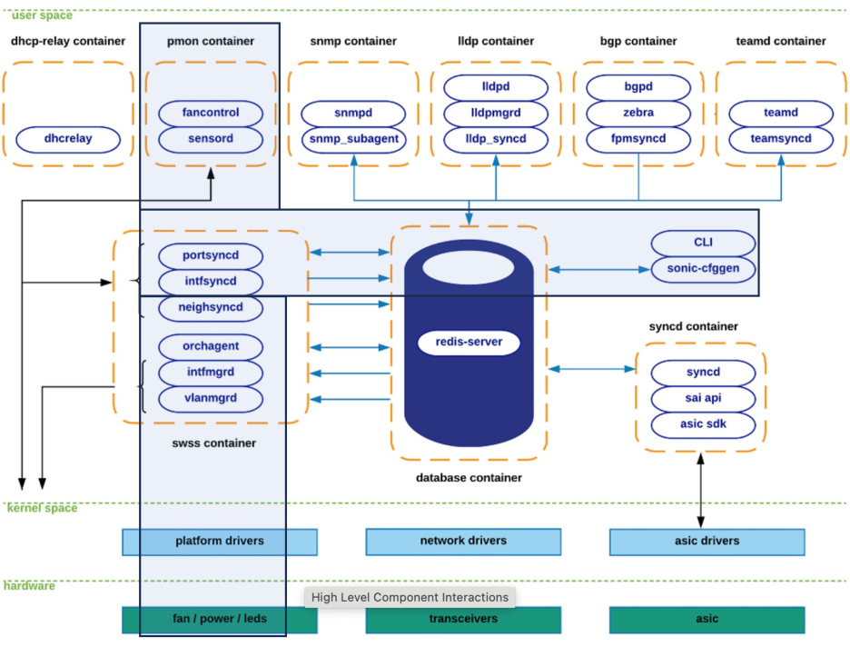
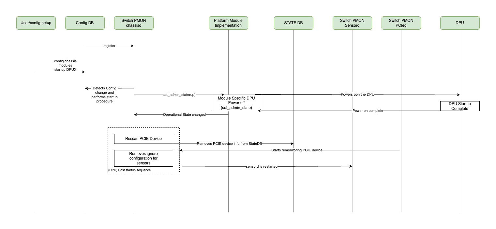
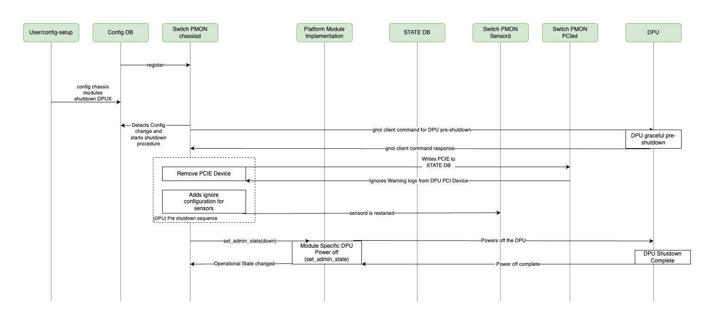
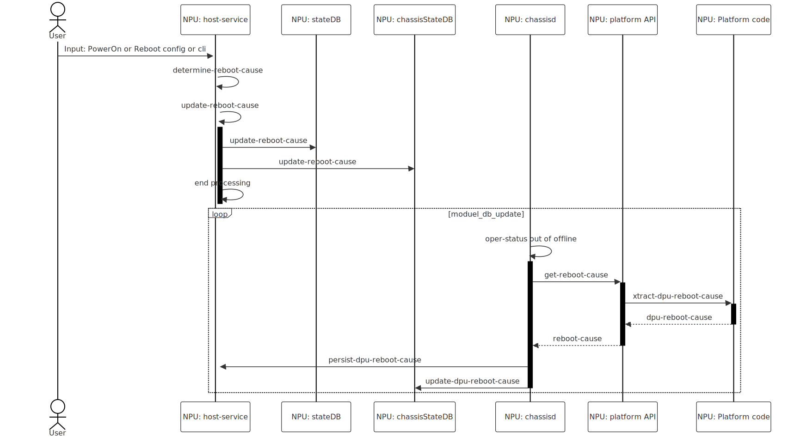

# SmartSwitch PMON High Level Design

| Rev | Date | Author | Change Description |
| --- | ---- | ------ | ------------------ |
| 0.1 | 12/02/2023 | Ramesh Raghupathy | Initial version|
| 0.2 | 01/08/2024 | Ramesh Raghupathy | Updated API, CPI sections and addressed review comments |
| 0.3 | 02/26/2024 | Ramesh Raghupathy | Addressed review comments |
| 0.4 | 06/06/2024 | Ramesh Raghupathy | Added schema for DPU health-info and called out phase:1 and phase:2 activities for DPU health-info. Added key suffix to module reboot-cause to avoid key conflicts |
| 0.5 | 04/30/2025 | Gagan Punathil Ellath | Added Post Startup and Pre shutdown sections for DPU |
| 0.6 | 06/12/2025 | Gagan Punathil Ellath | DPU State Management Implementation |

## Definitions / Abbreviations

| Term | Meaning |
| --- | ---- |
| PMON | Platform Monitor |
| DLM | Device Lifecycle Manager |
| NPU | Network Processing Unit |
| DPU | Data Processing Unit |
| PDK | Platform Development Kit |
| SAI | Switch Abstraction Interface |
| GPIO | General Purpose Input Output |
| PSU | Power Supply Unit |
| I2C | Inter-integrated Circuit communication protocol |
| SysFS | Virtual File System provided by the Linux Kernel |
| CP | Control Plane |
| DP | Data Plane |

## 1. Introduction
SmartSwitch offloads the Packet Processors (NPUs) and the host CPUs, freeing up resources for application performance, thereby performing layer four to layer seven functions in a cost effective and space saving way. 

The specialized DPUs when built into a regular switch, can provide such a capability, which is being referred as SmartSwitch.
Platform monitor PMON in SONiC is a container responsible for chassis management functions to ensure proper operation of the devices and peripherals in the chassis there by ensuring the proper operation of the product. 

The typical lifecycle of a network switch product involves the following stages.

<p align="center"></p>

The following sub-tasks are performed under each stage
* Onboarding
    * Boot, Shutdown, Power Cycle
    * Reset, PCIe-Reset
* Monitoring
    * Device State (dpu_state)
    * Sensors, PSUs, Cooling Devices, Thermal management
    * Show CLIs
* Detection and Debugging
    * DPU Health
    * Alarms, Syslog
    * Console
* RMA
    * Inventory

The purpose of this document is to provide a framework to share the state, health, alarms of the DPUs, manage the DPUs by providing support to monitor, gracefully shutdown, restart them and the associated peripherals such as thermal sensors, cooling devices, LEDs, etc.

The picture below highlights the PMON vertical and its association with other logics within the SONiC architecture.

<p align="center"></p>

## 2.	Requirements and Assumptions

### 2.1.    Onboarding
* The SmartSwitch host PMON should be able to Startup, Shutdown, Restart, and Soft Reboot the entire system or the individual DPUs. The DPU_MODULE will behave like the LINE_CARD_MODULE of a modular chassis with respect to these functions.

### SmartSwitch Power up/down sequence:
* When the smartswitch device is booted, the host will boot first and leave the DPUs down by default.
* This section describes the cold startup, shutdown, restart and soft reboot. 

### Cold Startup
#### Definition
* The device is initially powered down.  Turn on the power and the device boots into its default state. The Switch and all the DPUs will be up or down depending on the configuration
* Switch: Turning on the power will boot the switch and be ready for traffic
* DPU: Turning on the power to the DPU will boot and be ready for traffic
#### Trigger
* Switch: Power on switch.
* DPU: Bootup configuration
#### Use case
* Switch: Day0 setup, Maintenance, RMA
* DPU: Day0, Day1-N Provisioning, Maintenance, RMA
#### DPU cold startup Sequence
* The chassis is powered up and the host is booting up.
* The switch PMON is registered with the configDB state change handler.
* If the DPU's "admin_status: down" in the configDB, the DPU will remain powered down. The default setting is "down".
* The switch PMON gets the admin up notification from the configDB
* The switch PMON invokes the platform API to power on the DPU
* DPU boots up and attaches itself to the midplane.
* If there is ignore configuration relevant to the DPU then we remove the file and restart sensord. The ignore configuration here refers to the sensors which have to be ignored upon the DPU power off by the sensord running on the switch. Example configuration is shown in the `Sample Ignore configuration ignore_module_DPU0.conf` section
* PCIe rescan is performed, The relevant bus information is removed from STATE_DB if it exists
* Once SONiC is up, the state progression is updated for every state transition on the DPU_STATE table in the chassisStateDB

#### DPU post-startup handling

When a DPU module's admin state is changed from "down" to "up", the following post-startup procedures are executed:

1. **PCI Device Rescan**: The `handle_pci_rescan()` function is called to rescan and reattach PCI devices.

    This function calls  the platform specific `pci_reattach()` is called first, and then `get_pci_bus_info()` to get all the PCIe devices associated with the specific DPU, and removes `PCIE_DETACH_INFO` key in STATE_DB relevant to the device. If `pci_reattach()` is not implemented in the specific platform, then no operations are performed in this function

2. **Sensor Addition**: The `handle_sensor_addition()` function is called to handle sensor-related setup.

    If sensors ignore configuration exists in the sensord folder  `/etc/sensors.d/ignore_sensors_{module_name}.conf` , the relevant sensord ignore configuration has to be removed and then we restart the sensord, if such file does not exist, the sensord restart for this module is skipped
 
##### Function Signatures
These functions are added to the `module_base` implementation

```python
def handle_pci_rescan(self):
    """
    Handles PCI device rescan by updating state database and reattaching device.
    Returns:
        bool: True if operation was successful, False otherwise
    """
```

```python
def handle_sensor_addition(self):
    """
    Handles sensor addition by removing the ignore configuration file from
    sensors.d directory and restarting sensord.

    Returns:
        bool: True if operation was successful, False otherwise
    """
```


### DPU startup sequence diagram
<p align="center"></p>

#### 2.1.1 DPUs in dark mode
* A smartswitch when configured to boot up with all the DPUs in it are powered down upon boot up is referred as DPUs in dark mode.
* In the dark mode the platform.json file shown in section "3.1.3" will not have the dictionary for the DPUS.
* The term dark mode is overloaded in some cases where the platform.json may have the dictionary but the config_db.json will have the admin_state of all DPU modules as "down".
* When platform.json has DPU information, but config DB doesn't have the DPU admin state configuration, the DPUs should be in downstate.
* Default mode on smartswitch is dark mode, unless platform.json configures it to be in light up mode.
* The DPUs would stay power down in dark mode and will not consume power.

#### 2.1.2 Configuring startup and shutdown
* The user can use the “config chassis modules startup DPUx”  to power ON a DPU. Example: “config chassis modules startup DPU0”
* The “config chassis modules shutdown DPUx” is used to power OFF a DPU. Example: “config chassis modules shutdown DPU0”
* The DPUs are powered down by configuring the admin_status as shown in the schema
* The config change event handler running on the chassisd of PMON listens to the config change and sets the corresponding switch configDB table and also triggers the module set_admin_state() API.
* The platform executes the power ON/OFF sequence

#### config_db.json
CHASSIS_MODULE table holds the list and configuration of DPU modules in a smartswitch chassis. It allows user to administratively bring down a DPU. The following example assumes four DPUs in the system. Unlike the existing modular chassis configuration in a SmartSwitch a DPU module has to be explicitly configured to be "up", otherwise it be configured in the DB to be down as shown in the example.  The example assumes four DPUs in the system.
```
{
    "CHASSIS_MODULE": {
        "DPU0": {
            "admin_status": "down"
        },
        "DPU1": {
            "admin_status": "up"
        }
    }
    Note: There is no config for DPU2, DPU3 and the default is "down" as shown below
}
```
#### switch configDB
```
Key: "CHASSIS_MODULE|DPU0"
    "CHASSIS_MODULE|DPU0": {
        "value": {
            "admin_status":"down"
        }
    },
    "CHASSIS_MODULE|DPU1": {
        "value": {
            "admin_status":"up"
        }
    },
    "CHASSIS_MODULE|DPU2": {
        "value": {
            "admin_status":"down"
        }
    },
    "CHASSIS_MODULE|DPU3": {
        "value": {
            "admin_status":"down"
        }
    }
```

### Shutdown
#### Definition
* The device will be in powered up state.  Gracefully shutdown and tun off the power
* Switch: Gracefully shutdown all DPU SONiC turn off DPU power. Gracefully shutdown Switch SONiC and tun off the power to the switch
* DPU: Gracefully shutdown SONiC and turn off power
#### Trigger
* Switch: Turn off the power to the switch
* DPU: Configuration or CLI
#### Use case
* Switch: Maintenance, Critical alarm, RMA
* DPU: Maintenance, Critical alarm, Service migration, RMA

#### DPU Power-Off Handling During Graceful Shutdown

When the admin state of the DPU is set to "down" the following actions are taken
The switch has to prepare for the DPUs being powered off. For a graceful shutdown of the DPU, the following events occur:
* The PCIe devices associated with the DPU are removed - This is done as part of the shutdown procedure, the pcie device attached to the DPU is removed
* The sensors which are attached to the DPU (reporting its values to the switch) are no longer functional.

Since the DPU specific PCI devices are removed, the PCIeDaemon which is running on the switch should not create warning logs pertaining to these PCI IDs, the sensord daemon should not create new error logs.
During the graceful shutdown procedure, We need to notify pciedaemon that the PCIE devices have been removed, and sensord should ignore the relevant sensors so that we can remove 
This procedure should only be performed in case of module implementation specific to smartswitch platforms, as this is not relevant for other platforms. As we are only implementing new functions in the module base implementation, it would be only called by chassisd/reboot implementation in case of smartswitch platforms, this distinction should be done in chassisd/reboot script

When a DPU module's admin state is set to "down", the following pre-shutdown procedures are executed:

* **PCI Device Removal**: The `handle_pci_removal()` function is called to properly detach PCI devices from the system.

    This function calls `get_pci_bus_info()` to get all the PCIe devices associated with the specific DPU, and adds `PCIE_DETACH_INFO` key in STATE_DB relevant to the device, after all the device information is added to STATE_DB, the platform specific `pci_detach()` is called. If `pci_detach()` is not implemented, then we just return false for this function (we do not perform any operation)

* **Sensor Removal**: The `handle_sensor_removal()` function is called to handle sensor-related cleanup.

    If sensors have to be ignored on DPU shutdown, the relevant sensord ignore configuration has to be added to the device folder in sonic-buildimage, `sonic-buildimage/device/<Platform>/<device>/module_sensor_ignore_conf`, after build this is moved to the following folder in PMON: `/usr/share/sonic/platform/module_sensor_ignore_conf`. The ignore configuration for a specific DPU should follow the following format: `ignore_sensors_<Module_Name>.conf`. If this file exists for a specific DPU Module, then this is copied to `/etc/sensors.d/ignore_sensors_{module_name}.conf` and then we restart sensord. If the file does not exist, then we skip further processing for this function 

##### Function Signatures
These functions are added to the `module_base` implementation


```python
def get_pci_bus_info(self):
        """
        Retrieves the bus information.

        Returns:
            Returns the PCI bus information in list of BDF format like "[DDDD:]BB:SS:F"
        """
```

```python
def handle_pci_removal(self):
    """
    Handles PCI device removal by updating state database and detaching device.
    Returns:
        bool: True if operation was successful, False otherwise
    """
```

```python
def handle_sensor_removal(self):
    """
    Handles sensor removal by copying ignore configuration file from platform folder
    looks for ignore configuration in: 
    /usr/share/sonic/platform/module_sensor_ignore_conf/ignore_sensors_{module_name}.conf
    to sensors.d directory and restarting sensord if the file exists.

    Returns:
        bool: True if operation was successful, False otherwise
    """
```


#### Implementation Details

```
PCIE_DETACH_INFO STATE_DB TABLE 

"PCIE_DETACH_INFO|[DDDD:]BB:SS.F": {
  "value": {
    "dpu_state": "detaching",
    "bus_info" : "[DDDD:]BB:SS.F"
  }
}
```
```
Sample Ignore configuration ignore_module_DPU0.conf

bus "i2c-xx" "i2c-1-mux (chan_id xx)"
    chip "xxxx-i2c-xx-xx"
        ignore in1
        ignore in2
        ignore in3
```

These functions are called by chassisd when we perform admin state changes by changing config_db. The platform implementation should call these functions at the appropriate times during the admin state change process.

The implementation in chassisd will follow this sequence:

```python
def set_admin_state(self, up):
    if up:
        module.set_admin_state(up) 
        module.handle_pci_rescan() # No action taken if it is not implemented
        self.handle_sensor_addition() # No action taken  if there is no ignore sensord configuration
    else:
        self.handle_sensor_removal()# No action taken if there is no ignore sensor configuration
        self.handle_pci_removal() # No action taken if there is no ignore sensord configuration
        module.set_admin_state(down)
    return
```
#### DPU shutdown sequence
* In the first option the "admin_status: down" configDB status change event will trigger chassisd as it is subscribed to the event
* The switch PMON will invoke the module class API "set_admin_state(self, up):" with the state being "down" and the platform in turn will call its API to gracefully shutdown the DPU.  
* The GNOI server runs on the DPU even after the DPU is pre-shutdown and listens until the graceful shutdown finishes.
* The host sends a GNOI signal to shutdown the DPU. The DPU does a graceful-shutdown if not already done and sends an ack back to the host.
* Upon receiving the ack or on a timeout the host may trigger the switch PMON vendor API to shutdown the DPU.
* The PCIE device is added to `PCIE_DETACH_INFO` table and we remove the pcie device. This is only done if the `pcie_detach` function is implemented in the platform
* sensord is restarted if we need to ignore some sensors
* Vendor specific DPU shutdown is initiated
* The DPU upon receiving the shutdown message will do a graceful shutdown and send an ack back. The DPU graceful shutdown is vendor specific. The DPU power will be turned off after the graceful shutdown. In case of timeout the platform will force power down.
* The switch upon receiving the ack or on a timeout will remove the DPU from the bridge and PCIe tree.
* NPU-DPU (GNOI) soft reboot workflow is captured in [reboot-hld.md](https://github.com/sonic-net/SONiC/blob/26f3f4e282f3d2bd4a5c684608897850354f5c30/doc/smart-switch/reboot/reboot-hld.md)

### DPU shutdown sequence diagram
<p align="center"></p>


### Restart
#### Definition
* The device will be in powered up state.  Gracefully shutdown and tun off the power. Then turn on the power and the system will boot up
* Switch: Not Applicable (This can be done in two steps Shutdown + Cold Startup)
* DPU: Gracefully shutdown SONiC and turn off power to DPU and then power on DPU
#### Trigger
* Switch: Not Applicable
* DPU: Configuration or CLI using platform API (off followed by on)
#### Use case
* Switch: Maintenance
* DPU: Maintenance, Service migration

### Soft Reboot 
#### NPU-DPU (GNOI) soft reboot workflow will be captured in another document “SmartSwitch-Reboot-Design.md”.  Referred here for the sake of completeness.
#### Definition
* Gracefully restart SONiC without turning off the power. 
* Switch: Gracefully restart SONiC on switch and the DPUs that are up
* DPU: Gracefully restart SONiC on DPU
#### Trigger
* Switch: “reboot” command issued on switch console.
* DPU: “reboot” command issued to the DPU or Switch Software issues GNOI
#### Use case
* Switch: Fault recovery, Maintenance, debug
* DPU: Fault recovery, Maintenance, debug, Service provisioning

#### Onboarding requirements
* The DPU must provide additional control-plane and data-plane state information, timestamp, etc to DPU_STATE table as explained in the DPU_STATE schema once booted up.
* When the DPU reboots itself, should log the reboot cause and update the previous-reboot-cause field in the stateDB and persist in on the Switch.
* The reboot-cause history on the switch should provide a holistic view of the reboot cause of the SmartSwitch host CPU, and the reboot-cause of all the DPUs
* The DPUs should be uniquely identified and the DPU upon boot may get this ID from the host and identify itself.
* Implement the required API enhancements and new APIs for DPU management (see details in design section)
* SmartSwitch should use the existing SONiC midplane-interface model in modular chassis design for communication between the DPU and the NPU/Switch
* SmartSwitch should extend the SONiC modular chassis design and treat the dpu-cards just like line-cards in existing design
* Reboot
    * Only cold reboot of DPUs is required, warm boot support is not required.

### 2.2. Monitoring and Thermal Management
* Dpu State
    * The DPUs should provide their state to the host by updating the dpu state data in the DPU_STATE table in the host ChassisStateDB (explained in DB schema). This holds the minimal, viable set of low latency dpu state data and can be consumed by HA, LB, FaultManagement logics.
    * DPUs should be able to store the data using a redis call directly on to the switch chassisStateDB
    * The DPU must provide the state information once it boots its OS to DPU_STATE table.
    * The chassisd on the NPU-PMON will update the dpu_midplane_link_state, dpu_midplane_link_time, dpu_midplane_link_reason fields whenever there is a dpu_midplane_link_state transition.

* Thermal management
    * Besides additional DPU specific sensors, cooling device changes the logic remains the same.
    * Sensor values, fan speeds and fan status should be read periodically and stored in SmartSwitch StateDB
    * Platform modules should use the thermal sensor values against the thresholds in the thermal policy and adjust fan speeds depending on the temperature
    * Trigger thermal shut down on critical policy violation

* Show CLIs
    * Extend existing CLIs such as 'show platform fan/temperature' to support the new HW
    * Extend the modular chassis CLI 'show chassis modules status" to display the detailed DPU states. (See CLIs section)
    * The data for the CLIs come either from the DBs or through the platform APIs. Example: The DPU_STATE data are stored in the ChassisStateDB directly using a redis call and the CLIs access them from the DB. It is upto to the platform implementation on how do they fetch the DPU inventory and health data and store them on the host. For the sake of consistency and efficiency we recommend using the redis call and storing them in the chassisStateDB on the host.

### 2.3. Detect and Debug
* Health
    * SmartSwitch DPUs should store their health data locally and also provide it to the host for a consolidated view of the CLIs
    * DPUs should support a CLI to display the health data “show system-health ...” (See CLIs section)
    * The host pmon should use this data to support the host side CLIs. Though accessing this data from DPUs and storing them on the switch is implementation specific it is recommended to use redis call and store them on the switch chassisStateDB for faster access.
    * This is done in two phases. Please refer to section:3.1.5.1 for the HEALTH_INFO schema
    * use "UserDefinedChecker" class to provide this data to the CLIs.
    * Vendor specific data such as interrupt events can also be placed in user defined fields under this DB
    * This table already exists in modular chassis design and the DPUs will use this just like a line card.
* Alarm and Syslog
    * Raise alarms when the temperature thresholds exceed, fans run slow or not present or faulty
    * Drive LEDs accordingly
    * Provide LED status indicators for DPU boards
    * Trigger syslog
    * There is no new alarm or syslog required.  The existing ones are good.
* Console
    * Provide console access to the DPUs through the Host CPU from the front panel management port
    * The modular chassis console utility will be extended to access DPUs in place of LCs
### 2.3. RMA
* The DPUs should be displayed as part of inventory
* Extend the platform specific CLIs such as “show platform inventory” to display the DPUs
* The inventory data comes from the chassisStateDB.
* The system should be powered down for replacement of dpu-card

## 3.	SmartSwitch PMON Design
SmartSwitch PMON block diagram
<p align="center"></p>

### 3.1. Platform monitoring and management
* SmartSwitch design Extends the existing chassis_base class and module_base class as described below.

#### 3.1.1 ChassisBase class API enhancements
is_modular_chassis(self):
```
    Retrieves whether the sonic instance is part of modular chassis. For SmartSwitch platforms this should return True even if they are
    fixed-platforms, as they are treated like a modular chassis as the DPU cards are treated like line-cards of a modular-chassis.

    Returns:
      False
```

get_num_modules(self):
```
    Retrieves the number of modules available on this chassis including DPUs.
    This is an existing API.

    Returns:
        An integer, the number of modules available on this chassis
```

get_all_modules(self):
```
    Retrieves all modules available on this chassis including DPUs

    Returns:
        A list of objects derived from ModuleBase representing all modules
        available on this chassis
```

get_module(self, index):
```
    Retrieves module represented by (0-based) index <index>
    On a SmartSwitch index:0 will fetch switch, index:1 will fetch
    DPU0 and so on

    Args:
        index: An integer, the index of the module to retrieve

    Returns:
        An object derived from ModuleBase representing the specified module
```

get_module_index(self, module_name):
```
    Retrieves module index from the module name

    Args:
        module_name: A string, Ex. SWITCH, DPU1, DPU2 ... DPUX

    Returns:
        An integer, the index of the ModuleBase object in the module_list
```
#### 3.1.2 ChassisBase class new APIs
The DPU ID is used only for indexing purpose and is internal to platform.  There is a dpu_id to dpu_name conversion API and the dpu_name is the one that is used externally in all CLIs.

get_dpu_id(self, name):
```
    Retrieves the DPU ID for the given dpu-module name. Returns None for non-smartswitch chassis.

    Returns:
        An integer, indicating the DPU ID Ex: name:DPU0 return value 0, name:DPU1 return value 1, name:DPUX return value X
```

is_smartswitch(self):
```
    Retrieves whether the sonic instance is part of smartswitch

    Returns:
      True
```

#### 3.1.3 NPU to DPU data port mapping
platform.json of NPU/switch will show the NPU to DPU data port mapping. This will be used by services early in the system boot.
```
    "DPUS": [
        {
            "dpu0": {
                "interface": {"Ethernet224": "Ethernet0"}
            },
            "dpu1": {
                "interface": {"Ethernet232": "Ethernet0"}
            },
            "dpux": {
                "interface": {"Ethernet2xx": "Ethernet0"}
            },
        }
    ]
```
#### 3.1.4 ModuleBase class API enhancements
get_base_mac(self):
```
    Retrieves the base MAC address for the module

    Returns:
        A string containing the MAC address in the format 'XX:XX:XX:XX:XX:XX'
```

get_system_eeprom_info(self):
```
    Retrieves the full content of system EEPROM information for the DPU module

    Returns:
        DPU modules return a dictionary with key value pairs of IDPROM 
```

get_name(self):
```
    Retrieves the name of the device

    Returns:
        string: The name of the device. Ex; SWITCH, DPU0, DPUX
```

get_description(self):
```
    Retrieves the platform vendor's product description of the module

    Returns:
        A string, providing the vendor's product description of the module.
```

get_type(self):
```
    Retrieves the type of the module.

    Returns:
        A string, the module-type from one of the predefined types:
        MODULE_TYPE_DPU
```

get_oper_status(self):
```
    Retrieves the operational status of the module
    This information is not sufficient for debugging complex DPU failures.
    So, couple of new CLIs will be introduced.

    Returns:
        A string, the operational status of the module from one of the
        predefined status values: MODULE_STATUS_EMPTY, MODULE_STATUS_OFFLINE,
        MODULE_STATUS_FAULT, MODULE_STATUS_PRESENT or MODULE_STATUS_ONLINE

        The SmartSwitch platforms will have these additional status
        MODULE_STATUS_MIDPLANE_OFFLINE, MODULE_STATUS_MIDPLANE_ONLINE,
        MODULE_STATUS_CONTROLPLANE_OFFLINE, MODULE_STATUS_CONTROLPLANE_ONLINE,
        MODULE_STATUS_DATAPLANE_OFFLINE, MODULE_STATUS_DATAPLANE_ONLINE
```

reboot(self, reboot_type):
```
    Request to reboot the module

    Args:
        reboot_type: A string, the type of reboot requested from one of the
        predefined reboot types: MODULE_REBOOT_DEFAULT,
        MODULE_REBOOT_CPU_COMPLEX, or MODULE_REBOOT_FPGA_COMPLEX

    Returns:
        bool: True if the request has been issued successfully, False if not
```

set_admin_state(self, up):
```
    Request to keep the card/DPU in administratively up/down state.
    Default state is down.
```

get_maximum_consumed_power(self):
```
    Retrieves the maximum power drawn by this module

    Returns:
        A float, with value of the maximum consumable power of the
        module.
```

get_midplane_ip(self):
```
    Retrieves the midplane IP-address of the module
    When called from the DPU, returns the midplane IP-address of the dpu-card.
    When called from the Switch returns the midplane IP-address of Switch.

    Returns:
        A string, the IP-address of the module reachable over the midplane
```

is_midplane_reachable(self):
```
    Retrieves the reachability status of the module from the Supervisor or
    of the Supervisor from the module via the midplane of the modular chassis

    Returns:
        A bool value, should return True if module is reachable via midplane
```
#### 3.1.5 ModuleBase class new APIs

##### 3.1.5.1 Need for consistent storage and access of DPU reboot cause, state and health
#### 1 Reboot Cause
The smartswitch needs to know the reboot cause for the NPU and the DPUs.

#### NPU Reboot Cause
* When the NPU undergoes a reboot the existing reboot-cause workflow for a switch still remains the same for a smartswitch as well.
* When the NPU reboots the "determine_reboot_cause" fetches the npu reboot-cause and persists the files in "/host/reboot-cause" path.
* A maximum of ten reboot-cause history entries per dpu will be persisted just like the npu.
* The "update_reboot_cause" function updates the stateDB with reboot-cause, time, user etc as shown in the schema.
* The existing "show reboot-cause" and "show reboot-cause history" CLIs will be backward compatible. Please refer to the CLI section.

#### Schema for REBOOT_CAUSE of SWITCH on switch stateDB
```
  Key: "REBOOT_CAUSE|2023_06_18_14_56_12"

  "REBOOT_CAUSE|2023_06_18_14_56_12": {
    "value": {
      "cause": "Unknown",
      "comment": "N/A",
      "time": "2023_06_18_14_56_12",
      "user": "N/A"
    }
  }

```
#### DPU Reboot Cause
* The smartswitch needs to know the reboot cause for all the DPUs.
* The NPU hardware should be capable of providing the DPU reboot-cause even when the DPUs are dead.
* The get_reboot_cause will return the current reboot-cause of the module.
* For persistent storage of the DPU reboot-cause and reboot-cause-history files use the existing mechanism and host storage path under "/host/reboot-cause/module/dpux".
* The storage and retrieval of the reboot-cause of the Switch and PDUs are shown in the sequence diagram

<p align="center"></p>

#### Reboot workflow
* The switch boots up. Determines the NPU reboot cause. 
* Processes the previously stored NPU and DPU reboot-cause files and history files.
* A maximum of ten reboot-cause history entries per dpu will be persisted just like the npu.
* Updates the NPU reboot-cause into the StateDB and the DPU reboot-cause into the ChassisStateDB.
* The above process is a one-shot event on boot up.
* The module_db_update function in the NPU-PMON chassisd is an existing function constantly updating the operational status of the DPUs.
* This function looks for DPU operational status change events and when the DPUs come out of "offline" state, issues "get_reboot_cause" API to the platform.
* The dpu operational state transition from 'offline' to 'online' guarantees the reboot of a DPU.
* The platform code will extract the DPU reboot cause from the NPU hardware itself even when the DPU is not reachable.
* The DPU reboot cause will be mapped to one of the following existing reboot causes and returned back.
    * REBOOT_CAUSE_POWER_LOSS = "Power Loss"
    * REBOOT_CAUSE_THERMAL_OVERLOAD_CPU = "Thermal Overload: CPU"
    * REBOOT_CAUSE_THERMAL_OVERLOAD_ASIC = "Thermal Overload: ASIC"
    * REBOOT_CAUSE_THERMAL_OVERLOAD_OTHER = "Thermal Overload: Other"
    * REBOOT_CAUSE_INSUFFICIENT_FAN_SPEED = "Insufficient Fan Speed"
    * REBOOT_CAUSE_WATCHDOG = "Watchdog"
    * REBOOT_CAUSE_HARDWARE_OTHER = "Hardware - Other"
    * REBOOT_CAUSE_HARDWARE_BIOS = "BIOS"
    * REBOOT_CAUSE_HARDWARE_CPU = "CPU"
    * REBOOT_CAUSE_HARDWARE_BUTTON = "Push button"
    * REBOOT_CAUSE_HARDWARE_RESET_FROM_ASIC = "Reset from ASIC"
    * REBOOT_CAUSE_NON_HARDWARE = "Non-Hardware"
* When the platform wants to provide additional details to the reboot cause they can append it to the string with a ',' separation as shown below.
```
return REBOOT_CAUSE_NON_HARDWARE + ', ' + 'kernel panic'
```
* The switch reboot use case will follow the same sequence.
* The pmon container restart should not affect this sequence as the states are persisted either in the DB or in the file system.

#### Schema for REBOOT_CAUSE of DPUs on switch ChassisStateDB
```
  Key: "REBOOT_CAUSE|DPU0|2024_06_06_09_31_18"

  "REBOOT_CAUSE|DPU0|2024_06_06_09_31_18": {
    "value": {
      "cause": "Software causes (Reboot)",
      "comment": "User issued 'reboot' command [User: admin, Time: Thu Jun  6 09:46:43 AM UTC 2024]",
      "device": "DPU0",
      "time": "N/A",
      "user": "N/A"
    }
  }

```
#### 2. DPU State
    * Added supporting fileds such as "time" and "reason" to show exactly where in the state progression the DPU failed. This will be helpful in fault isolation, DPU switchover decision, resiliency and recovery
    * Though this is platform implementation specific, in a multi vendor use case, there has to be a consistent way of storing and accessing the information.
    * Store the state progression (dpu_midplane_link_state, dpu_control_plane_state, dpu_data_plane_state) on the host ChassisStateDB.
    * get_state_info(self) will return an object with the ChassisStateDB data
    * Two more APIs get_dataplane_state(self) and get_controlplane_state(self) are available to get the dataplane_state and controlplane_state are available to access them individually.
    * The dpu_midplane_link_state will be monitored and updated by the NPU PMON chassisd.
    * Potential consumers: HA, LB, Switch CLIs, Utils (install/repair images), Life Cycle Manager 
    * Use cases: HA, Debuggability, error recovery (reset, power cycle) and fault management, consolidated view of Switch and DPU state

#### DPU_STATE definition
dpu_midplane_link_state: up refers to the pcie link between the NPU and DPU is operational. This will be updated by the switch pcied.

dpu_control_plane_state: up  refers to DPU SONIC booted up, all the containers are up, the interfaces are up and dpu is ready to take SDN policy update

dpu_data_plane_state: up  refers to configuration downloaded, the pipeline stages are up and DPU hardware (port/ASIC) is ready to take traffic

```
    ChassisStateDB Schema for DPU_STATE

    Table: “DPU_STATE”

    SCHEMA
    key:  DPU_STATE|DPU0

        "id": "1",
        ”dpu_midplane_link_state”: "up"
        “dpu_midplane_link_time": "timestamp",
        "dpu_midplane_link_reason": "up_down_related string",
        ”dpu_control_plane_state": "up"
        ”dpu_control_plane_time": ”timestamp",
        ”dpu_control_plane_reason": ”containers restarting",
        ”dpu_data_plane_state": ”down",
        ”dpu_data_plane_time": ”timestamp",
        ”dpu_data_plane_reason": ”Pipeline failure",
```
#### DPU State Management Default Implementation
This implementation is valid for all smartswitch platforms (the midplane state updates from switch chassisd are generic, but the control plane and data plane state updates mentioned here is valid for platforms which run chassisd for state updates on DPU)
The DPU state management is implemented through a combination of classes that handle state updates, monitoring and persistence:

1. **DPU State updates from the switch**
   * The switch updates the midplane state after querying the `is_midplane_reachable` platform API for the corresponding DPU. This is an universal implementation for all platforms
   * The midplane state is updated at a specific frequency by the chassisd running on the switch (The frequency is once every 10 seconds - as per `CHASSIS_INFO_UPDATE_PERIOD_SECS` in chassisd)
   * If the midplane state is down (which means that the DPU is no longer accessible through the midplane) This means that the state information which is present is no longer valid at the current instant, so the state information for control plane and data plane is set to 'down' but the data plane and the control plane reasons and the timestamps are retained as is for further debugging.

2. **DpuStateManagerTask Class - present in Chassisd on DPU - Dependent on chassisd being enabled on DPU**
   * If there is a platform specific implementation of `get_dataplane_state` and `get_controlplane_state` implementation, Then these functions are called in polling mode by the chassisd running on DPU to update the relevant state information
   * If the functions (`get_dataplane_state` and `get_controlplane_state` are not implemented then we have an platform independent implementation to update the states by monitoring state changes through multiple database tables:
     - PORT_TABLE in APPL_DB (This is queried for updating the data_plane_state of the DPU)
     - SYSTEM_READY in STATE_DB  (This is queried for updating the control_plane_state of the DPU)
     - DPU_STATE in CHASSIS_STATE_DB (We subscribe to the table being updated so that if there is an update to the mid plane state from the switch, the DPU takes appropriate actions to re-update the control plane and the data plane states if the DPU is able to do it)
   * Only processes state changes for the specific DPU being monitored
   * Avoids unnecessary updates when states haven't changed
   * Triggers state updates through DpuStateUpdater when changes are detected

3. **DpuChassisdDaemon Class the daemon class for the DPU - Dependent on chassisd being enabled on DPU**
   * Main daemon class that orchestrates DPU state management
   * Supports two modes of operation:
     - Polling mode: Directly polls platform APIs for state changes
     - Event-driven mode: Uses DpuStateManagerTask to monitor state changes
   * Handles graceful shutdown and cleanup of state management resources
   * Maintains state consistency across system reboots

The state management implementation ensures:
* Efficient monitoring of DPU states through event-driven updates
* Consistent state transitions with proper timestamps
* Automatic propagation of state changes (e.g. midplane down affecting other states)
* Clean shutdown and resource management
* Support for both polling and event-driven state updates. The polling mode is only relevant when the `get_dataplane_state` and the `get_controlplane_state` functions are implemented for the specific DPU platform. If not by default event driven mode is used by default


#### 3 DPU Health
This feature is implemented in two phases.
#### Phase:1
* Each DPU has to store the health info locally and should be available on the DPU when the "show system-health ..." CLI is executed on the DPU just like the switch.
#### Phase:2
* Each DPU besides storing the health info locally, should also store the DPU health info in the switch ChassisStateDB. The schema for each DPU health info is the same as the switch and also is shown below.
* When the "show system-health <all/DPUx/SWITCH>" CLI is executed on the switch a consolidated view of the entire system health will be provided.
* The DPU is a complex hardware. To facilitate debug, a consistent way of storing and accessing the health record of the DPUs is critical in a multi vendor scenario even though it is a platform specific implementation.
* Both switch and the DPUs will follow the [SONiC system health monitor HLD](https://github.com/sonic-net/SONiC/blob/ce313db92a694e007a6c5332ce3267ac158290f6/doc/system_health_monitoring/system-health-HLD.md)
* Refer to section 3.4.5 for "show system-health .." CLIs

#### Schema for HEALTH_INFO of DPUs on switch ChassisStateDB
```
; Defines information for a system health
key                     = SYSTEM_HEALTH_INFO|DPUx        ; health information for DPUx
; field                 = value
summary                 = STRING                         ; summary status for the DPU
<item_name>             = STRING                         ; an entry for a service or device

```
We store items to db only if it is abnormal. Here is an example:
```
admin@sonic:~$ redis-cli -n 13 hgetall SYSTEM_HEALTH_INFO
1) "lldp:lldpmgrd"
2) "Process 'lldpmgrd' in container 'lldp' is not running"
3) "summary"
4) "Not OK"
```
If the system status is good, the data in redis is like:
```
admin@sonic:~$ redis-cli -n 13 hgetall SYSTEM_HEALTH_INFO
 1) "summary"
 2) "OK"
```
##### 3.1.5.2 ModuleBase class new APIs
The DPU ID is used only for indexing purpose.

get_dpu_id(self):
```
    Retrieves the DPU ID. Returns None for non-smartswitch chassis.

    Returns:
        An integer, indicating the DPU ID. DPU0 returns 0, DPUX returns X
```
#### Get DPU reboot cause
def get_reboot_cause(self):
```
        Retrieves the cause of the previous reboot of the DPU module

        Returns:
            A tuple (string, string) where the first element is a string containing the cause of the previous reboot. This string must be one of the predefined strings in this class. If the first string is "REBOOT_CAUSE_HARDWARE_OTHER", the second string can be used to pass a description of the reboot cause.
```

#### DPU_STATE Use Case
* This API can be be used by High Availability, Load Balancing, Debug, error recovery (reset, power cycle) and fault management logics. The exact HA use case will be updated in the HA document.

get_state_info(self):
```
    Retrieves the DPU_STATE table from the switch ChassisStateDB

    Returns:
        An object instance of the DPU_STATE (see DB schema)
        Returns None on DPU module
```

#### DPU_HEALTH Use Case
* The major consumer of this data could be CLIs, fault management, debug, error recovery.  There is no platform API for this.

### 3.2 Thermal management
* Platform  initializes all sensors
* Thermalctld fetch CPU temperature, DPU temperature, fan speed, monitor and update the DB
* The thermal management runs on NPU
* Thermal manager reads all thermal sensor data, run thermal policy and take policy action Ex. Set fan speed, set alarm, set syslog, set LEDs 
* Platform collects fan related data such as presence, failure and then applies fan algorithm to set the new fan speed
* The north bound CLI/Utils/App use DB data to ”show environment”, ”show platform temp” show platform fan”
* The existing "TEMPERATURE_INFO" schema will be used to store the values and is shown below for convenience.

#### TEMPERATURE_INFO schema in StateDB
```
  "TEMPERATURE_INFO|DPU_0_T": {
    "value": {
      "critical_high_threshold": "105.0",
      "critical_low_threshold": "-10.0",
      "high_threshold": "100.0",
      "is_replaceable": "False",
      "low_threshold": "-5.0",
      "maximum_temperature": "38.938",
      "minimum_temperature": "18.188",
      "temperature": "33.375",
      "timestamp": "20230624 15:50:15",
      "warning_status": "False"
    }
  }
```
Thermal management sequence diagram
<p align="center"></p>

#### 3.2.1 Platform device data collection 
* thermalctld, led and PSUd post device data to DB periodically
* during the boot up of the daemons, it will collect the constant data like serial number, manufacture name, etc.
* For the variable ones (temperature, voltage, fan speed ....) need to be collected periodically. 

### 3.3   Midplane Interface
A typical modular chassis includes a midplane-interface to interconnect the Supervisor & line-cards. When DPU card or the Switch boots and as part of its initialization, midplane interface gets initialized.
* By default smartswitch midplane IP address assignment will be done using internal DHCP.
* Please refer to the [ip-address-assignment document](https://github.com/sonic-net/SONiC/blob/master/doc/smart-switch/ip-address-assigment/smart-switch-ip-address-assignment.md) for IP address assignment between the switch host and the DPUs.
* The second option is the static IP address assignment.
* A DPU state change handler will be implemented to monitor PCIe link state change events, DPU control-plane and data-plane state transitions mainly for HA.
* There will be a separate hld for the DPU state change handler.

### 3.4 Debug & RMA
CLI Extensions and Additions

#### Platform CLIs
* Platform CLIs remain the same but include DPU, and changes in sensors and FRUs. The "show platform inventory" is an example to display the DPU modules.

show platform inventory 
* shows the DPUs on the switch          <font>**`Executed on the switch. This CLI is not available on the DPU`**</font>

```
root@sonic:~#show platform inventory

    Name                Product ID      Version         Serial Number   Description

Chassis
    CHASSIS             28FH-DPU-O 	0.10            FLM274802ER     28x400G QSFPDD DPU-Enabled 2RU Smart Switch,Open SW

Route Processors
    RP0                 28FH-DPU-O 	0.10            FLM274802ER     28x400G QSFPDD DPU-Enabled 2RU Smart Switch,Open SW

DPU Modules
    DPU0                8K-DPU400-2A    0.10            FLM2750036X     400G DPU 
    DPU1                8K-DPU400-2A    0.10            FLM2750036S     400G DPU 
    DPU2                8K-DPU400-2A    0.10            FLM274801EY     400G DPU 
    DPU3                8K-DPU400-2A    0.10            FLM27500371     400G DPU

Power Supplies                                                                
    psutray                                                                                                                                                             
        PSU0            PSUXKW-ACPI     0.0             POG2427K01K     AC Power Module with Port-side Air Intake                                                 
        PSU1            PSUXKW-ACPI     0.0             POG2427K00Y     AC Power Module with Port-side Air Intake                                                 

Cooling Devices
    fantray0            FAN-2RU-PI-V3   N/A             N/A             8000 Series 2RU Fan 
    fantray1            FAN-2RU-PI-V3   N/A             N/A             8000 Series 2RU Fan 

FPDs
    RP0/info.0                          0.5.6-253      

```

show platform temperature - shows the DPU temperature on the switch        <font>**`Executed on the switch. This CLI is not available on the DPU`**</font>
```
root@sonic:~#show platform temperature

         Sensor    Temperature    High TH    Low TH    Crit High TH    Crit Low TH    Warning          Timestamp
---------------  -------------  ---------  --------  --------------  -------------  ---------  -----------------
        DPU_0_T         37.438      100.0      -5.0           105.0          -10.0      False  20230728 06:39:18
        DPU_1_T         37.563      100.0      -5.0           105.0          -10.0      False  20230728 06:39:18
        DPU_2_T           38.5      100.0      -5.0           105.0          -10.0      False  20230728 06:39:18
        DPU_3_T         38.813      100.0      -5.0           105.0          -10.0      False  20230728 06:39:18
     FAN_Sensor         23.201      100.0      -5.0           102.0          -10.0      False  20230728 06:39:18
 MB_PORT_Sensor         21.813       97.0      -5.0           102.0          -10.0      False  20230728 06:39:18
MB_TMP421_Local          26.25      135.0      -5.0           140.0          -10.0      False  20230728 06:39:18
       SSD_Temp           40.0       80.0      -5.0            83.0          -10.0      False  20230728 06:39:18
   X86_CORE_0_T           37.0      100.0      -5.0           105.0          -10.0      False  20230728 06:39:18
   X86_PKG_TEMP           41.0      100.0      -5.0           105.0          -10.0      False  20230728 06:39:18
```
show platform fan - shows the fan speed and status on the switch. <font>**`Executed on the switch. This CLI is not available on the DPU`**</font>
```
root@sonic:~#show platform fan

  Drawer    LED           FAN    Speed    Direction    Presence    Status          Timestamp
--------  -----  ------------  -------  -----------  ----------  --------  -----------------
     N/A    N/A     PSU0.fan0      50%          N/A     Present        OK  20230728 06:41:18
     N/A    N/A     PSU1.fan0      50%          N/A     Present        OK  20230728 06:41:18
fantray0    N/A  fantray0.fan      55%       intake     Present        OK  20230728 06:41:17
fantray1    N/A  fantray1.fan      56%       intake     Present        OK  20230728 06:41:17
```

#### 3.4.1 Reboot Cause CLIs
* There are two existing CLIs "show reboot-cause" and "show reboot-cause history"
* These two CLIs are extended to "show reboot-cause all" and "show reboot-cause history \<option\>", where the "option" could be DPUx, all or SWITCH
* The DPUs will limit the number of history entries to a maximum of ten.
* The recent reboot-cause can be derived from that list of reboot-causes.
* Platform hardware should have the DPU reboot-cause available on the NPU side and provided it to the "get_reboot_cause()" API

#### 3.4.2 Reboot Cause CLIs on the DPUs      <font>**`Executed on the DPU`**</font>
* The "show reboot-cause" shows the most recent reboot-cause
* The "show reboot-cause history" shows the reboot-cause history
* The new cli extensions will not have any effect on the DPUs as shown in the example.
```
root@sonic:~#show reboot-cause

Hardware - Other (NPU side powercycle)

root@sonic:~#show reboot-cause history

Name                 Cause                                   Time    User    Comment
2024_11_12_16_09_41  Hardware - Other (NPU side powercycle)  N/A     N/A     Unknown
2024_11_12_02_03_12  Hardware - Other (NPU side powercycle)  N/A     N/A     Unknown

root@sonic:~#show reboot-cause all
root@sonic:~#show reboot-cause history all
root@sonic:~#show reboot-cause history DPU0
```

#### 3.4.3 Reboot Cause CLIs on the Switch      <font>**`Executed on the switch`**</font>
* The "show reboot-cause" CLI on the switch remains the same.
* The "show reboot-cause all" CLI on the switch shows the recent reboot-cause of the Switch and the DPUs.
* The "show reboot-cause history" CLI on the switch shows the history of the smartswitch and is the same as any switch.
* The "show reboot-cause history \<option\>" CLI on the switch shows the history of the specified module depending on the option as show below.

```
root@sonic:~#show reboot-cause

Power Loss

root@sonic:~#show reboot-cause history

Name                    Cause                       Time                                User    Comment
-------------------     -------------------         -------------------------------     ------  ------
2023_10_20_18_52_28     Watchdog:1 expired;         Wed 20 Oct 2023 06:52:28 PM UTC     N/A     N/A
2023_10_05_18_23_46     reboot                      Wed 05 Oct 2023 06:23:46 PM UTC     user    N/A


root@sonic:~#show reboot-cause all

Device    Name                 Cause                                   Time                             User
--------  -------------------  --------------------------------------  -------------------------------  ------
SWITCH    2024_11_12_02_03_08  Power Loss                              N/A                              N/A
DPU3      2024_11_12_02_06_01  Hardware - Other (NPU side powercycle)  Tue Nov 12 02:06:01 AM UTC 2024  N/A
DPU2      2024_11_12_02_05_58  Hardware - Other (NPU side powercycle)  Tue Nov 12 02:05:58 AM UTC 2024  N/A
DPU1      2024_11_12_02_05_55  Hardware - Other (NPU side powercycle)  Tue Nov 12 02:05:55 AM UTC 2024  N/A
DPU0      2024_11_12_16_08_43  Non-Hardware, Switch rebooted DPU       Tue Nov 12 04:08:43 PM UTC 2024  N/A


root@sonic:~# show reboot-cause history all
Device    Name                 Cause                                   Time                             User    Comment
--------  -------------------  --------------------------------------  -------------------------------  ------  ------------------------------------------------------------------------
SWITCH    2024_11_12_02_03_08  Power Loss                              N/A                              N/A     Unknown (First boot of SONiC version master.18096-dirty-20241111.203125)
DPU3      2024_11_12_02_06_01  Hardware - Other (NPU side powercycle)  Tue Nov 12 02:06:01 AM UTC 2024          N/A
DPU2      2024_11_12_02_05_58  Hardware - Other (NPU side powercycle)  Tue Nov 12 02:05:58 AM UTC 2024          N/A
DPU1      2024_11_12_02_05_55  Hardware - Other (NPU side powercycle)  Tue Nov 12 02:05:55 AM UTC 2024          N/A
DPU0      2024_11_12_16_08_43  Non-Hardware, Switch rebooted DPU       Tue Nov 12 04:08:43 PM UTC 2024          N/A
DPU0      2024_11_12_02_05_52  Hardware - Other (NPU side powercycle)  Tue Nov 12 02:05:52 AM UTC 2024          N/A


show reboot-cause history DPU0
Device    Name                 Cause                                   Time                             User    Comment
--------  -------------------  --------------------------------------  -------------------------------  ------  ---------
DPU0      2024_11_12_16_08_43  Non-Hardware, Switch rebooted DPU       Tue Nov 12 04:08:43 PM UTC 2024          N/A
DPU0      2024_11_12_02_05_52  Hardware - Other (NPU side powercycle)  Tue Nov 12 02:05:52 AM UTC 2024          N/A


root@sonic:~# show reboot-cause history SWITCH
Device    Name                 Cause         Time    User    Comment
--------  -------------------  ------------  ------  ------  ------------------------------------------------------------------------
SWITCH    2024_11_12_02_03_08  Power Loss     N/A    N/A     Unknown (First boot of SONiC version master.18096-dirty-20241111.203125)
```

#### 3.4.4 Chassis Module Status
* The "show chassis modules status" is an existing CLI but extended to include the status of all DPUs and switch. <font>**`Executed on the switch. This CLI is not available on the DPU.`**</font>
```
root@sonic:~#show chassis modules status
  Name    Description    Physical-Slot    Oper-Status    Admin-Status    Serial
------  -------------  ---------------  -------------  --------------  --------
  DPU0            N/A              N/A        Offline            down       N/A
  DPU1            N/A              N/A         Online              up       N/A
  DPU2            N/A              N/A         Online              up       N/A
  DPU3            N/A              N/A         Online              up       N/A
```

#### 3.4.5  System health details
#### Phase:1
* The system health summary on switch will display only the NPU health
* The system health summary on DPU will display the DPU health

#### Phase:2
* The system health summary on switch should include the NPU and DPU health. Extend the existing CLI infrastructure.

show system-health summary \<module-name\>   <font>**`Executed on the switch or DPU - module-name is ignored on the DPUs`**</font>
```
When module-name is "all" the CLI output shows both SWITCH and DPUs

Device: SWITCH
System status summary

  System status LED  red
  Services:
    Status: Not OK
    Not Running: snmp:snmpd
  Hardware:
    Status: OK

Device: DPU0
System status summary

  System status LED  red
  Services:
    Status: Not OK
    Not Running: snmp:snmpd
  Hardware:
    Status: OK

 ```
* The "show system-health ..." is extended to include the DPU_STATE detail.
show system-health DPU \<dpu-index\>  <font>**`Executed on the switch. This CLI is not available on the DPU.`**</font>
```
When the idex is "all" shows the detailed state of all DPUs

Oper-Status definition: 
Online : All states are up
Offline: dpu_midplane_link_state is down
Fault: dpu_midplane_link_state is up and dpu_control_plane_state or dpu_data_plane_state is down

There are two parts to the state detail. 1. The midplane state 2. the dpu states (control plane state, data plane state). The midplane state has to be updated by the switch side pcied. The dpu states will be updated by the DPU (redis client update) on the switch ChassisStateDB. The get_state_info() API in the moduleBase class will fetch the contents from the DB. The show CLI reads the redis table and displays the data.
root@sonic:~#show system-health DPU all

Name       Oper-Status          State-Detail                   State-Value     Time                               Reason                        
DPU0       Fault                dpu_midplane_link_state        up              Wed 20 Oct 2023 06:52:28 PM UTC
                                dpu_control_plane_state        up              Wed 20 Oct 2023 06:52:28 PM UTC
                                dpu_data_plane_state           down            Wed 20 Oct 2023 06:52:28 PM UTC    Pipeline failure


DPU1       Online               dpu_midplane_link_state        up              Wed 20 Oct 2023 06:52:28 PM UTC
                                dpu_control_plane_state        up              Wed 20 Oct 2023 06:52:28 PM UTC
                                dpu_data_plane_state           up              Wed 20 Oct 2023 06:52:28 PM UTC

root@sonic:~#show system-health DPU 0

Name       Oper-Status          State-Detail                   State-Value     Time                               Reason
DPU0       Offline              dpu_midplane_link_state        down            Wed 20 Oct 2023 06:52:28 PM UTC    PCIe link is down
                                dpu_control_plane_state        down            Wed 20 Oct 2023 06:52:28 PM UTC
                                dpu_data_plane_state           down            Wed 20 Oct 2023 06:52:28 PM UTC
```
#### System health cli extended further as shown
 * Detailed output from the switch can be obtained with the following CLI
 * The system-health monitor-list command should include the status of the DPU. If one or more DPUs are not ok it should be highlighted in the command output
 * The switch will fetch the DPU information from the DPUs

show system-health monitor-list \<module-name\>  <font>**`Executed on the switch or DPU - module-name is ignored on the DPUs`**</font>
```
The module-name can be DPU0, ... DPUX, SWITCH, all
When module-name is "all" the CLI output shows both SWITCH and DPUs

Device: SWITCH
System services and devices monitor list

Name                   Status    Type
---------------------  --------  ----------
…
swss:coppmgrd          OK        Process
swss:tunnelmgrd        OK        Process
eventd:eventd          OK        Process
lldp:lldpd             OK        Process
lldp:lldp-syncd        OK        Process
lldp:lldpmgrd          OK        Process
gnmi:gnmi-native       OK        Process
ASIC                   OK        ASIC
fan1                   OK        Fan
fan2                   OK        Fan
fan3                   OK        Fan
fan4                   OK        Fan
psu1_fan1              OK        Fan
psu2_fan1              OK        Fan
PSU 1                  OK        PSU
PSU 2                  OK        PSU

Device: DPU0
System services and devices monitor list

Name                   Status    Type
---------------------  --------  ----------
container_checker      Not OK    Program
lldp                   Not OK    Service
sonic                  OK        System
rsyslog                OK        Process
swss:coppmgrd          OK        Process
swss:tunnelmgrd        OK        Process
eventd:eventd          OK        Process
lldp:lldpd             OK        Process
lldp:lldp-syncd        OK        Process
lldp:lldpmgrd          OK        Process
gnmi:gnmi-native       OK        Process
dpu-pdsagent           OK        UserDefine
dpu-pciemgrd           OK        UserDefine
 ```

* Detail status of all subsystems can be obtained as shown

show system-health detail \<module-name\>      <font>**`Executed on the switch or DPU - module-name is ignored on the DPUs`**</font>
```
Example output of : "show system-health detail all"

Device: SWITCH
System status summary

  System status LED  red
  Services:
    Status: Not OK
    Not Running: snmp:snmpd, snmp:snmp-subagent
  Hardware:
    Status: OK

System services and devices monitor list

Name                   Status    Type
---------------------  --------  ----------
snmp:snmpd             Not OK    Process
snmp:snmp-subagent     Not OK    Process
mtvr-leopard-01        OK        System
rsyslog                OK        Process
root-overlay           OK        Filesystem
var-log                OK        Filesystem
routeCheck             OK        Program
dualtorNeighborCheck   OK        Program

Device: DPU0

System status summary

  System status LED  green
  Services:
    Status: Not OK
    Not Running: container_checker, lldp
  Hardware:
    Status: OK

system services and devices monitor list

Name                       Status    Type
-------------------------  --------  ----------
mtvr-r740-04-bf3-sonic-01  OK        System
rsyslog                    OK        Process

System services and devices ignore list

Name    Status    Type
------  --------  ------
fan     Ignored   Device
psu     Ignored   Device

```

#### Vendor specific health checkers
* If the vendor wants to add additional information specific to the platform it can be done using the user-defined checkers:
* The DPU specific interrupt events can be part of this.
```
show system-health monitor-list <module-name>, where module-name can be DPU0, ... DPUX, SWITCH, all

System services and devices monitor list

Name                       Status    Type
-------------------------  --------  ----------
…
bgp:bgpcfgd                OK        Process
CPU                        OK        UserDefine
DDR                        OK        UserDefine
```

show interface status - will show the NPU-DPU dataplane interface status also      <font>**`Executed on the switch`**</font>

The internal DPU ports use "role" type in PORT config to indicate NPU-DPU Data Port Type as shown here. Check the type for "Ethernet224" in the "show interface status" output. This config is part of hwsku.json file.
```
{
    "PORT": {
        "Ethernet224": {
            "lanes": "2828,2829,2830,2831",
            "alias": "dpu-0",
            "index": "28",
            "speed": "200000",
            "subport": "0",
            "admin_status": "up",
            "mtu": "9100",
            "role": "Dpc"
        },
    }
}
```
```
root@sonic:~# show interfaces status
  Interface                                    Lanes    Speed    MTU    FEC    Alias    Vlan    Oper    Admin    Type       Asym PFC
-----------  ---------------------------------------  -------  -----  -----  -------  ------  ------  -------  ------       ----------
  Ethernet0  2816,2817,2818,2819,2820,2821,2822,2823     400G   9100    N/A     etp0  routed    down       up     N/A           N/A
  Ethernet8  2824,2825,2826,2827,2828,2829,2830,2831     400G   9100    N/A     etp1  routed    down       up     N/A           N/A
 Ethernet16  2056,2057,2058,2059,2060,2061,2062,2063     400G   9100    N/A     etp2  routed    down       up     N/A           N/A
 Ethernet24  2048,2049,2050,2051,2052,2053,2054,2055     400G   9100    N/A     etp3  routed    down       up     N/A           N/A
 Ethernet32  1792,1793,1794,1795,1796,1797,1798,1799     400G   9100    N/A     etp4  routed    down       up     N/A           N/A
 Ethernet40  1800,1801,1802,1803,1804,1805,1806,1807     400G   9100    N/A     etp5  routed    down       up     N/A           N/A
...
...
...
...
Ethernet224                                   4,5,6,7     200G   9100    N/A   dpu-0  routed    down       up     Dpc  N/A
Ethernet232                                   0,1,2,3     200G   9100    N/A   dpu-1  routed    down       up     Dpc  N/A
Ethernet240                                 8,9,10,11     200G   9100    N/A   dpu-2  routed    down       up     Dpc  N/A
Ethernet248                               12,13,14,15     200G   9100    N/A   dpu-3  routed    down       up     Dpc  N/A
```

show interface status     <font>**`Executed on the DPU`**</font>
```
root@sonic:/home/admin# show interfaces status
  Interface    Lanes    Speed    MTU    FEC        Alias    Vlan    Oper    Admin    Type    Asym PFC
-----------  -------  -------  -----  -----  -----------  ------  ------  -------  ------  ----------
  Ethernet0  0,1,2,3     200G   9100    N/A  Ethernet1/1  routed      up       up     N/A         N/A
```
### 3.5 Console Management
The console access to smartswitch needs to support DPU access in addition to the switch.
* By default the management port should be connected to the switch CPU console
* Once inside the switch, the DPUs should be accesssible from it.

#### 3.5.1 Dpu Console Utility
* Sonic now supports a DPU console utility "dpu-tty.py"
* The scope of this is limited only to smartswitch paltforms
* The user can invoke one or more DPU consoles as shown below by invoking the script "dpu-tty.py" with the module name option "-n dpu0"

```
root@MtFuji:/home/cisco# dpu-tty.py -n dpu0
picocom v3.1

port is        : /dev/ttyS4
flowcontrol    : none
baudrate is    : 115200
parity is      : none
databits are   : 8
stopbits are   : 1
escape is      : C-a
local echo is  : no
noinit is      : no
noreset is     : no
hangup is      : no
nolock is      : no
send_cmd is    : sz -vv
receive_cmd is : rz -vv -E
imap is        : 
omap is        : 
emap is        : crcrlf,delbs,
logfile is     : none
initstring     : none
exit_after is  : not set
exit is        : no

Type [C-a] [C-h] to see available commands
Terminal ready

sonic login: admin
Password: 

```
#### 3.5.2 Dpu Console Configuration
* The console configuration is provided via the platform.json file as shown
* This file is responsible for selecting the baud rate and mapping the module name to the underlying TTY device name.
```
Sample platform.json configuration

"DPUS": {
    "dpu0": {
        "serial-console": {
            "device": "ttyS4",
            "baud-rate": "115200"
        }
    },
    "dpu1": {
        "serial-console": {
            "device": "ttyS5",
            "baud-rate": "115200"
        }
    }
},
```

### 3.6 Firmware Upgrade
* The fwutility should remain unchanged, but the vendor plugin should be extended to support the DPU FW upgrade.
* Should support the following commands
    * show: display FW versions
    * install: manual FW installation
    * update: automatic FW installation
```
Example:

|--- show
|    |--- version
|    |--- status
|    |--- updates -i|--image=<current|next>
|    |--- updates -z|--fw-image=<fw_package.tar.gz>
|    |--- update status
|
|--- install
|    |--- chassis
|    |    |--- component <component_name>
|    |         |--- fw -y|--yes <fw_path>
|    |
|    |--- module <module_name>
|         |--- component <component_name>
|              |--- fw -y|--yes <fw_path>
|
|--- update
     |--- chassis
     |    |--- component <component_name>
     |         |--- fw -y|--yes -f|--force -i|--image=<current|next>
     |
     |--- module <module_name>
     |    |--- component <component_name>
     |         |--- fw -y|--yes -f|--force -i|--image=<current|next>
     |--- all
          |--- fw -i|--image=<current|next> --b|--boot=<none|fast|warm|cold>
          |--- fw -z|--fw-image=<fw_package.tar.gz> --b|--boot=<none|fast|warm|cold>

Note:
    <fw_path> can be absolute path or URL
    --image and --fw-image cannot be supported at the same time
    Progress of FPD operation and any failures would be displayed on the console with appropriate levels of severity
```


## 4.   Test Plan
[Test Plan](https://github.com/nissampa/sonic-mgmt_dpu_test/blob/dpu_test_plan_draft_pr/docs/testplan/Smartswitch-test-plan.md)
