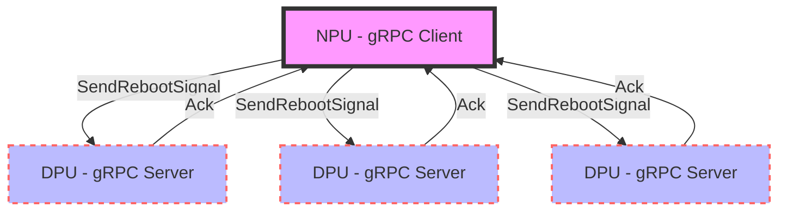
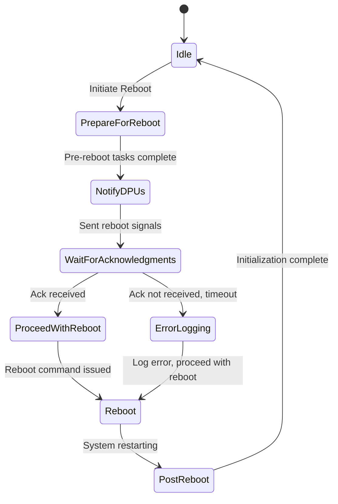
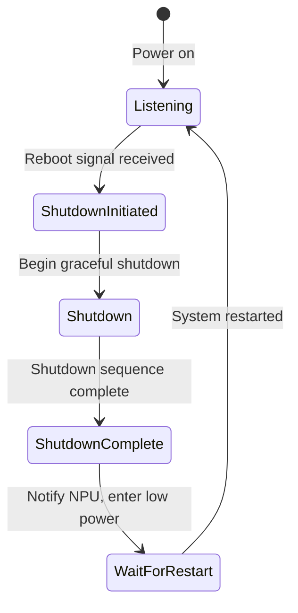

# gRPC-based Coordinated Reboot System for NPU and DPUs

## Table of Contents
- [Introduction](#introduction)
- [Scope](#scope)
- [Requirements](#requirements)
- [System Overview](#system-overview)
- [gRPC Communication Design](#grpc-communication-design)
- [Proto and Schema Definition](#proto-and-schema-definition)
- [gRPC Server Implementation DPU](#grpc-server-implementation-dpu)
- [gRPC Client Implementation NPU](#grpc-client-implementation-npu)
- [State Machine for Reboot Flow](#state-machine-for-reboot-flow)
- [Error Handling and Logging](#error-handling-and-logging)
- [Testing and Validation](#testing-and-validation)
- [Future Enhancements](#future-enhancements)
- [Conclusion](#conclusion)
- [References](#references)

## Introduction

This design document outlines a system that leverages gRPC communication for coordinating reboot processes between a NPU and multiple DPUs. The system aims to ensure that DPUs perform a graceful shutdown before the NPU reboots, enhancing the overall stability and reliability of the setup.

## Scope

The scope of this system includes:
- A NPU, running SONiC, responsible for initiating reboot sequences and communicating with DPUs.
- Multiple DPUs, also running SONiC, which will receive reboot notifications from the NPU and perform graceful shutdowns.

## Requirements

Key system requirements include:
1. The NPU must notify all connected DPUs before performing a reboot.
2. DPUs must act as gRPC servers, constantly listening for reboot signals from the NPU.
3. Upon receiving a reboot notification, each DPU must perform a graceful shutdown and respond with an acknowledgment to the NPU.
4. The NPU, acting as a gRPC client, should handle cases where communication with a DPU fails, logging appropriate error messages.
5. The system must ensure robust error handling to manage scenarios where a DPU is unreachable or unresponsive.

## System Overview

The system comprises a NPU and multiple DPUs. Each component plays a specific role:
- **NPU**: Initiates the reboot process and sends gRPC requests to DPUs for graceful shutdowns.
- **DPU**: Constantly listen for reboot signals and execute shutdown procedures upon request.
  


## gRPC Communication Design

### Overview
The gRPC framework is used to facilitate communication between the NPU and DPUs. gRPC is chosen for its efficiency, cross-platform compatibility, and support for bidirectional streaming, making it ideal for this use case.

### Architecture
- **DPU as gRPC Servers**: Each DPU runs a gRPC server that listens for reboot requests from the NPU.
- **NPU as gRPC Client**: The NPU acts as a gRPC client. It sends reboot requests to all DPUs before initiating its own reboot process.

## Proto and Schema Definition

The gRPC communication is defined by the following protobuf schema:

```protobuf
syntax = "proto3";

package reboot;

// The request message containing the reboot signal.
message RebootRequest {
  string signal = 1;
}

// The response message containing the acknowledgment.
message RebootResponse {
  string ack = 1;
}

// The Reboot service definition.
service RebootService {
  rpc SendRebootSignal (RebootRequest) returns (RebootResponse);
}
```

## gRPC Server Implementation DPU

Each DPU runs a gRPC server that implements the `RebootService`. The server:
- Listens for `SendRebootSignal` requests.
- Performs a graceful shutdown upon receiving a request.
- Sends an acknowledgment back to the NPU.

## gRPC Client Implementation NPU

The NPU implements a gRPC client that:
- Sends `SendRebootSignal` requests to each connected DPU.
- Waits for acknowledgments to ensure each card has received the reboot signal.
- Handles timeouts and communication errors with appropriate logging.

## State Machine for Reboot Flow

The reboot process involves multiple steps and requires coordination between the NPU and the DPUs. To manage this process, a state machine is employed for both sides.

### NPU State Machine

- **Idle**: Default state during normal operations.
- **Prepare for Reboot**: Perform pre-reboot tasks.
- **Notify PCIe Cards**: Send reboot notifications to all DPUs.
- **Wait for Acknowledgments**: Wait for all DPUs to acknowledge.
- **Proceed with Reboot**: Begin the reboot process once acknowledgments are received or a timeout has occurred.
- **Reboot**: System rebooting.
- **Post-Reboot**: Perform post-reboot initialization before returning to Idle.


### DPU State Machine

- **Listening**: Default state, listening for the NPU's commands.
- **Shutdown Initiated**: Received shutdown command from the NPU.
- **Shutdown**: Performing graceful shutdown operations.
- **Shutdown Complete**: Notify the NPU of shutdown completion and go into `Wait for Restart` state.
- **Wait for Restart**: Remain in low-power state until restarted.

Diagrams and further details on each state's transitions and actions will be included to ensure clear understanding and implementation.



## Error Handling and Logging

### Error Handling Strategy
- If the NPU cannot communicate with a DPU (timeout or unreachable), it logs an error.
- The NPU retries the communication a configurable number of times before proceeding with its reboot.

### Logging
- All errors and important events are logged for diagnostic and auditing purposes.

## Testing and Validation

The system will be rigorously tested to ensure:
- Reliable communication between the NPU and DPUs.
- Proper handling of error scenarios.
- DPUs perform graceful shutdowns as expected.

## Future Enhancements

Potential future enhancements include:
- Enhanced security features for gRPC communication.
- Support for dynamic discovery of DPUs.

## Conclusion

This design document presents a robust system for coordinated reboots using gRPC, ensuring graceful shutdowns of DPUs and effective error handling.

## References

- gRPC Documentation: https://grpc.io/docs/
- Protocol Buffers: https://developers.google.com/protocol-buffers
