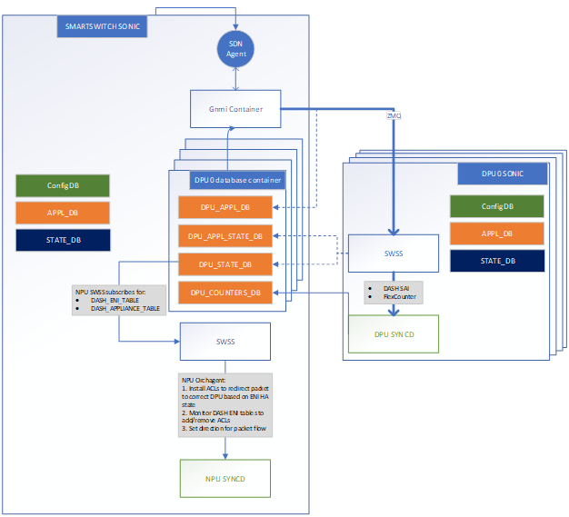

# Smart Switch Database design

## Table of Content

- [Smart Switch Database design](#smart-switch-database-design)
  - [Table of Content](#table-of-content)
    - [Revision](#revision)
    - [Scope](#scope)
    - [Definitions/Abbreviations](#definitionsabbreviations)
    - [Overview](#overview)
    - [Requirements](#requirements)
    - [Architecture Design](#architecture-design)
      - [Database services](#database-services)
        - [NPU side](#npu-side)
        - [DPU side](#dpu-side)
      - [Database flow](#database-flow)
        - [Update Overlay Objects via GNMI:](#update-overlay-objects-via-gnmi)
        - [Update Object Status:](#update-object-status)
        - [Update Counters and Meters:](#update-counters-and-meters)
    - [High-Level Design](#high-level-design)
    - [SAI API](#sai-api)
    - [Configuration and management](#configuration-and-management)
      - [CLI/YANG model Enhancements](#cliyang-model-enhancements)
      - [Config DB Enhancements](#config-db-enhancements)
    - [Warmboot and Fastboot Design Impact](#warmboot-and-fastboot-design-impact)
    - [Memory Consumption](#memory-consumption)
      - [DPU\_APPL\_DB](#dpu_appl_db)
        - [Global Tables](#global-tables)
        - [Per ENI Tables](#per-eni-tables)
      - [DPU\_APPL\_STATE\_DB/DPU\_STATE\_DB](#dpu_appl_state_dbdpu_state_db)
        - [Global Tables](#global-tables-1)
        - [Per ENI Tables](#per-eni-tables-1)
    - [Restrictions/Limitations](#restrictionslimitations)
    - [Testing Requirements/Design](#testing-requirementsdesign)
      - [Unit Test cases](#unit-test-cases)
      - [System Test cases](#system-test-cases)
    - [Open/Action items - if any](#openaction-items---if-any)

### Revision

| Rev | Date | Author | Change Description               |
| :-: | :--: | :----: | -------------------------------- |
| 0.1 |      | Ze Gan | Initial version. Database design |

### Scope

This document provides a high-level design for Smart Switch database.

### Definitions/Abbreviations

| Term            | Meaning                                                                                                                                                                         |
| --------------- | ------------------------------------------------------------------------------------------------------------------------------------------------------------------------------- |
| NPU             | Network Processing Unit                                                                                                                                                         |
| DPU             | Data Processing Unit                                                                                                                                                            |
| DB              | Database                                                                                                                                                                        |
| GNMI            | gRPC Network Management Interface                                                                                                                                               |
| overlay objects | All objects defined in the [sonic-dash-api](https://github.com/sonic-net/sonic-dash-api)                                                                                        |
| midplane bridge | Defined in the [smart-switch-ip-address-assignment](https://github.com/sonic-net/SONiC/blob/master/doc/smart-switch/ip-address-assigment/smart-switch-ip-address-assignment.md) |

### Overview

The Smart Switch comprises two integral components: the Network Processing Unit (NPU) and the Data Processing Unit (DPU), both operating on the SONiC OS. The database stack encompasses the entire database infrastructure for both the NPU and DPU. However, due to memory limitations on the DPU, certain overlay objects, such as DASH objects, are stored in the NPU.

In addition, dedicated database containers are maintained in the NPU for each DPU, serving the purpose of resource management within the Smart Switch architecture. This separation allows for efficient handling of database-related operations and ensures optimal utilization of resources across the entire Smart Switch.

### Requirements

- All databases, including those on both NPU and DPU, must be accessible through the GNMI server.
- Each DPU database instance on the NPU is associated with a unique TCP port and domain Unix socket path.
- All DPU database instances on the NPU will be bound to the IP address of the midplane bridge.
- All database instances on the NPU share the same network namespace to facilitate seamless communication.
- DPUs can access their respective overlay database instances on the NPU using the IP of the midplane bridge and a pre-assigned unique TCP port.

### Architecture Design



#### Database services

##### NPU side

In this section, the focus is on illustrating the maintenance of DPU overlay databases within the NPU. It's essential to note that the traditional database services of both NPU and DPU remain unchanged and do not necessitate further design modifications.

The management of DPU overlay databases within the NPU is orchestrated through existing SONiC database services. The daemon, named "featured," retains the responsibility for initiating, terminating, enabling, and disabling the DPU overlay database services. This interaction is facilitated using the systemctl tool.

To determine the DPU number, the "featured" daemon should leverage the platform API. However, for the sake of implementation simplicity, the DPU number is extracted directly from the platform_env.conf file firstly.

```shell
cat /usr/share/sonic/device/$PLATFORM/platform_env.conf
NUM_DPU=2
```

To align with the established multi-ASIC design in SONiC, a new field, `"has_per_dpu_scope": "True"``, is introduced in the database feature table within config_db.json. This field plays a crucial role in ensuring that each DPU database instance is initiated within a dedicated database container. This design approach maintains consistency with SONiC's existing architecture while accommodating the specific requirements of DPU overlay databases.

```json
# config_db.json

"database": {
    "auto_restart": "always_enabled",
    "delayed": "False",
    "has_global_scope": "True",
    "has_per_asic_scope": "True",
    "has_per_dpu_scope": "True", # New field for DPU database service
    "high_mem_alert": "disabled",
    "state": "always_enabled",
    "support_syslog_rate_limit": "true"
},
```

Our design also extends its multi-ASIC principles by introducing a database_global.json file. It includes two critical fields:

- container_name: This field uniquely maps to the DPU's index, ensuring a clear association between the database instances and the respective DPU.
- include: The include field serves as a pointer to the location of the DPU's database configuration.

```json
{
  "INCLUDES": [
    {
      "include": "../../redis/sonic-db/database_config.json"
    },
    {
      "container_name": "dpu1",
      "include": "../../redisdpu0/sonic-db/database_config.json"
    },
    {
      "container_name": "dpu0",
      "include": "../../redisdpu1/sonic-db/database_config.json"
    }
  ],
  "VERSION": "1.0"
}
```

Within the NPU, the management of DPU overlay databases involves specific configurations. Each DPU overlay database instance is bound to the IP address of the midplane bridge (169.254.200.254 by default). The TCP port assignment follows a predictable pattern, with each DPU ID associated with a unique port (6381 + DPU ID).

Here is an example includes two DPU:

```json
# DPU0: /var/run/redisdpu2/sonic-db/database_config.json
"redis": {
    "hostname": "169.254.200.254",
    "port": 6381,
    "unix_socket_path": "/var/run/redisdpu0/redis.sock",
    "persistence_for_warm_boot": "yes",
    "database_type": "dpudb"
}
#DPU1: /var/run/redisdpu1/sonic-db/database_config.json
"redis": {
    "hostname": "169.254.200.254",
    "port": 6382,
    "unix_socket_path": "/var/run/redisdpu1/redis.sock",
    "persistence_for_warm_boot": "yes",
    "database_type": "dpudb"
}
```

There are four new tables introduction for the DPU overlay database:

```json
"DPU_APPL_DB": {
    "id": 15,
    "separator": ":",
    "instance": "redis",
    "format": "proto"
},
"DPU_APPL_STATE_DB": {
    "id": 16,
    "separator": "|",
    "instance": "redis"
},
"DPU_STATE_DB": {
    "id": 17,
    "separator": "|",
    "instance": "redis"
},
"DPU_COUNTERS_DB": {
    "id": 18,
    "separator": ":",
    "instance": "redis"
}
```

##### DPU side

In the architecture of our Smart Switch, DPU operation involves accessing both local and remote database services. This document is on elucidating the interaction with remote database services in the NPU, specifically for overlay objects.

The DPU employs a DHCP server hosted on the NPU, ensuring each DPU fetches a predetermined and consistent IP address. Leveraging this IP address, the DPU determines the TCP port of its associated overlay database. Following this design principle, the DPU autonomously generates the requisite configuration for remote database services.

``` json
# /var/run/redis/sonic-db/database_config.json
{
    "INSTANCES": {
        "redis": {
            "hostname": "127.0.0.1",
            "port": 6379,
            "unix_socket_path": "/var/run/redis/redis.sock",
            "persistence_for_warm_boot": "yes"
        },
        "remote_redis": {
            "hostname": "169.254.200.254",
            "port": 6381,
        }
    },
    "DATABASES": {
        "APPL_DB": {
            "id": 0,
            "separator": ":",
            "instance": "redis"
        },
        "ASIC_DB": {
            "id": 1,
            "separator": ":",
            "instance": "redis"
        },
        "COUNTERS_DB": {
            "id": 2,
            "separator": ":",
            "instance": "redis"
        },
        "LOGLEVEL_DB": {
            "id": 3,
            "separator": ":",
            "instance": "redis"
        },
        "CONFIG_DB": {
            "id": 4,
            "separator": "|",
            "instance": "redis"
        },
        "PFC_WD_DB": {
            "id": 5,
            "separator": ":",
            "instance": "redis"
        },
        "FLEX_COUNTER_DB": {
            "id": 5,
            "separator": ":",
            "instance": "redis"
        },
        "STATE_DB": {
            "id": 6,
            "separator": "|",
            "instance": "redis"
        },
        "SNMP_OVERLAY_DB": {
            "id": 7,
            "separator": "|",
            "instance": "redis"
        },
        "RESTAPI_DB": {
            "id": 8,
            "separator": "|",
            "instance": "redis"
        },
        "GB_ASIC_DB": {
            "id": 9,
            "separator": ":",
            "instance": "redis"
        },
        "GB_COUNTERS_DB": {
            "id": 10,
            "separator": ":",
            "instance": "redis"
        },
        "GB_FLEX_COUNTER_DB": {
            "id": 11,
            "separator": ":",
            "instance": "redis"
        },
        "APPL_STATE_DB": {
            "id": 14,
            "separator": ":",
            "instance": "redis"
        },
        "DPU_APPL_DB": {
            "id": 15,
            "separator": ":",
            "instance": "remote_redis",
            "format": "proto"
        },
        "DPU_APPL_STATE_DB": {
            "id": 16,
            "separator": "|",
            "instance": "remote_redis"
        },
        "DPU_STATE_DB": {
            "id": 17,
            "separator": "|",
            "instance": "remote_redis"
        },
        "DPU_COUNTERS_DB": {
            "id": 18,
            "separator": ":",
            "instance": "remote_redis"
        }
    },
    "VERSION": "1.0"
}

```

#### Database flow

This section outlines critical workflows interacting with the DPU overlay database.

##### Update Overlay Objects via GNMI:

Communication with the SWSS of the DPU occurs through GNMI, leveraging ZMQ. Simultaneously, an asynchronous insertion of the object backup is made to the DPU_APPL_DB. This backup mechanism serves purposes such as debugging, migration, and future considerations.

##### Update Object Status:

The SWSS of the DPU takes a proactive role in updating the DPU_APPL_STATE_DB and DPU_STATE_DB when corresponding objects undergo updates. This update can be triggered either by GNMI message commands or internal service logic.

##### Update Counters and Meters:

Flex counter management in Syncd of the DPU handles the update of counters and meters for overlay objects. Traditional counters are also managed through this mechanism.

These workflows ensure an interaction between the DPU overlay database and various components within the Smart Switch. The DPUs access their respective database instances via the IP address of the midplane bridge and the assigned TCP port. Concurrently, GNMI accesses these instances through the Unix domain socket

### High-Level Design

### SAI API

N/A

### Configuration and management

An enhanced database CLI offers the capability to convert binary messages within the DPU_APPL_DB into human-readable text.

#### CLI/YANG model Enhancements

```yang
    container sonic-feature {
        container FEATURE {
                leaf has_per_dpu_scope {
                    description "This configuration identicates there will only one service
                                spawned per DPU";
                    type feature-scope-status;
                    default "false";
                }
        }
    }
```

#### Config DB Enhancements

Refer section: [Database services](#database-services)

### Warmboot and Fastboot Design Impact

N/A

### Memory Consumption

#### DPU_APPL_DB

The estimated memory consumption for the Smart Switch database is calculated based on entry sizes sourced from the [sonic-dash-api](https://github.com/sonic-net/sonic-dash-api) repository with the [commit](https://github.com/sonic-net/sonic-dash-api/tree/d4448c78b4e0afd1ec6dfaa390aef5c650cee4b3) and entry numbers derived from the [DASH high-level design scaling requirements](https://github.com/sonic-net/DASH/blob/main/documentation/general/dash-sonic-hld.md#14-scaling-requirements).

The following tables comprises two parts: Global tables and per ENI tables. Notably, when calculating the total size per card, the memory consumption of per ENI tables is adjusted by multiplying it by the exact number of ENIs.

##### Global Tables

| Table name              | Entry size (bytes) | No. of entries in the Table | Total size per card (KB) |
| ----------------------- | ------------------ | --------------------------- | ------------------------ |
| DASH_VNET_TABLE         | 448                | 1,024                       | 448                      |
| DASH_ENI_TABLE          | 208                | 64                          | 13                       |
| DASH_PREFIX_TAG(IPv6)   | 229,492            | 32                          | 7,172                    |
| DASH_VNET_MAPPING_TABLE | 216                | 10,000,000                  | 2,109,375                |

##### Per ENI Tables

| Table name                     | Entry size (bytes) | No. of entries in the Table per ENI | Total size per card (KB) |
| ------------------------------ | ------------------ | ----------------------------------- | ------------------------ |
| DASH_ACL_RULE_TABLE(IPv6)      | 2,488              | 10,000                              | 1,555,000                |
| DASH_ROUTE_RULE_TABLE(inbound) | 176                | 10,000                              | 110,000                  |
| DASH_ROUTE_TABLE(outbound)     | 264                | 100,000                             | 1,650,000                |

Based on the provided data and calculations, the estimated memory consumption for the DPU_APPL_DB is approximately **5.18GB** per card.

#### DPU_APPL_STATE_DB/DPU_STATE_DB

For the DPU_APPL_STATE_DB and DPU_STATE_DB, the storage focus is specifically on retaining the keys and its status of each object rather than storing the metadata. This results in a reduced memory footprint compared to the DPU_APPL_DB. The estimated memory consumption for these databases is approximately 2.45GB.

##### Global Tables

| Table name              | Entry size (bytes) | No. of entries in the Table | Total size per card (KB) |
| ----------------------- | ------------------ | --------------------------- | ------------------------ |
| DASH_VNET_TABLE         | 88                 | 1,024                       | 88                       |
| DASH_ENI_TABLE          | 144                | 64                          | 7                        |
| DASH_PREFIX_TAG(IPv6)   | 104                | 32                          | 3                        |
| DASH_VNET_MAPPING_TABLE | 144                | 10,000,000                  | 1,406,250                |

##### Per ENI Tables

| Table name                     | Entry size (bytes) | No. of entries in the Table per ENI | Total size per card (KB) |
| ------------------------------ | ------------------ | ----------------------------------- | ------------------------ |
| DASH_ACL_RULE_TABLE(IPv6)      | 104                | 10,000                              | 65,000                   |
| DASH_ROUTE_RULE_TABLE(inbound) | 160                | 10,000                              | 100,000                  |
| DASH_ROUTE_TABLE(outbound)     | 160                | 100,000                             | 1,000,000                |

### Restrictions/Limitations

### Testing Requirements/Design

#### Unit Test cases

No separate test for the is required. The feature will be tested implicitly by the other DASH tests.

#### System Test cases

No separate test for the is required. The feature will be tested implicitly by the other DASH tests.

### Open/Action items - if any

1. Platform API for fetch DPU numbers
