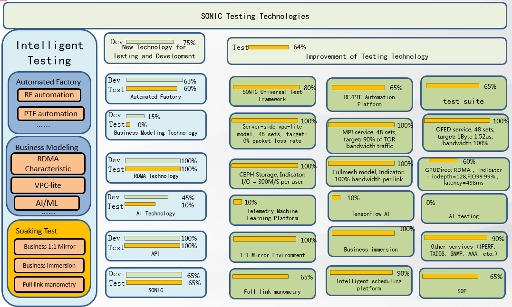
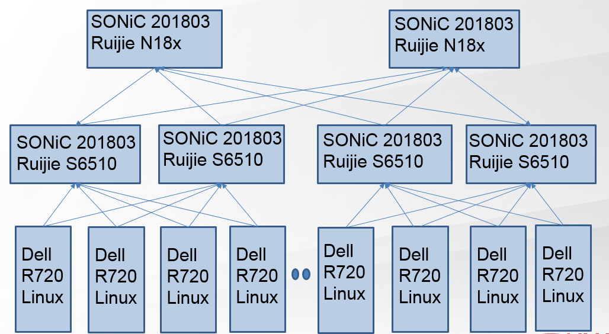
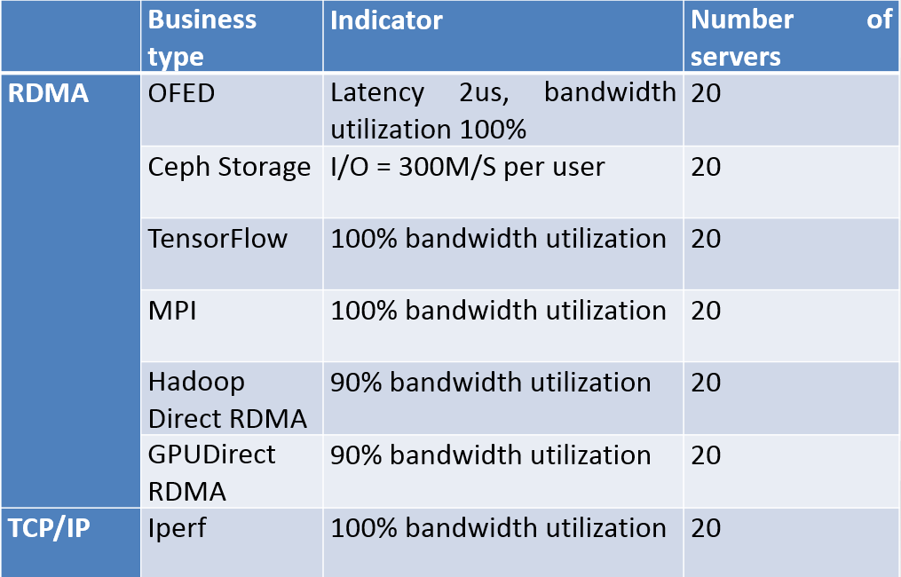

# SONiC Soaking Test in Ruijie

# About this Proposal
This document proposes Soaking Test method in SONiC.

# Problem Definition
With the rise of artificial intelligence, high performance computing, distributed storage and other technologies, the performance and stability of data center networks have higher requirements. There are risks in the large-scale deployment of new network hardware and software. Many network operators, such as Ali, Tencent, Baidu and Jingdong, require Ruijie to build a comparable immersion environment in the laboratory to simulate operation drills, discover unknown risks, reproduce online problems and business research.

# Ruijie's Solution

1.Automated Testing,RF Testing,PTF Testing. 
2.Business Modeling, Moving Customer's Field Business to Laboratory. 
3.Soaking Test, the system will run for 7x24 hours under real load to find out long-term problems, such as memory leak, memory rewrite, kernel, resource leak, and measure the stability and reliability of existing network business operation through real business indicators. 

##Ruijie Testing Method##

__Figure 1: Ruijie SONiC Testing Framework__. 

##Ruijie Soaking Test Environment Architecture##
1. 25Gpbs/100Gpbs RoCE network
2. Server Double Uplink
3. 20 Dell servers, 4 Ruijie-S6500 servers and 2 Ruijie-N18x servers

__Figure 2: Ruijie SONiC Soaking Test Environment__. 

##Soaking Test Business##

__Figure 3: Ruijie SONiC Soaking Test Business__. 

##Fullmesh Test##

__Figure 4: Usecase: fullmesh with OFED & Iperf__. 
