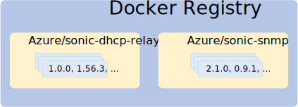
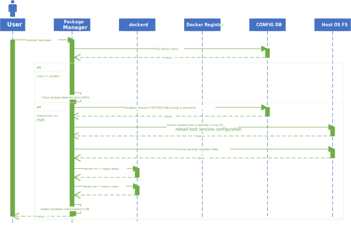

<!-- omit in toc -->
# SONiC Application Extension Infrastructure

<!-- omit in toc -->
#### Rev 0.1

<!-- omit in toc -->
## Table of Content
- [Revision](#revision)
- [Scope](#scope)
- [Definitions/Abbreviations](#definitionsabbreviations)
- [Overview](#overview)
- [Requirements](#requirements)
- [Architecture Design](#architecture-design)
- [High-Level Design](#high-level-design)
- [SONiC Package](#sonic-package)
- [Built-In SONiC Packages](#built-in-sonic-packages)
- [SONiC Package Management](#sonic-package-management)
- [SONiC Package Database](#sonic-package-database)
- [SONiC Build System](#sonic-build-system)
- [SONiC Base Image and Packages Versioning](#sonic-base-image-and-packages-versioning)
- [SONiC Application Extension Security Considerations](#sonic-application-extension-security-considerations)
- [Configuration and management](#configuration-and-management)
- [SONiC Package Upgrade Flow](#sonic-package-upgrade-flow)
- [Manifest](#manifest)
- [SONiC Package Installation](#sonic-package-installation)
- [SONiC Package Changelog](#sonic-package-changelog)
- [SONiC Docker Container Resource Restrictions](#sonic-docker-container-resource-restrictions)
- [SONiC Package Docker Container Lifetime](#sonic-package-docker-container-lifetime)
- [Initial Extension Configuration](#initial-extension-configuration)
- [CLI extension](#cli-extension)
- [SONiC Processes and Docker Statistics Telemetry Support](#sonic-processes-and-docker-statistics-telemetry-support)
- [Feature Concept Integration](#feature-concept-integration)
- [Multi-DB support](#multi-db-support)
- [Configuration Reload](#configuration-reload)
- [System Dump](#system-dump)
- [Multi-ASIC](#multi-asic)
- [Warmboot and Fastboot Design Impact](#warmboot-and-fastboot-design-impact)
- [SONiC-2-SONiC upgrade](#sonic-2-sonic-upgrade)
- [Kubernetes & SONiC Application Extension](#kubernetes--sonic-application-extension)
- [3rd party Docker images](#3rd-party-docker-images)
- [Installing 3rd party image as is.](#installing-3rd-party-image-as-is)
- [Prepare 3rd party image as to be SONiC compliant](#prepare-3rd-party-image-as-to-be-sonic-compliant)
- [SONiC Build System](#sonic-build-system-1)
  - [SONiC SDK Docker Images](#sonic-sdk-docker-images)
- [SAI API](#sai-api)
- [Restrictions/Limitations](#restrictionslimitations)
- [Testing Requirements/Design](#testing-requirementsdesign)
- [Open/Action items](#openaction-items)

<!-- omit in toc -->
## List of Figures
- [Figure 1. Basic Concepts](#figure-1-basic-concepts)
- [Figure 2. High Level Overview of SONiC Package integration](#figure-2-high-level-overview-of-sonic-package-integration)
- [Figure 3. SONiC Package Installation Flow](#figure-3-sonic-package-installation-flow)
- [Figure 4. SONiC Package Uninstallation Flow](#figure-4-sonic-package-uninstallation-flow)
- [Figure 5. SONiC Package Upgrade Flow](#figure-5-sonic-package-upgrade-flow)
- [Figure 6. Feature Start Sequence Diagram](#figure-6-feature-start-sequence-diagram)
- [Figure 7. Feature Stop Sequence Diagram](#figure-7-feature-stop-sequence-diagram)

### Revision

|  Rev  |  Date   |      Author      | Change Description |
| :---: | :-----: | :--------------: | ------------------ |
|  0.1  | 09/2020 | Stepan Blyshchak | Phase 1 Design     |

### Scope

This document describes the high level design of SONiC Application Extension Infrastructure.

### Definitions/Abbreviations

| **Abbreviation** | **Definition**                        |
| ---------------- | ------------------------------------- |
| SONiC            | Software for Open Networking in Cloud |
| DB               | Database                              |
| API              | Application Programming Interface     |
| SAI              | Switch Abstraction Interface          |
| YANG             | Yet Another Next Generation           |
| JSON             | Java Script Object Notation           |
| XML              | eXtensible Markup Language            |
| gNMI             | gRPC Network Management Interface     |

### Overview

<!-- omit in toc -->
#### Feature Overview

SONiC Application Extension Infrastructure is a SONiC infrastructure and framework for managing SONiC Application Packages which in this scope are
SONiC compatible Docker images distributed individually from one another and from the base SONiC image.

<!-- omit in toc -->
#### Motivation

SONiC NOS was built with extendability in mind. The key role here play the fact that the main building block of SONiC is Docker.
Every SONiC functionality piece is packaged inside a Docker image which then is run on a SONiC box. As of today, SONiC comes with a set
of Docker containers that are built-in into SONiC image, limiting users to a predefined functionality that is supported by SONiC.
The end goal of this proposal is to achieve building a system which makes it possible to extend SONiC base set of features at runtime
without a need to upgrade the whole SONiC OS.

We are going to leverage the existing Docker and Docker registry infrastructure and build SONiC Application Extension framework on top of it.
While Docker provides a tool for packaging an application and Docker registry for hosting it, it is not enough to just execute "docker pull"
to make an application "look and feel" like a native SONiC application.

SONiC Application Extension framework aims at making the process of development and integration of 3-rd party applications with a native
integration into SONiC. For that we need to provide SONiC Application Extension Infrastructure with the API to connect every 3rd party application
with SONiC native infrastructure, like access to the database, SAI ASIC programming interface, sonic utility CLI, Klish based CLI, REST API,
gNMI, logging infrastructure, warm and fast restarts, etc.

When SONiC Application Extension infrastructure will become a part of SONiC, application developer will not have to integrate every application
into SONiC codebase but maintain them separately. This follows all the popular Linux distributions that allow for installation of external applications.

### Requirements

<!-- omit in toc -->
#### Functional requirements

This section describes a list of requirements for both SONiC Application Extension Infrastructure.

The following list of requirements has to be met for SONiC Application Extension Infrastructure:
- SONiC OS must provide a CLI to manage SONiC repositories and packages.
  This includes package installation, un-installation,
  both cold and warm upgrades as well as adding and removing repositories.
- Definition for a SONiC compatible Docker image and metadata a this Docker image must provide.
- Versioning schema and a mechanism to control package dependencies and conflicts.
- All SONiC packages are registered as an optional *feature* in SONiC, thus "feature"
  CLI commands are applicable to SONiC Packages.
- Application upgrades: container level upgrade and system level upgrade - SONiC-2-SONiC upgrade.
- SONiC utilities CLI extension mechanism.
- Resource sharing with SONiC Package container: redis database, syslog, Linux resources etc.
- Build infrastructure and tools for easier package development.

### Architecture Design

This section covers the changes that are required in the SONiC architecture. In general, it is expected that the current architecture is not changed.
This section should explain how the new feature/enhancement (module/sub-module) fits in the existing architecture.

### High-Level Design

<!-- omit in toc -->
### Basic concepts

Basic definitions:

*SONiC Package* - SONiC compatible Docker image providing its functionality as a service<br>
*SONiC Package Repository* - store of SONiC compatible Docker images that can be referenced by a tag<br>
*Docker Registry* - a storage and content delivery system, holding named Docker images, available in different tagged versions

<!-- omit in toc -->
###### Figure 1. Basic Concepts

<p align=center>

</p>

There are three notions: *package*, *repository* and *registry*. A repository is a Docker registry (private or open like Docker Hub)
repository with tagged images for specific package.

In the above figure *Azure/sonic-dhcp-relay* and *Azure/sonic-snmp* are repositories with a set of images.

### SONiC Package

SONiC Packages must meet few requirements in order to be a SONiC compatible Docker image.

- A package must provide a manifest as part of the Docker image.
- Requirement on the container state recording by [Kubernetes HLD](https://github.com/sonic-net/SONiC/blob/698e8d7991c0ca3d21b4488cf336efcfe891ef9a/doc/kubernetes/Kuberenetes-support.md)).

<!-- omit in toc -->
###### Figure 2. High Level Overview of SONiC Package integration

<p align=center>

</p>

The idea is to auto-generate most of the components on the host OS based on *manifest* provided by SONiC Package.

### Built-In SONiC Packages

Every SONiC Docker image can be a SONiC Package, although a subset of SONiC Dockers will be made with format of SONiC Package at first phase.
These are Dockers for which it might be complicated to separate the OS part from the Docker image itself. Those Docker images are considered as built-in Docker images.
Built-in packages **cannot** be *removed* and *upgraded* as SONiC Packages and the infrastructure will mark them with a special built-in flag.

This will allow for a smooth transition of SONiC Docker images into SONiC Packages by marking all of the existing Docker images as
build-in and then removing this flag for images that become a SONiC Packages.

The following list enumerates some built-in Docker containers, that cannot become SONiC Package at current stage:
- database
- syncd
- swss
- pmon

For those packages it might be a challenge to support installation, un-installation and upgrade using SONiC Application Extension framework.
E.g. syncd contains vendor SDK which usually means there is a kernel driver installed on the host OS. Upgrading just the syncd may become
challenging because of a need to upgrade kernel driver on the host. Same is for the pmon Docker, swss and database - they are tightly integrated
into base OS.

**NOTE**: For phase 1 dhcp-relay is chosen to be the first feature that will become a SONiC Package.

### SONiC Package Management

As any mature OS distribution SONiC will use its own package management solution and provide a utility to manage packages.
SONiC Package Manager will use a persistent storage for its purposes at */var/lib/sonic-packages/* on the host OS.
There is a *packages.json* file representing local database of packages.

```
/
  var/
    lib/
      sonic-packages/
        packages.json
```
<!-- omit in toc -->
###### Example directory structure of SONiC Package Manager library

A locking mechanism will be used in order to make a package operation (installation, de-installation, upgrades) atomic.
For this a lock file */var/lib/sonic-packages/.lock* will be created on every operation and released once operation is completed
to guaranty that the database won't become broken if two write operations are performed at the same time.

### SONiC Package Database

The */var/lib/sonic-packages/packages.json* file is used as a persistent database of available SONiC packages.
Schema definition for *packages.json* file is following:

| Path                    | Type    | Description                                                                                                                               |
| ----------------------- | ------- | ----------------------------------------------------------------------------------------------------------------------------------------- |
| /name                   | string  | Name of the package.                                                                                                                      |
| /name/repository        | string  | Repository in Docker registry. Default source of image for installation/upgrade.                                                          |
| /name/description       | string  | Application description field.                                                                                                            |
| /name/default-reference | string  | A tag or digest of Docker image that will be a default installation candidate.                                                            |
| /name/built-in          | boolean | A flag to indicate that a Docker is a built-in package.                                                                                   |
| /name/status            | string  | Status indicate the installation status of the package. It is either "installed" or "not-installed".                                      |
| /name/installed-version | string  | Installed version string. This version follows semantic versioning described in later section.                                            |
| /name/image-id          | string  | Docker image ID of the installed Package, *null* if package is not installed or built-in (was not installed using sonic-package-manager). |


A sample of the content in JSON format:

```json
{
  "database": {
    "repository": "docker-database",
    "description": "SONiC database service",
    "built-in": true,
    "default-reference": "1.0.0",
    "status": "installed",
    "installed-version": "1.0.0"
  },
  "swss": {
    "repository": "docker-orchagent",
    "description": "SONiC switch state service",
    "built-in": true,
    "default-reference": "1.0.0",
    "status": "installed",
    "installed-version": "1.0.0"
  },
  "dhcp-relay": {
    "repository": "Azure/sonic-dhcp-relay",
    "description": "DHCP relay feature",
    "default-reference": "sha256:5d41c289942008211c2964bca72800f5c9d5ea5aa4057528da617fb36463d4ab",
    "status": "not-installed"
  },
  "snmp": {
    "repository": "Azure/sonic-snmp",
    "description": "Simple Network Monitoring Protocol",
    "default-reference": "1.0.0",
    "status": "installed",
    "installed-version": "1.0.0",
    "image_id": "e269735173d5"
  }
}
```

The initial *packages.json* that comes with SONiC image is auto-generated at build time. The *packages.json* will include every
SONiC package installed at built time and have the installation status set. Besides of the packages that were built-in to SONiC
OS at built time the *packages.json* also includes the repositories that are available for users to install. E.g. a DHCP relay
feature may not come with SONiC by default, but the user will have a corresponding entry for DHCP relay package in *packages.json*
which user can install.

Community can extend *packages.json* with own developed packages. The recommended way of defining a 'default-reference' is by
specifying a digest rather then a tag, so that a package entry points strictly to a specific image.


### SONiC Build System

1. Install packages at built time.

Build-system users will have an ability to specify packages they would like to add to database or add and install.

rules/sonic-packages.mk:
```makefile
# rules to define remote packages that need to be installed
# during SONiC image build

## Example:
PACKAGE = my-package
$(PACKAGE)_REPOSITORY = myrepo/mypackage
$(PACKAGE)_VERSION = 1.0.0
$(PACKAGE)_INSTALL = y                    # whether to install or not

# Add package to target group
SONIC_PACKAGES += $(PACKAGE)
```

2. SONiC Docker compilation option

For SONiC Package within sonic-buildimage an option to include the package will be exposed to the user:

rules/config:
```makefile
INCLUDE_$(PACKAGE)=y
```

If this option is set to **y** the corresponding Docker image will be built and installed from image tarball
placed under target/ folder.

### SONiC Base Image and Packages Versioning

Most of the SONiC Packages will depend on SONiC base OS API and on other SONiC packages API. Every mature package management solution provides
a set of agreements on how packages versioning should be done to avoid potential incompatibilities.

This documents proposes to use [semantic versioning](https://semver.org/) which is used for many package management solutions.

The schema for version is in the format of *\${MAJOR}.\${MINOR}.\${PATCH}* version. Semantic versioning can also include a suffix for pre-release
identifiers and build id, like *1.0.0-dev+153*, that can be used for master branch builds. Such a schema allows for a simple logic for comparison,
e.g: *1.0.0 < 1.1.0* and *1.5.1 > 1.4.20*. For more details of comparison rules follow the reference above.

The version number is defined as part of the SONiC package manifest. Package maintainers must follow the above versioning approach and are encouraged
to follow a commonly used convention in Docker by tagging images with a version number [See next section].

The base OS components (libswsscommon, sonic-utilities, etc.) has also a version number that follows the same rules of semantic versioning so that a package can define a dependency on base OS component version. These versions are recorder in */etc/sonic/sonic_version.yml*. This versions are in addition to SONiC version we have today.

For SONiC containers available in *sonic-buildimage* repository the corresponding makefile is modified to include a version string:

rules/docker-dhcp-relay.mk
```makefile
$(DOCKER_DHCP_RELAY)_VERSION = 1.0.0
```

This version is used to tag a Docker image when installing SONiC package in SONiC OS at build-time or publishing SONiC package.

The versioning of the package is a responsibility of the package maintainer. The exact rules of how the versioning is done when
branching, publishing new images is out of the scope of this document.

<!-- omit in toc -->
#### Docker tag to semantic version string conversion and vice versa


Whenever user asks to install a version X the sonic-package-manager is converting X to a tag compliant string.
If version X does not use the *buildmetadata* there are no issues using version X string as a tag, if it does
the version string cannot be used as a tag because of tag string limitations, in particular the '+' sign used
to separate *buildmetadata* from the rest of the version string is not allowed to be present in Docker tag
string.

The proposed conversion is suggested by this document is to replace a '+' with a '_', which is not allowed to
be used in semver:

```
tag_string = semver_string.replace('+', '_')
```

For the following version '1.0.5-rc0+152' the Docker tag would be '1.0.5-rc0_152'.

### SONiC Application Extension Security Considerations

There are a lots of aspects about security when it comes to running arbitrary SONiC packages on SONiC.
Making sure the container is restricted to do only what it is supposed to is a complex functionality peace here.
Security considerations of Phase 1 of Application Extension feature stand on an assumptions that 3rd party Dockers
are secured and trusted.

- 3rd party package developer must add an entry in sonic-buildimage repository in packages.json.j2 template file.
  The community tests and verifies the package and only those packages which are trusted are added to the template.
- If user manually adds an entry to *packages.json* file, it is user's responsibility to verify and check the package
  that user is trying to install.

The SONiC Application Extension Framework may leverage Docker Content Trust feature which allows to pull only signed
images. A set of trusted public keys may come as a default with SONiC image as well as user may add their own
public keys. Using those public keys and a signature in Docker image docker validates the signature of the image.
This way the user can ensure the integrity and the publisher of the image he is trying to install.

[Docker Content Trust](https://docs.docker.com/engine/security/trust/)

### Configuration and management

<!-- omit in toc -->
#### CLI Enhancements

The SONiC Package Manager is another executable utility available in base SONiC OS called *sonic-package-manager* or abbreviated to *spm*.
The command line interfaces are given bellow:

<!-- omit in toc -->
#### CLI

```
admin@sonic:~$ sonic-package-manager
Usage: sonic-package-manager [OPTIONS] COMMAND [ARGS]...

  SONiC Package Manager.

Options:
  --help  Show this message and exit.

Commands:
  install     Install SONiC package
  list        List available packages
  migrate     Migrate SONiC packages from database file
  repository  Repository management commands
  show        SONiC Package Manager show commands
  uninstall   Uninstall SONiC package
  upgrade     Upgrade SONiC package
```

```
admin@sonic:~$ sonic-package-manager show package
Usage: sonic-package-manager show package [OPTIONS] COMMAND [ARGS]...

  Package show CLI commands.

Options:
  --help  Show this message and exit.

Commands:
  changelog  Print the package changelog
  manifest   Print the manifest content
  versions   Print available versions
```

<!-- omit in toc -->
#### List of packages available
```
admin@sonic:~$ sonic-package-manager list
Name         Repository             Description              Version        Status
-----------  ---------------------  ------------------------ ------------   --------------
database     docker-database        SONiC database           1.0.0          Built-In
swss         docker-orchagent       Switch state service     1.0.0          Built-In
syncd        docker-syncd-vs        SONiC ASIC sync service  1.0.0          Built-In
cpu-report   Azure/cpu-report       CPU time report feature  1.0.5          Installed
dhcp-relay   Azure/dhcp-relay       DHCP relay service       N/A            Not installed
```

<!-- omit in toc -->
#### Repository management

```
admin@sonic:~$ sudo sonic-package-manager add [NAME] [REPOSITORY] --default-reference=[STRING]
admin@sonic:~$ sudo sonic-package-manager remove [NAME]
```

<!-- omit in toc -->
#### Package Installation

```
admin@sonic:~$ sudo sonic-package-manager install --help

Usage: sonic-package-manager install [OPTIONS] [PACKAGE_EXPR]

  Install SONiC package.

Options:
  -y, --yes                        Answer yes for any prompt
  -f, --force                      Force installation
  --enable                         Wether to enable feature after install
  --default-owner [local|kube]     Default configured owner
  --from-repository                Install directly from repository specified
                                   in this options. Format is the same as for
                                   "docker pull" command: NAME[:TAG|@DIGEST].
                                   Mutually exclusive with PACKAGE_EXPR and
                                   --from-tarball
  --from-tarball                   Install from tarball. Mutually exclusive with
                                   PACKAGE_EXPR and --from-repository
  --skip-cli-plugin-installation   Do not install CLI plugins provided by the
                                   package on the host OS
                                   Note: In case package CLI is defined as mandatory
                                   and this option is beeing used the installation
                                   will fail.
  --help                           Show this message and exit
```

<!-- omit in toc -->
###### Examples

```
admin@sonic:~$ sudo sonic-package-manager install cpu-report
```

Install a specific tag:
```
admin@sonic:~$ sudo sonic-package-manager install cpu-report==1.0.0
```

Optionally specifying a version after package name separated by a '==' in CLI allows user to install any version of extension.

Installing using a tag/version is a convenient methods to install packages for users. The downside of using tag as an image reference
is the fact that a tag is mutable reference. Thus, an image tag might not point to the same image at any given time. Docker provides
a digest (content-addressable identifier) as immutable reference. In case users download from Docker Hub rather then from trusted repository
they might want to use a digest instead for their installations.

Install using a digest:

```
admin@sonic:~$ sudo sonic-package-manager install cpu-report@sha256:8273733f491f362bb36710fd8a99f78c3fbaecd8d09333985c76f1064b80760f
```

For developer convenience or for unpublished SONiC packages,it is possible to install the extension from a Docker image tarball.

```
admin@sonic:~$ ls featureA.gz
featureA.gz
admin@sonic:~$ sudo sonic-package-manager install --from-tarball featureA.gz
```

This option should mainly be used for debugging, developing purpose, while the preferred way will be to pull the image from repository.
Package Database is updated with a "repository" field set to local image repository.
In the above example the following entry is added to *packages.json*:

```json
{
  "featureA": {
    "repository": "featureA",
    "installed-version": "1.0.0",
    "status": "installed",
    "image_id": "9ab631f37d1d"
  }
}
```

An option to skip all dependency checks and force the installation:

```
admin@sonic:~$ sudo sonic-package-manager install --force feature
WARN: feature depends on syncd^1.1.1 while installed version is 1.0.5. Ignoring.
```

*show version* command can be used to display feature docker image version.

<!-- omit in toc -->
#### Package Upgrade

```
admin@sonic:~$ sudo sonic-package-manager upgrade --help

Usage: sonic-package-manager upgrade [OPTIONS] [PACKAGE_EXPR]

  Upgrade SONiC package

Options:
  -y, --yes                        Answer yes for any prompt.
  -f, --force                      Force upgrade.
  --from-repository                Install directly from repository specified
                                   in this options. Format is the same as for
                                   "docker pull" command: NAME[:TAG|@DIGEST].
                                   Mutually exclusive with PACKAGE_EXPR and
                                   --from-tarball
  --from-tarball                   Install from tarball. Mutually exclusive with
                                   PACKAGE_EXPR and --from-repository
  --help                           Show this message and exit
```

<!-- omit in toc -->
###### Examples

The command line example for package upgrade:
```
admin@sonic:~$ sudo sonic-package-manager upgrade <package>==1.5.1
```

The the new package is downloaded and installed, the package service is stopped and restarted, an old Docker image is removed.

For a feature that supports warm upgrade:
```
admin@sonic:~$ sudo config warm-restart enable <package>
admin@sonic:~$ sudo sonic-package-manager upgrade <package>===1.5.1
```

*NOTE*: SONiC already supports docker containers warm upgrade to some extent by sonic-installer utility's "upgrade-docker" sub-command.
This command will be deprecated and replaced by "sonic-package-manager" functionality.

<!-- omit in toc -->
#### Config DB Enhancements

No CONFIG DB changes required for this feature.

<!-- omit in toc -->
###### Figure 3. SONiC Package Installation Flow

<p align=center>

</p>

<!-- omit in toc -->
### SONiC Package Uninstallation Flow

<!-- omit in toc -->
###### Figure 4. SONiC Package Uninstallation Flow

<p align=center>

</p>

### SONiC Package Upgrade Flow

The upgrade scenario is different from sequential uninstall and install operations. In order to minimize service downtime,
the image pulling and templates rendering has to be done while the old container is running. Also, it might be that the old
container auto-generated container management scripts are incompatible with the new one and vice verse. So we need to stop
the old container using old auto-generated service file and container management scripts, then replace the old scripts with
new one and start the service. The sequence is shown on the figure below:

<!-- omit in toc -->
###### Figure 5. SONiC Package Upgrade Flow

<p align=center>

</p>

### Manifest

Every SONiC Package that is not a built-in package must provide a *manifest*. *manifest* is a set of Docker image labels which describe
the package and instruct SONiC how this package integrates in the system.

Image labeling is a standard Docker way to add metadata information to the image. Besides, a label can be queried using Docker Registry API
without the need to download the whole image.

<!-- omit in toc -->
###### Manifest Base
```
com.azure.sonic.manifest
```

The value should contain a JSON serialized as a string.

The following table shows the top-level objects in the manifest. In the next sections it is described all the fields that are relevant.

| Path       | Type   | Mandatory | Description                                                                                      |
| ---------- | ------ | --------- | ------------------------------------------------------------------------------------------------ |
| /version   | string | no        | Version of manifest schema definition. Defaults to 1.0.0.                                        |
| /package   | object | no        | Package related metadata information.                                                            |
| /service   | object | yes       | Service management related properties.                                                           |
| /container | object | no        | Container related properties.                                                                    |
| /processes | list   | no        | A list defining processes running inside the container.                                          |
| /cli       | object | no        | CLI plugin information. *NOTE*: Later will deprecated and replaced with a YANG module file path. |


A required "version" field can be used in case the format of manifest.json is changed in the future.
In this case a migration script can be applied to convert format to the recent version.
This is similar to approach SONiC uses for CONFIG DB version.


### SONiC Package Installation


An installation process has to verify all requirements are met. First check to perform is a SONiC base image version match.
The package manager has to build the dependency tree and verify all dependent packages are installed version requirements
are met and the package that is about to be installed does not break any other package or any installed package does not
break the package that is going to be installed.

The package manager currently won't try to install missing packages or resolve dependency conflicts but give the user an
appropriate error message.

*NOTE*: SONiC package manager does not maintain two different versions at the same time. So, only single version of the package
can be installed at any given time.


<!-- omit in toc -->
###### manifest path

| Path                                | Type   | Mandatory | Description                                                                    |
| ----------------------------------- | ------ | --------- | ------------------------------------------------------------------------------ |
| /package/version                    | string | yes       | Version of the package.                                                        |
| /package/name                       | string | yes       | Name of the package.                                                           |
| /package/description                | string | no        | Description of the package.                                                    |
| /package/depends                    | list   | no        | List of SONiC packages the service depends on. Defaults to []                  |
| /package/depends[index]/name        | string | yes       | Name of SONiC Package                                                          |
| /package/depends[index]/version     | string | no        | Version constraint expression string                                           |
| /package/depends/[index]/components | object | no        | Per component version                                                          |
| /package/breaks                     | list   | no        | List of SONiC package the service breaks with. Defaults to []                  |
| /package/breaks[index]/name         | string | yes       | Name of SONiC Package                                                          |
| /package/breaks[index]/version      | string | no        | Version constraint expression string                                           |
| /package/breaks/[index]/components  | object | no        | Per component version                                                          |

Base OS component version checking:

<!-- omit in toc -->
###### manifest path

| Path                              | Type      | Mandatory | Description                   |
| --------------------------------- | --------- | --------- | ----------------------------- |
| /package/base-os/                 | object    | no        | Base OS versions constraints  |
| /package/base-os/[index]/name     | strnig    | yes       | Base OS component name        |
| /package/base-os/[index]/version  | string    | yes       | Base OS component version     |


Each SONiC Package can have a list of labels representing components versions:

```
LABEL com.azure.sonic.versions.libswsscommon = 1.0.0
LABEL com.azure.sonic.versions.libsairedis = 1.0.0
```

Labels are inherited from the base image, so versions of common libraries are recorded in SONiC Package that uses SONiC SDK docker. SONiC SDK refers to [SONiC SDK Docker Images](#sonic-sdk-docker-images).

Version constraints should have the following format:

```
[>|>=|==|<|<=|^|!|!=]<version>
```

Example:

```json
{
  "package": {
    "base-os": {
      "libswsscommon": ">1.0.0"
    }
  }
}
```


*depends*, *breaks* version constraint fields are defined to be in the following format:

```
[>|>=|==|<|<=|^|!|!=]<version>,[>|>=|==|<|<=|^|!|!=]<version>,...
```

Examples:

```json
{
  "package": {
    "depends": [
      {
        "name": "swss",
        "version": ">=1.0.0,!=1.2.2,<=3.0.0",
        "components": {
          "libswsscommon": "^1.0.0,^2.0.0"
        }
      }
    ]
  }
}
```

or

```json
{
  "package": {
    "breaks": [
      {
        "name": "syncd",
        "version": "^1.0.0"
      }
    ]
  }
}
```

For the list of supported expressions check the python library that is going to be used by package manager - https://github.com/python-poetry/semver.

<!-- omit in toc -->
#### Automatic compatibility check

SDK refers to [SONiC SDK Docker Images](#sonic-sdk-docker-images).

SDK Docker image records an set of library versions in labels that gets inherited by the package image. This allows to perform an
automatic compatibility check. If libraries constarints are not defined in the manifest but a library version exists in labels of a package the constraint will initialize for that component as "^$major.$minor.0". E.g:

Package Foo is build with following labels:

```
LABEL com.azure.sonic.versions.libswsscommon = 1.2.0
LABEL com.azure.sonic.versions.libsairedis = 1.3.0
```

```json
{
  "package": {
    "depends": [
      {
        "name": "Bar",
        "version": ">=1.0.0,!=1.2.2,<=3.0.0",
        "components": {
          "libswsscommon": "^1.0.0,^2.0.0"
        }
      }
    ]
  }
}
```

libswsscommon is validated against "^1.0.0,^2.0.0", libsairedis is validated using "^1.3.0".
This gives more guaranties to the user that if package installs it is compatible.
If pacakge does not use sairedis interface, user can put "*" to match any version in Bar.


### SONiC Package Changelog

<!-- omit in toc -->
###### Manifest path

| Path                                   | Type            | Mandatory | Description                             |
| -------------------------------------- | --------------- | --------- | --------------------------------------- |
| /package/changelog                     | dict            | no        | Changelog dictionary.                   |
| /package/changelog/\<version\>         | dict            | yes       | Package version.                        |
| /package/changelog/\<version\>/changes | list of strings | yes       | Changelog messages for a given version. |
| /package/changelog/\<version\>/author  | string          | yes       | Author name.                            |
| /package/changelog/\<version\>/email   | string          | yes       | Author's email address.                 |
| /package/changelog/\<version\>/date    | string          | yes       | Date and time in RFC 2822 format.       |

Example:

```json
{
  "package": {
    "changelog": {
      "1.0.0": {
        "changes": ["Initial release"],
        "author": "Stepan Blyshchak",
        "email": "stepanb@nvidia.com",
        "date": "Mon, 25 May 2020 12:24:30 +0300"
      },
      "1.1.0": {
        "changes": [
          "Added functionality",
          "Bug fixes"
        ],
        "author": "Stepan Blyshchak",
        "email": "stepanb@nvidia.com",
        "date": "Fri, 23 Oct 2020 12:26:08 +0300"
      }
    }
  }
}
```

This information will be useful for user, so a command to show changelog for a package is added:


```
admin@sonic:~$ sonic-package-manager show package changelog <some-package>
1.0.0:

  * Initial release

-- Stepan Blyshchak <stepanb@nvidia.com>  Mon, 25 May 2020 12:24:30 +0300

1.1.0

  * Added functionality
  * Buf fixes

-- Stepan Blyshchak <stepanb@nvidia.com>  Fri, 23 Oct 2020 12:26:08 +0300

```

### SONiC Docker Container Resource Restrictions

This feature will allow user to specify resource restrictions for a container via FEATURE table in CONFIG DB.
This feature is not related to SONiC Application Extension Design, as can be applied to any existing SONiC
container with existing infrastructure. Every SONiC Package will automatically support this feature.

**TODO**: Put a reference to the design doc of this feature when it becomes available.

### SONiC Package Docker Container Lifetime

Container lifetime in SONiC is currently controlled by systemd. The current SONiC design for container management consists of a
service unit, a container management script */usr/bin/\<feature\>.sh* and optionally */usr/local/bin/\<feature\>.sh*.Those two
scripts and a service unit file will be auto-generated during SONiC Package installation. The information needed for them to be
auto-generated is defined in the manifest of a package.

The relation between those scripts is shown in the below two figures in high level:

<!-- omit in toc -->
#### Feature Start Sequence Diagram


<!-- omit in toc -->
###### Figure 6. Feature Start Sequence Diagram

<p align=center>

</p>


<!-- omit in toc -->
#### Feature Stop Sequence Diagram


<!-- omit in toc -->
###### Figure 7. Feature Stop Sequence Diagram

<p align=center>

</p>

<!-- omit in toc -->
##### *feature*.service

The service unit file defines a dependency relation between different units and start/stop ordering between them.
The template for creating service files will be placed at */usr/share/sonic/templates/service.j2*. The manifest fed
through this template outputs a systemd service file with all the unit properties set according to the package's
manifest.

<!-- omit in toc -->
###### manifest path

| Path               | Type            | Mandatory | Description                                                                                                                                                                                 |
| ------------------ | --------------- | --------- | ------------------------------------------------------------------------------------------------------------------------------------------------------------------------------------------- |
| /service/name      | string          | yes       | Name of the service. There could be two packages e.g: fpm-quagga, fpm-frr but the service name is the same "bgp". For such cases each one have to declare the other service in "conflicts". |
| /service/requires  | list of strings | no        | List of SONiC services the application requires.<p>The option maps to systemd's unit "Requires=".                                                                                           |
| /service/requisite | list of strings | no        | List of SONiC services that are requisite for this package.<p>The option maps to systemd's unit "Requisite=".                                                                               |
| /service/wanted-by | list of strings | no        | List of SONiC services that wants for this package.<p>The option maps to systemd's unit "WantedBy=".                                                                                        |
| /service/after     | list of strings | no        | Boot order dependency. List of SONiC services the application is set to start after on system boot.                                                                                         |
| /service/before    | list of strings | no        | Boot order dependency. List of SONiC services the application is set to start before on system boot.                                                                                        |
| /service/wanted-by | list of strings | no        | Services list that "wants" this service. Maps to systemd's WantedBy                                                                                                                         |
| /service/delayed   | boolean         | no        | Wether to generate a timer to delay the service on boot. Defaults to false.                                                                                                                 |


<!-- omit in toc -->
##### /usr/local/bin/*feature*.sh

The script under */usr/local/bin/* has two feature specific use cases.

* In case when the feature requires to execute specific container lifecycle actions the code to be executed after the container
has started and before the container is going down is executed within this script. SONiC package manifest includes two data
nodes - */service/post-start-action* and */service/pre-shutdown-action*. This node is of type string and the value is the path
to an executable to execute within Docker container. Note, *post-start-action* does not guaranty that the action will be executed
before or after a the container ENTRYPOINT is started.

Example of container lifecycle hook can apply to a database package. A database systemd service should not reach started state
before redis process is ready otherwise other services will start but fail to connect to the database. Since, there is no control
when the redis process starts a *post-start-action* script may execute "sonic-db-cli ping" till the ping is succeessful.
This will ensure that service start is blocked till the redis service is up and running.

The *pre-shutdown-action* might be usefull to execute a specific action to prepare for warm reboot. For example, teamd script that sends
SIGUSR1 to teamd to initiate warm shutdown. Note, the usage of the pre-shutdown action is not limited to warm restart and is invoked every
time the container is about to be stopped or killed.

* Another use cases is to manage coldboot-only dependent services by conditionally starting and stopping dependent services based on the
warm reboot configuration flag. For example, a DHCP relay service is a coldboot-only dependent service of swss service, thus a warm restart
of swss should not restart DHCP relay, on the other hand a cold restart of swss must restart DHCP relay service. This is controlled by
a node in manifest */service/dependent-of*. The DHCP relay package will have "swss" listed on the *dependent-of* list which will instruct
auto-generation process to include the DHCP relay service in the list of dependent services in *swss*. This means *swss.sh* script has to
be auto-generated as well. To avoid re-generating *swss.sh* script we will put dependent services in a separate file what *swss.sh* can read.
The file path is chosen to be */etc/sonic/\<service_name\>_dependent* for single instance services and
*/etc/sonic/\<service_name\>_dependent_multi_inst_dependent* for multi instance services.

Example of required code change for swss is given below [swss.sh](https://github.com/sonic-net/sonic-buildimage/blob/master/files/scripts/swss.sh):

```bash
DEPENDENT="radv dhcp_relay"
MULTI_INST_DEPENDENT="teamd"
```

```
DEPDENDENT=$(cat /etc/sonic/${SERVICE}_dependent)
MULTI_INST_DEPENDENT=$(cat /etc/sonic/${SERVICE}_multi_inst_dependent)
```

The infrastructure is not deciding whether this script is needed for a particular package or not based on warm-reboot requirements or
container lifetime hooks provided by a feature, instead this script is always generated and if no specific actions descirbed above
are needed it becomes a simple wrapper around a script under /usr/bin/.

Examples are [swss.sh](https://github.com/sonic-net/sonic-buildimage/blob/master/files/scripts/swss.sh),
[syncd.sh](https://github.com/sonic-net/sonic-buildimage/blob/master/files/scripts/syncd.sh),
[bgp.sh](https://github.com/sonic-net/sonic-buildimage/blob/master/files/scripts/bgp.sh). These scripts
share a good amount of code, thus making it possible to templatize into a single script that can be parametrized
during generation according to feature needs - place lifecycle action hooks and dependent service management.

Every service that the starting service requires should be started as well and stopped when a service is stopped but only if a service
is doing a cold start. This means when a new package is installed it might affect the other scripts. So after all dependencies are known
after installation all the service scripts under */usr/local/bin/* are re-generated.

<!-- omit in toc -->
###### manifest path

| Path                         | Type            | Mandatory | Description                                                                                                                                                                                                                                                                                                                                                                                                                                                                                                                           |
| ---------------------------- | --------------- | --------- | ------------------------------------------------------------------------------------------------------------------------------------------------------------------------------------------------------------------------------------------------------------------------------------------------------------------------------------------------------------------------------------------------------------------------------------------------------------------------------------------------------------------------------------- |
| /service/dependent-of        | lits of strnigs | no        | List of SONiC services this application is dependent of.<p>Specifying in this option a service X, will regenerate the /usr/local/bin/X.sh script and upgrade the "DEPENDENT" list with this package service.<p>This option is warm-restart related, a warm-restart of service X will not trigger this package service restart.<p>On the other hand, this service package will be started, stopped, restarted togather with service X.<p>Example:<p>For "dhcp-relay", "radv", "teamd" this field will have "swss" service in the list. |
| /service/post-start-action   | string          | no        | Path to an executable inside Docker image filesystem to be executed after container start.<p>A package may use this field in case a systemd service should not reach started state before some condition. E.g.: A database service should not reach started state before redis process is not ready. Since, there is no control, when the redis process will start a "post-start-action" script may execute "redis-cli ping" till the ping is succeessful.                                                                            |
| /service/pre-shutdown-action | string          | no        | Path to an executable inside Docker image filesystem to be executed before container stops.<p>A uses case is to execute a warm-shutdown preparation script.<p>A script that sends SIGUSR1 to teamd to initiate warm shutdown is one of such examples.                                                                                                                                                                                                                                                                                 |

<!-- omit in toc -->
##### /usr/bin/*feature*.sh

The script under /usr/bin/ starts, stops or waits for container exit. This script is auto-generated during build time from
[docker_image_ctl.j2](https://github.com/sonic-net/sonic-buildimage/blob/4006ce711fa6545b0870186ffa05d4df24edb8b7/files/build_templates/docker_image_ctl.j2).
To allow a runtime package installation, it is required to have this file as part of SONiC image and put it in
*/usr/share/sonic/templates/docker_image_ctl.j2*. The Jinja2 template will accept three arguments, *docker_container_name*,
*docker_image_name* and *docker_run_options*, which derive from the */container/* node from manifest. Besides of options
defined in the manifest, the following default are used to start container to allow container to access base SONiC resources,
like database and syslog:

```
docker create {{ docker_run_options }}
  --net=$NET \
  --uts=host \
  --log-opt max-size=2M --log-opt max-file=5 \
  -v /var/run/redis$DEV:/var/run/redis:rw \
  $REDIS_MNT \
  -v /usr/share/sonic/device/$PLATFORM:/usr/share/sonic/platform:ro \
  -v /usr/share/sonic/device/$PLATFORM/$HWSKU/$DEV:/usr/share/sonic/hwsku:ro \
  --env "NAMESPACE_ID"="$DEV" \
  --env "NAMESPACE_PREFIX"="$NAMESPACE_PREFIX" \
  --env "NAMESPACE_COUNT"=$NUM_ASIC \
  --name={{docker_container_name}}$DEV {{docker_image_name}}
```

<!-- omit in toc -->
###### manifest path

| Path                          | Type            | Mandatory | Description                                                                                                                                                                        |
| ----------------------------- | --------------- | --------- | ---------------------------------------------------------------------------------------------------------------------------------------------------------------------------------- |
| /container/privileged         | string          | no        | Start the container in privileged mode. Later versions of manifest might extend container properties to include docker capabilities instead of privileged mode. Defaults to False. |
| /container/volumes            | list of strings | no        | List of mounts for a container. The same syntax used for '-v' parameter for "docker run".<p>Example: "\<src\>:\<dest\>:\<options\>". Defaults to [].                               |
| /container/mounts             | list of objects | no        | List of mounts for a container. Defaults to [].                                                                                                                                    |
| /container/mounts/[id]/source | string          | yes       | Source for mount                                                                                                                                                                   |
| /container/mounts/[id]/target | string          | yes       | Target for mount                                                                                                                                                                   |
| /container/mounts/[id]/type   | string          | yes       | Type for mount. See docker mount types.                                                                                                                                            |
| /container/tmpfs              | list of strings | no        | Tmpfs mounts. Defaults to []                                                                                                                                                       |
| /container/environment        | dict            | no        | Environment variables for Docker container (key=value). Defaults to {}.                                                                                                            |


### Initial Extension Configuration

SONiC Package can provide an the initial configuration it would like to start with after installation.
The JSON file will be loaded into running CONFIG DB and boot CONFIG DB file during installation.

<!-- omit in toc -->
###### manifest path

| Path              | Type | Mandatory | Description                                                       |
| ----------------- | ---- | --------- | ----------------------------------------------------------------- |
| /package/init-cfg | dict | no        | Default package configuration in CONFIG DB format. Defaults to {} |


Example:
```json
{
  "package": {
    "init-cfg": {
      "CPU_REPORT": {
        "global": {
          "report-interval": "5"
        }
      }
    }
  }
}
```

### CLI extension

SONiC utilities support *show*, *config*, *sonic-clear* operations. A plugin approach is taken when extending those utilities.
A common way to introduce a plugin support for a python application is to structure a plugin as a python module that can be
discovered by the application in a well known location in the system.

The proposed location is a package directory named *plugins* under each *show*, *config*, *sonic-clear* python package,
so that by iterating modules inside those packages utilities can load them.
This is implemented in a way defined in
[Python Packaging Guide. Creating and discovering plugins](https://packaging.python.org/guides/creating-and-discovering-plugins/#using-namespace-packages).

A code snipped describing the approach is given:

```python
import show.plugins

def iter_plugins_namespace(ns_pkg):
    return pkgutil.iter_modules(ns_pkg.__path__, ns_pkg.__name__ + ".")

discovered_plugins = {
    name: importlib.import_module(name)
    for finder, name, ispkg
    in iter_namespace(show.plugins)
}
```

A plugin will register it's sub-commands so that any utility will have a new sub-command group.
The SONiC package *can* provide a CLI plugin that will be installed into the right location during package
installation and then discovered and loaded by CLI. Later, once YANG CLI auto-generation tool is ready,
the plugin will be auto-generated and all command conflicts will be checked in advance during installation.

In this approach it is easy to extend CLI with new commands, but in order to extend a command which is already
implemented in sonic-utilities the code in sonic-utilities base has to be implemented in an extendable manner.

<!-- omit in toc -->
###### Example

For dhcp-relay feature, it is needed to extend the CLI with a new sub-command for vlan, which is easily implemented
by declaring a new sub-command:

*show/plugins/dhcp_relay.py*:
```python
from show.vlan import vlan

@vlan.command()
def dhcp_relay():
    pass
```

Extending an existing command like "show vlan brief" will require to rewrite it in an extandable way:

*show/vlan.py*:
```python
class VlanBrief:
    COLUMNS = [
        ("VLAN ID", get_vlan_id),
        ("IP address", get_vlan_ip_address),
        ("Ports", get_vlan_ports),
        ("Port Tagging", get_vlan_ports_tagging)
    ]
```

*show/plugins/dhcp_relay.py*
```python

def get_vlan_dhcp_relays(vlan):
    pass

VlanBrief.COLUMNS.append(("DHCP Helper Address", get_vlan_dhcp_relays))
```

NOTE: In this approach or in approach with auto-generated CLI an output of the command may change when a package is installed,
e.g. DHCP Helper Address may or may not be present in CLI depending on installed package. Thus all automation, testing tools
ave to be also auto-generated from YANG in the future.

<!-- omit in toc -->
###### manifest path

| Path                   | Type   | Mandatory | Description                                                     |
| ---------------------- | ------ | --------- | --------------------------------------------------------------- |
| /cli/mandatory         | boolean| no        | Wether CLI is a mandatory functionality for the package. Default: False. |
| /cli/show-cli-plugin   | string | no        | A path to a plugin for sonic-utilities show CLI command.        |
| /cli/config-cli-plugin | string | no        | A path to a plugin for sonic-utilities config CLI command.      |
| /cli/clear-cli-plugin  | string | no        | A path to a plugin for sonic-utilities sonic-clear CLI command. |

### SONiC Processes and Docker Statistics Telemetry Support

[Processes And Docker Stats Telemetry HLD](https://github.com/sonic-net/SONiC/blob/master/doc/system-telemetry/process-docker-stats.md)

This feature should be supported by SONiC Application Extension without any changes to existing feature implementation.

### Feature Concept Integration

SONiC controls optional feature (aka services) via FEATURE table in CONFIG DB. Once SONiC Package is installed in the system and
it must be treated in the same way as any optional SONiC feature.
The SONiC package installation process will register new feature in CONFIG DB.

[Optional Feature HLD Reference](https://github.com/sonic-net/SONiC/blob/master/doc/Optional-Feature-Control.md)

Features are configured in *FEATURE* table in *CONFIG DB* and backend - *hostcfgd* daemon - enables, disables features according
to the configuration. Default desired state for a SONiC Application Extension is "disabled". After installation, user can enable the feature:

```
admin@sonic:~$ sudo config feature featureA enabled
```

### Multi-DB support

Application should be using swss-common library or swsssdk which take care of discovering database instances.

### Configuration Reload

*config reload* & *config load_minigraph* are used to clear current configuration and import new configuration from the input file
or from /etc/sonic/config_db.json. This command shall stop all services before clearing the configuration and then restarts those services.
Thus, any service that consumes CONFIG DB data has to be restarted on reload commands.

As of today, *config reload* command implementation has a hard-coded list of services it needs to restart on reload.
A service is restarted in this case if its dependency is restarted (like swss) or it is restarted explicitly by *config reload*.
A problem arises when the switch will run a service which sonic-utilities is not aware about. Thus, a solution is proposed
in which *reload* command implementation is not aware of exact list of services and order they should be restarted:

1.	There will be a new target unit in systemd called  sonic.target that is wanted by multi-user.target

2.	Every existing or newly installed extension service that requires restart on config reload would have the following
    configuration in service file:

```
[Unit]
BindsTo=sonic.target
After=sonic.target

[Install]
WantedBy=sonic.target
```

* "WantedBy" tells systemd to start services when target starts.
* "BindsTo" and "After" guaranty that services bound to sonic.target will be stopped
  and the operation will be blocked till all services stop. Otherwise, service stop
  can overlap with subsequent "restart" action.

3.	Config reload would be simplified to:

```
systemctl stop sonic.target
systemctl reset-failed `systemctl list-dependencies --plain sonic.target`
systemctl restart sonic.target
```


A different approach is considered to make easier config reloads. Every SONiC service that has to be restarted on config reload can be defined
as *PartOf* sonic.target. So the *systemctl restart sonic.target* will restart those services in the ordering is managed by systemd without a
need to update the list of services in CLI.

### System Dump

SONiC Package *can* specify a command to execute inside container to get the debug dump that should be included in system dump file.
This command should be specified in manifest. A command should write its debug dump to stdout which will be gzip-ed into a file
during *show techsupport* execution. This file will be included in techsupport under *dump/\<package-name\>/dump.gz*.

<!-- omit in toc -->
###### manifest path

| Path                | Value  | Mandatory | Description                                 |
| ------------------- | ------ | --------- | ------------------------------------------- |
| /package/debug-dump | string | No        | A command to be executed during system dump |

### Multi-ASIC

Based on current Multi-ASIC design, a service might be a host namespace service, like telemetry, SNMP, etc., or replicated per each ASIC namespace,
like teamd, bgp, etc., or running in all host and ASICs namespaces, like lldp. Based on */host-namespace* and */per-namespace* fields in manifest,
corresponding service files are created per each namespace. *systemd-sonic-generator* is invoked to create and install service units per each namespace.

<!-- omit in toc -->
###### manifest path

| Path                  | Value   | Mandatory | Description                                                                         |
| --------------------- | ------- | --------- | ----------------------------------------------------------------------------------- |
| /service/host-service | boolean | no        | Multi-ASIC field. Wether a service should run in host namespace. Default is True.   |
| /service/asic-service | boolean | no        | Multi-ASIC field. Wether a service should run per ASIC namespace. Default is False. |

### Warmboot and Fastboot Design Impact

A SONiC package can specify an order of shutdown on warm-reboot for a service. A "bgp" may specify "radv" in this field in order to avoid radv
to announce departure and cause hosts to lose default gateway, while "teamd" service has to stop before "syncd", but after "swss" to be able to
send the last LACP PDU though CPU port right before CPU port becomes unavailable.

The warm-reboot and fast-reboot service shutdown scripts have to be auto-generated from a template */usr/share/sonic/templates/fast-shutdown.sh.j2*
and */usr/share/sonic/templates/warm-shutdown..sh.j2* wich are symbolic links to the same template. The templates are derived from the fast-reboot
script from sonic-utlities.

A services shutdown is an ordered executions of *systemctl stop {{ service }}* commands with an exception for "swss" service after which a syncd
pre-shutdown is requested and database backup is prepared for next boot. A service specific actions that are executed on warm-shutdown are hidden
inside the service stop script action.

NOTE: the assumption here is that syncd pre-shutdown is bound to swss service stop when swss service is doing system level shutdown.

The *\*-shutdown.sh* are imported and executed in corresponding *\*-reboot* scripts.

<!-- omit in toc -->
###### warm-shutdown.sh.j2 snippet

```jinja2
...

systemctl stop {{ service }}

...
```

*warmboot-finalizer.sh* script must also be templatized and updated based on process *reconciles* flag.

<!-- omit in toc -->
###### manifest path

| Path                          | Value           | Mandatory | Description                                                                                                                                                                                                                                                                                                                                                                               |
| ----------------------------- | --------------- | --------- | ----------------------------------------------------------------------------------------------------------------------------------------------------------------------------------------------------------------------------------------------------------------------------------------------------------------------------------------------------------------------------------------- |
| /service/warm-shutdown/       | object          | no        | Warm reboot related properties. Used to generate the warm-reboot script.                                                                                                                                                                                                                                                                                                                  |
| /service/warm-shutdown/after  | lits of strings | no        | Warm shutdown order dependency. List of SONiC services the application is set to stop after on warm shutdown.<p>Example: a "bgp" may specify "radv" in this field in order to avoid radv to announce departure and cause hosts to lose default gateway.<p>*NOTE*: Putting "radv" here, does not mean the "radv" should be installed as there is no such dependency for the "bgp" package. |
| /service/warm-shutdown/before | lits of strings | no        | Warm shutdown order dependency. List of SONiC services the application is set to stop before on warm shutdown.<p>Example: a "teamd" service has to stop before "syncd", but after "swss" to be able to send the last LACP PDU though CPU port right before CPU port becomes unavailable.                                                                                                  |
| /service/fast-shutdown/       | object          | no        | Fast reboot related properties. Used to generate the fast-reboot script.                                                                                                                                                                                                                                                                                                                  |
| /service/fast-shutdown/after  | lits of strings | no        | Same as for warm-shutdown.                                                                                                                                                                                                                                                                                                                                                                |
| /service/fast-shutdown/before | lits of strings | no        | Same as for warm-shutdown.                                                                                                                                                                                                                                                                                                                                                                |
| /processes                    | object          | no        | Processes infromation                                                                                                                                                                                                                                                                                                                                                                     |
| /processes/[name]/reconciles  | boolean         | no        | Wether process performs warm-boot reconciliation, the warmboot-finalizer service has to wait for. Defaults to False.                                                                                                                                                                                                                                                                      |


### SONiC-2-SONiC upgrade

SONiC-2-SONiC upgrade shall work for SONiC packages as well. An upgrade will take the new system *packages.json* and version requirements
and do a comparison between currently running and new SONiC image.

<!-- omit in toc -->
###### Package migration scenarios

| Package              | Version                                                                                                      | Action                                                                                          |
| -------------------- | ------------------------------------------------------------------------------------------------------------ | ----------------------------------------------------------------------------------------------- |
| Non built-in package | Default version defined in *packages.json* in new SONiC image is greater then in current running SONiC image | Perform a package installation/upgrade in new SONiC image                                       |
| Non built-in package | Default version defined in *packages.json* in new SONiC image is less then in current running SONiC image    | Perform a package installation/upgrade in new SONiC image of currently running package version. |

The old *packages.json* and new *packages.json* are merged together and updated in new SONiC image.

Since the installation or upgrade of packages are required to be done on SONiC image installation time a new SONiC image filesystem
needs to be mounted and *dockerd* has to be started in the chroot environment of new image as it is a requisite of *sonic-package-manager*.

CONFIG DB shall not updated with initial config of the package and a new feature in the FEATURE table in this scenario. A package should
keep it's configuration backward compatible with old version. After installation succeeded and reboot into new image is performed all
previously installed extensions should be available.

An option to skip migrating packages will be added for users that want to have a clean SONiC installation:

```
admin@sonic:~$ sudo sonic-installer install -y sonic.bin --no-package-migration
```


### Kubernetes & SONiC Application Extension

[Kubernetes HLD](https://github.com/sonic-net/SONiC/blob/be12cc665c316348352b868f515714f202861f63/doc/kubernetes/Kubernetes-support.md)

This section is WIP and describes the approach in very high level and needs more deep investigation.

The first thing to note here is that a Kubernetes manifest file can be auto-generated from SONiC Package manifest as it cat provide all the info about
how to run the container. This manifest auto-generation is related to Kubernetes master changes while we will be focusing on SONiC OS side, so it is out of
the scope here.

Besides of the manifest on the master, the SONiC switch has to have service files, configs, scripts installed for the feature.

1. Package installed through SONiC package manager.

During package installation these necessary components will be auto-generated and installed on the switch. The auto-generation must honor new requirements
to support "local" and "kube" modes when in "local" mode the container gets started on systemctl start, while in "kube" mode the appropriate feature label
is set.

2. Docker container upgrades through Kubernetes.

During that processes a new Docker container gets deployed and run on the switch. Kubernetes managed features introduces a state machine for a running
container that is reflected in the STATE DB. When container starts it sets its state as "pending" and waits till there is a "ready" flag set.

A state-db-watcherd is listening to those changes. If there is a need to regenerate service file and scripts it initiates sonic-package-manager
upgrade re-generation processes. Since the image is already downloaded and running but pending, the package manifest can be read and based on manifest
it can generate the required files. Then, the state-db-watcherd can proceed to systemctl stop old container, systemctl start new container
where the container_action script set the container state to "ready" and the container resumes to run the applications.

3. Docker container deploy through Kubernetes.

The case describe the scenario when the user is setting a label via "config kube label add <key>=<value>". If labels match the manifest on the master
the docker image gets deployed. Using the same approach, between "pending" and "ready" states an auto-generation process can happen and register the
Docker as a new package. With that, a deployed image will become an installed SONiC Package, that can be managed in "local" mode as well.


### 3rd party Docker images

<!-- onit in toc -->
### Installing 3rd party image as is.

It is possible to install 3rd party Docker images if the installer will use a default manifest. This default manifest will have only mandatory fields
and an auto-generated service will require only "docker" service to be started. The name of the service is derived from the name of the Package in *packages.json*.

Default manifest:
```json
{
  "service": {
    "name": "<package-name>",
    "requires": "docker",
    "after": "docker"
  }
}
```

The default container run configuration have to be skipped for 3rd party Docker images. E.g. "--net=host", "-e NAMESPACE=$DEV" are not required
for 3rd party unless. 'asic-service' field is ignored for 3rd party Docker image in this case.
This settings have to be present in *container* properties in manifest.

3rd party Docker image, as it has no knowledge of SONiC, will not meet the requirements described in section [SONiC Package]((#sonic-package)).
Thus, for such Docker images the limitations are:
- can be locally managed only, as the requirement for kube managed features is not met.

Another possibility is to allow users to provide a manifest file URL.

An example of the flow for a collectd Docker image:
```
admin@sonic:~$ sudo sonic-package-manager repository add collectd puckel/docker-collectd
admin@sonic:~$ sudo sonic-package-manager install collectd --manifest https://some-server/manifests/collectd/manifest.json
```

The manifest is saved under */var/lib/sonic-package-manager/collectd/manifest.json* for future access.


<!-- onit in toc -->
### Prepare 3rd party image as to be SONiC compliant

This will require to build a new image based on existing 3rd party Docker image and do the change according to requirements described in
[SONiC Package]((#sonic-package)).


### SONiC Build System

#### SONiC SDK Docker Images

SONiC build system will provide three docker images to be used as a base to build SONiC application
extensions - *sonic-sdk-buildenv*, *sonic-sdk* and *sonic-sdk-dbg*.

*sonic-sdk* will be based on *docker-config-engine* with addition of packages needed at run time:

- libhiredis
- libnl*
- libswsscommon
- python3-swsscommon
- libsairedis
- libsairedis
- libsaimeta
- libsaimetadata

Corresponding *-dbg* packages will be added for *sonic-sdk-dbg* image. A list of packages will be extended on demand
when a common package is required by community. If a package is required but is specific to the SONiC package
it should not be added to this list.

*sonic-sdk-buildenv* is based on *sonic-sdk* and has common SONiC packages required to build SONiC package.
The idea of this Docker image is a minimalistic sonic-slave container which contains only those packages which are
SONiC specific. E.g. libswsscommon is SONiC specific as cannot be downloaded pre-built from Debian repositories.
On the other hand, libteam and teamd are container specific and should be built per SONiC package which require these
packages.

The list of packages added to *sonic-sdk-buildenv* in addition to *sonic-sdk*:

- build-essential
- libhiredis-dev
- libnl*-dev
- libswsscommon-dev
- libsairedis-dev
- libsaimeta-dev
- libsaimetadata-dev
- tools, etc.

<!-- omit in toc -->
#### SONiC SDK Build Metadata

The SDK images built should be labeled with metadata about the build to give the user an idea about base OS version
compatibility as well as some core packages version compatibility. Packages like *libswsscommon* and *libsairedis*
have a relation to database, swss, syncd containers they were built togather with.

The SDK components versions are saved into labels:

```
LABEL com.azure.sonic.versions.libswsscommon
LABEL com.azure.sonic.versions.libsairedis
```

The following list of additional labels are going to be used:

```
LABEL com.azure.sonic.sdk.config-engine
LABEL com.azure.sonic.sdk.database
LABEL com.azure.sonic.sdk.swss
LABEL com.azure.sonic.sdk.syncd
```

<!-- omit in toc -->
#### SONiC SDK Usage with Docker Multi-Stage Builds

The user of those Docker images can levarage Docker Multi-Stage Builds to efficiently use both build environment image
and runtime image:

```Dockerfile
FROM sonic-sdk-buildenv:1.0.2 as buildenv

WORKDIR /src/application
RUN debuild -b -us -uc -j$(nproc)

FROM sonic-sdk:1.0.2 as runenv

COPY --from=buildenv /src/application_1.0.0_amd64.deb /tmp/
RUN dpkg -i /tmp/application_1.0.0_amd64.deb

ENTRYPOINT /usr/bin/application
```

<!-- omit in toc -->
#### SONiC SDK Disk Space Usage Optimizations

SONiC Packages might or might not use SONiC SDK but it is strongly advised to be based on SONiC SDK due to disk space optimizations.
Ideally, all SONiC Packages use the same version of SONiC SDK; in this case Docker maintains a single copy of SONiC SDK image.
The worst scenario will be when all SONiC Packages use different version of SONiC SDK and SONiC SDK use different versions of
base debian distribution; in this case Docker will need to have copies of all base layers. This may increase the total size of
SONiC image twice or more depending on the number of SONiC packages installed.

Considering the fact that within a release the base debian Docker image does not change and SONiC SDK libraries change rarely
comparing to the packages this should not be a big concern. The versioning information put in a labels of SONiC SDK Docker image
may help the user to install or upgrade packages considering disk space optimization either manually or the sonic-package-manager
might be extended with an option to do disk space optimization. In any case, while only limited number of Dockers will become SONiC
packages this is not a big concern.

### SAI API

No SAI API changes required for this feature.

### Restrictions/Limitations

The current design puts the following restrictions on SONiC packages that can be managed by Application Extension Framework:
- No support to do ASIC programming from extension.
- No support for REST/Klish CLI/gNMI extensions

### Testing Requirements/Design

(TODO)

<!-- omit in toc -->
#### Unit Test cases

(TODO)

<!-- omit in toc -->
#### System Test cases

(TODO)

### Open/Action items
