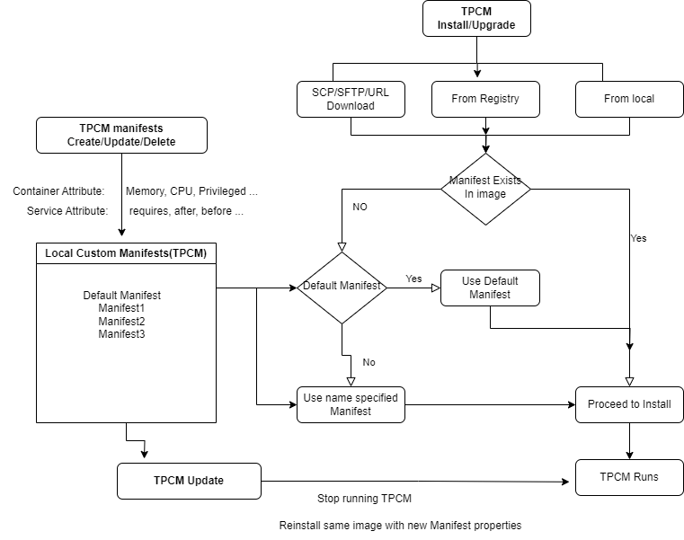

# Third Party Container Management Enhancements to SONiC Application Extensions framework

#### Rev 0.3

## Table of Content 
  * [List of Tables](#list-of-tables)
  * [Revision](#revision)
  * [Scope](#scope)
  * [Definitions/Abbreviations](#definitionsabbreviations)
  * [Document/References](#documentreferences)
  * [Overview](#overview)
  * [Requirements](#requirements)
  * [Architecture Design](#architecture-design)
  * [High-Level Design](#High-Level-Design)
  * [SAI API](#SAI-API)
  * [Configuration and management](#Configuration-and-management)
  * [Restrictions/Limitations](#restrictionslimitations)
  * [Testing Requirements/Design](#testing-requirementsdesign)

## List of Tables
- [Table 1: Abbreviations](#table-1-abbreviations)
- [Table 2: References](#table-2-references)

### Revision
| Rev  |    Date    |       Author      | Change Description                              |
|:----:|:----------:|:-----------------:|:-----------------------------------------------:|
| 0.1  | 10/14/2022 |Kalimuthu Velappan, Senthil Guruswamy, Babu Rajaram | Initial version                                 |                     
| 0.2  | 03/10/2023 |Senthil Guruswamy | Update                                 |                     
| 0.3  | 09/19/2023 |Senthil Guruswamy | Update                                 |                     


This document provides High Level Design information on extending SONiC Application Extension Infrastructure to seamlessly support a Third Party Application. 

### Scope
There are many Third Party application dockers, that can be used in SONiC to provision, manage and monitor SONiC devices. The dockers need not be compatible with SONiC and also need not be predefined or qualified with Sonic. These are extensions to SONiC and can be dynamically installed, similar to debian apt install or pip install paradigms. To support this, we need additional capabilities to seamlessly integrate with SONiC. These are related to installation, upgrade, and configuration. SONiC Application Extension Framework already provides an infrastructure to integrate applications, and this document details the enhancements.


### Definitions/Abbreviations 

#### Table 1 Abbreviations

| **Abbreviation** | **Definition**                        |
| ---------------- | ------------------------------------- |
| SONiC            | Software for Open Networking in Cloud |
| DB               | Database                              |
| API              | Application Programming Interface     |
| SAI              | Switch Abstraction Interface          |
| YANG             | Yet Another Next Generation           |
| JSON             | Java Script Object Notation           |
| XML              | eXtensible Markup Language            |
| gNMI             | gRPC Network Management Interface     |
| TPC              | Third Party Container                 |
| TPCM             | Third Party Container Management      |
| AEF              | Application Extension Framework       |

### Document/References

#### Table 2 References

| **Document**                       | **Location**  |
|------------------------------------|---------------|
| SONiC Application Extension Infrastructure HLD | [https://github.com/stepanblyschak/SONiC/blob/8d1811f7592812bb5a2cd0b7af5023f5b6449219/doc/sonic-application-extention/sonic-application-extention-hld.md) |


### Overview 

SONiC is an open and extensible operating system. SONiC can be extended with Third Party Containers to help with Orchestration, Monitoring, and extending any features or capabilities of SONiC NOS. These can be custom built or readily available in docker community. The rich open eco system provides with multiple docker based applications which can be used in SONiC. And these need not be pre-defined packages in SONiC. While SONiC Application Extensions framework provides the infrastructure to package and integrate a TPC into SONiC, we need more capabilities to provide a dynamic environment and capabilities:

- Dynamically install TPCs from various sources without pre-packaging them in SONIC. 
- Ensure TPC has right system resources and privileges
- Abilitiy to configure startup command arguments to TPC
- Configure resource limits to TPCs, to ensure it does not starve core SONiC containers
- Ability to seamlessly integrate into SONiC Services Architecture enabling start/ auto restart/ establish dependencies


### Requirements

These open TPCs help extend SONiC capabilities, and thus the following requirements are outlined to integrate them seamlessly into SONiC

- Dynamically install TPC from docker registry and docker image from the local file system, SCP, SFTP, URL. These remote download options are introduced now to SONiC AEF.
- Upgrade TPCs from docker registry and docker image from local file system, SCP, SFTP, URL
- Provide default manifest file for docker image without manifest during install.
- Provide runtime install capability to pass various docker startup arguments and parameters through local custom manifest file.
- Specify system resource limits for TPCs to restrict CPU, Memory usage
- Provide update capability to update various TPC configurations like their memory, cpu, dependencies etc. This capability is new to SONiC AEF.


### Architecture Design 

There is no change to the SONiC architecture. 


### High-Level Design 

SONiC Application Extension Infrastructure provides the framework to integrate SONiC compatible dockers. However there are many open source third party applications which can be installed on SONiC system, to extend the capabilities, and these typically are standalone or have less interaction with the SONiC system itself. So it is not necesary to for these docker applications to be SONiC compliant, and provide their corresponding manifest.json. These TPCs can be installed dynamically on a SONiC device and can be managed.

- This feature enables the installation and management of third-party Docker packages without manifest files through the Sonic Package Manager. 
- This feature enables users to create a local custom manifest file (from default manifest template file) on-the-fly which can be updated or deleted as needed. 
- Additionally, the Sonic Package Manager provides CLI commands to create, update, and delete the local custom manifest file.


<!-- omit in toc -->
###### Figure. SONiC TPCM Support

<p align=center>

</p>


#### TPC Install

- The TPCM support feature will leverage the existing Sonic Package Manager framework.
- Ability to download image tarballs for the Docker packages through SCP, SFTP, and URL before installing them is introduced.
- If a manifest file is not found in the docker image during installation, a default local TPC manifest file is used to install the package.
- At the end of the TPC installation using sonic-package-manager install, if no manifest file is found in the image and the --name option is used, a new manifest file with the specified name is created.
- The user can also create a custom local manifest file to be used during installation by specifying the "--use-local-manifest" option along with a custom name using the "--name" option in "sonic-package-manager install" command.
- The custom local manifest file can be created using "sonic-package-manager manifests create" command
- The custom local manifest file will be created under the directory /var/lib/sonic-package-manager/manifests/.
- "--name" option takes effect only for TPC packages(that do not have a manifest file in them) and the custom local manifest file with the specified name is created.
- The --name option enables the installation of multiple TPC containers using the same TPC docker image.
- The default TPC manifest file will have the following properties:

```
{
    "version": "1.0.0",
    "package": {
        "version": "1.0.0",
        "depends": [],
        "name": "default"
    },
    "service": {
        "name": "default",
        "requires": [
            "docker"
        ],
        "after": [
            "docker"
        ],
        "before": [],
        "dependent-of": [],
        "asic-service": false,
        "host-service": false,
        "warm-shutdown": {
            "after": [],
            "before": []
        },
        "fast-shutdown": {
            "after": [],
            "before": []
        },
        "syslog": {
            "support-rate-limit": false
        }
    },
    "container": {
        "privileged": false,
        "volumes": [],
        "tmpfs": [],
        "entrypoint": ""
    },
    "cli": {
        "config": "",
        "show": "",
        "clear": ""
    }
}

```

- The 'entrypoint' attribute is used to update the docker startup command arguments. For example, setting "command":"--path.rootfs=/host" would configure the host filesystem as the root filesystem path for the container


#### Custom manifest creation process

- The "sonic-package-manager manifests create <name>" command allows users to create a custom manifest file with the specified name
- It uses same manifest directory (/var/lib/sonic-package-manager/manifests) for both creating and updating custom manifests.
- Manifest file format and validations are to be ensured.
- It takes a json file as input.

#### Custom manifest update process

- The local manifest file contents can be updated for a TPCM Docker package using "sonic-package-manager manifests update <name> --from-json <>" command
- Executing this command will lead to the creation of a new file with the extension .edit for the manifest file that matches the provided name in the same location.
Conditions:
	- If the package is already installed:
		- If the name.edit file does not exist, create it by copying from the original name file.
		- If the name.edit file already exists, update it directly.
	- If the package is not installed:
		- Update the name file directly.


#### TPC Update

- After updating the local manifest file, the TPC container can be updated with the "sonic-package-manager update" command. This command will reinstall the TPC container using the new manifest file.

- After the completion of the sonic-package-manager update process, if it succeeds, we should move the manifests/name.edit file to manifests/name. Otherwise, if the update process does not succeed, the name.edit file should remain unchanged. 

- During the sonic-package-manager update, the update process can be performed by taking the old package from name and the new package from name.edit.


#### TPC Uninstall

- The uninstallation process for TPC packages using 'sonic-package-manager uninstall' follows the same procedure as regular Sonic packages, 
    where the corresponding Docker container and service are stopped and removed, and the package image is deleted if it is not in use. 
    The local manifest file associated with the TPC package is also removed during uninstallation.

- At the end of sonic-package-manager uninstall name, this manifest file name and name.edit will be deleted.


#### TPC Upgrade

- The upgrade process for TPC packages using 'sonic-package-manager install' follows the same procedure as regular Sonic packages. 
- Since the manifest package version mismatch is the trigger for package upgrade, the user must use --force option for TPC upgrade.
- The new version of the TPC package is downloaded and installed, and the new manifest is created if necessary. 
- The old version of the TPC package is then removed if not in use by other package, and the running container is restarted with the new version.


### SAI API 

Not applicable

### Configuration and management 

<!-- omit in toc -->
#### CLI Enhancements

The SONiC Package Manager is another executable utility available in base SONiC OS called *sonic-package-manager* or abbreviated to *spm*. This would be extended to support these new TPCM capabilities. The command line interfaces are given bellow:

<!-- omit in toc -->
#### CLI

<!-- omit in toc -->
#### TPC Installation

This section shows the additional options that would be added for TPC installation in the sonic-package-manager CLI

```
admin@sonic:~$ sudo sonic-package-manager install --help

Usage: sonic-package-manager install [OPTIONS] [PACKAGE_EXPR]

  Install SONiC package.

Options:
  --from-tarball                    Install using the tarball from local/SCP/SFTP/HTTPS url
  --use-local-manifest              Use locally created manifest file
  --name                            custom name for tpcm package
  ```

<!-- omit in toc -->
###### Examples

```
admin@sonic:~$ sudo sonic-package-manager install httpd:latest --name my_httpd
```

Install from url:
```
admin@sonic:~$ sudo sonic-package-manager install --from-tarball https://tpc.local-server.com/home/tpcs/httpd.tar.gz --name=my_url_httpd
```

Install from scp:
```
admin@sonic:~$ sudo sonic-package-manager install --from-tarball scp://username@10.171.112.156/home/tpcs/httpd.tar.gz --name my_scp_httpd
```

Install from sftp:
```
admin@sonic:~$ sudo sonic-package-manager install --from-tarball sftp://username@10.171.112.156/home/tpcs/httpd.tar.gz --name my_sftp_httpd
```

Install from local FS:
```
admin@sonic:~$ sudo sonic-package-manager install --from-tarball /usb1/tpcs/httpd.tar.gz --name my_local_httpd
```

#### TPC Uninstallation

sonic-package-manager uninstall option shall be used to uninstall the TPC


<!-- omit in toc -->
###### Examples

```
admin@sonic:~$ sudo sonic-package-manager uninstall my_scp_httpd
```


#### TPC Update CLI

Introduced a new option under sonic-package-manager CLI to support update of various parameters of manifest file for a given TPC through a json file


<!-- omit in toc -->
###### Examples

```
admin@sonic:~$ sudo sonic-package-manager manifests update my_node_exporter --from-json /tmp/new.json
admin@sonic:~$ sudo sonic-package-manager update my_node_exporter --use-local-manifest 
```


#### TPC Upgrade CLI

No change in the sonic-package-manager CLI for upgrade which is 'sonic-package-manager install'


#### TPC Manifests CLI

##### Manifest Create

sonic-package-manager manifests create <manifest-name> --from-json <jsonfile>

<!-- omit in toc -->
###### Examples
Create a default local tpcm manifest file
```
admin@sonic:~$ sudo sonic-package-manager manifests create my_httpd
```

Create a local tpcm manifest file with a json file
```
admin@sonic:~$ sudo sonic-package-manager manifests create my_httpd --from-json /tmp/new.json
```


##### Manifest Update

sonic-package-manager manifests update <manifest-name> --from-json <jsonfile>

<!-- omit in toc -->
###### Examples
Update a tpcm manifest
```
admin@sonic:~$ sudo sonic-package-manager manifests update my_httpd --from-json /tmp/modified.json
```


##### Manifest show

sonic-package-manager manifests show  <manifest-name>

<!-- omit in toc -->
###### Examples
Display the contents of a local tpcm manifest file
```
admin@sonic:~$ sudo sonic-package-manager manifests show my_httpd
```

##### Manifest delete

sonic-package-manager manifests delete  <manifest-name>

<!-- omit in toc -->
###### Examples
Delete the local tpcm manifest file
```
admin@sonic:~$ sudo sonic-package-manager manifests delete my_httpd
```

##### Manifest list

sonic-package-manager manifests list

<!-- omit in toc -->
###### Examples
Display all the local tpcm manifest files from TPC manifest folder
```
admin@sonic:~$ sudo sonic-package-manager manifests list
```

### Restrictions/Limitations

TPC with mgmt VRF support can be provided later but currently we don't support it.
TPC with resource limits will be provided in the followup.


### Future Enhancements Proposal

- Local custom Manfiest file could be used(created/updated) for SONiC packages as well.
- TPC could be configured to start right after system becomes ready so that SONiC packages bootup wont be delayed.
- Data preservation in TPCM migration
- TPC and SONiC containers to have resource limits in place in config db.


### Testing Requirements/Design

#### Unit Test cases

Installation test case: 
- Verify that TPCM packages can be installed successfully using the sonic package manager with a custom local manifest file.
- Verify with SCP
- Verify with SFTP
- Verify with url

Uninstallation test case: 
- Verify that TPCM packages can be uninstalled using the sonic package manager without any issues.

Upgrade test case: 
- Verify that TPCM packages can be upgraded to newer versions using the sonic package manager without any issues.
- Verify TPC migration on Sonic to Sonic upgrade

Custom manifest file test case: 
- Verify that a custom manifest file can be created for TPCM packages using the sonic-package-manager manifests create command and used during TPCM installation.

Multiple TPC containers test case: 
- Verify that multiple TPC containers can be installed on the same system using the --name option and that they can be managed independently.

Manifest file update test case: 
- Verify that the local manifest file can be updated using the sonic-package-manager manifests update command and that the changes are reflected during TPCM installation.

Error handling test case: 
- Verify that the sonic package manager can handle errors gracefully and provide meaningful error messages to users in case of failures during TPCM installation, upgrade, or uninstallation.


#### System Test cases

- Verify that TPC containers can be installed and run alongside Sonic containers without conflicts or issues.
- Verify that TPC containers can be scaled up and down as needed to meet changing workload demands, and that Sonic containers can coexist with these changes

