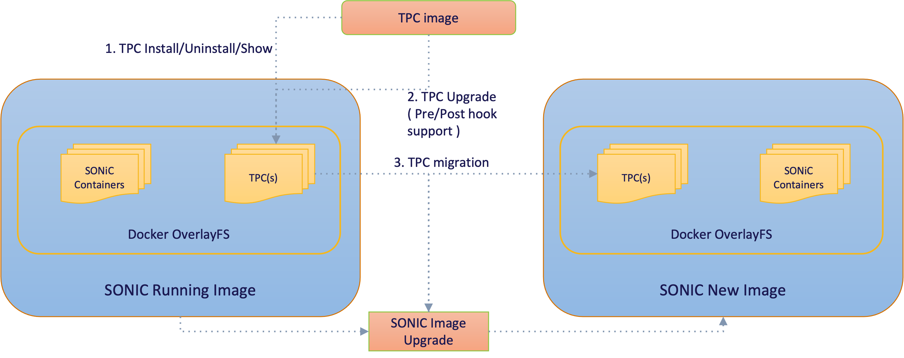

# Third Party Container Management Enhancements to SONiC Application Extensions framework

#### Rev 0.2

## Table of Content 
  * [List of Tables](#list-of-tables)
  * [Revision](#revision)
  * [Scope](#scope)
  * [Definitions/Abbreviations](#definitionsabbreviations)
  * [Document/References](#documentreferences)
  * [Overview](#overview)
  * [Requirements](#requirements)
  * [Architecture Design](#architecture-design)
  * [High-Level Design](#High-Level-Design)
  * [SAI API](#SAI-API)
  * [Configuration and management](#Configuration-and-management)
  * [Restrictions/Limitations](#restrictionslimitations)
  * [Testing Requirements/Design](#testing-requirementsdesign)

## List of Tables
- [Table 1: Abbreviations](#table-1-abbreviations)
- [Table 2: References](#table-2-references)

### Revision
| Rev  |    Date    |       Author      | Change Description                              |
|:----:|:----------:|:-----------------:|:-----------------------------------------------:|
| 0.1  | 10/14/2022 |Kalimuthu Velappan, Senthil Guruswamy, Babu Rajaram | Initial version                                 |                     
| 0.2  | 03/10/2023 |Senthil Guruswamy | Update                                 |                     


This document provides High Level Design information on extending SONiC Application Extension Infrastructure to seamlessly support a Third Party Application. 

### Scope
There are many Third Party application dockers, that can be used in SONiC to provision, manage and monitor SONiC devices. The dockers need not be compatible with SONiC, but can almost work independently with minimal SONiC interfaces. These are extensions to SONiC and require additional capabilities to seamlessly integrate with SONiC. These are related to installation, upgrade, and configuration. This document details those enhancements to the SONiC Application Extension Infrastructure to enable integrating a Third Party Application in the form of dockers with SONiC.

### Definitions/Abbreviations 

#### Table 1 Abbreviations

| **Abbreviation** | **Definition**                        |
| ---------------- | ------------------------------------- |
| SONiC            | Software for Open Networking in Cloud |
| DB               | Database                              |
| API              | Application Programming Interface     |
| SAI              | Switch Abstraction Interface          |
| YANG             | Yet Another Next Generation           |
| JSON             | Java Script Object Notation           |
| XML              | eXtensible Markup Language            |
| gNMI             | gRPC Network Management Interface     |
| TPC              | Third Party Container                 |
| TPCM             | Third Party Container Management      |

### Document/References

#### Table 2 References

| **Document**                       | **Location**  |
|------------------------------------|---------------|
| SONiC Application Extension Infrastructure HLD | [https://github.com/stepanblyschak/SONiC/blob/8d1811f7592812bb5a2cd0b7af5023f5b6449219/doc/sonic-application-extention/sonic-application-extention-hld.md) |


### Overview 

SONiC is an open and extensible operating system. SONiC can be extended with Third Party Containers to help with Orchestration, Monitoring, and extending any features or capabilities of SONiC NOS. These can be custom built or readily available in docker community. The rich open eco system provides with multiple docker based applications which can be used in SONiC. And these need not be pre-defined packages in SONiC. While SONiC Application Extensions framework provides the infrastructure to package and integrate a TPC into SONiC, we need more capabilities to provide a dynamic environment and capabilities:

- Dynamically install TPCs from various sources without pre-packaging them in SONIC. 
- Ensure TPC has right resources and privileges
- Configure resource limits to TPCs, to ensure it does not starve core SONiC containers
- Ability to seamlessly integrate into SONiC Services Architecture enabling start/ auto restart/ establish dependencies
- Provide an upgrade framework to enable TPC upgrade and data migration during SONiC upgrade


### Requirements

These open TPCs help extend SONiC capabilities, and thus the following requirements are outlined to integrate them seamlessly into SONiC

- Dynamically install TPC from docker registry, scp, sftp, http, https, local file system or a docker image from the local file system
- Upgrade TPCs from docker registry, scp, sftp, http, https, local file system or a docker image from the local file system
- Provide runtime install capability to pass various docker startup arguments and parameters
- Dynamically specify the SONiC Service startup dependencies for the TPC
- Specify system resource limits for TPCs to restrict CPU, Memory usage
- Framework to upgrade TPCs including the data migration, within a SONiC image
- Framework to migrate TPCs and their data to a new SONiC image as part of SONiC Image upgrade
- Provide update utility to update various TPC configurations like their startup parameters, dependencies etc.,


### Architecture Design 

There is no change to the SONiC architecture. 

### High-Level Design 

SONiC Application Extension Infrastructure provides the framework to integrate SONiC compatible dockers. However there are many open source third party applications whic can be installed on SONiC system, to extend the capabilities, and these typically are standalone or have less interaction with the SONiC system itself. So it is not necesary to pre define these docker applications in SONiC build, and provide their corresponding manifest.json. These TPCs can be installed dynamically on a SONiC device and can be managed. To support these, we need:

- Install these TPC into SONIC 
- Integrate the startup/stop systemd scripts for these containers
- Configure various limits like CPU/Memory so they dont interfere with the core SONIC components

#### TPC Images and Storage

- All the TPCs and its image layers are stored as part of SONiC Docker image file system. The Docker image FS storage mostly located on the /var/lib/docker/overlay2 folder which is specific to each SONiC image in the system. Thus, TPC storage is shared across all the SONiC images in the system. The TPC storage mainly contains the following contents.

1. TPC systemd service files.
2. Private data volume for each TPC.
3. One Shared data volume for all the TPCs.
4. Resource configuration file for each TPC.
5. TPC service files and utility scripts that gets installed as part of SONiC installation.

Any unpublished docker, not specified in packages.json will be treated as a TPC and will be stored in this TPC storage. 

#### TPC Install and Uninstall

Provide a seamless interface to install and uninstall TPCs into SONiC. 

##### TPC Install

TPCs can be installed on SONiC using one of these sources: docker registry, scp, sftp, http, https, or from the local file system. During the installation process, the following steps get executed.

1. Download the TPC image from one of the sources.
2. Install the TPC image into SONiC system.
3. Create a systemd service and resource configuration for the newly installed TPC image.
4. Create a container for the newly installed TPC image.
5. Bring up container instance by starting the TPC service.

##### TPC Uninstall

The uninstallation option will remove the TPC container from the SONiC system.

During the uninstallation process, the following steps get executed.
1. Stops the running TPC container by stopping the corresponding TPC service.
2. Removes the TPC service file from the SONiC systemd service manager.
3. Removes the TPC Container instance from the SONiC system.
4. Removes the TPC image from the SONiC system
5. Removes all the private data associated with the TPC


#### TPC startup arguments

The startup arguments and the command arguments can be customized at the time of TPC installation. These can be used to configure the entrypoints and the arguments to the entrypoint commands. These are critical to customize to a given environment. 

For eg., --args  "--entrypoint=/bin/node_exporter"  --cargs “--path.rootfs=/host“
CONTAINER ID          IMAGE                                                                   COMMAND                                                        CREATED      
60a8ef7264efb43        quay.io/prometheus/node-exporter:latest                **"/bin/node_exporter --path.rootfs=/host" **  39 seconds ago


#### Resource Limits  for TPC

It is important to specify various resource limits on TPCs to ensure the overall health of the SONiC system is not compromised. Following system resource limits shall be applicable to TPCs:
- CPU 
- System Memory

These limits can be configured during the TPC installation. 

##### CPU Resource
- By default, for each TPC docker, the CPU resource limit is restricted to 20%. 

##### Memory Limits
- As a policy, TPC overall memory limit is restricted to 20% of system memory  ( say, 3087MB from 15G system ram)
- By default, if individual TPC memory limit is not specified with the args input(--memory), 20% of TPC overall memory limit is assigned ( say, 617MB from 3087MB in a 15G system ram)
- Idea is that summation of the memory limits configured for all TPCs must not go beyond the overall TPC memory limit set.
- The value for --memory will be designed to be parsed using docker.utils.parse_bytes which defines the postfix to the unit specified should be one of the `b` `k` `m` `g` characters (or) KB/MB/GB  or  K/M/G  or the unit without any postfix be consider a simple byte value.


#### TPC Update

As we saw above, the startup arguments, resource limits can be configured for the TPCs. All of these can be updated later via an update utility. The corresponding docker containers would be restarted after the TPCs are updated. 


#### TPC Upgrade

There are two use cases for TPC upgrade:
- Upgrade a TPC within a running SONiC Image
- Migrate a TPC from the running SONiC Image to a new SONiC image as part of SONiC upgrade

<!-- omit in toc -->
###### Figure. SONiC TPC Package Upgrade 

<p align=center>

</p>

##### TPC Upgrade within a SONiC Image

To minimize disruption, the existing TPC container would run until the image is upgraded and its data is migrated. TPC upgrade infrastructure shall provide pre and post hooks for TPCs to help with data migration or any upgrade related house keeping. The pre/post hook is an optional script that should be added by the TPC.

Here is the sequence of TPC upgrade operation:
1. Run the TPC internal pre hook script. 
2. Run the TPC external pre hook script. 
3. It stops the already running TPC container. 
4. Remove the existing TPC container. 
5. Loads the new TPC image into the Docker image list. 
6. Create the new TPC container from newly loaded TPC image. 
7. Run the newly created container. 
8. Execute the TPC external post script. 
9. Execute the TPC internal post script. 
10. Remove the old TPC image.

During the TPC upgrade if any these operation fails, it will rollback to old container.


##### TPC migration as part of SONiC Image upgrade

Since these TPCs are not packaged into the SONiC image, these TPCs would not exist when we upgrade to the new SONIC image. Thus there is a need to automatically migrate the existing TPCs over to the new SONiC image so they continue to work seamlessly.

#### Manifest.json enhancements

Many of the enhancements identified here including startup arguments, memory limits can also be specified in a manifest.json file for the given TPC. Manifest.json capabilities will be enhanced to support all of these parameters. This manifest.json can be specified as a URL while creating the TPCs.

```
    "container": {
        "memory": 512M,
        "cpu-period"=100000,
        "cpu-quota"=20000,
        "privileged": true,
        "volumes": [
            "/etc/sonic:/etc/sonic:ro",
            "/usr/share/sonic/scripts:/usr/share/sonic/scripts:ro"
        ],
        "mounts": [],
        "environment": {},
        "tmpfs": [
            "/tmp/",
            "/var/tmp/"
        ]
    },
    "service": {
        "name": "xx",
        "check_up_status": false,
        "start-after-system-ready": true,
        ...
    }
```

### SAI API 

Not applicable

### Configuration and management 

<!-- omit in toc -->
#### CLI Enhancements

The SONiC Package Manager is another executable utility available in base SONiC OS called *sonic-package-manager* or abbreviated to *spm*. This would be extended to support these new TPCM capabilities. The command line interfaces are given bellow:

<!-- omit in toc -->
#### CLI

<!-- omit in toc -->
#### TPC Installation

This section shows the additional options that would be added for TPC installation in the sonic-package-manager CLI

```
admin@sonic:~$ sudo sonic-package-manager install --help

Usage: sonic-package-manager install [OPTIONS] [PACKAGE_EXPR]

  Install SONiC package.

Options:
  --from-https						Install using the tarball from HTTPS source
  --from-scp						Install using the tarball from SCP source
  --from-sftp 						Install using the tarball from SFTP source
  --from-fs							Install using the tarball from the local FS
  --name							Specify a custom name for the container when installed
  ```

<!-- omit in toc -->
###### Examples

```
admin@sonic:~$ sudo sonic-package-manager install --name=my_node_exporter node-exporter:latest 
```

Install from https:
```
admin@sonic:~$ sudo sonic-package-manager install --from-https=https://tpc.local-server.com/home/tpcs/ne.tar.gz --name=my_node_exporter  
```

Install from scp:
```
admin@sonic:~$ sudo sonic-package-manager install --from-scp=10.171.112.156 --username=user1 --password=pass123 --filename=/home/tpcs/ne.tar.gz --name=my_node_exporter  
```

Install from sftp:
```
admin@sonic:~$ sudo sonic-package-manager install --from-sftp=10.171.112.156 --username=user1 --password=pass123 --filename=/home/tpcs/ne.tar.gz --name=my_node_exporter  
```
Install from local FS:
```
admin@sonic:~$ sudo sonic-package-manager install --from-fs --filename=/usb1/tpcs/ne.tar.gz --name=my_node_exporter  
```
#### TPC Uninstallation

sonic-package-manager uninstall option shall be used to uninstall the TPC


<!-- omit in toc -->
###### Examples

```
admin@sonic:~$ sudo sonic-package-manager uninstall --name=my_node_exporter
```

#### TPC Startup Arguments

The sonic-package-manager install command shall have an option to specify various arguments to the container, including container arguments, entrypoint in the container, arguments to the container entrypoint command. 


<!-- omit in toc -->
###### Examples

```
admin@sonic:~$ sudo sonic-package-manager install --name=my_node_exporter --args="--network=host --entrypoint=/bin/node_exporter" --cargs="--path.rootfs=/host" node-exporter:latest 
```

Args would be passed on during the container creation, and the cargs shall be the arguments for the container startup command. The above shall get reflected as:

```
CONTAINER ID          IMAGE                               COMMAND                                        CREATED      
60a8ef7264efb43       node-exporter:latest                **"/bin/node_exporter --path.rootfs=/host" ** 39 seconds ago
```


#### TPC Resource limits

##### CPU Resource limit

As a policy, we will allocate only 20% of the CPU for TPCs.After installation, the default CPU values would be:

--cpu-period=100000 --cpu-quota=20000 --cpu-shares=0 --cpus=0

These parameters are restricted to be passed as args to the TPC install.

##### Memory Resource limit

Memory limit for TPCs can be set via the --memory args


<!-- omit in toc -->
###### Examples

```
admin@sonic:~$ sudo sonic-package-manager install --name=my_node_exporter --args="--memory=50m" node-exporter:latest 


root@sonic:/home/admin# docker inspect my_node_exporter | grep Memory
            "Memory": **52428800**,
            "KernelMemory": 0,
            "KernelMemoryTCP": 0,
            "MemoryReservation": 0,
            "MemorySwap": **52428800**,
            "MemorySwappiness": null,
```


#### TPC Update CLI

The sonic-package-manager CLI shall be enhanced to support update of various parameters like args, cargs, memory limit for a given TPC.


<!-- omit in toc -->
###### Examples

Update the memory limit
```
admin@sonic:~$ sudo sonic-package-manager update --name=my_node_exporter --args="--memory=200m" 
```


#### TPC Upgrade CLI

The sonic-package-manager CLI shall be enhanced to support upgrade of TPCs. 

This section shows the additional options that would be added for TPC upgrade in the sonic-package-manager CLI

```
admin@sonic:~$ sudo sonic-package-manager upgrade --help

Usage: sonic-package-manager upgrade [OPTIONS] [PACKAGE_EXPR]

  Install SONiC package.

Options:
  --from-https						Install using the tarball from HTTPS source
  --from-scp						Install using the tarball from SCP source
  --from-sftp 						Install using the tarball from SFTP source
  --name							Specify a custom name for the container when installed
  ```

<!-- omit in toc -->
###### Examples

```
admin@sonic:~$ sudo sonic-package-manager upgrade --name=my_node_exporter node-exporter:latest 
```


### Restrictions/Limitations  

Minimum System requirements to support TPCs are 8G memory.

### Testing Requirements/Design

#### Unit Test cases

1. Verify the TPC install from http/https server
2. Verify the TPC install from a remote server using SCP protocol
3. Verify the TPC install from a remote server using SFTP protocol.
4. Verify the TPC install from a local media path
5. Verify the TPC install from an external Docker registry.
6. Verify the TPC install with different parameter combinations.
7. Verify the TPC uninstall of running containers.
8. Verify the TPC upgrade with an already installed image.
9. Verify the TPC uninstall and its associated service file removal.
10. Verify the TPC service auto startup after reboot.
11. Verify the SONiC image upgrade with TPC container migration.
12. Verify the Hardware resource CPU/Memory limitations.
13. Verify the TPC list of all TPC dockers.
14. Verify the TPC service start/stop/restart.
15. Verify the CPU resource usage of TPC.
16. Verify the Memory resource usage of TPC
17. Verify the Container argument option of TPC.

#### System Test cases

1. Verify Sonic containers does not starve in terms of CPU, memory on TPC existence.
2. Verify Sonic system ready does not delay with TPC bootup.
3. Verify Sonic image upgrade with TPCs.


