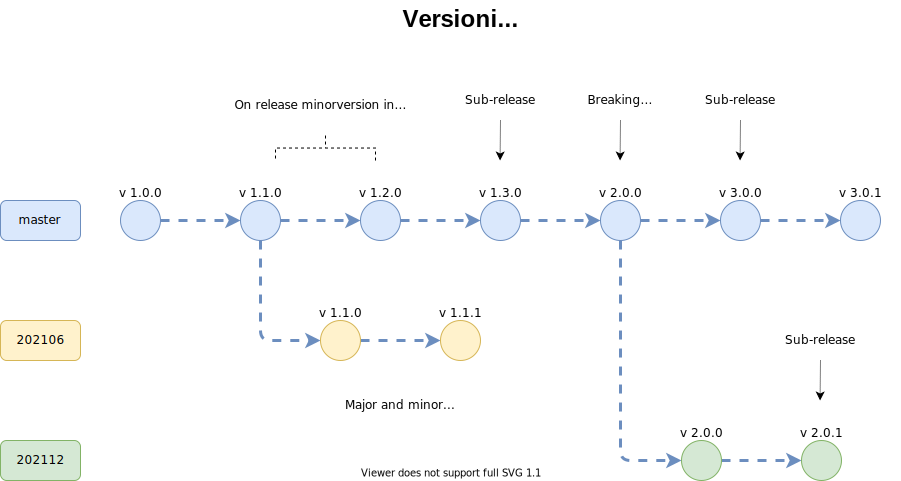

<!-- omit in toc -->
# SONiC OS & SONiC Docker Images Versioning

<!-- omit in toc -->
#### Rev 0.1

<!-- omit in toc -->
## Table of Content
- [SONiC Package API](#sonic-package-api)
- [SONiC Package Releases](#sonic-package-releases)
- [Conventional Commits](#conventional-commits)
- [SONiC Packages Versioning](#sonic-packages-versioning)
- [Base OS versioning](#base-os-versioning)
- [Base OS API that a package uses](#base-os-api-that-a-package-uses)
- [Open Questions](#open-questions)

<!-- omit in toc -->
## List of Figures

### Revision

| Rev |     Date    |       Author            | Change Description                   |
|:---:|:-----------:|:-----------------------:|--------------------------------------|
| 0.1 | 02/2021     | Stepan Blyshchak        | Initial Proposal                     |

### Overview

This document provides guidelines on how to do versioning for SONiC Docker Images using to semantic versioning strategy.

<!-- omit in toc -->
#### Motivation

With new SONiC Application Extension Infrastructure SONiC Dockers and SONiC Base OS can be seperated and distributed individually.
SONiC Dockers (aka SONiC Packages) can be installed, upgraded invididually from other. This creates a new problem which needs to be
solved - compatibility between dependend Dockers and host OS. SONiC Application Extension Infrastructure provides a way to specify
the package version dependency using semantic versioning (https://semver.org). This document provides a guideline on how to increment
version numbers correctly on releases.  

## SONiC Package API

First of all, a clear definition of what is package API needs to be provided:

SONiC package API is Redis DB interface including:
  - CONFIG DB, APPL DB, STATE DB tables schema provided by this package
  - Redis-based IPC Communication API: libswsscommon, libsairedis

If any other kind of API is exposed by the SONiC Package it should be accounted as package API.

## SONiC Package Releases

As of today (202012 release), all SONiC Docker Images are released together with SONiC OS. With SONiC Application Extension
Infrastructure SONiC Dockers are released independently. On every release an increment in package version number is required.
The exact number in version that needs to be incremented depends on the type of changes comparing to previously released
package.

Types of changes:
  - Breaking change: backwards incompatible change; reflects in ***major*** version number
  - New functionality: backward compatible change; reflects in ***minor*** version number
  - Bug fixes or enhancement; reflects in ***patch*** version number

## Conventional Commits

In order to help ***package maintainers*** to understand whether a breaking change was introduced
comparing to previous release or a new functionality was included all SONiC repositories *can*
follow conventional commits (https://www.conventionalcommits.org/en/v1.0.0/):

e.g:

```
feat: Introduce new methods in ConsumerTable

BREAKING CHANGE: this feature breaks the Consumer/Producer based IPC
```

## SONiC Packages Versioning

- Package release ***happens on SONiC release/branch-out*** or on demand for single Docker image: ***sub-release***
- Manual version update ***is required*** when SONiC Package releases
- Within a release major and minor version ***must*** not change
  - Package API backward compatibility is promised
  - No new functionality is included
- On package release ***package maintainer must*** check package API compatibility with previous release
- In case API changed comparing to previous release ***package maintainer must*** must increment major version in master prior to branch-out
- In case API didn't change comparing to previous release ***package maintainer must*** must increment minor version in master prior branch-out
- Minor version in master after branch-out ***must*** be incremented by ***package maintainer*** in order to avoid version overlap between branches
- *Patch* version is updated on bug fixes and minor enhancements. Since this is a tedious work to do mannually on every change
  this can be done only when the package is published to users via container registry (package release).
  A package is published with a bug fix or enhancement whenever ***package maintainer decides*** to do so.
- On package release ***package maintainer must*** update package dependencies

<p align=center>

</p>

***package maintainer can*** update *default-reference* in package.json in SONiC buildimage to point to a default version which will be used when user installs a package.

## Base OS versioning

## Base OS API that a package uses

- SONiC utilities
    - This is a ***sonic-utilities contributor responsibility***
- Dependence on a new kernel functionality must be recorded in minor version
    - This is a ***package maintainer responsibility***
    E.g.: a patch in kernel to support 3-tuple conntrack entries that NAT docker depends on. (e.g. sonic-linux-kernel update in sonic-buildimage should result in increment: 1.4.5(current) to 1.5.0)
    A dependency should be defined in manifest.json:
    ```json
    {
        "package": {
            "base-os-constraint": "^1.5.0"
        }
    }
    ```
- SONiC host service (D-Bus based communitcation)


## Open Questions
