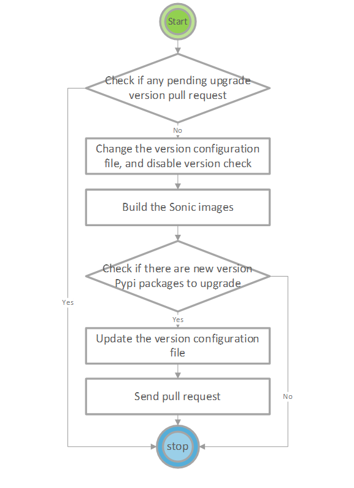
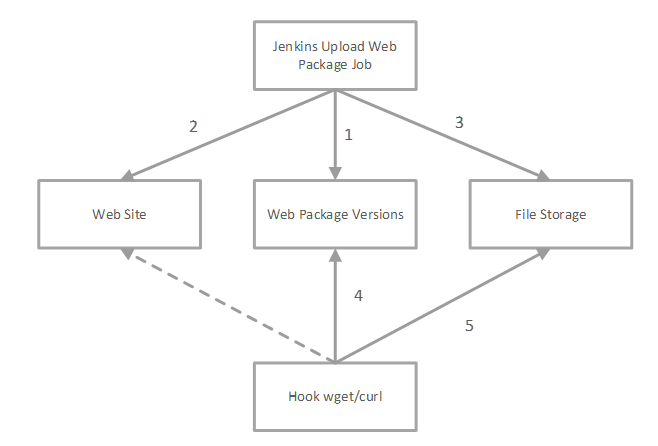
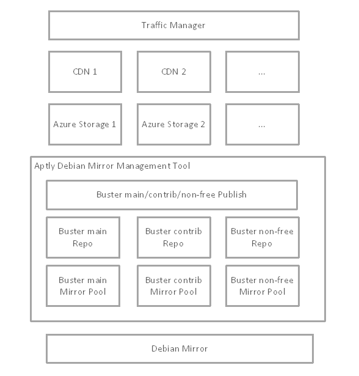

# SONiC Reproduceable Build

# Table of Contents

- [Revision History](#revision-history)
- [Overview](#overview)
- [Pypi packages](#pypi-packages)
  * [Pypi Version Configuration](#pypi-version-configuration)
  * [Pypi Version Control and Check](#pypi-version-control-and-check)
  * [Pypi Version Upgrade Automation](#pypi-version-upgrade-automation)
  * [Work Items](#work-items)
- [Debian Packages](#debian-packages)
  * [Debian Version Configuration](#debian-version-configuration)
  * [Debian Packages Version Control and Check](#debian-packages-version-control-and-check)
  * [Work Items](#work-items-1)
- [Debootstrap](#debootstrap)
- [Packages downloaded by wget/curl](#packages-downloaded-by-wget-curl)
  * [Web Package Version Configuration](#web-package-version-configuration)
  * [File Storage](#file-storage)
  * [The process to use a new web package](#the-process-to-use-a-new-web-package)
  * [Work Items](#work-items-2)
- [Debian Package Mirror](#debian-package-mirror)
  * [Debian Package Mirror managed by Aptly](#debian-package-mirror-managed-by-aptly)
- [Pypi Package Mirror](#pypi-package-mirror)
- [Docker Base Images](#docker-base-images)
- [Git Repository](#git-repository)

# Revision History
|Date|Description|
| :------- | :------- |
| 2020/08/21 | Xuhui Miao, initial version |
| 2020/09/21 | Xuhui, added Debian/pypi repo part |
| 2020/09/22 | Qi Luo, review |
| 2020/10/10 | Xuhui, debootstrap supports reproduceable build |

# Overview

There are many SONiC failure builds caused by the external dependencies changed. It can be built in the first time and might be failed in the next build, although there are no code changes. SONiC reproducible build is to make the build stable and reduce the failure rate, build on the same git commit, expect the same result.

The external dependencies contain pypi packages installed by pip/pip3, Debian packages installed by apt-get, wget/curl, debootstrap, docker base images, source code by git.

Some of the dependent packages can be controlled by its version for the reproduceable build, such as pypi packages, Debian package. There is an assumption that the content of the packages should be the same for the packages with the same version. The other packages do not have a specified version, when the remote package changed, it cannot be detected by its URL, such as wget/curl. The file storage will be introduced to solve the package without version issue.

When the reproduceable build is used, to catch up with the latest version of the dependent packages, sending pull request to update the versions is required, the automation Jenkins pipeline will be created to do it.

In Scopes:

1. Pypi packages installed by pip
2. Debian packages installed by apt-get
3. Host image created by debootstrap
4. Web packages downloaded by wget/curl
5. Debian package mirror
6. Pypi package mirror
7. Docker base images
8. Source code by git, full commit id
9. Arch: amd64, arm64, armhf

Next scopes:

1. Support on the old branches like 201911

# Pypi packages

## Pypi Version Configuration

The default version configuration files in &quot;files/build/versions/&quot; for Pypi packages.

| File Name | Description |
| --- | --- |
| versions-py2 | The default versions for python2 |
| versions-py3 | The default versions for python3 |

The content of the version file versions-py2 example:

Py==1.7.0

pyang==2.1.1

pyangbind==0.6.0

pyasn1==0.4.2

The versions can be overridden by the version configuration file with the same file name in the Dockerfile folder, for example, the content of the version file dockers/docker-base-buster/versions-py2:

**pyang==2.3.2**

When building the docker-base-buster, the expected version constraints are as below:

Py==1.7.0

**pyang==2.3.2**

pyangbind==0.6.0

pyasn1==0.4.2

The version auto/manual upgrade configure example is as below, the automation pipeline will not upgrade the version of the Pypi package pyasn1, because the upgrade=manual is set in the configure file, the default value is upgrade=auto for the other packages.

Py==1.7.0

pyang==2.3.2

pyangbind==0.6.0

pyasn1==0.4.2,upgrade=manual

To generate the initial version configuration file, we can manually start the docker containers and print versions by command &quot;pip freeze&quot;.

## Pypi Version Control and Check

In the Makefile or Dockerfile, if the version is specified for a Pypi package, it should be the same as the version in the constraints file. The build will be failed with version conflict.

| Version in config file | Version in Makefile/Dockerfile | Check Result |
| --- | --- | --- |
| Yes | No | Success |
| No | Yes | Success |
| No | No | Failed for version not specified |
| Yes | Yes | Failed if different version |

The Pypi version conguration file will be used as a pip constraints file, some of the flags no used, like upgrade=manual, will be removed when used by pip command. see [pip constraints-files user guide](https://pip.pypa.io/en/stable/user_guide/#constraints-files). It will control the installing packages and the referenced packages.

The pip/pip3 command in Makefile and Dockerfile will be hooked with a new one, if version conflict, the build will break. It only installs the version of the package specified in the configuration file by adding the constraints option.

## Pypi Version Upgrade Automation

Developers can change the Pypi package version manually, and the Jenkins job will be provided to upgrade the Pypi package version automatically. It will upgrade all the Pypi packages listed in the Pypi version files, except the packages with a flag &quot;upgrade=manual&quot; in the configuration file.

The data flow diagram of version upgrade is as below:

## Work Items

1. Generate the initial version files for pip/pip3.
2. Add the new pip/pip3 command, verify the version and use the version constraints.
3. Enable the new commands in Dockerfile files and Makefile files.
4. Implement the Pypi version upgrade automation Jenkins pipeline.

# Debian Packages

## Debian Version Configuration

The default version source files in files/build/versions/ for Debian packages.

| File Name | Description |
| --- | --- |
| versions-deb-jessie | The versions for jessie |
| versions-deb-stretch | The versions for stretch |
| versions-deb-buster | The versions for buster |

Similar to Pypi packages, the package version can be overridden per docker image. The different part is that the versions of the debian packages are relative to the debian release, in each release, such as the stretch and buster, the package versions are not the same, so we define a version configuration file for each debian release. For a specified docker image, such as docker-base-buster, etc, we can use dockers/docker-base-buster/versions-deb to override the version configuration file.

## Debian Packages Version Control and Check

Like Pypi Version control and check, if the build version is conflict with the version configuration, the build will be failed. The apt-get will be replaced with a bash script to check the version conflict.

The version control is based on the [APT Preferences](https://manpages.debian.org/buster/apt/apt_preferences.5.en.html). The high priority of the APT preference can force to install a specified version of a package, even downgrade the package (priority >= 1000).

Example setting for sudo:

_Package: tzdata_

_Pin: version 2019c-0+deb10u1_

_Pin-Priority: 990_

When installing the package tzdata, if the docker base has installed 2020a-0+deb10u1, it will skip to install the lower version 1.8.21p2-3ubuntu1 of the package. If the version is not installed, then prefer to install 2019c-0+deb10u1.

The version configuration file not only controls the packages installing directly by &quot;apt-get install&quot; command, but also controls the dependent packages.

When installing the package ntp, the package is depending on the package tzdata, if the tzdata not install the version 2019c-0+deb10u1 will be installed, even there is a new version 2020a-c+deb10u1.

Sample script to verify it:

_# apt-cache madison tzdata_

_tzdata | 2020a-0+deb10u1 | http://deb.debian.org/debian buster/main amd64 Packages_

_tzdata | 2019c-0+deb10u1 | http://deb.debian.org/debian buster-updates/main amd64 Packages_

_# apt-get remove tzdata_

_# apt-get install ntp_

_# dpkg -l tzdata | grep tzdata_

_ii tzdata 2019c-0+deb10u1 all time zone and daylight-saving time data_

If you change the Pin-Priority to 100, then the latest version will be installed.

## Work Items

1. Generate the initial version files for Debian packages.

2. Add the new apt-get command, verify the version and set the version preferences.

3. Enable the new commands in Dockerfile files and Makefile files.

4. Implement the Debian packages version upgrade automation Jenkins pipeline.

   

# Debootstrap

Currently, it will call debootstrap command in each build to create a new debian base host image, the image will automatically use the latest debian packages. It is not a reproduceable build.

debootstrap --variant=minbase --arch amd64 buster rootfs

There are 4 steps in the debootstrap command normally, finding debian packages, downloading the packages, the first stage, and the second stage. The debootstrap supports to only run the first two steps to generate a tarball in tgz format, and supports to use the tarball to generate the file system without downloading the packages again.

debootstrap --variant=minbase --arch amd64 --unpack-tarball=tarball.tgz buster rootfs

The --unpack-tarball will only do the last two steps, without finding/downloading the debian packages in buster, See [debootstrap git commit](https://salsa.debian.org/installer-team/debootstrap/-/commit/25d80b10319ed292827d016bfea6edcdb51b9b52)

The tarball can be generated by the following command:

debootstrap --variant=minbase --arch amd64 --make-tarball=tarball.tgz buster rootfs

We can generate the tarball and replace the all packages with the right versions, or generate the tarball ourselves to support the reproduceable build.

The tarball format is as below:

| File                    | Description                                          |
| :---------------------- | :--------------------------------------------------- |
| /debootstrap/base       | The base debian packages                             |
| /debootstrap/required   | The required debian packages                         |
| /debootstrap/debpaths   | The debian package name to package real path mapping |
| /var/cache/apt/archives | Contains the debian packages in the folder           |

The steps to do the reproduceable build for root filesystem.

1. Build the normal root filesystem

   debootstrap --variant=minbase --arch amd64 buster rootfs

2. Freeze the versions, the version configuration format, see [here](#Pypi-Version-Configuration)

3. Download the debian packages based on the frozen versions, and make the debootstrap tarball

4. build the root filesystem using the tarball with frozen debian package versions.

# Packages downloaded by wget/curl

The web site may be not stable, and the web packages may be replaced to another one unexpectedly, so we do not want to depend on the web packages at a remote web site. Although there is no version for a package downloaded by wget/curl, the hash value of the package file can be used as the version value. Like Pypi packages and the Debian packages, there is a configuration file for wget/curl. For the package with the same URL, it is expected the same binary will be retrieved when using wget/curl.

Requirements:

1. Use the same web package, even the remote web package changed.
2. Improve reliability, the build does not be impacted when the remote web site is not available.
3. Keep update, automatically send a version change Pull Request to use the latest web package. [Low Priority]

## Web Package Version Configuration

The version file in files/build/versions/ for web packages.

| File Name | Description |
| --- | --- |
| versions-web | The versions for packages downloaded from web |

Like pip or debian package version configuration, the version format for web package is as below:

<Package URL> **==** <hash value>;

An example as below:

https://storage.googleapis.com/golang/go1.14.2.linux-amd64.tar.gz== ebef065e4d35572af5b03e2be957a9c6c5063b38

If any new remote web package is used, it should be added in the version configuration file, or the build will be failed, so as to the existing web packages.

## File Storage

Before a web package is used in the SONiC repository, the package should be uploaded to a trusted file storage. The SONiC build only depends on the trusted file storage, not depend on the remote web site.

The file name format in the file storage is as below:

<package name>-<sha1sum>

For an example: go1.14.2.linux-amd64.tar.gz-ebef065e4d35572af5b03e2be957a9c6c5063b38

For the same web package, it supports to have multiple versions of the file in the file storage, for example, go1.14.2.linux-amd64.tar.gz-b73d6366c0bce441d20138c150e2ddcdf406e654 (fake hash value), but for the same commit, the same version is used.

There are multiple solutions for the file storage, such as FTP server, NFS server, Http Server, we do not focus on how to implement the file storage. In this document, we use Azure Storage Blob Container as the file storage. When you wget the web package [https://storage.googleapis.com/golang/go1.14.2.linux-amd64.tar.gz](https://storage.googleapis.com/golang/go1.14.2.linux-amd64.tar.gz), it will actually download package from the URL like [https://sonicstorage.blob.core.windows.net/public/go1.14.2.linux-amd64.tar.gz-ebef065e4d35572af5b03e2be957a9c6c5063b38](https://sonicstorage.blob.core.windows.net/public/go1.14.2.linux-amd64.tar.gz-ebef065e4d35572af5b03e2be957a9c6c5063b38) during the build, in this case, the storage account URL is [https://sonicstorage.blob.core.windows.net](https://sonicstorage.blob.core.windows.net/), and the container name is public. Some of the packages are already in the same storage account, it is not necessary to add to the version in the configuration file.

## The process to use a new web package

Option A: Manually upload package (only for file storage admin)

1. Manually upload the web package to the file storage.
2. Change the web package version configuration file to register the package, and use the wget/curl to download the package in your build script.

Option B: Automatically upload package (for all)

1. Change the web package version configuration file to register the package.

Developer sends a Pull Request to register the web package, the web package URL and the package hash value (sha1sum) should be provided. The PR should be only one-line change in files/build/versions/versions-web, see [Web Package Version Configuration](#_Web_Package_Version).

1. Upload the web package to the file storage.

When the Pull Request is complete, and the commit is merged to the master branch, a background task is triggered to download the package, check the hash value, and upload to the file storage.

1. Use the web package in your build script.

Expect the step 2 is complete automatically. When the step 2 is complete, the web package is ready to use.

## Work Items

1. Generate the initial version files for web packages.
2. Add the new wget/curl command, verify the hash value.
3. Enable the new commands in Dockerfile files and Makefile files.
4. Implement the web packages uploading to file storage automation Jenkins pipeline.

# Debian Package Mirror

Debian official mirror only supports a single version of each binary package in any given release by design. For reproduceable build, it is required to manage previous versions of Debian packages. The designed Debian package mirror is to guarantee that all the versions of Debian packages used by sonic-imagebuild exist in the mirror.

The current design of the Debian package mirror is managed by [Aptly](https://www.aptly.info/). The [Azure Storage Static Website](https://docs.microsoft.com/en-us/azure/storage/blobs/storage-blob-static-website) is used to publish the mirror. The [Azure Content Delivery Network (CDN)](https://docs.microsoft.com/en-us/azure/cdn/cdn-overview) integrated with Azure Storage Account is enabled to cache content from Azure Storage. To improve availability and performance, [Azure Traffic Manager](https://docs.microsoft.com/en-us/azure/traffic-manager/traffic-manager-overview) that supports failover across multiple Azure CDN endpoints, is exposed to users.

## Debian Package Mirror managed by Aptly

Steps to publish a Debian package mirror by Aptly:

1. Create a mirror pool and update the pool, example commands as below:

   _aptly mirror create debian-buster-main http://deb.debian.org/debian buster main_

   _aptly mirror update debian-buster-main_

2. Create a repository and import the packages from mirror pool, example commands as below:

   _aptly repo create repo-debian-buster-main_

   _aptly repo import debian-buster-main repo-debian-buster-main_

3. Publish a repository

   _aptly publish repo -distribution=buster repo-debian-buster_

Steps to update a Debian package mirror by Aptly:

1. Update the mirror pool

   _aptly mirror update debian-buster-main_

2. Import the repository

   _aptly repo import debian-buster-main repo-debian-buster-main_

3. Update the publish

   _aptly publish update buster_

To Publish the mirror to Azure Storage, [Azure Blob Fuse](https://github.com/Azure/azure-storage-fuse) supports to mount the Azure Blob Container to the filesystem, it makes easy to publish the Debian package mirror. The Azure Storage Account, storage container name and the Storage Account Assess Key or Storage SAS Token should be provided. The publish settings of aptly are as below:

_&quot;FileSystemPublishEndpoints&quot;: {_

_&quot;web&quot;: {_

_&quot;rootDir&quot;: &quot; __/data/aptly/debian/web__&quot;,_

_&quot;linkMethod&quot;: &quot;copy&quot;,_

_&quot;verifyMethod&quot;:&quot;md5&quot;_

_},_

…

_}_

The rootDir above can be a blob fuse mount point. It will publish to Azure Storage directly.

It is not guaranteed that all the Debian packages are in the mirror, if the size of the mirror glows too fast, we will remove some of the old versions of the packages which are not used by SONiC.

# Pypi Package Mirror

The Pypi official mirror supports multiple versions of each binary package. It is not required to have an additional mirror for the reproduceable build. Not like Debian package mirror, the designed Pypi mirror only publishes the packages used by SONiC image build, the other packages will not be published. Because the size of the full Pypi package mirror is up to 6 trillion bytes now, it is really hard to manage.

The design of the Pypi package mirror is only for monitoring and alerting. When a specified version of the package is used in SONiC, we can expect the package should never be changed. If it was changed (the same package name and version, but different binary), we will be notified.

If a package used by SONiC is removed from the Pypi official mirror accidently, the SONiC build will be failed. One of the solution is to add the extra URLs for pip command, see [here](https://pip.pypa.io/en/stable/reference/pip_install/#install-extra-index-url). But the risk should be very low, we keep to update the version to the latest one by design. It should not be the high priority task to do it.

To publish only the packages used by SONiC, the used packages and versions should be collected by SONiC build. The input file should be like this as below:

_Automat==0.6.0_

_Babel==2.3.4_

_Babel==2.6.0_

_Flask==1.1.2_

_Jinja2==2.10_

_Jinja2==2.11.2_

_Jinja2==2.7.3_

For one package, it may contain several versions to publish. The input file schema is the same as the Pypi version control file.

The [python-pypi-mirror](https://pypi.org/project/python-pypi-mirror/) is used to publish the Pypi mirror to [Azure Storage Static Website](https://docs.microsoft.com/en-us/azure/storage/blobs/storage-blob-static-website), likes Debian package mirror, it supports CDN and traffic manager.

# Docker Base Images

In the original design, the base images of the SONiC Dockerfile are based on image tag, for instance, in the Dockerfile sonic-slave-buster/Dockerfile, the base image is debian:buster, we can find &quot;From debian:buster&quot; in the file. When a new debian buster image is pushed in the docker registry, the debian:buster will refer to the new one, it is not reproduceable. To make it support reproduceable, we can change to refer to the digest hash value of the image. The docker base images that are based on the image tag will be changed to base on the image digest to support reproduceable build. The Dockerfile as below is based on the image tag:

_From <image>:<tag>_

Example:

_From debian:buster_

Change to:

_From <image>:<digest>_

Example:

_From debian@sha256:439a6bae1ef351ba9308fc9a5e69ff7754c14516f6be8ca26975fb564cb7fb76_

The docker file will be changed to use the right digest during the build based on a version control file in file/build/versions/versions-docker-base, the content of the file is as below:

debian:buster==_sha256:439a6bae1ef351ba9308fc9a5e69ff7754c14516f6be8ca26975fb564cb7fb76_

debian:stretch==_sha256:335ecf9e8d9b2206c2e9e7f8b09547faa9f868e694f7c5be14c38be15ea8a7cf_

debian:jessie==_sha256:8fc7649643ca1acd3940706613ea7b170762cfce6e7955a6afb387aa40e9f9ea_

# Git Repository

The SONiC build will download source code from remote repository during the build. For instance, when building sflow, it will download source code by command: git clone [https://github.com/sflow/sflowtool](https://github.com/sflow/sflowtool). It will download the latest source code, not reproduceable.

A version control file is introduced to control which commit of the git repository will be download when building SONiC image. The schema of the version control file is same as wget/curl. The content of the control file likes as below:

[https://github.com/sflow/sflowtool==1e42bc69fab8a8bc58b04a0ff9ad2c366eef6121](https://github.com/sflow/sflowtool==1e42bc69fab8a8bc58b04a0ff9ad2c366eef6121)

It will run &quot;git reset <commit id> --hard&quot; after the &quot;git clone&quot; command.

We do not manage the git repositories, if a git commit used by SONiC is removed, then the build will be broken.

