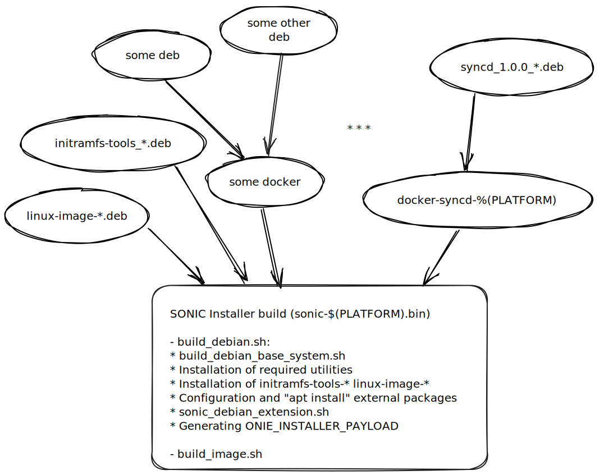
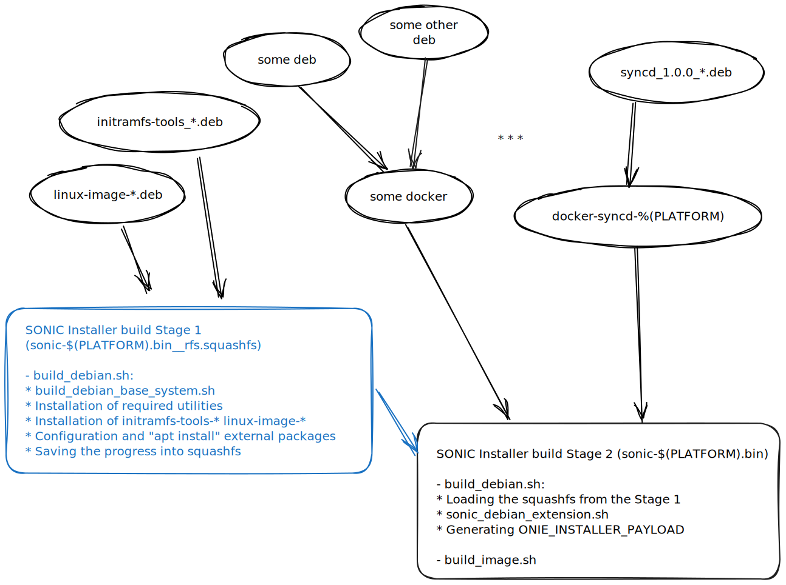

# RFS split build improvements HLD

# Table of Contents

- [Revision History](#revision-history)
- [Abbreviations](#abbreviations)
- [Overview](#overview)
    - [10,000 foot view of SONiC installer build](#10,000-foot-view-of-SONiC-installer-build)
- [RFS Split](#rfs-split)
    - [Implementation details](#implementation-details)

# Revision History
| Rev |    Date  |     Author      | Change Description                                           |
|:---:|:--------:|:---------------:|:------------------------------------------------------------:|
| 0.1 |          | Yakiv Huryk     | Initial version                                              |

### Abbreviations

| **Term** | **Meaning**                               |
| -------- | ----------------------------------------- |
| RFS      | Root Filesystem                           |

# Overview

The goal of this change is to optimize the SONiC installer build by splitting the final build step into two stages. This will allow running the first stage in parallel, improving build time.

## 10,000 foot view of SONiC installer build
The very last step of the SONiC build process is to build the $(SONIC_INSTALLERS) target, which is usually defined in platform one-image.mk file:
```makefile
SONIC_ONE_IMAGE = sonic-mellanox.bin
$(SONIC_ONE_IMAGE)_MACHINE = Mellanox
...
SONIC_INSTALLERS += $(SONIC_ONE_IMAGE)

```

There is a designated target in slave.mk to build it:
```makefile
# targets for building installers with base image
$(addprefix $(TARGET_PATH)/, $(SONIC_INSTALLERS)) : $(TARGET_PATH)/% :
```
The rule builds/prepares a Debian image and installs all necessary artifacts (debian packages, docker images, files, etc.). Since this rule depends on all the other build rules, it cannot be parallelized.

The following is a simplified diagram of SONIC_INSTALLERS build graph:



# RFS Split

The main part of the SONiC installer build - build_debian.sh can be summarized into the following steps:
1) Base image preparation (debootstrap, etc.). It's done by build_debian_base_system.sh
2) Installation of external packages (apt-get, etc.)
3) Installation of initramfs and linux-image
4) Installation of build artifacts (docker images, debian packages, etc.). It's done by sonic_debian_extension.sh
5) Generation of ONIE_INSTALLER_PAYLOAD

The build_debian.sh can be split into two stages:
* Stage 1. The steps 1-3.
* Stage 2. The steps 4-5.

This allows to create a separate target from Stage 1 that can be built in parallel.
To transfer the progress to Stage 2, the Stage 1 will save rootfs into a squashfs file. The Stage 2 will load the squashfs file and continue from there.
With these changes, the build will look as follows:



## Implementation details

A new flag enables the optimization in rules/config:
```bash
# ENABLE_RFS_SPLIT - enable 2-stage installer build
ENABLE_RFS_SPLIT_BUILD ?= n
```
It's disabled by default.

The implementation consists of 2 parts:
1) Generating and processing new targets for RFS squashfs files (slave.mk)
2) Adding support of a 2-stage run for **build_debian.sh**

The 2-stage build in **build_debian.sh** is achieved by adding a logic that:
1) Checks if *ENABLE_RFS_SPLIT_BUILD* is enabled.
2) Stops the build and saves the progress into the squashfs file (for Stage 1).
3) Starts the build by loading the squashfs file (for Stage 2).
