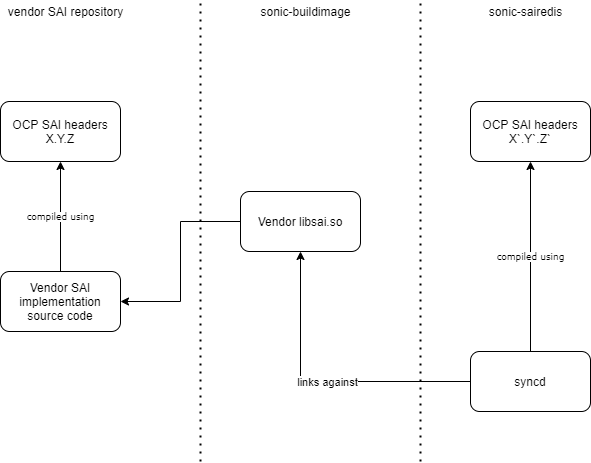
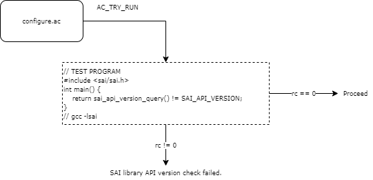

# SAI API version check

## Motiviation

SONiC is not desing to work in backward compatibility with older vendor SAI implementations.
SAI headers that SONiC's synd daemon is compiled against are taken from OCP SAI repository while
the actual libsai.so is taken from sonic-buildimage vendor's directory. This leads to a situation
that sometimes SAI in sonic-sairedis repository is updated but vendor SAI in sonic-buildimage is not.

This may lead to:
  - Compilation failure because of ABI changes (syncd cannot be successfully linked with libsai.so)
  - Attributes ID mismatch, as we add new attributes in a non-backward compatible manner. The result is syncd termination due to invalid usage of attributes or hidden incorrect behavior.
  - Enum values mismatch, as we add new values to enums in a non-backward compatible manner.
  - Etc.


## SONiC buildsystem overview

This is an illustration how the build system works:

<p align=center>

</p>

Sonic-sairedis contains syncd source code. Syncd is compiled against SAI headers from sonic-sairedis repository and then linked against vendor libsai.so from sonic-buildimage repository.
In case someone updates sonic-sairedis with new SAI headers and tries to update submodule in sonic-buildimage PR checkers that perform sonic build should.
The one who wants to update SAI version needs to make sure all SAI vendor implementations are updated in the same PR to not break the image.
 
It is also worth to mention that some vendors just provide the binary libsai.so unlike Nvidia where we have SAI headers that are provided by Mellanox-SAI repository.

## Proposal

SAI already has SAI_API_VERISON define in headers (saiversion.h):

```c
#define SAI_MAJOR 1 
#define SAI_MINOR 9
#define SAI_REVISION 1

#define SAI_VERSION(major, minor, revision) (10000 * (major) + 100 * (minor) + (revision))

#define SAI_API_VERSION SAI_VERSION(SAI_MAJOR, SAI_MINOR, SAI_REVISION)
```

Currently, given just the libsai.so file, it is not possible to know which SAI headers it was compiled against, as these defines are in the headers.
We need an API in libisai.so to get the API version that this libsai.so implementation is aligned to.

The proposal is to add such API:

```c
/**
 * @brief Retrieve a SAI API version this implementation is aligned to
 *
 * @param[out] version Version number
 *
 * @return #SAI_STATUS_SUCCESS on success, failure status code on error
 */
sai_status_t sai_query_api_version(
        _Out_ sai_api_version_t *version);
```

The implementation is simple:

```c
sai_status_t sai_query_api_version(
        _Out_ sai_api_version_t *version)
{
    *version = SAI_API_VERSION;
    return SAI_STATUS_SUCCESS;
}
```
 
This SAI_API_VERSION is the one derived from headers that were used by vendor SAI (headers on the left on the Figure 1.).

Using that new API we can implement a configure-time check in sonic-sairedis with autotools AC_TRY_RUN:

<p align=center>

</p>

The check will compare the vendor SAI API version (on the left on the Figure 1) with sairedis SAI API version (on the right on the Figure 2.) and fail if they do not match.
In case, SAI versioning follows sematical versioning rules, the test program can implement a check for only MAJOR and MINOR version, relaxing the constraint on the PATCH version.

## Questions
