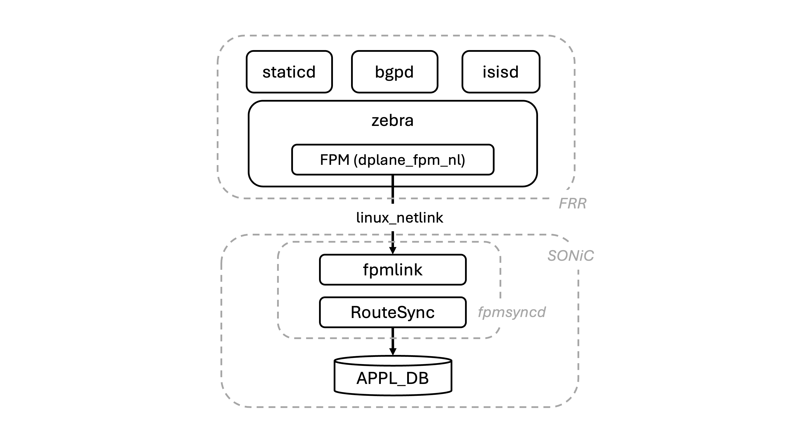
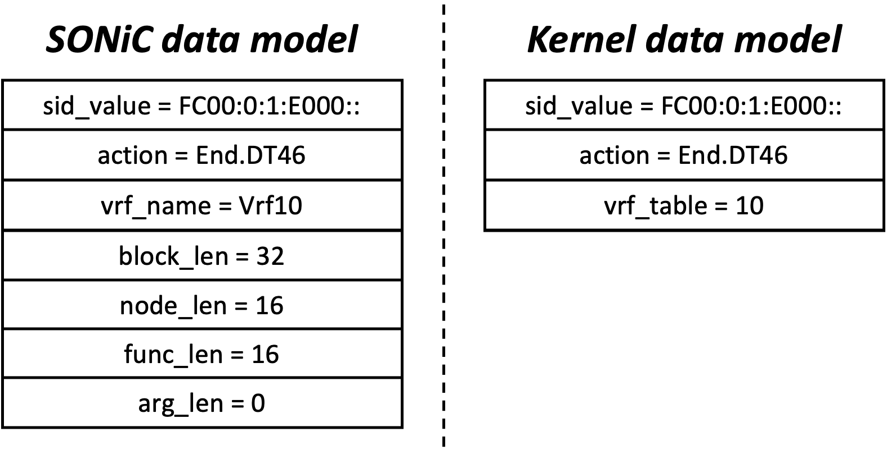
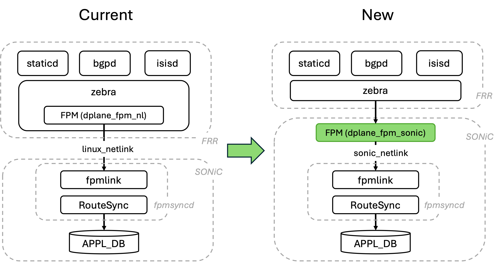

<!-- omit from toc -->
# New FRR-SONiC Communication Channel #

<!-- omit from toc -->
## Table of Content 

<!-- TOC -->

- [1. Revision](#1-revision)
- [2. Definitions/Abbreviations](#2-definitionsabbreviations)
- [3. Scope](#3-scope)
- [4. Overview](#4-overview)
	- [4.1. Context](#41-context)
		- [4.1.1. Problem](#411-problem)
			- [4.1.1.1. Example](#4111-example)
		- [4.1.2. Solution](#412-solution)
- [5. High-Level Design](#5-high-level-design)
	- [5.1. New FPM SONiC module](#51-new-fpm-sonic-module)
	- [5.2. Build FRR with the FPM SONiC module](#52-build-frr-with-the-fpm-sonic-module)
	- [5.3. Load the FPM module on zebra startup](#53-load-the-fpm-module-on-zebra-startup)
	- [5.4. Leveraging the new FPM SONiC module to Program SRv6 SIDs](#54-leveraging-the-new-fpm-sonic-module-to-program-srv6-sids)
		- [5.4.1. Extending the FPM SONiC module](#541-extending-the-fpm-sonic-module)
		- [5.4.2. Extending the SONiC's fpmsyncd](#542-extending-the-sonics-fpmsyncd)
- [6. Links to Code PRs](#6-links-to-code-prs)

<!-- /TOC -->

## 1. Revision  

| Rev  |    Date    |      Author                         | Change Description      |
| :--: | :--------: | :---------------------------------: | :---------------------: |
| 0.1  | 14/02/2024 | Carmine Scarpitta, Ahmed Abdelsalam | Initial version         |

## 2. Definitions/Abbreviations

| Definitions/Abbreviation | Description                               |
| ------------------------ | ----------------------------------------- |
| BGP                      | Border Gateway Protocol                   |
| FRR                      | Free Range Routing                        |
| FPM                      | Forwarding Plane Manager                  |
| SRv6                     | Segment Routing over IPv6                 |
| SID                      | Segment Identifier                        |
| SONiC                    | Software for Open Networking in the Cloud |

## 3. Scope  

Introduce a SONiC-specific communication channel between FRR and SONiC.

## 4. Overview

SONiC supports routing functionalities and protocols such as BGP through the integration of the FRR routing suite. Routing protocols provided by FRR calculate their optimal routes and send them to an intermediary FRR daemon named `zebra`. `zebra`, in turn, leverages the FPM module `dplane_fpm_nl` (which is part of FRR) to push these routes to SONiC. Finally, a component of SONiC called `fpmsyncd` receives the routes sent by FRR and writes the route entries into the SONiC database.

	
*Figure 1: FRR-SONiC Current Communication Channel*

### 4.1. Context

#### 4.1.1. Problem

FRR encodes the routing information into a Netlink message and sends the Netlink message to the kernel. Then, the FPM module (which is part of FRR) encodes the same routing information into another Netlink message and sends this Netlink message to SONiC. Currently, the Netlink message used to program the SONiC data plane is a copy of the Netlink message used to program the kernel data plane. However, since this Netlink message is tailored to the kernel data model, it lacks some information required to program the SONiC data plane.

The root problem is that the FPM module belongs to FRR and is generic, designed to program any data plane, not specifically tailored for the SONiC data plane. As such, it does not provide SONiC with all the necessary information to program its data plane.

##### 4.1.1.1. Example

As an example, let's consider a scenario where FRR needs to program an SRv6 SID into the SONiC dataplane. The following figure shows the comparison between the kernel's data model and SONiC's data model.

	
*Figure 2: Example: Netlink cannot be used to program an SRv6 SID in SONiC*

As shown in Figure 2, the SONiC data model includes attributes (`block_len`, `node_len`, `func_len`, `arg_len`) that are not present in the kernel data model.

In order to program the SID in SONiC, FPM generates a Netlink message that only contains the information required by the kernel (`sid_value`, `action`, `vrf_table`). Since some mandatory attributes are missing (`block_len`, `node_len`, `func_len`, `arg_len`), this Netlink message cannot be used to program the SID in SONiC and results in an error when FPM attempts to do so.

*Note: SRv6 is merely one example, but this issue is general and exists for other features as well.*

#### 4.1.2. Solution

To overcome these limitations, we introduce a new module called FPM SONiC (`dplane_fpm_sonic`). This module is specifically designed to program the SONiC data plane. It is hosted under the SONiC repository and maintained by the SONiC community. The new FPM SONiC module enables the SONiC community to develop the features they require without the need to modify FRR. It encodes the routing information provided by FRR in a SONiC-specific Netlink message. The format of this message is tailored to the SONiC data model and includes all information required to program the feature in SONiC.


## 5. High-Level Design

### 5.1. New FPM SONiC module

We introduce a new FPM module called FPM SONiC (`dplane_fpm_sonic`). Initially, this new FPM SONiC module is a copy of the current FPM module. It supports all functionalities and Netlink messages supported by the current FPM module. This guarantees backward compatibility and ensures a smooth transition to the new module without any loss of functionality.

Over the time, the SONiC community can extend the new FPM SONiC module by adding SONiC-specific Netlink TLVs to support any use case in SONiC.

The following figure shows the changes to the SONiC architecture:

	
*Figure 3: FRR-SONiC New Communication Channel*

The new module is hosted under the `sonic-buildimage` repository and maintained by the SONiC community.

```
.
└── sonic-buildimage
    └── sonic-frr
        ├── Makefile
        ├── frr
        ├── patch
        └── dplane_fpm_sonic
            └── dplane_fpm_sonic.c       <-- new FPM SONiC module
```

### 5.2. Build FRR with the FPM SONiC module

In order to compile FRR with the new FPM SONiC module, we add a new patch file `build-dplane-fpm-sonic-module.patch` under the `sonic-buildimage/sonic-frr/patch` directory.

This patch file has two objectives:

* modify the FRR zebra Makefile to compile the FPM SONiC module `dplane_fpm_sonic.c` into a `dplane_fpm_sonic.so` library
* install the `dplane_fpm_sonic.so` library in the FRR modules directory.

### 5.3. Load the FPM module on zebra startup

We modify the startup options of the FRR zebra daemon specified in the `supervisor.conf.j2` template file to replace the `-M dplane_fpm_nl` command-line option with `-M dplane_fpm_sonic`.

After this change, the file `supervisor.conf.j2` appears as follows:

```jinja2
[program:zebra]
command=/usr/lib/frr/zebra -A 127.0.0.1 -s 90000000 -M dplane_fpm_sonic -M snmp --asic-offload=notify_on_offload
```

This modification ensures that FRR uses the new FPM SONiC module to send information to SONiC, rather than relying on the current FPM module.

### 5.4. Leveraging the new FPM SONiC module to Program SRv6 SIDs

In this section, we explain how the new FPM SONiC module is extended to support a new TLV for programming an SRv6 SID.

We make two modifications:

1. we extend the new FPM SONiC module to push a Netlink message containing all the necessary information to program an SRv6 SID in SONiC.
2. we extend SONiC's fpmsyncd to process the Netlink message received from the FPM SONiC module and write the SRv6 SID into the SONiC database.

#### 5.4.1. Extending the FPM SONiC module

We extend the new FPM SONiC module to push a Netlink message containing all the necessary information to program an SRv6 SID in SONiC. In particular, we introduce two new Netlink message types to support programming and uninstalling a SID in SONiC: `RTM_NEWSRV6LOCALSID` and `RTM_DELSRV6LOCALSID`. When FRR provides an SRv6 SID to the FPM SONiC module, FPM SONiC encodes the SID into a `RTM_NEWSRV6LOCALSID` Netlink message and sends this message to SONiC. This Netlink message contains all the information required to program the SID in SONiC.

#### 5.4.2. Extending the SONiC's fpmsyncd

fpmsyncd is extended to process and parse the new Netlink message types: `RTM_NEWSRV6LOCALSID` and `RTM_DELSRV6LOCALSID`. When fpmsyncd receives a Netlink message from the FPM SONiC module, it checks the Netlink message type. If the Netlink message is a `RTM_NEWSRV6LOCALSID` message or a `RTM_DELSRV6LOCALSID` message, it is passed to the `onSrv6LocalSidMsg()` callback. This callback extracts all the SRv6 SID attributes from the Netlink message and write a SID entry to the `SRV6_MY_SID_TABLE` of `APPL DB`.

## 6. Links to Code PRs

* https://github.com/sonic-net/sonic-buildimage/pull/18715
* https://github.com/sonic-net/sonic-swss/pull/3123
