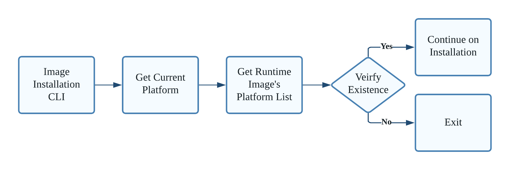

# SONiC Image Installation Verification

# High Level Design Document

#### Rev 0.1

# Table of Contents

- [Table of Contents](#table-of-contents)
- [Revision](#revision)
- [About this Manual](#about-this-manual)
- [Scope](#scope)
- [Definition/Abbreviation](#definition-abbreviation)
    + [Table 1: Abbreviations](#table-1--abbreviations)
- [1 Feature Overview](#1-feature-overview)
- [2 Functional Requirements](#2-functional-requirements)
- [3 Configuration and Management Requirements](#3-configuration-and-management-requirements)
- [4 Design and Flow Diagrams](#4-design-and-flow-diagrams)
  * [4.1 Background](#41-background)
    + [4.1.1 Design Attempts](#411-design-attempts)
  * [4.2 Flow Diagrams](#42-flow-diagrams)
  * [4.3 Design](#43-design)
    + [4.3.1 Generate platform list](#431-generate-platform-list)
    + [4.3.2 Verification](#432-verification)
    + [4.3.3 Skip platform check](#433-skip-platform-check)
- [5 Error Handling](#5-error-handling)
- [6 Serviceability and Debug](#6-serviceability-and-debug)
- [7 Warm Boot Support](#7-warm-boot-support)
- [8 Scalability](#8-scalability)
- [9 Tests](#9-tests)
  * [9.1 Unit Tests](#91-unit-tests)
  * [9.2 End to End test](#92-end-to-end-test)


# Revision

| Rev | Date        | Author             | Change Description  |
|:---:|:-----------:|:------------------:|---------------------|
| 0.1  | 01/25/2021 | Jingwen Xie        | Initial version     |

# About this Manual
This document provides a detailed description on the strategy to implement the SONiC extended image installation verification feature.

# Scope
This document describes the high level design of a SONiC extended image installation verification feature. This document provides minor implementation details about the proposed solutions.

# Definition/Abbreviation

### Table 1: Abbreviations
| **Term** | **Meaning**                                 |
| -------- | ------------------------------------------- |
| ASIC     | Application-Specific Integrated Circuit     |

# 1 Feature Overview

SONiC image installation requires users to install the correct image on the switch.  The image is built per ASIC type and it needs to be loaded on the corresponding switch of that ASIC type.

For example, Dell6100’s switch ASIC vendor is Broadcom. It should be installed with a Broadcom based image. However, choosing  which image to install  on specific switch is simply determined by the users.  SONiC itself doesn’t have an extended verification step to verify if the image's built ASIC type is aligned with the switch ASIC type.

Here is a list of ASIC vendor info from [Supported Devices and Platforms](https://github.com/Azure/SONiC/wiki/Supported-Devices-and-Platforms).

The verification should looks like this:
```
admin@vlab-01:~$ sudo sonic-installer install sonic-broadcom.bin -y
Image file 'sonic-broadcom.bin' is of a different platform ASIC type than running platform's.
If you are sure you want to install this image, use --skip-platform-check.
Aborting...
Aborted!
```

# 2 Functional Requirements

- sonic-installer should be able to verify if an image is valid to be installed on runnning platform.
- sonic-installer should provide a way to skip such platform ASIC type check and an option of force image installation
- sonic-intaller should not affect the past images installation. 

# 3 Configuration and Management Requirements

- The option of platform AISC type check skip should be added to sonic-installer help menu.
  - Use `--skip-platform-check` option instead of `--force` as the later one has been used for image force installation which skips image secure boot check.
```
admin@vlab-01:~$ sudo sonic-installer install --help
Usage: sonic-installer install [OPTIONS] URL

  Install image from local binary or URL

Options:
  -y, --yes
  -f, --force, --skip-secure-check
                                  Force installation of an image of a non-
                                  secure type than secure running image
  --skip-platform-check           Force installation of an image of of a different       <======
                                  ASIC type from the current platform
  --skip_migration                Do not migrate current configuration to the
                                  newly installed image
  --skip-package-migration        Do not migrate current packages to the newly
                                  installed image
  --skip-setup-swap               Skip setup temporary SWAP memory used for
                                  installation
  --swap-mem-size INTEGER         SWAP memory space size  [default: (1024
                                  MiB)] NOTE: this argument is mutually
                                  exclusive with arguments: skip_setup_swap
  --total-mem-threshold INTEGER   If system total memory is lower than
                                  threshold, setup SWAP memory  [default:
                                  (2048 MiB)] NOTE: this argument is mutually
                                  exclusive with arguments: skip_setup_swap
  --available-mem-threshold INTEGER
                                  If system available memory is lower than
                                  threhold, setup SWAP memory  [default: (1200
                                  MiB)] NOTE: this argument is mutually
                                  exclusive with arguments: skip_setup_swap
  --help                          Show this message and exit.

```

# 4 Design and Flow Diagrams

## 4.1 Background

### 4.1.1 Design Attempts

**Trial One: Simply use ASIC as comparison**

In SONiC, the current ASIC info can be accessed from `/etc/sonic/sonic_version.yml`. With that, we can compare the `asic_type` with the to-be-installed image's ASIC and check if they match.
```
admin@str-s6000-acs-13:~$ cat /etc/sonic/sonic_version.yml
...
asic_type: broadcom                         <======
```
Need to mention that, it may prompt false negative message. Assume we have an broadcom switch which has already installed mellanox built image as no ASIC check before. Its `asic_type` will be translated to mellanox. Then it will wrongly report asic doesn't match if we try to install the correct broadcom built image.

In ONiE, that info is not accessible. So we cannot do the ASIC check in ONiE.
```
ONIE:/ # cat etc/machine.conf
onie_version=3.20.1.5
onie_vendor_id=674
onie_platform=x86_64-dell_s6000_s1220-r0
onie_machine=dell_s6000_s1220
onie_machine_rev=0
onie_arch=x86_64
onie_config_version=1
onie_build_date="2016-02-09T17:14-0800"
onie_partition_type=gpt
onie_kernel_version=3.15.10
onie_firmware=auto
```
So we turn to Trial two.

**Trial Two: Build up a mapping for platform string->ASIC**

In both ONiE and SONiC, the platform string is accessible.
```
ONIE:/ # cat etc/machine.conf
...
onie_platform=x86_64-dell_s6000_s1220-r0    <======
```
```
admin@str-s6000-acs-13:~$ cat /host/machine.conf
...
onie_platform=x86_64-dell_s6000_s1220-r0    <======
```
The mapping will be carried in our built image and look like this:
```
x86_64-dell_s6000_s1220-r0=broadcom
x86_64-dell_s6100_c2538-r0=broadcom
x86_64-mlnx_msn2410-r0=mellanox
x86_64-mlnx_msn2700-r0=mellanox
...
```
Pros:
 - The mapping fits both ONiE and SONiC installer. During installation, we can derive current platform's expected ASIC type based on the platform string, then compare that with the to-be-installed image's ASIC.

Cons:
 - It is a static mapping, which means that the mapping need to be kept in all repos and all ASIC build.
   - Repo may contains different platforms. We need to keep a mapping containing all platforms, or keep custom mapping for each repo.
   - Image built with one ASIC will contain all other ASIC's platform mapping, which is not necessary.

**Trial Three(Choosen one): Generate platform list based on ASIC type runtime**

We choose to generate the platform list file during the image build process. During image installation, we can just check if the switch's platform is in the `platforms_asic` list file. For example, during `sonic-broadcom.bin` build, a file named `platforms_asic` will be generated containing all applicable platforms that are fit broadcom ASIC build.

Pros:
 - It fits both ONiE and SONiC installer.
 - The `platforms_asic` can be generated dynamically based on specific repo and the specific ASIC build. So we don't carry unnecessary info in our list file.

Cons:
 - We need to know in advance which platform is applicable for which build. So we will add a file `platform_asic` for each platform. But it is just one time effort.
```
:~/sonic-buildimage$ find device/ | grep platform_asic$
...
device/accton/x86_64-accton_as4630_54pe-r0/platform_asic
device/accton/x86_64-accton_as4630_54te-r0/platform_asic
device/accton/x86_64-accton_as9726_32d-r0/platform_asic
...
:~/sonic-buildimage$ cat device/accton/x86_64-accton_as4630_54pe-r0/platform_asic
broadcom
```

## 4.2 Flow Diagrams
The following figure shows how to intall an image through SONiC CLI.


## 4.3 Design

### 4.3.1 Generate platform list
To generate the `platforms_asic` file, we just loop in the device folder and collect `$TARGET_MACHINE` that matches to our ASIC type build.
```
for  d  in  `find -L ./device -maxdepth 2 -mindepth 2 -type d`; do
	if [ -f $d/platform_asic ]; then
		if [ "$TARGET_MACHINE" = "generic" ] || grep -Fxq "$TARGET_MACHINE"  $d/platform_asic; then
			echo  "${d##*/}" >> "$platforms_asic";
		fi;
	fi;
done
```
It worth mention that `sonic-broadcom.bin` and `sonic-broadcom-dnx.bin` are built together with `$CONFIGURED_PLATFORM` both set as broadcom. The difference is that they use different Debian package to build. So in upper code we grep with `$TARGET_MACHINE` because it can recognize it is whether broadcom or broadcom-dnx build and generate corresponding `platforms_asic`.

Example `platforms_asic`of broadcom ASIC built image using master repo
```
x86_64-alphanetworks_snh60a0_320fv2-r0
x86_64-alphanetworks_snj60d0_320f-r0
x86_64-alphanetworks_snh60b0_640f-r0
x86_64-ingrasys_s8900_64xc-r0
x86_64-ingrasys_s8900_54xc-r0
x86_64-ingrasys_s9180_32x-r0
x86_64-ingrasys_s8810_32q-r0
x86_64-ingrasys_s9100-r0
x86_64-ingrasys_s9200_64x-r0
x86_64-inventec_d6356-r0
x86_64-inventec_d7032q28b-r0
x86_64-inventec_d6556-r0
x86_64-inventec_d6254qs-r0
x86_64-inventec_d7264q28b-r0
x86_64-inventec_d6332-r0
x86_64-inventec_d7054q28b-r0
x86_64-quanta_ix1b_32x-r0
x86_64-quanta_ix7_bwde-r0
x86_64-quanta_ix8c_bwde-r0
x86_64-quanta_ix1b_rglbmc-r0
x86_64-quanta_ix8_rglbmc-r0
x86_64-quanta_ix7_rglbmc-r0
x86_64-quanta_ix9_bwde-r0
x86_64-quanta_ix8a_bwde-r0
x86_64-arista_7050_qx32
x86_64-arista_7060_cx32s
x86_64-arista_7050_qx32s
x86_64-arista_7050sx3_48c8
x86_64-arista_7260cx3_64
x86_64-arista_7060px4_32
x86_64-arista_common
x86_64-arista_7050cx3_32s
x86_64-arista_7050sx3_48yc8
x86_64-arista_7060dx4_32
x86_64-arista_7060cx2_32s
x86_64-bcm_xlr-r0
x86_64-broadcom_common
x86_64-mitac_ly1200_b32h0_c3-r0
x86_64-juniper_qfx5200-r0
x86_64-juniper_qfx5210-r0
x86_64-facebook_wedge100-r0
x86_64-dellemc_n3248pxe_c3338-r0
x86_64-dellemc_z9264f_c3538-r0
x86_64-dellemc_s5248f_c3538-r0
x86_64-dellemc_s5212f_c3538-r0
x86_64-dellemc_s5224f_c3538-r0
x86_64-dellemc_s5232f_c3538-r0
x86_64-dellemc_s5296f_c3538-r0
x86_64-dell_s6100_c2538-r0
x86_64-dell_s6000_s1220-r0
x86_64-dellemc_n3248te_c3338-r0
x86_64-dell_z9100_c2538-r0
x86_64-dellemc_z9332f_d1508-r0
x86_64-delta_ag5648-r0
x86_64-delta_et-c032if-r0
x86_64-delta_et-6248brb-r0
x86_64-delta_ag9032v2a-r0
x86_64-delta_ag9064-r0
x86_64-delta_ag9032v1-r0
x86_64-ruijie_b6510-48vs8cq-r0
x86_64-ragile_ra-b6920-4s-r0
x86_64-ragile_ra-b6910-64c-r0
x86_64-ragile_ra-b6510-32c-r0
x86_64-ragile_ra-b6510-48v8c-r0
x86_64-cel_seastone_2-r0
x86_64-cel_e1031-r0
x86_64-cel_silverstone-r0
x86_64-cel_seastone-r0
x86_64-accton_as4630_54pe-r0
x86_64-accton_as5712_54x-r0
x86_64-accton_as7716_32x-r0
x86_64-accton_as4630_54te-r0
x86_64-accton_as7212_54x-r0
x86_64-accton_as5812_54x-r0
x86_64-accton_as7326_56x-r0
x86_64-accton_as9726_32d-r0
x86_64-accton_as7312_54x-r0
x86_64-accton_as7712_32x-r0
x86_64-accton_as7726_32x-r0
x86_64-accton_as7315_27xb-r0
x86_64-accton_as5835_54x-r0
x86_64-accton_as6712_32x-r0
x86_64-accton_minipack-r0
x86_64-accton_as7716_32xb-r0
x86_64-accton_as5835_54t-r0
x86_64-accton_as5812_54t-r0
x86_64-accton_as7312_54xs-r0
x86_64-accton_as9716_32d-r0
x86_64-accton_as7816_64x-r0
```
Example `platforms_asic`of mellanox ASIC built image
```
x86_64-mlnx_msn4700-r0
x86_64-mlnx_msn2700-r0
x86_64-mlnx_msn4600c-r0
x86_64-mlnx_msn3420-r0
x86_64-mlnx_msn2010-r0
x86_64-mlnx_msn2700_simx-r0
x86_64-mlnx_msn3700c-r0
x86_64-mlnx_msn3700_simx-r0
x86_64-mlnx_msn2410-r0
x86_64-mlnx_msn4410-r0
x86_64-nvidia_sn2201-r0
x86_64-mlnx_msn2100-r0
x86_64-mlnx_lssn2700-r0
x86_64-mlnx_msn4600-r0
x86_64-mlnx_msn3800-r0
x86_64-mlnx_msn2740-r0
x86_64-nvidia_sn4800_simx-r0
x86_64-nvidia_sn5600_simx-r0
x86_64-mlnx_msn3700-r0
x86_64-mlnx_x86-r5.0.1400
x86_64-mlnx_msn4700_simx-r0
x86_64-nvidia_sn4800-r0
```

### 4.3.2 Verification
To decide whether an image is of a correct type of ASIC during installation, the installer will verify if the current platform is inside to-be-installed image's built-in file `platforms_asic`. If not, verification would fail because it means the current platform is of a different ASIC type from the built image. If yes, it will pass the verification process and do other image checks.

The ways to get the current platform is different between SONiC env and ONIE env.

 - In SONiC env, the current platform can be obtained through function `p = device_info.get_platform()`.
`sed -e '1,/^exit_marker$/d' image_path | tar -xf - platforms_asic -O | grep -Fxq p`
 - In ONIE env, the current platform is recorded in `$onie_platform`from `/etc/machine.conf`.
`grep -Fxq "$onie_platform" platforms_asic`

### 4.3.3 Skip platform check
We also provide a way to bypass the image's platform ASIC type verification. During sonic-installer install process, user can add an 'force install' option to bypass platform ASIC type check if sonic-installer detects that the image is of a different type of ASIC from the current platform.

As `--force` option has been used for image secure boot check, we use  `--skip-platform-check` option to bypass our verification.

# 5 Error Handling

# 6 Serviceability and Debug

# 7 Warm Boot Support

# 8 Scalability

# 9 Tests

It worth mentioning that below tests are all mannual tests.

## 9.1 Unit Tests
| Test Case | Description |
| --------- | ----------- |
| 1         | Install broadcom image on vs platform.|
| 2         | Install mellanox image on broadcom platform. |
| 3         | Install broadcom image on mellanox platform. |
| 4         | Install broadcom-dnx image on broadcom platform.|
| 5         | Install broadcom image on broadcom-dnx platform.|
| 6         | Install ONIE image on Arista system. |
| 7         | Install Arista image on ONIE system. |

## 9.2 End to End test
To do E2E tests, I want to remind that the verification cannot be verified among the build artifacts that share the same build version.

For example, if a broadcom switch has been installed with a latest image `sonic-broadcom.bin`. If we want to verify if it can block the installation of the latest mellanox based image, say `sonic-mellanox.bin`, sonic-installer will find that these two bin image share the same build version. Thus the system will ignore the installation, so the future verification will not be tested.

The E2E test must make sure the installed image are from different build version.
