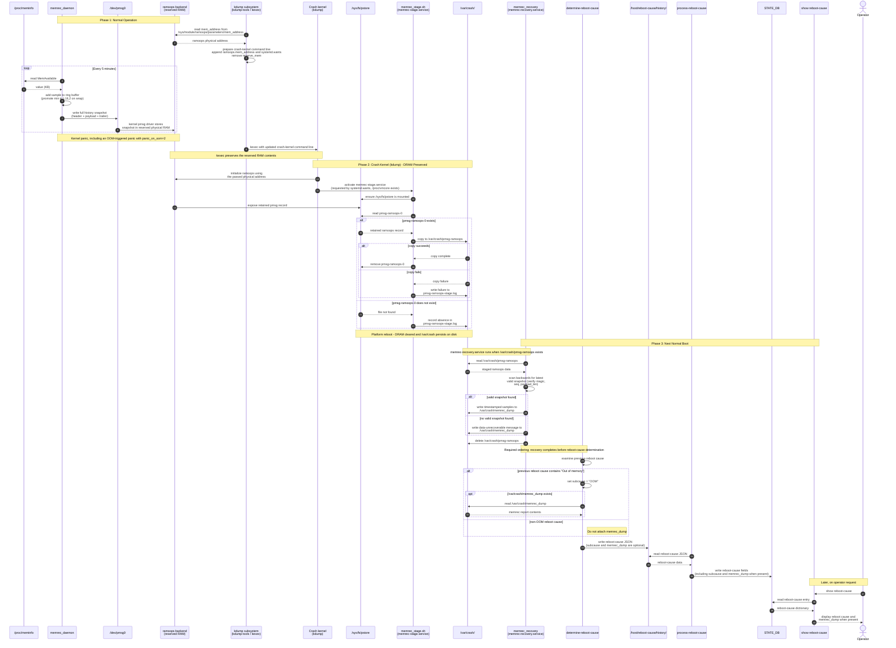

# SONiC Memory Recorder (sonic-memrec) - High Level Design

## 1. Revision

| Rev  | Date       | Author      | Change Description |
|------|------------|-------------|--------------------|
| v0.1 | 2026-08-19 | Manish      | Initial draft      |

## 2. Scope

This document describes the high-level design of **sonic-memrec**, a lightweight system memory availability recorder for SONiC.

## 3. Definitions/Abbreviations

| Term | Definition |
|------|-----------|
| OOM | Out of Memory - a kernel condition where the system cannot allocate more memory |
| pstore | Persistent Store - a Linux kernel subsystem that exposes records from persistent backends such as ramoops through `/sys/fs/pstore`. In this design, user space writes through `/dev/pmsg0`, while the crash kernel reads the resulting pmsg record through pstore. |
| pmsg | Persistent Message - a user-space writable pstore channel accessible via `/dev/pmsg0`; data written here appears as `/sys/fs/pstore/pmsg-ramoops-0` after a kexec transition |
| ramoops | RAM Oops - a Linux kernel module that uses a reserved region of physical RAM as a pstore backend; data survives kexec transitions but is lost on platforms that perform a DRAM-clearing reboot |
| kexec | A Linux mechanism to load a new kernel directly from the running kernel, bypassing firmware and bootloader. DRAM contents are preserved across the transition. |
| DRAM-clearing reboot | A reboot where platform firmware re-initializes all system memory during the boot sequence, regardless of whether power was cycled. Destroys any data stored in reserved RAM regions (e.g., ramoops).|
| Power cycle | Complete removal and restoration of power to the system. DRAM contents are always lost. |
| kdump | Kernel Dump - a crash recovery mechanism where a pre-reserved "crash kernel" is loaded via kexec after a kernel panic. Because kexec preserves DRAM, the crash kernel has access to the crashed kernel's memory via `/proc/vmcore` and to ramoops data. After the crash kernel finishes, the platform performs a full reboot. |
| MemAvailable | A field in `/proc/meminfo` representing an estimate of how much memory is available without swapping. |
| Ring buffer | A fixed-size circular buffer data structure where new entries overwrite the oldest when capacity is reached |
| GRUB | GRand Unified Bootloader - standard x86 Linux bootloader; kernel parameters set via `GRUB_CMDLINE_LINUX` |
| ONIE | Open Network Install Environment - open-source boot environment for bare-metal network switches; ONIE-based platforms use GRUB as the bootloader |
| Aboot | Arista Boot - bootloader on Arista-based SONiC platforms; kernel parameters set via `cmdline_add` in `boot0` |
| STATE_DB | SONiC Redis database instance that stores runtime operational state, including reboot cause history |

## 4. Overview

When a SONiC switch reboots due to OOM, operators see "Out of Memory" in `show reboot-cause` but have no visibility into how memory usage evolved leading up to the crash - was it a slow leak over days or a sudden spike? `/proc/meminfo` is live-only; all data is lost on reboot.

**sonic-memrec** adds a lightweight host-level daemon that periodically records system memory availability, persists the history through kernel crashes using the Linux pstore/pmsg subsystem, and integrates the recovered data into `show reboot-cause` so operators can see memory trends leading up to an OOM event.

## 5. Requirements

### Functional Requirements

1. Record `MemAvailable` from `/proc/meminfo` at regular intervals
2. Maintain multi-resolution history covering the last hour, last 24 hours, and last 7 days
3. Persist history through OOM-triggered kernel panic
4. Generate a recovery report containing timestamped memory samples after a crash
5. Integrate the recovery report into `show reboot-cause` output for OOM reboots
6. The daemon must remain resident and continue recording during severe memory pressure until kernel panic is triggered.

### Scalability Requirements

- Fixed-size history structures with no explicit heap allocation in the steady-state sampling loop.
- Negligible CPU usage

### Warmboot and Fastboot Requirements

- No impact on warm boot or fast boot

## 6. Architecture Design

sonic-memrec runs on the host OS and in the kdump crash-kernel environment, outside SONiC containers. It adds three systemd services and extends the existing reboot-cause pipeline without introducing new containers.

### Component Diagram

```mermaid
flowchart TB
    subgraph host["Phase 1: Host OS - Normal Operation"]
        direction LR
        meminfo["/proc/meminfo"]
        daemon["memrec_daemon<br/>(memrec.service)<br/>━━━━━━━━━━━━━━━━<br/>Samples MemAvailable every 5 min<br/>and maintains a multi-level ring buffer"]
        pmsg0["/dev/pmsg0"]
        ramoops["ramoops region<br/>(4 KiB reserved physical RAM)"]

        meminfo -->|"MemAvailable (KB)"| daemon
        daemon -->|"write complete history snapshot<br/>(808 bytes)"| pmsg0
        pmsg0 -->|"pmsg frontend writes<br/>to ramoops backend"| ramoops
    end

    kdump["kdump crash-kernel setup<br/>━━━━━━━━━━━━━━━━<br/>ramoops.mem_address=&lt;address&gt;<br/>systemd.wants=memrec-stage.service<br/>reserve_mem removed"]
    ramoops -->|"append the ramoops physical address<br/>to the crash-kernel command line"| kdump

    subgraph crash["Phase 2: Crash Kernel (kdump) - DRAM Preserved"]
        direction LR
        crashenv["Crash kernel<br/>━━━━━━━━━━━━━━━━<br/>ramoops initialized at passed address<br/>pmsg record exposed through pstore"]
        stage["memrec_stage.sh<br/>(memrec-stage.service)<br/>━━━━━━━━━━━━━━━━<br/>ConditionPathExists=/proc/vmcore<br/>1. Ensure /sys/fs/pstore is mounted<br/>2. Read pmsg-ramoops-0<br/>3. Copy it to /var/crash/pmsg-ramoops<br/>4. Remove source after successful copy"]
        crashdisk["/var/crash/pmsg-ramoops<br/>(staged on disk-backed storage)"]

        crashenv -->|"/sys/fs/pstore/pmsg-ramoops-0"| stage
        stage -->|"copy snapshot to disk"| crashdisk
    end

    kdump -->|"kernel panic triggers kexec with the<br/>updated crash-kernel command line;<br/>DRAM remains intact"| crashenv

    subgraph recovery["Phase 3: Host OS - Next Normal Boot"]
        direction TB
        recover["memrec_recovery<br/>(memrec-recovery.service)<br/>━━━━━━━━━━━━━━━━<br/>ConditionPathExists=/var/crash/pmsg-ramoops<br/>Parses the latest valid snapshot<br/>and removes the staged raw file"]
        memrecdump["/var/crash/memrec_dump<br/>(report with timestamped samples)"]
        determine["determine-reboot-cause<br/>(sonic-host-services)<br/>━━━━━━━━━━━━━━━━<br/>Detects 'Out of memory', sets<br/>subcause=OOM, and attaches report"]
        history["/host/reboot-cause/history/<br/>reboot-cause-&lt;time&gt;.json"]
        process["process-reboot-cause<br/>(sonic-host-services)"]
        statedb["STATE_DB<br/>reboot-cause entry with optional<br/>subcause and memrec_dump fields"]
        showcli["show reboot-cause<br/>(sonic-utilities)<br/>━━━━━━━━━━━━━━━━<br/>Displays memrec_dump when present"]

        recover -->|"write recovery report"| memrecdump
        memrecdump -->|"read only when subcause is OOM<br/>and the report file exists"| determine
        determine -->|"write reboot-cause JSON"| history
        history -->|"read reboot-cause JSON"| process
        process -->|"write subcause and<br/>memrec_dump fields"| statedb
        statedb -->|"read reboot-cause entry"| showcli
    end

    crashdisk -->|"platform reboot clears DRAM;<br/>disk-backed staged file persists"| recover
```

<div style="overflow-x: auto;">



</div>

### Sequence Diagram

<div style="overflow-x: auto; min-width: 300%;">



</div>

## 7. High-Level Design

### 7.1 Multi-Resolution Ring Buffer

The history is stored in a three-level ring buffer. Each level holds fixed-size slots at a different time granularity:

| Level | Slots | Granularity | Coverage | Aggregation |
|-------|-------|-------------|----------|-------------|
| L0 | 12 | 5 minutes | Last 1 hour | Raw samples |
| L1 | 24 | 1 hour | Last 24 hours | Minimum of each L0 window |
| L2 | 7 | 1 day | Last 7 days | Minimum of each L1 window |

Total: 43 samples in a single flat array, plus per-level metadata (~784 bytes).

**Promotion logic:** When L0's ring wraps (12 samples collected = 1 hour), the minimum `MemAvailable` from that window is promoted to L1. When L1 wraps (24 entries = 24 hours), the minimum is promoted to L2.

**Why minimum-value aggregation:** For OOM diagnosis, the worst-case (lowest) memory availability is the most relevant signal. It captures the memory pressure troughs that indicate leak progression or spike severity.

Data structures:

```c
typedef struct {
    uint64_t timestamp_sec;
    uint64_t mem_available_kb;
} mem_sample_t;

typedef struct {
    mem_sample_t samples[MEMREC_TOTAL_SLOTS];       // 43 x 16 = 688 bytes
    mem_level_state_t level_state[MEMREC_NUM_LEVELS]; // 3 x 24 = 72 bytes
    mem_level_config_t level_config[MEMREC_NUM_LEVELS]; // 3 x 8 = 24 bytes
} mem_history_t;                                    // Total: 784 bytes
```

### 7.2 Memory Sampling

The daemon reads `MemAvailable` from `/proc/meminfo`. This field is the kernel's estimate of memory available for new allocations without swapping, accounting for reclaimable page cache and slab - a more accurate indicator of usable memory than `MemFree`.

The file handle is opened once with unbuffered I/O (`_IONBF`) and `rewind()`ed on each read, avoiding repeated open/close overhead. The polling interval is 300 seconds (5 minutes).

Timing uses `clock_nanosleep(CLOCK_MONOTONIC, TIMER_ABSTIME, ...)` for drift-free intervals that handle `EINTR` correctly.

### 7.3 Crash Persistence via pstore/pmsg

After each sample, the daemon writes the complete `mem_history_t` to `/dev/pmsg0` wrapped in a framed record:

```
+----------------------------+
| Header (12 bytes)          |
|   magic[4]: "MEMR"         |
|   seq: uint32              |
|   payload_len: uint32      |
+----------------------------+
| Payload (784 bytes)        |
|   mem_history_t            |
+----------------------------+
| Trailer (12 bytes)         |
|   seq: uint32              |
|   payload_len: uint32      |
|   magic[4]: "MEMT"         |
+----------------------------+
```

The header and trailer carry redundant `seq` and `payload_len` fields. On recovery, both are cross-validated - if a crash interrupts a write mid-way, the trailer won't match and the partial record is discarded.

The full snapshot is written each time (808 bytes total: 12 header + 784 payload + 12 trailer) rather than appending incremental samples. This simplifies recovery to a single backward scan for the latest valid record.

**Why ramoops + kdump:** Standard ramoops assumes DRAM contents survive a reboot. On platforms that perform a DRAM-clearing reboot (where firmware re-initializes all system memory during the boot sequence), this assumption does not hold — the reserved ramoops region is wiped before the next kernel can read it. However, kdump loads the crash kernel via kexec, which preserves DRAM. The crash kernel therefore still has access to the ramoops data. The staging service exploits this window to copy the ramoops data to disk before the subsequent platform reboot clears DRAM.

### 7.4 Crash Recovery Pipeline

**Stage 1 - Crash kernel (kdump):** `memrec_stage.sh` ensures `/sys/fs/pstore` is mounted. If `pmsg-ramoops-0` exists, it copies the file to `/var/crash/pmsg-ramoops` and removes the pstore source only after a successful copy. Missing files and staging errors are recorded in `/var/crash/pmsg-ramoops-stage.log`. The service runs only when `/proc/vmcore` exists.

**Stage 2 - Normal boot:** `memrec_recovery` reads the staged file, scans it backwards for the trailer magic `"MEMT"`, validates the header-trailer pair, and extracts the payload. The report is written to `/var/crash/memrec_dump` with three sections:

```
Memory Recorder Recovery Report
5-Minute History
Timestamp (UTC)             MemAvailable
2026-07-29 12:08:54 UTC     4958720 KB
2026-07-29 12:03:54 UTC     4954720 KB
...

Hourly History
Timestamp (UTC)             Min MemAvailable
...

Daily History
Timestamp (UTC)             Min MemAvailable
...
```

If no valid snapshot is found (e.g., the ramoops data was corrupted), the report contains: `"No valid memrec snapshot found - data unrecoverable"`. After processing, the staged ramoops file (`/var/crash/pmsg-ramoops`) is deleted.

**Stage 3 - Reboot cause integration:** This stage involves three scripts:

1. **`determine-reboot-cause`**: In `get_reboot_cause_dict()`, checks if the previous reboot cause string contains `"Out of memory"` and sets `reboot_cause_dict['subcause'] = "OOM"`. Then in `main()`, if `subcause` is `"OOM"` and `/var/crash/memrec_dump` exists, reads the report contents and attaches them as the `memrec_dump` field in the reboot cause JSON. The result is written to a reboot cause history file.

2. **`process-reboot-cause`**: Reads the reboot cause history JSON files and saves both the `subcause` and `memrec_dump` fields to STATE_DB.

3. **`show reboot-cause`**: Reads the reboot cause record from STATE_DB. If the `memrec_dump` field is present, displays it after the cause string.

### 7.5 Daemon Hardening

| Measure | Purpose |
|---------|---------|
| `mlockall(MCL_CURRENT \| MCL_FUTURE)` | Lock all pages into RAM - prevents swapping under memory pressure |
| `OOMScoreAdjust=-1000` | Maximum protection from OOM killer. Note: SONiC sets `panic_on_oom=2` (kernel panic on any OOM), so the OOM killer never selects individual processes — the entire system panics instead. This setting is a precautionary, harmless measure in case `panic_on_oom` is ever changed. |
| `CapabilityBoundingSet=CAP_IPC_LOCK` | Minimal privilege - only what `mlockall` requires |
| `NoNewPrivileges=true` | Prevent privilege escalation |
| `MemoryDenyWriteExecute=true` | Block writable+executable memory mappings |
| `LockPersonality=true` | Prevent changing execution domain |
| `Restart=always`, `RestartSec=5` | Auto-restart on failure |
| `StartLimitBurst=5`, `StartLimitIntervalSec=60` | Rate-limit restarts |

### 7.6 Systemd Service Integration

| Service | Type | Condition | After | Requires | Other | WantedBy |
|---------|------|-----------|-------|----------|-------|----------|
| `memrec.service` | `simple` (long-running) | Always | - (default ordering) | - | - | `multi-user.target` |
| `memrec-stage.service` | `oneshot` (kdump only) | `ConditionPathExists=/proc/vmcore` | `local-fs.target` | `local-fs.target` | `DefaultDependencies=no` | - (activated via `systemd.wants=` on crash kernel cmdline) |
| `memrec-recovery.service` | `oneshot` (normal boot) | `ConditionPathExists=/var/crash/pmsg-ramoops` | `local-fs.target` | - | `RemainAfterExit=no` | `multi-user.target` |

### 7.7 Kernel and Bootloader Configuration

Ramoops requires a reserved physical memory region. This is configured via kernel command-line parameters added in two places:

The following kernel command-line parameters are added in both bootloader paths:

```
reserve_mem=4K:4096:ramoops
ramoops.mem_name=ramoops
ramoops.mem_size=0x1000
ramoops.record_size=0
ramoops.console_size=0
ramoops.ftrace_size=0
ramoops.pmsg_size=0x1000
```

- **Default GRUB installer path** (`installer/default_platform.conf`): Appended to `GRUB_CMDLINE_LINUX`.
- **Aboot** (`files/Aboot/boot0.j2`): Added via `cmdline_add` calls.

**Kernel config** (`sonic-linux-kernel`):
```
CONFIG_PSTORE_RAM=y
CONFIG_PSTORE_PMSG=y
```

**kdump-tools** (`files/image_config/kdump/kdump-tools`): Reads the ramoops physical address from `/sys/module/ramoops/parameters/mem_address` and passes it to the crash kernel. Adds `systemd.wants=memrec-stage.service` to the crash kernel cmdline. Removes `reserve_mem` from the crash kernel cmdline (the crash kernel accesses ramoops via the passed address, not by reserving new memory).

### 7.8 Build System Integration

- New package source: `src/sonic-memrec/` in `sonic-buildimage`
- Build rule: `rules/sonic-memrec.mk` - registers `sonic-memrec` as a `SONIC_DPKG_DEBS` target
- Installer dependency: added to `slave.mk` installer target list
- Image installation: `sonic_debian_extension.j2` installs `sonic-memrec_*.deb`
- Package contents: `memrec_daemon`, `memrec_recovery`, `memrec_stage.sh` to `/usr/bin/`; three `.service` files to `/lib/systemd/system/`
- Build dependencies: `debhelper (>= 12.0.0)`, `libgtest-dev` (unit tests are built as part of the default build target)

## 8. SAI API

No SAI API changes required. sonic-memrec operates entirely on the host OS and does not interact with the switch ASIC or SAI layer.

## 9. Configuration and Management

### 9.1 CLI Enhancements

No new CLI commands are introduced. The recovery report is displayed inline with `show reboot-cause` when the reboot was caused by OOM:

```
admin@sonic:~$ show reboot-cause
Kernel Panic - Out of memory [Time: Thu Aug 27 10:21:18 AM UTC 2026]
Memory Recorder Recovery Report
5-Minute History
Timestamp (UTC)             MemAvailable
2026-08-27 10:19:19 UTC     27852416 KB
2026-08-27 10:14:19 UTC     27864308 KB
2026-08-27 10:09:19 UTC     27880336 KB
2026-08-27 10:04:19 UTC     27855532 KB
2026-08-27 09:59:19 UTC     27883328 KB
2026-08-27 09:54:19 UTC     27871528 KB
2026-08-27 09:49:19 UTC     27867056 KB
2026-08-27 09:44:19 UTC     27873932 KB
2026-08-27 09:39:19 UTC     27871956 KB
2026-08-27 09:34:19 UTC     27874256 KB
2026-08-27 09:29:19 UTC     27874468 KB
2026-08-27 09:24:19 UTC     27869868 KB

Hourly History
Timestamp (UTC)             Min MemAvailable
2026-08-27 09:19:19 UTC     27834864 KB
2026-08-27 08:39:19 UTC     27862376 KB
2026-08-27 08:09:19 UTC     27914368 KB

Daily History
Timestamp (UTC)             Min MemAvailable
```

### 9.2 Config DB Enhancements

No Config DB changes. All parameters (polling interval, ring buffer sizes) are compile-time constants.

### 9.3 YANG Model

No YANG model changes.

## 10. Warmboot and Fastboot Design Impact

sonic-memrec has no impact on warmboot or fastboot.

1. **Does it add stalls/sleeps/IO to the boot critical chain?** No. The daemon is pulled in by `multi-user.target` with default ordering. Recovery and staging services are conditional one-shots that only run when crash data exists.
2. **Does it add CPU-heavy processing in the boot path?** No. Recovery parses ~808 bytes of data.
3. **Does updating third-party dependencies impact boot time?** No third-party dependencies.
4. **Can the feature/service/docker be delayed?** The daemon already starts late in the boot sequence. No Docker container is involved.
5. **What optimizations are possible?** Not applicable - the feature has no boot-path impact.

## 11. Memory Consumption

- The ring buffer is a fixed-size struct of 784 bytes (43 samples x 16 bytes + 3 level states x 24 bytes + 3 level configs x 8 bytes). No dynamic allocation.
- `mlockall` locks the daemon's address space into RAM. For this minimal C program with no external libraries, the locked resident set is on the order of a few hundred KB.
- Memory consumption does not grow over time - the ring buffer overwrites old entries.
- When the package is not installed, there is zero memory impact.

## 12. Restrictions/Limitations

- Only records system-wide `MemAvailable` - no per-process or per-container breakdown
- Polling interval and ring buffer sizes are compile-time constants (not runtime-configurable)
- Requires pstore/ramoops kernel support and ramoops memory reservation in the bootloader
- Recovery depends on kdump - without it, the staging step is skipped and ramoops data may be lost on platforms that reset DRAM

## 13. Testing Requirements/Design

### 13.1 Unit Test Cases

15 test cases implemented using gtest, covering:

| Test Group | Tests | Coverage |
|-----------|-------|----------|
| `memrec` (ring buffer) | `addAndGetSample`, `negativeIndexCountsFromNewest`, `ringWrapsAtCapacity`, `promotesLevel0ToLevel1UsesWindowMin`, `promotesLevel1ToLevel2`, `numLevelsIsThree` | Insertion, retrieval, wrapping, promotion with min-aggregation, constant validation |
| `meminfoParser` | `readsAvailableAndTotal`, `repeatedReadsRewindCorrectly` | `/proc/meminfo` parsing, rewind correctness |
| `memrecPmsgTest` | `writeAndVerifyRoundTrip`, `verifyRejectsMismatchedFields`, `findLatestSnapshotInRegion`, `findLatestSnapshotFailsOnEmptyRegion`, `findLatestSnapshotHeaderAtFirstByteOfRegion`, `findLatestSnapshotRejectsCorruptHeaderAtMinimumOffset`, `findLatestSnapshotIgnoresMagicTooCloseToBufferStart` | Record framing, integrity checks, corrupt header rejection, spurious magic byte handling, backward scan edge cases |

### 13.2 System Test Cases

- Daemon starts and records samples over multiple polling intervals
- OOM simulation: trigger OOM via memory pressure, verify recovery pipeline produces a valid report
- Report validation: timestamps are chronological, memory values are plausible
- Conditional activation: `memrec-recovery` only runs when `/var/crash/pmsg-ramoops` exists
- `show reboot-cause` displays the memory report for OOM reboots and omits it for other reboot causes

## 14. Open/Action Items

| Item | Status |
|------|--------|
| Runtime-configurable polling interval via Config DB | Future phase |
| CLI for live ring buffer inspection | Future phase |
| Per-process or per-container memory tracking | Future phase |
