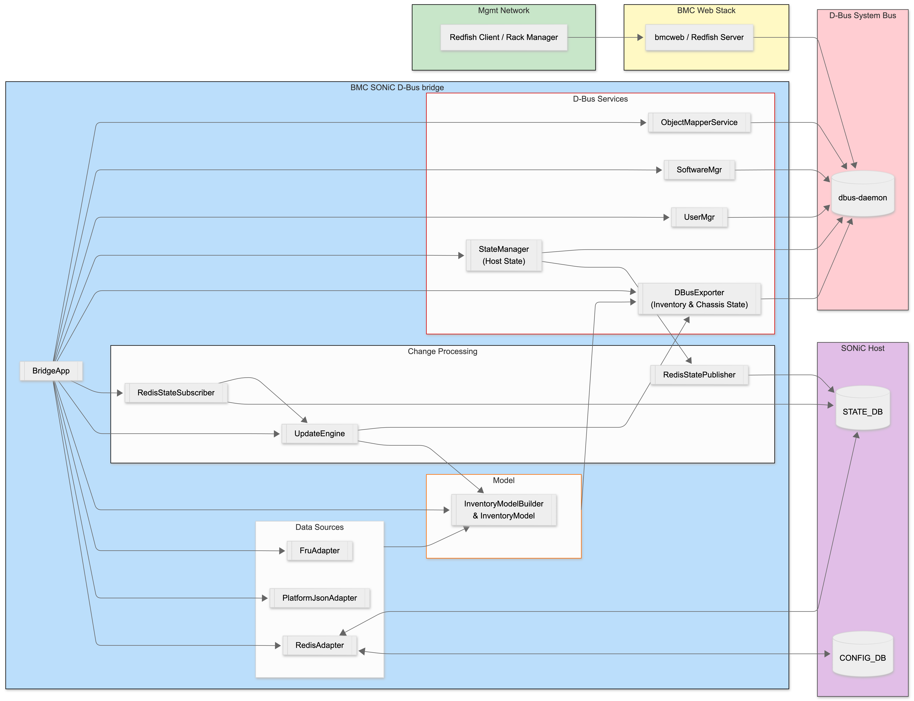
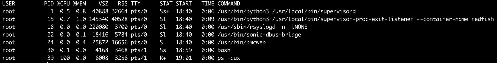
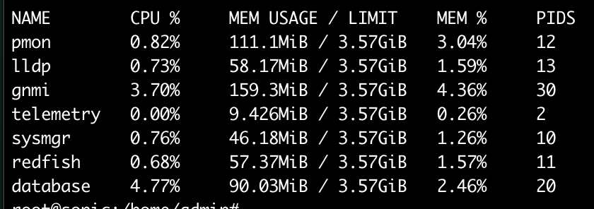
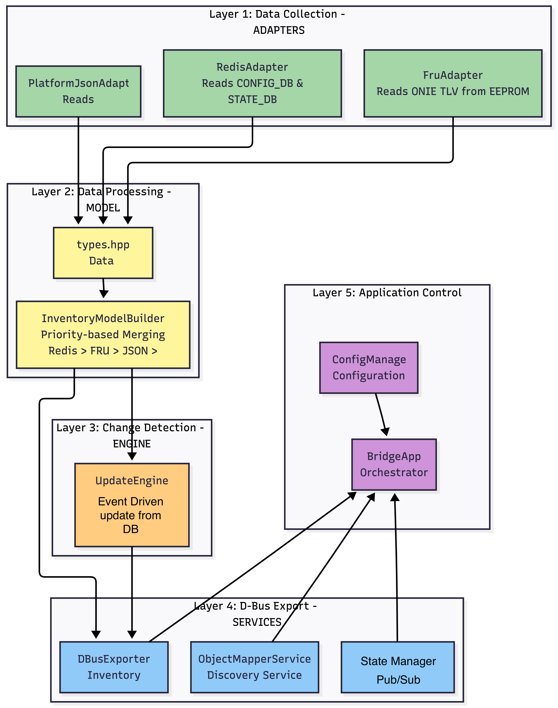

# SONiC Redfish with D-Bus Bridge

## Table of Content

1. [Revision](#1-revision)
   1. [Related documents](#11-related-documents)
2. [Scope](#2-scope)
   1. [Supported Redfish API Endpoints](#21-supported-redfish-api-endpoints)
3. [Definitions / Abbreviations](#3-definitions--abbreviations)
4. [Overview](#4-overview)
5. [Requirements](#5-requirements)
   1. [Functional Requirements](#51-functional-requirements)
   2. [Non-Functional Requirements](#52-non-functional-requirements)
   3. [Compatibility & Out-of-Scope Items](#53-compatibility--out-of-scope-items)
6. [Architecture Design](#6-architecture-design)
   1. [Deployment in SONiC / BMC Environment](#61-deployment-in-sonic--bmc-environment)
   2. [Docker Container Deployment (docker-redfish)](#62-docker-container-deployment-docker-redfish)
      1. [Container Structure](#621-container-structure)
      2. [Process Architecture](#622-process-architecture)
      3. [Runtime Verification](#623-runtime-verification)
      4. [Resource Utilization](#624-resource-utilization)
      5. [Docker Resource Utilization on BMC](#625-docker-resource-utilization-on-bmc)
   3. [Layered Architecture](#63-layered-architecture)
      1. [Core Components](#631-core-components)
         1. [ConfigManager](#6311-configmanager)
         2. [BridgeApp](#6312-bridgeapp-orchestrator)
         3. [Types](#6313-types-data-types)
      2. [Data Adapters](#632-data-adapters)
         1. [PlatformJsonAdapter](#6321-platformjsonadapter)
         2. [RedisAdapter](#6322-redisadapter)
         3. [FruAdapter](#6323-fruadapter)
      3. [Model and Update Components](#633-model-and-update-components)
         1. [InventoryModelBuilder](#6331-inventorymodelbuilder)
         2. [UpdateEngine](#6332-updateengine)
         3. [RedisStateSubscriber](#6333-redisstatesubscriber)
      4. [D-Bus Export Components](#634-d-bus-export-components)
         1. [DBusExporter](#6341-dbusexporter)
         2. [ObjectMapperService](#6342-objectmapperservice)
         3. [StateManager](#6343-statemanager)
   4. [External Dependencies and Interfaces](#64-external-dependencies-and-interfaces-redis-dbus-daemon-bmcweb)
7. [High-Level Design](#7-high-level-design)
   1. [Module Responsibilities](#71-module-responsibilities-bridgeapp-adapters-model-exporter-statemanager-etc)
   2. [Startup Flow](#72-startup-flow-initial-inventory-build--object-creation)
   3. [Runtime Update Flow](#73-runtime-update-flow-redis-change--d-bus-update)
   4. [Host Power Control Flow](#74-host-power-control-flow-requestedhosttransition--redis--host)
   5. [Error Handling and Health Reporting](#75-error-handling-and-health-reporting)
   6. [Scalability and Performance Considerations](#76-scalability-and-performance-considerations)
   7. [Redfish to RedisDB mapping](#77-redfish-to-redisdb-mapping)
8. [Memory Consumption](#8-memory-consumption)
9. [Restrictions / Limitations](#9-restrictions--limitations)
10. [Open / Action Items](#10-open--action-items-if-any)
11. [Testing Requirements / Design](#11-testing-requirements--design)

## 1. Revision


| Version | Date        | Author      | Description                               |
| --------- | ------------- | ------------- | ------------------------------------------- |
| 0.1     | 10-Mar-2026 | Chinmoy Dey | Initial design document for sonic-redfish |
|         |             |             |                                           |

### 1.1 Related documents


| Document Name                                | Link                                                                                                     |
| :--------------------------------------------- | :--------------------------------------------------------------------------------------------------------- |
| SONiC-BMC-OS HLD                             | [https://github.com/sonic-net/SONiC/pull/2043](https://github.com/sonic-net/SONiC/pull/2043)             |
| sonic-redfish HLD                            | [https://github.com/sonic-net/SONiC/pull/2281](https://github.com/sonic-net/SONiC/pull/2281)             |
| SONiC BMC Redfish API and D-Bus test plan    | [https://github.com/sonic-net/sonic-mgmt/pull/23346](https://github.com/sonic-net/sonic-mgmt/pull/23346) |
| SONiC BMC platform management and monitoring | [https://github.com/sonic-net/SONiC/pull/2215](https://github.com/sonic-net/SONiC/pull/2215)             |
|                                              |                                                                                                          |

## 2. Scope

`sonic-redfish` runs on the **BMC** side and exposes BMC information such as SONiC inventory, host state, and related data through **OpenBMC-compatible D-Bus objects**. This allows **openbmc/bmcweb** (a Redfish server, alignment with DMTF specifications) to serve **Redfish APIs** without requiring a full OpenBMC stack on the BMC.

The primary goal behind `sonic-redfish` is to provide an **OpenBMC like environment** , enabling OpenBMC compatible services(ie. bmcweb) to operate seamlessly within **SONiC on the BMC**.

The initial scope covers:

- Chassis and system inventory (serial, manufacturer, model, part number, etc.).
- Chassis power state reporting.
- Host power control.
- Firmware inventory and update services.
- Event subscription and alert management.
- Telemetry data collection and reporting for liquid cooling systems.

### 2.1 Supported Redfish API Endpoints

The following Redfish API endpoints will be supported (in v0.1) for Rack Manager integration with the BMC:

#### Service Root & Discovery

- **GET /redfish/v1**
  - **Purpose**: Service root discovery and switch identification
  - **Use Case**: Rack Manager retrieves switch name and basic system information
  - **Response**: Returns ServiceRoot with links to available Redfish services

#### Firmware Management

- **GET /redfish/v1/UpdateService/FirmwareInventory**
  - **Purpose**: Retrieve firmware inventory details
  - **Use Case**: Rack Manager queries switch firmware versions and component details
  - **Response**: Collection of firmware inventory items with version, status, and update capabilities

#### System Power Control

- **POST /redfish/v1/Systems/{SystemId}/Actions/ComputerSystem.Reset**
  - **Example**: `POST /redfish/v1/Systems/1/Actions/ComputerSystem.Reset`
  - **Purpose**: System reset and power control operations
  - **Use Case**: Rack Manager controls power state of Main_cpu_switch_board
  - **Supported Reset Types**:
    - `On` - Turn on the unit
    - `ForceOff` - Turn off the unit immediately (non-graceful)
    - `GracefulShutdown` - Graceful shutdown and power off
    - `PowerCycle` - Power cycle the Switch

#### Alert Management

- **POST /redfish/v1/Managers/Bmc/Actions/Oem/SONiC.RackManagerAlert**
  - **Purpose**: Post critical alerts from Rack Manager to BMC
  - **Use Case**: Rack Manager sends critical system alerts to BMC for processing and action
  - **OEM Extension**: SONiC-specific alert handling mechanism
  - **Alert Types**: Critical system events, hardware failures, environmental warnings

#### Event Subscription & Notification

- **POST /redfish/v1/EventService/Subscriptions**
  - **Purpose**: Subscribe to BMC events and notifications
  - **Use Case**: Rack Manager subscribes for critical events such as:
    - Leak detection alerts
    - Thermal threshold violations
    - Power state changes
    - Hardware component failures
  - **Supported Event Types**:
    - `Alert` - Critical alerts requiring immediate attention
    - `StatusChange` - Component status changes
    - `ResourceAdded` - New hardware detected
    - `ResourceRemoved` - Hardware removal detected

#### Telemetry Data Collection

- **POST /redfish/v1/TelemetryService/MetricReports** *(or custom OEM endpoint)*
  - **Purpose**: Periodic telemetry data reporting from BMC to Rack Manager
  - **Use Case**: Rack Manager receives real-time monitoring data for liquid cooling system
  - **Telemetry Metrics**:
    - **Inlet Liquid Temperature** - Temperature of coolant entering the system
    - **Inlet Liquid Flow Rate** - Flow rate of coolant (L/min or GPM)
    - **Inlet Liquid Pressure** - Pressure of coolant at inlet (PSI or kPa)
    - **Leak Detection Status** - Binary status and location of detected leaks
  - **Update Frequency**: Configurable periodic updates (default: 30 seconds)

#### Security & Certificate Management

- **Certificate Installation**
  - **Note**: Certificate management may be handled by ACMS (Automated Certificate Management Service) and details are not part of this document.
  - **Endpoints** (TBD) :
    - `GET /redfish/v1/CertificateService/Actions/CertificateService.ReplaceCertificate`
    - `GET /redfish/v1/Managers/Bmc/NetworkProtocol/HTTPS/Certificates`
  - **Use Case**: Secure communication between Rack Manager and BMC
  - **Status**: Implementation details TBD based on certificate management strategy

Out of scope for this document (but possible future work):

- Detailed sensor, fan and PSU telemetry and control.
- Log services, event logs and firmware update workflows beyond minimal FirmwareInventory.
- Advanced thermal management and cooling optimization algorithms, etc

## 3. Definitions / Abbreviations

- **CONFIG_DB / STATE_DB** – SONiC Redis databases containing configuration and runtime state.
- **Device Metadata** – `DEVICE_METADATA|localhost` hash in CONFIG_DB.
- **Chassis State** – `CHASSIS_STATE|chassis0` hash in STATE_DB.
- **BMC** – Board Management Controller (ASPEED platform in this design).
- **DBus** – D-Bus IPC on the BMC system bus.
- **ObjectMapper** – Service providing `GetSubTree*` discovery for bmcweb.

## 4. Overview

A separate implementation of a standard **Redfish server** is not required, as this functionality is already provided by **[bmcweb](https://github.com/openbmc/bmcweb)**. The existing bmcweb service can therefore be used directly to serve **[Redfish APIs](https://www.dmtf.org/standards/redfish)**.

bmcweb retrieves system data through **systemd `dbus-daemon`**, sourcing information from **[OpenBMC-compliant D-Bus objects](https://github.com/openbmc/phosphor-dbus-interfaces/tree/master/yaml/xyz/openbmc_project)**. These D-Bus paths are normally created by **[OpenBMC phosphor-* services](https://github.com/orgs/openbmc/repositories?q=phosphor)**, which are not currently present in SONiC.

> The `sonic-redfish` design addresses this gap by reusing the **bmcweb** codebase from a public repository and introducing a `sonic-dbus-bridge` service to expose the required`OpenBMC-compatible D-Bus` objects.

The motivations for introducing `sonic-dbus-bridge` cab be listed as follows :-

* **OpenBMC Standard Compliance**: bmcweb (industry-standard Redfish server) is hardcoded to expect [xyz.openbmc_project.* D-Bus interfaces](https://github.com/openbmc/phosphor-dbus-interfaces/tree/master/yaml/xyz/openbmc_project). sonic-dbus-bridge implements these exact interfaces, while existing SONiC services use incompatible org.SONiC.* interfaces.
* **Mimicking OpenBMC**: sonic-dbus-bridge mimics OpenBMC D-Bus interfaces (xyz.openbmc_project.*) to expose SONiC platform data for standard Redfish APIs, creating the illusion that all [phosphor-* services](https://github.com/orgs/openbmc/repositories?q=phosphor) exist in SONiC without actually porting them.
* **Data Model Mismatch**: Existing SONiC solutions is/are action-oriented (RPC methods for internal container-to-host control), but Redfish requires a property-based, inventory data model. sonic-dbus-bridge provides the data-oriented interface that external management tools expect.
* **Keep BmcWeb Pristine**: Establishes D-Bus as the singular standardized integration layer, ensuring bmcweb remains nearly unmodified and upstream-compatible, so no forking .
* **Hardware Data Aggregation**: Translates SONiC's distributed hardware data (Redis CONFIG_DB/STATE_DB, FRU EEPROMs, platform.json) into unified OpenBMC compatible D-Bus objects that bmcweb can discover and consume.
* **Bidirectional Communication**: Enables both read (inventory queries) and write (host power control, reboot) operations via Redfish GET/PATCH/POST, bridging external management tools to SONiC's internal state.
* **Graceful Degradation**: Designed to tolerate missing data sources (Redis down, FRU unreadable) with safe fallbacks, ensuring Redfish endpoints remain available even in degraded mode critical for production BMC reliability.

In this architecture, `sonic-dbus-bridge` provides the integration layer. It is a BMC side service that enables a SONiC on BMC to expose an OpenBMC style management interface without running a full OpenBMC stack. The service reads platform and runtime state information from SONiC’s Redis databases, merges it with FRU and platform metadata, and exposes the resulting data as standard OpenBMC D-Bus objects representing inventory and host state.

The **bmcweb** daemon consumes these D-Bus interfaces and exposes them through the corresponding **Redfish APIs** (for example, `/redfish/v1/Chassis` and host power control actions). Although this document may illustrate the design using one or two example APIs/D-Bus, the same approach applies generally to all supported **Redfish APIs**.

At a high level, `sonic-dbus-bridge`:

1. Reads platform information from SONiC (Redis, FRU EEPROMs, `platform.json`).
2. Builds a consolidated `InventoryModel` with clear data-source precedence.
3. Creates OpenBMC-style D-Bus objects for chassis, system and chassis state.
4. Exposes host state control and forwards transitions into SONiC STATE_DB.
5. Keeps D-Bus properties in sync with Redis using an event-driven update engine.

## 5. Requirements

### 5.1 Functional Requirements

- Provide OpenBMC-compatible D-Bus objects for chassis and system inventory.
- Provide `xyz.openbmc_project.State.Chassis` and `xyz.openbmc_project.State.Host` interfaces.
- Reflect changes in DEVICE_METADATA and CHASSIS_STATE into D-Bus properties.
- Publish host power transition requests into STATE_DB for the host to consume.
- Expose Redfish APIs for firmware management, alerting, event subscription and telemetry.
- Support certificate installation for secure communication (TBD).

### 5.2 Non-Functional Requirements

- Event-driven updates with typical propagation latency below 1 second.
- Robust startup when some data sources (FRU, platform.json, Redis) are missing.
- No blocking operations in critical boot paths; all long work is async.

### 5.3 Compatibility & Out-of-Scope Items

- Read-only access to CONFIG_DB, write access limited to dedicated STATE_DB keys.
- Does not replace SONiC CLI/REST/gNMI; it is an additional management surface.

## 6. Architecture Design

### 6.1 Deployment in SONiC / BMC Environment

- **Redis** serves as the primary data source and command channel, accessed via the hiredis library for both synchronous queries and asynchronous event subscriptions.
- **D-Bus system bus** (via sdbusplus) provides the IPC mechanism for exposing inventory and state to bmcweb and other management clients.
- **bmcweb** consumes the D-Bus interfaces to implement Redfish APIs, relying on ObjectMapper for service discovery and standard OpenBMC interfaces for data access.
- **sonic-dbus-bridge**, a sonic-redfish service. The `sonic-dbus-bridge` runs on the BMC (ASPEED) and connects over TCP or Unix sockets to the SONiC Redis instance on the host. It registers multiple D-Bus service names on the system bus (Inventory Manager, ObjectMapper, User Manager, Software Manager, Host State, etc).



> The **`sonic-dbus-bridge`** service is the only new component introduced in this design. It will be added without modifying any existing components.

### 6.2 Docker Container Deployment (docker-redfish)

The `sonic-redfish` components are packaged and deployed as a single Docker container named **docker-redfish** (`docker-sonic-redfish`), which is included in the SONiC BMC image (`sonic-aspeed-arm64.bin`). This follows the standard SONiC containerization model.

#### 6.2.1 Container Structure

The `docker-redfish` container bundles all components required for Redfish API support:


| Component         | Package                             | Description                                                            |
| :------------------ | :------------------------------------ | :----------------------------------------------------------------------- |
| bmcweb            | `bmcweb_1.0.0_arm64.deb`            | Upstream OpenBMC Redfish HTTP server (unmodified or minimally patched) |
| sonic-dbus-bridge | `sonic-dbus-bridge_1.0.0_arm64.deb` | SONiC-to-OpenBMC D-Bus bridge daemon                                   |
| dbus-daemon       | System dependency                   | D-Bus system message bus for IPC between bmcweb and sonic-dbus-bridge  |
| supervisord       | System dependency                   | Process manager for container services (standard SONiC pattern)        |

#### 6.2.2 Process Architecture

Inside the `docker-redfish` container, **supervisord** manages the following processes:




| Process                       | Description                                             |
| :------------------------------ | :-------------------------------------------------------- |
| supervisord                   | Process manager (PID 1)                                 |
| supervisor-proc-exit-listener | Monitors process exits for the redfish container        |
| sonic-dbus-bridge             | Reads SONiC data sources, exposes OpenBMC D-Bus objects |
| bmcweb                        | Redfish HTTP server (HTTPS on port 443)                 |

#### 6.2.3 Runtime Verification

After booting the SONiC BMC image, the container and its services can be verified:

```bash
# Verify container is running
docker ps | grep redfish

# Check process status inside the container
docker exec docker-redfish supervisorctl status
```

#### 6.2.4 Resource Utilization

The `redfish` container is designed for minimal resource consumption on the constrained BMC hardware (Aspeed AST2720/AST2700, typically 4 GB RAM).

**Design considerations for resource efficiency:**

- All Redis and D-Bus operations use non-blocking I/O via Boost.Asio.
- Event-driven updates (Redis keyspace notifications) minimize CPU usage compared to polling.
- The number of D-Bus objects is small and bounded (chassis, system, host state, plus optional users/software).
- No large in-memory caches — the InventoryModel holds only the current snapshot of a small, fixed set of inventory fields.

#### 6.2.5 Docker Resource Utilization on BMC

The following measurements were captured on BMC hardware (Aspeed AST2720, 4 GB RAM) showing CPU, memory usage, and container sizes for all SONiC BMC Docker containers including `redfish`.

**Docker Stats (CPU and Memory Usage):**



### 6.3 Layered Architecture

The `sonic-dbus-bridge `architecture consists of the following key components:

#### 6.3.1 Core Components

##### 6.3.1.1 ConfigManager

- Loads (or defaults) configuration for Redis, platform files, logging, and feature flags.
- Provides configuration to BridgeApp so other components don’t need to parse config themselves.

##### 6.3.1.2 BridgeApp (orchestrator)

- Main process entry point.
- Initializes config, connects to D-Bus, creates data adapters and model.
- Builds the initial inventory, creates D-Bus objects.
- Starts UpdateEngine and RedisStateSubscriber, and manages shutdown.

##### 6.3.1.3 Types (data types)

- Defines normalized data structures (DeviceMetadata, ChassisState, ChassisInfo, SystemInfo, InventoryModel, etc.) used across all layers.

#### 6.3.2 Data Adapters

##### 6.3.2.1 PlatformJsonAdapter

- Reads static platform description from `platform.json` (chassis name, PSU/fan lists, etc.).
- Exposes it in a normalized form to the model layer.

##### 6.3.2.2 RedisAdapter

- Connects to SONiC Redis (CONFIG_DB and STATE_DB).
- Reads hashes like `DEVICE_METADATA|localhost` and `CHASSIS_STATE|chassis0`.
- Returns typed DeviceMetadata and ChassisState structures.

##### 6.3.2.3 FruAdapter

- Reads FRU EEPROMs to extract serial number, part number, manufacturer, and related FRU data.
- Used to enrich inventory information.
- The EEPROM information for both the BMC serial number and the Switch-Host serial number can be read from the Redis database, where it is populated.

#### 6.3.3 Model and Update Components

##### 6.3.3.1 InventoryModelBuilder

- Merges data from Redis, FRU, and platform.json into a single InventoryModel.
- Applies explicit precedence rules (Redis > FRU > platform.json > defaults).
- Tracks the source of each field.

##### 6.3.3.2 UpdateEngine

- Maintains a cached view of key Redis data.
- On changes (from Redis events), it recomputes the InventoryModel.
- Asks DBusExporter to refresh D-Bus objects when something actually changed.

##### 6.3.3.3 RedisStateSubscriber

- Subscribes to STATE_DB keyspace notifications for keys such as `DEVICE_METADATA`, `CHASSIS_STATE`, and `SWITCH_HOST_STATE`.

#### 6.3.4 D-Bus Export Components

##### 6.3.4.1 DBusExporter

- Owns and updates the OpenBMC style D-Bus objects for chassis, system, and chassis state (inventory and power).
- Maps fields from InventoryModel into D-Bus properties.

##### 6.3.4.2 ObjectMapperService

- Registers all `sonic-dbus-bridge` objects under the `xyz.openbmc_project.ObjectMapper` service.
- Enables bmcweb to discover them via `GetSubTree*` calls.

##### 6.3.4.3 StateManager

- Exposes the host state object (`/xyz/openbmc_project/state/host0`) implementing `xyz.openbmc_project.State.Host`.
- Translates `RequestedHostTransition` into host reset commands.
- Publishes them into STATE_DB.

## 7. High-Level Design

### 7.1 Module Responsibilities and High-Level Design

The `sonic-dbus-bridge` is organized into distinct functional blocks, each with clear responsibilities:



#### 7.1.1 Orchestration and Configuration

- **BridgeApp** serves as the main orchestrator, coordinating the initialization sequence, managing component lifecycle, and providing health monitoring across all subsystems.
- **ConfigManager** centralizes configuration management for Redis connections, platform file locations, logging levels, and feature flags, ensuring consistent settings across all components.

#### 7.1.2 Data Source Integration

- **Data Adapters** provide abstraction layers for multiple data sources:
  - Redis databases (CONFIG_DB and STATE_DB) supply dynamic platform metadata, hardware SKU information, and runtime chassis state
  - Platform JSON files provide static descriptors for hardware components such as PSUs, fans, and chassis naming
  - FRU EEPROMs offer manufacturer-provided serial numbers, part numbers, and asset information
- Each adapter encapsulates source-specific access patterns and presents normalized data structures to upper layers.

#### 7.1.3 Data Consolidation and Modeling

- **InventoryModelBuilder** implements a data fusion strategy that merges information from multiple sources using well-defined precedence rules (Redis > FRU > platform.json > defaults).
- The builder tracks data provenance for each field, enabling debugging and validation of inventory information.
- The resulting unified InventoryModel provides a single source of truth for chassis and system properties.

#### 7.1.4 Change Detection and Synchronization

- **UpdateEngine** maintains cached snapshots of critical Redis data and detects changes by comparing current state with previous values.
- When changes are detected, the engine triggers a rebuild of the InventoryModel and coordinates updates to D-Bus objects.
- **RedisStateSubscriber** enables event-driven operation by subscribing to keyspace notifications for device metadata, chassis state, and host state changes, eliminating the need for continuous polling.
- A timer-based polling mechanism exists as a fallback but is disabled by default to minimize resource usage.

#### 7.1.5 D-Bus Interface Export

- **DBusExporter** translates the InventoryModel into OpenBMC-compatible D-Bus objects representing chassis inventory, system information, and chassis state.
- The exporter creates and maintains D-Bus object paths and properties that conform to OpenBMC interface specifications.
- **ObjectMapperService** registers all exported objects with the system ObjectMapper, enabling service discovery by bmcweb and other D-Bus clients.

#### 7.1.6 Host State Management

- **StateManager** provides host power control capabilities by exposing a D-Bus interface for host state transitions.
- Incoming power control requests are validated, queued, and translated into appropriate commands that are published to STATE_DB for consumption by host-side agents.
- The manager maintains current and requested host state, supporting transitions such as power on, graceful shutdown, and forced restart.

#### 7.1.8 External Integration Points

- **Redis** serves as the primary data source and command channel, accessed via the hiredis library for both synchronous queries and asynchronous event subscriptions.
- **D-Bus system bus** (via sdbusplus) provides the IPC mechanism for exposing inventory and state to bmcweb and other management clients.
- **bmcweb** consumes the D-Bus interfaces to implement Redfish APIs, relying on ObjectMapper for service discovery and standard OpenBMC interfaces for data access.

### 7.2 Startup Flow (Initial Inventory Build & Object Creation)

During startup, BridgeApp loads configuration, connects to D-Bus, and initializes the data adapters for Redis, platform.json, and FRU EEPROMs. Once all sources have been read, it calls InventoryModelBuilder to construct an initial InventoryModel that merges and normalizes chassis/system information. DBusExporter then creates the OpenBMC-style inventory and chassis state objects on the system bus, and ObjectMapperService registers them so they are discoverable. At this point the BMC is ready for bmcweb to serve Redfish inventory and chassis resources.

**Startup Sequence:**

1. BridgeApp loads YAML config and connects to D-Bus, claiming required bus names.
2. Adapters connect to Redis and platform data; health is recorded per source.
3. BridgeApp calls `InventoryModelBuilder::build` to create the initial `InventoryModel`.
4. DBusExporter creates chassis, system and chassis state objects and ObjectMapperService registers them.
5. StateManager creates host state object and connects RedisStatePublisher.

![Startup sequence][Startup]

#### 7.2.1 API Request and Data Fetch Sequence

**GET /redfish/v1/Chassis – Phase-1 vs Phase-2**

##### Phase 1 – Basic Chassis Identity from sonic-dbus-bridge

1. A Redfish client / rack manager sends `GET /redfish/v1/Chassis`.
2. bmcweb's Chassis handler asks the ObjectMapper (`xyz.openbmc_project.ObjectMapper`) for D-Bus objects that implement `xyz.openbmc_project.Inventory.Item.Chassis` under `/xyz/openbmc_project/inventory`.
3. Because `sonic-dbus-bridge` registered its objects at startup, ObjectMapper returns the chassis object path (for example `/xyz/openbmc_project/inventory/system/chassis`) and the owning service `xyz.openbmc_project.Inventory.Manager`.
4. bmcweb then calls `org.freedesktop.DBus.Properties.GetAll` on that path for interfaces like `Inventory.Item.Chassis`, `Inventory.Decorator.Asset`, `Inventory.Decorator.Model`.
5. It maps those properties to Redfish fields (Id, Name, SerialNumber, PartNumber, Manufacturer, Model, etc.) and returns the JSON payload for `/redfish/v1/Chassis`.

##### Phase 2 – Backing Objects

The HTTP and ObjectMapper flow stays the same, but the set of D-Bus objects behind it expands (more inventory, power/thermal, sensors, PSU, etc., either from sonic-dbus-bridge or additional services).

For `/redfish/v1/Chassis`, bmcweb will still discover the chassis object via ObjectMapper, but may also:

1. Look up related power/thermal or sensor objects via ObjectMapper,
2. Fetch their properties, and
3. Populate additional sections and links (e.g., richer Status, Power, Thermal, and Links members) in the Redfish response.

![Startup sequence][DataFetch2]

### 7.3 Runtime Update Flow (Redis change to D-Bus update)

1. RedisStateSubscriber receives a keyspace event for `DEVICE_METADATA` or `CHASSIS_STATE`.
2. It calls `UpdateEngine::onRedisFieldChange` with key, field and value.
3. UpdateEngine re-reads the full hash, compares with cached values and, if changed, rebuilds the InventoryModel and updates DBusExporter.
4. Subsequent bmcweb requests observe the new values.

### 7.4 Host Power Control Flow (RequestedHostTransition to Redis to Host)

1. bmcweb writes `RequestedHostTransition` on `/xyz/openbmc_project/state/host0`.
2. StateManager validates and enqueues the request, updates `CurrentHostState` to a transitioning value and schedules async execution.
3. On execution, StateManager maps the transition to a simple command (e.g. `reset-out`) and publishes it to STATE_DB (e.g. `BMC_HOST_REQUEST`).
4. Host-side agents act on the request and update their own state accordingly.

### 7.5 Error Handling and Health Reporting

- Adapters and managers log detailed errors and update an internal `DataSourceHealth` map.
- A summarized health report is emitted during initialization (CONFIG_DB, STATE_DB, FRU, platform.json).
- Failures in optional components (UserMgr, SoftwareMgr) are logged but do not prevent base inventory from operating.

### 7.6 Scalability and Performance Considerations

- All Redis and D-Bus operations use non-blocking I/O via Boost.Asio.
- The number of D-Bus objects is currently small and bounded (one chassis, one system, one chassis state, one host state plus optional users/software).
- Event-driven updates minimize Redis load compared to periodic polling.

### 7.7 SONiC Redfish to RedisDB mapping


| Redfish API Endpoint                                                                | Redfish Property    | Redis Database | Redis Key         | Redis Field | D-Bus Path                                      | D-Bus Interface                                         | D-Bus Property                                    |
| ------------------------------------------------------------------------------------- | --------------------- | ---------------- | ------------------- | ------------- | ------------------------------------------------- | --------------------------------------------------------- | --------------------------------------------------- |
| **CHASSIS**                                                                         |                     |                |                   |             |                                                 |                                                         |                                                   |
| `/redfish/v1/Chassis/{ChassisId}`                                                   | `SerialNumber`      | CONFIG_DB (4)  | `DEVICE_METADATA  | localhost`  | `serial_number`                                 | `/xyz/openbmc_project/inventory/system/chassis`         | `xyz.openbmc_project.Inventory.Decorator.Asset`   |
| `/redfish/v1/Chassis/{ChassisId}`                                                   | `PartNumber`        | CONFIG_DB (4)  | `DEVICE_METADATA  | localhost`  | `part_number`                                   | `/xyz/openbmc_project/inventory/system/chassis`         | `xyz.openbmc_project.Inventory.Decorator.Asset`   |
| `/redfish/v1/Chassis/{ChassisId}`                                                   | `Manufacturer`      | CONFIG_DB (4)  | `DEVICE_METADATA  | localhost`  | `manufacturer`                                  | `/xyz/openbmc_project/inventory/system/chassis`         | `xyz.openbmc_project.Inventory.Decorator.Asset`   |
| `/redfish/v1/Chassis/{ChassisId}`                                                   | `Model`             | CONFIG_DB (4)  | `DEVICE_METADATA  | localhost`  | `model`                                         | `/xyz/openbmc_project/inventory/system/chassis`         | `xyz.openbmc_project.Inventory.Decorator.Model`   |
| `/redfish/v1/Chassis/{ChassisId}`                                                   | `AssetTag`          | CONFIG_DB (4)  | `DEVICE_METADATA  | localhost`  | `mac`                                           | -                                                       | -                                                 |
| `/redfish/v1/Chassis/{ChassisId}`                                                   | `ChassisType`       | -              | -                 | -           | `/xyz/openbmc_project/inventory/system/chassis` | `xyz.openbmc_project.Inventory.Item.Chassis`            | `Type`                                            |
| `/redfish/v1/Chassis/{ChassisId}`                                                   | `PowerState`        | STATE_DB (6)   | `CHASSIS_STATE    | chassis0`   | `-`                                             | `/xyz/openbmc_project/state/chassis0`                   | `xyz.openbmc_project.State.Chassis`               |
| **SYSTEM**                                                                          |                     |                |                   |             |                                                 |                                                         |                                                   |
| `/redfish/v1/Systems/{SystemId}`                                                    | `SerialNumber`      | CONFIG_DB (4)  | `DEVICE_METADATA  | localhost   | `-`                                             | `/xyz/openbmc_project/inventory/system/system0`         | `xyz.openbmc_project.Inventory.Decorator.Asset`   |
| `/redfish/v1/Systems/{SystemId}`                                                    | `Manufacturer`      | CONFIG_DB (4)  | `DEVICE_METADATA  | localhost`  | `manufacturer`                                  | `/xyz/openbmc_project/inventory/system/system0`         | `xyz.openbmc_project.Inventory.Decorator.Asset`   |
| `/redfish/v1/Systems/{SystemId}`                                                    | `Model`             | CONFIG_DB (4)  | `DEVICE_METADATA  | localhost`  | `model`                                         | `/xyz/openbmc_project/inventory/system/system0`         | `xyz.openbmc_project.Inventory.Decorator.Model`   |
| `/redfish/v1/Systems/{SystemId}`                                                    | `HostName`          | CONFIG_DB (4)  | `DEVICE_METADATA  | localhost`  | `hostname`                                      | `/xyz/openbmc_project/network/config`                   | `xyz.openbmc_project.Network.SystemConfiguration` |
| `/redfish/v1/Systems/{SystemId}`                                                    | `SystemType`        | CONFIG_DB (4)  | `DEVICE_METADATA  | localhost`  | `type`                                          | -                                                       | -                                                 |
| **FIRMWARE INVENTORY**                                                              |                     |                |                   |             |                                                 |                                                         |                                                   |
| `/redfish/v1/UpdateService/FirmwareInventory/{Id}`                                  | `Id`                | STATE_DB (6)   | `BMC_FW_INVENTORY | {id}`       | -                                               | `/xyz/openbmc_project/software/{id}`                    | -                                                 |
| `/redfish/v1/UpdateService/FirmwareInventory/{Id}`                                  | `Version`           | STATE_DB (6)   | `BMC_FW_INVENTORY | {id}`       | `version`                                       | `/xyz/openbmc_project/software/{id}`                    | `xyz.openbmc_project.Software.Version`            |
| `/redfish/v1/UpdateService/FirmwareInventory/{Id}`                                  | `Updateable`        | -              | -                 | -           | `/xyz/openbmc_project/software/{id}`            | `xyz.openbmc_project.Software.Activation`               | `Activation`                                      |
| `/redfish/v1/UpdateService/FirmwareInventory/{Id}`                                  | -                   | -              | -                 | -           | `/xyz/openbmc_project/software/{id}`            | `xyz.openbmc_project.Software.Version`                  | `Purpose`                                         |
| **LEAK DETECTION**                                                                  |                     |                |                   |             |                                                 |                                                         |                                                   |
| `/redfish/v1/Chassis/{ChassisId}/ThermalSubsystem/LeakDetection`                    | `Status`            | STATE_DB (6)   | `LEAK_SENSOR      | {id}`       | `state`                                         | `/xyz/openbmc_project/sensors/leak/{id}`                | `xyz.openbmc_project.Inventory.Item.LeakDetector` |
| `/redfish/v1/Chassis/{ChassisId}/ThermalSubsystem/LeakDetection/LeakDetectors/{Id}` | `LeakDetectorType`  | -              | -                 | -           | `/xyz/openbmc_project/sensors/leak/{id}`        | `xyz.openbmc_project.Inventory.Item.LeakDetector`       | `Type`                                            |
| `/redfish/v1/Chassis/{ChassisId}/ThermalSubsystem/LeakDetection/LeakDetectors/{Id}` | `DetectorState`     | STATE_DB (6)   | `LEAK_SENSOR      | {id}`       | `state`                                         | `/xyz/openbmc_project/sensors/leak/{id}`                | `xyz.openbmc_project.Inventory.Item.LeakDetector` |
| `/redfish/v1/Chassis/{ChassisId}/ThermalSubsystem/LeakDetection/LeakDetectors/{Id}` | `Status.State`      | -              | -                 | -           | `/xyz/openbmc_project/sensors/leak/{id}`        | `xyz.openbmc_project.Inventory.Item`                    | `Present`                                         |
| `/redfish/v1/Chassis/{ChassisId}/ThermalSubsystem/LeakDetection/LeakDetectors/{Id}` | `Status.Health`     | -              | -                 | -           | `/xyz/openbmc_project/sensors/leak/{id}`        | `xyz.openbmc_project.State.Decorator.OperationalStatus` | `Functional`                                      |
| **REDFISH EVENTS**                                                                  |                     |                |                   |             |                                                 |                                                         |                                                   |
| EventService → Subscribers                                                         | `MessageId`         | -              | -                 | -           | `/xyz/openbmc_project/sensors/leak/{id}`        | D-Bus Signal: PropertiesChanged                         | `DetectorState`                                   |
| EventService → Subscribers                                                         | `OriginOfCondition` | -              | -                 | -           | -                                               | -                                                       | -                                                 |

## NOTE

- This section needs to be updated in line with the latest SONiC-Redfish API implementation.
- **CONFIG_DB**: Redis Database 4 (User configuration)
- **STATE_DB**: Redis Database 6 (Runtime state)
- **`-`**: Not applicable or derived/hardcoded value, or Yet to be finalize.
- **`{id}`**: Variable identifier (e.g., `leak_sensor_1`, `bmc`, `bios`)
- **`{ChassisId}`**: Chassis identifier (e.g., `chassis`, `BMC`)
- **`{SystemId}`**: System identifier (e.g., `system`, `system0`)

## 8. Memory Consumption

Memory usage is dominated by Redis connection contexts, the in-memory InventoryModel, FRU/platform JSON data and D-Bus object interfaces. The footprint is expected to be small and stable; no unbounded data structures are used.

## 9. Restrictions / Limitations

- Only minimal inventory and host power control are implemented so far, sensors, fans, PSUs and logs are not yet exposed.
- `SWITCH_HOST_STATE` notifications are logged but not yet mapped to D-Bus.
- Assumes a reachable SONiC Redis instance with standard DB indices (4 and 6).

## 10. Open / Action Items (if any)

- Finalize STATE_DB schema documentation for host request publishing.
- Decide on CLI/ConfigDB knobs to enable/disable the bridge per platform.
- Extend the design to cover sensors, fans, PSUs and additional Redfish resources.
- **Test Integration with SONiC Management**: Create automated test suite covering unit tests (component-level), functional tests (D-Bus interface validation), and integration tests (end-to-end Redfish workflows). Leverage existing SONiC management test framework
- **Reconciliation after crash** : If the service is restarted after a failure, full restart logic must be implemented by reconciling existing D-Bus paths with Redis sources. Alternatively, the initial implementation can operate in a one-time mode after boot.

## 11. Testing Requirements / Design

* Unit tests for InventoryModelBuilder, Redis adapters, UpdateEngine and StateManager.
* System tests that validate Redis-to-D-Bus propagation and host transition flows.

`NOTE` : [Test Plan](https://github.com/sonic-net/sonic-mgmt/pull/23346)

[Startup]: ./images/Startup.png
[DataFetch1]: ./images/DataFetch1.png
[DataFetch2]: ./images/DataFetch2.png
