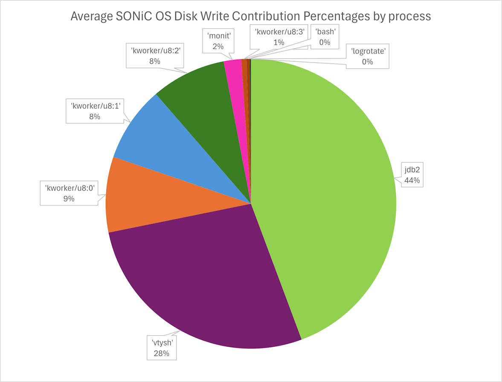
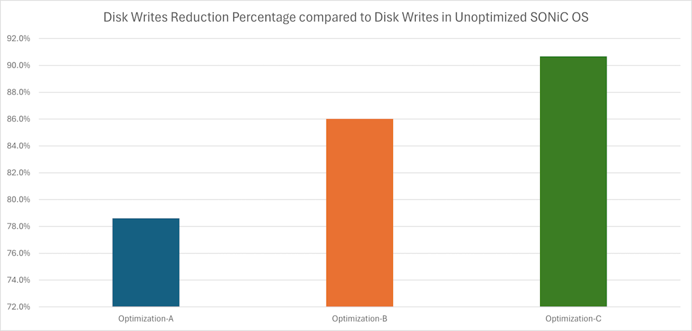

# Analysis of Disk Writers in SONiC Devices

## Context
Numerous devices are transitioning into a read-only file system state due to excessive disk writes in the verbose SONiC OS. Combined with the inability to perform regular power cycles on the switches, this leads to accelerated storage degradation.

## Objective
This analysis aims to identify the largest disk writers on three vendor devices (referred to as SKU1, SKU2, and SKU3) running SONiC OS versions Version_1, Version_2, and Version_3, and to develop optimization recommendations to reduce disk writes.

## Methodology
The following methodology was employed:

- **Devices Queried**: 100 devices each of SKU1, SKU2, and SKU3 across Version_1, Version_2, and Version_3 OS versions (900 devices total).
- **Geographic Spread**: Devices were distributed across different geographical locations.
- **Tools Used**:
  - **blktrace** and **blkparse**: Provided detailed insights into I/O operations at the block layer, ideal for analyzing disk I/O patterns.
  - Blktrace data was saved to `/dev/shm` (tmpfs) to avoid interference during data collection.

### Data Written (MiB/day) for All HWSKUs Across All OS Versions

| HWSKU   | OS Version  | Max   | Min   | Mean  |
|---------|-------------|-------|-------|-------|
| SKU1    | Version_1   | 1158.00 | 587.78 | 872.89 |
|         | Version_2   | 748.39  | 587.24 | 667.81 |
|         | Version_3   | 723.08  | 715.96 | 719.52 |
| SKU2    | Version_1   | 775.06  | 566.12 | 627.81 |
|         | Version_2   | 734.31  | 696.37 | 714.76 |
|         | Version_3   | 768.36  | 685.77 | 729.14 |
| SKU3    | Version_1   | 997.90  | 527.36 | 762.63 |
|         | Version_2   | 676.11  | 506.42 | 591.26 |
|         | Version_3   | 740.78  | 545.50 | 643.14 |
###### **Table 1**

## Results

Consolidating every data point from all 900 devices yields a true average value of 472.5 MiB per day. The following charts show the data and percentage distributions of each process contributing towards the average disk writes.


<br><br>


<br>

The following table summarizes the primary disk writers averaged across 100 devices per HWSKU and OS version:

| Process            | Description                       | Disk Writes (% of Total) |
|--------------------|-----------------------------------|--------------------------|
| **jbd2**           | Kernel journaling thread         | 44%                      |
| **vtysh**          | CLI for network protocols        | 28%                      |
| **kworker/u8:x**   | Worker threads                   | 25%                      |
| **monit**          | Monitoring utility               | 2%                       |
| **logrotate, bash**| Linux utilities/shell            | 1%                       |

###### **Table 2**

- **jbd2**: Kernel journaling.
- **vtysh**: "show bgp summary json" repeatedly written to `~/.history_frr` within BGP container due to [bgpmon command repetition](https://github.com/sonic-net/sonic-buildimage/blob/d83acddf22311e83830dd0124eb8494c717b15c8/src/sonic-bgpcfgd/bgpmon/bgpmon.py#L80).
- **kworker/u8:x**: Includes multiple workers, most common being:
  - `swss:supervisor-proc-exit-listener` writing logs to `/var/log/supervisor/` in the swss container.
  - OverlayFS inodes writing extended attributes.
- **monit**: Updates state file in `/var/lib/monit/`.
- **logrotate**: Updates status file in `/var/lib/logrotate/`.

Additionally, there are also various files created **and quickly deleted** in the `/tmp` directory by the low-priority kernel worker threads, which also contribute towards disk writes via journaling.

## Optimizations
The following optimizations are proposed to reduce disk writes:

- **jbd2**: Evaluate disabling kernel journaling if benefits outweigh trade-offs.
- **/tmp**: Relocate the /tmp directory to tmpfs filesystem
- **vtysh**: Modify command in `bgpmon/bgpmon.py` (Line 79) to:
  ```python
  cmd = "vtysh -H /dev/null -c 'show bgp summary json'"

- **kworker/u8:x**: For `supervisor-proc-exit-listener`, relocate log files to tmpfs: `/dev/shm/supervisor/` within swss container.
- **monit and logrotate**: Move state and status files to tmpfs: `/dev/shm/monit`, `/dev/shm/logrotate`.

### A Note on disabling Kernel Journaling

Disabling journaling on an EXT4 filesystem offers a few tangible benefits, but they come with significant trade-offs, especially in terms of data integrity and stability. Below are the pros and cons of disabling journaling.

#### **Advantages of Disabling Journaling**

1. **Reduced Write Overhead**: Disabling journaling reduces write overhead, as the system doesn’t need to log changes twice (once in the journal, then in the actual data). This could improve write performance, especially for I/O-intensive applications.

2. **Extended SSD Lifespan:**: Write operations are costly in terms of lifespan because SSDs have a limited number of write cycles. Disabling journaling could help extend the lifespan of the SSD by reducing the number of write operations, particularly in write-heavy workloads.


#### **Consequences of Disabling Journaling**

1. **Increased Risk of Data Corruption**: Without journaling, the system cannot track incomplete or interrupted operations, making the filesystem more vulnerable to corruption in the event of a crash, power failure, or forced reboot. Data in-flight could be lost or corrupted as there is no journal to roll back to a known good state.

2. **Longer Recovery Times**: When journaling is disabled, recovery after a crash or unclean shutdown will take much longer since `fsck` will need to be performed, which is time-consuming on large volumes. Journaling significantly speeds up recovery times by replaying only the necessary changes.

3. **Loss of Filesystem Consistency**: Journaling helps maintain metadata consistency (e.g., file ownership, permissions etc.). Without it, metadata inconsistencies could result in file or directory errors, making files inaccessible or corrupted.


### Results with Optimizations
Below are the disk writes in **MiB/day** after implementing the optimizations proposed above:

| HWSKU | OS Version | Unoptimized | Optimizations A |  Optimizations B | Optimization C |
| ----- | ---------- | ----------- | --------------- | ---------------- | -------------- |
| SKU1  | Version_1  | 872.89      | 147.1           | 135.9            | 66             |
|       | Version_2  | 667.81      | 273.3           | 55.8             | 81             |
|       | Version_3  | 719.52      | 133.2           | 87.5             | 70.4           |
| SKU2  | Version_1  | 627.81      | 99.1            | 23.5             | 62.9           |
|       | Version_3  | 729.14      | 43.3            | 8                | 77             |
| SKU3  | Version_1  | 762.63      | 237.3           | 175.3            | 50             |
|       | Version_2  | 591.26      | 160.1           | 94.4             | 52             |
|       | Version_3  | 643.14      | 96              | 206              | 59             |
|       |            |             |                 |                  |                |
|Consolidated|       |701.78	     |147.09	         |98.30	            |64.79           |
|Percentage Reduction||0%          |78.60%	         |86.01%	          |90.68%	         |
       
###### **Table 3**

Where:
- **Optimization A**: User space modifications, journaling is enabled and **/tmp is mounted to disk**
- **Optimization B**: User space modifications, journaling is enabled and **/tmp is mounted to tmpfs**
- **Optimization C**: **Optimization A** + **kernel journaling disabled**

<br>
<br>



<br>
<br>

### Key Takeaways from Disk Write Comparisons Across Scenarios

1. **Unoptimized Scenario:**
   - The baseline disk write volumes are significantly higher across all hardware SKUs and OS versions, with values exceeding **600 MiB/day** in most cases.
   - This reflects the default behavior of the system with no mitigations applied, highlighting the impact of verbose write patterns in SONiC.

2. **Optimization A (All User Space Optimizations Except `/tmp`, which is on Disk):**
   - results in a significant reduction in disk writes (~78.6%), making it a good baseline improvement.
   - **Advantage**: Maintains data integrity by keeping journaling enabled.

3. **Optimization B (All User Space Optimizations):**
   - Achieves significant write reductions compared to the unoptimized state, highlighting the benefits of leveraging temporary storage in RAM.
   - **Advantage**: Maintains data integrity by keeping journaling enabled.

4. **Optimization C (Optimization A + Journaling Disabled):**
   - Shows the **greatest reduction in disk writes** (~90.68%).
   - Journaling contributes heavily to disk writes in the unoptimized state, and disabling it leads to a dramatic reduction.
   - **Trade-offs**: Risk of data corruption, longer recovery times, and filesystem inconsistency must be **carefully considered** before adopting this approach.

5. **Relative Importance of `/tmp` Relocation:**
   - The comparison between Optimizations A and B highlights the critical role of relocating `/tmp` to tmpfs.
   - Relocating `/tmp` alone contributes significantly to write reduction, emphasizing the priority of this optimization.

6. **Overall Effectiveness of User Space Optimizations:**
   - Even without disabling journaling (Optimizations A,B), user space changes like log relocation, command streamlining, and `/tmp` adjustments substantially mitigate disk writes.
   - This suggests a strong case for prioritizing these optimizations as a low-risk, high-impact approach.


### Final Recommendations

1. **Performance with Reliability**: Choose Optimization B, which maintains journaling and provides a significant reduction in disk writes.
2. **System Constraints**: Choose Optimization A if tmpfs is not viable due to memory limitations, but expect lower reductions.
3. **Maximum Disk Write Reduction**: Choose Optimization C if and only if you can tolerate the risks associated with disabling journaling.