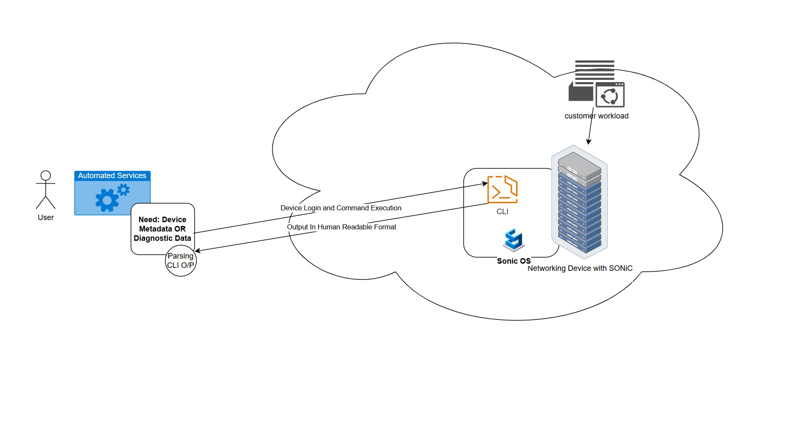
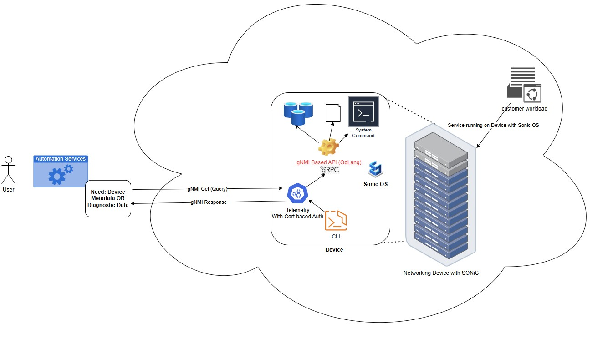
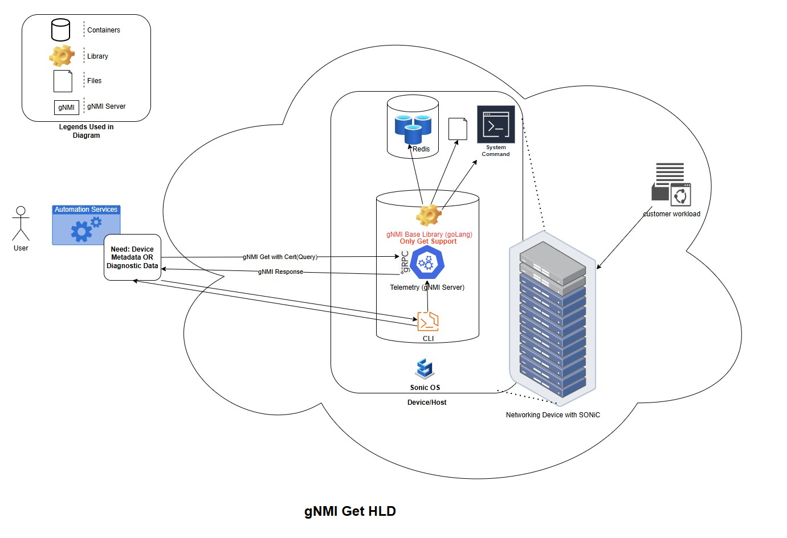

SONiC on-demand show command execution via gNMI
=============================================

# Table of contents
- [Goals](#goals)
- [Problems to solve](#problems-to-solve)
- [What we bring in](#what-we-bring-in)
- [Use case](#use-case)
- [CLI on gNMI client](#cli-on-gnmi-client)
- [New design (HLD)](#new-design-hld)
- [Stop the Bleeding](#stop-the-bleeding-enforcing-gnmi-first-for-show-commands)
- [Test](#test)
- [Rollout plan](#rollout-plan)
- [Future plan](#future-plan)

# Goals
1. Provide a gNMI based API as a read only interface for retrieving SONiC device metadata, which can allow remote invocation without interactive user login.
2. Provide a way to implement show CLI commands using gNMI APIs.
3. Provide a structured response that can be consumed by application.
4. Support Rate limiting using configurable paramters. For instance:
   - Up to 32 parallel command executions per device.
   - Up to 100 maximum concurrent connections.

# Problems to solve
Existing tools (or new tools) that require device metadata OR diagnostic data for lifecycle workflows uses CLI.
1. Log in to the device and run CLI commands.
   - Requires user account/password based authentication, instead of certificate based authentication
   - Introduces overhead for constructing the input and parsing the output of the CLI commands when used by application/automation.

Below is the diagram for current execution paths.

## Current flow diagram


# What we bring in
1. Enable gNMI APIs to provide device metadata and diagnostic data in strctured format(json).
2. Enbable certificate based authentication and autherization based data retrival.
3. Provide native gNMI benefits such as parallel streams and secure transport.
4. Enable show CLI(Read-Only) to use gNMI APIs for future CLI implementation.
5. Plan to migrate existing show CLIs to use gNMI based framework.

## New flow (desired) diagram


# Use case
A system issue is detected (reactive or proactive signal). As a first-level check, operators commonly run commands such as:
- `show version`
- `show reboot-cause`

With this design, automation/agents can fetch equivalent output through gNMI APIs.

For `show reboot-cause`:

### Current CLI output
$ show reboot-cause history

| Name                | Cause  | Time                              | User  | Comment |
|---------------------|--------|-----------------------------------|-------|---------|
| 2026_03_06_23_22_55 | reboot | Fri Mar 6 11:20:41 PM UTC 2026    | admin | N/A     |
| 2026_03_06_23_12_54 | reboot | Fri Mar 6 11:10:42 PM UTC 2026    | admin | N/A     |

### gNMI output
```json
{
  "reboot_cause": {
    "history": {
      "Name": "2025_06_30_05_20_10",
      "Cause": "reboot",
      "Time": "Mon Jun 30 05:18:35 AM UTC 2025",
      "User": "admin",
      "Comment": "N/A"
    }
  }
}
{
  "reboot_cause": {
    "history": {
      "Name": "2025_05_14_19_33_09",
      "Cause": "Power Loss",
      "Time": "Wed May 14 07:30:02 PM UTC 2025",
      "User": "admin",
      "Comment": "Unknown"
    }
  }
}
```

# CLI on gNMI client
CLI with thin gNMI Client can be used to query the metadata OR diagnostic data from SONiC Device.

On device, Telemetry container runs the gNMI server using server certificate and trusted CA roots. A client certificate can be:
- Issued by a CA already present in SONiC trusted root, or
- Issued by a new CA that is explicitly added to SONiC trusted root.

Once certificates are configured, the CLI(with gNMI client) communicates with the gNMI server in Telemetry container.

## CLI Command to gNMI Path Conversion
The gNMI path structure cab be directly drived from the existing SONiC CLI commands to preserve consistency and simplify adoption. Instead of introducing a new schema, a deterministic transformation model can be used to convert CLI commands into hierarchical gNMI paths.
The mapping is 1:1 with CLI behavior to ensure predictable conversion, easy debugging, and CLI to gNMI parity.

**Key Design Points**
- CLI as source of truth: The existing show CLI structure cab be used as-is to define the gNMI path hierarchy.
- Hierarchical mapping: Each CLI token (command/sub-command) maps to a corresponding segment in the gNMI path.
```
show <cmd1> <cmd2> <cmd3> → <cmd1>/<cmd2>/<cmd3>
```
- Options mapped as key filters: CLI options can be translated into gNMI path key-value selectors.
Options with value → [key=value]
Boolean flags → [key=True]

**SONiC CLI to gNMI Path Conversion Utility**
* A CLI utility tool has been developed to translate legacy `show` commands into their corresponding gNMI paths using long-form options. 
* Options accepting values must use an explicit `=` separator (e.g., `--interface=Ethernet0`), which the utility maps directly into gNMI path keys (e.g., `[interface=Ethernet0]`). 
* Valueless long-form options are treated as booleans and explicitly mapped as true (e.g., `--verbose` becomes `[verbose=True]`).

    **Example:** `show interfaces counters --period=5 detailed --verbose` translates to `interfaces/counters[period=5]/detailed[verbose=True]`

### Examples with output
### Example 1: reboot cause history [Without parameter command]
```bash
./gnmi_cli -client_types=gnmi \
  -a <DEVICE-IP>:<PORT> \
  -ca <path_to_CA_crt> \
  -client_crt <path_to_client_crt> \
  -client_key <path_to_client_key> \
  -t OTHERS -logtostderr \
  -qt p -pi 10s -q show/reboot_cause/history
```

```json
{
  "reboot_cause": {
    "history": {
      "Name": "2025_06_30_05_20_10",
      "Cause": "reboot",
      "Time": "Mon Jun 30 05:18:35 AM UTC 2025",
      "User": "admin",
      "Comment": "N/A"
    }
  }
}
{
  "reboot_cause": {
    "history": {
      "Name": "2025_05_14_19_33_09",
      "Cause": "Power Loss",
      "Time": "Wed May 14 07:30:02 PM UTC 2025",
      "User": "admin",
      "Comment": "Unknown"
    }
  }
}
```

### Example 2: interface status [With parameter command]
```bash
./gnmi_cli -client_types=gnmi \
  -a <DEVICE-IP>:<PORT> \
  -ca <path_to_CA_crt> \
  -client_crt <path_to_client_crt> \
  -client_key <path_to_client_key> \
  -t OTHERS -logtostderr \
  -qt p -pi 10s -q show/interface[interface=Ethernet0]/status
```

```json
{
  "show/interface/status/Ethernet0": {
    "Interface": "Ethernet0",
    "Speed": "1000",
    "MTU": "1500",
    "Oper": "up",
    "Admin": "up"
  }
}
```

# New design (HLD)
**TODO:** Replace with final HLD diagram image/link.



# Details
Show commands retrieve data from multiple backends:
- Redis
- System files
- Shell commands
- vtysh
- Hardware sysfs
- Streaming/system command sources

A Go-based library is implemented to collect data from these sources and is linked with gNMI server in Telemetry container.

Query path analysis resulted in two virtual path types for gNMI Get APIs. As captured in CLI section with example of parameter based query and without parameter.


# Stop the Bleeding: Enforcing gNMI-first for Show Commands

To prevent further divergence between CLI and gNMI implementations, all `show` command development will follow a **gNMI-first approach**. Direct additions to CLI (`sonic-utilities`) without corresponding gNMI APIs will be restricted.

## Governance: Mandatory Review Gate

- Introduce a **reviewer group for `sonic-utilities` repository**
- Any new `show` CLI command:
  - **Requires mandatory approval** from the reviewer group
  - Must include:
    - Corresponding **gNMI API implementation**
    - Valid **CLI → gNMI path mapping**
- CLI-only implementations will be **rejected**

## Developer Workflow

All new `show` functionality must follow:
```Implementation → gNMI API → CLI Integration```

## Developing gNMI APIs

A **Golang-based library** will be provided for implementing all new functionality.

### Key Points

- Developers implement logic in **Golang**, not in CLI Python
- The library handles:
  - Data retrieval
  - Business logic
  - JSON response generation

- Existing CLI implementations will be:
  - Converted into **Golang reference examples**
  - Provided as **working samples** for reuse

### Example (Conceptual)

```go
func GetFoo(ctx context.Context, params FooParams) (FooResponse, error) {
    // business logic (migrated from CLI)
}
```

## Calling gNMI API from CLI

The CLI acts as a thin client layer over gNMI.

### Flow

1. CLI parses user input  
   show interfaces counters --period=5  

2. Convert CLI → gNMI path. For this we will provide the utility. 
   interfaces/counters[period=5]  

3. Connect to local gNMI server on device  

4. Execute gNMI query  
   paths: ["SHOW/interfaces/counters[period=5]"]  

5. Receive JSON response  

6. Convert JSON → human-readable CLI output  
   - Use existing Python tabular formatting utilities 
   - For this also we will provide utility but this will require enchancements for new commands. 

## Migration of Existing CLI Commands

- All existing show CLI commands will be gradually migrated to the same model:
  - Move core logic → Golang gNMI library  
  - CLI becomes consumer of gNMI API  

- Migration approach:  
  Existing CLI → Extract logic → Implement in gNMI → Rewire CLI to gNMI  

- This migration is expected to be phased over ~1 year:
  - No disruption to existing workflows  
  - Incremental validation and rollout  

- Tracking the CLI command migration:
  - We will be using a document to track the commands migration and ETA.

## Responsibilities Split

| Layer        | Responsibility                          |
|--------------|----------------------------------------|
| gNMI Server  | Core logic, data retrieval, API surface |
| Golang Lib   | Feature implementation                  |
| CLI (Python) | Input parsing, path generation, output formatting |


  # Test
  Tests are required to keep behavior stable across releases and to validate concurrency, reliability, and output consistency.  
  From below list #1, #2 are already taken care.

 **TODO:** How should we provide the container tests to community and capture here.

  1. Unit tests
    - Validate path-to-handler mapping for non-parameterized and parameterized queries.
    - Validate JSON output schema for each supported show command.
    - Validate failure paths (invalid parameter, unsupported path, backend timeout).
  2. Functional tests
    - Run representative commands (`show reboot-cause`, `show interface status`) and compare against expected output.
    - Validate certificate-based client authentication and authorization behavior.
  3. CLI test
    - Existing CLI tests will be utilized to validate the functionality and correctness of the output.
    - With the formatter in place, the gNMI API JSON payload combined with the formatter output must satisfy these existing test cases.

# Rollout plan
We can roll out in 2 ways:
  (1) Full Cut Rollout
      - Once commands are developed and tested, we switch the execution path for all to get data using gNMI APIs.
  (2) Compare and Move
      - Show commands are categorized into 3 phases. Dev completion and rollout happen in these same phases.
      - Fallback Option: For existing commands, a fallback flag allows switching from the gNMI path back to the python/existing CLI path.
      - Flag Behavior: Set to false by default to execute the gNMI API path. This flag support will be removed later.

# Future plan
1. We will have versioning in gNMI Response which is default concept for gNMI to track response changes.
2. We should have generic gNMI stats to provide each query level latency, status as well as QPS and other summarized statistics.
3. Migrate existing show CLI commands to use gNMI based infra.
4. Add schema validation for output consistency across releases.
5. Add unit and scale tests for concurrency and throttling behavior.
6. Publish API/query path catalog for automation consumers.
