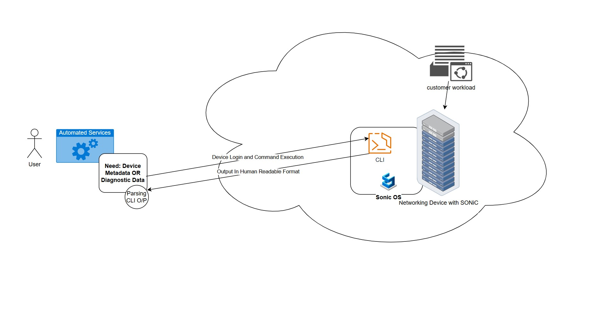
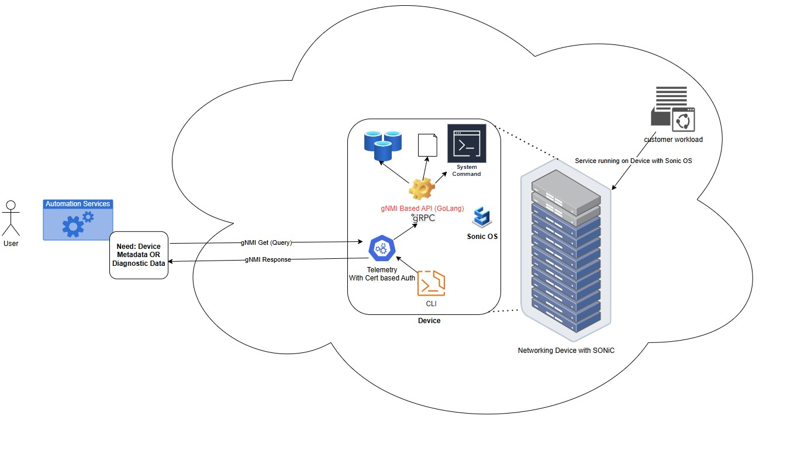
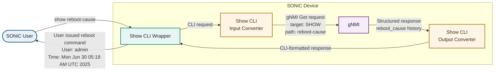
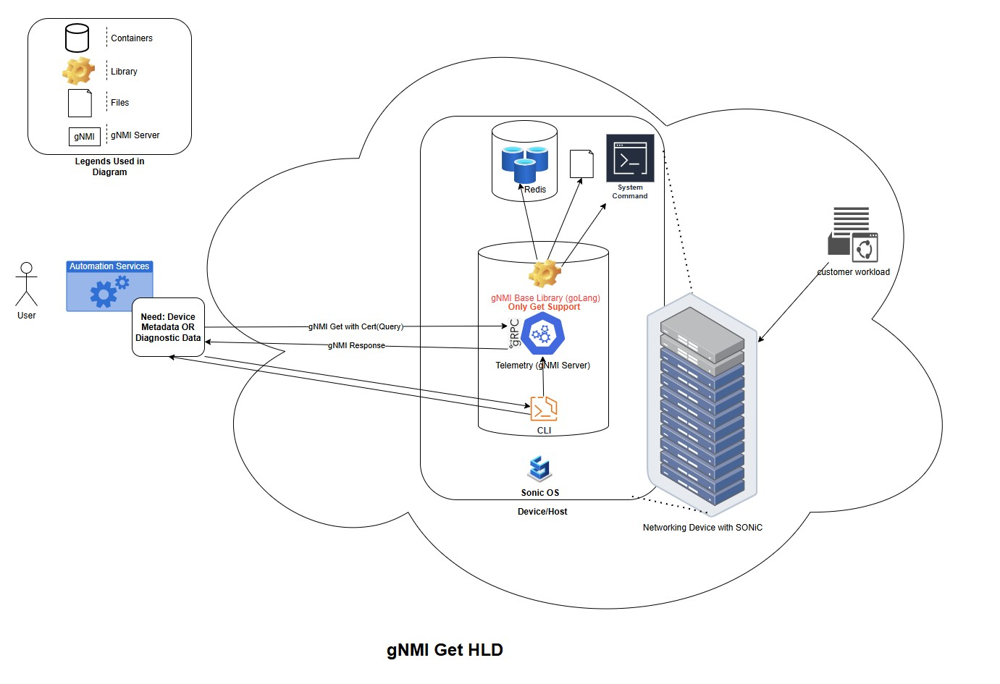

SONiC on-demand show command execution via gNMI
=============================================

# Table of contents
- [Goals](#goals)
- [Problems to solve](#problems-to-solve)
- [What we bring in](#what-we-bring-in)
- [Use case](#use-case)
- [CLI on gNMI client](#cli-on-gnmi-client)
- [New design (HLD)](#new-design-hld)
- [Stop the Bleeding](#stop-the-bleeding-enforcing-gnmi-first-for-show-commands)
- [Test](#test)
- [Rollout plan](#rollout-plan)
- [Future plan](#future-plan)
- [Other approaches](#other-approaches-considered)

# Goals
1. Provide a gNMI based API as a read only interface for retrieving SONiC device metadata (equivalent to show cli commands), which can allow remote invocation without interactive user login.
2. Provide a way to implement show CLI commands using gNMI APIs.
3. Provide a structured response that can be consumed by application.
4. Support Rate limiting using configurable parameters. For instance:
   - Up to 32 parallel command executions per device.
   - Up to 100 maximum concurrent connections.

# Problems to solve
Existing tools (or new tools) that require device metadata OR diagnostic data for lifecycle workflows uses CLI.
1. Log in to the device and run CLI commands.
   - Requires user account/password based authentication, instead of certificate based authentication
   - Introduces overhead for constructing the input and parsing the output of the CLI commands when used by application/automation.

Below is the diagram for current execution paths.

## Current flow diagram


# What we bring in
1. Enable gNMI APIs to provide device metadata and diagnostic data in structured format(json).
2. Enable certificate-based authentication and authorization for data retrieval, leveraging the same authentication mechanism currently supported by gNMI.
3. Provide native gNMI benefits such as parallel streams and secure transport.
4. Enable show CLI(Read-Only) to use gNMI APIs for future CLI implementation.
5. Plan to migrate existing show CLIs to use gNMI based framework.

## New flow (desired) diagram


# Use case
A system issue is detected (reactive or proactive signal). As a first-level check, operators commonly run commands such as:
- `show version`
- `show reboot-cause`

With this design, automation/agents can fetch equivalent output through gNMI APIs.

For `show reboot-cause`:

### Current CLI output
$ show reboot-cause history

| Name                | Cause  | Time                              | User  | Comment |
|---------------------|--------|-----------------------------------|-------|---------|
| 2026_03_06_23_22_55 | reboot | Fri Mar 6 11:20:41 PM UTC 2026    | admin | N/A     |
| 2026_03_06_23_12_54 | reboot | Fri Mar 6 11:10:42 PM UTC 2026    | admin | N/A     |

### gNMI output
```json
[{
  "reboot_cause": {
    "history": {
      "Name": "2025_06_30_05_20_10",
      "Cause": "reboot",
      "Time": "Mon Jun 30 05:18:35 AM UTC 2025",
      "User": "admin",
      "Comment": "N/A"
    }
  }
},
{
  "reboot_cause": {
    "history": {
      "Name": "2025_05_14_19_33_09",
      "Cause": "Power Loss",
      "Time": "Wed May 14 07:30:02 PM UTC 2025",
      "User": "admin",
      "Comment": "Unknown"
    }
  }
}]
```

# CLI on gNMI client
CLI with thin gNMI Client can be used to query the metadata OR diagnostic data from SONiC Device.

On device, Telemetry container runs the gNMI server using server certificate and trusted CA roots. A client certificate can be:
- Issued by a CA already present in SONiC trusted root, or
- Issued by a new CA that is explicitly added to SONiC trusted root.

Once certificates are configured, the CLI(with gNMI client) communicates with the gNMI server in Telemetry container.


```mermaid
flowchart LR
    U([SONiC User])

    subgraph DEVICE["SONiC Device"]
        W["Show CLI Wrapper"]
        IC["Show CLI<br/>Input Converter"]
        G["gNMI"]
        OC["Show CLI<br/>Output Converter"]

        W -->|"CLI request"| IC
        IC -->|"gNMI Get request<br/>target: SHOW<br/>path: reboot-cause"| G

        G -->|"Structured response<br/>reboot_cause history"| OC
        OC -->|"CLI-formatted response"| W
    end

    U -->|"show reboot-cause"| W
    W -->|"User issued reboot command<br/>User: admin<br/>Time: Mon Jun 30 05:18 AM UTC 2025"| U

    classDef user fill:#eaf2f8,stroke:#1f618d,color:#17202a,stroke-width:2px;
    classDef wrapper fill:#e8f6f3,stroke:#148f77,color:#17202a,stroke-width:2px;
    classDef converter fill:#fef5e7,stroke:#b9770e,color:#3d2b0b,stroke-width:2px;
    classDef gnmi fill:#f5eef8,stroke:#7d3c98,color:#2e1538,stroke-width:2px;

    class U user;
    class W wrapper;
    class IC,OC converter;
    class G gnmi;
```

## CLI Command to gNMI Path Conversion
The gNMI path structure cab be directly drived from the existing SONiC CLI commands to preserve consistency and simplify adoption. Instead of introducing a new schema, a deterministic transformation model can be used to convert CLI commands into hierarchical gNMI paths.
The mapping is 1:1 with CLI behavior to ensure predictable conversion, easy debugging, and CLI to gNMI parity.

**Key Design Points**
- CLI as source of truth: The existing show CLI structure cab be used as-is to define the gNMI path hierarchy.
- Hierarchical mapping: Each CLI token (command/sub-command) maps to a corresponding segment in the gNMI path.
```
show <cmd1> <cmd2> <cmd3> → <cmd1>/<cmd2>/<cmd3>
```
- Options mapped as key filters: CLI options can be translated into gNMI path key-value selectors.
Options with value → [key=value]
Boolean flags → [key=True]

- Argument Normalization: CLI arguments are normalized before gNMI path generation. This ensures that equivalent short-form and long-form options, such as `-v` and `--verbose`, are resolved to a common internal representation. The normalized representation is then used to generate a deterministic gNMI path. This preserves compatibility with the existing SONiC CLI behavior while ensuring that different forms of the same command generate an identical gNMI request.
```bash
show interfaces status -v
show interfaces status --verbose
```

**SONiC CLI to gNMI Path Conversion Utility**
* A CLI utility tool has been developed to translate legacy `show` commands into their corresponding gNMI paths using long-form options. 
* Options accepting values must use an explicit `=` separator (e.g., `--interface=Ethernet0`), which the utility maps directly into gNMI path keys (e.g., `[interface=Ethernet0]`). 
* Valueless long-form options are treated as booleans and explicitly mapped as true (e.g., `--verbose` becomes `[verbose=True]`).

    **Example:** `show interfaces counters --period=5 detailed --verbose` translates to `interfaces/counters[period=5]/detailed[verbose=True]`

### Examples with output
### Example 1: switch trimming global [Without parameters]
```bash
./gnmi_cli -client_types=gnmi \
  -a <DEVICE-IP>:<PORT> \
  -ca <path_to_CA_crt> \
  -client_crt <path_to_client_crt> \
  -client_key <path_to_client_key> \
  -t SHOW -logtostderr \
  -qt p -pi 10s -q switch-trimming/global
```

```json
{
  "size": "128",
  "dscp_value": "32",
  "tc_value": "5",
  "queue_index": "3"
}
```

### Example 2: interface status [With parameter command]
```bash
./gnmi_cli -client_types=gnmi \
  -a <DEVICE-IP>:<PORT> \
  -ca <path_to_CA_crt> \
  -client_crt <path_to_client_crt> \
  -client_key <path_to_client_key> \
  -t SHOW -logtostderr \
  -qt p -pi 10s -q interface[interface=Ethernet0]/status
```

```json
{
  "show/interface/status/Ethernet0": {
    "Interface": "Ethernet0",
    "Speed": "1000",
    "MTU": "1500",
    "Oper": "up",
    "Admin": "up"
  }
}
```

# New design (HLD)


# Details
Show commands retrieve data from multiple backends:
- Redis
- System files
- Shell commands
- vtysh
- Hardware sysfs
- Streaming/system command sources

A Go-based library is implemented to collect data from these sources and is linked with gNMI server in Telemetry container.

Query path analysis resulted in two virtual path types for gNMI Get APIs. As captured in CLI section with example of parameter based query and without parameter.

**Reusing Existing Language-Specific Libraries-**
There are use cases where we may want to leverage existing Python implementations (for example, Platform APIs) instead of reimplementing the functionality in Go. Similarly, future requirements may involve integrating libraries written in other languages such as Rust. In such scenarios, we can use cgo-based bindings to invoke the underlying libraries through their C ABI interfaces.
The integrations execute within the same process, which keeps the invocation overhead minimal while enabling code reuse and multi-language extensibility. This approach allows us to incrementally adopt existing components without impacting the overall architecture.

**Security and Command Execution Safeguards-**
To ensure safe command execution through vtysh, the implementation incorporates multiple layers of validation and protection against command injection and unintended command chaining. First, only a predefined and explicitly approved set of commands can be executed through vtysh. Any command outside this whitelist is rejected, preventing arbitrary command execution on the device. Second, in scenarios where the output of one command is used as input for a subsequent command, the intermediate data is sanitized before further processing. Potentially hazardous characters and shell-specific symbols, such as @, ;, |, `, $, &, and other command-injection patterns, are filtered or removed to ensure that only validated data is propagated. These safeguards significantly reduce the risk of command injection attacks and help maintain a secure and predictable execution environment.

# Stop the Bleeding: Enforcing gNMI-first for Show Commands

To prevent further divergence between CLI and gNMI implementations, all `show` command development will follow a **gNMI-first approach**. Direct additions to CLI (`sonic-utilities`) without corresponding gNMI APIs will be restricted.

## Overview


```mermaid
flowchart LR
    subgraph P1["Phase 1: Support and Readiness"]
        A["Publish Go reference implementations<br/>for supported data-access flows"]
        B["Provide development utilities,<br/>frameworks, and test tooling"]
        C["Create an SME support group<br/>for design and migration assistance"]
        D["Validate developer readiness<br/>and implementation guidance"]

        A --> B --> C --> D
    end

    G{{"Governance Enforcement Gate<br/><br/>Enable repository policy:<br/>No new Python-only show commands"}}

    subgraph P2["Phase 2: Migration and Adoption"]
        E["Implement gNMI APIs<br/>for existing show commands"]
        F["Validate API and CLI<br/>functional parity"]
        H["Modify existing CLI commands<br/>to call the new gNMI APIs"]
        I["Complete staged migration<br/>and retire duplicated Python logic"]

        E --> F --> H --> I
    end

    D --> G --> E

    classDef readiness fill:#e8f4fd,stroke:#2878b5,color:#17202a,stroke-width:2px;
    classDef governance fill:#fff2cc,stroke:#b8860b,color:#3d2b00,stroke-width:3px;
    classDef migration fill:#e8f6ef,stroke:#238b57,color:#17202a,stroke-width:2px;

    class A,B,C,D readiness;
    class G governance;
    class E,F,H,I migration;
```

## Phase Details

| Stage | Objective | Deliverables | Exit Criteria |
|---|---|---|---|
| **Phase 1: Support and Readiness** | Make gNMI-first development practical before enforcing it. | Go reference implementations covering supported data sources and execution flows; CLI-to-gNMI path and output-conversion utilities; development and test guidance; SME support group for design reviews, implementation assistance, and migration support. | Developers have documented examples, usable tooling, test coverage, and an identified support channel. |
| **Governance Enforcement Gate** | Stop further growth of Python-only `show` command implementations. | Enable the repository governance policy and mandatory review gate. New or materially modified `show` commands must include a corresponding gNMI API and CLI-to-gNMI path mapping. | Python-only implementations are blocked unless an explicitly approved temporary exception is granted. |
| **Phase 2A: Existing API Migration** | Provide gNMI API coverage for the existing `show` command inventory. | Implement the server-side Go handlers and structured response contracts for existing commands. Validate behavior, error handling, security, scale, and output compatibility. | Each migrated command has a supported gNMI path, a defined response contract, and passing functional-parity tests. |
| **Phase 2B: CLI Adoption** | Make the SONiC CLI consume the new gNMI APIs instead of executing duplicated Python business logic. | Convert the CLI into a thin client that performs input parsing, gNMI path generation, local gNMI invocation, and output formatting. Remove obsolete Python implementations after successful rollout. | The gNMI path is the default execution path, operational parity is confirmed, and duplicated Python logic can be retired safely. |

## Governance: Mandatory Review Gate

- Introduce a **reviewer group for `sonic-utilities` repository**
- Any new `show` CLI command:
  - **Requires mandatory approval** from the reviewer group
  - Must include:
    - Corresponding **gNMI API implementation**
    - Valid **CLI → gNMI path mapping**
- CLI-only implementations will be **rejected**

## Developer Workflow

All new `show` functionality must follow:
`Implementation → gNMI API → CLI Integration`
> **Note:** Developers may initially implement a gNMI API in Go that invokes existing Python scripts for data retrieval. However, this adds execution overhead and should be considered a temporary approach. The preferred long-term direction is to migrate the Python implementation to native Go.

## Developing gNMI APIs

A **Golang-based library** will be provided for implementing all new functionality.

### Key Points

- Developers implement logic in **Golang**, not in CLI Python
- The library handles:
  - Data retrieval
  - Business logic
  - JSON response generation

- Existing CLI implementations will be:
  - Converted into **Golang reference examples**
  - Provided as **working samples** for reuse

### Example (Conceptual)

```go
func GetFoo(ctx context.Context, params FooParams) (FooResponse, error) {
    // business logic (migrated from CLI)
}
```

## Calling gNMI API from CLI

The CLI acts as a thin client layer over gNMI.

### Flow

1. CLI parses user input  
   show interfaces counters --period=5  

2. Convert CLI → gNMI path. For this we will provide the utility. 
   interfaces/counters[period=5]  

3. Connect to local gNMI server on device  

4. Execute gNMI query  
   paths: ["SHOW/interfaces/counters[period=5]"]  

5. Receive JSON response  

6. Convert JSON → human-readable CLI output  
   - Use existing Python tabular formatting utilities 
   - For this also we will provide utility but this will require enhancements for new commands. 

## Migration of Existing CLI Commands

- All existing show CLI commands will be gradually migrated to the same model:
  - Move core logic → Golang gNMI library  
  - CLI becomes consumer of gNMI API  

- Migration approach:  
  Existing CLI → Extract logic → Implement in gNMI → Rewire CLI to gNMI  

- This migration is expected to be phased over ~1 year:
  - No disruption to existing workflows  
  - Incremental validation and rollout  

- Tracking the CLI command migration:
  - We will be using a document to track the commands migration and ETA.

## Responsibilities Split

| Layer        | Responsibility                          |
|--------------|----------------------------------------|
| gNMI Server  | Core logic, data retrieval, API surface |
| Golang Lib   | Feature implementation                  |
| CLI (Python) | Input parsing, path generation, output formatting |


  # Test
  Tests are required to keep behavior stable across releases and to validate concurrency, reliability, and output consistency.  
  From below list #1, #2 are already taken care.

  1. Unit tests
    - Validate path-to-handler mapping for non-parameterized and parameterized queries.
    - Validate JSON output schema for each supported show command.
    - Validate failure paths (invalid parameter, unsupported path, backend timeout).
  2. Functional tests
    - Run representative commands (`show reboot-cause`, `show interface status`) and compare against expected output.
    - Validate certificate-based client authentication and authorization behavior.
  3. CLI test
    - Existing CLI tests will be utilized to validate the functionality and correctness of the output.
    - With the formatter in place, the gNMI API JSON payload combined with the formatter output must satisfy these existing test cases.
  4. Nightly test
    - A nightly end-to-end test suite will validate the complete execution path, including CLI-to-gNMI path translation by utility, gNMI API execution, and output formatting utility. The tests ensure that JSON responses generated by the gNMI APIs are correctly transformed into the expected human-readable CLI format, providing continuous validation of functional correctness and regression coverage.

# Rollout Plan

We can roll out in two ways:

## 1. Full Cut Rollout

- Once commands are developed and tested, we switch the execution path for all commands to retrieve data using gNMI APIs.

## 2. Compare and Move [Recommended]

- For existing commands only, a temporary fallback flag allows switching between the gNMI path and the existing Python/CLI implementation.
- **Fallback Option:** For existing commands, a fallback flag allows switching from the gNMI path back to the Python/existing CLI path.
- **Flag Behavior:** Set to `false` by default to execute the gNMI API path. This flag support will be removed later.

# Future plan
1. We will have versioning in gNMI Response which is default concept for gNMI to track response changes.
2. We should have generic gNMI stats to provide each query level latency, status as well as QPS and other summarized statistics.
3. Migrate existing show CLI commands to use gNMI based infra.
4. Add schema validation for output consistency across releases.
5. Add unit and scale tests for concurrency and throttling behavior.
6. Publish API/query path catalog for automation consumers.

# Other Approaches Considered
| Key comparison / target | Option 1: CLI as a thin gNMI client | Option 2: CLI integration with gNMI interface via library |
|---|---|---|
| Contract enforcement | **Strong** | **Moderate** |
| Efficiency | **Moderate** | **Strong** |
| Robustness | **Strong** | **Moderate** |
| Maintainability | **Strong** | **Moderate** |
| Security and policy consistency | **Strong** | **Moderate** |
| Local and remote behavior consistency | **Strong** | **Weak** |

**Rating scale:** Strong = clear advantage; Moderate = acceptable with trade-offs; Weak = significant architectural or operational disadvantage.