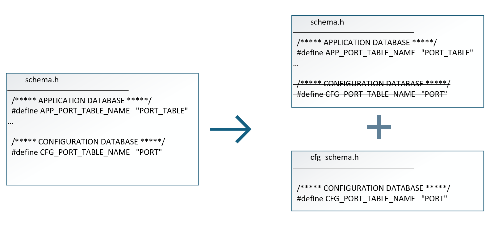

# SONiC YANG based validation and runtime enforcement

# Table of contents

- [Revision](#revision)
- [Scope](#scope)
- [1. Overview](#1-overview)
- [2. Requirements](#2-requirements)
- [3.Contribution](#3contribution)
   * [3.1 YANG model](#31-yang-model)
   * [3.2 cfg_schema.h](#32-cfg_schemah)
- [4.Runtime Enforcement](#4runtime-enforcement)

## Revision

| Rev |     Date    |       Author       | Change Description                |
|:---:|:-----------:|:------------------:|-----------------------------------|
| 0.1 |  06/27/2025 |   Jingwen Xie      | Initial version                   |

## Scope

This section describes the goals, requirements, and contribution of the CFG macros modification in sonic-swss-common repo.

## 1. Overview

The CFG-related macros are currently defined in `schema.h` and are primarily imported and used within the `sonic-swss` repository. Since our goal is to protect each `ConfigDB` table with YANG, it’s important to maintain consistency between the CFG macros and the YANG model.

The plan is to automate the generation of CFG macros as part of the YANG model creation process. This means contributors will no longer need to manually add CFG macros to `schema.h` — instead, these macros will be auto-generated in `cfg_schema.h` based on the YANG model.

In final stage, the CFG related macros should all resides in `cfg_schema.h`. Non-CFG related table will be kept in `schema.h`

## 2. Requirements

Since not all CFG macros are supported by YANG model, the migration plan needs to be provided for missing YANG model contribution.

| Type    | In use but missing YANG model | Naming Conflict | No use and no YANG model |
|---------|-------------------------------|-----------------|--------------------------|
| Example | #define CFG_WATERMARK_TABLE_NAME "WATERMARK_TABLE"   #define CFG_TC_TO_DOT1P_MAP_TABLE_NAME "TC_TO_DOT1P_MAP"| #define CFG_LAG_TABLE_NAME "PORTCHANNEL"   #define CFG_FG_NHG "FG_NHG" | #define CFG_SAG_TABLE_NAME "SAG"   #define CFG_SWITCH_TABLE_NAME "SWITCH"
| Solution| Keep CFG macro in schema.h. Remove after YANG model is created | Update swss interaction code and align with CFG_XXX_TABLE_NAME convention | Remove in schema.h header file

## 3.Contribution

### 3.1 YANG model

When trying to add a new CFG macro, such as #define CFG_XXX_TABLE_NAME "XXX", you need to create a YANG model regarding XXX table. Then the static macro will automatically being built into `libswsscommon.deb`.

### 3.2 cfg_schema.h

To verify that, follow the build process in https://github.com/sonic-net/sonic-swss-common/ , the common/cfg_schema.h will be auto generated. Move it to common/cfg_schema.h.pregenerated to keep the pregenerated file up to date.

## 4.Runtime Enforcement
Further guidelines and requirements will be brought upon in the future on-demand.
