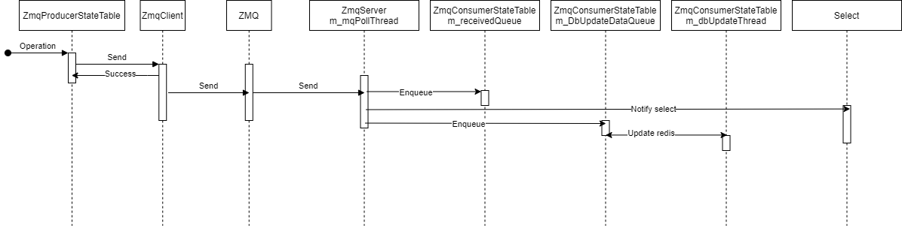

# ZMQ producer/consumer state table design

# Table of Contents
- [Table of Contents](#table-of-contents)
- [1 Functional Requirements](#1-functional-requirement)
  * [1.1 Supported operations](#11-supported-operations)
  * [1.2 ZMQ producer state table support async operation](#12-zmq-producer-state-table-support-async-operation)
  * [1.3 ZMQ consumer state table support async operation](#13-zmq-consumer-state-table-support-async-operation)(#2-configuration-and-management-requirements)
- [2 Design](#1-design)
  * [2.1 diagram](#21-diagram)
  * [2.1 flow chart](#21-flow-chart)
- [3 References](#references)
  * [ZMQ](#zmq)

# 1 Functional Requirement
## 1.1 ZMQ client supported operations
 - ZmqClient will send message to ZMQ.
 - ZmqClient can reuse by multiple ZmqProducerStateTable instance.
 - ZmqClient sendMsg() method is thread safe async method, will return immediately, ZMQ lib support async operation.
 - ZmqClient will retry when send not success:
    - When ZMQ socket connection broken, send API will failed and need re-connect and send again.
    - When ZMQ send queue is full, send API will failed and need retry later.
    - When a signal come, ZMQ send API will failed, need retry again.
 - ZmqClient will throw exception after retry failed.
 - ZmqClient will throw exception when ZMQ connection break.
## 1.2 ZMQ server supported operations
 - ZmqServer will start a receive thread and receive message from ZMQ.
 - ZmqServer can reuse by multiple ZmqConsumerStateTable instance.
 - When ZmqServer receive message from ZMQ, ZmqServer will:
    - De-serialize received message.
    - Find ZmqMessageHandler by message content.
    - Dispatch message to ZmqMessageHandler.
## 1.3 ZMQ producer state table supported operations
 - Producer table will use ZmqClient to send message.
 - Should support following operations.
   - Set:
        void set(const std::string &key,
                     const std::vector<FieldValueTuple> &values,
                     const std::string &op = SET_COMMAND,
                     const std::string &prefix = EMPTY_PREFIX)
   - Delete:
        void del(const std::string &key,
                     const std::string &op = DEL_COMMAND,
                     const std::string &prefix = EMPTY_PREFIX)
   - Batch Set:
        void set(const std::vector<KeyOpFieldsValuesTuple>& values)
   - Batch Delete:
        void del(const std::vector<std::string>& keys)
## 1.3 ZMQ consumer state table supported operations
 - Consumer implement ZmqMessageHandler interface.
 - When consumer table receive message from ZmqServer, consumer table will:
    - Send notification to select to handle received operation.
    - Send notification to DB update thread for write received operation to database.
      This is a configurable feature, could turn on/off this feature in use cases requiring less memory consumption or higher performance.
    - After send notification, continue receive next message from ZMQ.

# 2 Design
 - Diagram:

 - Sequence:

 - Call ZmqProducerStateTable API.
 - ZmqProducerStateTable will send message with ZmqClient.
 - ZmqClient will serialize operation and send to ZMQ.
   - Return when send success.
   - Retry when send failed.
   - Throw exception when retry failed.
 - ZmqServer Side:
   - m_mqPollThread:
   - Receive message from ZMQ.
   - De-serialize received message then dispatch message to ZmqConsumerStateTable.
   - Continue receive next message.
 - ZmqConsumerStateTable Side:
   - Receive message from ZmqServer then:
     - Notify select event
     - Notify m_dbUpdateThread
   - m_dbUpdateThread:
     - Update data from m_DbUpdateDataQueue to Redis database.
 - Select will pop operations from m_receivedQueue with ZmqConsumerStateTable::pops().

# 3 References
 - ZMQ: https://zguide.zeromq.org/docs/