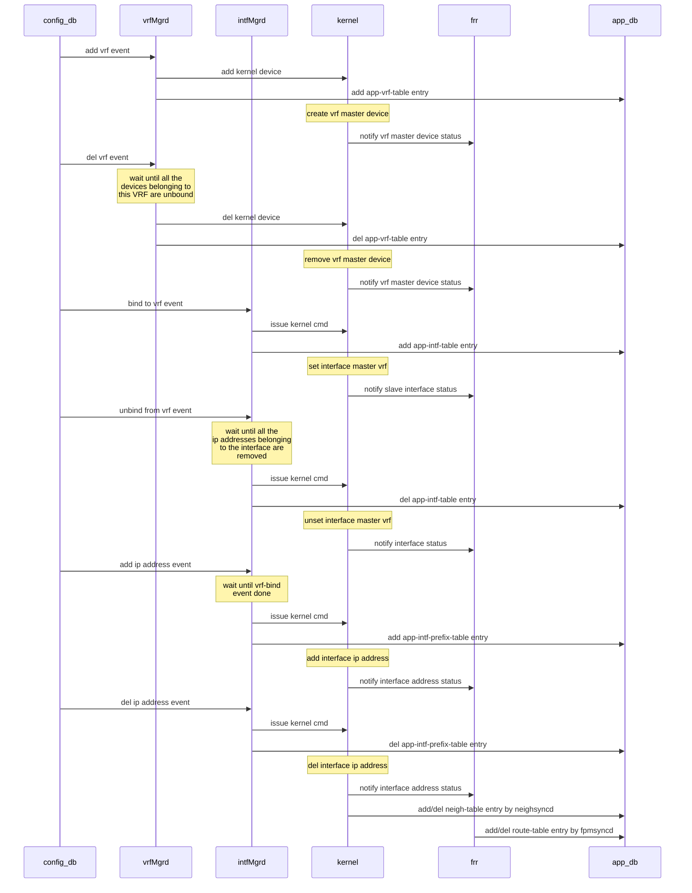
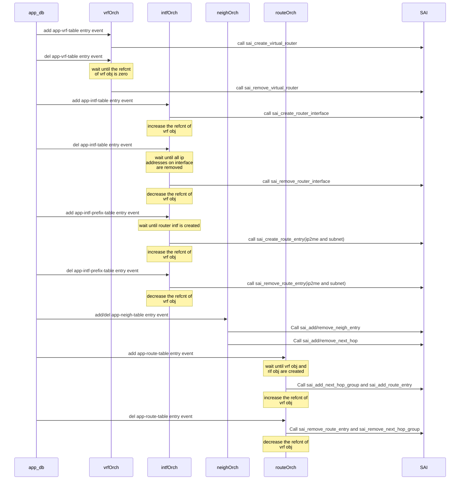

# SONiC VRF support design spec draft

Table of Contents
<!-- TOC -->

- [SONiC VRF support design spec draft](#sonic-vrf-support-design-spec-draft)
  - [Document History](#document-history)
  - [Abbreviations](#abbreviations)
  - [VRF feature Requirement](#vrf-feature-requirement)
  - [Dependencies](#dependencies)
  - [SONiC system diagram for VRF](#sonic-system-diagram-for-vrf)
  - [The schema changes](#the-schema-changes)
    - [Add VRF related configuration in config_db.json](#add-vrf-related-configuration-in-configdbjson)
    - [Change redirect syntax in acl_rule_table of configdb](#change-redirect-syntax-in-aclruletable-of-configdb)
    - [Add a VRF_TABLE in APP_DB](#add-a-vrftable-in-appdb)
    - [Add 2-segment key entry support in APP-intf-table](#add-2-segment-key-entry-support-in-app-intf-table)
    - [Add VRF key to app-route-table key list](#add-vrf-key-to-app-route-table-key-list)
  - [Event flow diagram](#event-flow-diagram)
  - [Agent changes](#agent-changes)
    - [vrfmgrd changes](#vrfmgrd-changes)
    - [intfsmgrd changes](#intfsmgrd-changes)
    - [nbrmgrd changes](#nbrmgrd-changes)
    - [fpmsyncd changes](#fpmsyncd-changes)
    - [vrforch changes](#vrforch-changes)
    - [intfsorch changes](#intfsorch-changes)
    - [routeorch changes](#routeorch-changes)
    - [neighorch changes](#neighorch-changes)
    - [aclorch changes](#aclorch-changes)
    - [warm-reboot consideration](#warm-reboot-consideration)
    - [TODO](#todo)
  - [CLI](#cli)
  - [user scenarios](#user-scenarios)
    - [Configure ip address without vrf feature](#configure-ip-address-without-vrf-feature)
    - [Add VRF and bind/unbind interfaces to this VRF](#add-vrf-and-bindunbind-interfaces-to-this-vrf)
    - [Delete vrf](#delete-vrf)
  - [Impact to other service after import VRF feature](#impact-to-other-service-after-import-vrf-feature)
  - [Progress](#progress)
  - [Test plan](#test-plan)
  - [Appendix - An alternative proposal](#appendix---an-alternative-proposal)
    - [vrf as key](#vrf-as-key)
    - [intfsmgrd changes](#intfsmgrd-changes-1)
    - [intfsorch changes](#intfsorch-changes-1)

<!-- /TOC -->

## Document History

| Version | Date       | Author       | Description                                      |
|---------|------------|--------------|--------------------------------------------------|
| v.01    | 06/07/2018 | Shine Chen, Andrew Xu  | Initial version from Nephos                      |
| v.02    | 06/08/2018 | Shine Chen       | Revised per Guohan/Prince(MSFT)           |
| v.03    | 09/18/2018 | Guohan Lu (MSFT)      | Format document                                  |
| v.04    | 01/17/2019 | Shine Chen, Jeffrey Zeng| Update after Sonic community review              |
| v.05    | 04/17/2019 | Xin Liu, Prince Sunny (MSFT)  | Update the status                                |
| v.06    | 05/09/2019 | Shine Chen, Jeffrey Zeng, Tyler Li | Add Some description and format adjustment |
| v1.0    | 05/26/2019 | Shine Chen, Jeffrey Zeng, Tyler Li, Ryan Guo | After review, move proposal-2 in v0.6 to Appendix

## Abbreviations

| **Term** | **Definition**                                                                                                                                  |
|----------|-------------------------------------------------------------------------------------------------------------------------------------------------|
| VRF      | Virtual routing forwarding                                                                                                                      |
| FRR      | FRRouting is an IP routing protocol suite for Linux and Unix platforms which includes protocol daemons for BGP, IS-IS, LDP, OSPF, PIM, and RIP  |
| Quagga   | Open IP routing protocol suite                                                                                                                  |
| RIB      | Routing Information Base                                                                                                                        |
| PBR      | Policy based routing         |

## VRF feature Requirement

1. Add or Delete VRF instance
2. Bind L3 interface to a VRF.

    L3 interface includes port interface, vlan interface, LAG interface and loopback interface.
3. Static IP route with VRF
4. Enable BGP VRF aware in SONiC
5. Fallback lookup.

The fallback feature which defined by RFC4364 is very useful for specified VRF user to access internet through global/main route. Some enterprise users still use this to access internet on vpn environment.

6. VRF route leaking between VRFs.

7. VRF Scalability: Currently VRF number can be supported up to 1000 after fixing a bug in FRR.

In this release, supporting requirement 5) and 6) are not supported. See next section for details.

Note: linux kernel use VRF master device to support VRF and it supports admin up/down on VRF master device. But we don't plan to support VRF level up/down state on SONIC.

## Dependencies

VRF feature needs the following software package/upgrade

1. Linux kernel 4.9

Linux Kernel 4.9 support generic IP VRF with L3 master net device. Every L3
master net device has its own FIB. The name of the master device is the
VRF's name. Real network interface can join the VRF by becoming the slave of
the master net device.

Application can get creation or deletion event of VRF master device via RTNETLINK,
as well as information about slave net device joining a VRF.

Linux kernel supports VRF forwarding using PBR scheme. It will fall to main
routing table to check do IP lookup. VRF also can have its own default network
instruction in case VRF lookup fails.

2. FRRouting is needed to support BGP VRF aware routing.

3. IProute2 version should be ss161212 or later to support iproute2 CLIs to configure the switch.

Example of using iproute2:

```bash
setup VRF | name: vrf-blue fib-table-id: 10
$ ip link add name vrf-blue type vrf table 10

enable VRF
$ ip link set dev vrf-blue up

disable fallback lookup on vrf-blue
$ ip [-6] route add table 10 unreachable default

bind sw1p3 device to vrf-blue
$ ip link set dev sw1p3 master vrf-blue

descend local table pref
ip [-6] rule add pref 32765 table local && ip [-6] rule del pref 0
```

4. SAI VRF support

SAI right now does not seem to have VRF concept, it does have VR.

We propose to implement VR as "virtual router" and VRF as "virtual router
forwarding"

VR is defined as a logical routing system. VRF is defined as forwarding
domain within a VR.

As this stage, we assume one VR per system. Only implement VRFs within this VR.

Accordingly, we need to add vrf_id to sai_Route_entry and add vrf attribute
to sai_routeInterface object.

An alternative method is using VR as VRF, this requires to add two attribution
to VR object to support Requirement 5) (fallback lookup). SAI community has
decided to take VR as VRF. So in this implementation release we use VR object as VRF object.
Here are the new flags we propose to add in the SAI interface:

```jason
/*
 * @brief if it is global vrf
 *
 * @type bool
 * @flags CREATE_AND_SET
 * @default true
 */
 SAI_VIRTUAL_ROUTER_ATTR_GLOBAL

/*
 * @brief continue to do global fib lookup while current vrf fib lookup
 *  missed
 *
 * @type bool
 * @flags CREATE_AND_SET
 * @default false
 */
 SAI_VIRTUAL_ROUTER_ATTR_FALLBACK
```

## SONiC system diagram for VRF

The following is high level diagram of modules with VRF support.


## The schema changes

### Add VRF related configuration in config_db.json

Note "fallback" keyword is not supported in this release.

Add vrf-table in config_db.json file.

```jason
"VRF": {
    "Vrf-blue": {
        "fallback":"true" //enable global fib lookup while vrf fib lookup missed
    },
    "Vrf-red":{
        "fallback": "true"
    },
    "Vrf-yellow":{
        "fallback":"false" //disable global fib lookup while vrf fib lookup missed
    }
},

```

Add vrf-binding information in config_db.json file.

```jason

"INTERFACE":{
    "Ethernet0":{
        "vrf_name":"Vrf-blue"  // vrf_name must start with "Vrf" prefix
    },
    "Ethernet1":{
        "vrf_name":"Vrf-red"
    },
    "Ethernet2":{}, // it means this interface belongs to global vrf. It is necessary even user doesnt use vrf.
    "Ethernet0|11.11.11.1/24": {},
    "Ethernet0|12.12.12.1/24": {},
    "Ethernet1|12.12.12.1/24": {},
    "Ethernet2|13.13.13.1/24": {}
},

"LOOPBACK_INTERFACE":{
    "Loopback0":{
        "vrf_name":"Vrf-yellow"
    },
    "Loopback0|14.14.14.1/32":{}
},

"VLAN_INTERFACE": {
    "Vlan100":{
        "vrf_name":"Vrf-blue"
    },
    "Vlan100|15.15.15.1/24": {}
},

"PORTCHANNEL_INTERFACE":{
    "Portchannel0":{
        "vrf_name":"Vrf-yellow"
    },
    "Portchannel0|16.16.16.1/24":{}
}

```

With this approach, there is no redundant vrf info configured with an interface where multiple IP addresses are configured.

Logically IP address configuration must be processed after interface binding to vrf is processed. In intfmgrd/intfOrch process intf-bind-vrf event must be handled before IP address event. So interface-name entry in config_db.json is necessary even user doesn't use VRF feature. e.g. `"Ethernet2":{}` in the above example configuration. For version upgrade compatibility we need to add a script, this script will convert old config_db.json to new config_db.json at bootup, then the new config_db.json would contain the interface-name entry for interfaces associated in the global VRF table.

### Change redirect syntax in acl_rule_table of configdb

The existing acl_rule_table definition is the following.

```jason

    "table1|rule1": {
        "L4_SRC_PORT": "99",
        "PACKET_ACTION": "REDIRECT:20.1.1.93,30.1.1.93"
    },
    "table1|rule2": {
        "L4_SRC_PORT": "100",
        "PACKET_ACTION": "REDIRECT:20.1.1.93"
    },

```

To support vrf the nexthop key should change to `{IP,interface}` pair from single `{IP}`. So new acl_rule_table should like the following.

```jason

    "table1|rule1": {
        "L4_SRC_PORT": "99",
        "PACKET_ACTION": "REDIRECT:20.1.1.93|Ethernet10,30.1.1.93|Ethernet11"
    },
    "table1|rule2": {
        "L4_SRC_PORT": "100",
        "PACKET_ACTION": "REDIRECT:20.1.1.93|Ethernet11"
    },

```

### Add a VRF_TABLE in APP_DB

```jason
;defines virtual routing forward table
;
;Status: stable

key = VRF_TABLE:vrf_name ;
fallback = "true"/"false"
```

### Add 2-segment key entry support in APP-intf-table

There are two reasons why adding 2-segment key entry in interface table.

1. Multiple ip addresses can be configured on one interface. So we put common attribute of interface into app-intf-table and keep ip-prefix specific attribute on app-intf-prefix-table.
2. Interface can be put to specific VRF before ip address is configured on it.

app-intf-table is defined as the following:

```json
;defines logical network interfaces, an attachment to a PORT name
;
;Status: stable

key = INTF_TABLE:ifname
mtu = 1\*4DIGIT ; MTU for the interface
VRF_NAME = 1\*64VCHAR ;
```

app-intf-prefix-table is defined as the following corresponding to config_db definition.


```json
;defines logical network interfaces with IP-prefix, an attachment to a PORT and
list of 0 or more ip prefixes;

;Status: stable
key = INTF_TABLE:ifname:IPprefix ; an instance of this key will be repeated for each prefix
IPprefix = IPv4prefix / IPv6prefix ; an instance of this key/value pair will be repeated for each prefix
scope = "global" / "local" ; local is an interface visible on this localhost only
mtu = 1\*4DIGIT ; MTU for the interface  (move to INTF_TABLE:ifname table)
family = "IPv4" / "IPv6" ; address family
```

### Add VRF key to app-route-table key list

```jason
;Stores a list of routes
;Status: Mandatory

key = ROUTE_TABLE:vrf_name:prefix ;
nexthop = \*prefix, ;IP addresses separated "," (empty indicates no gateway)
intf = ifindex? PORT_TABLE.key ; zero or more separated by "," (zero indicates no interface)
blackhole = BIT ; Set to 1 if this route is a blackhole (or null0)
```

Since global vrf name is null character string, the route key with global vrf will collapse to `ROUTE_TABLE:prefix`.
The non-global vrf_name must start with "Vrf" prefix. So it can differ from ipv6 address.

## Event flow diagram







## Agent changes

### vrfmgrd changes

- Listening to VRF creation/deletion configuration in config_db. Once detected,
update kernel using iproute2 CLIs and write VRF information to app-VRF-table.
- When vrfmgrd receives VRF delete event it wont process the event till all the devices belonging to this VRF are unbound from the VRF. Slave device information can be retrieved from kernel.
- vrfmgrd process will be placed in swss docker. In case of swss docker warm reboot, since VRF device is still retained in kernel, when vrfmgrd starts up it will recover the VRF system state from kernel.

### intfsmgrd changes

Ip address event and vrf binding event need to be handled seperately. These two events has sequency dependency.

- Listening to interface binding to specific VRF configuration in config_db.
  - bind to vrf event:
    - bind kernel device to master vrf
    - add interface entry with vrf attribute to app-intf-table.
    - set intf-bind-vrf flag on statedb
  - unbind from vrf event:
    - wait until all ip addresses associated with the interface is removed. Ip address infomation can be retrieved from kernel.
    - bind kernel device to global vrf
    - del interface entry with vrf attribute from app-intf-table
    - unset vrf-binding flag on statedb
- Listening to interface ip address configuration in config_db.
  - add ip address event: wait until intf-bind-vrf flag is set, set ip address on kernel device and add {interface_name:ip address} entry to app-intf-prefix-table
  - del ip address event:
    - unset ip address on kernel device
    - del {interface_name:ip address} entry from app-intf-prefix-table.

An ideal approach is to handle the two events similar to what Linux kernel is doing. e.g. if the IP address is configured in an interface first, it will be accepted. Later on when the interface is enslaved to a VRF, the IP address from the master FIB will be removed, and reprogrammed to the VRF table. But this approach is very complicated to support. e.g. it may have IP address conflict in the destination VRF, and the current SONiC infrastructure cannot detect and protect it. So this approach is not supported in this VRF release.

### nbrmgrd changes

- Listening to neighhor configuration on configdb, add neighbor entry to kernel only after the corresponding intf-bind-vrf event is processed. In the current implementation neighbor may be added to kernel before intf-bind-vrf event. After intf-bind-vrf event kernel will flush all neighbors associated with this interface, the neighbor configuration get lost.

### fpmsyncd changes

- fpmsyncd will add VRF support, it can use rtnl_route_get_table to get VRF table ID.
But with the current FRR implementation, this API returns the master devices' ifIndex for
this VRF. The VRF name of Prefix can be derived from ifindex.
- The key of app-route-table is "vrf_name:prefix".
- The route from FRR has nexthop information which contain nexthop_ipaddress and interface index. Nexthop interface contain vrf information. It is available for route-leak scenarios.

### vrforch changes

- Monitoring app-VRF-table, using sai_create_virtual_router_fn or
sai_remove_virtual_router_fn defined in saivirtualrouter.h to track (VR, VRF) creation/deletion and save (vrf_name, vrf-vid) pairs.
- When vrforch receives vrf-delete event for a given VRF, this VRF object should be deleted after routes and router interfaces related this VRF are removed. Neigh object related VRF is implicit guaranteed by router interface object related VRF.

### intfsorch changes

- add vrforch as a member of intfsorch
- intfsorch monitors app-intf-table and app-intf-prefix-table.
  - When app-intf-table change
    - bind to vrf event: create router interface with vrf attribute and increase refcnt of vrforch.
    - unbind from vrf event: wait until all ip addresses on interface is removed, then remove router interface with vrf attribute, decreasing refcnt of vrforch
  - When app-intf-prefix-table change
    - add ip address event: wait until route interface is created ,then set ip address on existing router interface.
    - del ip address event: unset ip address on existing router interface.
- Move add/del subnet-route code to routeorch. In existing implementation when route interface is down, subnet routes associated with the interface still exist. It could result in a stale state and correct route configured from fpmsyncd will be rejected by routeorch. It makes sense that fpmsyncd/routeorch handles all route configurations except ip2me route. Nephos has submit this PR to swss community(<https://github.com/Azure/sonic-swss/pull/878>). To support vrf these code will be refined to support vrf feature.

  This change is necessary for vrf route-leak scenarios too. For example, interface Ethernet1 currently belongs to Vrf_blue , its ip address is 10.1.1.1/24. Another vrf domain Vrf_red imports all Vrf_blue route. Then there is a route like "Vrf_red:10.1.1.0/24 Ethernet1" in BGP route. When fpmsyncd pushes this route to routeorch, routeorch will drop it silently.

### routeorch changes

- Add vrforch as a member of routeorch
- Once app-route-table has new udpate, get VRF object ID from vrforch by vrf_name.
- Nexthop key is changed to ``(ipaddress, intf_name)`` pair from ``ipaddress``.
- The key of Nexthop group is the set of nexthop key.
- The value of routetable is changed to the set of ``(ipaddress, intf_name)`` pair from ``ipaddresses``
- Expand single routetable to mutiple routetables with vrf ID as the key
- Update refcnt of vrforch
- handle the adding/deling of subnet-route

### neighorch changes

- the Key of Nexthop now is changed from only ipaddress to a pair of
    ``(ipaddress, intf_name)``.

### aclorch changes

- the Key of redirect-nexthop is changed from only ip address to a pair of
    ``(ipaddress, intf_name)``.

### warm-reboot consideration

- During warm-reboot, the syncd-docker uses heuristic algorithm to find vrf object in apply-view process. In some circumstance wrong vrf object may be chosen due to the algorithm imperfection. Then all routes and route interfaces belong to the vrf will been deleted and added in SAI. This will lead to traffic disrruption for quite a while. The improvement for heuristic algorithm is beyond this document scope.
- vrfmgrd process will be placed in swss docker. In case of swss docker warm reboot, since VRF device is still retained in kernel, when vrfmgrd starts up it will recover the VRF system state from kernel.

### TODO

- (Mirror,tunnel,PBR) to be designed in future.

## CLI

VRF configuration can be done via SONiC Click CLIs framework In this release, new CLIs are proposed as following:

```bash
//create a VRF:
$ config vrf add <vrf_name>

//remove a VRF
$ config vrf del <vrf_name>

//bind an interface to a VRF
$ config interface <interface_name> vrf bind <vrf_name>

//unbind an interface from a VRF
$ config interface <interface_name> vrf unbind

// show attributes for a given vrf
$ show vrf [<vrf_name>]

// show the list of router interfaces
$ show router-interface [vrf <vrf_name>]

//add IP address to an interface.  The command already exists in SONiC, but will be enhanced
$ config interface <interface_name> ip add <ip_addr/mask>

//remove an IP address from an interface. The command already exists in SONiC, but will be enhanced.
$ config interface <interface_name> ip del <ip_addr/mask>

//add a prefix to a VRF
$ config route add [vrf <vrf_name>] prefix <route_prefix/mask> nexthop <[vrf <vrf_name>] <ip> | dev <dev_name>>

//remove a prefix from a VRF
$ config route del [vrf <vrf_name>] prefix <route_prefix/mask> nexthop <[vrf <vrf_name>] <ip> | dev <dev_name>>

//show prefixes in a given VRF. The existing command is enhanced to take VRF as the key
$ show ip route [vrf < all | vrf_name>]

```

## User scenarios

Here are some of the use cases and configuration steps.

### Configure ip address without vrf feature

If a user does not care about VRF configuration, it can simply use this command to configure the IP address of an interface. This IP address is attached to the main FIB table.

Lets use Ethernet0 as an example in this document.

```bash

$ config interface Ethernet0 ip add 1.1.1.1/24

```

This command is enhanced to do the following:

- Read info from config_db
- Check if ```INTERFACE|Ethernet0``` entry exists in the db.
  - If not, create ```INTERFACE|Ethernet0``` entry with global vrf attribute on configdb. Then, add the corresponding IP address to config_db.
  - If yes, add the corresponding IP address to config_db.

To remove IP address from an interface:

```bash

$ config interface Ethernet0 ip remove 1.1.1.1/24

```

This command is enhanced to do the following:

- Read info from config_db
- Remove IP address from config_db.
- Check other IP address(es) on Ethernet0.
  - If other IP addresses exist in db, no further action is taken.
  - If no other IP address exists and interface is belonging to global vrf, remove ```INTERFACE|Ethernet0``` entry on configdb.

### Add VRF and bind/unbind interfaces to this VRF

In this case, user wants to configure a VRF "Vrf-blue", with interfaces attached to this VRF. Following are the steps:

```bash

$ config vrf add Vrf-blue
$ config interface Ethernet0 vrf bind Vrf-blue

```

The Bind command will do the following:

- Read info from config_db
- Check if IP addresses exists for Ethernet0. If yes, delete all IP addresses from the interface
- Bind the interface to Vrf-blue (it will eventually create Ethernet0 router interface)

```bash

$ config interface Ethernet0 ip add 1.1.1.1/24

```

This command will do the following:

- add IP address to config_db

To unbind an interface from VRF:

```bash

$ config interface Ethernet0 vrf unbind

```

This command will do the following:

- Read config_db
- check if IP addresses exists. If yes, delete all IP addresses from the interface
- Delete all attributes, delete router interface(Ethernet0)

### Delete vrf

User wants to delete a VRF (Vrf-blue), here are the steps:
This set of commands will perform the work:

```bash

$ show vrf Vrf-blue
This will to get interface list belonging to Vrf-blue from app_db
$ config interface Ethernet0 ip remove 1.1.1.1/24
This will remove all IP addresses from the interfaces belonging to the VRF.
$ config interface Ethernet0 vrf unbind
This will unbind all interfaces from this VRF
$ config vrf del Vrf-blue
This command will delete the VRF.

```

To simplify the user experience, we can combine the above commands to create one single command, similar to the iprotue2 command:`# ip link del Vrf-blue`
This is the current proposal:

```bash

$ config vrf del Vrf-blue

```

This command will do the following:

- get interface list belonging to Vrf-blue from app_db
- delete interface(s) IP addresses
- unbind interfaces(s) from Vrf-blue
- del Vrf-blue

## Impact to other service after import VRF feature

For apps that don't care VRF they don't need to modify after sonic import VRF.

Linux supports "VRF-global" socket from kernel 4.5.  The socket listened by
service are VRF-global by default unless the VRF instance is specified. It
means the service can accept connection over all VRFs. Connected sockets are
bound to the VRF domain in which the connection originates.

Take teamd as an example. Teamd is layer2 apps and it doesn't care VRF
attribute. Sample Teamd code is shown below. It
uses VRF-global socket for every port-channel member port.

```c
{
    sock = socket(PF_PACKET, type, 0);
    err = attach_filter(sock, fprog, alt_fprog);
    memset(&ll_my, 0, sizeof(ll_my));
    ll_my.sll_family = AF_PACKET;
    ll_my.sll_ifindex = ifindex;
    ll_my.sll_protocol = family;
    ret = bind(sock, (struct sockaddr \*) &ll_my, sizeof(ll_my));
}
```

Put port-channel in different VRF instance doesn't affect vrf-global socket
to receive lacp protocol packet from member port. So teamd doesn't  need to
be modified or restarted for VRF binding event.

For layer 3 apps such as snmpd or ntpd they are using vrf-global socket too.
So they are vrf-transparent too.

## Progress

In the diagram, fpmsyncd, vrfmgrd, intfsmgrd, intfsorch are checked into the master branch. There may need changes to support VRF. Other components are working in progress, will be committed as planned.

## Test plan

A separate test plan document will be uploaded and reviewed by the community

## Appendix - An alternative proposal

The VRF binding and IP address configuration dependency can be solved in a different way. There are other areas to be considered as well to make the VRF feature support solid. A different proposal is also considered, discussed but rejected by the community. It's listed here for future reference.

Major areas to be addressed in the above chosen proposal are: 

1)	VRF bind and IP config message sequence dependency
2)	Need INTERFACE|Ethernet0:{}, even if user does not use VRF config. Not compatible with JSON file.
3)	Not compatible with the existing JSON file, need a script to convert
4)	Warm reboot implementation become complicated
5)	Unit test cases (swss and Ansible) are not compatible, need test case modification
6)	Add more wait states in each daemon, may have performance impact

### vrf as key

Using this syntax in the config_db.json can also solve the sequence dependency:

```jason
"INTERFACE":{
    "Ethernet2|Vrf-blue|12.12.12.1/24": {}
    "Ethernet2|Vrf-blue|13.13.13.1/24": {}
    "Ethernet3|14.14.14.1/24": {}  // global vrf
},

....

```

Here "Vrf-blue" is part of the IP address configuration of the interface. 

Since it is very complicated to carry IP addresses when an interface moves from one VRF to another VRF, the current implementation is when interface moves from one VRF to another VRF, the IP address will be deleted. Because of this, we can treat VRF as part of the key of interface entry, but not an attribute. This solution has following advantage:

- It can eliminate intf-bind-vrf event and ip-address event sequence dependency, intfMgrd/intfsorch implemetation is much easier. Simple is better.
- It is fully compatible with both old config file and existing ansible testcases.

app-intf-prefix-table can be defined as following. Vrf_name is part of the key.

```json
;defines logical network interfaces with IP-prefix, an attachment to a PORT and
list of 0 or more ip prefixes;

;Status: stable
key = INTF_TABLE:ifname:Vrf_name:IPprefix ; an instance of this key will be repeated for each prefix
IPprefix = IPv4prefix / IPv6prefix ; an instance of this key/value pair will be repeated for each prefix
scope = "global" / "local" ; local is an interface visible on this localhost only
mtu = 1\*4DIGIT ; MTU for the interface  (move to INTF_TABLE:ifname table)
family = "IPv4" / "IPv6" ; address family
```

Since global vrf name is null character string, the key of the interface belonging to global vrf will collapse to INTF_TABLE:ifname:IPprefix.

### intfsmgrd changes

With this proposal IP address event is arrived with vrf information. It eliminates sequency dependency between ip address event and vrf binding event.

- Listening to interface binding event in config_db. It is almost same as proposal 1 except no need to set vrf-binding flag
- listening to interface ip address configuration in config_db.
  - add ip address event:
    - if vrf_name is not global vrf, bind kernel device to master vrf
    - set ip address on kernel device
    - add {interface_name:vrf:ip address} entry to app-intf-vrf-prefix-table.
  - del ip address:
    - unset ip address on kernel device
    - del {interface_name:vrf:ip address} entry from app-intf-vrf-prefix-table.

### intfsorch changes

With this proposal, the following will be changed:

- add vrforch as a member of intfsorch
- intfsorch monitors app-intf-table and app-intf-vrf-prefix-table.
  - When app-intf-table change
    - bind to vrf event: if router interface is not existed, create router interface with vrf attribute and increase refcnt of vrforch.
    - unbind from vrf event: wait until all ip addresses on interface is removed, then remove router interface with vrf attribute and decrease refcnt of vrforch
  - When app-intf-vrf-prefix-table change.
    - add ip address event: If router interface is not existed , create router interface with vrf attribute and increase refcnt of vrforch. Then set ip address on existing router interface.
    - del ip address event: unset ip address on existing router interface. If all ip addresses is removed from interface and vrf_name is global vrf, remove router interface.
